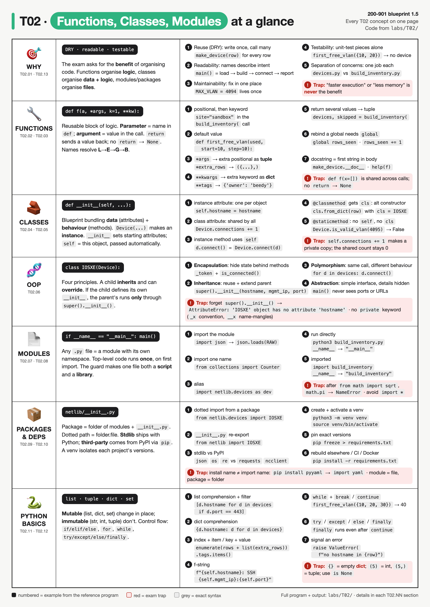
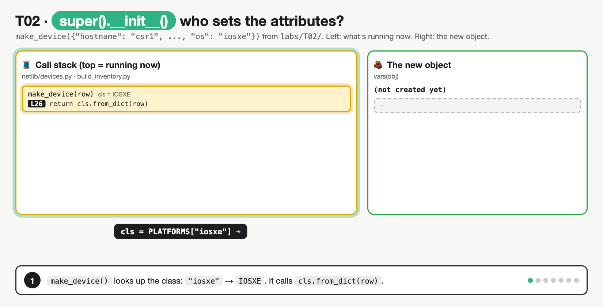

# T02 · Functions, classes, modules

> Owner: **Beedy** · Blueprint: **1.5** · CBT coverage: **Full** · Learn by 2026-10-05 · Teach-back 2026-10-08



*Every T02 concept on one page. Rows follow the concept sections; numbered examples are lines from the reference program in `labs/T02/`, and red boxes are exam traps.*

## TL;DR (teach-back card)

- **Why organise code (the 1.5 answer):** reuse (DRY), readability, maintainability (fix once), testability (unit-test each piece), separation of concerns.
- **Three levels:** function = reusable block of logic · class = blueprint bundling data + behaviour, `__init__` sets attributes, methods take `self` · module = a `.py` file / namespace; package = folder of modules.
- **Script vs module:** `if __name__ == "__main__":` runs code only when the file is executed directly, not when imported.
- **Trap:** a function with no `return` returns `None`; a mutable default (`def f(x=[])`) is created **once** and shared across calls.

## Concepts

Every section below explains one part of the same small program, so read the program once first. It's a two-file package plus a script that builds a device inventory and "connects" to each device. The files are in `labs/T02/`. Run `cd labs/T02 && python3 build_inventory.py`.

```
labs/T02/
├── build_inventory.py      script AND importable module
└── netlib/                 package (folder of modules)
    ├── __init__.py
    └── devices.py          module: Device, IOSXE, NXOS classes
```

**`netlib/devices.py`**

```python
"""Device classes for the T02 reference program."""

MAX_VLAN = 4094                                   # module-level (global) constant


class Device:
    """Base class for any managed device."""

    vendor = "Cisco"                              # class attribute: one value shared by all instances
    connections = 0                               # class attribute used as a shared counter

    def __init__(self, hostname, mgmt_ip, port=22):
        self.hostname = hostname                  # instance attributes: one set per object
        self.mgmt_ip = mgmt_ip
        self.port = port
        self._token = None                        # leading underscore = internal (encapsulation)

    def connect(self):
        """Instance method: works on one object through self."""
        Device.connections += 1
        self._token = f"tok-{self.hostname}"
        return f"{self.hostname}: SSH {self.mgmt_ip}:{self.port}"

    def is_connected(self):
        """Public way to read the internal _token."""
        return self._token is not None

    @classmethod
    def from_dict(cls, data):
        """Class method: gets the class as cls, so IOSXE.from_dict() builds an IOSXE."""
        return cls(data["hostname"], data["mgmt_ip"])

    @staticmethod
    def is_valid_vlan(vlan_id):
        """Static method: a plain helper that needs neither self nor cls."""
        return 1 <= vlan_id <= MAX_VLAN


class IOSXE(Device):                              # inheritance: an IOSXE is a Device
    def __init__(self, hostname, mgmt_ip, port=443):
        super().__init__(hostname, mgmt_ip, port)  # run Device.__init__ first
        self.api = "RESTCONF"                     # then add what is specific to IOS XE

    def connect(self):                            # override: same name, new behaviour (polymorphism)
        super().connect()                         # reuse the parent's counter and token logic
        return f"{self.hostname}: {self.api} https://{self.mgmt_ip}:{self.port}/restconf"


class NXOS(Device):                               # no __init__ here, so Device.__init__ is used
    def connect(self):
        super().connect()
        return f"{self.hostname}: NX-API https://{self.mgmt_ip}/ins"
```

**`netlib/__init__.py`**

```python
"""netlib: tiny network-automation package (T02 reference program)."""
from netlib.devices import Device, IOSXE, NXOS  # re-export: lets callers write `from netlib import IOSXE`
```

**`build_inventory.py`**

```python
"""Build a device inventory and connect to each device.

Works as a script (python3 build_inventory.py) and as a module (import build_inventory).
"""
import json                                       # standard library: ships with Python
from collections import Counter                   # standard library, `from` form

import netlib.devices as dev                      # our package, dotted path + alias
from netlib import IOSXE, NXOS, Device            # names re-exported by netlib/__init__.py

PLATFORMS = {"iosxe": IOSXE, "nxos": NXOS}        # global: maps the "os" field to a class
rows_seen = 0                                     # global counter, rebound inside a function

RAW = """[
  {"hostname": "csr1", "mgmt_ip": "10.10.20.48", "os": "iosxe"},
  {"hostname": "n9k1", "mgmt_ip": "10.10.20.58", "os": "nxos"},
  {"mgmt_ip": "10.10.20.77", "os": "iosxe"}
]"""


def make_device(row):
    """Return the right Device subclass for one row, or raise ValueError."""
    if "hostname" not in row:
        raise ValueError(f"no hostname in {row}")
    cls = PLATFORMS.get(row.get("os"), Device)    # unknown or missing os -> plain Device
    return cls.from_dict(row)


def build_inventory(rows, *extra_rows, site="lab", **tags):
    """Turn rows into devices. Returns a tuple: (devices, skipped row numbers)."""
    global rows_seen                              # needed because we assign to the global
    devices, skipped = [], []
    for i, row in enumerate(rows + list(extra_rows)):
        try:
            device = make_device(row)
        except ValueError as err:
            skipped.append(i)
            print(f"  skip row {i}: {err}")
            continue
        else:                                     # only runs when no exception was raised
            device.site = site
            device.tags = dict(tags)              # copy: otherwise every device shares one dict
            devices.append(device)
        finally:                                  # always runs, even after continue
            rows_seen += 1
    return devices, skipped


def first_free_vlan(used, start=10, step=10):
    """Return the first VLAN ID not in used, stepping by step."""
    vlan = start
    while vlan <= dev.MAX_VLAN:
        if vlan not in used:
            break
        vlan += step
    return vlan


def summary(devices):
    """Print a report. There is no return statement, so this returns None."""
    total = len(devices)
    if total == 0:
        print("No devices")
    elif total == 1:
        print("1 device")
    else:
        counts = Counter(type(d).__name__ for d in devices)
        print(f"{total} devices: {dict(counts)}")


def main():
    rows = json.loads(RAW)                        # JSON text -> list of dicts (T06)
    devices, skipped = build_inventory(
        rows,
        {"hostname": "box1", "mgmt_ip": "10.10.20.99"},  # lands in *extra_rows
        site="sandbox",                                  # keyword argument
        owner="beedy",                                   # owner and env land in **tags
        env="dev",
    )
    for d in devices:
        print(" ", d.connect())                   # same call, different behaviour per class

    by_host = {d.hostname: d for d in devices}    # dict comprehension
    https_hosts = [d.hostname for d in devices if d.port == 443]  # list comprehension + filter

    result = summary(devices)
    print("summary() returned:", result)
    print("Skipped rows:", skipped, "| rows seen:", rows_seen)
    print("csr1 connected?", by_host["csr1"].is_connected())
    for key, value in by_host["csr1"].tags.items():   # loop over a dict's key/value pairs
        print(f"  tag {key}={value}")
    print("HTTPS devices:", https_hosts)
    print("Connections (class attribute):", Device.connections)
    print("VLAN 4095 valid?", Device.is_valid_vlan(4095))
    print("First free VLAN:", first_free_vlan({10, 20, 30}))
    print("Docstring:", make_device.__doc__)
    print("__name__ =", __name__)


if __name__ == "__main__":
    main()
```

**Output** (`python3 build_inventory.py`, Python 3.14):

```
  skip row 2: no hostname in {'mgmt_ip': '10.10.20.77', 'os': 'iosxe'}
  csr1: RESTCONF https://10.10.20.48:443/restconf
  n9k1: NX-API https://10.10.20.58/ins
  box1: SSH 10.10.20.99:22
3 devices: {'IOSXE': 1, 'NXOS': 1, 'Device': 1}
summary() returned: None
Skipped rows: [2] | rows seen: 4
csr1 connected? True
  tag owner=beedy
  tag env=dev
HTTPS devices: ['csr1']
Connections (class attribute): 3
VLAN 4095 valid? False
First free VLAN: 40
Docstring: Return the right Device subclass for one row, or raise ValueError.
__name__ = __main__
```

Running `python3 -c "import build_inventory; print(build_inventory.__name__)"` prints only `build_inventory`, because `main()` doesn't run on import.

### T02.01 · Why organise code

**Must cover:**

- [x] Reuse (DRY): write logic once, call it many times
- [x] Readability: small named units describe intent
- [x] Maintainability: fix a bug in one place
- [x] Testability: functions/classes can be unit-tested in isolation
- [x] Separation of concerns: each unit does one job; teams can work on separate modules

**Notes:**

- Blueprint 1.5 asks about the **benefits**, not the syntax. The program shows each one:

| Benefit | Where it shows in the program |
|---|---|
| Reuse (DRY, "Don't Repeat Yourself") | `make_device()` is written once and called for every row. `Device.connect()` logic is reused by both subclasses via `super()` |
| Readability | `main()` reads as steps: load rows → build inventory → connect → summarise |
| Maintainability | VLAN limit lives in one constant, `MAX_VLAN`; adding a platform = one new class + one line in `PLATFORMS` |
| Testability (T32) | `make_device()` and `first_free_vlan()` take plain inputs and return values, so they can be unit-tested without a device |
| Separation of concerns | `devices.py` knows about devices; `build_inventory.py` knows about input and reporting. Two people could own one file each |

- Functions organise **logic**, classes organise **data + logic together**, modules and packages organise **files**.
- Distractor answers: "faster execution", "less memory". Organising code doesn't make it faster.

### T02.02 · Functions

**Must cover:**

- [x] Define with def name(params): and call with name(args)
- [x] Parameters = names in the definition; arguments = values passed in
- [x] Positional vs keyword args (f(1, b=2)); default values (def f(a, b=10))
- [x] *args collects extra positional args as a tuple; **kwargs collects extra keyword args as a dict
- [x] return sends a value back; no return statement means the function returns None

**Notes:**

- Look at one signature, which uses every parameter kind:

  ```python
  def build_inventory(rows, *extra_rows, site="lab", **tags):
  ```

  and the call in `main()`:

  ```python
  build_inventory(rows, {"hostname": "box1", ...}, site="sandbox", owner="beedy", env="dev")
  ```

| Parameter | Kind | Gets in the call above |
|---|---|---|
| `rows` | positional | the parsed JSON list |
| `*extra_rows` | extra positional → **tuple** | `({"hostname": "box1", ...},)` |
| `site="lab"` | keyword with default | `"sandbox"` (the default `"lab"` is used if omitted) |
| `**tags` | extra keyword → **dict** | `{"owner": "beedy", "env": "dev"}` |

- **Parameter** = name in the `def` line (`rows`). **Argument** = value passed in the call (`rows` list, `"sandbox"`).
- Positional arguments match by order and come **first**. Keyword arguments match by name. `f(site="x", rows)` → `SyntaxError`.
- Parameters after `*extra_rows` (`site`) can **only** be passed by keyword.
- Defaults are evaluated **once**, when `def` runs. That's why `device.tags = dict(tags)` makes a copy, and why `def f(x=[])` is a trap.
- **`return`:**
  - `build_inventory` returns `devices, skipped` → a **tuple**, unpacked in `main()` with `devices, skipped = build_inventory(...)`.
  - `summary()` has no `return` → returns **`None`**. The output line `summary() returned: None` proves it.

### T02.03 · Functions

**Must cover:**

- [x] Local variables exist only inside the function; global variables live at module level
- [x] LEGB lookup order: Local, Enclosing, Global, Built-in
- [x] global keyword needed to reassign a global inside a function
- [x] Docstring = first string inside a function/class; read by help()

**Notes:**

- In the program:
  - `PLATFORMS`, `rows_seen`, `RAW` → **global** (module level of `build_inventory.py`).
  - `devices`, `skipped`, `i`, `row` inside `build_inventory()` → **local**. Gone when the function returns.
- **LEGB** order Python searches for a name: **L**ocal → **E**nclosing (outer function, for nested functions) → **G**lobal (module) → **B**uilt-in.
  - In `make_device()`, `PLATFORMS` isn't local → found in **G**lobal. `len` in `summary()` → found in **B**uilt-in.
- **Reading** a global needs nothing: `make_device()` just reads `PLATFORMS`.
- **Assigning** to a global needs `global`: `build_inventory()` does `rows_seen += 1`, so it declares `global rows_seen`.
  - Without it → `UnboundLocalError`. The assignment makes `rows_seen` local for the **whole** function, so `+= 1` reads it before it exists.
  - `nonlocal name` = the same idea for an enclosing function's variable.
- **Docstring** = first string in a function/class/module body. `make_device.__doc__` (printed in the output) or `help(make_device)` reads it.

### T02.04 · Methods

**Must cover:**

- [x] A method is a function defined inside a class and called on an object (obj.method())
- [x] self = reference to the instance, passed automatically as the first argument
- [x] Instance method uses self; @classmethod gets cls; @staticmethod gets neither
- [x] Example: router.get_interfaces() vs a plain get_interfaces(router)

**Notes:**

- **Method** = function defined inside a class, called on an object.
  - `d.connect()` in `main()` is a **method call**. `make_device(row)` is a plain **function call**.
  - Same idea as `router.get_interfaces()` vs `get_interfaces(router)`.
- `self` = the object the method was called on. Python passes it automatically: for a plain `Device`, `d.connect()` runs as `Device.connect(d)`. It's a naming convention, not a keyword, but it must be the first parameter.
- All three method kinds are in `Device`:

| Kind | In the program | First parameter | Called as | Used for |
|---|---|---|---|---|
| Instance | `connect(self)`, `is_connected(self)` | `self` (the object) | `d.connect()` | read or change one object's attributes |
| Class | `@classmethod from_dict(cls, data)` | `cls` (the class) | `IOSXE.from_dict(row)` | alternative constructor |
| Static | `@staticmethod is_valid_vlan(vlan_id)` | none | `Device.is_valid_vlan(4095)` | helper that belongs with the class but needs no object or class |

- Why `from_dict` takes `cls` and not a hard-coded `Device`: `make_device()` calls `cls.from_dict(row)` with `cls = IOSXE`, so `cls(...)` builds an **IOSXE**. A hard-coded `Device(...)` would always build the base class.

### T02.05 · Classes

**Must cover:**

- [x] class Device: defines a blueprint; d = Device(...) creates an instance (object)
- [x] __init__(self, ...) is the constructor that sets initial attributes
- [x] Instance attributes (self.hostname) are per object; class attributes are shared by all instances
- [x] Objects bundle data (attributes) and behaviour (methods)

**Notes:**

- **Class** = blueprint: `class Device:`. **Instance** (object) = one thing built from it: `cls(data["hostname"], data["mgmt_ip"])` inside `from_dict` creates one.
- `__init__(self, hostname, mgmt_ip, port=22)` runs automatically on creation and sets the starting attributes.
  - Strictly it's the **initialiser** (`__new__` creates the object). The exam calls `__init__` the constructor.
- **Instance attributes** (`self.hostname`, `self.port`) are separate per object: csr1 and n9k1 each have their own.
- **Class attributes** (`vendor`, `connections`) are written in the class body and shared by every instance.
  - `connect()` updates `Device.connections += 1` **through the class**, so the count is shared. The output says `3`.
  - `self.connections += 1` instead would create a new instance attribute on each object, hiding the class one, and `Device.connections` would stay `0`.
- Attributes can be added after creation: `device.site = site` in `build_inventory()`.
- Bundle of data + behaviour: each `Device` carries its own hostname/IP **and** knows how to `connect()`.

### T02.06 · OOP principles

**Must cover:**

- [x] Encapsulation: hide internal state behind methods (convention: _private attributes)
- [x] Inheritance: class Switch(Device) reuses parent code; super().__init__() calls the parent constructor
- [x] Polymorphism: different classes expose the same method name (e.g. connect()) with different behaviour
- [x] Abstraction: expose a simple interface, hide implementation detail

**Notes:**

| Principle | One-liner | Where in the program |
|---|---|---|
| Encapsulation | Keep state inside the object; expose it through methods | `_token` is internal (leading `_`). Callers use `is_connected()` instead of reading `_token` |
| Inheritance | A child class reuses and extends a parent | `class IOSXE(Device)`, `class NXOS(Device)` |
| Polymorphism | Same method name, different behaviour per class | `for d in devices: d.connect()` gives RESTCONF, NX-API or SSH depending on the class |
| Abstraction | Simple interface, details hidden | `main()` calls `connect()` without knowing ports, URLs or tokens |

- **Encapsulation:** Python has no `private` keyword. `_name` = "internal" by convention. `__name` triggers name mangling to `_Device__name`.
- **Inheritance and `super()`:**
  - `IOSXE` defines its own `__init__`, so `Device.__init__` does **not** run unless it calls `super().__init__(hostname, mgmt_ip, port)`. Remove that line and `self.hostname` never gets set → `AttributeError`.
  - `NXOS` defines **no** `__init__`, so it inherits `Device.__init__` automatically (port stays 22; its URL doesn't use the port).



*`make_device()` building an IOSXE, one line per frame: the classmethod gets `cls = IOSXE` → `IOSXE.__init__` runs first on an empty object → `super()` jumps to `Device.__init__`, which sets `hostname`, `mgmt_ip`, `port`, `_token` → back in the child for `api`. The last frame deletes the `super()` line: only `api` gets set, and the error appears later in `connect()`. This fixes the belief that a parent's `__init__` runs automatically.*
- **Overriding:** `IOSXE.connect()` replaces `Device.connect()`. It still calls `super().connect()` to reuse the counter and token logic, then returns its own string.

### T02.07 · Modules

**Must cover:**

- [x] A module is any .py file; its functions/classes/variables live in its own namespace
- [x] import math then math.sqrt(); from math import sqrt then sqrt()
- [x] import pandas as pd creates an alias
- [x] Avoid from x import * (pollutes the namespace, hides where names come from)

**Notes:**

- **Module** = any `.py` file. `devices.py` and `build_inventory.py` are both modules. Each has its own namespace, so `dev.MAX_VLAN` can't clash with a `MAX_VLAN` defined elsewhere.
- Every import form appears at the top of `build_inventory.py`:

| Statement | Binds the name(s) | Used as |
|---|---|---|
| `import json` | `json` | `json.loads(RAW)` |
| `from collections import Counter` | `Counter` only | `Counter(...)` (`collections` is **not** defined) |
| `import netlib.devices as dev` | alias `dev` | `dev.MAX_VLAN` |
| `from netlib import IOSXE, NXOS, Device` | those three names | `IOSXE`, `Device.connections` |
| `from x import *` (not used) | every public name, or those in `__all__` | avoid: pollutes the namespace, can overwrite your own names, hides where names came from |

- A module's top-level code runs **once**, on the first import. Later imports reuse the cached copy in `sys.modules`.

### T02.08 · Modules

**Must cover:**

- [x] __name__ is "__main__" when the file is run directly, and the module name when imported
- [x] if __name__ == "__main__": main() lets a file act as both a script and an importable module
- [x] Code outside this guard runs on import, which is usually unwanted

**Notes:**

- Last two lines of `build_inventory.py`:

  ```python
  if __name__ == "__main__":
      main()
  ```

- `python3 build_inventory.py` → `__name__ == "__main__"` → `main()` runs. The output's last line shows `__name__ = __main__`.
- `import build_inventory` → `__name__ == "build_inventory"` → `main()` is skipped. The functions are now available to another script or a unit test (`build_inventory.first_free_vlan({10})`).
- So one file is both a **script** and a **library**.
- Code **outside** the guard runs on every import. If `main()` were called at the bottom without the guard, importing the file would print the whole report.

### T02.09 · Packages

**Must cover:**

- [x] A package is a directory of modules, traditionally with __init__.py
- [x] Import from packages with dotted paths: from mypkg.utils import parse
- [x] Standard library ships with Python (json, os, sys, unittest, xml)
- [x] Third-party packages come from PyPI (requests, ncclient, xmltodict, pyyaml)

**Notes:**

- **Package** = directory of modules, traditionally with `__init__.py`. Here: `netlib/`.
  - `__init__.py` runs when the package is first imported. It can be empty, or it can **re-export** names. `netlib/__init__.py` imports the classes so callers can write `from netlib import IOSXE` instead of `from netlib.devices import IOSXE`.
  - Since Python 3.3 a folder without `__init__.py` still imports as a *namespace package* (PEP 420). For the exam, package = folder + `__init__.py`.
- **Dotted path** = folder.file: `netlib.devices` → `netlib/devices.py`.
- **Standard library** = ships with Python, no install: `json`, `collections` (both used here), plus `os`, `sys`, `re`, `unittest`, `xml.etree.ElementTree`, `csv`, `logging`.
- **Third-party** = from PyPI via `pip`: `requests`, `ncclient`, `xmltodict`, `pyyaml`, `netmiko`, `pyats`. The program uses none, so it runs on a bare Python.
  - The install name can differ from the import name: `pip install pyyaml` → `import yaml`.

### T02.10 · Dependencies

**Must cover:**

- [x] pip install requests installs from PyPI; pip freeze > requirements.txt records versions
- [x] pip install -r requirements.txt recreates the set on another machine
- [x] python3 -m venv venv then source venv/bin/activate isolates project dependencies
- [x] Why: avoid version clashes between projects and keep the system Python clean

**Notes:**

- This program has no third-party dependencies. A real version would add `requests` to call RESTCONF. Full flow (also in **Examples**):
  - `python3 -m venv venv` → isolated environment. `source venv/bin/activate` → use it. `deactivate` → leave it.
  - `pip install requests` → install from PyPI into the venv only.
  - `pip freeze > requirements.txt` → pin exact versions (`requests==2.32.3`).
  - `pip install -r requirements.txt` → rebuild the same set on another machine, in CI, or in a Docker image (T27).
- **Why:** project A needs `ncclient` 0.6 while project B needs 0.7. Separate venvs keep them apart and leave the system Python clean.

### T02.11 · Python basics

**Must cover:**

- [x] Types: str, int, float, bool, None; list (ordered, mutable), tuple (ordered, immutable), dict (key/value), set (unique, unordered)
- [x] Mutable vs immutable: lists/dicts change in place; strings/tuples do not
- [x] Comprehensions: [x*2 for x in nums if x > 0]; {k: v for k, v in pairs}
- [x] f-strings: f"{host} is {status}"

**Notes:**

- Types as they appear in the program:

| Type | In the program | Ordered | Mutable | Note |
|---|---|---|---|---|
| `list` | `devices`, `skipped`, `json.loads(RAW)` | yes | yes | `.append()`; `rows + list(extra_rows)` joins two lists |
| `tuple` | `extra_rows`, the `return devices, skipped` value | yes | **no** | a 1-item tuple needs a comma: `(1,)` |
| `dict` | `PLATFORMS`, each JSON row, `tags`, `by_host` | insertion order (3.7+) | yes | keys must be immutable; `{}` is an **empty dict** |
| `set` | `{10, 20, 30}` passed to `first_free_vlan` | **no** | yes | unique items, fast `in` test; empty set = `set()` |
| `str` | `hostname`, f-strings | yes | **no** | methods return a **new** string |
| `None` | `self._token = None`, `summary()` result | | | test with `is None` |

- Scalars: `str`, `int` (`port`), `float`, `bool` (`True`/`False`, capitalised), `None`.
- **Mutable trap in the program:** `device.tags = dict(tags)` makes a copy. `device.tags = tags` would point every device at the **same** dict, so changing one would change all. `b = a` copies the reference, not the data.
- **Comprehensions:**
  - List with a filter: `[d.hostname for d in devices if d.port == 443]` → `['csr1']`.
  - Dict: `{d.hostname: d for d in devices}` → lookup by name.
  - Generator (no brackets, inside a call): `Counter(type(d).__name__ for d in devices)`.
- **f-strings:** `f"{self.hostname}: SSH {self.mgmt_ip}:{self.port}"`. Any expression works inside `{}`.

### T02.12 · Python basics

**Must cover:**

- [x] if / elif / else; comparison and logical operators (and, or, not, in)
- [x] for item in iterable; for i, x in enumerate(list); for k, v in dict.items()
- [x] while loops; break exits the loop, continue skips to the next iteration
- [x] try / except SomeError / else / finally; raise to throw an exception

**Notes:**

- Every control-flow form is in the program:
  - **`if / elif / else`:** `summary()` branches on 0, 1 or many devices.
  - **`in` / `not in`:** `"hostname" not in row` checks a dict's **keys**. `vlan not in used` checks a set.
  - **`is`:** `self._token is not None`. Use `is` only for `None`; `==` compares values.
  - **`for` + `enumerate`:** `for i, row in enumerate(...)` gives (index, item) from 0. That's why the skipped row is number `2`.
  - **`for` over `dict.items()`:** `for key, value in ....tags.items()` gives (key, value) pairs.
  - **`while` + `break`:** `first_free_vlan()` loops until it finds a free ID, then `break`s out. With `{10, 20, 30}` used, it returns `40`.
  - **`continue`:** in `build_inventory()`, it jumps to the next row after a bad one.
- **Exceptions:**
  - `raise ValueError(...)` in `make_device()` signals a bad row.
  - `try / except ValueError as err / else / finally` in `build_inventory()`:
    - `except`: runs only when that error is raised → row skipped.
    - `else`: runs only when **no** exception → device kept.
    - `finally`: **always** runs, even after `continue` → `rows_seen` counts all 4 rows.
  - `requests` raises `HTTPError` only when you call `resp.raise_for_status()`. A 404 response on its own doesn't raise anything.

### T02.13 · Exam angle

**Must cover:**

- [x] Expect "what is the benefit of organising code into functions/classes/modules?" style questions
- [x] Expect short Python snippets where you predict the output or spot the error
- [x] Know vocabulary: method vs function, class vs instance, module vs package

**Notes:**

- **"Benefit" questions:** pick reuse, readability, maintainability, testability or modularity. Wrong answers claim **speed** or **memory**.
- **Snippet questions:** walk the program in your head and check, in order:
  - indentation
  - `self` on instance methods
  - a missing `return` (→ `None`)
  - the import form (`math.` prefix or not)
  - `super().__init__()` in a child with its own `__init__`
  - the `__name__` guard
- **Vocabulary:**
  - function (`make_device`) vs method (`connect`)
  - class (`Device`) vs instance (`csr1` object)
  - module (`devices.py`) vs package (`netlib/`) vs library (a loose term for a collection of packages)
  - parameter (`rows`) vs argument (the list passed in)

## Exam traps

- **No `return` → `None`.** `x = print("hi")` makes `x` `None`.
- **Mutable default argument:** `def add(v, l=[])` shares one list across every call. Fix it with `l=None` and then `if l is None: l = []`.
- **`from math import sqrt`** does **not** bind `math`, so `math.pi` afterwards → `NameError`. `import math` needs the `math.` prefix.
- **Missing `self`:** `def show():` inside a class, called as `obj.show()` → `TypeError: ... takes 0 positional arguments but 1 was given`.
- **Child `__init__` without `super().__init__()`:** the parent's attributes are never set → `AttributeError` later.
- **Assigning to a global without `global`** creates a local. Reading it first in the same function → `UnboundLocalError`.
- **`{}` is an empty dict**, not a set. **`(5)` is an int**; `(5,)` is a tuple.
- **`__name__` in an imported module** is the module's name, so code under the `__main__` guard **doesn't run** on import.
- **`*args` is a tuple and `**kwargs` is a dict**, not lists.
- **`self.counter += 1` on a class attribute** creates an instance attribute that hides the class one, so the shared value never changes. Update it through the class: `Device.connections += 1`.
- **Benefit of functions/classes/modules ≠ performance.** Pick reuse, readability, testability or maintainability.

## Examples

The reference program in **Concepts** is the main example. Run it, then import it:

```bash
cd labs/T02
python3 build_inventory.py
python3 -c "import build_inventory; print('imported, __name__ =', build_inventory.__name__)"
python3 -c "import build_inventory; print(build_inventory.first_free_vlan({10, 20}))"
```

Or in the lab container, from the repo root:

```bash
docker build --tag ccna-auto-lab:latest --file labs/Dockerfile labs/
docker run --rm --volume "$(pwd)":/work --workdir /work/labs/T02 ccna-auto-lab:latest python build_inventory.py
```

Things to try, to break it on purpose:

- Delete `super().__init__(hostname, mgmt_ip, port)` in `IOSXE` → `AttributeError: 'IOSXE' object has no attribute 'hostname'`.
- Change `Device.connections += 1` to `self.connections += 1` → output shows `Connections (class attribute): 0`.
- Delete `global rows_seen` → `UnboundLocalError`.
- Replace the `if __name__ == "__main__":` guard with a bare `main()` → the import commands print the whole report.

Short traps that aren't in the program. Run each one to see it fail or surprise:

```bash
python3 - <<'EOF'
def add(v, l=[]):            # mutable default
    l.append(v)
    return l
print(add(1), add(2))        # [1, 2] [1, 2]  (same list both times)

def no_return():
    x = 5
print(no_return())           # None

count = 0
def bump():
    try:
        count += 1           # assignment makes count local → error
    except UnboundLocalError as e:
        print("UnboundLocalError:", e)
bump()

print(type({}), type((5)), type((5,)))   # dict, int, tuple

def f(*args, **kwargs):
    print(type(args).__name__, args, type(kwargs).__name__, kwargs)
f(1, 2, vlan=10)             # tuple (1, 2) dict {'vlan': 10}
EOF
```

Venv and dependencies, with full commands:

```bash
mkdir -p ~/t02-venv && cd ~/t02-venv
python3 -m venv venv
source venv/bin/activate
pip install requests xmltodict pyyaml
pip freeze > requirements.txt
cat requirements.txt
deactivate
```

## Practice questions

**Q1.** A team keeps copying the same 40-line login routine into every API script. Moving it into a single shared function **mainly** improves which two things? (Choose two.)
A. Execution speed  B. Maintainability  C. Network latency  D. Code reuse  E. Memory usage

<details><summary>Answer</summary>

**B, D.** Write it once (reuse), and a fix happens in one place (maintainability). Organising code isn't about performance. (T02.01)
</details>

**Q2.** What does this print?

```python
def tag(vlan, name="default"):
    label = f"{vlan}-{name}"

print(tag(10, name="users"))
```

A. `10-users`  B. `10-default`  C. `None`  D. `SyntaxError`

<details><summary>Answer</summary>

**C.** `tag` has no `return`, so it returns `None`. (T02.02)
</details>

**Q3.** Complete the code so `IOSXE` sets `hostname` through its parent class:

```python
class Device:
    def __init__(self, hostname):
        self.hostname = hostname

class IOSXE(Device):
    def __init__(self, hostname, port):
        ________________
        self.port = port
```

A. `Device = hostname`  B. `super().__init__(hostname)`  C. `self.__init__(hostname)`  D. `super.hostname = hostname`

<details><summary>Answer</summary>

**B.** `super().__init__(hostname)` runs the parent initialiser. Option C would call `IOSXE.__init__` again and fail. (T02.06)
</details>

**Q4.** A file `checks.py` ends with `if __name__ == "__main__": run_all()`. Another script runs `import checks`. What happens?

A. `run_all()` runs once during the import  B. `run_all()` doesn't run; `checks.__name__` is `"checks"`  C. `ImportError`  D. `run_all()` runs every time a function from `checks` is called

<details><summary>Answer</summary>

**B.** When the file is imported, `__name__` is the module name, so the guarded block is skipped. (T02.08)
</details>

**Q5.** Put these steps in order to give a new machine the same dependency set as the developer's laptop:
1. `pip install -r requirements.txt`
2. `pip freeze > requirements.txt` (on the laptop)
3. `source venv/bin/activate`
4. `python3 -m venv venv`

<details><summary>Answer</summary>

**2 → 4 → 3 → 1.** Freeze the versions on the source machine, then on the new machine create the venv, activate it and install from the file. (T02.10)
</details>

**Q6.** Which statement about these decorators is correct?

A. A `@staticmethod` receives the instance as its first argument  B. A `@classmethod` receives the class as `cls` and is often used as an alternative constructor  C. Both decorators require `self`  D. A `@classmethod` can't be called on the class itself

<details><summary>Answer</summary>

**B.** A classmethod gets `cls`, as in `Device.from_dict(...)`. A staticmethod gets no implicit argument. (T02.04)
</details>

**Q7.** After `from math import sqrt`, which line raises `NameError`?

A. `sqrt(16)`  B. `print(sqrt)`  C. `math.sqrt(16)`  D. `x = sqrt(2) * 2`

<details><summary>Answer</summary>

**C.** `from ... import` binds only `sqrt`. The name `math` is never created. (T02.07)
</details>

**Q8.** Which term matches each item? (a) a `.py` file you can import, (b) a folder of modules with `__init__.py`, (c) a function defined inside a class.

A. (a) package (b) module (c) method  B. (a) module (b) package (c) method  C. (a) module (b) library (c) static function  D. (a) class (b) package (c) attribute

<details><summary>Answer</summary>

**B.** module = file, package = folder of modules, method = function in a class. (T02.13)
</details>

## Study aids

| Aid | Type | Title | Est. min | Resource |
|---|---|---|---|---|
| T02.1 | Video | Code structures, functions/methods, OOP videos (1.5x) | 21 | CBT: Basic Programming Control Flow |

- Skip / low priority: Syntax basics (you know them)

## Sources

- Overview image: HTML source `assets/T02/00-overview.html`, rendered to PNG (see `assets/README.md`).
- Animation: `assets/T02/01-super-init-anim.html` → `.gif`. Frame order and attribute values come from a `sys.settrace` run of `make_device()`.
- Python tutorial, Defining Functions: https://docs.python.org/3/tutorial/controlflow.html#defining-functions
- Python tutorial, Classes (scopes, `self`, inheritance, private variables): https://docs.python.org/3/tutorial/classes.html
- Python tutorial, Modules and Packages: https://docs.python.org/3/tutorial/modules.html
- `__main__`, top-level code environment: https://docs.python.org/3/library/__main__.html
- Built-ins `classmethod` / `staticmethod`: https://docs.python.org/3/library/functions.html#classmethod
- Errors and exceptions (`try`/`except`/`else`/`finally`): https://docs.python.org/3/tutorial/errors.html
- Virtual environments and packages: https://docs.python.org/3/tutorial/venv.html
- PEP 420, implicit namespace packages: https://peps.python.org/pep-0420/
- pip freeze: https://pip.pypa.io/en/stable/cli/pip_freeze/

## To verify

- None version-sensitive. These are core Python behaviours, stable across Python 3.
- The reference program (`labs/T02/`) and the trap snippets were run locally on Python 3.14, and the output shown is real. The four break-it edits in **Examples** were also run, and they give the errors shown. The venv/pip block wasn't run, because it needs network access to PyPI.
