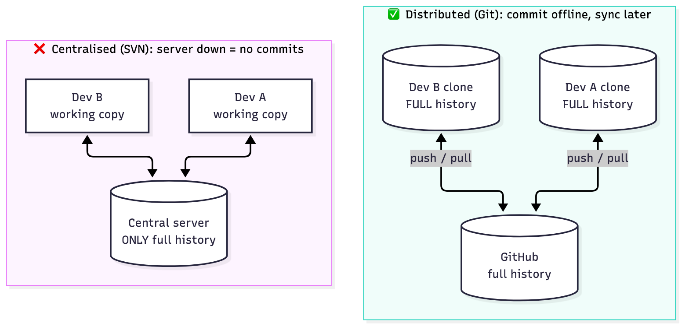
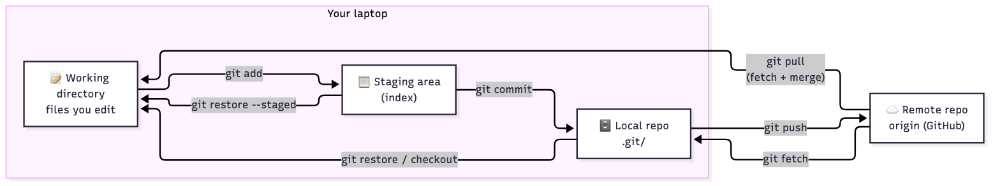
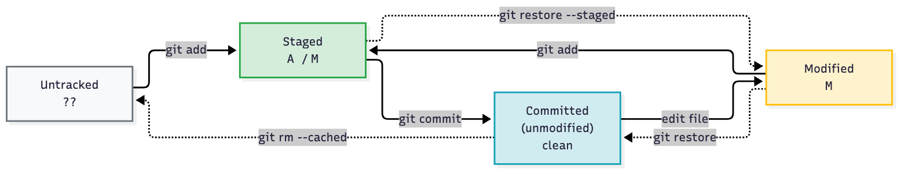
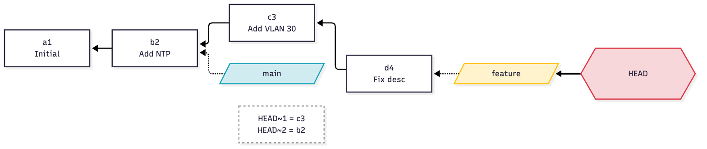
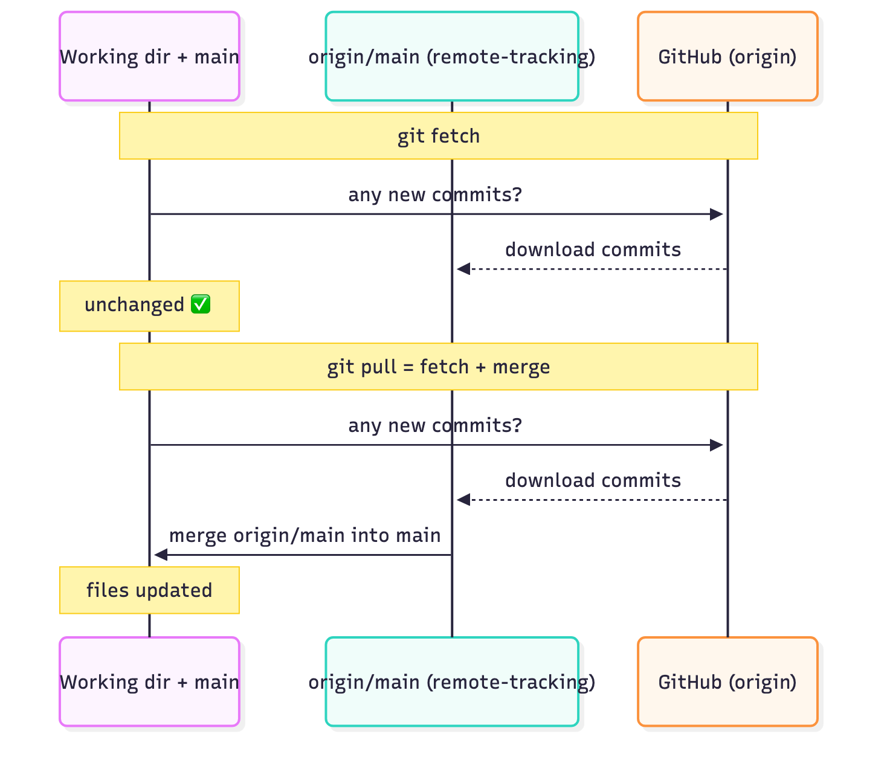
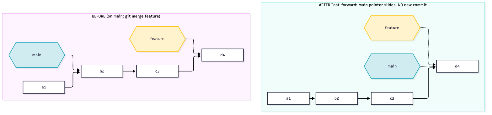
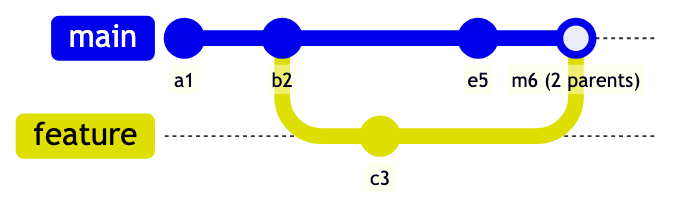
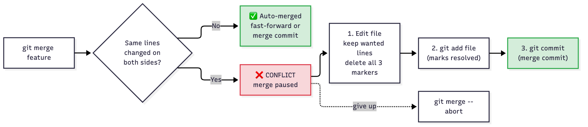
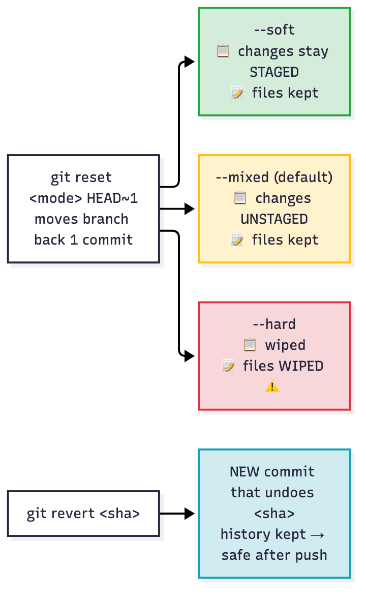
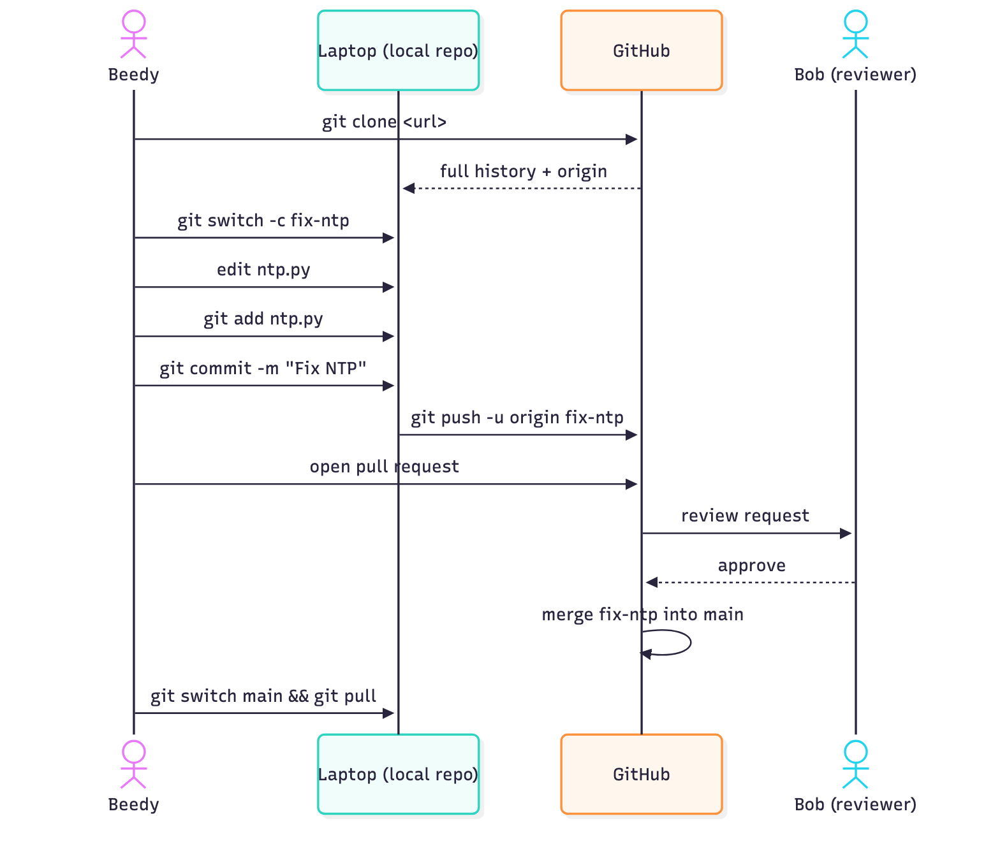

# T04 · Git + version control

> Owner: **Beedy** · Blueprint: **1.7, 1.8** · CBT coverage: **Full** · Learn by 2026-10-05 · Teach-back 2026-10-08

## TL;DR (teach-back card)

- **Why version control (1.7):** history (who/what/when/why), rollback, parallel branches, collaboration via PRs, CI/CD triggers. Git is **distributed**: every clone has full history, commit offline.
- **Four areas:** working dir → `add` → staging → `commit` → local repo → `push` → remote. `git diff` = unstaged; `git diff --staged` = staged vs last commit.
- **Merge:** fast-forward (no new commit) vs merge commit (both sides moved). Conflict markers `<<<<<<< HEAD` (yours) `=======` `>>>>>>> branch` (theirs) → edit, `git add`, `git commit`.
- **Trap:** `reset` rewrites history (local only); `revert` adds an undo commit (safe on pushed branches). `rm --cached` keeps the file on disk; `rm` deletes it. `fetch` doesn't touch your branch; `pull` = fetch + merge.

## Concepts

### T04.01 · Version control

**Must cover:**

- [x] Full history of every change: who, what, when and why (commit message)
- [x] Rollback to any earlier version
- [x] Parallel work through branches without overwriting each other
- [x] Collaboration and review via a shared remote
- [x] Enables automation: CI/CD pipelines trigger on commits

**Notes:**

- **Exam answer to "advantages of version control" (1.7):** history/audit trail, rollback, parallel work (branches), collaboration + review, automation trigger.
- History = every commit records **author, timestamp, message, parent, snapshot** → answers who/what/when/why.
- Rollback = check out, `revert` or `reset` to any earlier commit.
- Branches isolate work → two people edit the same repo without overwriting each other.
- Shared remote (GitHub/GitLab) → pull requests, code review (links to T46, blueprint 5.13).
- CI/CD (T28) triggers on push/merge → version control is the foundation of NetDevOps.
- Distractors: "faster code execution", "encrypts the code", "removes need for testing" are **not** advantages.

### T04.02 · Version control

**Must cover:**

- [x] Centralised (e.g. SVN): one central server holds the history; clients need it to commit
- [x] Distributed (Git): every clone has the full history; commit offline, sync later
- [x] Git trade-off: more resilient and faster locally, but you must push/pull to share

**Notes:**

| | Centralised (SVN, CVS) | Distributed (Git, Mercurial) |
|---|---|---|
| Full history lives | Only on central server | In **every** clone |
| Commit offline | No | Yes (commit local, push later) |
| Single point of failure | Server | None: any clone can restore |
| Speed of log/diff/branch | Network-bound | Local, fast |
| Cost | Simple model | Must push/pull to share; more concepts |

- Exam: "developer on a plane commits changes" → distributed.




*Centralised: only the server holds history. Distributed: every clone is a full backup.*

### T04.03 · Git model

**Must cover:**

- [x] Working directory: the files you edit
- [x] Staging area (index): changes selected for the next commit (git add)
- [x] Local repository (.git): committed snapshots
- [x] Remote repository (e.g. origin on GitHub): shared copy you push to / pull from

**Notes:**

- Four places, moved between by commands:



*Left to right = saving work (add → commit → push). Right to left = getting work back (fetch, pull, restore).*

- Staging area = `.git/index`. Lets you commit **some** of your changes, not all.
- Local repo = `.git/` folder. Delete it → folder is no longer a repo.
- `origin` = default **name** of the remote that `git clone` creates. Just a label, not special.

### T04.04 · Git model

**Must cover:**

- [x] Untracked: new file Git does not know about
- [x] Modified: tracked file changed but not staged
- [x] Staged: change added to the index
- [x] Committed: saved in the repository; each commit has a SHA-1 hash
- [x] HEAD = pointer to the current commit/branch

**Notes:**

- File lifecycle: **untracked → (add) staged → (commit) committed/unmodified → (edit) modified → (add) staged …**




*Solid = moves work forward. Dotted = undo. The code under each state is what `git status --short` prints.*
- `git status --short` codes: `??` untracked · ` M` modified, not staged · `M ` staged · `A ` new file staged · `D ` deleted staged.
- Commit ID = **SHA-1 hash** (40 hex chars; `--oneline` shows first 7). Hash of content + metadata + parent → any change = new hash. ⚠ verify: Git also supports SHA-256 repos; SHA-1 remains the default.
- **HEAD** = pointer to the current branch (which points to its latest commit). `HEAD~1` = parent of HEAD.
- Detached HEAD = HEAD points to a commit, not a branch (e.g. `git checkout <sha>`).




*HEAD → branch → commit. Each commit points back to its parent. Branches are just labels on commits.*

### T04.05 · Commands: start

**Must cover:**

- [x] git init: create a new repo in the current folder
- [x] git clone <url>: copy a remote repo, sets remote "origin"
- [x] git config --global user.name / user.email: identity on commits
- [x] git remote add origin <url>; git remote -v lists remotes

**Notes:**

- `git init` → creates `.git/` in the current folder. No remote yet.
- `git clone <url>` → downloads full history, checks out default branch, **adds remote `origin` automatically**.
- `git config --global user.name "Beedy"` / `git config --global user.email "..."` → stamped on every commit. `--global` = `~/.gitconfig`; no flag = this repo only (`.git/config`).
- `git remote add origin <url>` → link an `init`-ed repo to a remote. `git remote -v` → list remotes with fetch/push URLs.
- Trap: after `git init` you need `remote add` before `push`; after `clone` you don't.

### T04.06 · Commands: change

**Must cover:**

- [x] git add <file> or git add .: stage changes
- [x] git rm <file>: delete from disk and stage the deletion
- [x] git rm --cached <file>: stop tracking but keep the file on disk (e.g. before adding to .gitignore)
- [x] git mv old new: rename and stage
- [x] git commit -m "msg": commit staged changes; git commit -a -m stages tracked files automatically

**Notes:**

- `git add <file>` / `git add .` → stage new, modified **and deleted** files from the current dir down (Git 2.x). `git add -A` = whole repo.
- `git rm <file>` → deletes from disk **and** stages the deletion.
- `git rm --cached <file>` → stops tracking, **file stays on disk** (shows as untracked). Classic fix for a committed `.env`: `git rm --cached .env` + add to `.gitignore` + commit. History still contains the secret → rotate it.
- `git mv old new` → rename + stage in one step (same as `mv` + `git rm old` + `git add new`).
- `git commit -m "msg"` → commits **only staged** changes.
- `git commit -a -m "msg"` → auto-stages **tracked** modified/deleted files. **Does not add untracked files.**

### T04.07 · Commands: inspect

**Must cover:**

- [x] git status: which files are untracked / modified / staged
- [x] git log, git log --oneline: commit history
- [x] git show <commit>: details and diff of one commit
- [x] git diff: working directory vs staging area
- [x] git diff --staged (or --cached): staging area vs last commit

**Notes:**

- `git status` → state of each file (untracked / modified / staged) + branch ahead/behind.
- `git log` → full history; `git log --oneline` → one line per commit; `--graph` → branch/merge ASCII graph.
- `git show <commit>` → that commit's metadata **plus its diff**.
- **Diff matrix (most-tested):**

| Command | Compares | Shows |
|---|---|---|
| `git diff` | working dir vs **staging** | unstaged changes |
| `git diff --staged` (= `--cached`) | staging vs **last commit** | what the next commit will contain |
| `git diff HEAD` | working dir vs last commit | all uncommitted changes |
| `git diff a b` | two commits/branches | changes between them |

- Trap (verified in drill): after `git add`, plain `git diff` prints **nothing**. Changes moved to `--staged`.
- Reading the output (`---`/`+++`/`@@`) → [T05 · Unified diffs](T05-unified-diffs.md).

### T04.08 · Commands: sync

**Must cover:**

- [x] git push origin <branch>: upload local commits
- [x] git fetch: download remote commits but do not change your branch
- [x] git pull = git fetch + git merge (or rebase if configured)

**Notes:**

- `git push origin <branch>` → upload local commits. `git push -u origin <branch>` first time sets upstream.
- `git fetch` → downloads remote commits into `origin/<branch>` (remote-tracking branch). **Your branch and working files untouched.** Safe "look before you merge".
- `git pull` = **`git fetch` + integrate** (merge, or rebase if `--rebase` / `pull.rebase=true`).
- ⚠ verify: current git-pull docs say default with no config is **fast-forward only** → `pull` **fails** with "divergent branches" hint if both sides have new commits (confirmed on Git 2.54 here). Exam still expects **pull = fetch + merge**.
- Push rejected ("non-fast-forward") → someone pushed first → `pull` then `push`.




*`fetch` stops at `origin/main`. `pull` goes one step further and merges into your branch.*

### T04.09 · Branching

**Must cover:**

- [x] git branch: list; git branch <name>: create
- [x] git checkout <name> or git switch <name>: move to a branch
- [x] git checkout -b <name> / git switch -c <name>: create and switch
- [x] git branch -d <name>: delete a merged branch

**Notes:**

- `git branch` → list (`*` = current). `git branch <name>` → create, **don't switch**.
- `git checkout <name>` or `git switch <name>` → move HEAD to branch.
- `git checkout -b <name>` / `git switch -c <name>` → create **and** switch.
- `git branch -d <name>` → delete, refuses if unmerged. `-D` → force delete.
- Branch = lightweight movable pointer to a commit; creating one is instant.
- `switch`/`restore` (Git 2.23) split the overloaded `checkout`. Exam may show either.

### T04.10 · Merging

**Must cover:**

- [x] git merge <branch>: merge into the current branch
- [x] Fast-forward: no new commit, the pointer just moves ahead
- [x] Merge commit: created when both branches have new commits
- [x] Rebase (awareness): replays your commits on top of another branch for a linear history

**Notes:**

- `git merge <branch>` → merges `<branch>` **into the branch you're on**. So: `git switch main` then `git merge feature`.
- **Fast-forward:** main has no new commits since feature branched → pointer slides forward, **no merge commit**. Output says `Fast-forward`.
- **Merge commit (3-way):** both branches have new commits → new commit with **two parents**. Output: `Merge made by the 'ort' strategy.` (Git ≥ 2.34 default; older Git and older screenshots say `'recursive'`, same meaning).
- `git merge --no-ff` → force a merge commit even if FF possible (keeps branch visible in history).




*Fast-forward: `main` hasn't moved since `feature` branched, so the `main` label just slides to `d4`.*



*Merge commit: both branches moved (`c3` and `e5`), so Git creates `m6` with two parents.*
- **Rebase** (awareness): `git rebase main` on feature → replays feature commits on top of main → linear history, **rewrites hashes** → don't rebase shared/pushed branches.

### T04.11 · Conflicts

**Must cover:**

- [x] Conflict = both branches changed the same lines
- [x] Markers: <<<<<<< HEAD (your version) ======= (theirs) >>>>>>> branch
- [x] Resolve: edit the file, remove markers, git add, then git commit

**Notes:**

- Conflict = both branches changed **the same lines** (or one edited, one deleted). Different lines/files → auto-merged.
- Git stops: `CONFLICT (content): Merge conflict in config.txt` → `Automatic merge failed; fix conflicts and then commit the result.`
- Markers (real output from drill):

```
<<<<<<< HEAD
hostname R1-CORE        <- current branch (the one you're merging INTO)
=======
hostname R1-EDGE        <- incoming branch
>>>>>>> feature
```

- Resolve: edit file → keep wanted lines, **delete all three marker lines** → `git add <file>` → `git commit`.
- Bail out: `git merge --abort`.
- Trap: `git add` marks it resolved; commit alone without add won't work.




*Resolve in three steps (edit → add → commit), or abort.*

### T04.12 · Undo

**Must cover:**

- [x] git reset --soft: move HEAD, keep changes staged
- [x] git reset --mixed (default): move HEAD, unstage changes, keep files
- [x] git reset --hard: discard changes entirely
- [x] git revert <commit>: new commit that undoes an old one; safe on shared branches
- [x] git restore <file> / git checkout -- <file>: discard working-directory changes

**Notes:**

- **reset** moves the branch pointer back (rewrites history). Three modes (verified in drill):

| Mode | HEAD moves | Staging | Working files |
|---|---|---|---|
| `--soft` | yes | changes **kept staged** | kept |
| `--mixed` (default) | yes | **unstaged** | kept |
| `--hard` | yes | wiped | **wiped** (lost) |




*Green → yellow → red = how much you lose. Blue = revert, the only one safe after push.*

- **revert:** `git revert <sha>` → **new commit** that undoes `<sha>`. History intact → **safe on shared/pushed branches**.
- Scenario → answer: "undo a bad commit already pushed to main" → `revert`. "Undo my last local commit but keep the work" → `reset --soft HEAD~1`.
- Discard working-dir edits to a file: `git restore <file>` (new) / `git checkout -- <file>` (old).
- Unstage but keep edits: `git restore --staged <file>` / `git reset <file>`.

### T04.13 · Other

**Must cover:**

- [x] .gitignore: patterns of files Git should not track (secrets, venv, build output)
- [x] git stash / git stash pop: shelve uncommitted changes temporarily
- [x] git tag v1.0: label a release commit
- [x] Fork + pull request: propose changes to a repo you do not own

**Notes:**

- `.gitignore` → patterns: `*.pyc`, `venv/`, `.env`, `__pycache__/`. Only affects **untracked** files. Already-tracked file → needs `git rm --cached` first.
- `git stash` → shelves uncommitted changes, clean working dir. `git stash list`, `git stash pop` (apply + drop), `git stash apply` (apply, keep in list).
- `git tag v1.0` → lightweight tag on HEAD. `git tag -a v1.0 -m "msg"` → annotated. Push tags: `git push origin v1.0` (not pushed by plain `git push`).
- **Fork** = server-side copy of someone else's repo under your account (GitHub feature, not a Git command). **Pull request** = ask the upstream owner to merge your branch. Clone ≠ fork.

### T04.14 · Exam angle

**Must cover:**

- [x] "Which command…" questions are the main format
- [x] Ordering a workflow: clone > branch > edit > add > commit > push > pull request > merge
- [x] Classic pairs: fetch vs pull, reset vs revert, rm vs rm --cached, diff vs diff --staged

**Notes:**

- Format: "which command…", scenario → command, and drag-and-drop ordering.
- Canonical workflow order: **clone → branch (switch -c) → edit → add → commit → push → open pull request → review → merge**.




*The full team flow, which is also the answer to the drag-and-drop ordering questions.*
- Four classic pairs: see **Exam traps**.

## Exam traps

- **`git rm` vs `git rm --cached`:** `rm` deletes from disk + stages deletion; `--cached` stops tracking, file stays on disk. "Committed `.env` by mistake, keep it locally" → `git rm --cached .env` + `.gitignore`.
- **`git reset` vs `git revert`:** reset moves the branch pointer back (rewrites history, local); revert adds a new undo commit (shared branches). "Undo a commit already pushed" → **revert**.
- **`git fetch` vs `git pull`:** fetch only updates `origin/<branch>`; pull = fetch + merge (or rebase). "See remote changes without touching my work" → **fetch**.
- **`git diff` vs `git diff --staged`:** `diff` = working dir vs index; `--staged` = index vs last commit. After `git add`, plain `git diff` is **empty**. `--cached` = `--staged`.
- **`reset --soft` / `--mixed` / `--hard`:** staged / unstaged / gone. Default = `--mixed`.
- **`git commit -a`** skips **untracked** files. New file still needs `git add`.
- **`git branch x`** creates but **doesn't switch**. Create + switch = `git checkout -b x` / `git switch -c x`.
- **`git merge feature`** merges feature **into the current branch**. Switch to `main` first.
- **Conflict markers:** top half (`HEAD`) = current branch; bottom half = incoming branch. Resolution needs `git add` before `git commit`.
- **`.gitignore`** doesn't untrack files that are already committed.
- **`git clone`** sets up `origin` automatically; after `git init` you need `git remote add origin <url>`.
- **Fork** = hosting-side copy (GitHub/GitLab); **clone** = local copy. PR is a platform feature, not a git command.
- **Centralised vs distributed:** offline commit / every clone has full history → distributed (Git).

## Examples

Full trap drill. Runs in a temp folder, needs only `git` (or the lab container: `docker build --tag ccna-auto-lab:latest --file labs/Dockerfile labs/` then `docker run --rm --interactive --tty --volume "$(pwd)":/work ccna-auto-lab:latest`). Output below is from a real run (Git 2.54).

```bash
mkdir -p ~/t04-drill && cd ~/t04-drill && rm -rf demo
git init --initial-branch=main demo && cd demo
git config user.name "Beedy"
git config user.email "beedy@example.com"
git config commit.gpgsign false

# 1. rm --cached: stop tracking a committed secret, keep the file
printf 'hostname R1\n' > config.txt
printf 'API_KEY=secret\n' > .env
git add config.txt .env
git commit --message "Initial config"
git rm --cached .env
echo ".env" > .gitignore
git add .gitignore
git commit --message "Stop tracking .env"
ls .env                       # still on disk
git status --short            # clean: .env now ignored

# 2. diff vs diff --staged
printf 'hostname R1\nntp server 10.0.0.1\n' > config.txt
git diff --stat               # shows config.txt (unstaged)
git diff --staged --stat      # empty
git add config.txt
git diff --stat               # empty
git diff --staged --stat      # shows config.txt (staged)
git commit --message "Add NTP"

# 3. Merge conflict
git switch --create feature
sed -i.bak 's/R1/R1-EDGE/' config.txt && rm config.txt.bak
git commit --all --message "Rename to R1-EDGE"
git switch main
sed -i.bak 's/R1/R1-CORE/' config.txt && rm config.txt.bak
git commit --all --message "Rename to R1-CORE"
git merge feature             # CONFLICT
cat config.txt
printf 'hostname R1-CORE\nntp server 10.0.0.1\n' > config.txt   # resolve: keep ours, drop markers
git add config.txt
git commit --no-edit
git log --oneline --graph

# 4. revert (safe undo, new commit)
git revert --no-edit HEAD~1
git log --oneline -3
```

Key output:

```
CONFLICT (content): Merge conflict in config.txt
Automatic merge failed; fix conflicts and then commit the result.
<<<<<<< HEAD
hostname R1-CORE
=======
hostname R1-EDGE
>>>>>>> feature
ntp server 10.0.0.1

*   d9ca3b1 Merge branch 'feature'
|\
| * a52422e Rename to R1-EDGE
* | be33226 Rename to R1-CORE
|/
* 2e856d2 Add NTP
...
1bec61b Revert "Rename to R1-CORE"
```

Reset modes (soft / mixed / hard) side by side:

```bash
mkdir -p ~/t04-reset && cd ~/t04-reset && rm -rf r
git init --initial-branch=main r && cd r
git config user.name "Beedy"
git config user.email "beedy@example.com"
git config commit.gpgsign false
echo a > f && git add f && git commit --message c1
echo b >> f && git commit --all --message c2

git reset --soft HEAD~1 && git status --short    # "M  f"  (staged)
git commit --message c2
git reset HEAD~1 && git status --short           # " M f"  (mixed: unstaged)
git commit --all --message c2
git reset --hard HEAD~1 && git status --short    # nothing; f is back to "a"
```

Fast-forward vs fetch/pull with a local bare "remote":

```bash
mkdir -p ~/t04-remote && cd ~/t04-remote && rm -rf up c1 c2
git init --bare --initial-branch=main up
git clone up c1 && cd c1
git config user.name "Beedy"; git config user.email "beedy@example.com"; git config commit.gpgsign false
echo a > f && git add f && git commit --message c1 && git push origin main
cd .. && git clone up c2 && cd c1
echo b >> f && git commit --all --message "remote change" && git push origin main
cd ../c2
git fetch origin                 # downloads; working files unchanged
git status --short --branch      # "## main...origin/main [behind 1]"
git pull origin main             # fetch + merge -> "Fast-forward"
```

## Practice questions

**Q1.** A developer committed `credentials.yml` to a repo. They want Git to stop tracking it but keep the file on their laptop. Which command?
A. `git rm credentials.yml`  B. `git rm --cached credentials.yml`  C. `git reset --hard credentials.yml`  D. `git restore credentials.yml`

<details><summary>Answer</summary>

**B.** `--cached` removes it from the index only; the file stays on disk. Plain `git rm` deletes it too. (T04.06)
</details>

**Q2.** A bad commit is already pushed to the shared `main` branch. What's the safest way to undo it?
A. `git reset --hard HEAD~1` then `git push --force`  B. `git revert <sha>` then `git push`  C. `git checkout -- .`  D. `git stash`

<details><summary>Answer</summary>

**B.** Revert adds a new undo commit and leaves shared history intact. Reset + force-push rewrites history other people already have. (T04.12)
</details>

**Q3.** A developer ran `git add router.py`. Which command shows the changes that will go into the next commit?
A. `git diff`  B. `git diff --staged`  C. `git log`  D. `git status --short`

<details><summary>Answer</summary>

**B.** `--staged` compares the index to the last commit. After `add`, plain `git diff` shows nothing for that file. (T04.07)
</details>

**Q4.** Put these in the correct order to contribute a fix to a team repo: `git push origin fix-ntp` · `git clone <url>` · open a pull request · `git commit -m "Fix NTP"` · `git switch -c fix-ntp` · `git add ntp.py` · edit `ntp.py`

<details><summary>Answer</summary>

`git clone` → `git switch -c fix-ntp` → edit `ntp.py` → `git add ntp.py` → `git commit -m "Fix NTP"` → `git push origin fix-ntp` → open a pull request. (T04.14)
</details>

**Q5.** Which command downloads new commits from `origin` without changing the local branch or working files?
A. `git pull`  B. `git fetch`  C. `git merge origin/main`  D. `git clone`

<details><summary>Answer</summary>

**B.** Fetch only updates the remote-tracking branches (`origin/main`). Pull = fetch + merge. (T04.08)
</details>

**Q6.** After `git merge feature` on `main`, a file contains:

```
<<<<<<< HEAD
vlan 10
=======
vlan 20
>>>>>>> feature
```

Which statement is true?
A. `vlan 10` came from `feature`  B. `vlan 20` is the version on `main`  C. Edit the file, remove the markers, `git add` it, then `git commit`  D. Git already committed both versions

<details><summary>Answer</summary>

**C.** HEAD (top) = current branch `main`; bottom = incoming `feature`. Git won't commit until the conflict is resolved and staged. (T04.11)
</details>

**Q7.** Complete the command so that the last commit is undone but its changes **stay staged**:

```bash
git reset ______ HEAD~1
```

<details><summary>Answer</summary>

**`--soft`.** `--mixed` (the default) would unstage the changes, and `--hard` would discard them. (T04.12)
</details>

**Q8.** Which two are advantages of a distributed version control system over a centralised one? (Choose two.)
A. Commits can be made offline  B. Code runs faster  C. Every clone holds the full history, so there's no single point of failure  D. Merge conflicts can't happen  E. Files are encrypted at rest

<details><summary>Answer</summary>

**A, C.** Conflicts still happen, and speed of execution and encryption have nothing to do with VCS. (T04.01, T04.02)
</details>

## Study aids

| Aid | Type | Title | Est. min | Resource |
|---|---|---|---|---|
| T04.1 | Video | Git Diff + Merging/Resolving Conflicts only (1.5x) | 12 | CBT: Getting Started with Git / Collaborate with Git |
| T04.2 | Drill | Command traps: rm vs rm --cached, reset vs revert, fetch vs pull, diff --staged | 20 | Docker lab |

- Skip / low priority: Whole CBT Git videos

## Sources

- Diagrams: Mermaid sources in `assets/T04/*.mmd`, rendered to PNG (see `assets/README.md`).
- git-pull (default ff-only behaviour on divergent branches): https://git-scm.com/docs/git-pull
- Pro Git, Recording Changes (file lifecycle, `rm --cached`, `diff --staged`): https://git-scm.com/book/en/v2/Git-Basics-Recording-Changes-to-the-Repository
- Pro Git, Basic Branching and Merging (fast-forward, conflict markers): https://git-scm.com/book/en/v2/Git-Branching-Basic-Branching-and-Merging
- Pro Git, About Version Control (centralised vs distributed): https://git-scm.com/book/en/v2/Getting-Started-About-Version-Control
- git-reset (soft/mixed/hard): https://git-scm.com/docs/git-reset
- git-revert: https://git-scm.com/docs/git-revert
- Merge strategies (`ort` default; `recursive` default until v2.33.0): https://git-scm.com/docs/merge-strategies
- Cisco 200-901 v1.1 exam topics (1.7, 1.8): https://learningcontent.cisco.com/documents/marketing/exam-topics/200-901-CCNAAUTO_v.1.1.pdf

## To verify

- ⚠ `git pull` default: current docs say it's fast-forward-only when no `pull.rebase`/`pull.ff` is set, so it fails on divergent branches (confirmed on Git 2.54). The exam's classic answer is still "fetch + merge".
- ⚠ Hash: SHA-1 is the default. Git also supports SHA-256 object format (`git init --object-format=sha256`). For the exam, use SHA-1.
- The drill blocks in **Examples** were run locally on Git 2.54. Only the key output is shown, and your hashes will differ.
- `git config commit.gpgsign false` is in the drills only because global commit signing is on in this setup. Drop that line if you don't sign commits.
