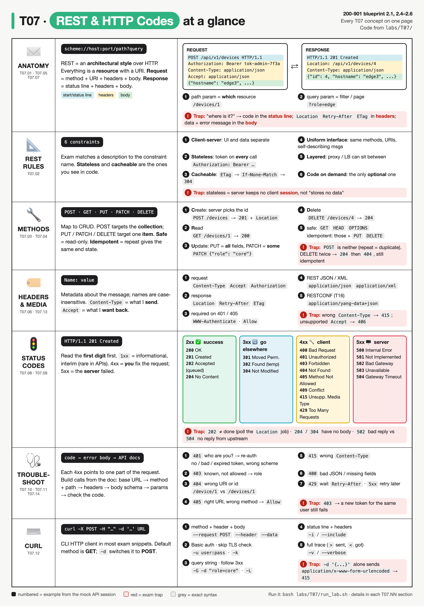
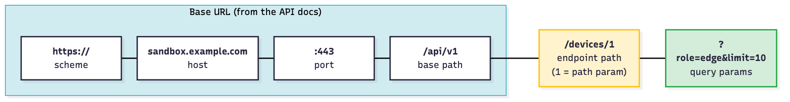
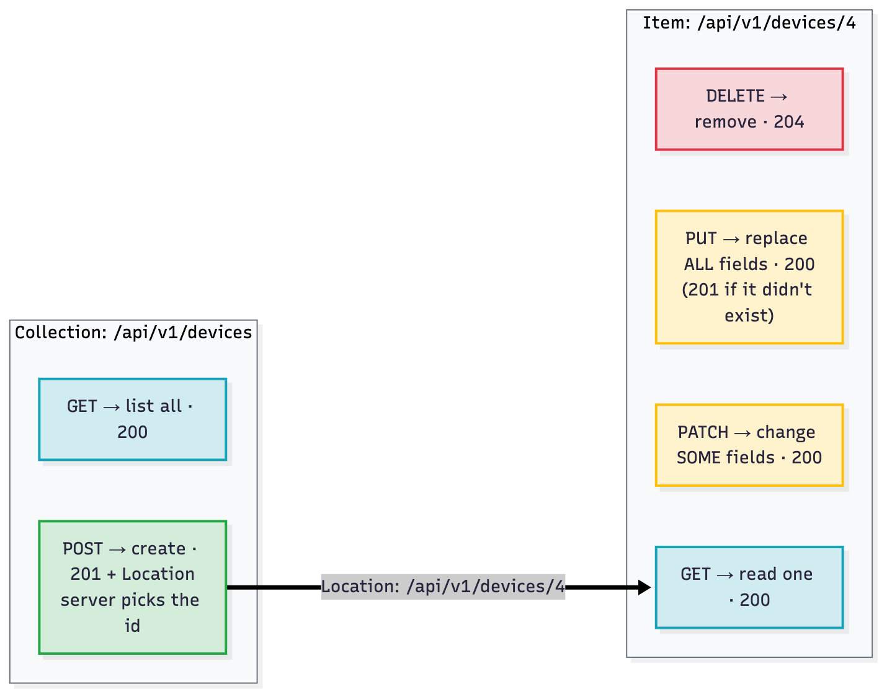
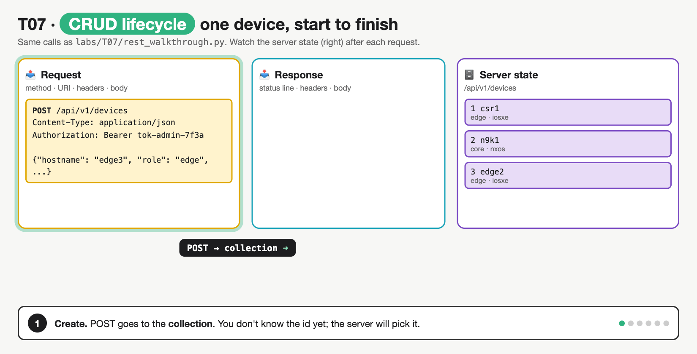
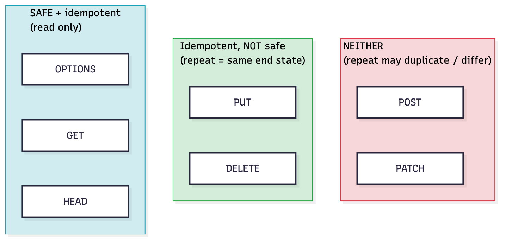
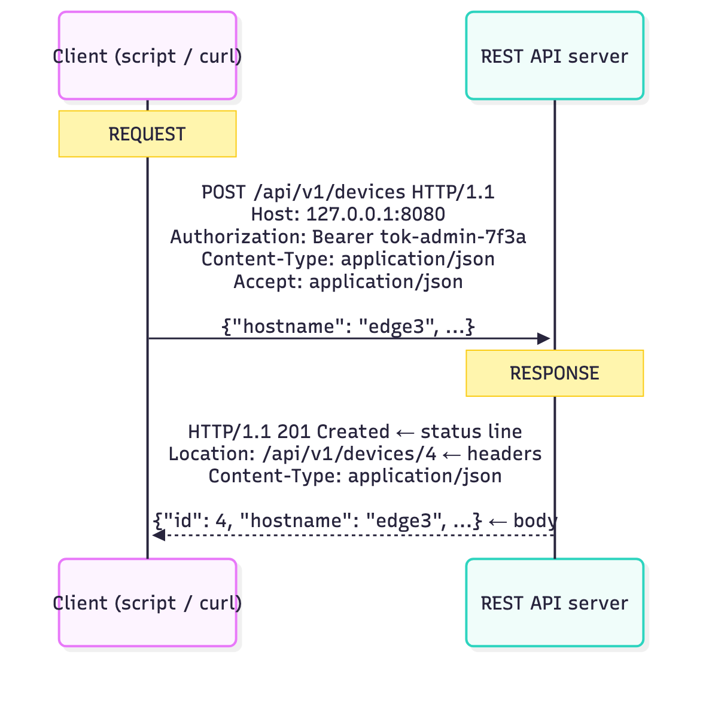
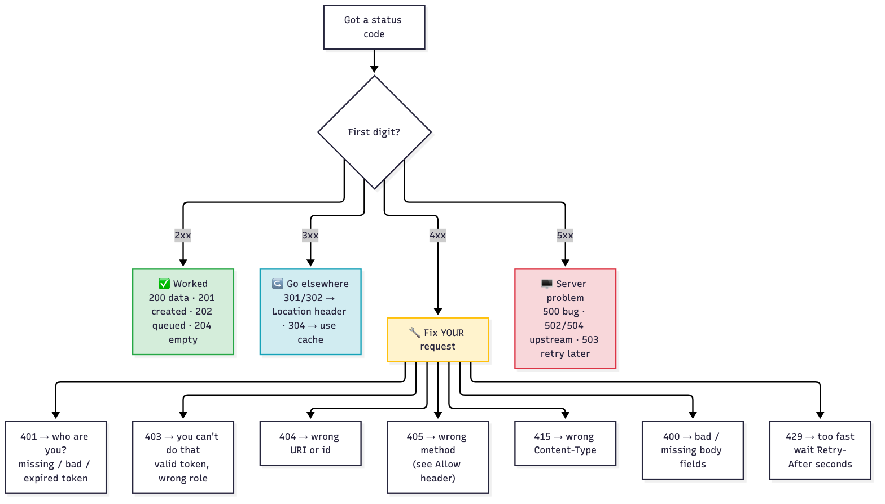
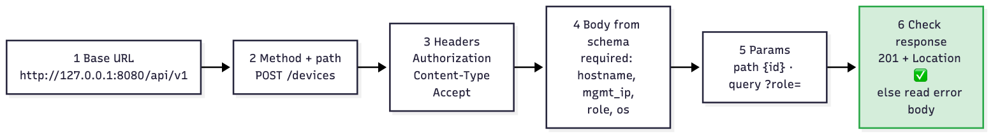

# T07 · REST fundamentals, HTTP codes

> Owner: **Beedy** · Blueprint: **2.1, 2.4-2.6** · CBT coverage: **Full** · Learn by 2026-10-09 · Teach-back 2026-10-12



*Every T07 concept on one page. Each row is a concept group (IDs under the icon), numbered items are calls from the mock API session in `labs/T07/`, and red boxes are exam traps.*

## TL;DR (teach-back card)

- **Request = method + URI + headers + body.** CRUD: POST creates on the collection (`201` + `Location`), GET reads, PUT replaces **all** fields, PATCH changes **some**, DELETE removes (`204`). Path param = which resource (`/devices/1`), query param = filter (`?role=edge`).
- **Status class first:** 2xx worked, 3xx look elsewhere (`Location`) or use the cache (`304`), 4xx **you** fix the request, 5xx the **server** failed. Key 4xx: `400` bad body · `401` who are you · `403` not allowed · `404` wrong URI · `405` wrong method · `415` wrong Content-Type · `429` slow down (`Retry-After`).
- **REST is a style with 6 constraints.** Stateless (send the token on every call) and cacheable (`ETag` → `304`) are the most tested. Safe = GET/HEAD/OPTIONS. Idempotent = those plus PUT/DELETE. POST is neither.
- **Trap:** `401` ≠ `403`: 401 = authentication failed (re-login), 403 = authenticated but forbidden (wrong role). And curl `-d` alone sends a **form**, not JSON → `415`.

## Concepts

Every section below explains one part of the same REST session. Read it once first.

- `labs/T07/mock_api.py` is a fake network-inventory REST API, written with the Python standard library only. It runs on your laptop at `http://127.0.0.1:8080/api/v1` and can return every status code on the exam.
- `labs/T07/rest_walkthrough.py` (shown below) is the **reference program**. It's one client that creates, reads, updates and deletes devices, and it deliberately triggers each error.
- To run both: `bash labs/T07/run_lab.sh`. It starts the API, runs the client, then stops the API.

**API doc for the mock** (this is the kind of table you get on developer.cisco.com):

| Method | Path | Body | Success | Errors it can return |
|---|---|---|---|---|
| `POST` | `/auth/token` | none; `Authorization: Basic <base64 user:pass>` | `200` `{"token": …}` | `401` |
| `GET` | `/devices?role=&os=&offset=&limit=` | none | `200` `{"response": [...], "total": n}` | `401` |
| `POST` | `/devices` | JSON, required: `hostname`, `mgmt_ip`, `role`, `os` | `201` + `Location` | `400` `403` `409` `415` |
| `GET` | `/devices/{id}` | none; `Accept: application/json` or `application/xml` | `200` + `ETag` | `304` `404` |
| `PUT` | `/devices/{id}` | JSON, **all** required fields | `200` (`201` if new) | `400` `403` `415` |
| `PATCH` | `/devices/{id}` | JSON, any subset of fields | `200` | `403` `404` `415` |
| `DELETE` | `/devices/{id}` | none | `204` | `403` `404` |
| `POST` | `/devices/{id}/backup` | none | `202` + `Location` (job) | `404` |
| `GET` | `/interfaces/stats` | none | `200` | `429` + `Retry-After` (after 2 calls) |
| any | `/devices` with another method | | | `405` + `Allow` |
| `GET` | `/old/devices` | | `301` → `/devices` | |
| `GET` | `/devices/2/config` | | | `500` (simulated bug) |
| `GET` | `/health` | | | `503` + `Retry-After` (maintenance) |

All endpoints except `/auth/token` and `/health` need `Authorization: Bearer <token>`.

**`labs/T07/rest_walkthrough.py`**

```python
"""T07 reference program: one REST session that hits every status code on the exam.

Start the mock API first:   python3 labs/T07/mock_api.py
Then in another terminal:   python3 labs/T07/rest_walkthrough.py

Python stdlib only (urllib), so every header and status line is visible.
T11 rebuilds the same calls with the `requests` library.
"""
import base64
import json
import os
import urllib.error
import urllib.request
from urllib.parse import urlencode

BASE_URL = os.environ.get("API_BASE", "http://127.0.0.1:8080/api/v1")   # scheme://host:port + base path
USER = os.environ.get("API_USER", "admin")
PASSWORD = os.environ.get("API_PASS", "C1sco12345")


def call(method, path, token=None, body=None, params=None, headers=None, show_body=True):
    """Send one request; print request line, status line, key headers and body."""
    url = BASE_URL + path
    if params:
        url += "?" + urlencode(params)                  # query parameters: ?key=value&key=value
    req_headers = {"Accept": "application/json"}        # format we want back
    if token:
        req_headers["Authorization"] = f"Bearer {token}"
    data = None
    if body is not None:
        data = json.dumps(body).encode()                # serialise the payload (T06)
        req_headers["Content-Type"] = "application/json"  # format we are sending
    req_headers.update(headers or {})

    request = urllib.request.Request(url, data=data, headers=req_headers, method=method)
    print(f"\n>>> {method} {url}")
    try:
        response = urllib.request.urlopen(request)
    except urllib.error.HTTPError as err:               # urllib raises on 4xx/5xx
        response = err
    status, reason = response.status, response.reason
    raw = response.read().decode()

    print(f"<<< HTTP/1.1 {status} {reason}")            # status line: version, code, reason phrase
    for name in ("Content-Type", "Location", "Retry-After", "WWW-Authenticate", "Allow", "ETag"):
        if response.headers.get(name):
            print(f"    {name}: {response.headers[name]}")
    if raw and show_body:
        print(f"    body: {raw.strip()}")
    return status, response.headers, raw


def get_token():
    """POST credentials with Basic auth, get a bearer token back (T10 covers auth in depth)."""
    basic = base64.b64encode(f"{USER}:{PASSWORD}".encode()).decode()
    status, _, raw = call("POST", "/auth/token", headers={"Authorization": f"Basic {basic}"})
    return json.loads(raw)["token"] if status == 200 else None


def main():
    print("== 1. Authenticate ==")
    call("GET", "/devices")                                          # 401: no token
    token = get_token()                                              # 200 + token in body

    print("\n== 2. Read (GET) ==")
    call("GET", "/devices", token, params={"role": "edge"})          # 200, query param filters
    status, headers, _ = call("GET", "/devices/1", token)            # 200, path param = id 1
    call("GET", "/devices/1", token, headers={"If-None-Match": headers["ETag"]})  # 304 Not Modified
    call("GET", "/devices/99", token)                                # 404: no such id
    call("GET", "/devices/1", token, headers={"Accept": "application/xml"})       # XML body

    print("\n== 3. Create (POST) ==")
    new = {"hostname": "edge3", "mgmt_ip": "10.10.20.50", "role": "edge", "os": "iosxe"}
    status, headers, _ = call("POST", "/devices", token, body=new)   # 201 + Location header
    new_path = headers["Location"].replace("/api/v1", "")
    call("POST", "/devices", token, body=new)                        # 409: duplicate hostname
    call("POST", "/devices", token, body={"hostname": "edge4"})      # 400: missing fields
    call("POST", "/devices", token, body=new,
         headers={"Content-Type": "text/plain"})                     # 415: wrong Content-Type

    print("\n== 4. Update (PUT vs PATCH) ==")
    call("PATCH", new_path, token, body={"role": "core"})            # 200, only role changes
    call("PUT", new_path, token, body={"hostname": "edge3"})         # 400: PUT needs every field
    call("PUT", new_path, token, body={**new, "role": "core"})       # 200, full replacement

    print("\n== 5. Delete ==")
    call("DELETE", new_path, token)                                  # 204: empty body
    call("DELETE", new_path, token)                                  # 404: already gone

    print("\n== 6. Wrong method, permissions, async ==")
    call("DELETE", "/devices", token)                                # 405 + Allow header
    viewer = json.loads(call("POST", "/auth/token", headers={
        "Authorization": "Basic " + base64.b64encode(b"viewer:viewonly").decode()})[2])["token"]
    call("POST", "/devices", viewer, body=new)                       # 403: valid token, wrong role
    call("POST", "/devices/1/backup", token)                         # 202 Accepted + job Location

    print("\n== 7. Redirects, rate limits, server errors ==")
    call("GET", "/old/devices", token, show_body=False)              # 301 followed silently -> 200
    for _ in range(3):
        call("GET", "/interfaces/stats", token)                      # 200, 200, then 429
    call("GET", "/devices/2/config", token)                          # 500: server bug
    call("GET", "/health")                                           # 503 + Retry-After


if __name__ == "__main__":
    main()
```

**Output** (`bash labs/T07/run_lab.sh`):

```
== 1. Authenticate ==

>>> GET http://127.0.0.1:8080/api/v1/devices
<<< HTTP/1.1 401 Unauthorized
    Content-Type: application/json
    WWW-Authenticate: Bearer realm="mock-api"
    body: {"error": "missing or invalid token"}

>>> POST http://127.0.0.1:8080/api/v1/auth/token
<<< HTTP/1.1 200 OK
    Content-Type: application/json
    body: {"token": "tok-admin-7f3a", "expires_in": 3600}

== 2. Read (GET) ==

>>> GET http://127.0.0.1:8080/api/v1/devices?role=edge
<<< HTTP/1.1 200 OK
    Content-Type: application/json
    body: {"response": [{"id": 1, "hostname": "csr1", "mgmt_ip": "10.10.20.48", "role": "edge", "os": "iosxe"}, {"id": 3, "hostname": "edge2", "mgmt_ip": "10.10.20.49", "role": "edge", "os": "iosxe"}], "total": 2}

>>> GET http://127.0.0.1:8080/api/v1/devices/1
<<< HTTP/1.1 200 OK
    Content-Type: application/json
    ETag: "dev-1-v1"
    body: {"id": 1, "hostname": "csr1", "mgmt_ip": "10.10.20.48", "role": "edge", "os": "iosxe"}

>>> GET http://127.0.0.1:8080/api/v1/devices/1
<<< HTTP/1.1 304 Not Modified
    ETag: "dev-1-v1"

>>> GET http://127.0.0.1:8080/api/v1/devices/99
<<< HTTP/1.1 404 Not Found
    Content-Type: application/json
    body: {"error": "device 99 not found"}

>>> GET http://127.0.0.1:8080/api/v1/devices/1
<<< HTTP/1.1 200 OK
    Content-Type: application/xml
    ETag: "dev-1-v1"
    body: <device><id>1</id><hostname>csr1</hostname><mgmt_ip>10.10.20.48</mgmt_ip><role>edge</role><os>iosxe</os></device>

== 3. Create (POST) ==

>>> POST http://127.0.0.1:8080/api/v1/devices
<<< HTTP/1.1 201 Created
    Content-Type: application/json
    Location: /api/v1/devices/4
    body: {"id": 4, "hostname": "edge3", "mgmt_ip": "10.10.20.50", "role": "edge", "os": "iosxe"}

>>> POST http://127.0.0.1:8080/api/v1/devices
<<< HTTP/1.1 409 Conflict
    Content-Type: application/json
    body: {"error": "hostname edge3 already exists"}

>>> POST http://127.0.0.1:8080/api/v1/devices
<<< HTTP/1.1 400 Bad Request
    Content-Type: application/json
    body: {"error": "missing field(s): mgmt_ip, role, os"}

>>> POST http://127.0.0.1:8080/api/v1/devices
<<< HTTP/1.1 415 Unsupported Media Type
    Content-Type: application/json
    body: {"error": "Content-Type must be application/json, got 'text/plain'"}

== 4. Update (PUT vs PATCH) ==

>>> PATCH http://127.0.0.1:8080/api/v1/devices/4
<<< HTTP/1.1 200 OK
    Content-Type: application/json
    body: {"id": 4, "hostname": "edge3", "mgmt_ip": "10.10.20.50", "role": "core", "os": "iosxe"}

>>> PUT http://127.0.0.1:8080/api/v1/devices/4
<<< HTTP/1.1 400 Bad Request
    Content-Type: application/json
    body: {"error": "PUT replaces the whole resource; missing: mgmt_ip, role, os"}

>>> PUT http://127.0.0.1:8080/api/v1/devices/4
<<< HTTP/1.1 200 OK
    Content-Type: application/json
    body: {"id": 4, "hostname": "edge3", "mgmt_ip": "10.10.20.50", "role": "core", "os": "iosxe"}

== 5. Delete ==

>>> DELETE http://127.0.0.1:8080/api/v1/devices/4
<<< HTTP/1.1 204 No Content

>>> DELETE http://127.0.0.1:8080/api/v1/devices/4
<<< HTTP/1.1 404 Not Found
    Content-Type: application/json
    body: {"error": "device 4 not found"}

== 6. Wrong method, permissions, async ==

>>> DELETE http://127.0.0.1:8080/api/v1/devices
<<< HTTP/1.1 405 Method Not Allowed
    Content-Type: application/json
    Allow: GET, POST
    body: {"error": "DELETE not allowed on /api/v1/devices"}

>>> POST http://127.0.0.1:8080/api/v1/auth/token
<<< HTTP/1.1 200 OK
    Content-Type: application/json
    body: {"token": "tok-viewer-91c2", "expires_in": 3600}

>>> POST http://127.0.0.1:8080/api/v1/devices
<<< HTTP/1.1 403 Forbidden
    Content-Type: application/json
    body: {"error": "role 'read' cannot create devices"}

>>> POST http://127.0.0.1:8080/api/v1/devices/1/backup
<<< HTTP/1.1 202 Accepted
    Content-Type: application/json
    Location: /api/v1/jobs/17
    body: {"job": "/api/v1/jobs/17", "status": "queued"}

== 7. Redirects, rate limits, server errors ==

>>> GET http://127.0.0.1:8080/api/v1/old/devices
<<< HTTP/1.1 200 OK
    Content-Type: application/json

>>> GET http://127.0.0.1:8080/api/v1/interfaces/stats
<<< HTTP/1.1 200 OK
    Content-Type: application/json
    body: {"rx_errors": 0, "tx_errors": 3}

>>> GET http://127.0.0.1:8080/api/v1/interfaces/stats
<<< HTTP/1.1 200 OK
    Content-Type: application/json
    body: {"rx_errors": 0, "tx_errors": 3}

>>> GET http://127.0.0.1:8080/api/v1/interfaces/stats
<<< HTTP/1.1 429 Too Many Requests
    Content-Type: application/json
    Retry-After: 30
    body: {"error": "rate limit: 2 requests per minute"}

>>> GET http://127.0.0.1:8080/api/v1/devices/2/config
<<< HTTP/1.1 500 Internal Server Error
    Content-Type: application/json
    body: {"error": "internal error: config parser crashed"}

>>> GET http://127.0.0.1:8080/api/v1/health
<<< HTTP/1.1 503 Service Unavailable
    Content-Type: application/json
    Retry-After: 120
    body: {"status": "maintenance"}
```

### T07.01 · REST basics

**Must cover:**

- [x] REST = Representational State Transfer: an architectural style, not a protocol
- [x] Everything is a resource identified by a URI (e.g. /api/v1/devices/123)
- [x] URI parts: scheme://host:port/path?query#fragment
- [x] Base URL + endpoint path = full request URL

**Notes:**

- **REST** = REpresentational State Transfer. It's an **architectural style** (a set of rules for designing APIs), not a protocol and not a standard. It almost always runs over HTTP.
- **Resource** = any "thing" the API exposes: a device, an interface, a user. Each resource has a **URI** (its address).
  - A **collection** is a plural noun: `/api/v1/devices`. An **item** is the collection plus an id: `/api/v1/devices/1`.
  - URIs are nouns. The **method** (`GET`, `POST`, …) says what to do with the noun. `/getDevices` and `/deleteDevice?id=1` aren't RESTful.
- URI parts, left to right: `scheme://host:port/path?query#fragment`.



*Base URL (blue) comes from the API docs and never changes between calls. The endpoint path (yellow) picks the resource. Query parameters (green) filter or page.*

- In the program: `BASE_URL = "http://127.0.0.1:8080/api/v1"`, and every call adds a path such as `"/devices/1"`.
  - **Base URL + endpoint path = full request URL.** The `>>>` lines in the output show each full URL.
- `#fragment` stays in the browser and is never sent to the server. It's not used in APIs.

### T07.02 · REST constraints

**Must cover:**

- [x] Client-server: UI and data storage separated
- [x] Stateless: each request carries everything needed (e.g. auth token); server keeps no session
- [x] Cacheable: responses say whether they can be cached
- [x] Uniform interface: standard methods, resource URIs, self-descriptive messages
- [x] Layered system: proxies/load balancers can sit in between
- [x] Code on demand (optional): server may send executable code

**Notes:**

- Six constraints define a REST API (Roy Fielding, 2000). Exam questions ask you to match a description to its constraint name.

| Constraint | Means | In the mock API / program |
|---|---|---|
| **Client-server** | client (UI/script) and server (data) are separate and evolve independently | `rest_walkthrough.py` knows nothing about how `mock_api.py` stores devices |
| **Stateless** | every request carries everything needed; server keeps **no session** between requests | the program sends `Authorization: Bearer …` on **every** call. Drop it once → `401` |
| **Cacheable** | responses say whether/how long they can be cached | `ETag: "dev-1-v1"` → resend as `If-None-Match` → `304 Not Modified`, no body |
| **Uniform interface** | standard methods, resource URIs, self-descriptive messages (`Content-Type` says how to parse the body) | the same 5 methods work on every resource |
| **Layered system** | client can't tell if it's talking to the real server or a proxy/load balancer/cache | a reverse proxy could sit in front of port 8080 unnoticed (T41) |
| **Code on demand** *(optional)* | server may send runnable code (e.g. JavaScript) | not used. It's the only **optional** constraint |

- **Stateless ≠ no data stored.** The server still stores devices. It just doesn't remember *you* between requests.
- Consumer-side limits (rate limits, pagination) belong to T08, not here.

### T07.03 · HTTP methods

**Must cover:**

- [x] GET = read (no body)
- [x] POST = create (server assigns the ID)
- [x] PUT = create or fully replace a resource at a known URI
- [x] PATCH = partial update (only the fields sent)
- [x] DELETE = remove
- [x] CRUD: Create=POST, Read=GET, Update=PUT/PATCH, Delete=DELETE

**Notes:**

- In the program's sections 2–5:

| CRUD | Method | Target | Body | Success code | In the program |
|---|---|---|---|---|---|
| **C**reate | `POST` | collection `/devices` | full object | `201 Created` + `Location` | section 3 → `Location: /api/v1/devices/4` |
| **R**ead | `GET` | collection or item | none | `200 OK` | section 2 |
| **U**pdate (all) | `PUT` | item `/devices/4` | **full** object | `200` (or `201` if PUT created it) | section 4: missing fields → `400` |
| **U**pdate (some) | `PATCH` | item `/devices/4` | only the changed fields | `200` | section 4: `{"role": "core"}` |
| **D**elete | `DELETE` | item | none | `204 No Content` (or `200`) | section 5 |



*POST targets the collection, and the server picks the id and returns it in Location. PUT, PATCH and DELETE target one item.*



*One device through its whole life, as in `rest_walkthrough.py`: POST → `201` + `Location` → GET → PATCH (only `role` changes) → DELETE → `204` → DELETE again → `404`. Watch the server-state column: the repeat DELETE returns a different code but leaves the same end state, which is why DELETE counts as idempotent.*

- **POST vs PUT:** use **POST** when the server picks the id (you don't know the URI yet). Use **PUT** when **you** know the URI, which creates the resource if it's missing or replaces it.
- **PUT vs PATCH:** PUT sends **every** field and replaces the whole resource. PATCH sends only what changes. In the output, `PUT` with only `hostname` → `400 … PUT replaces the whole resource`.

### T07.04 · HTTP methods

**Must cover:**

- [x] Safe = does not change state: GET, HEAD, OPTIONS
- [x] Idempotent = repeating gives the same result: GET, PUT, DELETE (and HEAD, OPTIONS)
- [x] POST is neither safe nor idempotent (repeat = duplicate objects)
- [x] PATCH is not guaranteed idempotent

**Notes:**

- **Safe** = doesn't change server state (read-only).
- **Idempotent** = sending the same request 1 time or 10 times leaves the server in the **same end state**. The response code can differ.



*Every safe method is also idempotent. PUT and DELETE are idempotent but not safe. POST and PATCH are neither.*

- Proof from the output:
  - `DELETE /devices/4` twice → `204`, then `404`. The end state is the same (device gone), so it's **idempotent** even though the codes differ.
  - `POST` the same body twice → `201`, then `409`. Without the duplicate check it would create a **second** device, so POST is **not idempotent**.
- **PATCH** is not guaranteed idempotent (RFC 5789). `{"role": "core"}` is idempotent, but `{"op": "increment"}` wouldn't be.
- Why it matters: idempotent requests are safe to **retry** after a timeout. Retrying a POST can create duplicates.

### T07.05 · Request parts

**Must cover:**

- [x] Request = method + URI + headers + optional body
- [x] Path parameter: part of the path (/devices/{id})
- [x] Query parameter: after ? as key=value pairs joined by & (filtering, paging)
- [x] Body/payload: JSON or XML data for POST/PUT/PATCH

**Notes:**

- A **request** has 4 parts: **method** + **URI** + **headers** + optional **body**.



*Both directions have the same shape: a start line, headers, a blank line, then the body.*

- **Path parameter** = part of the path that names *which* resource: `/devices/{id}` → `/devices/1`. It's required; a wrong value → `404`.
- **Query parameter** = after `?` as `key=value` pairs joined by `&`, used to filter, sort or page. It's optional.
  - In the program, `call("GET", "/devices", token, params={"role": "edge"})` → `urlencode` builds `?role=edge` → only the 2 edge devices come back.
- **Body / payload** = the data, sent with `POST`/`PUT`/`PATCH`. The program does `json.dumps(body).encode()` (serialise, T06).
- `GET` and `DELETE` normally have **no body**.

### T07.06 · Headers

**Must cover:**

- [x] Content-Type: format of the body being sent
- [x] Accept: format the client wants back
- [x] Authorization: credentials/token
- [x] User-Agent, Cache-Control
- [x] Response headers: Location (URI of created resource), Retry-After, Set-Cookie, ETag, Content-Length

**Notes:**

- Headers = `Name: value` metadata lines. Names are **case-insensitive**.

| Header | Direction | Says | In the program / output |
|---|---|---|---|
| `Content-Type` | request **and** response | format of **this message's body** | request: `application/json`; response: `application/json` or `application/xml` |
| `Accept` | request | format I **want back** | `Accept: application/xml` → XML body |
| `Authorization` | request | credentials | `Basic <base64>` to log in, then `Bearer <token>` |
| `User-Agent` | request | client software | curl sends `User-Agent: curl/8.7.1` (see `--verbose` drill) |
| `Cache-Control` | both | caching rules (`no-cache`, `max-age=60`) | (not used by the mock) |
| `If-None-Match` | request | "only send it if it changed" + ETag | → `304` |
| `Location` | response | URI of the **new** resource (201) or redirect target (3xx) or job (202) | `Location: /api/v1/devices/4` |
| `Retry-After` | response | seconds to wait (429, 503) | `Retry-After: 30` |
| `WWW-Authenticate` | response | how to authenticate (required on 401) | `Bearer realm="mock-api"` |
| `Allow` | response | methods allowed (required on 405) | `Allow: GET, POST` |
| `ETag` | response | version tag of the resource | `"dev-1-v1"` |
| `Set-Cookie` | response | store a cookie (session-based APIs) | (not used) |
| `Content-Length` | both | body size in bytes | see `--include` drill |

- **`Content-Type` vs `Accept`:** Content-Type = what I'm **sending**, Accept = what I **want back**.

### T07.07 · Response parts

**Must cover:**

- [x] Status line: HTTP version, code, reason phrase (HTTP/1.1 201 Created)
- [x] Headers: metadata about the response
- [x] Body: the data (often JSON), may be empty (204)
- [x] Exam asks you to point to which part holds a given piece of information

**Notes:**

- A **response** has 3 parts:
  1. **Status line:** `HTTP/1.1 201 Created` = version + **code** + reason phrase.
  2. **Headers:** metadata, e.g. `Location`, `Content-Type`, `Retry-After`, `ETag`.
  3. **Body:** the data (usually JSON). It can be **empty**: `204`, `304`, `301` and `HEAD` responses have none.
- **"Where is X?"** answers, from the output:
  - The new device's id → **body** (`"id": 4`) **and** the `Location` **header**.
  - How long to wait → `Retry-After` **header**.
  - Why it failed → **body** (`{"error": "missing field(s): …"}`). The code says *what kind* of failure; the body says *why*.
  - The format of the data → `Content-Type` **header**.

### T07.08 · Status classes

**Must cover:**

- [x] 1xx informational
- [x] 2xx success
- [x] 3xx redirection (resource moved, use cache)
- [x] 4xx client error (fix your request)
- [x] 5xx server error (problem on the server side)

**Notes:**

- The **first digit** gives the class. Learn the class first; the exact code is the second step.

| Class | Meaning | Who fixes it |
|---|---|---|
| `1xx` | informational, interim (`100 Continue`) | nobody, rare in APIs |
| `2xx` | success | nothing to fix |
| `3xx` | redirection: look elsewhere or use your cache | client follows `Location` / uses cache |
| `4xx` | **client** error: your request is wrong | **you** (the caller) |
| `5xx` | **server** error: a valid request failed on the server | the server/API owner; you retry later |


### T07.09 · Key codes

**Must cover:**

- [x] 200 OK; 201 Created; 202 Accepted (async); 204 No Content
- [x] 301 Moved Permanently; 302 Found; 304 Not Modified
- [x] 400 Bad Request; 401 Unauthorized; 403 Forbidden; 404 Not Found; 405 Method Not Allowed; 409 Conflict; 415 Unsupported Media Type; 429 Too Many Requests
- [x] 500 Internal Server Error; 501 Not Implemented; 502 Bad Gateway; 503 Service Unavailable; 504 Gateway Timeout

**Notes:**

- Every code below was produced for real by the reference program or the curl drill.

| Code | Name | When (in the program) |
|---|---|---|
| `200` | OK | GET, PATCH, PUT update succeed |
| `201` | Created | POST `/devices` (+ `Location`) |
| `202` | Accepted | POST `/devices/1/backup`: queued, **not done yet** (async) |
| `204` | No Content | DELETE succeeded, empty body |
| `301` | Moved Permanently | `/old/devices` → `Location: /api/v1/devices` |
| `302` | Found | temporary redirect, same idea as 301 but not permanent |
| `304` | Not Modified | GET with `If-None-Match` matching the `ETag` |
| `400` | Bad Request | body missing required fields / bad JSON |
| `401` | Unauthorized | no token / bad credentials (+ `WWW-Authenticate`) |
| `403` | Forbidden | viewer token tries POST |
| `404` | Not Found | `/devices/99`, or DELETE twice |
| `405` | Method Not Allowed | DELETE on `/devices` (+ `Allow: GET, POST`) |
| `409` | Conflict | POST a hostname that already exists |
| `415` | Unsupported Media Type | `Content-Type: text/plain` or curl `--data` default |
| `429` | Too Many Requests | 3rd call to `/interfaces/stats` (+ `Retry-After: 30`) |
| `500` | Internal Server Error | `/devices/2/config`: server-side bug |
| `501` | Not Implemented | server doesn't support that method at all |
| `502` | Bad Gateway | proxy/gateway got a **bad** reply from the upstream server |
| `503` | Service Unavailable | `/health` during maintenance (+ `Retry-After: 120`) |
| `504` | Gateway Timeout | proxy/gateway got **no** reply in time from upstream |

- `301` didn't appear in the walkthrough output because `urllib` follows redirects silently and shows the final `200`. The curl drill shows the raw `301` and then `--location` following it.

### T07.10 · Troubleshooting

**Must cover:**

- [x] 401: missing, wrong or expired credentials → re-authenticate
- [x] 403: authenticated but not allowed → check role/permissions
- [x] 404: wrong URI/ID; 405: wrong method for that endpoint
- [x] 415: wrong Content-Type header; 400: malformed or invalid body
- [x] 429: rate limited → wait (Retry-After); 5xx: server-side, retry later or check the server

**Notes:**

- Read the **code**, then the **error body**, then the **docs**. Most exam scenarios are "here is the code + response, what's wrong?"



*Branch on the first digit, then on the exact 4xx code. Each 4xx maps to one part of the request to fix.*

| Code | Most likely cause | Fix |
|---|---|---|
| `401` | missing, wrong or **expired** token; `Basic` used where `Bearer` expected | re-authenticate, check the `Authorization` header format |
| `403` | authenticated, but the role lacks permission | use an account with the right role; re-authenticating won't help |
| `404` | wrong path (`/device/1` vs `/devices/1`), wrong id, base path typo | compare the URL with the docs |
| `405` | right URL, wrong method (POST to an item, DELETE to a collection) | read the `Allow` header |
| `415` | `Content-Type` missing/wrong (`text/plain`, form-encoded) | send `Content-Type: application/json` |
| `400` | JSON syntax error or missing/invalid fields | validate against the doc schema |
| `409` | duplicate / state conflict | change the value or GET current state first |
| `429` | too many calls | wait `Retry-After` seconds, then back off (T08) |
| `5xx` | server-side | retry later (503 + Retry-After); report 500 with the request details |

- **401 vs 403 in one line:** 401 = "**who** are you?" (authentication). 403 = "I know who you are, and **no**" (authorisation).

### T07.11 · Using API docs

**Must cover:**

- [x] Find base URL, endpoint path and method in the docs
- [x] Add required headers: Content-Type, Accept, Authorization / API key
- [x] Build the body from the documented schema (required vs optional fields)
- [x] Add path/query parameters
- [x] Compare the response to the documented codes and schema

**Notes:**

- Turning an API doc into a working call, in 6 steps (each step is one part of the request):



*Steps 1–5 build the request, and step 6 checks the response against the documented codes.*

- Worked example with the mock API doc table at the top of this section, "create a device":
  1. Base URL: `http://127.0.0.1:8080/api/v1`
  2. Method + path: `POST /devices`
  3. Headers: `Authorization: Bearer <token>`, `Content-Type: application/json`, `Accept: application/json`
  4. Body: all 4 required fields → `{"hostname": "edge3", "mgmt_ip": "10.10.20.50", "role": "edge", "os": "iosxe"}`
  5. Params: none for create (path `{id}` and `?role=` are for reads)
  6. Expect `201` + `Location`. Anything else → read the error body.
- Real Cisco docs (developer.cisco.com) list the same things: base URL, path, method, headers, body schema with required fields, and a response-codes table.

### T07.12 · curl

**Must cover:**

- [x] curl -X POST https://host/api -H "Content-Type: application/json" -d '{"name":"x"}'
- [x] -u user:pass basic auth; -k skip TLS verification
- [x] -i show response headers; -v verbose (full request and response)
- [x] Default method is GET (POST when -d is used)

**Notes:**

- curl is the CLI HTTP client used in most exam snippets. All flags below are in `labs/T07/curl_drill.sh`, run against the mock API (output in **Examples**).

| Flag (short / long) | Does |
|---|---|
| `-X POST` / `--request POST` | set the method |
| `-H "K: v"` / `--header "K: v"` | add a header (repeat for more) |
| `-d '…'` / `--data '…'` | send a body. **Switches the method to POST** and sets `Content-Type: application/x-www-form-urlencoded` |
| `--json '…'` | curl ≥ 7.82: body + `Content-Type: application/json` + `Accept: application/json`, POST |
| `-u user:pass` / `--user` | Basic auth (builds the `Authorization: Basic …` header) |
| `-k` / `--insecure` | skip TLS certificate checks (self-signed sandbox certs) |
| `-i` / `--include` | print status line + response **headers** + body |
| `-v` / `--verbose` | full trace: `>` lines = request sent, `<` lines = response received |
| `-G` / `--get` | with `-d`: send the data as a **query string** on a GET |
| `-L` / `--location` | follow 3xx redirects |
| `-s` / `--silent` | hide the progress bar |

- **Default method is GET.** Adding `-d` makes it **POST** (verified in the `--verbose` output: `> POST … Content-Type: application/x-www-form-urlencoded`).
- **Trap:** `-d '{"json":…}'` without `-H "Content-Type: application/json"` → the server sees form data → **415** (drill step 2).

### T07.13 · Media types

**Must cover:**

- [x] application/json: standard REST payloads
- [x] application/xml: XML payloads
- [x] application/yang-data+json / +xml: RESTCONF
- [x] Must match the Content-Type and Accept headers

**Notes:**

| Media type | Body is | Used by |
|---|---|---|
| `application/json` | JSON | most REST APIs (Meraki, Webex, Catalyst Center) |
| `application/xml` | XML | older/SOAP-ish APIs, some Cisco APIs |
| `application/yang-data+json` | YANG data as JSON | **RESTCONF** (RFC 8040), [T16](../bob/T16-restconf.md) |
| `application/yang-data+xml` | YANG data as XML | **RESTCONF** |
| `application/x-www-form-urlencoded` | `a=1&b=2` | HTML forms, curl `-d` default, OAuth token endpoints |
| `text/plain` | raw text | e.g. `/devices/1/config` in the mock |

- `Content-Type` must match the body you **send**. `Accept` must be a type the API can **return**. Mismatch → `415` (request) or `406 Not Acceptable` (response).
- In the program, the same `GET /devices/1` with `Accept: application/xml` returns `<device><id>1</id>…</device>`. Parse it with T06 tools.

### T07.14 · Exam angle

**Must cover:**

- [x] Fill the missing method, URL part or header from an API doc snippet
- [x] Diagnose a failed call from the code plus its response code
- [x] Identify which part of the response holds a value (header vs body)

**Notes:**

- **Fill the gap from the doc:** method (POST vs PUT vs PATCH), path (`/devices` vs `/devices/{id}`), header (`Content-Type` vs `Accept` vs `Authorization`).
- **Diagnose:** match code → part of the request. The table in T07.10 is the answer key.
- **Header vs body:** ids and data are in the **body**. `Location`, `Retry-After`, `ETag`, `Content-Type` and `Allow` are **headers**. The code is in the **status line**.

## Exam traps

- **401 vs 403:** 401 = not authenticated (no, bad or expired credentials, so re-authenticate). 403 = authenticated but not permitted (re-login won't help).
- **404 vs 405:** 404 = that URI doesn't exist. 405 = the URI exists, but not with that method (check `Allow`).
- **400 vs 415:** 400 = the body content is wrong (bad JSON, missing fields). 415 = the body **format** isn't accepted (`Content-Type` header).
- **POST vs PUT:** POST to the **collection**, server picks the id → `201` + `Location`. PUT to a **known item URI**, creating or **fully** replacing it.
- **PUT vs PATCH:** PUT needs **all** fields (missing ones → `400`, or they get wiped). PATCH sends only the changed fields.
- **Idempotent ≠ same response code:** DELETE twice → `204` then `404`, and it's still idempotent because the end state is the same.
- **POST isn't idempotent, PATCH isn't guaranteed to be.** "Safe to retry after a timeout?" → GET/PUT/DELETE yes, POST no.
- **`Content-Type` vs `Accept`:** what I send vs what I want back.
- **`202` vs `201`:** 202 = accepted and queued, **not done yet** (poll the `Location` job URI). 201 = created now.
- **`204` has no body.** Calling `.json()` on it fails.
- **`304`** only comes back when you sent `If-None-Match`/`If-Modified-Since`. It has no body, so use your cached copy.
- **`502` vs `504`:** a gateway/proxy got a **bad** reply vs **no** reply from upstream. `503` = the service itself is down or overloaded (often with `Retry-After`).
- **curl:** default GET. `-d` → POST **plus** `Content-Type: application/x-www-form-urlencoded`, so JSON APIs need `-H "Content-Type: application/json"`. `-i` shows headers, `-v` shows request + response, `-k` skips TLS checks, `-L` follows redirects, `-G -d` builds a query string.
- **Where is it?** Code → status line. `Location`/`Retry-After`/`ETag`/`Content-Type` → headers. Data and error message → body.
- **Stateless** = the server keeps no client **session**, not "the server stores no data". The token goes on **every** request.
- **Code on demand** is the only **optional** REST constraint.

## Examples

### 1. Run the reference program

Needs only Python 3 and curl. Nothing to install, and no DevNet sandbox needed.

```bash
bash labs/T07/run_lab.sh                         # mock API + rest_walkthrough.py
bash labs/T07/run_lab.sh labs/T07/curl_drill.sh  # mock API + curl drill
```

Or by hand, in two terminals:

```bash
python3 labs/T07/mock_api.py                     # terminal 1: leave running
python3 labs/T07/rest_walkthrough.py             # terminal 2
```

In the lab container (the API and client share the container's localhost):

```bash
docker build --tag ccna-auto-lab:latest --file labs/Dockerfile labs/
docker run --rm --volume "$(pwd)":/work --workdir /work ccna-auto-lab:latest bash labs/T07/run_lab.sh
```

### 2. curl drill (`labs/T07/curl_drill.sh`)

```bash
#!/usr/bin/env bash
# T07 curl drill against the local mock API. Start it first:  python3 labs/T07/mock_api.py
set -u
BASE="http://127.0.0.1:8080/api/v1"

# Wait up to 10 s for the mock API to answer
for _ in $(seq 1 20); do
  curl --silent --output /dev/null "$BASE/health" && break
  sleep 0.5
done

TOKEN=$(curl --silent --request POST --user admin:C1sco12345 "$BASE/auth/token" \
  | python3 -c "import json, sys; print(json.load(sys.stdin)['token'])")
echo "TOKEN=$TOKEN"

echo; echo "== 1. --include: status line + headers + body"
curl --silent --show-error --include \
  --header "Authorization: Bearer $TOKEN" \
  "$BASE/devices/1"

echo; echo; echo "== 2. --data alone: curl switches to POST and sends a FORM content type -> 415"
curl --silent --show-error --include \
  --header "Authorization: Bearer $TOKEN" \
  --data '{"hostname":"edge9"}' \
  "$BASE/devices"

echo; echo; echo "== 3. --request POST + Content-Type + --data: correct create -> 201"
curl --silent --show-error --include --request POST \
  --header "Authorization: Bearer $TOKEN" \
  --header "Content-Type: application/json" \
  --data '{"hostname":"edge9","mgmt_ip":"10.10.20.59","role":"edge","os":"iosxe"}' \
  "$BASE/devices"

echo; echo; echo "== 4. --get + --data: data becomes a query string"
curl --silent --show-error --get \
  --header "Authorization: Bearer $TOKEN" \
  --data "role=core" \
  "$BASE/devices"

echo; echo; echo "== 5. 301 without and with --location"
curl --silent --show-error --include \
  --header "Authorization: Bearer $TOKEN" \
  "$BASE/old/devices"
curl --silent --show-error --location --output /dev/null \
  --write-out "after --location: %{http_code} %{url_effective}\n" \
  --header "Authorization: Bearer $TOKEN" \
  "$BASE/old/devices"

echo; echo "== 6. --verbose: '>' = request we sent, '<' = response we got"
curl --silent --verbose --output /dev/null --request DELETE \
  --header "Authorization: Bearer $TOKEN" \
  "$BASE/devices/4" 2>&1 | grep -E '^[<>] ' | tr -d '\r'
```

Output (curl 8.7.1, `bash labs/T07/run_lab.sh labs/T07/curl_drill.sh`):

```
TOKEN=tok-admin-7f3a

== 1. --include: status line + headers + body
HTTP/1.1 200 OK
Server: MockAPI/1.0
Date: Sat, 10 Oct 2026 06:18:57 GMT
ETag: "dev-1-v1"
Content-Type: application/json
Content-Length: 86

{"id": 1, "hostname": "csr1", "mgmt_ip": "10.10.20.48", "role": "edge", "os": "iosxe"}

== 2. --data alone: curl switches to POST and sends a FORM content type -> 415
HTTP/1.1 415 Unsupported Media Type
Server: MockAPI/1.0
Date: Sat, 10 Oct 2026 06:18:57 GMT
Content-Type: application/json
Content-Length: 91

{"error": "Content-Type must be application/json, got 'application/x-www-form-urlencoded'"}

== 3. --request POST + Content-Type + --data: correct create -> 201
HTTP/1.1 201 Created
Server: MockAPI/1.0
Date: Sat, 10 Oct 2026 06:18:57 GMT
Location: /api/v1/devices/4
Content-Type: application/json
Content-Length: 87

{"id": 4, "hostname": "edge9", "mgmt_ip": "10.10.20.59", "role": "edge", "os": "iosxe"}

== 4. --get + --data: data becomes a query string
{"response": [{"id": 2, "hostname": "n9k1", "mgmt_ip": "10.10.20.58", "role": "core", "os": "nxos"}], "total": 1}

== 5. 301 without and with --location
HTTP/1.1 301 Moved Permanently
Server: MockAPI/1.0
Date: Sat, 10 Oct 2026 06:18:57 GMT
Location: /api/v1/devices
Content-Length: 0

after --location: 200 http://127.0.0.1:8080/api/v1/devices

== 6. --verbose: '>' = request we sent, '<' = response we got
> DELETE /api/v1/devices/4 HTTP/1.1
> Host: 127.0.0.1:8080
> User-Agent: curl/8.7.1
> Accept: */*
> Authorization: Bearer tok-admin-7f3a
> 
< HTTP/1.1 204 No Content
< Server: MockAPI/1.0
< Date: Sat, 10 Oct 2026 06:18:57 GMT
< Content-Length: 0
<
```

- Step 2 is the classic trap: `--data` without a `Content-Type` header → curl sends `application/x-www-form-urlencoded` → `415`.
- Step 6 (`--verbose`) shows that curl filled in `Host`, `User-Agent` and `Accept: */*` by itself.

### 3. Break it on purpose

Edit `labs/T07/rest_walkthrough.py`, run `bash labs/T07/run_lab.sh`, and then `git checkout -- labs/T07/rest_walkthrough.py` to undo. All four were run, and the result shown is the real output line.

| Edit | First changed line in the output | Lesson |
|---|---|---|
| In `call()`, replace `req_headers["Content-Type"] = "application/json"` with `pass` | `POST …/devices` → `<<< HTTP/1.1 415 Unsupported Media Type` | body format must be declared |
| In `call()`, change `f"Bearer {token}"` to `f"Basic {token}"` | `GET …/devices?role=edge` → `<<< HTTP/1.1 401 Unauthorized` | wrong auth **scheme** = not authenticated |
| In `main()`, change `"/devices/1"` to `"/device/1"` on the `status, headers, _ = …` line | `<<< HTTP/1.1 404 Not Found`, then a `TypeError` on the next line (no `ETag` header to reuse) | 404 = wrong URI; also: check the code before using the headers |
| In `main()`, change the `PATCH` call to `POST` | `POST …/devices/4` → `<<< HTTP/1.1 405 Method Not Allowed` | right URI, wrong method |

### 4. Real Cisco API (DevNet Sandbox)

The same patterns against Catalyst Center (DNA Center) on the always-on sandbox. ⚠ verify the host and credentials at developer.cisco.com/sandbox, and put them in `labs/.env` as `DNAC_HOST`, `DNAC_USER`, `DNAC_PASS`.

```bash
set -a && source labs/.env && set +a

TOKEN=$(curl --silent --insecure --request POST \
  --user "$DNAC_USER:$DNAC_PASS" \
  "https://$DNAC_HOST/dna/system/api/v1/auth/token" \
  | python3 -c "import json, sys; print(json.load(sys.stdin)['Token'])")

curl --silent --insecure --include \
  --header "X-Auth-Token: $TOKEN" \
  --header "Accept: application/json" \
  "https://$DNAC_HOST/dna/intent/api/v1/network-device?family=Switches%20and%20Hubs"
```

- Same shape as the mock: POST with Basic auth → token in the body → the token goes in a header on every call (stateless) → a query parameter filters the results.
- Catalyst Center uses a custom `X-Auth-Token` header instead of `Authorization: Bearer`. Auth per platform is covered in T10.

## Practice questions

**Q1.** A script calls `GET https://api.example.com/v1/devices/77` with a valid token and receives `404 Not Found`. A colleague's identical call to `/v1/devices/12` returns `200`. What's the most likely cause?
A. The token has expired  B. Device 77 doesn't exist  C. The `Accept` header is wrong  D. The server is overloaded

<details><summary>Answer</summary>

**B.** The same base URL, method and token work for id 12, so the path parameter `77` names a resource that doesn't exist. An expired token gives `401`, and overload gives `503`/`429`. (T07.10)
</details>

**Q2.** Refer to the API documentation:

| Method | Path | Body | Success |
|---|---|---|---|
| ? | `/api/v1/vlans` | `{"id": 30, "name": "CAMERAS"}` | `201 Created` |

Which method completes the request?
A. `GET`  B. `PUT`  C. `POST`  D. `PATCH`

<details><summary>Answer</summary>

**C.** A body sent to the **collection** that returns `201` is a create. PUT would target an item URI such as `/vlans/30`. (T07.03)
</details>

**Q3.** Complete the curl command so the server accepts the JSON body:

```bash
curl --request POST \
  --header "Authorization: Bearer $TOKEN" \
  --header "__________________" \
  --data '{"hostname": "edge5", "mgmt_ip": "10.1.1.5", "role": "edge", "os": "iosxe"}' \
  https://api.example.com/api/v1/devices
```

<details><summary>Answer</summary>

**`Content-Type: application/json`.** Without it, `--data` sends `application/x-www-form-urlencoded`, and a JSON API answers `415`. (T07.12, T07.13)
</details>

**Q4.** Which two HTTP methods are idempotent but **not** safe? (Choose two.)
A. GET  B. POST  C. PUT  D. DELETE  E. PATCH

<details><summary>Answer</summary>

**C, D.** PUT and DELETE change state, but repeating them leaves the same end state. GET is safe (and idempotent). POST and PATCH aren't idempotent. (T07.04)
</details>

**Q5.** Refer to the response:

```
HTTP/1.1 202 Accepted
Content-Type: application/json
Location: /api/v1/jobs/17

{"job": "/api/v1/jobs/17", "status": "queued"}
```

Where should the script look to find out whether the backup finished?
A. Retry the same POST until it returns 201  B. GET the URI in the `Location` header  C. Read the `Content-Type` header  D. The backup finished; 2xx means success

<details><summary>Answer</summary>

**B.** `202` means accepted but **not finished**. The job URI in `Location` (and also in the body) is what to poll. Retrying the POST could queue duplicate jobs. (T07.07, T07.09)
</details>

**Q6.** A read-only user's script gets `403 Forbidden` on `DELETE /api/v1/devices/3`. What fixes it?
A. Request a new token for the same user  B. Change the method to `POST`  C. Use an account whose role allows deletes  D. Add `Accept: application/json`

<details><summary>Answer</summary>

**C.** 403 = authenticated but not authorised, so a new token for the same role still fails. A new token would fix a `401`. (T07.10)
</details>

**Q7.** Put the parts of an HTTP response in the order they appear: `{"id": 4, "hostname": "edge3"}` · blank line · `Location: /api/v1/devices/4` · `HTTP/1.1 201 Created` · `Content-Type: application/json`

<details><summary>Answer</summary>

`HTTP/1.1 201 Created` → `Location: /api/v1/devices/4` → `Content-Type: application/json` → blank line → `{"id": 4, "hostname": "edge3"}`. Status line, then headers (in any order), then a blank line, then the body. (T07.07)
</details>

**Q8.** Which REST constraint requires every request to include its own authentication token, because the server keeps no client session?
A. Cacheable  B. Layered system  C. Stateless  D. Uniform interface

<details><summary>Answer</summary>

**C.** Stateless. The server still stores data; it just doesn't remember the client between requests. (T07.02)
</details>

## Study aids

| Aid | Type | Title | Est. min | Resource |
|---|---|---|---|---|
| T07.1 | Video | REST API Fundamentals | 22 | CBT module |
| T07.2 | Video | REST API Requests and Responses | 22 | CBT module |
| T07.3 | Video | Parameters and Payloads for REST APIs | 18 | CBT module |

- Skip / low priority: Tool demos (Postman)

## Sources

- Overview image: HTML source `assets/T07/00-overview.html`, rendered to PNG (see `assets/README.md`). Diagrams: Mermaid sources in `assets/T07/*.mmd`. Animation: `assets/T07/07-crud-lifecycle-anim.html` → `.gif` (see `assets/README.md`).
- RFC 9110, HTTP Semantics (methods, safe/idempotent, status codes, `WWW-Authenticate` on 401, `Allow` on 405, `Location` on 201, PUT 201 vs 200/204): https://www.rfc-editor.org/rfc/rfc9110
- RFC 6585, 429 Too Many Requests and `Retry-After`: https://www.rfc-editor.org/rfc/rfc6585
- RFC 5789, PATCH (neither safe nor idempotent): https://www.rfc-editor.org/rfc/rfc5789
- RFC 3986, URI generic syntax (scheme, authority, path, query, fragment): https://www.rfc-editor.org/rfc/rfc3986
- RFC 8040, RESTCONF media types: https://www.rfc-editor.org/rfc/rfc8040
- Fielding (2000), Architectural Styles, ch. 5 REST constraints: https://ics.uci.edu/~fielding/pubs/dissertation/rest_arch_style.htm
- curl man page (`--data` form content type and POST, `--json` since 7.82.0, `--get`, `--location`, `--include`, `--verbose`, `--insecure`, `--user`): https://curl.se/docs/manpage.html
- Python `urllib.request` / `http.server`: https://docs.python.org/3/library/urllib.request.html · https://docs.python.org/3/library/http.server.html
- Catalyst Center API reference (auth token, network-device): https://developer.cisco.com/docs/dna-center/ (⚠ not reachable this session; see To verify)
- Cisco 200-901 v1.1 exam topics (2.1, 2.4, 2.5, 2.6): https://learningcontent.cisco.com/documents/marketing/exam-topics/200-901-CCNAAUTO_v.1.1.pdf

## To verify

- ⚠ Example 4 (Catalyst Center sandbox): **not confirmed this session.** developer.cisco.com failed a TLS check from this machine, and web search was unavailable. The paths (`/dna/system/api/v1/auth/token`, `/dna/intent/api/v1/network-device`), the `Token` key in the reply and the `X-Auth-Token` header are from prior knowledge of the API. Check them against the Catalyst Center API reference and the sandbox before relying on them. Example 4 wasn't run.
- ⚠ Docker command in Example 1: not run, because the lab image isn't built yet.
- The reference program, curl drill and four break-it edits were all run locally (Python 3.14, curl 8.7.1), and the output shown is real. Running the mock API needs local port binding, which the Claude Code sandbox blocks. It runs normally in your own terminal.
- The mock API is a teaching stand-in. Real APIs vary: some return `200` instead of `201`, some use `X-Auth-Token` instead of `Bearer`. Always check that platform's docs.
