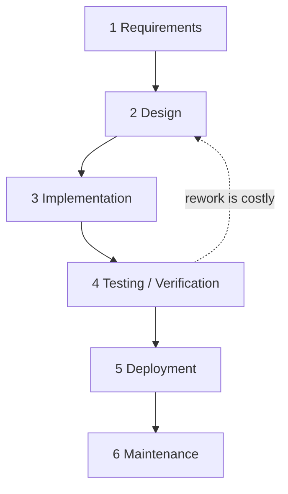
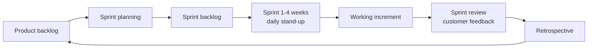
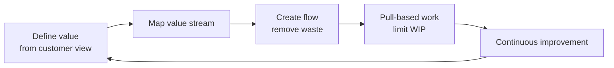
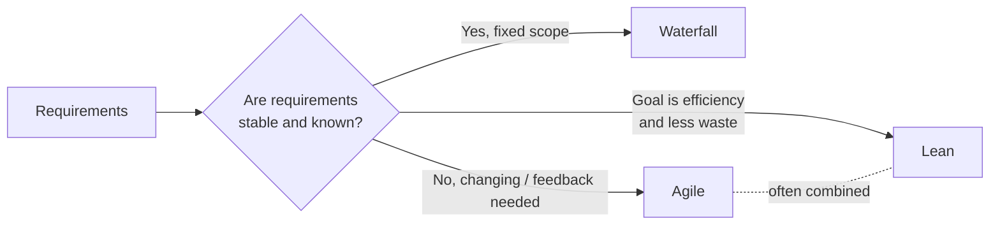

# T01 · Software dev methods: agile, lean, waterfall

## TL;DR (teach-back card)
- **Waterfall** = fixed sequential phases (requirements → design → implementation → testing → deployment → maintenance). Best when requirements are stable and known. Feedback only at the end.
- **Agile** = short iterations (Scrum sprints ≤ 1 month) that each deliver working software, with continuous customer feedback. Best when requirements change.
- **Lean** = Toyota-derived; maximise customer value, eliminate waste (partially done work, extra features, handoffs, delays, task switching, defects). A philosophy that Kanban and agile put into practice.
- **Trap:** Lean is not "agile with a different name". Keywords: "eliminate waste / value stream / Toyota" → Lean. "Sprint / backlog / stand-up" → Agile (Scrum). "Phases in order, no overlap" → Waterfall.

## Concepts

### T01.01 · Waterfall
**Must cover:**
- [x] Sequential phases: requirements → design → implementation → testing → deployment → maintenance
- [x] Plan-driven, each phase completes before the next starts
- [x] Strengths and weaknesses
- [x] When it fits

**Notes:**
- High-level idea: **plan everything up front, then execute in one pass**. Phase-gated, with sign-off at each gate.
- Phases (Royce-style names vary): Requirements → Design → Implementation → Testing / Verification → Deployment → Maintenance.
- Going back is possible but expensive (the dotted line below).
- **Pros:** clear milestones, heavy documentation, predictable cost and schedule, easy to manage and audit.
- **Cons:** late feedback, bugs found late, changes are costly, the customer sees working software only at the end.
- **Fits:** fixed and well-understood requirements, regulated or contract-driven work, hardware-coupled projects.
- Network analogy: a traditional change-window project (design → build → test → cutover).



### T01.02 · Agile
**Must cover:**
- [x] Iterative and incremental: working software in short iterations (sprints, 1-4 weeks)
- [x] Agile Manifesto: 4 values
- [x] Continuous customer feedback; requirements may change between iterations
- [x] Strengths and weaknesses; when it fits

**Notes:**
- High-level idea: **deliver small slices often, learn from feedback, adapt**.
- *Iterative* = repeat cycles and refine. *Incremental* = each cycle adds usable functionality. Agile is both.
- Manifesto values (left is valued more, right still has value):
  - Individuals and interactions **over** processes and tools
  - Working software **over** comprehensive documentation
  - Customer collaboration **over** contract negotiation
  - Responding to change **over** following a plan
- Selected principles: welcome changing requirements even late; deliver working software frequently (couple of weeks to couple of months, prefer shorter); working software is the primary measure of progress; business people and developers work together daily; regular team retrospectives.
- **Pros:** fast feedback, handles change, early and frequent releases.
- **Cons:** scope and end date less predictable, needs an engaged customer, lighter documentation.
- **Fits:** unclear or evolving requirements, products that need rapid feedback, software and NetDevOps teams shipping small tested changes.

### T01.03 · Agile frameworks
**Must cover:**
- [x] Scrum roles: product owner, scrum master, developers
- [x] Scrum artifacts: product backlog, sprint backlog, increment
- [x] Scrum events: sprint planning, daily stand-up, sprint review, retrospective
- [x] Kanban and XP named

**Notes:**
- Scrum = the most common agile framework. "Ceremony detail" is low priority; know the vocabulary and which item belongs where.
- **Roles** (Scrum Guide 2020 calls the team "Developers"; older material says "development team"):

| Role | Owns |
|---|---|
| Product Owner | Product backlog, priorities, value |
| Scrum Master | The process; removes impediments; coaches the team |
| Developers | Build the increment; self-organising |

- **Artifacts:** Product Backlog (ordered list of everything wanted) → Sprint Backlog (items picked for this sprint + plan) → Increment (usable, "done" result).
- **Events:** Sprint (fixed length, ≤ 1 month, contains all the others) · Sprint Planning · Daily Scrum / stand-up (15 min) · Sprint Review (inspect the increment with stakeholders) · Sprint Retrospective (improve the process).
- **Kanban:** visual board (To Do / Doing / Done), **limit work-in-progress (WIP)**, continuous flow with no fixed sprints.
- **XP (Extreme Programming):** engineering practices such as pair programming, TDD, continuous integration, small releases.



### T01.04 · Lean
**Must cover:**
- [x] Origin: Toyota Production System
- [x] Maximise customer value, minimise waste
- [x] The 7 lean software principles
- [x] Waste types and tools (value stream mapping, Kanban, WIP limits)

**Notes:**
- High-level idea: **everything that doesn't add customer value is waste; remove it and let work flow**.
- Origin: Toyota Production System (manufacturing). Adapted to software by Mary and Tom Poppendieck (2003).
- 7 principles:
  1. Eliminate waste
  2. Amplify learning
  3. Decide as late as possible
  4. Deliver as fast as possible
  5. Empower the team
  6. Build integrity in
  7. See the whole (optimise the whole)
- Waste in software (mapped from manufacturing waste):

| Software waste | Manufacturing equivalent |
|---|---|
| Partially done work | Inventory |
| Extra features | Overproduction |
| Relearning | Extra processing |
| Handoffs | Transportation |
| Delays / waiting | Waiting |
| Task switching | Motion |
| Defects | Defects |

- Tools: **value stream mapping**, Kanban board, small batch sizes, **WIP limits**, pull-based work.
- Relation to agile: Lean is a *philosophy / mindset*; Kanban and agile practices implement it. They are often combined ("lean-agile").



### T01.05 · Comparison
**Must cover:**
- [x] Waterfall = plan-driven, predictable, slow feedback
- [x] Agile = adaptive, fast feedback
- [x] Lean = flow and waste reduction, often combined with agile

**Notes:**

| | Waterfall | Agile | Lean |
|---|---|---|---|
| Flow | Linear phases | Iterative sprints | Continuous flow |
| Change | Resisted (costly) | Welcomed | Welcomed, waste-driven |
| Feedback | At the end | Every sprint | Continuous |
| Documentation | Heavy | Light | Light |
| Delivery | One big release | Frequent increments | Small, fast batches |
| Key goal | Predictability | Adaptability | Efficiency / less waste |
| Typical vocabulary | Phase, gate, sign-off | Sprint, backlog, stand-up | Waste, value stream, WIP |



### T01.06 · Exam angle
**Must cover:**
- [x] "Which method fits this scenario?"
- [x] "Characteristic of X" questions

**Notes:**
- Two question shapes: **scenario → method** and **characteristic → method**. Keyword spotting wins most of them.
- Cue table:

| Cue in the question | Answer |
|---|---|
| Phases in strict order, no overlap; sign-off between phases | Waterfall |
| Fixed requirements, regulated, contract with fixed scope | Waterfall |
| Short cycles, customer feedback, changing requirements | Agile |
| Sprint, backlog, product owner, stand-up | Agile (Scrum) |
| Eliminate waste, maximise value, Toyota, value stream | Lean |
| Visual board + WIP limit | Kanban (lean/agile) |
| Customer sees product only at the end | Waterfall drawback |

- Relevance to network automation: agile/DevOps fits NetDevOps (small, frequent, tested changes); waterfall resembles traditional change-window projects.

## Exam traps
- **Agile vs Lean:** agile = iterations and feedback; lean = waste elimination and flow. "Eliminate waste" is the giveaway for Lean even if the scenario mentions short cycles.
- **Iterative vs incremental:** iterative = revisit and refine; incremental = add pieces. Agile does both.
- **Scrum vs agile:** Scrum is *one framework* that implements agile. Agile is the umbrella; Kanban and XP are others.
- **Scrum Master ≠ project manager:** it serves the process and removes blockers. The **Product Owner** owns the backlog and priorities.
- **Product backlog vs sprint backlog:** product = everything wanted (whole product); sprint = what was picked for this sprint.
- **Kanban has no sprints:** continuous flow with WIP limits; Scrum has fixed-length sprints.
- **Waterfall testing comes after implementation:** "bugs found late" and "customer feedback only at the end" are waterfall weaknesses.
- **Manifesto wording:** "over", not "instead of". Documentation, process, contracts and plans still have value.
- **Scenario:** "Requirements are fixed by a regulator and will not change" → Waterfall, not Agile.

## Examples
Pure theory topic; these are runnable helpers to drill the cues. Python 3 standard library only.

```python
#!/usr/bin/env python3
"""Drill: map a scenario keyword to the dev method. Run: python3 t01_drill.py"""
CUES = {
    "waterfall": ["phase gate", "sign-off", "fixed scope", "no overlap", "regulated"],
    "agile": ["sprint", "backlog", "stand-up", "changing requirements", "customer feedback"],
    "lean": ["waste", "value stream", "toyota", "wip limit", "flow"],
}

def classify(text: str) -> str:
    text = text.lower()
    scores = {m: sum(c in text for c in cues) for m, cues in CUES.items()}
    best = max(scores, key=scores.get)
    return best if scores[best] else "unknown"

if __name__ == "__main__":
    for s in [
        "Team runs two-week sprints with a product backlog and daily stand-up",
        "Map the value stream and remove waste such as handoffs",
        "Requirements are fixed; each phase needs sign-off before the next starts",
    ]:
        print(f"{classify(s):10} <- {s}")
```

Expected output:

```
agile      <- Team runs two-week sprints with a product backlog and daily stand-up
lean       <- Map the value stream and remove waste such as handoffs
waterfall  <- Requirements are fixed; each phase needs sign-off before the next starts
```

Network-flavoured scenario pairs to recite:
- Migrating a data-centre core during a fixed change window with a signed-off design → Waterfall.
- Building an Ansible/pyATS pipeline where the ops team requests changes every week → Agile.
- Cutting the 5 handoffs between ticket, approval and config push → Lean.

## Practice questions

**Q1.** A project has fixed, regulator-approved requirements. Work proceeds Requirements → Design → Implementation → Testing → Deployment, and each phase must be signed off before the next begins. Which method is this?
- A. Agile
- B. Lean
- C. Waterfall
- D. Kanban

<details><summary>Answer</summary>

**C.** Strict sequential phases with sign-off gates = Waterfall.

</details>

**Q2.** Which Agile Manifesto value is stated correctly?
- A. Processes and tools over individuals and interactions
- B. Working software over comprehensive documentation
- C. Contract negotiation over customer collaboration
- D. Following a plan over responding to change

<details><summary>Answer</summary>

**B.** The other three are reversed. The manifesto's left-hand items are valued more.

</details>

**Q3.** A team wants to reduce partially done work, handoffs and delays, and uses a Kanban board with WIP limits. Which approach is this?
- A. Waterfall
- B. Lean
- C. Scrum sprint planning
- D. Extreme Programming

<details><summary>Answer</summary>

**B.** Removing waste and limiting WIP are Lean practices, which Kanban implements.

</details>

**Q4.** Which Scrum role owns and prioritises the product backlog?
- A. Scrum Master
- B. Developers
- C. Product Owner
- D. Stakeholder

<details><summary>Answer</summary>

**C.** The Product Owner owns and orders the product backlog. The Scrum Master coaches the process and removes impediments.

</details>

**Q5. (ordering)** Put the Waterfall phases in order:
`Testing` · `Requirements` · `Maintenance` · `Implementation` · `Deployment` · `Design`

<details><summary>Answer</summary>

Requirements → Design → Implementation → Testing → Deployment → Maintenance. Each phase completes before the next starts.

</details>

**Q6. (ordering)** Put one Scrum cycle in order:
`Sprint review` · `Sprint planning` · `Retrospective` · `Sprint (daily stand-ups)` · `Product backlog ordered`

<details><summary>Answer</summary>

Product backlog ordered → Sprint planning → Sprint (daily stand-ups) → Sprint review → Retrospective. The sprint backlog is created in planning; the increment is inspected in the review.

</details>

**Q7. (complete the matching)** Complete each sentence with Waterfall, Agile or Lean:
1. The customer first sees working software at the very end: ______
2. Sprints produce a working increment and the plan adapts to feedback: ______
3. The aim is to maximise customer value and minimise waste, derived from the Toyota Production System: ______

<details><summary>Answer</summary>

1. Waterfall · 2. Agile · 3. Lean.

</details>

**Q8.** An operations team receives frequently changing requests for its automation tooling and wants to ship small, tested changes each week with stakeholder feedback. Which TWO choices best fit?
- A. Waterfall
- B. Agile with short sprints
- C. Lean practices such as limiting WIP
- D. A single big-bang release after full documentation

<details><summary>Answer</summary>

**B and C.** Changing requirements and fast feedback need agile; lean practices reduce waste and keep flow. Waterfall and big-bang releases resist change.

</details>

## Study aids
| ID | Type | Item | Min | Source |
|---|---|---|---|---|
| T01.1 | Video | Software Development Practices for all IT Professionals | 4 | CBT module |
| T01.2 | Top-up | Agile vs lean vs waterfall comparison | 30 | DevNet Learning Labs / OCG ch. 1 |

- CBT coverage is **Partial** (blueprint 1.4): no side-by-side comparison, hence top-up T01.2. Section T01.05 of this note is that comparison.

## Sources
- Agile Manifesto: https://agilemanifesto.org/
- Principles behind the Agile Manifesto: https://agilemanifesto.org/principles.html
- Scrum Guide (2020): https://scrumguides.org/scrum-guide.html
- Poppendieck, *Lean Software Development: An Agile Toolkit* (2003): principles and software wastes, as summarised at https://activecollab.com/blog/project-management/the-first-principle-of-lean-management-eliminate-waste and https://medium.com/@markbarbs/the-7-wastes-of-lean-software-development-1a6acbe9d5d7 (secondary sources)
- Royce, "Managing the Development of Large Software Systems" (1970), origin of the waterfall diagram: https://en.wikipedia.org/wiki/Winston_W._Royce
- Exam topics PDF (exact blueprint wording for 1.4): https://learningcontent.cisco.com/documents/marketing/exam-topics/200-901-CCNAAUTO_v.1.1.pdf

## To verify
- ⚠ verify: Poppendieck waste list and wording. Sources disagree slightly (some list "extra processes", "management activities", "delays" vs "waiting"). Check the book or the DevNet/OCG chapter and align to its wording.
- ⚠ verify: exact wording of blueprint 1.4 in the Cisco PDF (`blueprint-map.csv` is paraphrased). Confirm the exam only asks to *compare* agile, lean and waterfall.
- ⚠ verify: Daily Scrum timebox of 15 minutes. It is from the Scrum Guide but was not visible in the extracted text; re-check the guide.
- ⚠ verify: the OCG / DevNet Learning Labs treatment (T01.2). It was not read for this draft, so check its terminology (e.g. "Developers" vs "development team") matches.
- Open (not a ⚠ claim): the CBT video's depth is unknown. Only the title is known; Bob to note whether it covers lean at all.
