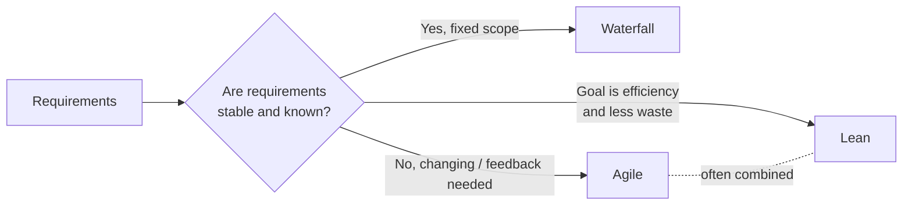
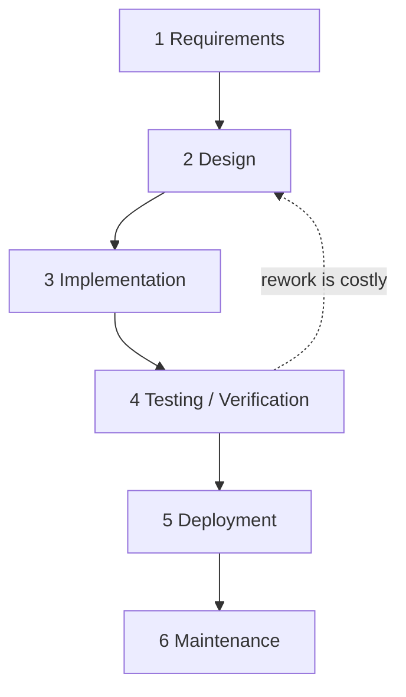
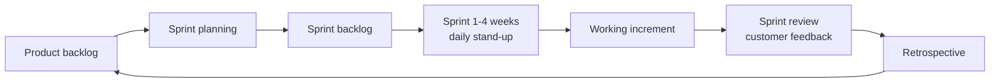
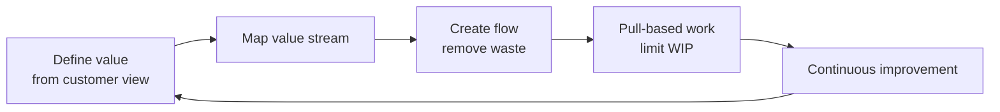

# T01 — Software Development Methods: Waterfall, Agile, Lean
**Blueprint 1.4 · CBT: Partial · 8 min**

## 1. Big picture
- A **software development methodology** = the process a team uses to go from requirement → running software.
- Three to know: **Waterfall** (sequential), **Agile** (iterative), **Lean** (eliminate waste).
- Exam angle: given a scenario, pick the method that fits.

## 2. Waterfall
- **Sequential, phase-gated**: each phase finishes before the next starts.
- Phases: Requirements → Design → Implementation → Testing (Verification) → Deployment → Maintenance.
- Little/no going back; changes are expensive.
- **Pros**: clear milestones, heavy documentation, predictable budget/schedule, easy to manage.
- **Cons**: late feedback, bugs found late, inflexible to change, customer sees product only at the end.
- **Fits**: fixed/well-understood requirements, regulated work, hardware-tied projects.

## 3. Agile
- **Iterative + incremental**: build in short cycles (**sprints**, usually 1–4 weeks), each producing working software.
- Based on the **Agile Manifesto** values:
  - Individuals and interactions > processes and tools
  - Working software > comprehensive documentation
  - Customer collaboration > contract negotiation
  - Responding to change > following a plan
- Continuous customer feedback; requirements can change between sprints.
- **Pros**: fast feedback, adapts to change, frequent releases, early value.
- **Cons**: less predictable scope/end date, needs engaged customer, less documentation.
- Common frameworks: **Scrum** (sprints, roles), **Kanban** (visual board, limit WIP), XP.
- Scrum vocabulary (light touch; "ceremony detail" is low priority): product backlog, sprint backlog, sprint, daily stand-up, sprint review, retrospective.

## 4. Lean
- Origin: **Toyota Production System** (manufacturing) applied to software.
- Core idea: **maximise customer value, minimise waste**.
- 7 principles (Poppendieck):
  - Eliminate waste
  - Amplify learning
  - Decide as late as possible
  - Deliver as fast as possible
  - Empower the team
  - Build integrity in
  - See the whole
- Waste examples: unused features, waiting/handoff delays, partially done work, extra processes, defects, task switching.
- Tools: value-stream mapping, Kanban, small batch sizes, limiting work-in-progress.
- Relation to Agile: Lean is a *philosophy*; Agile methods (esp. Kanban) implement much of it.

## 5. Comparison table
| | Waterfall | Agile | Lean |
|---|---|---|---|
| Flow | Linear phases | Iterative sprints | Continuous flow |
| Change | Resisted | Welcomed | Welcomed, waste-driven |
| Feedback | At end | Every sprint | Continuous |
| Docs | Heavy | Light | Light |
| Delivery | One big release | Frequent increments | Small, fast batches |
| Key goal | Predictability | Adaptability | Efficiency / less waste |

## 6. Exam tips
- "Phases completed in order, no overlap" → **Waterfall**.
- "Short cycles, customer feedback, adapt to changing requirements" → **Agile**.
- "Eliminate waste / maximise value / Toyota" → **Lean**.
- Relevance to network automation: Agile/DevOps fits NetDevOps (small, frequent, tested changes); Waterfall resembles traditional change-window network projects.
- **Skip**: Scrum ceremony minutiae.
