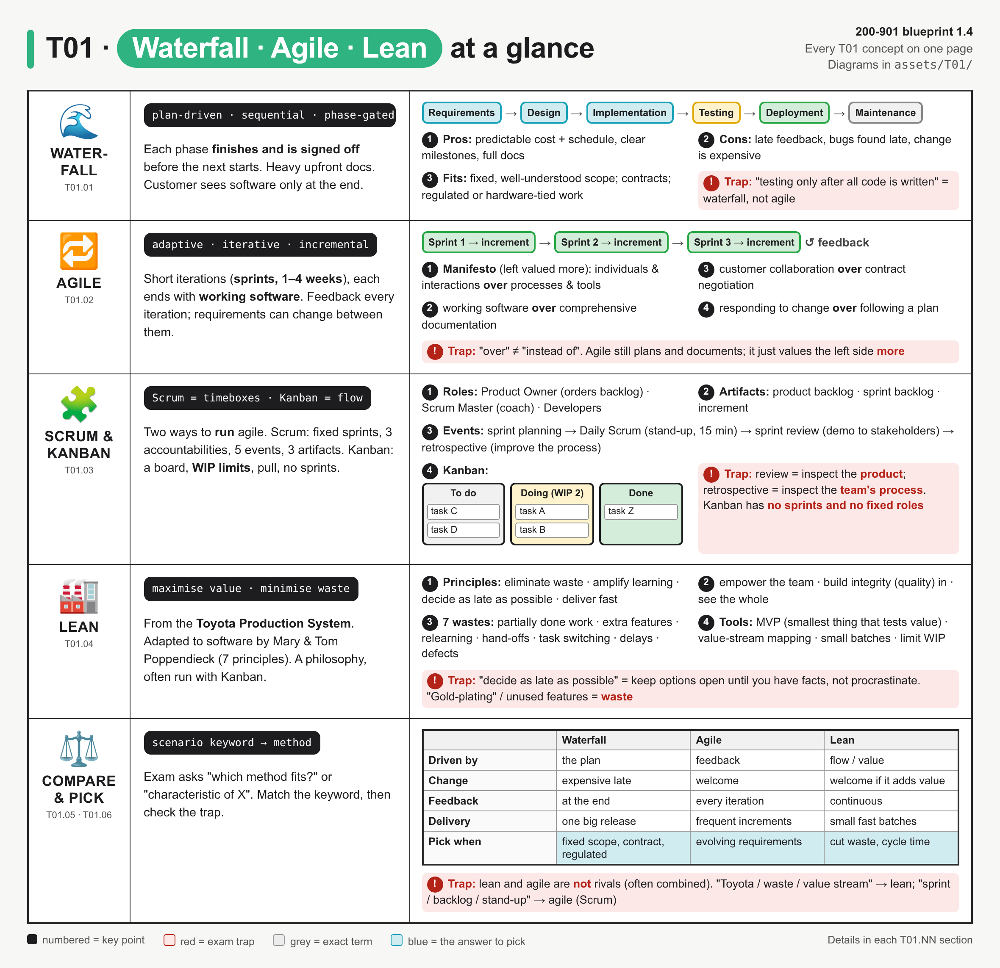
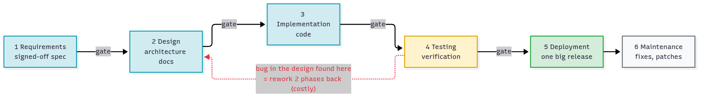
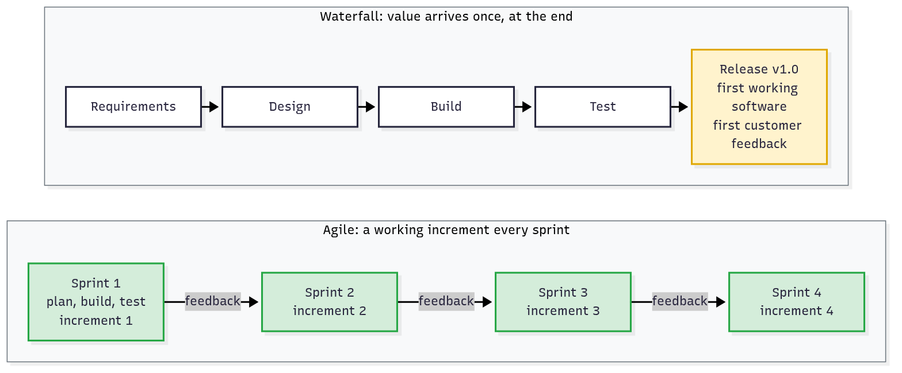
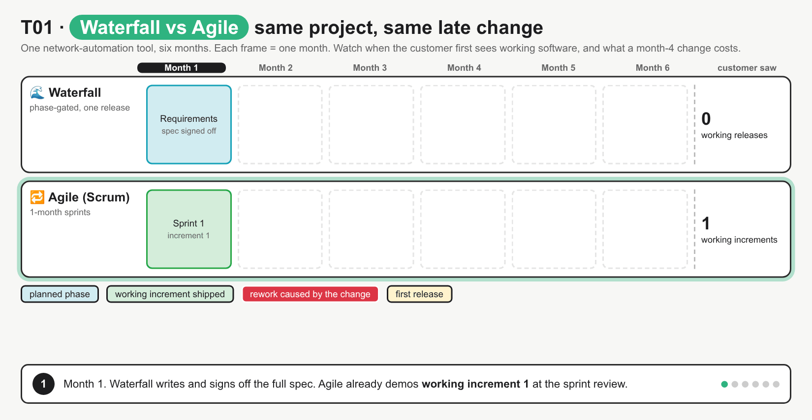
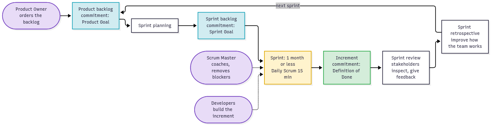
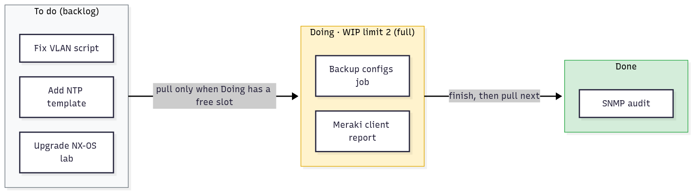
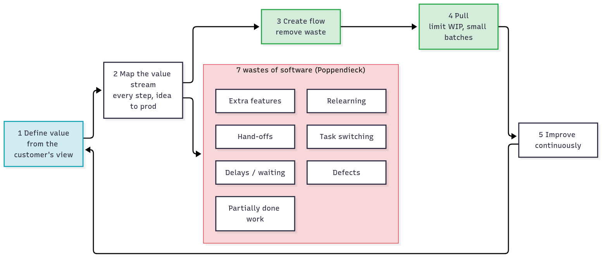
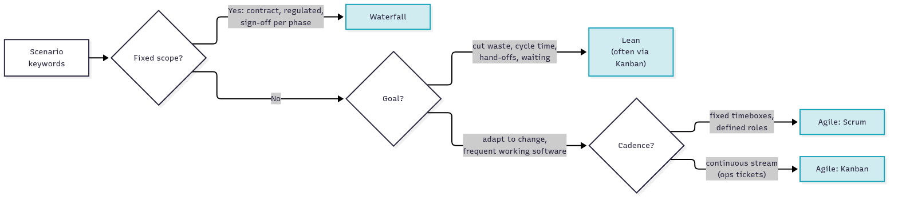

# T01 · Software dev methods: agile, lean, waterfall

> Owner: **Bob** · Blueprint: **1.4** · CBT coverage: **Partial** · Learn by 2026-10-05 · Teach-back 2026-10-08



*Read it top to bottom: one row per method, then the comparison row. The IDs under each icon map to the T01.NN sections, numbered circles are key points, red boxes are exam traps, and blue cells are the answer to pick for a scenario.*

## TL;DR (teach-back card)

- **Waterfall = plan-driven and sequential.** Requirements → design → implementation → testing → deployment → maintenance. Each phase is signed off before the next one starts. Predictable, but feedback comes late and late change is expensive. Pick it for fixed scope, contracts and regulated work.
- **Agile = adaptive and iterative.** Short iterations (sprints of 1–4 weeks) each deliver **working software**, so feedback arrives every iteration and requirements can change. Scrum runs it with timeboxes (Product Owner, Scrum Master, Developers; planning, Daily Scrum, review, retrospective). Kanban runs it as continuous flow (board, WIP limits, pull).
- **Lean = maximise customer value, minimise waste.** It comes from the Toyota Production System. Waste in software means partially done work, extra features, relearning, hand-offs, task switching, delays and defects. Tools: MVP, value-stream mapping, small batches, limit WIP. It is often combined with agile.
- **Trap:** match the keyword. "Sequential, sign-off, testing at the end" → waterfall. "Sprint, backlog, stand-up, changing requirements" → agile. "Toyota, waste, value stream, cycle time" → lean. Lean and agile are not rivals.

## Concepts

How the six concept IDs fit together:

- T01.01–T01.04 each describe **one way to organise the work**.
- T01.05–T01.06 compare them, and you need that comparison for the exam.
- Every diagram uses the same colours: blue = planned / the answer to pick, green = working software delivered, yellow = partial or in progress, red = waste or rework.

Network-engineer framing:

- A classic data-centre build is close to waterfall: HLD → LLD → build → test → cutover in a change window.
- NetDevOps (small, tested, frequent config changes through CI/CD; see T28) is agile and lean applied to the network.

### T01.01 · Waterfall

**Must cover:**
- [x] Sequential phases: requirements → design → implementation → testing → deployment → maintenance
- [x] Each phase finishes (and is signed off) before the next starts
- [x] Heavy upfront documentation; change late in the project is expensive
- [x] Fits fixed, well-understood requirements (e.g. regulated projects)

**Notes:**

- A **software development lifecycle (SDLC)** is the process a team follows to get from an idea to running software. Waterfall, agile and lean are three different ways to run it.
- **Waterfall** is a **linear, sequential** lifecycle. Work flows "downhill" through fixed phases:
  1. **Requirements**: gather everything up front, then sign off a full specification.
  2. **Design**: architecture and detailed design docs.
  3. **Implementation**: write the code.
  4. **Testing (verification)**: test the whole system against the spec.
  5. **Deployment**: one big release to the customer.
  6. **Maintenance**: bug fixes and patches after go-live.
- **Phase gates:** each phase has to finish and be **signed off** before the next one starts. Phases don't overlap, and going back is rare.
- **Documentation-heavy:** each phase hands a document to the next one (spec → design doc → test plan).
- **Cost of change rises late.** If testing finds a design flaw, you go back two or more phases and redo the design, code and tests.



*Each arrow is a sign-off gate. Testing happens only after all the code is written, so a design bug found there sends you back two phases (red).*

| Pros | Cons |
|---|---|
| Predictable budget and schedule; clear milestones | Customer sees working software only at the end |
| Full documentation; easy to audit and manage | Bugs and wrong requirements are found late |
| Works with fixed-price contracts | Inflexible: late change is expensive |

- **When it fits:**
  - requirements are **fixed and well understood**
  - a contract or regulator needs a signed-off scope and an audit trail (e.g. medical, aerospace, government)
  - work is tied to hardware or a physical build that can't be iterated cheaply
- **Network analogy:** HLD → LLD → staging → test → cutover in a single change window is waterfall.

### T01.02 · Agile

**Must cover:**
- [x] Iterative and incremental: deliver working software in short iterations (sprints, 1-4 weeks)
- [x] Agile Manifesto values: individuals and interactions, working software, customer collaboration, responding to change
- [x] Continuous feedback; requirements can change between iterations

**Notes:**

- **Agile** is a set of values and principles, not one specific process. It was written down in the **Agile Manifesto** (2001).
- **Iterative:** you repeat a short cycle of plan → build → test → review.
- **Incremental:** each cycle adds a slice of **working, tested software** (an increment) on top of the last one.
- **Short iterations:** usually 1–4 weeks. In Scrum they are called **sprints**, and the Scrum Guide caps a sprint at one month.
  - The Manifesto principle itself says "from a couple of weeks to a couple of months, with a preference to the shorter timescale".
- **The four values.** The Manifesto says: "while there is value in the items on the right, we value the items on the left more."

| Valued more (left) | over | Valued less (right) |
|---|---|---|
| Individuals and interactions | over | processes and tools |
| Working software | over | comprehensive documentation |
| Customer collaboration | over | contract negotiation |
| Responding to change | over | following a plan |

- **Twelve principles** sit behind the values. The exam-relevant ones:
  - early and continuous delivery of valuable software
  - welcome changing requirements, even late
  - business people and developers work together daily
  - working software is the primary measure of progress
  - simplicity: maximise the amount of work **not** done
  - the team reflects at regular intervals and adjusts
- **Continuous feedback:** the customer sees a working increment at the end of every iteration. Their feedback reorders the backlog for the next iteration, so **requirements can change between iterations**.



*Same project, two timelines. In waterfall the customer's first feedback comes with the final release (yellow). In agile there is working software and feedback after every sprint (green).*



*Month 1 → 6: waterfall goes requirements → design → build → test. At month 4 the customer asks for IPv6, so waterfall goes back through design and build (red) and releases once in month 6. Agile ships an increment every month and ships IPv6 in sprint 5. It fixes the misconception that a late change costs the same under both methods.*

| Pros | Cons |
|---|---|
| Fast feedback, early value, frequent releases | Final scope and end date are less predictable |
| Adapts to changing requirements | Needs an engaged customer / product owner |
| Problems surface early (every iteration is tested) | Lighter documentation can be a problem for audits |

- **Network analogy:** NetDevOps pushes small, tested config changes often (via CI/CD, T28) instead of one big quarterly change window.

### T01.03 · Agile frameworks

**Must cover:**
- [x] Scrum: product owner, scrum master, dev team; product backlog, sprint backlog, increment; sprint planning, daily stand-up, sprint review, retrospective
- [x] Kanban: visual board (To do / Doing / Done), WIP limits, continuous flow instead of sprints

**Notes:**

- Agile is the philosophy. **Scrum** and **Kanban** are two common frameworks for running it day to day. (XP, Extreme Programming, is a third, with engineering practices such as pair programming and TDD; see T32.)
- The tracker marks ceremony detail as low priority. Know the names and what each one is for, not the minutes.

**Scrum: timeboxed sprints** (terms from the 2020 Scrum Guide)

- **Three accountabilities (roles), one Scrum Team** (typically 10 or fewer people, no sub-teams):

| Role | Does |
|---|---|
| **Product Owner** | Owns and **orders the product backlog**; maximises value; decides *what* gets built |
| **Scrum Master** | Coaches the team on Scrum, removes impediments; a servant-leader, **not** a project manager |
| **Developers** | Build the increment each sprint; decide *how* (the 2020 guide says "Developers"; older material says "Development Team") |

- **Three artifacts:**

| Artifact | What it is | Commitment |
|---|---|---|
| **Product backlog** | Ordered list of everything the product might need | Product Goal |
| **Sprint backlog** | Items picked for this sprint, plus the plan to deliver them | Sprint Goal |
| **Increment** | The working, usable result | Definition of Done |

- **Events.** The **sprint** is the container for all the other events. It is fixed-length, one month or less.

| Event | Purpose | Timebox (1-month sprint) |
|---|---|---|
| **Sprint planning** | Choose backlog items and the Sprint Goal | up to 8 h |
| **Daily Scrum** (daily stand-up) | Developers inspect progress toward the Sprint Goal, adapt the plan | 15 min |
| **Sprint review** | Stakeholders inspect the **increment** (the product) and give feedback | up to 4 h |
| **Sprint retrospective** | The team inspects **how it worked** (people, process, tools) and plans improvements | up to 3 h |



*The Product Owner orders the product backlog → sprint planning picks the sprint backlog → the sprint (with a Daily Scrum) produces an increment → review (product) → retrospective (process) → the next sprint.*

**Kanban: continuous flow**

- **Kanban** is a pull-based way to manage flow. It came from Toyota's card ("kanban" = signboard) system.
- **Visual board:** columns for workflow states, at minimum **To do / Doing / Done**. Each card is one work item.
- **WIP limits:** a cap on how many items can sit in a column (e.g. Doing ≤ 2). This stops multitasking and exposes bottlenecks.
  - The 2025 Kanban Guide words it as "explicitly control the number of work items" rather than "WIP limit". The idea is the same.
- **Pull, not push:** a member pulls a new card only when the WIP limit leaves a free slot.
- **Continuous flow:** **no sprints and no prescribed roles**. Items are released whenever they're done.
- **Flow metrics:** WIP, throughput (items finished per unit of time), work item age, and cycle time (start → finish).



*Doing is at its WIP limit of 2, so nobody pulls "Fix VLAN script" until a Doing card moves to Done.*

| | Scrum | Kanban |
|---|---|---|
| Cadence | Fixed sprints (≤ 1 month) | Continuous flow |
| Roles | PO, Scrum Master, Developers | None prescribed |
| Change mid-cycle | Avoided within a sprint (Sprint Goal fixed) | Any time, if the WIP limit allows |
| Limits work by | What fits in the sprint | WIP limit per column |
| Network fit | Feature work: a new automation tool | Ops / ticket queue: NOC changes, requests |

### T01.04 · Lean

**Must cover:**
- [x] Origin: Toyota Production System; maximise customer value, minimise waste
- [x] Principles: eliminate waste, amplify learning, decide as late as possible, deliver fast, empower the team, build quality in, see the whole
- [x] Waste examples: partially done work, extra features, hand-offs, waiting, defects
- [x] MVP (minimum viable product) and value-stream mapping

**Notes:**

- **Origin:** the **Toyota Production System** (lean manufacturing). Mary and Tom Poppendieck adapted it to software in *Lean Software Development: An Agile Toolkit* (2003).
- **Core idea:** **maximise customer value, minimise waste.** Waste is anything that doesn't add value from the customer's point of view.
- **Seven principles** (Poppendieck). Later books renamed some of them; both names are in brackets:
  1. **Eliminate waste**
  2. **Amplify learning** (create knowledge): short feedback loops, experiments
  3. **Decide as late as possible** (defer commitment): keep options open until you have facts. This is **not** procrastination.
  4. **Deliver as fast as possible**: small batches, short cycle time
  5. **Empower the team** (respect people): the people doing the work decide how
  6. **Build integrity in** (build quality in): test as you go, not at the end
  7. **See the whole** (optimise the whole): optimise the end-to-end flow, not one team's step
- **Seven wastes of software**, mapped from manufacturing:

| Software waste | Manufacturing equivalent | Example |
|---|---|---|
| Partially done work | Inventory | Code written but never merged or deployed |
| Extra features | Overproduction | "Gold-plating": features nobody asked for |
| Relearning | Extra processing | Re-solving a problem because nothing was written down |
| Hand-offs | Transportation | Dev → QA → ops tickets, losing context each time |
| Task switching | Motion | One engineer split across five projects |
| Delays / waiting | Waiting | Waiting a week for a change-board approval |
| Defects | Defects | Bugs found late, rework |

- **Lean tools:**
  - **MVP (minimum viable product):** the smallest product that tests whether customers value the idea. Build it, measure, learn, then decide what to build next. It avoids the "extra features" waste.
  - **Value-stream mapping:** draw every step from request to production, mark which steps add value and which are waiting, and remove the waste.
  - **Small batches and limited WIP** (often through a Kanban board), and **pull** instead of push.
- **Lean vs agile:** lean is a philosophy about **flow and waste**. Agile frameworks (especially Kanban) put much of it into practice. They are usually **combined**, not chosen between.



*Define value → map the value stream → create flow by removing the seven wastes (red) → pull with limited WIP → improve continuously, then loop.*

### T01.05 · Comparison

**Must cover:**
- [x] Waterfall = plan-driven, predictable, slow feedback; agile = adaptive, fast feedback; lean = flow and waste reduction (often combined with agile)
- [x] Pick by scenario: fixed scope/contract → waterfall; evolving requirements → agile; reduce waste/cycle time → lean

**Notes:**

| | Waterfall | Agile | Lean |
|---|---|---|---|
| Driven by | The plan | Feedback | Flow and customer value |
| Shape | Linear phases | Iterations (sprints) | Continuous flow |
| Requirements | Fixed up front | Evolve between iterations | Decided as late as possible |
| Change | Resisted, expensive late | Welcomed | Welcomed if it adds value |
| Feedback | At the end | Every iteration | Continuous |
| Delivery | One big release | Frequent increments | Small, fast batches |
| Testing | A phase after implementation | Inside every iteration | Built in (quality in) |
| Documentation | Heavy | Light ("just enough") | Light; extra docs = waste |
| Key goal | Predictability | Adaptability | Efficiency, less waste |
| Network analogy | HLD/LLD → one cutover | NetDevOps, small CI/CD changes | Cut approval waits and hand-offs |



*Ask in order: is the scope fixed (waterfall)? Is the goal cutting waste (lean)? Otherwise it's agile. Then fixed timeboxes → Scrum, continuous stream → Kanban.*

### T01.06 · Exam angle

**Must cover:**
- [x] "Which method fits this scenario?" and "characteristic of X" questions

**Notes:**

- Two question shapes: **"which method fits this scenario?"** and **"which is a characteristic of X?"** Both are keyword matching.

| Keyword in the question | Answer |
|---|---|
| sequential, phases, sign-off, gate, no overlap, testing after development, fixed requirements, contract, regulated | **Waterfall** |
| iterations, sprints, increments, backlog, stand-up, customer feedback, changing requirements, Manifesto | **Agile** (Scrum if roles/sprints are named) |
| board, WIP limit, pull, continuous flow, no sprints | **Kanban** (agile; implements lean) |
| Toyota, waste, value stream, MVP, cycle time, "decide as late as possible" | **Lean** |

- **Distractor pattern:** an answer that mixes keywords from two methods (e.g. "agile: each phase must be signed off before the next") is wrong.
- **"Characteristic of" pattern:** choose the option that is *defining* for that method, not just possible. Agile teams do write documentation, but "heavy upfront documentation" is a waterfall characteristic.

## Exam traps

- **"Over" ≠ "instead of":** the Manifesto values the left items **more**. Agile still plans, documents and uses tools.
- **Iterative + incremental = agile.** "Each phase completed before the next begins" = waterfall. Waterfall has no iterations.
- **Testing position:** a separate phase after all code is written → waterfall. Tested every iteration → agile. "Build quality in" → lean.
- **Sprint review vs retrospective:** review = inspect the **product/increment** with stakeholders. Retrospective = inspect **how the team works**. The retro closes the sprint.
- **Daily Scrum** is for the **Developers**, 15 min. It's not a status report to a manager.
- **Scrum Master ≠ project manager.** The **Product Owner** orders the backlog and decides *what*; the Scrum Master coaches and removes blockers.
- **Kanban has no sprints and no prescribed roles.** Its levers are the board, WIP limits and pull.
- **Lean ≠ "do less work".** It means less **waste**. Extra features nobody asked for are waste; so are waiting, hand-offs and partially done work.
- **"Decide as late as possible"** = defer irreversible decisions until you have facts. It's not "don't plan".
- **Lean and agile aren't opposites.** They are complementary and often combined (lean thinking + Kanban/Scrum practice).
- **Sprint length:** 1–4 weeks typical; the Scrum Guide caps it at one month. "Sprints of 3 months" is a wrong answer.
- **Waterfall isn't "wrong".** For fixed scope, regulated or contract-bound work it's the **correct** pick.

## Examples

This is a process topic, so there's no program to run. Practise with these worked scenarios instead. Cover the answer, say the method and the keyword that gives it away, then check.

**Drill 1 · Classify the scenario**

| # | Scenario | Answer · giveaway |
|---|---|---|
| 1 | A bank must deliver a payment gateway to a signed, fixed spec; the regulator audits each phase's documents | Waterfall · fixed scope, sign-off, audit docs |
| 2 | A NetOps team builds an internal self-service VLAN portal; users keep changing what they want after each demo | Agile (Scrum) · changing requirements, demos |
| 3 | The network change queue is a steady stream of tickets of different sizes; the team wants to see bottlenecks | Kanban · continuous stream, visualise flow |
| 4 | Changes sit 6 days waiting for CAB approval and pass through 4 hand-offs; management wants shorter cycle time | Lean · waiting and hand-off waste, cycle time |
| 5 | A startup ships the smallest possible app to test whether anyone will pay for it | Lean · MVP |
| 6 | A team does a 2-week cycle, a 15-minute daily sync, and a demo + lessons-learned at the end of each cycle | Agile (Scrum) · sprint, Daily Scrum, review, retrospective |

**Drill 2 · Name the Scrum piece**

- "Ordered list of everything the product might need" → product backlog.
- "Who decides that order?" → Product Owner.
- "Meeting where the team discusses what to change in its own process" → sprint retrospective.
- "Working, usable result that meets the Definition of Done" → increment.

**Drill 3 · Spot the waste** (lean, value-stream view of one config change)

```
request (0.5 h) → wait for design review (2 days) → write config (1 h)
→ hand-off to change team (1 day) → wait for CAB (5 days) → deploy (0.5 h)
```

- Value-adding time: about 2 h. Elapsed time: about 8 days.
- Wastes: **waiting** (review, CAB) and **hand-offs** (to the change team).
- Lean fix: automate the pre-checks and use a peer review in the merge request (T28) instead of a weekly CAB.

**Drill 4 · Kanban pull rule**

- The board has Doing WIP limit = 2, with 2 cards in Doing. A new urgent request arrives.
- Kanban answer: it goes to the top of To do. It is pulled when a Doing card finishes, or the team agrees an explicit expedite policy.
- You don't just start a third card. That breaks the WIP control and adds task-switching waste.

## Practice questions

**Q1.** A government agency contracts a vendor to build a records system. The requirements are fixed by law, every phase must produce documents for audit, and the price is fixed. Which method fits best?
A. Scrum  B. Kanban  C. Waterfall  D. Lean

<details><summary>Answer</summary>

**C.** Fixed requirements, sign-off documents per phase and a fixed-price contract are the waterfall case. (T01.01, T01.05)
</details>

**Q2.** Which statement is a characteristic of agile development?
A. Each phase must be completed and approved before the next begins
B. Working software is delivered in short iterations and requirements can change between them
C. All requirements are documented in full before design starts
D. Testing happens once, after implementation is finished

<details><summary>Answer</summary>

**B.** A, C and D all describe waterfall. Agile is iterative and incremental, with feedback each iteration. (T01.02)
</details>

**Q3.** Which two items are wastes in lean software development? (Choose two.)
A. Partially done work  B. Automated tests  C. Extra features nobody asked for  D. Short feedback loops  E. A visual board

<details><summary>Answer</summary>

**A, C.** Partially done work (inventory) and extra features (overproduction) are two of the seven wastes. Automated tests build quality in; feedback loops amplify learning; a board makes flow visible. (T01.04)
</details>

**Q4.** Put the Scrum events in the order they happen within one sprint: sprint retrospective · Daily Scrum · sprint planning · sprint review

<details><summary>Answer</summary>

**Sprint planning → Daily Scrum (every day) → sprint review → sprint retrospective.** The retrospective closes the sprint. (T01.03)
</details>

**Q5.** At the end of a sprint the team meets to discuss what slowed them down and agrees to change how code reviews are done. Which event is this?
A. Sprint planning  B. Daily Scrum  C. Sprint review  D. Sprint retrospective

<details><summary>Answer</summary>

**D.** The retrospective inspects the team's process. The sprint review inspects the product increment with stakeholders. (T01.03)
</details>

**Q6.** A NOC team handles a continuous stream of change tickets. They want no fixed iterations but want to stop engineers starting too many tickets at once. What should they use?
A. Waterfall with phase gates  B. Scrum with 4-week sprints  C. Kanban with WIP limits  D. An MVP

<details><summary>Answer</summary>

**C.** Kanban = continuous flow and a board with WIP limits (pull). Scrum needs sprints; an MVP is a lean product idea, not a workflow. (T01.03)
</details>

**Q7.** Which Agile Manifesto value is stated correctly?
A. Comprehensive documentation over working software
B. Following a plan over responding to change
C. Customer collaboration over contract negotiation
D. Processes and tools over individuals and interactions

<details><summary>Answer</summary>

**C.** The other three are reversed. The left-hand items (individuals, working software, collaboration, responding to change) are valued more. (T01.02)
</details>

**Q8.** A team's value-stream map shows 2 hours of actual work but 8 days of elapsed time, mostly spent waiting for approvals and hand-offs. Which method's thinking addresses this most directly?
A. Waterfall  B. Lean  C. Scrum  D. Design patterns

<details><summary>Answer</summary>

**B.** Value-stream mapping and removing waiting and hand-off waste are lean. (T01.04, T01.06)
</details>

## Study aids

| Aid | Type | Title | Est. min | Resource |
|---|---|---|---|---|
| T01.1 | Video | Software Development Practices for all IT Professionals | 4 | CBT module |
| T01.2 | Top-up | Agile vs lean vs waterfall comparison | 30 | DevNet Learning Labs / OCG ch. 1 |

- CBT coverage is **Partial** (blueprint 1.4). The gap: no side-by-side comparison of agile vs lean vs waterfall. This note's T01.05 table, the decision diagram and the drills are the T01.2 top-up.
- Skip / low priority: Ceremony detail

## Sources

- Overview image: HTML source `assets/T01/00-overview.html`, rendered to PNG (see `assets/README.md`). Diagrams: Mermaid sources in `assets/T01/*.mmd`. Animation: `assets/T01/07-change-race-anim.html` → `07-change-race.gif`.
- Cisco 200-901 v1.1 exam topics (1.4 "Compare software development methods (agile, lean, and waterfall)"): https://learningcontent.cisco.com/documents/marketing/exam-topics/200-901-CCNAAUTO_v.1.1.pdf (wording cross-checked against the DEVASC v1.1 PDF: https://learningcontent.cisco.com/documents/marketing/exam-topics/200-901-DEVASC-v1.1.pdf)
- Agile Manifesto values and the 12 principles: https://agilemanifesto.org/ · https://agilemanifesto.org/principles.html
- The 2020 Scrum Guide (accountabilities, events, timeboxes, artifacts and commitments, "Developers"): https://scrumguides.org/scrum-guide.html
- The Kanban Guide (definition of workflow, WIP control, pull, four flow metrics, no sprints or roles): https://kanbanguides.org/english/
- Scrum Alliance, lean software development, Poppendieck's 7 principles: https://resources.scrumalliance.org/Article/lean-software-development
- Cisco Press, DevNet Associate OCG table of contents (ch. 2 "Software Development and Design": SDLC, Waterfall, Lean, Agile): https://www.ciscopress.com/store/cisco-certified-devnet-associate-devasc-200-901-official-9780136642961

## To verify

- ⚠ verify `data/study-aids.csv` / `data/top-ups.csv` say the top-up is "OCG ch. 1". The Cisco Press table of contents puts Waterfall / Lean / Agile in **chapter 2** (Software Development and Design). Chapter 1 is the certification intro. Fix the CSV if Bob agrees (not edited here: `data/*` is out of scope for this pass).
- ⚠ verify The seven software wastes are listed slightly differently across sources ("relearning" vs "extra processes", "delays" vs "waiting"). This note uses the Poppendieck book list; check against the OCG wording if a practice question uses a different term.
- Fix to Bob's round-1 note: lean's "Tools: Kanban" stays, but the note now says Kanban is an **agile framework that implements lean**, so the two aren't presented as the same thing. The Scrum role "dev team" is now "Developers" (2020 Scrum Guide), with the old name kept.
- Scrum timeboxes (8 h / 15 min / 4 h / 3 h for a one-month sprint) are from the 2020 Scrum Guide. The exam is unlikely to test them (ceremony detail is low priority).
- No CBT content is claimed. The CBT module is listed only as a study aid.
