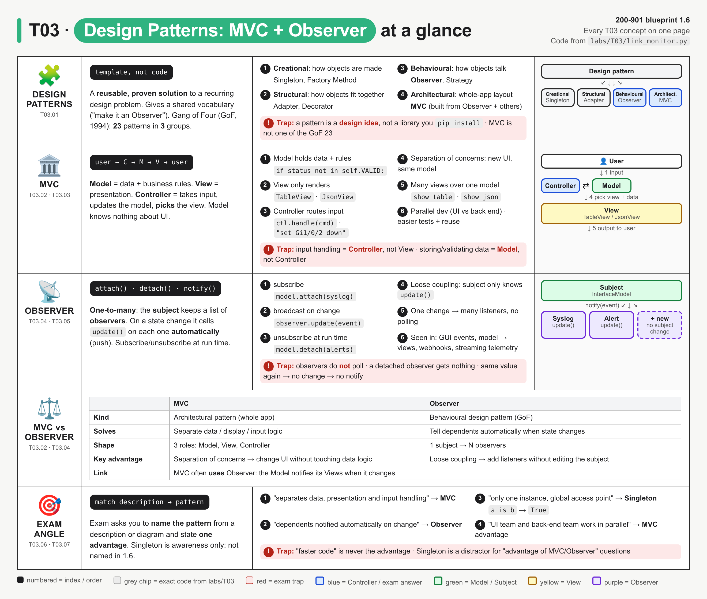
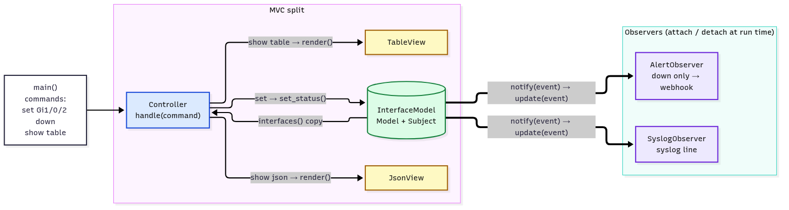
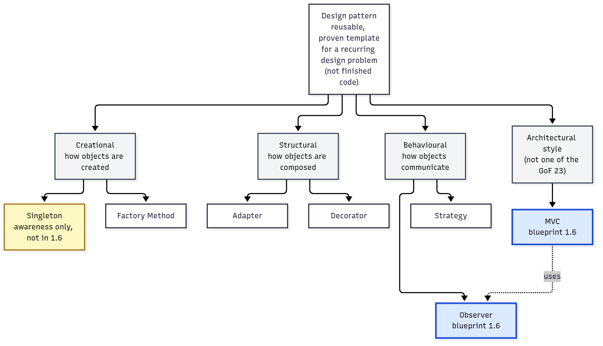
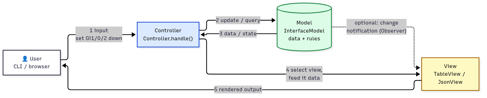
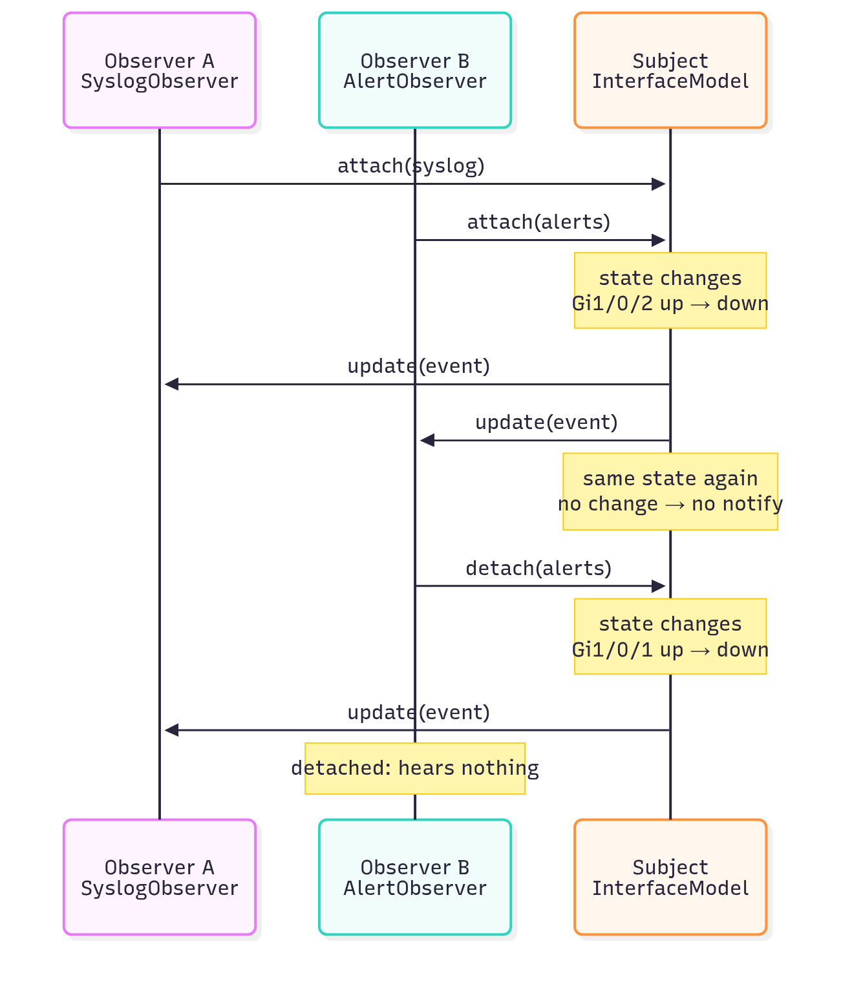
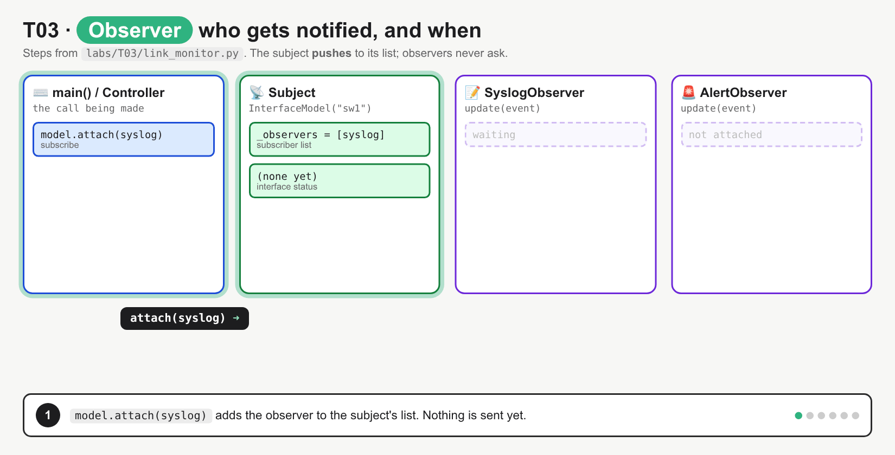
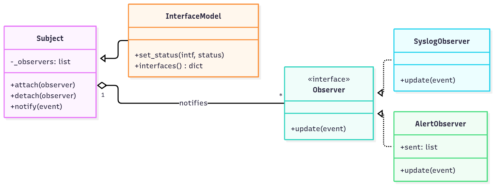
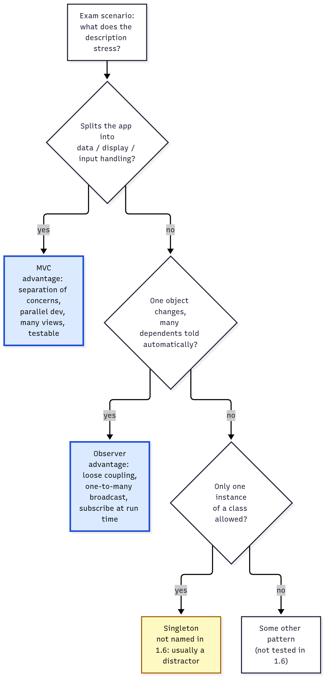

# T03 · Design patterns: MVC + Observer

> Owner: **Bob** · Blueprint: **1.6** · CBT coverage: **Full** (unconfirmed, see To verify) · Learn by 2026-10-05 · Teach-back 2026-10-08



*Read it top to bottom. Each row is one concept group (IDs under the row name), and the right column is a tiny diagram of its shape. Numbered items are lines from `labs/T03/link_monitor.py`, and red boxes are exam traps.*

## TL;DR (teach-back card)

- **Design pattern = a reusable, proven template for a recurring design problem, not code.** The Gang of Four (GoF) book groups 23 of them as creational, structural and behavioural. Blueprint 1.6 asks for the **advantages** of two: MVC and Observer.
- **MVC:** Model = data + rules, View = presentation, Controller = takes input, updates the model and picks the view. Flow: user → controller → model → view → user. **Advantage:** separation of concerns, so you can change the UI without touching data logic, build UI and back end in parallel, put many views on one model, and test each part alone.
- **Observer:** a subject keeps a list of observers and calls `update()` on each one automatically when its state changes. Observers attach/detach at run time. **Advantage:** loose coupling, because the subject only knows "has `update()`", and one change reaches many listeners with no polling. Webhooks and streaming telemetry follow the same push idea.
- **Trap:** "handles user input" = **Controller** (not View); "notified automatically" = **Observer** (not polling); Singleton isn't in 1.6, so it's usually the distractor.

## Concepts

Every section below points at the same small program. `labs/T03/link_monitor.py` is an interface-status monitor for one switch:

- **Observer:** `InterfaceModel` is the subject. `SyslogObserver` and `AlertObserver` are observers that react to every link change.
- **MVC:** `InterfaceModel` is also the model. `TableView` / `JsonView` are two views over the same data, and `Controller` turns typed commands into model updates or view choices.
- `labs/T03/test_link_monitor.py` tests the model with **no view and no real observer**. That shows the testability advantage (T03.03).

Only the Python standard library is used. Run `cd labs/T03 && python3 link_monitor.py`.



*Left half is the MVC split (blue Controller, green Model, yellow Views); right half is the Observer side. The model is both the MVC Model and the Observer Subject: that overlap is the "MVC uses Observer" link.*

**`labs/T03/link_monitor.py`**

```python
"""Interface-status monitor: the Observer pattern and an MVC split in one program (T03).

Run: python3 link_monitor.py
"""
import json


# ---------------------------------------------------------------- Observer
class Subject:
    """Observer pattern: keeps a list of observers and notifies each one on change."""

    def __init__(self):
        self._observers = []                       # the subscriber list

    def attach(self, observer):                    # subscribe at run time
        if observer not in self._observers:
            self._observers.append(observer)

    def detach(self, observer):                    # unsubscribe at run time
        self._observers.remove(observer)

    def notify(self, event):                       # push the change to every observer
        for observer in self._observers:
            observer.update(event)                 # the ONLY thing the subject knows about them


class SyslogObserver:
    """Observer 1: writes an IOS-style syslog line for every change."""

    def update(self, event):
        print(f"  [syslog] %LINK-3-UPDOWN: Interface {event['intf']}, changed state to {event['new']}")


class AlertObserver:
    """Observer 2: only cares about 'down'; would POST to a webhook (here: keeps a list)."""

    def __init__(self):
        self.sent = []

    def update(self, event):
        if event["new"] == "down":
            self.sent.append(event)
            print(f"  [alert]  {event['host']} {event['intf']} DOWN (was {event['old']}) -> webhook")


# ---------------------------------------------------------------- MVC: Model
class InterfaceModel(Subject):
    """Model: interface data + business rules. Knows nothing about display or input."""

    VALID = ("up", "down", "admin-down")

    def __init__(self, hostname):
        super().__init__()
        self.hostname = hostname
        self._status = {}

    def set_status(self, intf, status):
        if status not in self.VALID:               # business rule lives in the model
            raise ValueError(f"invalid status {status!r}, expected one of {self.VALID}")
        old = self._status.get(intf)
        if old == status:
            return                                 # no change -> no notification
        self._status[intf] = status
        self.notify({"host": self.hostname, "intf": intf, "old": old, "new": status})

    def interfaces(self):
        return dict(self._status)                  # a copy: views can't change the model


# ---------------------------------------------------------------- MVC: Views
class TableView:
    """View 1: human-readable table."""

    def render(self, hostname, interfaces):
        print(f"  {hostname:<6}{'Interface':<12}Status")
        for intf, status in sorted(interfaces.items()):
            print(f"  {'':<6}{intf:<12}{status}")


class JsonView:
    """View 2: same model data, rendered for an API client."""

    def render(self, hostname, interfaces):
        print("  " + json.dumps({"host": hostname, "interfaces": interfaces}, sort_keys=True))


# ---------------------------------------------------------------- MVC: Controller
class Controller:
    """Controller: takes user input, updates the model, selects the view."""

    def __init__(self, model, views):
        self.model = model
        self.views = views                         # {"table": TableView(), "json": JsonView()}

    def handle(self, command):
        print(f"> {command}")
        verb, *args = command.split()
        if verb == "set":                          # input -> update the model
            intf, status = args
            try:
                self.model.set_status(intf, status)
            except ValueError as err:
                print(f"  error: {err}")
        elif verb == "show":                       # input -> pick a view, feed it model data
            view = self.views[args[0]]
            view.render(self.model.hostname, self.model.interfaces())
        else:
            print(f"  error: unknown command {verb!r}")


def main():
    model = InterfaceModel("sw1")
    syslog, alerts = SyslogObserver(), AlertObserver()
    model.attach(syslog)                           # two observers subscribe
    model.attach(alerts)

    ctl = Controller(model, {"table": TableView(), "json": JsonView()})
    for cmd in ["set Gi1/0/1 up", "set Gi1/0/2 up", "set Gi1/0/2 down",
                "set Gi1/0/2 down", "set Gi1/0/3 flapping", "show table"]:
        ctl.handle(cmd)

    model.detach(alerts)                           # unsubscribe at run time
    print("(alerts observer detached)")
    for cmd in ["set Gi1/0/1 down", "show json"]:
        ctl.handle(cmd)

    print("Alerts sent:", len(alerts.sent))


if __name__ == "__main__":
    main()
```

**Output** (`python3 link_monitor.py`, Python 3.10):

```
> set Gi1/0/1 up
  [syslog] %LINK-3-UPDOWN: Interface Gi1/0/1, changed state to up
> set Gi1/0/2 up
  [syslog] %LINK-3-UPDOWN: Interface Gi1/0/2, changed state to up
> set Gi1/0/2 down
  [syslog] %LINK-3-UPDOWN: Interface Gi1/0/2, changed state to down
  [alert]  sw1 Gi1/0/2 DOWN (was up) -> webhook
> set Gi1/0/2 down
> set Gi1/0/3 flapping
  error: invalid status 'flapping', expected one of ('up', 'down', 'admin-down')
> show table
  sw1   Interface   Status
        Gi1/0/1     up
        Gi1/0/2     down
(alerts observer detached)
> set Gi1/0/1 down
  [syslog] %LINK-3-UPDOWN: Interface Gi1/0/1, changed state to down
> show json
  {"host": "sw1", "interfaces": {"Gi1/0/1": "down", "Gi1/0/2": "down"}}
Alerts sent: 1
```

### T03.01 · Design patterns

**Must cover:**

- [x] Reusable, proven solution to a recurring software design problem (a template, not code)
- [x] Gang of Four groups: creational, structural, behavioural

**Notes:**

- **What it is:** a named, proven way to structure code for a problem that keeps coming back. It's a **template/idea**, not finished code or a library. You implement it in your own language: `Subject`, `attach()` and `notify()` above are one Python way to write Observer.
- **Why use them (general benefits):** a shared vocabulary ("make the alerter an observer"), solutions already proven by others, maintainability, separation of concerns and easier testing.
- **Gang of Four (GoF):** *Design Patterns: Elements of Reusable Object-Oriented Software* (Gamma, Helm, Johnson, Vlissides, 1994) catalogues **23** patterns in **3** groups:

| Group | Question it answers | Examples |
|---|---|---|
| **Creational** | How are objects created? | Singleton, Factory Method, Builder |
| **Structural** | How are objects composed into bigger structures? | Adapter, Decorator, Facade |
| **Behavioural** | How do objects communicate and share responsibility? | **Observer**, Strategy, Command |

- **MVC is not one of the GoF 23.** It's an **architectural** pattern (how the whole app is split), older than the book (Smalltalk-80). The GoF book uses MVC in its introduction to show patterns such as Observer working together.



*Blue = the two patterns blueprint 1.6 names. Observer sits in the behavioural group; MVC is a separate architectural style that uses Observer. Yellow Singleton = awareness only.*

### T03.02 · MVC

**Must cover:**

- [x] Model: data and business logic (e.g. device inventory)
- [x] View: presentation/UI shown to the user
- [x] Controller: receives user input, updates the model, selects the view
- [x] Flow: user → controller → model → view → user

**Notes:**

- MVC splits an application into **3 responsibilities**:
  - **Model** = data + business logic (database, state, rules). It knows **nothing** about the UI. In the program, `InterfaceModel` holds `_status` and enforces the rule `if status not in self.VALID: raise ValueError(...)`. It never prints a table.
  - **View** = presentation (what the user sees). It only displays model data. `TableView.render()` and `JsonView.render()` take data and print it. Neither one changes anything.
  - **Controller** = handles user input, updates the Model and **picks** the View. It's the glue. `Controller.handle()` reads `verb, *args = command.split()`. For `set` it calls `self.model.set_status(...)`; for `show` it calls `self.views[args[0]].render(...)`.
- **Flow:** user acts → Controller → Model changes / is queried → Controller hands data to a View → View renders to the user. In the output: `> set Gi1/0/2 down` (input) → model updates → `> show table` (controller picks `TableView`) → table printed.
- **Optional extra link:** the Model can **notify** Views when it changes (that's Observer, T03.04). Per MDN, the model "will usually notify the view" when its data changes.
- **Real-world examples:**
  - Web frameworks: Rails; Django calls its version **MTV** (Model-Template-View, where Django's "view" plays the controller role); Flask + Jinja templates.
  - In network tooling: a dashboard (view) over a NetBox-style database (model), with API handlers in between (controller).
- **Variants:** MVP and MVVM (from MDN). These are names only; they aren't tested in 1.6.



*Follow the numbers 1 → 5. Input goes to the Controller (blue), never straight to the View. The dotted line is the optional Observer link from Model to View.*

**Exam cue table**

| Statement in the question | Component |
|---|---|
| Stores, validates or holds the state of data | Model |
| Renders HTML / GUI / JSON for the user | View |
| Processes the user request, mediates between the other two | Controller |

### T03.03 · MVC advantages

**Must cover:**

- [x] Separation of concerns: change the UI without touching data logic
- [x] Parallel development of UI and back end
- [x] Several views over the same model (web page, API, report)
- [x] Easier testing and code reuse

**Notes:**

- **Separation of concerns:** each part has one job. To add a CSV export you write a `CsvView` with a `render()`. `InterfaceModel` and its rules don't change.
- **Parallel development:** a UI developer can build `TableView` while another developer builds `InterfaceModel`. They only need to agree on the data shape (`hostname`, `interfaces` dict).
- **Several views over one model:** `show table` (for humans) and `show json` (for an API client) print the **same** data in two formats. The model code is written once.
- **Easier testing and reuse:** `test_link_monitor.py` imports only `InterfaceModel` and tests it with a fake observer. No UI is needed, and the run gives `4 passed`. The model could be reused unchanged behind a web UI.
- Benefit wording to expect: maintainability, reusability, testability, scalability of teams. **Not** "faster execution".

### T03.04 · Observer

**Must cover:**

- [x] Subject keeps a list of observers (subscribers)
- [x] When the subject state changes, it notifies every registered observer automatically
- [x] Observers can subscribe/unsubscribe at run time (publish-subscribe idea)

**Notes:**

- **One-to-many dependency:** a **Subject** (also called publisher, provider or observable) keeps a list of **Observers** (subscribers). When its state changes, it **notifies** all of them automatically.
- **Terms that mean the same thing:** subject / observable / provider · observer / subscriber / listener · `attach` / `subscribe` / `register` · `detach` / `unsubscribe` · `notify` → each observer's `update`.
- **In the program:**
  - The list: `self._observers = []` in `Subject.__init__`.
  - Subscribe and unsubscribe at run time: `model.attach(alerts)` ... `model.detach(alerts)`. After the detach, `set Gi1/0/1 down` produces only the syslog line, and the run ends with `Alerts sent: 1`.
  - Automatic notify: `set_status()` calls `self.notify(event)`, and `notify()` loops `observer.update(event)`. Nobody asks for it; the subject **pushes**.
  - No change, no notify: the second `set Gi1/0/2 down` prints nothing, because `old == status` returns early.
- **The interface:** the subject only relies on "every observer has `update(event)`". In Java/C# that's a declared interface (in .NET, `IObserver<T>` with `OnNext`); in Python it's duck typing.
- **Push vs pull model:**
  - **Push:** the subject sends the data in the notification. This program pushes the `event` dict.
  - **Pull:** the subject sends only "something changed", and observers call back to query it (e.g. `model.interfaces()`).
- **Publish-subscribe:** same idea, but often with a broker in the middle (e.g. a message bus), so publisher and subscriber don't hold references to each other. Classic Observer has the subject call observers directly.



*Two attaches, one change → two updates; the repeat with the same state → nothing; after `detach(alerts)` only Observer A hears the next change.*



*Steps: `attach(syslog)` → `attach(alerts)` → `set Gi1/0/2 down` notifies both → same value again notifies nobody → `detach(alerts)` → `set Gi1/0/1 down` reaches only syslog. Fixes the misconception that observers poll the subject, or that every call (or a detached observer) still gets a notification.*



*`InterfaceModel` inherits the subject machinery; the subject holds 1-to-many observers and only depends on the `update(event)` interface.*

### T03.05 · Observer advantages

**Must cover:**

- [x] Loose coupling: subject does not need to know observer details
- [x] One change broadcast to many listeners
- [x] Examples: GUI event listeners, model notifying views in MVC, webhooks, streaming telemetry subscriptions

**Notes:**

- **Loose coupling:** `InterfaceModel` has no idea that one observer writes syslog and the other sends a webhook. To add a third (e.g. a counter), write a class with `update()` and call `model.attach(...)`. The subject's code **does not change**.
- **Broadcast:** one `set_status()` call reaches every attached observer: one change, N reactions, written once.
- **Dynamic:** observers can be added or removed while the program runs (`detach(alerts)` mid-run).
- **No polling:** listeners don't loop asking "changed yet?". The subject tells them, which saves work and reacts faster.
- **Where you meet the idea:**
  - GUI event listeners (button `on_click`).
  - The **model notifying views** in MVC.
  - **Webhooks** ([T43](../bee/T43-webhooks.md)): you register a URL, and the platform POSTs to you on an event.
  - **Model-driven streaming telemetry** subscriptions (T14–T17 area): the device pushes updates to a collector instead of being polled by SNMP.
- **Costs to know:** observers are notified in an unspecified order (the .NET docs say so explicitly), and many observers or chatty updates can hide where a change came from.

### T03.06 · Singleton (awareness)

**Must cover:**

- [x] Ensures only one instance of a class exists; NOT named in blueprint 1.6 (skip the CBT video)

**Notes:**

- **Singleton (creational):** a class that allows **exactly one instance** and gives one global access point to it. Typical uses: one config object, one logger, one connection pool.
- It is **not** in blueprint 1.6 ("Explain the advantages of common design patterns (MVC and Observer)"). Expect it only as a wrong answer. The `data/topics.csv` plan skips the CBT Singleton video.
- A 6-line Python version is in **Examples** (`a is b` → `True`).

### T03.07 · Exam angle

**Must cover:**

- [x] Match a description/diagram to MVC or Observer; state an advantage of each

**Notes:**

- Questions take one of two shapes: (1) here is a description or diagram, which pattern is it? (2) What is an advantage of pattern X?
- Keywords → answer:

| Description says… | Pattern |
|---|---|
| "separates data, presentation and input handling" / "three components" | MVC |
| "UI can change without changing business logic" / "UI and back-end teams in parallel" | MVC advantage |
| "objects are notified automatically when another object changes state" / "one-to-many" | Observer |
| "subscribers register and unregister at run time" / "loosely coupled listeners" | Observer (advantage) |
| "only one instance of a class" | Singleton (not 1.6) |



*Ask the questions top to bottom. Blue = the two 1.6 answers with their advantage; yellow Singleton is the usual distractor.*

**MVC vs Observer**

| | MVC | Observer |
|---|---|---|
| Type | Architectural pattern | Behavioural design pattern (GoF) |
| Purpose | Separate data / UI / input logic | Auto-notify dependents of a change |
| Relationship | 3 components | 1 subject → N observers |
| Main advantage | Separation of concerns | Loose coupling |
| Link | MVC often **uses** Observer so the View updates when the Model changes | |

## Exam traps

- **Controller vs View:** the View only **displays**. Input handling and choosing what to show is the **Controller**.
- **Controller vs Model:** storing and validating data (business rules) is the **Model**. In the program, the `VALID` check lives in `InterfaceModel`, not in `Controller`.
- **Observer ≠ polling.** The subject **pushes** to observers. If the scenario says "the client checks every 30 s", that's polling, not Observer.
- **Detached observers get nothing,** and a "change" to the same value usually triggers nothing (`old == status` → return).
- **MVC is architectural, Observer is behavioural.** MVC isn't one of the GoF 23; Observer is.
- **"MVC uses Observer"** is true (model → views). "Observer uses MVC" is not.
- **Singleton is not in 1.6.** It's the classic distractor in "advantage of MVC/Observer" questions.
- **Advantage ≠ performance.** Patterns buy maintainability, reuse, testability and loose coupling, not speed.
- **Django naming:** Django calls it MTV, and its "view" acts like the MVC controller. Don't let that flip your answer on a generic MVC question.

## Examples

Run the reference program and its tests:

```bash
cd labs/T03
python3 link_monitor.py
python3 test_link_monitor.py
python3 -m pytest -q test_link_monitor.py
```

Real test output:

```
PASS test_change_notifies_observer
PASS test_same_status_does_not_notify
PASS test_detached_observer_gets_nothing
PASS test_model_rejects_bad_status
```

`python3 -m pytest -q -p no:cacheprovider test_link_monitor.py` (pytest in a venv) gives `4 passed in 0.10s`.

Or in the lab container, from the repo root:

```bash
docker build --tag ccna-auto-lab:latest --file labs/Dockerfile labs/
docker run --rm --volume "$(pwd)":/work --workdir /work/labs/T03 ccna-auto-lab:latest python link_monitor.py
docker run --rm --volume "$(pwd)":/work --workdir /work/labs/T03 ccna-auto-lab:latest python -m pytest -q test_link_monitor.py
```

**Break it on purpose** (copy the file first: `cp link_monitor.py /tmp/b.py`, edit, then run `python3 /tmp/b.py`). All four were run; the errors are real:

- In `InterfaceModel.__init__`, replace `super().__init__()` with `pass` → the subject's list never gets created:
  `AttributeError: 'InterfaceModel' object has no attribute '_observers'`
- Rename `AlertObserver.update` to `on_event` → it breaks the interface the subject relies on:
  `AttributeError: 'AlertObserver' object has no attribute 'update'`
- Delete the line `model.attach(alerts)` → no `[alert]` lines appear, then `model.detach(alerts)` fails:
  `ValueError: list.remove(x): x not in list` (you can't unsubscribe what never subscribed)
- Delete the two lines `if old == status:` / `return` → the repeated `set Gi1/0/2 down` notifies again, giving a duplicate syslog line, a second alert `(was down)`, and `Alerts sent: 2`.

**Drill 1: add a third observer without touching the subject (loose coupling).**

```bash
cd labs/T03
python3 - <<'EOF'
from link_monitor import InterfaceModel

class Counter:
    def __init__(self):
        self.changes = 0
    def update(self, event):
        self.changes += 1

model, counter = InterfaceModel("sw2"), Counter()
model.attach(counter)
for status in ["up", "down", "down", "up"]:
    model.set_status("Te1/1/1", status)
print("changes seen:", counter.changes)
EOF
```

Output: `changes seen: 3` (the repeated `down` isn't a change).

**Drill 2: Bob's minimal Observer, the shape to recognise on the exam.**

```bash
python3 - <<'EOF'
class Subject:
    def __init__(self): self._obs = []
    def attach(self, o): self._obs.append(o)
    def notify(self, data):
        for o in self._obs: o.update(data)
class Logger:
    def update(self, data): print("got", data)
s = Subject(); s.attach(Logger()); s.notify("link down")
EOF
```

Output: `got link down`

**Singleton (awareness only, T03.06):**

```bash
python3 - <<'EOF'
class Config:
    _instance = None                      # the one shared object

    def __new__(cls):
        if cls._instance is None:
            cls._instance = super().__new__(cls)
        return cls._instance

a, b = Config(), Config()
print(a is b)                             # True: same object
EOF
```

Output: `True`

## Practice questions

**Q1.** A network team's web app has a component that receives a form submission, asks the inventory database to add a device, and then chooses the "device added" page to show. In MVC, which component is this?
A. Model  B. View  C. Controller  D. Observer

<details><summary>Answer</summary>

**C.** It receives input, updates the model and picks the view: that's the Controller. The database is the Model, and the page is the View. (T03.02)
</details>

**Q2.** Which **two** statements describe advantages of MVC? (Choose two.)
A. The user interface can be redesigned without changing the business logic.
B. It guarantees only one instance of the data layer exists.
C. Front-end and back-end developers can work in parallel.
D. Views poll the model every second for changes.
E. It makes the application run faster.

<details><summary>Answer</summary>

**A, C.** Separation of concerns and parallel development. B describes Singleton, D is polling (not how MVC/Observer works), and patterns don't promise speed. (T03.03)
</details>

**Q3.** A monitoring script must let any number of modules (syslog writer, ticketing, chat alert) react when a link changes state. Modules can be added or removed while it runs, and the link-state code should not need to know about them. Which pattern fits best?
A. Singleton  B. Observer  C. MVC  D. Factory Method

<details><summary>Answer</summary>

**B.** One-to-many, automatic notification, attach/detach at run time, loose coupling. (T03.04, T03.05)
</details>

**Q4.** Put the Observer steps from `link_monitor.py` in the order they happen for one state change:
1. `observer.update(event)` runs on each attached observer
2. `model.attach(syslog)` registers the observer
3. `set_status()` finds `old != status` and stores the new value
4. `self.notify(event)` loops over `_observers`

<details><summary>Answer</summary>

**2 → 3 → 4 → 1.** Subscribe first; the state change triggers `notify`, which calls each observer's `update`. (T03.04)
</details>

**Q5.** Complete the method so the subject informs every registered observer:

```python
class Subject:
    def __init__(self):
        self._observers = []

    def notify(self, event):
        for observer in ________:
            observer.________(event)
```

<details><summary>Answer</summary>

`self._observers` and `update`. The subject only knows the observer list and the shared `update()` interface. (T03.04)
</details>

**Q6.** In `link_monitor.py`, `model.detach(alerts)` runs, then `set Gi1/0/1 down`. What does `AlertObserver` receive, and what is printed last?
A. One update; `Alerts sent: 2`  B. Nothing; `Alerts sent: 1`  C. Nothing; `Alerts sent: 0`  D. A `ValueError`

<details><summary>Answer</summary>

**B.** A detached observer is no longer in `_observers`, so it gets nothing. The one alert it sent earlier (Gi1/0/2 down) still counts. (T03.04)
</details>

**Q7.** Which statement about MVC and Observer is correct?
A. Observer is an architectural pattern; MVC is a behavioural GoF pattern.
B. MVC commonly uses Observer so that views update when the model changes.
C. In MVC the View validates data before it is stored.
D. Observer requires the subject to know each observer's concrete class.

<details><summary>Answer</summary>

**B.** Swap A round (MVC is architectural, Observer is behavioural). Validation is the Model's job (C). Observer's point is that the subject **doesn't** know concrete classes (D). (T03.01, T03.05)
</details>

**Q8.** A switch streams interface counters to a collector each time they change, instead of the collector polling via SNMP. Which design-pattern idea does this most resemble, and what's the advantage?
A. Singleton: one collector instance
B. Observer: push on change, so the collector needn't poll and new collectors can subscribe
C. MVC: the switch is the View
D. Factory Method: the switch creates counters

<details><summary>Answer</summary>

**B.** Subscription plus push on change is the Observer idea (as with webhooks). (T03.05)
</details>

## Study aids

| Aid | Type | Title | Est. min | Resource |
|---|---|---|---|---|
| T03.1 | Video | Determine When to Use Design Patterns (skip Singleton) | 18 | CBT module |

- Skip / low priority: Singleton video
- Open flag: it's not confirmed whether this video teaches MVC and Observer specifically (see To verify). If it doesn't, this note is the primary source.

## Sources

- Overview image: HTML source `assets/T03/00-overview.html`, rendered to PNG (see `assets/README.md`).
- Diagrams: Mermaid sources `assets/T03/01-06-*.mmd` (01, 02, 03 are Bob's round-1 diagrams, moved out of the note and mapped to the program).
- Animation: `assets/T03/07-observer-notify-anim.html` → `07-observer-notify.gif`. Frame values are taken from the real program output.
- Cisco 200-901 CCNAAUTO v1.1 exam topics (item 1.6 wording): https://learningcontent.cisco.com/documents/marketing/exam-topics/200-901-CCNAAUTO_v.1.1.pdf
- MDN Web Docs glossary, MVC (roles, model notifies view, MVP/MVVM): https://developer.mozilla.org/en-US/docs/Glossary/MVC
- Microsoft Learn, Observer design pattern (provider/subject, observers, subscribe/unsubscribe, push-based, unspecified notification order): https://learn.microsoft.com/en-us/dotnet/standard/events/observer-design-pattern
- Gamma, Helm, Johnson, Vlissides, *Design Patterns: Elements of Reusable Object-Oriented Software*, Addison-Wesley, 1994 (23 patterns, 3 groups; print reference, not fetched).
- Python `__new__` (Singleton snippet): https://docs.python.org/3/reference/datamodel.html#object.__new__

## To verify

- ⚠ verify: **CBT coverage is unconfirmed.** It isn't known whether the CBT video "Determine When to Use Design Patterns" teaches MVC and Observer specifically (it also covers Singleton). Bob should check while watching; `cbt_coverage: Full` comes from the video title only.
- ⚠ verify: "MVC is not one of the GoF 23; the GoF introduction discusses MVC as built from Observer and other patterns" comes from the book, which wasn't fetched here. Confirm against a copy if you want to quote it.
- Fix from round 1: the old header said "CBT: Full · 8 min". `data/study-aids.csv` lists the video at **18 min**, so the note now uses 18.
- Everything else is stable pattern theory, not version-sensitive.
- Run log: `link_monitor.py`, both test runs (plain `python3` and pytest 9.1.1 in a throwaway venv), the four break-it edits, both drills and the Singleton snippet were all run locally on Python 3.10. The output shown is real. The Docker commands weren't run here.
