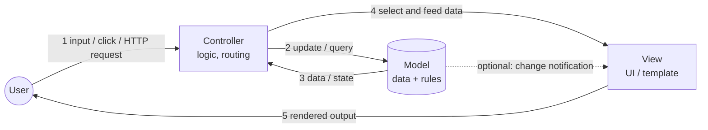
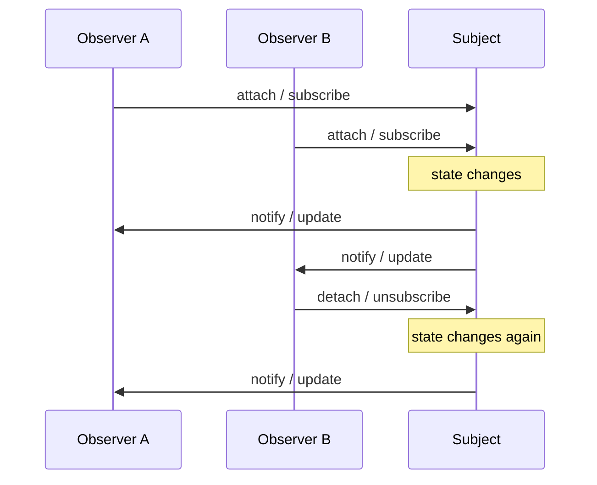
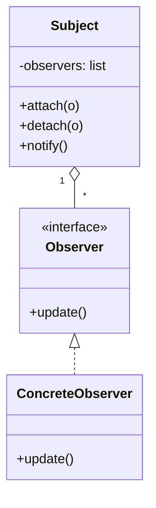

# T03 — Design Patterns: MVC and Observer
**Blueprint 1.6 · CBT: Full · 8 min**

> Note in plan: verify the CBT video really teaches these two (not just Singleton). Skip Singleton.

## 1. What is a design pattern
- A **reusable, proven solution** to a commonly occurring design problem — a template, not finished code.
- Benefits: shared vocabulary, maintainability, separation of concerns, easier testing.

## 2. MVC (Model-View-Controller)
- Splits an application into 3 responsibilities:
  - **Model** = data + business logic (DB, state, rules). Knows nothing about UI.
  - **View** = presentation / UI (what the user sees). Displays model data.
  - **Controller** = handles user input, updates the Model, picks the View. The "glue".
- Flow: user acts → Controller → Model changes → View refreshes/renders.
- **Why**: separation of concerns; swap UI without touching data logic; parallel dev; testability.
- Real examples: Django (MTV variant), Flask + Jinja templates, Rails, web UIs; in network tooling, a dashboard (view) over a NetBox-style DB (model) with API handlers (controller).



### Mini-example (Python-ish)
```python
class Model:                     # data
    def __init__(self): self.devices = ["sw1", "sw2"]
class View:                      # display
    def show(self, devs): print("Devices:", devs)
class Controller:                # logic
    def __init__(self, m, v): self.m, self.v = m, v
    def list_devices(self): self.v.show(self.m.devices)
```

### Exam cue table
| Statement | Component |
|---|---|
| Stores/validates data | Model |
| Renders HTML/GUI | View |
| Processes user request, mediates | Controller |

## 3. Observer pattern
- **One-to-many dependency**: a **Subject** (publisher) keeps a list of **Observers** (subscribers) and **notifies** them automatically when its state changes.
- Terms: subject/observable, observer/subscriber, `subscribe/attach`, `unsubscribe/detach`, `notify`.
- Observers are **loosely coupled** — the subject only knows they implement an `update()` interface.
- Push model (data sent in notify) vs pull model (observers query the subject).
- Real examples: event listeners, GUI events, pub/sub messaging, **webhooks** (T43), model→view updates, streaming telemetry subscriptions.





### Mini-example
```python
class Subject:
    def __init__(self): self._obs = []
    def attach(self, o): self._obs.append(o)
    def notify(self, data):
        for o in self._obs: o.update(data)
class Logger:
    def update(self, data): print("got", data)
s = Subject(); s.attach(Logger()); s.notify("link down")
```

## 4. MVC vs Observer
| | MVC | Observer |
|---|---|---|
| Type | Architectural pattern | Behavioural design pattern |
| Purpose | Separate data/UI/logic | Auto-notify dependents of change |
| Relationship | 3 components | 1 subject → N observers |
| Link | MVC often *uses* Observer so View updates when Model changes | |

## 5. Exam tips
- "Separates data, display, and control logic" → MVC.
- "Objects are notified automatically when another object changes" → Observer.
- Do not confuse Controller (input handler) with Model (data).
