# T12 · Automation foundations: controller vs device

> Owner: **Bob** · Blueprint: **5.1, 5.2** · CBT coverage: **Full** · Learn by 2026-10-05 · Teach-back 2026-10-08

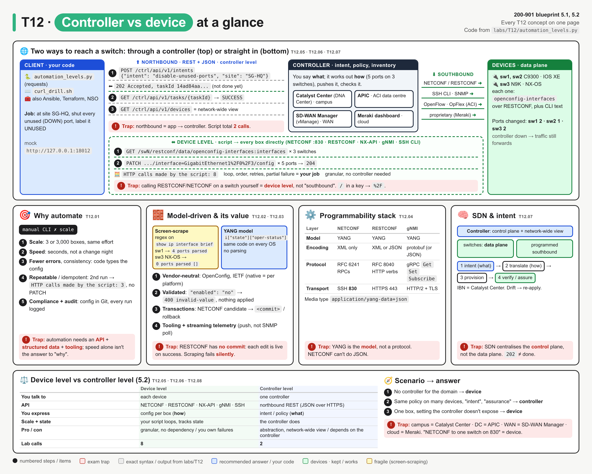

*Read it top to bottom. The map shows the two ways to reach a switch: straight in at device level (bottom lane), or through a controller (top lane). The strip below it compares them. Numbered circles are the call order in `labs/T12/`, red boxes are exam traps, and the grey IDs map to the T12.NN sections.*

## TL;DR (teach-back card)

- **Model-driven programmability (5.1):** config and state are described by a **YANG model**, not CLI text. You read and write them through an API (NETCONF, RESTCONF, gNMI) that returns **structured XML/JSON**. That gives you parsing-free data, the same code across vendors (OpenConfig/IETF models), validation before apply, and transactions (NETCONF candidate → commit / rollback).
- **Stack:** model **YANG** → encoding **XML / JSON / protobuf** → protocol **NETCONF / RESTCONF / gNMI** → transport **SSH :830 / HTTPS :443 / gRPC over HTTP/2**.
- **Device level vs controller level (5.2):** at device level your script talks to **each box** (NETCONF, RESTCONF, NX-API, SSH) and owns the loop, ordering and partial failures. At controller level you send **one northbound REST call** with your intent to Catalyst Center, APIC, SD-WAN Manager or Meraki. The controller programs the boxes **southbound** and gives you a network-wide view. In the lab, the same job took **8 calls vs 2**.
- **Trap:** **northbound** = apps → controller (REST). **Southbound** = controller → devices (NETCONF, OpenFlow/OpFlex, CLI, SNMP). Talking to a switch with RESTCONF yourself is **device level**, not "southbound from your script".

## Concepts

Every section below points at one small program. It does one job three ways: *"at site SG-HQ, shut every unused (oper-status DOWN) switch port and label it UNUSED"*. Read the program once first.

- `labs/T12/mock_network.py` is a local stand-in for three switches and a controller, written with the Python standard library only. It runs at `http://127.0.0.1:18012`.
  - `/sw1` and `/sw2` are Catalyst 9300 switches (IOS XE); `/sw3` is a Nexus 9300 (NX-OS).
  - Each switch answers CLI `show` commands as plain text, and RESTCONF with the **OpenConfig** `openconfig-interfaces` model as `application/yang-data+json`. It validates edits against the model types and returns `ietf-restconf:errors` on a bad value.
  - `/ctrl` is a **generic** controller: an intent API, a task API and an inventory. Its paths are made up for teaching. Real controller paths are in [T19](T19-aci.md), [T20](T20-catalyst-center-dna-center.md), [T22](T22-catalyst-sd-wan.md) and [T18](T18-meraki.md).
- `labs/T12/automation_levels.py` is the **reference program**, using plain `requests`.
- `labs/T12/curl_drill.sh` shows the same calls as raw HTTP.
- To run: `bash labs/T12/run_lab.sh` starts the mock, runs the program, then stops the mock.

**`labs/T12/automation_levels.py`**

```python
"""T12 reference program: one job, done three ways.

    Job: "at site SG-HQ, shut every unused (oper-status DOWN) switch port and label it UNUSED"

    1-2  screen-scrape CLI text vs read a YANG model (why model-driven)
    3    the programmability stack inside one request
    4    the model validates a bad edit before anything is applied
    5    device-level: the script talks to every switch itself
    6-7  controller-level: one intent to the controller, which programs the switches

Default target is the local mock (python3 labs/T12/mock_network.py).
"""
import os
import re
from urllib.parse import quote

import requests

BASE = os.environ.get("T12_BASE_URL", "http://127.0.0.1:18012")
AUTH = (os.environ.get("T12_USER", "admin"), os.environ.get("T12_PASS", "C1sco12345"))
YANG_JSON = "application/yang-data+json"
OC_IF = "openconfig-interfaces:interfaces"

SWITCHES = {                                   # what a device-level script must know itself
    "sw1": {"os": "iosxe", "cli": "show ip interface brief"},
    "sw2": {"os": "iosxe", "cli": "show ip interface brief"},
    "sw3": {"os": "nxos", "cli": "show interface brief"},
}
IOSXE_ROW = re.compile(r"^(\S+)\s+\S+\s+YES\s+\S+\s+(up|down|administratively down)\s+(up|down)\s*$")

calls = {"n": 0}
session = requests.Session()
session.auth = AUTH
session.hooks["response"].append(lambda r, *a, **k: calls.__setitem__("n", calls["n"] + 1))


def scrape_ports(dev):
    """T12.02 the old way: send a show command, regex the text."""
    text = session.get(f"{BASE}/{dev}/cli", params={"cmd": SWITCHES[dev]["cli"]}, timeout=10).text
    return [(m.group(1), m.group(3)) for line in text.splitlines() if (m := IOSXE_ROW.match(line))]


def model_ports(dev):
    """T12.02 the model-driven way: GET the OpenConfig model, read keys out of JSON."""
    r = session.get(f"{BASE}/{dev}/restconf/data/{OC_IF}", headers={"Accept": YANG_JSON}, timeout=10)
    r.raise_for_status()
    return [(i["name"], i["state"]["oper-status"], i["config"]["enabled"]) for i in r.json()[OC_IF]["interface"]]


def patch_port(dev, ifname, config):
    """RESTCONF merge on one interface's config container. '/' in the key must be %2F."""
    url = f"{BASE}/{dev}/restconf/data/{OC_IF}/interface={quote(ifname, safe='')}/config"
    return session.patch(url, json={"openconfig-interfaces:config": config},
                         headers={"Content-Type": YANG_JSON, "Accept": YANG_JSON}, timeout=10)


def main():
    session.post(f"{BASE}/_mock/reset", timeout=10)

    print("== 1. Screen-scraping: one regex, two operating systems ==")
    for dev in ("sw1", "sw3"):
        ports = scrape_ports(dev)
        print(f"    {dev} ({SWITCHES[dev]['os']:<5}) '{SWITCHES[dev]['cli']}' -> {len(ports)} ports parsed {ports[:2]}")

    print("\n== 2. Model-driven: same code, same model, every switch ==")
    for dev in SWITCHES:
        ports = model_ports(dev)
        print(f"    {dev} ({SWITCHES[dev]['os']:<5}) -> {len(ports)} ports {[(n, s) for n, s, _ in ports[:2]]}")

    print("\n== 3. The stack inside one request ==")
    r = patch_port("sw1", "GigabitEthernet1/0/2", {"description": "bob-laptop"})
    print(f"    {r.request.method} {r.request.path_url}")
    print("    model    : openconfig-interfaces (YANG)")
    print(f"    encoding : JSON   (Content-Type: {r.request.headers['Content-Type']})")
    print(f"    protocol : RESTCONF -> {r.status_code} {r.reason}")
    print("    transport: HTTP here; HTTPS on a real switch")

    print("\n== 4. Validation: the model rejects a bad value, nothing is applied ==")
    r = patch_port("sw1", "GigabitEthernet1/0/3", {"description": "UNUSED", "enabled": "no"})
    err = r.json()["ietf-restconf:errors"]["error"][0]
    print(f"    {r.status_code} {err['error-tag']}: {err['error-message']}")
    gi3 = next(p for p in model_ports("sw1") if p[0] == "GigabitEthernet1/0/3")
    print(f"    GigabitEthernet1/0/3 after the failed edit: enabled={gi3[2]} (description not changed either)")

    print("\n== 5. Device-level: the script loops over every switch itself ==")
    calls["n"] = 0
    for dev in SWITCHES:
        for name, oper, enabled in model_ports(dev):
            if oper == "DOWN" and enabled:
                r = patch_port(dev, name, {"description": "UNUSED (script)", "enabled": False})
                print(f"    {dev} PATCH {name:<22} -> {r.status_code}")
    print(f"    HTTP calls made by the script: {calls['n']}")

    session.post(f"{BASE}/_mock/reset", timeout=10)
    print("\n== 6. Controller-level: one intent, the controller does the southbound work ==")
    calls["n"] = 0
    r = session.post(f"{BASE}/ctrl/api/v1/intents", json={"intent": "disable-unused-ports", "site": "SG-HQ"}, timeout=10)
    print(f"    POST /ctrl/api/v1/intents -> {r.status_code} {r.reason}, taskId {r.json()['taskId'][:8]}...")
    task = session.get(BASE + r.json()["url"], timeout=10).json()
    print(f"    task {task['status']}: {len(task['southbound'])} ports changed on {task['devices']} devices")
    for a in task["southbound"]:
        print(f"      southbound {a['protocol']} {a['method']} {a['device']} {a['interface']:<22} -> {a['result']}")
    print(f"    HTTP calls made by the script: {calls['n']}")

    print("\n== 7. Network-wide view from the controller ==")
    for d in session.get(f"{BASE}/ctrl/api/v1/devices", timeout=10).json()["response"]:
        print(f"    {d['hostname']}  {d['platform']:<17} {d['softwareVersion']:<15} portsAdminDown={d['portsAdminDown']}")


if __name__ == "__main__":
    main()
```

**Output** (`bash labs/T12/run_lab.sh`):

```
== 1. Screen-scraping: one regex, two operating systems ==
    sw1 (iosxe) 'show ip interface brief' -> 4 ports parsed [('GigabitEthernet1/0/1', 'up'), ('GigabitEthernet1/0/2', 'up')]
    sw3 (nxos ) 'show interface brief' -> 0 ports parsed []

== 2. Model-driven: same code, same model, every switch ==
    sw1 (iosxe) -> 4 ports [('GigabitEthernet1/0/1', 'UP'), ('GigabitEthernet1/0/2', 'UP')]
    sw2 (iosxe) -> 3 ports [('GigabitEthernet1/0/1', 'UP'), ('GigabitEthernet1/0/2', 'DOWN')]
    sw3 (nxos ) -> 3 ports [('Ethernet1/1', 'UP'), ('Ethernet1/2', 'DOWN')]

== 3. The stack inside one request ==
    PATCH /sw1/restconf/data/openconfig-interfaces:interfaces/interface=GigabitEthernet1%2F0%2F2/config
    model    : openconfig-interfaces (YANG)
    encoding : JSON   (Content-Type: application/yang-data+json)
    protocol : RESTCONF -> 204 No Content
    transport: HTTP here; HTTPS on a real switch

== 4. Validation: the model rejects a bad value, nothing is applied ==
    400 invalid-value: invalid value 'no' for type boolean
    GigabitEthernet1/0/3 after the failed edit: enabled=True (description not changed either)

== 5. Device-level: the script loops over every switch itself ==
    sw1 PATCH GigabitEthernet1/0/3   -> 204
    sw1 PATCH GigabitEthernet1/0/4   -> 204
    sw2 PATCH GigabitEthernet1/0/2   -> 204
    sw3 PATCH Ethernet1/2            -> 204
    sw3 PATCH Ethernet1/3            -> 204
    HTTP calls made by the script: 8

== 6. Controller-level: one intent, the controller does the southbound work ==
    POST /ctrl/api/v1/intents -> 202 Accepted, taskId 14ad84aa...
    task SUCCESS: 5 ports changed on 3 devices
      southbound RESTCONF PATCH sw1 GigabitEthernet1/0/3   -> 204
      southbound RESTCONF PATCH sw1 GigabitEthernet1/0/4   -> 204
      southbound RESTCONF PATCH sw2 GigabitEthernet1/0/2   -> 204
      southbound RESTCONF PATCH sw3 Ethernet1/2            -> 204
      southbound RESTCONF PATCH sw3 Ethernet1/3            -> 204
    HTTP calls made by the script: 2

== 7. Network-wide view from the controller ==
    sw1  C9300-48P         IOS XE 17.9.4   portsAdminDown=2
    sw2  C9300-24T         IOS XE 17.9.4   portsAdminDown=1
    sw3  N9K-C93180YC-FX3  NX-OS 10.3(4a)  portsAdminDown=2
```

### T12.01 · Why automate

**Must cover:**

- [x] Scale: hundreds of devices changed consistently
- [x] Speed, fewer human errors, repeatability, compliance and audit trail

**Notes:**

- **Manual CLI doesn't scale.** One engineer, one SSH session, one box at a time. 300 switches × 5 minutes = 25 hours, and box 147 gets the typo.
- What automation buys (know the words; exam options use them):

| Benefit | What it means | In the lab |
|---|---|---|
| **Scale** | the same change on 3 or 3,000 devices costs the same effort | section 5 loops over every switch in `SWITCHES` |
| **Speed** | seconds, not a change-window night | the whole run takes well under a second |
| **Fewer human errors / consistency** | the code types the config, the same way every time | every unused port gets exactly `"UNUSED (script)"` |
| **Repeatability / idempotency** | run it again → same end state, nothing extra changes | run section 5 twice: the second pass makes 3 GETs and no PATCH (`HTTP calls made by the script: 3`) |
| **Compliance + audit trail** | the desired config lives in Git, every run is logged and diffable | the printed `sw1 PATCH ... -> 204` lines are the change record |
| **Faster troubleshooting** | collect state from every box at once | section 2 reads every port on 3 switches in 3 calls |

- **What automation needs:** a **programmable interface** (API), **structured data** (JSON/XML shaped by a model), and **tooling** (Python, Ansible, Terraform, NSO, pyATS: see [T25](T25-nso-cisco-modeling-labs.md), [T33](../bee/T33-iac-tool-comparison.md), [T34](../bee/T34-ansible-playbook-interpretation.md), [T44](../bee/T44-pyats-genie.md)).
- **Related ideas** the exam pairs with this: **Infrastructure as Code** (config as versioned files), **declarative vs imperative** (state the end result vs list the steps), **NetDevOps** (CI/CD for network config, [T28](../bee/T28-ci-cd-devops-principles.md)).

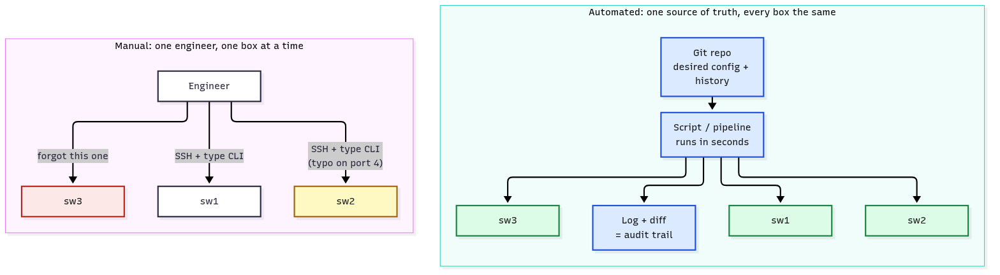

*Red = the box someone forgot, yellow = the typo. With automation, every box gets the same change from one source of truth, and the log is the audit trail.*

### T12.02 · Model-driven programmability

**Must cover:**

- [x] Device config and state described by data models (YANG) instead of free-form CLI text
- [x] Accessed through APIs (NETCONF, RESTCONF, gNMI) that return structured data (XML/JSON)
- [x] Replaces CLI screen-scraping with parsing-free, schema-validated data

**Notes:**

- **Data model = a schema for the device.** It says which nodes exist (interfaces, VLANs, BGP neighbours), their types (string, boolean, enum) and whether each one is config (read/write) or state (read-only). The language is **YANG** (RFC 7950). Details: [T14](T14-yang-data-models.md).
- **The API serialises that model** as XML or JSON, over NETCONF ([T15](T15-netconf.md)), RESTCONF ([T16](T16-restconf.md)) or gNMI. You get keys and values, not a screen of text.
- **Screen-scraping** = send a `show` command over SSH, then regex the text. Problems:
  - The text was written for humans, so the layout differs per OS, per release, even per platform.
  - The regex breaks silently: no error, just wrong or missing data.
  - There's no type checking and no clear split between config and state.
- **Section 1 of the program proves it.** One regex, `IOSXE_ROW`:
  - on sw1 (IOS XE `show ip interface brief`) → `4 ports parsed`
  - on sw3 (NX-OS `show interface brief`, different columns, names shortened to `Eth1/1`) → `0 ports parsed []`. No exception is raised: the script just thinks the switch has no ports.
- **Section 2 is the fix.** `model_ports()` does one `GET .../openconfig-interfaces:interfaces` and reads `i["state"]["oper-status"]`. The same code works on all three switches → `4 ports`, `3 ports`, `3 ports`.

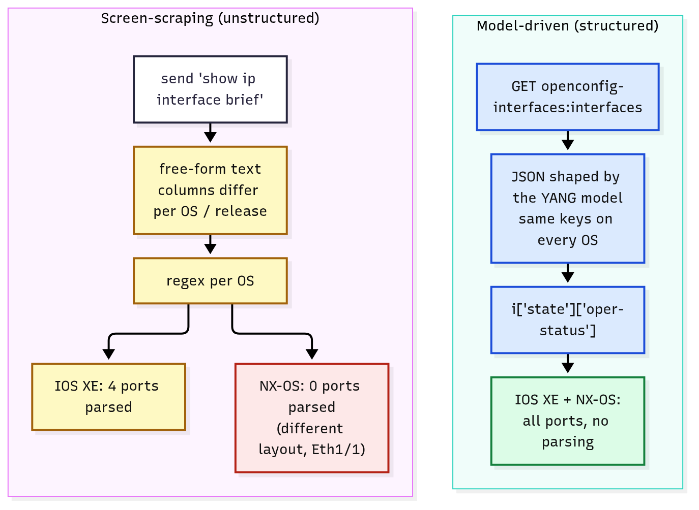

*Yellow = fragile, red = silent failure. On the model-driven side the keys are the same on every OS, so nothing needs parsing.*

| | CLI screen-scraping | Model-driven API |
|---|---|---|
| Data | free-form text | structured JSON/XML defined by a YANG model |
| Parsing | regex / TextFSM per OS and release | none: `resp.json()[...]` |
| Config vs state | mixed in `show` output | separate (`config` vs `state` containers, `config false` nodes) |
| Validation | the device rejects a bad line, mid-paste | the whole edit is checked against the schema first |
| Same code across vendors | no | yes, with OpenConfig / IETF models |
| Tools | Netmiko, Paramiko, Expect | ncclient, `requests`, gNMI clients, Ansible modules |

- SNMP is the older "structured" option (MIBs). It's mostly used for monitoring: writing config through SNMP is rare, and the Cisco IOS XE guide notes SNMP doesn't separate config from operational data.

### T12.03 · Value of model-driven programmability (5.1)

**Must cover:**

- [x] Vendor-neutral models (OpenConfig, IETF) → same code across vendors
- [x] Validation against the model before applying
- [x] Transactions and rollback (NETCONF candidate/commit)
- [x] Easier tooling, programmability and streaming telemetry

**Notes:**

- **This is the 5.1 answer.** Learn these as the "value" list:

| Value | How | In the lab |
|---|---|---|
| **Vendor-neutral, same code** | models from **IETF** (`ietf-interfaces`) and **OpenConfig** (`openconfig-interfaces`, written by network operators) work on many vendors. **Native** models (`Cisco-IOS-XE-native`) cover every platform feature but tie you to that platform | `model_ports()` runs unchanged on IOS XE and NX-OS (section 2) |
| **Validation before apply** | the device checks types, ranges and mandatory nodes against the YANG schema. If any of it fails, it rejects the edit | section 4: `"enabled": "no"` → `400 invalid-value: invalid value 'no' for type boolean`, and the description in the same request isn't applied either |
| **Transactions + rollback** | NETCONF: edit the **candidate** datastore, `<validate>`, then `<commit>` all of it at once, or `<discard-changes>`. **Confirmed commit** rolls back by itself if you don't confirm in time (IOS XE default 600 s) | not in the mock; see diagram below and [T15](T15-netconf.md) |
| **Easier tooling** | a model can generate code, docs and API paths (pyang tree → RESTCONF URL, [T14](T14-yang-data-models.md)); SDKs and Ansible modules are built on the models | `OC_IF` + `/interface=<name>/config` is just the model path |
| **Streaming telemetry** | the device **pushes** model-based data (gNMI `Subscribe`, IOS XE model-driven telemetry) on a timer or on change, instead of SNMP polling | awareness only |

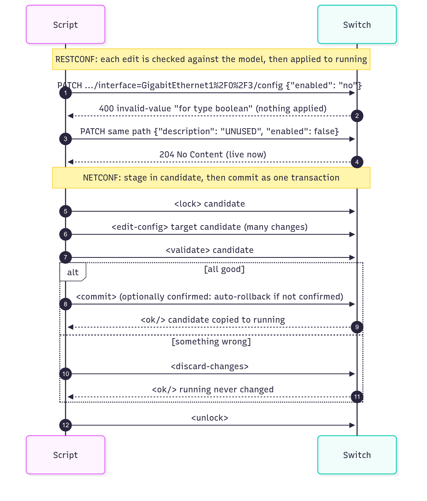

*RESTCONF (top): a bad value is rejected whole, and a good edit is live as soon as it returns. NETCONF (bottom): stage many changes in candidate, then commit them together or discard them all.*

- RESTCONF has **no candidate or commit step**. RFC 8040 says each edit "is activated upon successful completion of the edit". If the server only has a candidate datastore, it must commit automatically after each edit. For a multi-step, all-or-nothing change, use NETCONF candidate/commit, or one gNMI `SetRequest` (the gNMI spec says either all the changes in one request apply or the target rolls back).

### T12.04 · Programmability stack

**Must cover:**

- [x] Data model: YANG
- [x] Encoding: XML, JSON (protobuf for gRPC)
- [x] Protocol: NETCONF, RESTCONF, gNMI/gRPC
- [x] Transport: SSH (NETCONF), HTTPS (RESTCONF), HTTP/2 (gRPC)

**Notes:**

- **Four layers, one model.** The same YANG model can be carried by any of three protocols. Only the encoding and transport change.

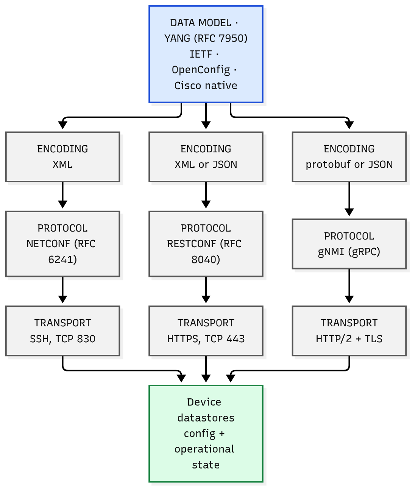

*Read each column top to bottom. The model at the top is shared; the device datastores at the bottom are the same ones.*

| Layer | NETCONF | RESTCONF | gNMI |
|---|---|---|---|
| Model | YANG | YANG | YANG (OpenConfig first) |
| Encoding | **XML** only | **XML or JSON** (`application/yang-data+xml` / `+json`) | **protobuf**, or JSON / JSON_IETF inside protobuf |
| Protocol / RFC | RFC 6241, RPCs `<get-config>`, `<edit-config>`, `<commit>` | RFC 8040, HTTP methods `GET` `POST` `PUT` `PATCH` `DELETE` | OpenConfig spec, RPCs `Capabilities` `Get` `Set` `Subscribe` |
| Transport | **SSH, TCP 830** | **HTTPS** (TCP 443) | **gRPC over HTTP/2**, TLS required |

- **Section 3 of the program prints the layers of one real request:**
  - `PATCH /sw1/restconf/data/openconfig-interfaces:interfaces/interface=GigabitEthernet1%2F0%2F2/config`
  - model `openconfig-interfaces`, encoding JSON (`Content-Type: application/yang-data+json`), protocol RESTCONF → `204 No Content`, transport HTTP on the mock (HTTPS on a real switch).
- **Key encoding trap:** `/` inside a list key must be percent-encoded as `%2F` (RFC 8040 §3.5.3). The program does it with `quote(ifname, safe='')`. Curl drill step 3 sends `GigabitEthernet1/0/3` raw → `404`; step 4 sends `GigabitEthernet1%2F0%2F3` → `204`.

### T12.05 · Device-level management

**Must cover:**

- [x] Script/tool talks to each device directly: SSH CLI, NETCONF, RESTCONF, NX-API
- [x] Granular control, no controller dependency
- [x] You handle scale, consistency and state across devices yourself

**Notes:**

- **Device level = your code holds a session to every box.** Interfaces per device:

| Interface | Encoding / transport | Typical tool | Note |
|---|---|---|---|
| SSH CLI | text over SSH :22 | Netmiko, Paramiko, Ansible `cli_command` | works everywhere; screen-scraping |
| **NETCONF** | XML over SSH **:830** | ncclient, Ansible `netconf_config` | candidate/commit ([T15](T15-netconf.md)) |
| **RESTCONF** | JSON/XML over HTTPS | `requests`, curl | the lab uses this ([T16](T16-restconf.md)) |
| **NX-API** | JSON-RPC / CLI-in-JSON over HTTP(S) on Nexus | `requests`, NX-API sandbox | NX-OS only ([T17](T17-iosxe-nxos-device-apis.md)) |
| gNMI | protobuf over gRPC | gNMIc, pygnmi | streaming telemetry + config |
| SNMP | MIBs over UDP 161 | pysnmp | legacy, mostly monitoring |

- **Section 5 of the program is device level.** `SWITCHES` is the inventory the *script* must hold: names, OS and the CLI command per OS. Then for each switch: `model_ports(dev)` (1 GET), and for each DOWN-and-enabled port `patch_port(...)` (1 PATCH). Total: **`HTTP calls made by the script: 8`** (3 GETs + 5 PATCHes).
- **Pros:** granular (any leaf the device's model exposes), works with no controller (brownfield, labs, one-off fixes), nothing between you and the box.
- **Cons:** the script owns **scale** (loop over N boxes), **consistency** (the same intent rendered per OS), **state** (what's deployed where), **ordering**, **retries** and **partial failure**. If sw3 fails after sw1 and sw2 succeeded, cleaning up is your job.

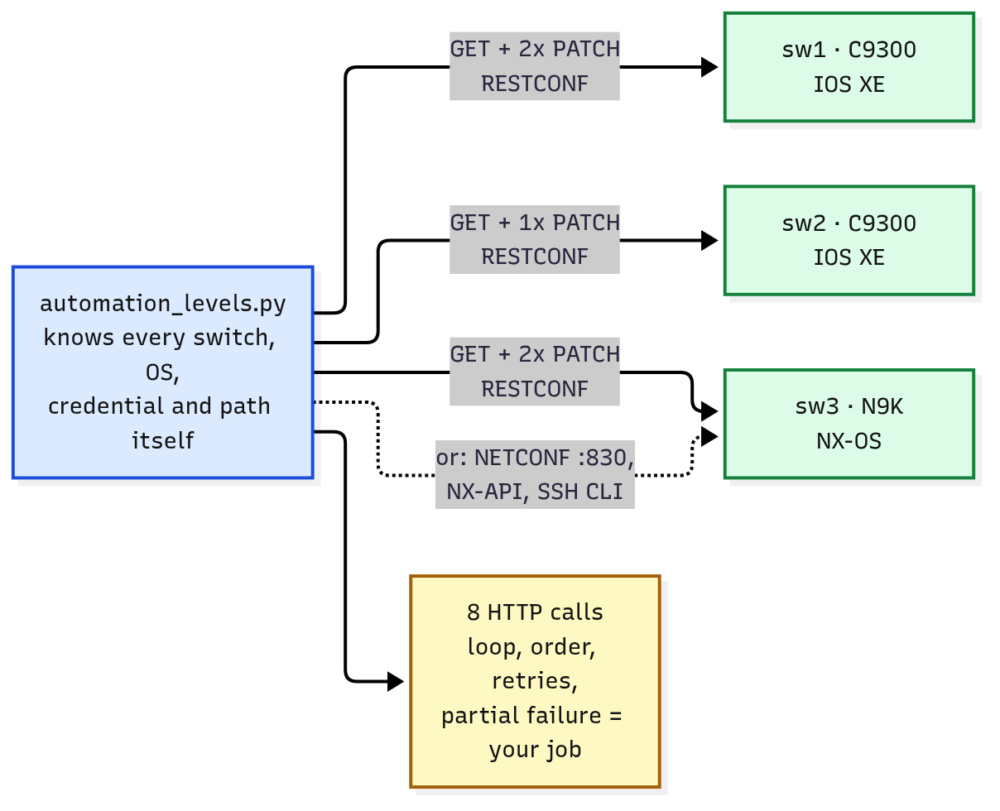

*Blue = your script, which knows every switch itself. Yellow = the work you take on: 8 calls, the loop and every failure case.*

### T12.06 · Controller-level management

**Must cover:**

- [x] Central controller (Catalyst Center, APIC, SD-WAN Manager, Meraki dashboard) holds intent/policy and programs devices
- [x] Northbound API: apps → controller (REST); southbound: controller → devices (NETCONF, OpenFlow, CLI, proprietary)
- [x] Abstraction, network-wide view, policy-based; depends on the controller

**Notes:**

- **Controller level = you talk to one system that already manages the devices.** It holds the inventory, topology, policy and intent for a whole domain. Know the controller for each domain:

| Domain | Controller (old name) | Northbound API | Southbound (to devices) | Note |
|---|---|---|---|---|
| Campus / branch | **Catalyst Center** (DNA Center) | REST/JSON, `X-Auth-Token` | SSH/CLI, SNMP, NETCONF | [T20](T20-catalyst-center-dna-center.md) |
| Data centre (ACI) | **APIC** | REST (XML/JSON), `aaaLogin` cookie | **OpFlex** (policy to leaf/spine) | [T19](T19-aci.md) |
| WAN | **SD-WAN Manager** (vManage) | REST/JSON, session cookie + XSRF token | NETCONF over the DTLS/TLS control connections | [T22](T22-catalyst-sd-wan.md) |
| Cloud-managed | **Meraki dashboard** | REST/JSON, API key | proprietary device-initiated cloud tunnel | [T18](T18-meraki.md) |

- **Northbound vs southbound** (direction is drawn with the apps on top, devices at the bottom):
  - **Northbound** interface = what the controller offers **up** to apps and scripts. Usually REST + JSON over HTTPS.
  - **Southbound** interface = how the controller talks **down** to devices: NETCONF, RESTCONF, CLI/SSH, SNMP, **OpenFlow** (classic SDN), **OpFlex** (ACI), proprietary.
  - RFC 7426 splits southbound into a control-plane southbound interface (e.g. OpenFlow, ForCES) and a management-plane one (e.g. NETCONF, SNMP). East-west = controller ↔ controller.

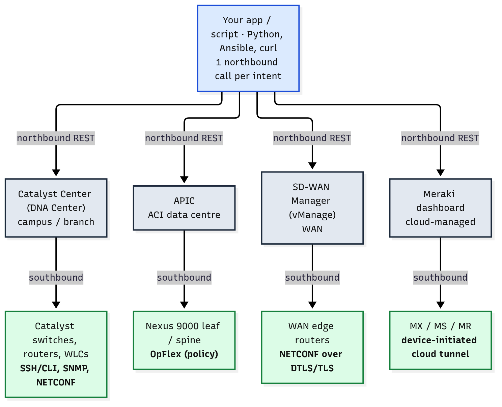

*Blue = your one northbound call. Grey = the controllers. Green = the devices, with each controller's southbound protocol in bold.*

- **Section 6 of the program is controller level:**
  - `POST /ctrl/api/v1/intents` with `{"intent": "disable-unused-ports", "site": "SG-HQ"}` → `202 Accepted, taskId 14ad84aa...`. The script never names a switch or a port.
  - The controller does the southbound work itself: 5 × `southbound RESTCONF PATCH ... -> 204` across 3 devices.
  - `GET /ctrl/api/v1/tasks/{taskId}` → `task SUCCESS`. **Script total: `HTTP calls made by the script: 2`** (vs 8 at device level).
  - Section 7: `GET /ctrl/api/v1/devices` = the **network-wide view**: every switch, its platform and software, in one call.
- **`202` + task ID** is the usual pattern for controller writes: the work runs in the background and you poll for the result (Catalyst Center returns a `taskId` / `executionId`; [T20](T20-catalyst-center-dna-center.md)). `202` doesn't mean it's done.

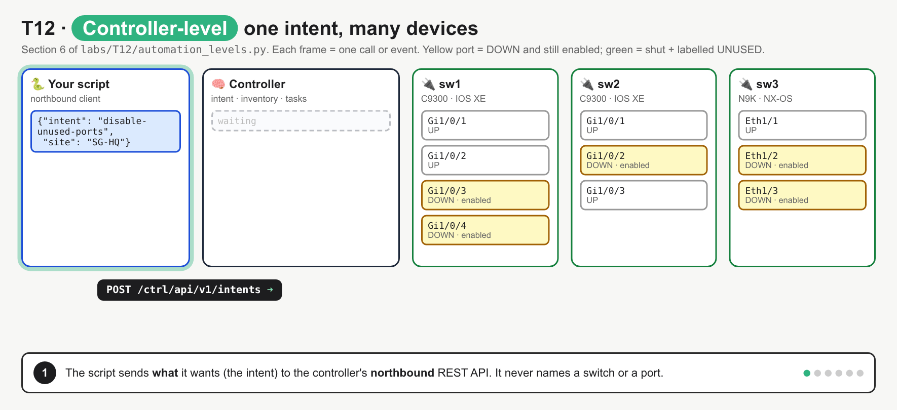

*Six frames: POST intent → `202` + taskId (nothing changed yet) → controller translates the site into 5 ports on 3 switches → southbound PATCH ×5 → GET task `SUCCESS` → GET devices (network-wide view). It fixes two misconceptions: that your script configures the switches (the controller does), and that `202` means done.*

- **Pros:** abstraction (no per-OS detail), network-wide view, consistent policy, fewer calls, a built-in inventory and assurance.
- **Cons:** **depends on the controller**: it's a single point of dependency, you're limited to what its API exposes, and it's one more system to licence, run and secure.

**Device level vs controller level** (the 5.2 comparison):

| | Device level | Controller level |
|---|---|---|
| You talk to | each device | one controller |
| API | NETCONF, RESTCONF, NX-API, gNMI, SSH CLI | northbound REST (JSON over HTTPS) |
| You express | config per box (**how**) | intent / policy (**what**) |
| Scale + state | your script loops and tracks state | the controller does |
| View | one box at a time | network-wide |
| Granularity | anything the device model exposes | what the controller exposes |
| Dependency | none beyond the device | the controller must be up |
| Lab calls for the job | 8 | 2 |
| Examples | IOS XE RESTCONF/NETCONF, NX-OS NX-API | Catalyst Center, APIC, SD-WAN Manager, Meraki |

### T12.07 · SDN concepts

**Must cover:**

- [x] SDN separates the control plane (centralised controller) from the data plane (devices)
- [x] Intent-based networking: declare the outcome, controller translates it into config

**Notes:**

- **Planes** (full detail is in [T39](T39-management-control-data-planes.md)):
  - **data (forwarding) plane:** moves packets, using tables (FIB, MAC table)
  - **control plane:** decides where packets go (OSPF, BGP, STP), and fills those tables
  - **management plane:** configures and monitors the device (SSH, SNMP, NETCONF, the APIs in this note)
- **Traditional network:** every box runs its own control plane and they agree through protocols.
- **SDN:** the control plane (or the policy part of it) moves into a **central controller** that sees the whole network. Devices keep the data plane and are programmed southbound. Classic SDN used OpenFlow to write flow tables directly. Cisco's controllers are hybrids: the devices still run routing protocols, while the controller owns policy and config.

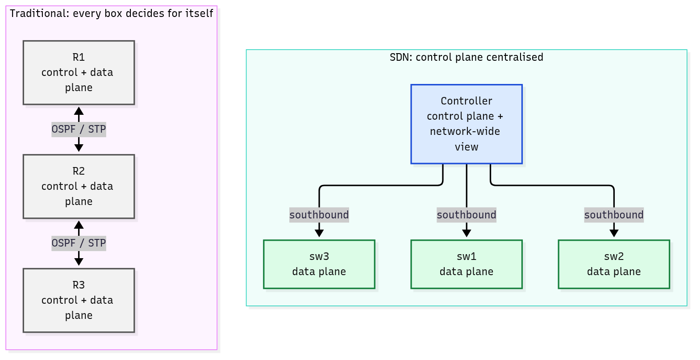

*Left: each router has its own control plane. Right: one controller (blue) holds the control logic and the network-wide view, and the switches (green) only forward.*

- **Intent-based networking (IBN):** you declare **what** you want ("unused ports at SG-HQ are shut"). The controller works out **how** (which ports, which devices, which config), provisions it, then keeps checking the network still matches (assurance). Catalyst Center is Cisco's IBN controller.

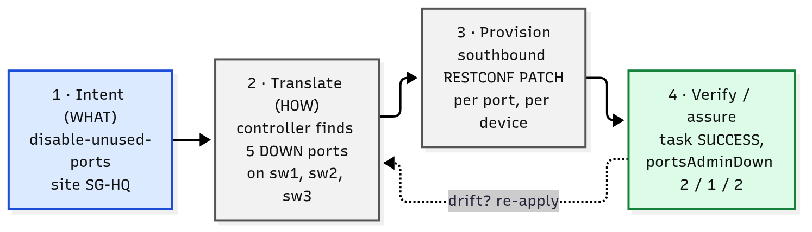

*1 → 4 are what the lab's controller does for one `POST /ctrl/api/v1/intents`. The dotted arrow is assurance: if the network drifts from the intent, re-apply it.*

### T12.08 · Exam angle

**Must cover:**

- [x] Compare controller vs device level for a scenario; state the value of model-driven programmability

**Notes:**

- **Scenario → level:**

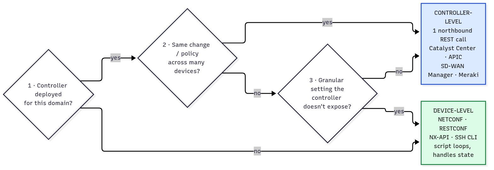

*Ask in order: is there a controller for this domain? Is it one change across many devices? Is it a setting the controller doesn't expose?*

| Scenario wording | Answer |
|---|---|
| "single place to define policy for 400 campus switches", "intent", "network-wide view", "assurance" | controller level (Catalyst Center) |
| "ACI fabric", "tenants / EPGs" | controller level (APIC) |
| "WAN edge templates across 200 branches" | controller level (SD-WAN Manager) |
| "configure one router's interface with RESTCONF", "NETCONF to a switch on port 830", "NX-API on a Nexus" | device level |
| "no controller deployed", "brownfield lab", "a feature the controller doesn't expose" | device level |
| "controller is down, but traffic still flows" | the data plane lives on the devices; only management/intent is lost |

- **"State the value of model-driven programmability" → pick from:** structured data with no screen-scraping; vendor-neutral models (OpenConfig, IETF) so the same code works across vendors; validation against the schema before apply; transactions with commit/rollback (NETCONF candidate); easier tooling and code generation; streaming telemetry.
- **Not a value of model-driven programmability:** "removes the need for credentials", "faster packet forwarding", "replaces the data plane". The model is a management-plane concept.

## Exam traps

- **Northbound ≠ southbound.** Northbound = app → controller (REST). Southbound = controller → device (NETCONF, OpenFlow, OpFlex, CLI, SNMP). An app calling Catalyst Center's REST API is using the **northbound** API.
- **Using RESTCONF/NETCONF yourself = device level**, even though those are the same protocols a controller might use southbound.
- **Name ↔ domain:** campus = Catalyst Center (DNA Center); DC = APIC (ACI); WAN = SD-WAN Manager (vManage); cloud-managed = Meraki dashboard. The SD-WAN *Controller* (vSmart) runs OMP to the edges; it isn't the management API.
- **Stack mix-ups:** NETCONF = **XML** only, SSH **830**. RESTCONF = XML **or** JSON over HTTPS, media types `application/yang-data+json` / `+xml`. gNMI = gRPC over **HTTP/2**, protobuf. YANG is the **model**, not a protocol or an encoding.
- **RESTCONF has no commit.** Each edit is live when it returns. The candidate → commit → rollback transaction is **NETCONF** (or one gNMI `SetRequest`).
- **Vendor-neutral = OpenConfig / IETF.** Native models (`Cisco-IOS-XE-native`) are vendor-specific, but cover every feature.
- **Screen-scraping fails silently.** A changed CLI layout gives `0 ports parsed`, not an error (lab section 1).
- **`202 Accepted` ≠ done.** Controllers run writes as tasks, so poll the task ID.
- **SDN centralises the control plane**, not the data plane. If the controller goes down, existing forwarding continues.
- **`/` in a RESTCONF key → `%2F`.** `interface=GigabitEthernet1%2F0%2F3`.

## Examples

### 1. Run the reference program

Needs Python 3 with `requests`, plus curl. No devices needed: the mock plays three switches and a controller.

```bash
python3 -m venv /tmp/t12-venv
/tmp/t12-venv/bin/pip install requests
PYTHON=/tmp/t12-venv/bin/python bash labs/T12/run_lab.sh                        # reference program
bash labs/T12/run_lab.sh labs/T12/curl_drill.sh                                 # raw HTTP
T12_PORT=18112 PYTHON=/tmp/t12-venv/bin/python bash labs/T12/run_lab.sh         # if 18012 is taken
```

In the lab container (it already has `requests`):

```bash
docker build --tag ccna-auto-lab:latest --file labs/Dockerfile labs/
docker run --rm --volume "$(pwd)":/work --workdir /work ccna-auto-lab:latest bash labs/T12/run_lab.sh
docker run --rm --volume "$(pwd)":/work --workdir /work ccna-auto-lab:latest bash labs/T12/run_lab.sh labs/T12/curl_drill.sh
```

### 2. curl drill (`labs/T12/curl_drill.sh`)

```bash
#!/usr/bin/env bash
# T12 curl drill: device-level vs controller-level calls, raw HTTP, against the local mock.
set -u
BASE="${T12_BASE_URL:-http://127.0.0.1:18012}"
CRED="${T12_USER:-admin}:${T12_PASS:-C1sco12345}"
OC="openconfig-interfaces:interfaces"

echo "== 1. Device-level, CLI text (IOS XE)"
curl --silent --show-error --user "$CRED" --get --data-urlencode "cmd=show ip interface brief" "$BASE/sw1/cli"

echo; echo "== 2. Device-level, same ports as YANG-modelled JSON (first interface only)"
curl --silent --show-error --user "$CRED" --header "Accept: application/yang-data+json" \
  "$BASE/sw1/restconf/data/$OC" \
  | python3 -c "import json, sys; print(json.dumps(json.load(sys.stdin)['$OC']['interface'][0], indent=2))"

echo; echo "== 3. Slash in the key not encoded -> 404"
curl --silent --show-error --user "$CRED" --request PATCH \
  --header "Content-Type: application/yang-data+json" \
  --data '{"openconfig-interfaces:config": {"description": "UNUSED"}}' \
  --write-out "\nHTTP %{http_code}\n" \
  "$BASE/sw1/restconf/data/$OC/interface=GigabitEthernet1/0/3/config"

echo; echo "== 4. Slash encoded as %2F -> 204"
curl --silent --show-error --user "$CRED" --request PATCH \
  --header "Content-Type: application/yang-data+json" \
  --data '{"openconfig-interfaces:config": {"description": "UNUSED"}}' \
  --write-out "HTTP %{http_code}\n" \
  "$BASE/sw1/restconf/data/$OC/interface=GigabitEthernet1%2F0%2F3/config"

echo; echo "== 5. Controller-level: one intent for the whole site"
curl --silent --show-error --user "$CRED" --request POST \
  --header "Content-Type: application/json" \
  --data '{"intent": "disable-unused-ports", "site": "SG-HQ"}' \
  --write-out "\nHTTP %{http_code}\n" \
  "$BASE/ctrl/api/v1/intents"

echo; echo "== 6. Controller-level: unknown site -> rejected before any device is touched"
curl --silent --show-error --user "$CRED" --request POST \
  --header "Content-Type: application/json" \
  --data '{"intent": "disable-unused-ports", "site": "TY-LAB"}' \
  --write-out "\nHTTP %{http_code}\n" \
  "$BASE/ctrl/api/v1/intents"
```

Output (`bash labs/T12/run_lab.sh labs/T12/curl_drill.sh`):

```
== 1. Device-level, CLI text (IOS XE)
Interface              IP-Address      OK? Method Status                Protocol
GigabitEthernet1/0/1   unassigned      YES unset  up                    up
GigabitEthernet1/0/2   unassigned      YES unset  up                    up
GigabitEthernet1/0/3   unassigned      YES unset  down                  down
GigabitEthernet1/0/4   unassigned      YES unset  down                  down

== 2. Device-level, same ports as YANG-modelled JSON (first interface only)
{
  "name": "GigabitEthernet1/0/1",
  "config": {
    "name": "GigabitEthernet1/0/1",
    "type": "iana-if-type:ethernetCsmacd",
    "description": "uplink core1",
    "enabled": true
  },
  "state": {
    "name": "GigabitEthernet1/0/1",
    "type": "iana-if-type:ethernetCsmacd",
    "description": "uplink core1",
    "enabled": true,
    "admin-status": "UP",
    "oper-status": "UP"
  }
}

== 3. Slash in the key not encoded -> 404
{"ietf-restconf:errors": {"error": [{"error-type": "application", "error-tag": "invalid-value", "error-path": "/restconf/data/openconfig-interfaces:interfaces/interface=GigabitEthernet1/0/3/config", "error-message": "uri keypath not found"}]}}
HTTP 404

== 4. Slash encoded as %2F -> 204
HTTP 204

== 5. Controller-level: one intent for the whole site
{"taskId": "14ad84aa-b495-52c4-8bfc-949108ca8ee0", "url": "/ctrl/api/v1/tasks/14ad84aa-b495-52c4-8bfc-949108ca8ee0"}
HTTP 202

== 6. Controller-level: unknown site -> rejected before any device is touched
{"error": "unknown site 'TY-LAB'"}
HTTP 400
```

- Steps 1 and 2 are the same four ports: human text vs model-shaped JSON with separate `config` and `state`.
- Steps 3 and 4: the only difference is `%2F`.
- Step 6: the controller validates the intent (unknown site) before any device is touched.

### 3. Break it on purpose

Each edit was made on a copy of `labs/T12/automation_levels.py` and run with `run_lab.sh`. The result column is the real changed output.

| Edit | Result | Lesson |
|---|---|---|
| in `patch_port()`, `interface={quote(ifname, safe='')}` → `interface={ifname}` | section 3 prints `PATCH /sw1/restconf/data/openconfig-interfaces:interfaces/interface=GigabitEthernet1/0/2/config` and `protocol : RESTCONF -> 404 Not Found` | the `/` in the key splits the path; encode it as `%2F` |
| in `patch_port()`, `headers={"Content-Type": YANG_JSON, "Accept": YANG_JSON}, timeout=10)` → `timeout=10)` | `encoding : JSON   (Content-Type: application/json)` and `protocol : RESTCONF -> 415 Unsupported Media Type` | RESTCONF wants `application/yang-data+json`; plain `application/json` (what `json=` sends) is refused here ⚠ verify per platform |
| in section 6, `"site": "SG-HQ"` → `"site": "TY-LAB"` | `KeyError: 'taskId'` (the controller answered `400 {"error": "unknown site 'TY-LAB'"}`) | check the status code before reading the body; the controller rejects a bad intent before touching any device |

### 4. Drill: the screen-scraping regex

Run this from the repo root. It feeds one IOS XE line and one NX-OS line to the program's own regex:

```bash
python3 - <<'EOF'
import re
IOSXE_ROW = re.compile(r"^(\S+)\s+\S+\s+YES\s+\S+\s+(up|down|administratively down)\s+(up|down)\s*$")
iosxe = "GigabitEthernet1/0/3   unassigned      YES unset  down                  down"
nxos  = "Eth1/2          1       eth  access down    Link not connected       auto(D)   --"
for line in (iosxe, nxos):
    m = IOSXE_ROW.match(line)
    print("match" if m else "NO MATCH", m.groups() if m else line.split()[:5])
EOF
```

Output:

```
match ('GigabitEthernet1/0/3', 'down', 'down')
NO MATCH ['Eth1/2', '1', 'eth', 'access', 'down']
```

- The same port state, in two layouts. To support NX-OS you'd need a second regex (and a third for IOS XR...). The model-driven read needs none.

### 5. Drill: name the layer

Cover the right-hand column.

| Item | Layer |
|---|---|
| `openconfig-interfaces` | model |
| `application/yang-data+json` | encoding (JSON) via RESTCONF media type |
| `<edit-config>` | protocol (NETCONF RPC) |
| TCP 830 | transport (NETCONF over SSH) |
| `SetRequest` | protocol (gNMI RPC) |
| HTTP/2 | transport (gRPC) |
| `POST /ctrl/api/v1/intents` | controller **northbound** API |
| OpFlex | ACI **southbound** |

## Practice questions

**Q1.** Which two statements describe the value of model-driven programmability? (Choose two.)
A. Configuration is validated against a schema before it is applied  B. Devices no longer need a control plane  C. The same code can configure several vendors when they share an OpenConfig model  D. CLI output can be parsed with fewer regular expressions  E. SNMP traps replace streaming telemetry

<details><summary>Answer</summary>

**A, C.** YANG models give schema validation and (with OpenConfig/IETF models) vendor-neutral code. B is SDN, and wrong even there. D misses the point: there's no CLI parsing at all. E is backwards: model-driven telemetry replaces polling. (T12.02, T12.03)
</details>

**Q2.** Match each item to its layer of the programmability stack: `YANG` · `JSON` · `RESTCONF` · `HTTPS`
Layers: model · encoding · protocol · transport

<details><summary>Answer</summary>

YANG → model; JSON → encoding; RESTCONF → protocol; HTTPS → transport. The NETCONF column would be YANG / XML / NETCONF / SSH 830. (T12.04)
</details>

**Q3.** A network team must apply the same QoS policy to 600 campus switches and confirm afterwards that every site still complies. Catalyst Center already manages the campus. What's the best approach?
A. A Python loop that sends RESTCONF PATCH to each switch  B. One call to the Catalyst Center northbound REST API  C. NETCONF `<edit-config>` to each switch on TCP 830  D. SNMP `set` to each switch

<details><summary>Answer</summary>

**B.** It's network-wide, policy-based, there's a controller for the domain, and it needs compliance checking (assurance). That's controller level. A and C would work, but they're device level, and the script would own scale and state. (T12.06, T12.08)
</details>

**Q4.** Refer to the output:

```
sw1 (iosxe) 'show ip interface brief' -> 4 ports parsed
sw3 (nxos ) 'show interface brief' -> 0 ports parsed []
```

The script raised no error. What's the cause, and what's the model-driven fix?

<details><summary>Answer</summary>

Screen-scraping: the regex was written for the IOS XE text layout, and the NX-OS output has different columns and shortened names (`Eth1/2`), so nothing matches, silently. Fix: read the interfaces through a model (e.g. `GET /restconf/data/openconfig-interfaces:interfaces`) and use the JSON keys, which are the same on both OSes. (T12.02, lab sections 1–2)
</details>

**Q5.** In an SDN architecture, which interface does an application use to ask the controller for a network-wide change, and what does the controller use to program the switches?
A. Southbound REST; northbound OpenFlow  B. Northbound REST; southbound protocols such as NETCONF or OpenFlow  C. East-west BGP; northbound SNMP  D. Northbound NETCONF; southbound REST

<details><summary>Answer</summary>

**B.** Northbound = app → controller, typically REST. Southbound = controller → devices: NETCONF, OpenFlow, OpFlex, CLI, SNMP. (T12.06)
</details>

**Q6.** An engineer needs to stage changes to a router's interfaces, routing and ACLs, check them, and apply them all at once, with automatic rollback if the router becomes unreachable. Which option fits?
A. RESTCONF `PATCH`, one request per change  B. NETCONF `<edit-config>` to candidate, then confirmed `<commit>`  C. SSH CLI paste  D. SNMP `set`

<details><summary>Answer</summary>

**B.** NETCONF's candidate datastore stages changes, `<validate>` checks them, `<commit>` applies them together, and a **confirmed commit** rolls back by itself if it isn't confirmed. RESTCONF applies each edit as soon as it succeeds; it has no commit step. (T12.03)
</details>

**Q7.** Put the controller-level flow in order:
`GET task status` · `controller pushes config southbound` · `POST intent to the northbound API` · `controller translates intent into per-device config` · `202 Accepted with a task ID`

<details><summary>Answer</summary>

`POST intent to the northbound API` → `202 Accepted with a task ID` → `controller translates intent into per-device config` → `controller pushes config southbound` → `GET task status`. This is lab section 6 and the GIF in T12.06; the `202` arrives **before** any device changes. (T12.06, T12.07)
</details>

**Q8.** Which statement about device-level management is true?
A. It needs a controller to translate intent  B. The script itself must handle looping, ordering and partial failures across devices  C. It can only use SSH screen-scraping  D. It always uses the controller's southbound API

<details><summary>Answer</summary>

**B.** At device level you talk to each box directly (NETCONF, RESTCONF, NX-API, gNMI or SSH), so scale, consistency and state are your job. In the lab that's 8 calls vs the controller's 2. (T12.05)
</details>

## Study aids

| Aid | Type | Title | Est. min | Resource |
|---|---|---|---|---|
| T12.1 | Video | Network Programmability & Automation Foundations | 56 | CBT module |
| T12.2 | Top-up | Notes: controller-level vs device-level management | 20 | Own notes |

- Top-up T12.2 is this note: the T12.05/T12.06 comparison table, plus lab sections 5–6 (`bash labs/T12/run_lab.sh`).

## Sources

- Overview image: HTML source `assets/T12/00-overview.html`, rendered to PNG (see `assets/README.md`). Diagrams: Mermaid sources in `assets/T12/*.mmd`. Animation: `assets/T12/10-intent-flow-anim.html` → `10-intent-flow.gif`.
- RFC 8040 RESTCONF (media types, `{+restconf}/data`, edits activated on completion, auto-commit of candidate, `ietf-restconf:errors`, `invalid-value` + 400, key encoding): https://www.rfc-editor.org/rfc/rfc8040.html
- RFC 7426 SDN layers and architecture terminology (control/forwarding/management planes, CPSI/MPSI southbound, northbound in the NSAL, east-west): https://www.rfc-editor.org/rfc/rfc7426.html
- RFC 8343 `ietf-interfaces` (config leaves vs `config false` state, `oper-status` values): https://www.rfc-editor.org/rfc/rfc8343.html
- gNMI specification (gRPC + protobuf, TLS required, encodings JSON/BYTES/PROTO/ASCII/JSON_IETF, `Capabilities`/`Get`/`Set`/`Subscribe`, `Set` all-or-nothing): https://github.com/openconfig/reference/blob/master/rpc/gnmi/gnmi-specification.md
- Cisco IOS XE 17.17 Programmability Configuration Guide, NETCONF (CLI/SNMP limits, YANG, port 830, candidate datastore, confirmed commit 600 s default): https://www.cisco.com/c/en/us/td/docs/ios-xml/ios/prog/configuration/1717/b_1717_programmability_cg/m_1717_prog_yang_netconf.html
- RFC 6241 NETCONF (candidate, `<commit>`, `<discard-changes>`, `<validate>`, confirmed commit): https://www.rfc-editor.org/rfc/rfc6241.html
- RFC 7950 YANG 1.1: https://www.rfc-editor.org/rfc/rfc7950.html
- Cisco 200-901 v1.1 exam topics (5.1, 5.2): https://learningcontent.cisco.com/documents/marketing/exam-topics/200-901-CCNAAUTO_v.1.1.pdf

## To verify

- ⚠ **Not run against live devices or a live controller.** Everything ran against `labs/T12/mock_network.py`. The `/ctrl/api/v1/...` intent and task paths are invented for teaching. Real controller paths are in T18–T22.
- ⚠ **OpenConfig on IOS XE and NX-OS:** both platforms ship `openconfig-interfaces`, but leaf coverage and RESTCONF support vary by release. On NX-OS, RESTCONF and the OpenConfig models must be enabled (`feature restconf`, OpenConfig RPMs). Check against the platform's YANG list on GitHub (YangModels/yang, vendor/cisco) for your release.
- ⚠ **RESTCONF behaviour on real IOS XE:** the exact status for an unencoded `/` in a key (the mock returns 404), and whether `Content-Type: application/json` is refused (the mock returns 415). Both should be checked on the DevNet IOS XE sandbox.
- ⚠ **Southbound protocol per controller** (Catalyst Center SSH/SNMP/NETCONF, APIC OpFlex, SD-WAN Manager NETCONF over DTLS/TLS, Meraki cloud tunnel). These are summarised at the level the exam uses; the details are in each controller's note.
- **Fixed from round 1:** the original diagram labelled SD-WAN Manager's southbound as "OMP / NETCONF". OMP runs between the SD-WAN **Controller** (vSmart) and the WAN edges; SD-WAN Manager pushes config with NETCONF. The diagram (`06-controller-level`) now shows NETCONF only.
- **Round-1 content kept:** benefits list, the two-level diagram (now `06-controller-level.mmd`), the stack diagram (now `03-stack.mmd`, extended to three protocols), the comparison table (extended), IaC / idempotency / telemetry (folded into T12.01 and T12.03) and the exam tips (now T12.08).
- The Docker commands in Example 1 weren't run here (the image isn't built in this session).
