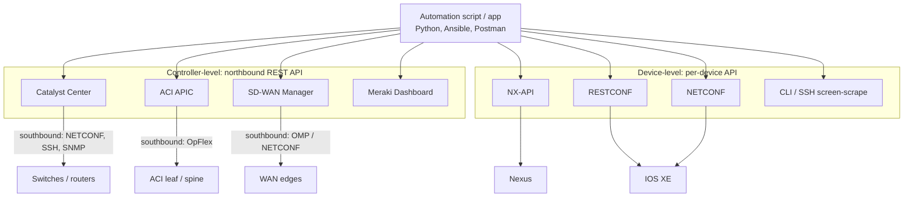
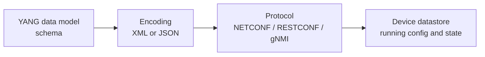

# T12 — Automation Foundations: Controller-level vs Device-level
**Blueprint 5.1, 5.2 · CBT: Full · 8 min**

## 1. Why network automation
- Manual CLI per box: slow, error-prone, inconsistent, no audit trail, doesn't scale.
- Automation benefits: speed, consistency/repeatability, fewer human errors, scalability, compliance/audit, faster troubleshooting, version-controlled config (NetDevOps / IaC).
- Automation needs: **programmable interfaces (APIs)**, **structured data** (JSON/XML/YANG), and **tooling** (Python, Ansible, pyATS, NSO…).

## 2. Two levels of programmability

## 3. Controller-level (centralised)
- One **controller** holds the view/intent of the whole domain; you talk to *it*, it pushes to devices.
- Examples: **Catalyst Center** (campus), **ACI APIC** (data center), **SD-WAN Manager** (WAN overlay), **Meraki Dashboard** (cloud).
- API: typically **REST** over HTTPS with JSON; auth via token/cookie/API key.
- **Northbound** = from the controller up to apps (REST API). **Southbound** = from controller down to devices (NETCONF, SNMP, SSH, OpFlex).
- Pros: single pane, **intent-based** (declare desired outcome), consistent policy, abstraction of vendor/model details, less per-device work.
- Cons: dependency on the controller, limited to what controller exposes.

## 4. Device-level (distributed)
- Automate **each device directly** with its own API.
- Interfaces: **NETCONF** (XML, SSH 830), **RESTCONF** (HTTP/S, JSON/XML), **NX-API**, gNMI/gRPC (telemetry), SNMP (legacy monitor), CLI/SSH (Netmiko/Paramiko).
- Pros: fine-grained control, works without a controller, brownfield.
- Cons: you handle scale, sequencing, and per-device differences yourself.

| | Controller-level | Device-level |
|---|---|---|
| Scope | Whole domain/fabric | Single device |
| Interface | Northbound REST | NETCONF / RESTCONF / NX-API / CLI |
| Model | Intent / policy | Config/state of box |
| Scale | High | You must loop |
| Examples | Catalyst Center, APIC, SD-WAN | IOS XE, NX-OS |

## 5. Model-driven programmability
- Config and state are described by **data models (YANG)** rather than CLI text.
- Benefits: **structured, machine-readable**, vendor-neutral (OpenConfig) or vendor-native models, versionable, validated (schema), transactional (NETCONF commit/rollback), same model across NETCONF/RESTCONF/gNMI.
- CLI screen-scraping problems: unstructured, varies by version/platform, fragile regex parsing.

## 6. Related automation concepts
- **Infrastructure as Code (IaC)**, idempotency (apply repeatedly → same result), declarative vs imperative.
- **Telemetry**: push (model-driven streaming) vs pull (SNMP polling).
- Tools: Ansible, Terraform, NSO, pyATS (see T25, T33, T44).

## 7. Exam tips
- "Single point to manage many devices / intent" → controller.
- "Directly configure one switch via NETCONF/RESTCONF/NX-API" → device-level.
- Know the controller for each domain: campus=Catalyst Center, DC=APIC, WAN=SD-WAN Manager, cloud-managed=Meraki.
