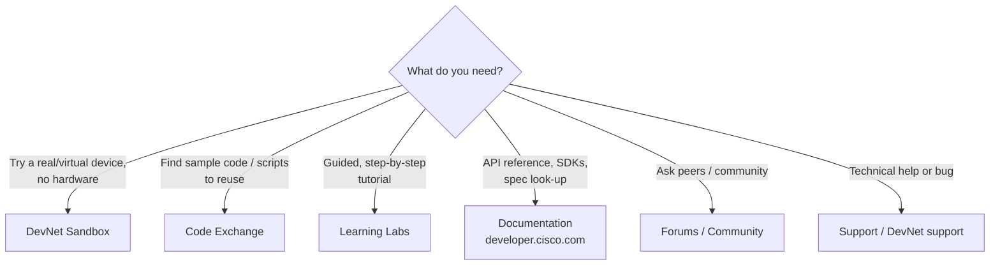

# T13 — DevNet Resources
**Blueprint 3.7 · CBT: Full · 6 min** · Skip: VM/WSL environment setup

## 1. The resource map

## 2. Each resource
- **DevNet Sandbox**
  - Free, hosted labs: **Always-On** (shared, public credentials, available instantly) and **Reservable** (dedicated, scheduled, time-boxed, often VPN).
  - Covers Catalyst Center, ACI, SD-WAN, NX-OS, IOS XE, Meraki, CML, UCS, Webex…
  - Use for: testing scripts/APIs without owning gear, safe experimentation.
- **Code Exchange**
  - Repository of **community and Cisco code, sample apps, SDKs, scripts** (GitHub-backed).
  - Use for: finding working examples / starting points.
- **Learning Labs / Learning Paths**
  - Guided tutorials with step-by-step instructions, some with embedded sandbox.
  - Use for: structured learning of a technology/API.
- **Documentation**
  - API references (Swagger/OpenAPI), guides, SDK docs, release notes on developer.cisco.com.
  - Use for: endpoint details, request/response schemas.
- **Forums / Community**
  - Peer Q&A, Stack-Overflow style; DevNet community, events, DevNet Express.
  - Use for: how-to questions, discussion.
- **Support**
  - Open a DevNet support ticket for sandbox/platform/API issues.

## 3. Scenario matching
| Scenario | Resource |
|---|---|
| Test a RESTCONF call without a lab | Sandbox (Always-On IOS XE) |
| Need a dedicated ACI fabric for a day | Sandbox (Reservable) |
| Find an existing Python script to pull Meraki clients | Code Exchange |
| New to NETCONF, want guided walkthrough | Learning Lab |
| Look up the exact Catalyst Center endpoint | Documentation / API reference |
| Ask whether others see a quirk | Forums |
| Sandbox reservation broken | Support |

## 4. Tips
- Always-On sandboxes: shared state — others may change things; don't store secrets.
- Reservable: book ahead, VPN in (AnyConnect), lab is wiped after.
- Memorise the *verb* each one implies: **try**(Sandbox), **reuse**(Code Exchange), **learn**(Labs), **look up**(Docs), **ask**(Forums), **escalate**(Support).
