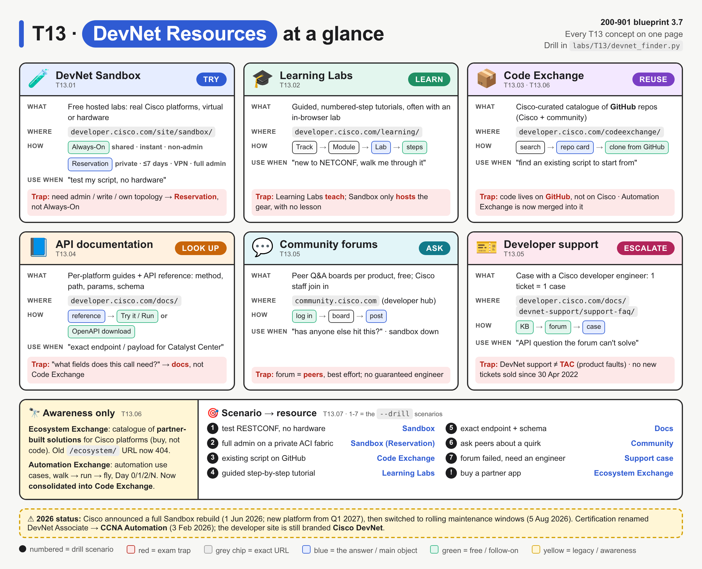
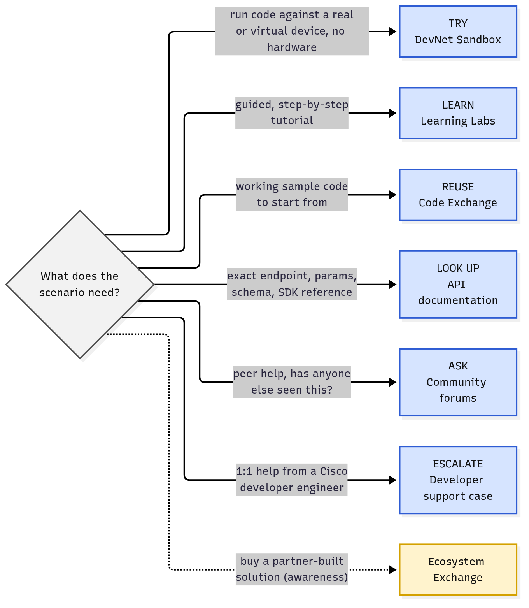
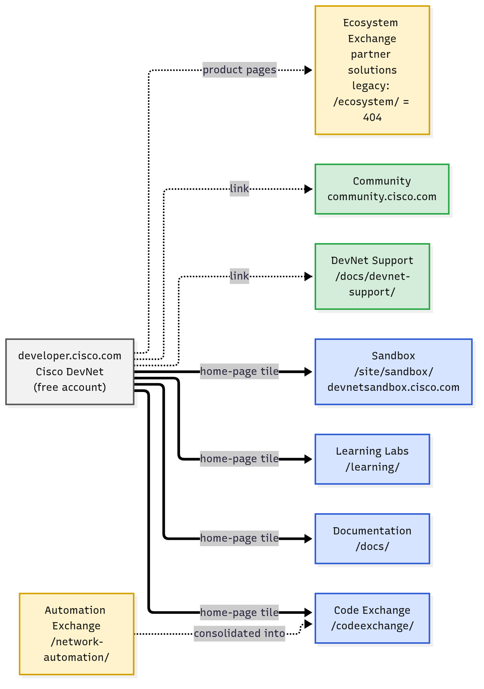
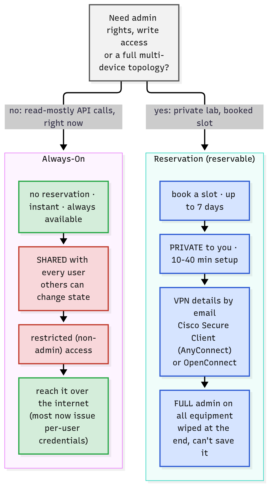
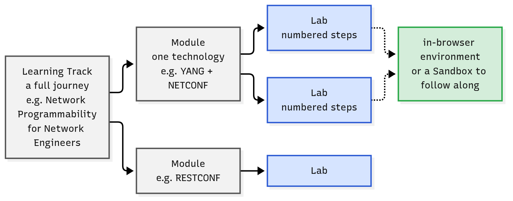
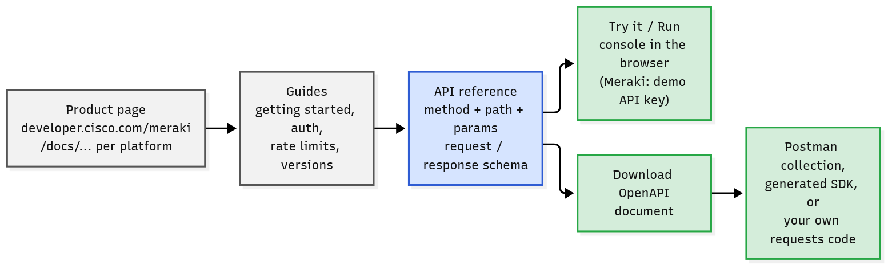
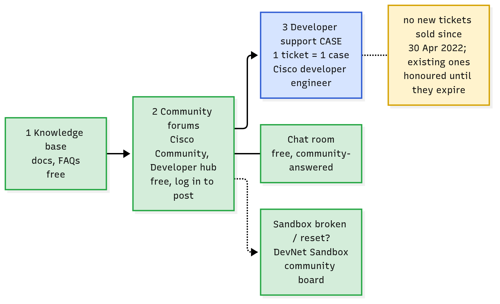

# T13 · DevNet resources

> Owner: **Bob** · Blueprint: **3.7** · CBT coverage: **Full** · Learn by 2026-10-06 · Teach-back 2026-10-08



*Each card is one resource with the same parts (what / where / how / use when / trap), so the differences stand out. The coloured pill is the verb to remember. The bottom strip is the exam drill: numbers 1-7 are the `--drill` scenarios from `labs/T13/devnet_finder.py`. Red = traps, yellow = legacy or awareness only.*

## TL;DR (teach-back card)

- **One verb per resource:** Sandbox = **TRY** (run code on real or virtual Cisco gear) · Learning Labs = **LEARN** (guided steps) · Code Exchange = **REUSE** (curated GitHub repos) · Docs = **LOOK UP** (endpoint, params, schema) · Community = **ASK** (peers) · Developer support = **ESCALATE** (case with a Cisco engineer).
- **Two Sandbox types:** **Always-On** = shared, instant, no booking, restricted (non-admin). **Reservation** = private, booked (up to 7 days), VPN in with Cisco Secure Client (AnyConnect) or OpenConnect, **full admin**, wiped at the end.
- **Everything is free** with a Cisco account: Learning Labs, videos, forums, Sandboxes. Ecosystem Exchange (partner solutions to buy) and Automation Exchange (use cases, now folded into Code Exchange) are awareness only.
- **Trap:** a scenario that needs admin rights, config changes or a private multi-device topology → **Reservation** sandbox, not Always-On. And "Learning Lab" contains the word *lab*, but a lab with lessons is Learning Labs, not Sandbox.

## Concepts

The note hangs on one decision: **"what does the scenario need?"** Every concept below is one branch of this diagram.



*Read the edge label (the need), then the box (the verb + resource). Ecosystem Exchange is dotted because it's awareness only.*



*Thick arrows = the four tiles on the developer.cisco.com home page today (Documentation, Learning Labs, Code Exchange, Sandbox). Dotted = linked from elsewhere. Yellow = legacy.*

A small drill program, `labs/T13/devnet_finder.py`, turns the decision into code. It matches scenario keywords to a resource (`--drill` runs the 7 exam-style scenarios) and HTTP-checks every URL (`--check`), so the names and URLs in this note are tested, not remembered.

**`labs/T13/devnet_finder.py`**

```python
"""T13 lab: match a scenario to the right DevNet resource, and check the URLs are live.

    python3 labs/T13/devnet_finder.py "need a lab to test a RESTCONF call"
    python3 labs/T13/devnet_finder.py --drill     # run the built-in exam scenarios
    python3 labs/T13/devnet_finder.py --check     # HTTP status of every resource URL

Standard library only. --check needs internet; redirects are shown, not followed.
"""
import argparse
import sys
import urllib.error
import urllib.request

# One entry per DevNet resource: the verb to remember, where it lives, and the
# words that point to it in an exam scenario.
RESOURCES = [
    {"name": "DevNet Sandbox", "verb": "TRY",
     "url": "https://developer.cisco.com/site/sandbox/",
     "keywords": ["lab", "test", "try", "hardware", "environment", "reserve",
                  "always-on", "admin", "vpn", "no equipment"]},
    {"name": "Learning Labs", "verb": "LEARN",
     "url": "https://developer.cisco.com/learning/",
     "keywords": ["step by step", "step-by-step", "tutorial", "guided",
                  "track", "module", "new to", "beginner"]},
    {"name": "Code Exchange", "verb": "REUSE",
     "url": "https://developer.cisco.com/codeexchange/",
     "keywords": ["sample code", "existing script", "github", "repo",
                  "reuse", "example code", "share my code", "use case"]},
    {"name": "API documentation", "verb": "LOOK UP",
     "url": "https://developer.cisco.com/docs/",
     "keywords": ["endpoint", "schema", "reference", "openapi", "parameter",
                  "payload", "sdk docs", "exact url"]},
    {"name": "Community forums", "verb": "ASK",
     "url": "https://community.cisco.com/t5/for-developers/ct-p/4409j-developer-home",
     "keywords": ["peer", "community", "others", "forum", "discuss",
                  "sandbox is down"]},
    {"name": "Developer support case", "verb": "ESCALATE",
     "url": "https://developer.cisco.com/docs/devnet-support/support-faq/",
     "keywords": ["ticket", "case", "cisco engineer", "one-on-one",
                  "unresolved", "bug in the api"]},
]

DRILL = [
    "need a lab to test a RESTCONF call without buying hardware",
    "need full admin rights on a private ACI fabric for a day",
    "find an existing script on GitHub that pulls Meraki clients",
    "new to NETCONF and want a guided step by step tutorial",
    "look up the exact endpoint and request schema for Catalyst Center",
    "ask peers whether others see the same API quirk",
    "forum gave no answer, open a case with a Cisco engineer",
]


def match(scenario):
    """Return (resource, score) for the resource whose keywords appear most often."""
    text = scenario.lower()
    scored = [(sum(k in text for k in r["keywords"]), r) for r in RESOURCES]
    score, best = max(scored, key=lambda pair: pair[0])
    return (best, score) if score else (None, 0)


class NoRedirect(urllib.request.HTTPRedirectHandler):
    def redirect_request(self, *args, **kwargs):
        return None  # surface the 301/302 instead of following it


def check(url, timeout=8):
    opener = urllib.request.build_opener(NoRedirect)
    req = urllib.request.Request(url, headers={"User-Agent": "T13-lab"})
    try:
        with opener.open(req, timeout=timeout) as resp:
            return f"{resp.status}"
    except urllib.error.HTTPError as err:
        where = err.headers.get("Location")
        return f"{err.code} -> {where}" if where else f"{err.code}"
    except (urllib.error.URLError, TimeoutError) as err:
        return f"unreachable ({err})"


def main():
    parser = argparse.ArgumentParser(description="Scenario -> DevNet resource")
    parser.add_argument("scenario", nargs="?", help="scenario text to match")
    parser.add_argument("--drill", action="store_true", help="run built-in scenarios")
    parser.add_argument("--check", action="store_true", help="HTTP-check every URL")
    args = parser.parse_args()

    if args.check:
        for r in RESOURCES:
            print(f"{r['name']:<24} {check(r['url'])}")
        return 0

    scenarios = DRILL if args.drill else [args.scenario] if args.scenario else []
    if not scenarios:
        parser.print_help()
        return 1
    for s in scenarios:
        best, score = match(s)
        answer = f"{best['verb']:<8} -> {best['name']}" if best else "no match"
        print(f"{answer:<36} | {s}")
    return 0


if __name__ == "__main__":
    sys.exit(main())
```

Real output (run 10 Oct 2026):

```text
$ python3 labs/T13/devnet_finder.py --drill
TRY      -> DevNet Sandbox           | need a lab to test a RESTCONF call without buying hardware
TRY      -> DevNet Sandbox           | need full admin rights on a private ACI fabric for a day
REUSE    -> Code Exchange            | find an existing script on GitHub that pulls Meraki clients
LEARN    -> Learning Labs            | new to NETCONF and want a guided step by step tutorial
LOOK UP  -> API documentation        | look up the exact endpoint and request schema for Catalyst Center
ASK      -> Community forums         | ask peers whether others see the same API quirk
ESCALATE -> Developer support case   | forum gave no answer, open a case with a Cisco engineer

$ python3 labs/T13/devnet_finder.py --check
DevNet Sandbox           200
Learning Labs            200
Code Exchange            200
API documentation        200
Community forums         403
Developer support case   200
```

- `403` on Community: `community.cisco.com` refuses scripted clients. The page opens normally in a browser.

### T13.01 · DevNet Sandbox
**Must cover:**
- [x] Free lab environments with real Cisco platforms
- [x] Always-on (shared, instant, read-mostly) vs reservable (private, full admin, time-limited, often via VPN)

**Notes:**
- **What it is:** free, hosted labs that Cisco calls "Sandboxes". Each one usually highlights **one product** (e.g. CUCM, APIC, Catalyst Center, IOS XE, NX-OS, Meraki, SD-WAN, CML, UCS).
  - Built from virtualised environments, simulators and real hardware.
  - Used for: testing API calls and scripts, learning a product's config, training, hackathons.
  - Product page `https://developer.cisco.com/site/sandbox/` (the old `/sandbox/` 301-redirects there). Portal and catalogue: `https://devnetsandbox.cisco.com/`. Each catalogue entry shows an **Always-On** or a **Reserve** button.
- **Two types** (the Sandbox docs call them **Always-On** and **Reservation**; the product page says "always-on and reservable"):



*Start with the question at the top. Red boxes are the Always-On limits that push you to a Reservation.*

| | Always-On | Reservation (reservable) |
|---|---|---|
| Booking | none: "always ready to go" | reserve a time window, up to **7 days** |
| Setup time | instant | 10–40 min (depends on sandbox) |
| Who else is on it | **shared** with all users | **private** to you |
| Rights | restricted, non-admin APIs ("kick the tires") | **full admin** on all equipment |
| Access | straight over the internet to a public hostname | **VPN**: details by email; Cisco Secure Client (formerly AnyConnect) or OpenConnect |
| Extras | usually one device/controller | often a whole topology: network, DNS, dev servers |
| Downsides | can't change admin config; others can change state | must wait for setup; **can't save** the environment |

- **Credentials:** Always-On used to publish one shared username/password. Most Always-On labs now issue **per-user credentials** when you launch them. Cisco says this will roll out to all Always-On labs ⚠ verify.
- **2026 status** ⚠ verify: on 1 Jun 2026 Cisco announced a full Sandbox rebuild (platform offline from 1 Aug, new experience from Q1 2027). An update on 5 Aug 2026 replaced the hiatus with short maintenance windows, so some behaviour may differ from the docs. The exam still tests the Always-On vs Reservation model.

### T13.02 · Learning Labs
**Must cover:**
- [x] Guided, step-by-step tutorials grouped into learning tracks

**Notes:**
- **What it is:** free, self-paced tutorials with numbered steps ("learn by doing"). The section is the **Learning Labs Center** at `https://developer.cisco.com/learning/`.
- **Structure:** **Learning Track** (a whole journey) → **Modules** (one technology) → **Labs** (the step-by-step pages). Search pages exist for each level: `/learning/search/tracks/`, `/learning/search/modules/`, `/learning/search/labs/`.
  - Example track on the site: "Network Programmability for Network Engineers" (YANG + NETCONF on IOS XE).



*A lab is the smallest unit. Many labs run in a preconfigured in-browser environment, or tell you to follow along on a Sandbox.*

- **Link to Sandbox:** labs either run in a preconfigured in-browser environment or point you to a matching Sandbox.
- **Fix to the round-1 note:** the grouping is now called **Learning Tracks** (not "Learning Paths"). "Learning paths" is the term Cisco U. uses for paid/official training.

### T13.03 · Code Exchange
**Must cover:**
- [x] Curated catalogue of code repos on GitHub (Cisco + community) to reuse

**Notes:**
- **What it is:** a **curated catalogue** of GitHub projects for Cisco platforms, at `https://developer.cisco.com/codeexchange/`. It covers sample code, SDKs, scripts, Ansible/Terraform content, and now MCP servers and AI agents.
  - The code itself stays **on GitHub**. Code Exchange indexes it, tags it by product (Meraki, Catalyst Center, Webex, SD-WAN, IOS XE, NX-OS) and links to it.
  - Authors: Cisco engineering teams, partners, open-source communities and individual developers. "Curated and maintained by Cisco" means Cisco curates the list, not that Cisco supports every repo.
- **Submitting your own repo:** it must be relevant to Cisco tech, public on GitHub, under an OSI-approved licence or the Cisco Sample Code License, and have a clear README.
- **Use for:** "find working sample code to start from", "share my script with the community".

### T13.04 · API documentation
**Must cover:**
- [x] developer.cisco.com API references and guides per platform; often OpenAPI specs and "try it" consoles

**Notes:**
- **What it is:** per-platform docs under `https://developer.cisco.com/docs/` (plus product hubs such as `developer.cisco.com/meraki/`). Each one has getting-started guides, authentication, rate limits, versions/changelog, SDK docs and the **API reference**.
- **API reference** = one page per operation: method, path, path/query parameters, request body schema, response codes and example responses. It's where you look up "the exact endpoint" (T07 covers reading it: [T07.11](../bee/T07-rest-fundamentals-http-codes.md#t0711--using-api-docs)).
- **Interactive extras** (vary by platform):
  - **Try it / Run console** in the browser. For example, the Meraki docs load a demo API key, so you can send a request with one click on "Run".
  - **Download the OpenAPI document**, then import it into Postman or generate an SDK.



*Blue = where the exam's "exact endpoint/schema" questions point. Green = what you can do from there.*

### T13.05 · Support and community
**Must cover:**
- [x] DevNet developer support (tickets for API questions)
- [x] Community forums for peer help

**Notes:**
- **DevNet Support** (`https://developer.cisco.com/docs/devnet-support/support-faq/`) lists **four** support options for developers using Cisco APIs:
  1. **Knowledge Base**: free articles; check here first.
  2. **Chat Room**: free, always available, answered by the community.
  3. **Forum**: free to any logged-in DevNet member.
  4. **Case support**: a **ticket** lets you open a case with a Cisco **developer engineer**. 1 ticket = 1 case, open until resolved.
- ⚠ verify: tickets are **no longer sold** (since 30 Apr 2022). Existing tickets are honoured until they expire. For the exam, "need 1:1 help from a Cisco engineer on an API" still → **developer support case**.
- **DevNet support ≠ TAC.** TAC handles product faults under a service contract. Developer support handles questions about using the **APIs**.
- **Community:** Cisco Community boards on `community.cisco.com` (the developer hub, linked as `cs.co/developer-community`). It has boards per product, plus a **DevNet Sandbox** board. Sandbox outages, resets and access problems go to that board; Cisco says to "normally expect a response within 24 hours" on business days.
  - The old `developer.cisco.com/site/support/` now 301-redirects to the community.



*Climb left to right: self-serve, then peers, then an engineer. Sandbox problems go to the Sandbox community board.*

### T13.06 · Other (awareness)
**Must cover:**
- [x] DevNet Ecosystem Exchange (partner solutions); Automation Exchange (automation use cases)

**Notes:**
- **DevNet Ecosystem Exchange:** a catalogue of **business solutions built by Cisco partners** on Cisco platforms (from the partner catalogue and the Digital Solutions Integrator listing). You use it to **find or buy** an app, not to get code.
  - ⚠ verify: the old `developer.cisco.com/ecosystem/` returns **404**. Product pages (e.g. App Hosting, IoT, Jabber) still embed "Solutions and Partners in Ecosystem Exchange".
- **DevNet Automation Exchange** (`/network-automation/`): automation **use cases** and shared repos, organised two ways:
  - Maturity **walk → run → fly**: visibility → policy/intent → DevOps workflow.
  - Lifecycle **Day 0** install · **Day 1** configure · **Day 2** optimise · **Day N** manage/upgrade.
  - The page now says it "has been consolidated with Code Exchange". Code Exchange has a "Check repos with Automation Use Case" section.

### T13.07 · Exam angle
**Must cover:**
- [x] Scenario → resource: "need a lab to test" → Sandbox; "find sample code" → Code Exchange; "learn step by step" → Learning Labs

**Notes:**
- Match on the **verb in the stem**, not on product names:

| Stem says… | Answer |
|---|---|
| test / try / run my script, no hardware, quick read-only call | **Sandbox (Always-On)** |
| admin rights, change config, private, multi-device, for N days, VPN | **Sandbox (Reservation)** |
| step by step, guided, tutorial, new to X, learning track | **Learning Labs** |
| sample code, existing script, GitHub, reuse, share my project | **Code Exchange** |
| exact endpoint, parameters, payload schema, OpenAPI, SDK reference | **API documentation** |
| ask others, peer help, is it just me, sandbox is down | **Community forums** |
| one-on-one Cisco engineer, case, ticket, API question unresolved | **Developer support case** |
| buy / find a partner-built solution | **Ecosystem Exchange** |

- The lab shows the classic trap: `"follow a Learning Lab"` alone matches **Sandbox** (the word *lab*). Add *guided* or *tutorial* and it becomes **Learning Labs**. See "Break it on purpose" below.

## Exam traps

- **Always-On vs Reservation:** "needs admin / write / private topology / several days" → Reservation. "Instant, no booking, read-mostly, shared" → Always-On.
- **"Lab" ≠ Sandbox every time.** A tutorial with lessons is **Learning Labs**. A hosted environment with no lessons is **Sandbox**.
- **Code Exchange hosts nothing.** Repos live on **GitHub**; Code Exchange is the curated index. It is not a package manager or a docs site.
- **"Which fields does this call need?" → Docs**, not Code Exchange. Sample code shows one way to call an API; the reference shows every parameter.
- **Forum vs case:** forum = free, peers, best effort. Case = Cisco developer engineer, uses a ticket. Neither is **TAC**.
- **Reservation access = VPN** (Cisco Secure Client, formerly AnyConnect, or OpenConnect). Always-On = no VPN.
- **Ecosystem Exchange = partner solutions** (buy). **Automation Exchange = use cases**, now merged into Code Exchange.
- **All of it is free** with a Cisco account: Sandbox, Learning Labs, forums, docs. Cisco U. is the separate (mostly paid) official-training platform.

## Examples

### 1. Run the drill

```bash
cd ccna-auto-study-notes
python3 labs/T13/devnet_finder.py --drill
python3 labs/T13/devnet_finder.py "I want sample code for Webex bots"
python3 labs/T13/devnet_finder.py --check
```

```text
REUSE    -> Code Exchange            | I want sample code for Webex bots
```

Same in the lab container (stdlib only, no extra packages):

```bash
docker build --tag ccna-auto-lab:latest --file labs/Dockerfile labs/
docker run --rm --volume "$(pwd)":/work --workdir /work ccna-auto-lab:latest python3 labs/T13/devnet_finder.py --drill
```

### 2. See the reorganised site with curl

Redirects and dead URLs are what changed. `--write-out` shows the status code and where each URL now points:

```bash
for u in https://developer.cisco.com/sandbox/ \
         https://developer.cisco.com/site/support/ \
         https://developer.cisco.com/ecosystem/ \
         https://developer.cisco.com/network-automation/; do
  curl --silent --output /dev/null --max-time 8 \
       --write-out "%{http_code} %{url_effective} -> %{redirect_url}\n" "$u"
done
```

```text
301 https://developer.cisco.com/sandbox/ -> https://developer.cisco.com/site/sandbox/
301 https://developer.cisco.com/site/support/ -> https://community.cisco.com/t5/devnet/ct-p/4409j-developer-home
404 https://developer.cisco.com/ecosystem/ -> 
200 https://developer.cisco.com/network-automation/ -> 
```

### 3. Break it on purpose

| Do this | You get | Lesson |
|---|---|---|
| `python3 labs/T13/devnet_finder.py "follow a Learning Lab"` | `TRY      -> DevNet Sandbox           \| follow a Learning Lab` | the word *lab* alone points at Sandbox |
| `python3 labs/T13/devnet_finder.py "follow a guided Learning Lab tutorial"` | `LEARN    -> Learning Labs            \| follow a guided Learning Lab tutorial` | *guided/tutorial* is the real signal |
| `python3 labs/T13/devnet_finder.py "how do I deploy my container to Kubernetes"` | `no match                             \| how do I deploy my container to Kubernetes` | not a DevNet-resource question at all |
| `python3 labs/T13/devnet_finder.py` (no argument) | usage text, exit code `1` | the `parser.print_help()` branch |

### 4. Drill: write the answer before you run it

Cover the right column of the T13.07 table, then run your own stems:

```bash
python3 labs/T13/devnet_finder.py "reserve a private SD-WAN lab over VPN with admin rights"
python3 labs/T13/devnet_finder.py "find the OpenAPI reference and payload schema for Meraki"
```

## Practice questions

**Q1.** A network engineer wants to send a few read-only RESTCONF GET requests to an IOS XE device in the next five minutes. They have no lab equipment and don't need to change config. What is the best choice?
- A. Reserve a DevNet Sandbox lab and connect over VPN
- B. Use an Always-On DevNet Sandbox
- C. Open a DevNet developer support case
- D. Search Code Exchange

<details><summary>Answer</summary>

**B.** Instant, no booking, and read-only fits Always-On. A reservation would work but takes 10–40 min to set up and needs a VPN, which this task doesn't need.
</details>

**Q2.** A team needs to test a script that changes the fabric policy on an APIC, with full admin rights, without other users interfering, over two days. Which resource fits?
- A. Always-On ACI Sandbox
- B. Learning Labs ACI track
- C. Reservation ACI Sandbox
- D. Ecosystem Exchange

<details><summary>Answer</summary>

**C.** Admin rights, a private environment and a multi-day window are what Reservation sandboxes provide (up to 7 days, VPN access).
</details>

**Q3.** Match each need to a DevNet resource (drag and drop). Needs: 1) a guided NETCONF tutorial, 2) an existing Python script that lists Meraki clients, 3) the request body schema for a Catalyst Center endpoint, 4) peer advice on an odd API response.
Resources: Code Exchange · API documentation · Learning Labs · Community forums

<details><summary>Answer</summary>

1 → Learning Labs · 2 → Code Exchange · 3 → API documentation · 4 → Community forums. Verbs: learn, reuse, look up, ask.
</details>

**Q4.** Which statement about Code Exchange is true?
- A. It hosts Cisco-supported code on Cisco servers
- B. It is a curated catalogue of GitHub repositories related to Cisco platforms
- C. It sells partner-built applications
- D. It provides VPN access to lab devices

<details><summary>Answer</summary>

**B.** The code stays on GitHub and Code Exchange curates and links it. C is Ecosystem Exchange; D is a Reservation sandbox.
</details>

**Q5.** Which TWO statements describe a Reservation sandbox? (Choose two.)
- A. Shared with all users
- B. Accessed through a VPN connection
- C. Full administrative access to the equipment
- D. Available instantly with no setup time
- E. Its state is saved after the reservation ends

<details><summary>Answer</summary>

**B and C.** A and D describe Always-On. E is wrong: a reservation is wiped at the end and you can't save the environment.
</details>

**Q6.** A developer searched the docs and posted in the forum but still has an unresolved question about using a Cisco API. They want one-to-one help from a Cisco engineer. What should they use?
- A. Cisco TAC case under the device's service contract
- B. DevNet developer support case
- C. Learning Labs
- D. Always-On Sandbox

<details><summary>Answer</summary>

**B.** Questions about using an API go to DevNet developer support (one ticket = one case with a developer engineer). TAC is for product faults.
</details>

**Q7.** Complete the sentence: on a DevNet API reference page, the feature that lets you send a sample request from the browser is the ______ console, and the file you import into Postman to get every operation is the ______ document.

<details><summary>Answer</summary>

**Try it / Run** console · **OpenAPI** document. Example: the Meraki docs load a demo API key for "Run" and offer "Download OpenAPI Document".
</details>

**Q8.** A manager wants to find a ready-made, partner-built application that integrates with Webex, to buy rather than build. Which resource fits best?
- A. Code Exchange
- B. Ecosystem Exchange
- C. Automation Exchange
- D. DevNet Sandbox

<details><summary>Answer</summary>

**B.** Ecosystem Exchange lists partner business solutions. Code Exchange and Automation Exchange (now merged into it) are about code and use cases.
</details>

## Study aids

| Aid | Type | Title | Est. min | Resource |
|---|---|---|---|---|
| T13.1 | Video | DevNet Resources | 18 | CBT: Prepare Your Development Environment > DevNet Resources |

- Skip / low priority: VM/WSL environment setup (the rest of that CBT module).
- Do: `python3 labs/T13/devnet_finder.py --drill`, then click through the four home-page tiles on developer.cisco.com once.

## Sources

- https://developer.cisco.com/ (home page tiles: Documentation, Labs, Sample Code/Code Exchange, Sandbox; community link)
- https://developer.cisco.com/site/sandbox/ (always-on and reservable, free, Launch Sandbox → devnetsandbox.cisco.com)
- https://developer.cisco.com/docs/sandbox/ and https://developer.cisco.com/docs/sandbox/getting-started/ (Always-On vs Reservation, pros/cons, 7 days, 10–40 min, VPN, Secure Client/OpenConnect)
- https://developer.cisco.com/docs/sandbox/first-reservation-guide (Reserve / Always-On buttons in the catalogue)
- https://community.cisco.com/t5/devnet-general-blogs/new-always-on-devnet-sandbox-for-cisco-catalyst-8000-amp/ba-p/5330526 (per-user credentials on Always-On)
- https://blogs.cisco.com/developer/devnet-sandbox-rebuild-future-developer-experiences (1 Jun 2026 rebuild announcement, 5 Aug 2026 update)
- https://developer.cisco.com/learning/ and https://developer.cisco.com/startnow (Learning Labs Center; Tracks / Modules / Labs)
- https://blogs.cisco.com/developer/bringing-ai-to-devnet-learning-labs (preconfigured in-browser lab environments)
- https://developer.cisco.com/codeexchange/ (curated GitHub projects, submission requirements, Automation Use Case section)
- https://developer.cisco.com/network-automation/ (Automation Exchange: walk/run/fly, Day 0/1/2/N, "consolidated with Code Exchange")
- https://developer.cisco.com/docs/app-hosting/developer-resources and https://developer.cisco.com/iot (Ecosystem Exchange description)
- https://developer.cisco.com/meraki/api-v1/api-reference-early-access-overview (interactive docs, demo API key "Run", Download OpenAPI Document)
- https://developer.cisco.com/docs/devnet-support/support-faq (four support options, tickets, no ticket sales since 30 Apr 2022)
- https://developer.cisco.com/about (all Learning Labs, videos, forums and Sandboxes are free; developer community at cs.co/developer-community)
- Diagrams: Mermaid sources in `assets/T13/*.mmd`.
- Overview image: HTML source assets/T13/00-overview.html, rendered to `00-overview.png`.

## To verify

- ⚠ Sandbox platform in transition: rebuild announced 1 Jun 2026 (new experience from Q1 2027), then changed on 5 Aug 2026 to rolling maintenance windows. Re-check the type names (Always-On / Reservation), the 7-day limit and the VPN client before the exam.
- ⚠ Per-user Always-On credentials: Cisco said this would roll out to all Always-On labs. **Fix to the round-1 note:** it said Always-On uses "public credentials", which is no longer true for most of them.
- ⚠ Developer support tickets: no longer sold since 30 Apr 2022 (FAQ). Some product pages (e.g. Jabber) still say "purchase a developer support ticket". The exam probably still expects "case/ticket" as the answer for 1:1 engineer help.
- ⚠ Ecosystem Exchange: `/ecosystem/` returns 404, but product pages still embed it. Confirm whether it still exists as a standalone catalogue.
- **Fix to the round-1 note:** "Learning Labs / Learning Paths" → the site's grouping is **Learning Tracks** (Track → Module → Lab).
- **Fix to the round-1 note:** "AnyConnect" → now **Cisco Secure Client** (formerly AnyConnect); OpenConnect also works.
- ⚠ Round-1 mention of "DevNet Express" under community/events: no current source found for it on developer.cisco.com, so it's dropped from the main notes. Treat it as historical.
- Not run against a live Always-On sandbox: this topic needs none. `--check` and the curl drill hit developer.cisco.com live (10 Oct 2026). `community.cisco.com` returns `403` to scripted clients.
- Docker commands in Example 1 weren't run here (the image isn't built in this session).
