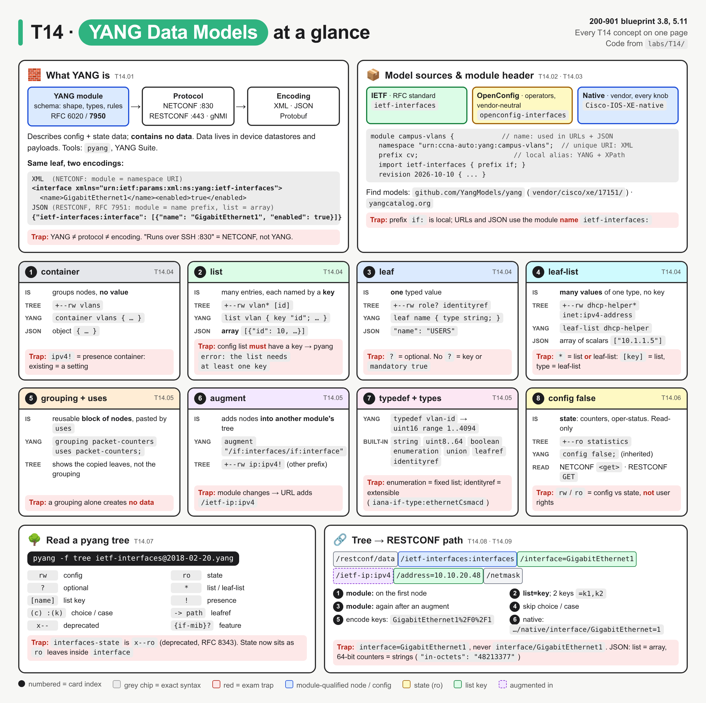
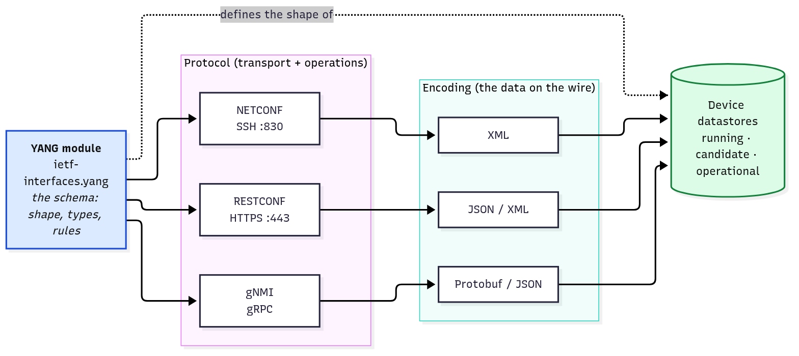
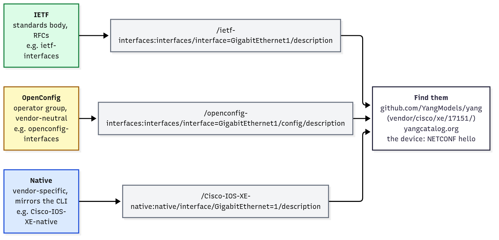
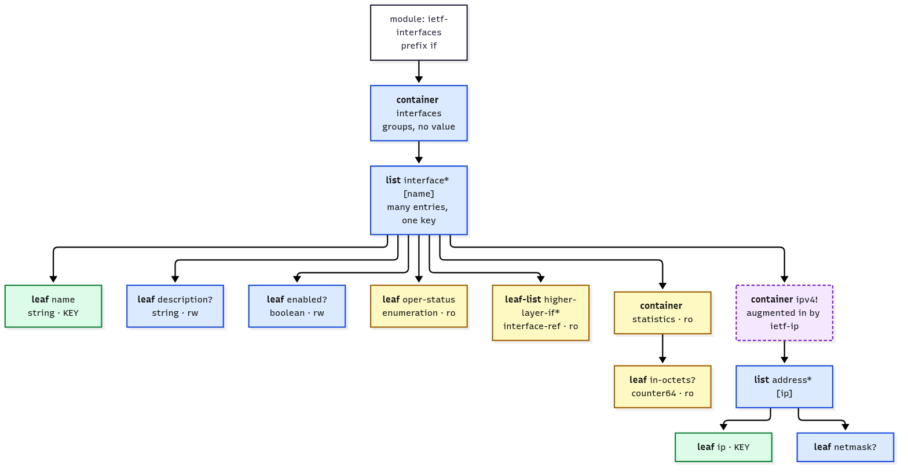
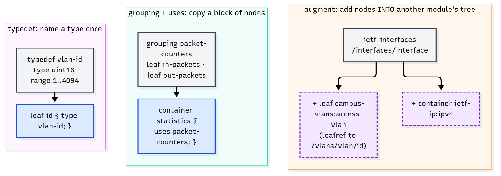
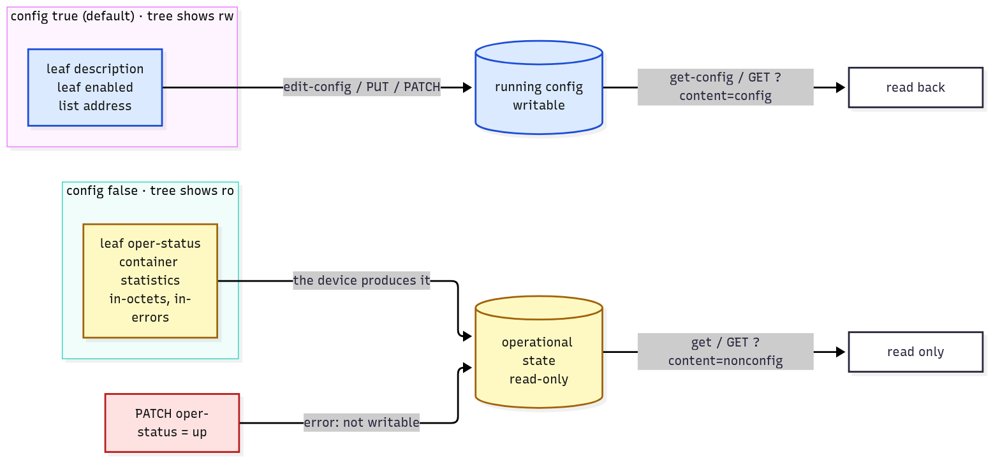
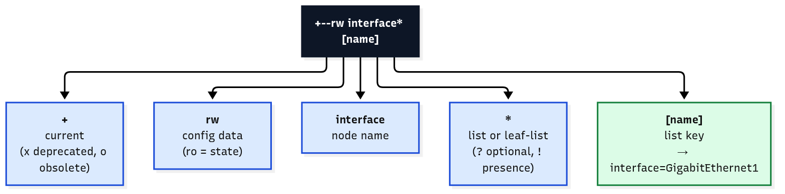
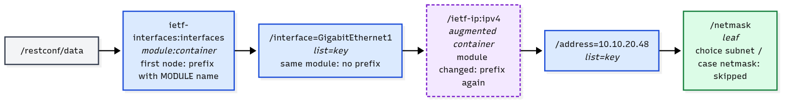
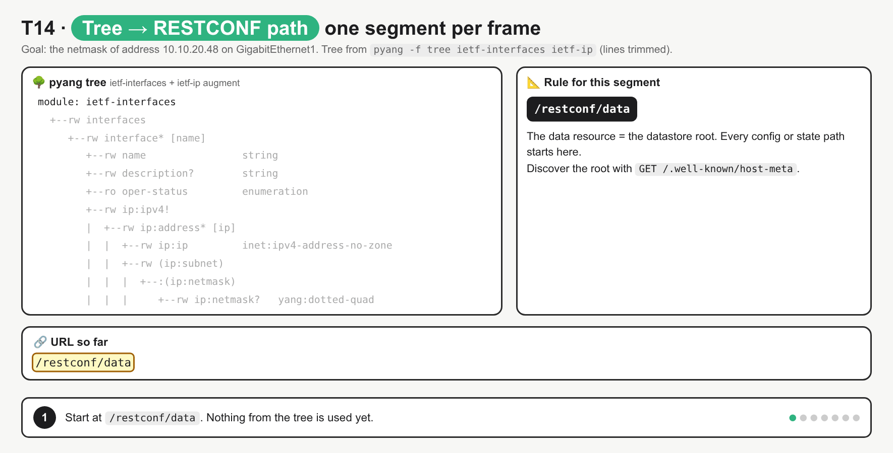

# T14 · YANG data models

> Owner: **Bob** · Blueprint: **3.8, 5.11** · CBT coverage: **Full** · Learn by 2026-10-09 · Teach-back 2026-10-12



*Every T14 concept on one page. The six cards in the middle are the node and reuse types, each drawn the same way so the differences stand out. The top strip covers what YANG is and where models come from, and the bottom strip turns a tree into a RESTCONF URL. Numbers are indexes, and red boxes are exam traps.*

## TL;DR (teach-back card)

- **YANG is the schema, not the data and not the protocol.** A module (name, `namespace`, `prefix`, `import`, `revision`) describes config and state. NETCONF (XML), RESTCONF (JSON/XML) and gNMI carry data that fits it. Models come from **IETF** (standard), **OpenConfig** (vendor-neutral, written by operators) and **Native** (vendor, e.g. `Cisco-IOS-XE-native`), all published in github.com/YangModels/yang.
- **Four data nodes:** a **container** groups other nodes and has no value. A **list** holds many entries, each picked out by a **key**. A **leaf** holds one typed value. A **leaf-list** holds many values of one type. Reuse: **typedef** names a type, **grouping**/**uses** copies a block of nodes, **augment** adds nodes into another module's tree. `config false` marks read-only state.
- **Read a tree, build a URL:** `+--rw interface* [name]` = a config list keyed by `name`. The path is `/restconf/data/ietf-interfaces:interfaces/interface=GigabitEthernet1/description`. The module name goes on the **first** node and wherever the module **changes** (`/ietf-ip:ipv4`). A list becomes `list=key`. Choice and case lines never appear in the URL.
- **Trap:** URLs and JSON use the module **name** (`ietf-interfaces:`), not the YANG **prefix** (`if:`) that the tree and XPath show. And `rw` vs `ro` in the tree is config vs state, not your user's permissions.

## Concepts

Every section below explains one part of the same lab. Read it once first.

- `labs/T14/fetch_models.sh` downloads real, pinned models:
  - IETF `ietf-interfaces` (RFC 8343) and `ietf-ip` (RFC 8344)
  - Cisco `Cisco-IOS-XE-native` for IOS XE 17.15.1
  - OpenConfig `openconfig-interfaces` v5.10.0
- `labs/T14/campus-vlans.yang` is a small **teaching module** that contains one of every construct the exam asks you to read. You're asked to read YANG, not write it.
- `labs/T14/yang_explorer.py` (shown below) is the **reference program**. It parses the modules with pyang's own library, then labels each node (kind, rw/ro, type, key, grouping, augment), builds RESTCONF URLs, and maps a RESTCONF JSON reply back to the model.
- `bash labs/T14/run_lab.sh` does all three steps and also prints the `pyang -f tree` views used in T14.07.

**`labs/T14/campus-vlans.yang`** (the snippet to read)

```yang
module campus-vlans {
  yang-version 1.1;
  namespace "urn:ccna-auto:yang:campus-vlans";
  prefix cv;

  import ietf-interfaces {
    prefix if;
  }
  import ietf-inet-types {
    prefix inet;
  }

  organization
    "CCNA Automation study group";
  contact
    "Bob (T14 owner)";
  description
    "Teaching module for T14: one of every node type you must read.";

  revision 2026-10-10 {
    description
      "Initial revision.";
  }

  typedef vlan-id {
    type uint16 {
      range "1..4094";
    }
    description
      "IEEE 802.1Q VLAN ID.";
  }

  identity vlan-role;

  identity user {
    base vlan-role;
  }

  identity voice {
    base vlan-role;
  }

  grouping packet-counters {
    leaf in-packets {
      type uint64;
    }
    leaf out-packets {
      type uint64;
    }
  }

  container vlans {
    list vlan {
      key "id";
      leaf id {
        type vlan-id;
      }
      leaf name {
        type string {
          length "1..32";
        }
        mandatory true;
      }
      leaf role {
        type identityref {
          base vlan-role;
        }
      }
      leaf admin-state {
        type enumeration {
          enum active;
          enum suspend;
        }
        default "active";
      }
      leaf gateway {
        type union {
          type inet:ipv4-address;
          type enumeration {
            enum none;
          }
        }
      }
      leaf-list dhcp-helper {
        type inet:ipv4-address;
      }
      container statistics {
        config false;
        uses packet-counters;
      }
    }
  }

  augment "/if:interfaces/if:interface" {
    leaf access-vlan {
      type leafref {
        path "/cv:vlans/cv:vlan/cv:id";
      }
    }
  }
}
```

**`labs/T14/yang_explorer.py`**

```python
"""T14 reference program: read YANG models the way the exam asks you to.

Run:  bash labs/T14/fetch_models.sh        (once: downloads IETF, Cisco native, OpenConfig models)
      python3 labs/T14/yang_explorer.py

Needs pyang (pip install pyang). It loads the .yang files with pyang's own parser, then:
  1. prints each module header (name, namespace, prefix, imports, revision)
  2. walks campus-vlans.yang and labels every node: kind, rw/ro, type, key, grouping, augment
  3. resolves typedefs down to their built-in type
  4. turns schema nodes into RESTCONF URLs (module:container/list=key/leaf)
  5. reads a RESTCONF JSON reply and maps every value back to its YANG node
  6. optional: GETs one of those URLs from a real device (set RESTCONF_HOST/USER/PASS)
"""
import base64
import json
import os
import ssl
import sys
import urllib.error
import urllib.request
from urllib.parse import quote

from pyang import context, repository

HERE = os.path.dirname(os.path.abspath(__file__))
SEARCH_PATH = os.pathsep.join(
    [HERE] + [os.path.join(HERE, "models", d) for d in ("ietf", "xe", "oc")])
DATA_NODES = ("container", "list", "leaf", "leaf-list")


def load(ctx, name):
    """Find a module on the search path and parse it (None if not downloaded)."""
    return ctx.search_module(None, name)


def show_header(module):
    """T14.03: the statements at the top of every module."""
    imports = [f"{i.arg} (prefix {i.search_one('prefix').arg})" for i in module.search("import")]
    revision = module.search_one("revision")
    org = module.search_one("organization")
    print(f"module {module.arg}")
    print(f"  namespace    {module.search_one('namespace').arg}")
    print(f"  prefix       {module.search_one('prefix').arg}")
    print(f"  import       {', '.join(imports) or '-'}")
    print(f"  organization {org.arg.splitlines()[0] if org else '-'}")
    print(f"  revision     {revision.arg if revision else '-'}")


def base_type(type_stmt):
    """T14.05: follow typedefs (vlan-id -> uint16) until a built-in type is reached."""
    chain = [type_stmt.arg]
    while getattr(type_stmt, "i_typedef", None) is not None:
        type_stmt = type_stmt.i_typedef.search_one("type")
        chain.append(type_stmt.arg)
    return " -> ".join(chain)


def describe(node):
    """T14.04-T14.06: what kind of node, config or state, its type and where it came from."""
    rw = "rw" if node.i_config else "ro"
    kind = node.keyword
    notes = []
    if kind == "list":
        notes.append("key=" + ",".join(k.arg for k in node.i_key))
    if kind in ("leaf", "leaf-list"):
        notes.append("type=" + base_type(node.search_one("type")))
    if getattr(node, "i_uses", None):
        notes.append("from grouping " + node.i_uses[0].arg)
    if node.parent.keyword != "module" and node.i_module.i_modulename != node.parent.i_module.i_modulename:
        notes.append("augmented in by " + node.i_module.i_modulename)
    for attr in ("default", "mandatory"):
        sub = node.search_one(attr)
        if sub is not None:
            notes.append(f"{attr}={sub.arg}")
    return rw, kind, "  ".join(notes)


def walk(node, depth=0, only_module=None):
    """Print every data node under `node`, indented like a tree (optionally only one module's nodes)."""
    for child in getattr(node, "i_children", []):        # leaves have no children
        if only_module and child.i_module.i_modulename != only_module:
            continue
        if child.keyword in ("choice", "case"):        # not data nodes: never appear in paths/payloads
            print(f"{'   ' * depth}({child.keyword} {child.arg})")
            walk(child, depth)
            continue
        if child.keyword not in DATA_NODES:
            continue
        rw, kind, notes = describe(child)
        label = f"{'   ' * depth}{child.arg}"
        print(f"{label:<28} {rw}  {kind:<10} {notes}")
        walk(child, depth + 1)


def find(module, names):
    """Return the schema node at names[...] below a module, stepping through choice/case."""
    node = module
    for name in names:
        candidates = list(node.i_children)
        while True:
            hit = [c for c in candidates if c.arg == name and c.keyword in DATA_NODES]
            if hit:
                node = hit[0]
                break
            nested = [g for c in candidates if c.keyword in ("choice", "case") for g in c.i_children]
            if not nested:
                raise KeyError(f"{name} not found under {node.arg}")
            candidates = nested
    return node


def restconf_path(leaf, keys):
    """T14.08: schema node + key values -> RESTCONF data resource path (RFC 8040 3.5.3)."""
    chain, node = [], leaf
    while node.keyword != "module":
        if node.keyword in DATA_NODES:
            chain.insert(0, node)
        node = node.parent
    parts, previous_module = [], None
    for node in chain:
        module = node.i_module.i_modulename
        name = node.arg if module == previous_module else f"{module}:{node.arg}"   # prefix on first node / module change
        if node.keyword == "list":
            name += "=" + ",".join(quote(str(k), safe="") for k in keys[node.arg])  # list=key, '/' -> %2F
        parts.append(name)
        previous_module = module
    return "/restconf/data/" + "/".join(parts)


def map_json(schema_parent, data, indent="  "):
    """T14.06/T14.09: walk a RESTCONF JSON reply and label each value with its YANG node."""
    for member, value in data.items():
        name = member.split(":")[-1]                     # "ietf-ip:ipv4" -> "ipv4" (RFC 7951 member name)
        node = find(schema_parent, [name])
        if node.keyword == "list":
            for entry in value:                          # JSON list instance = array of objects
                keys = ",".join(str(entry[k.arg]) for k in node.i_key)
                print(f"{indent}{member}  (list entry, key={keys})")
                map_json(node, entry, indent + "  ")
        elif node.keyword == "container":
            print(f"{indent}{member}  (container)")
            map_json(node, value, indent + "  ")
        else:
            rw = "rw" if node.i_config else "ro"
            label = f"{indent}{member}"
            print(f"{label:<32} {rw}  {json.dumps(value):<40} {base_type(node.search_one('type'))}")


def live_get(path):
    """Optional: GET the path from a real IOS XE device (DevNet sandbox creds in env vars)."""
    host, user, password = (os.environ.get(v) for v in ("RESTCONF_HOST", "RESTCONF_USER", "RESTCONF_PASS"))
    if not (host and user and password):
        print("  skipped: set RESTCONF_HOST, RESTCONF_USER, RESTCONF_PASS to try a real device")
        return
    request = urllib.request.Request(f"https://{host}{path}", headers={
        "Accept": "application/yang-data+json",
        "Authorization": "Basic " + base64.b64encode(f"{user}:{password}".encode()).decode()})
    try:
        with urllib.request.urlopen(request, context=ssl._create_unverified_context(), timeout=10) as resp:
            print(f"  {resp.status} {resp.reason}\n{resp.read().decode()[:600]}")
    except (urllib.error.URLError, OSError) as err:
        print(f"  failed: {err}")


def main():
    ctx = context.Context(repository.FileRepository(SEARCH_PATH, use_env=False))
    names = ["campus-vlans", "ietf-interfaces", "ietf-ip", "Cisco-IOS-XE-native", "openconfig-interfaces"]
    mods = {n: load(ctx, n) for n in names}
    if None in (mods["ietf-interfaces"], mods["ietf-ip"]):
        sys.exit("run labs/T14/fetch_models.sh first")
    ctx.validate()

    print("== 1. Module headers (T14.02, T14.03) ==")
    for name in ("campus-vlans", "ietf-interfaces", "Cisco-IOS-XE-native", "openconfig-interfaces"):
        if mods[name]:
            show_header(mods[name])

    print("\n== 2. Every node in campus-vlans (T14.04-T14.06) ==")
    print(f"{'node':<28} rw  {'kind':<10} notes")
    walk(mods["campus-vlans"])
    print("augment /if:interfaces/if:interface:")
    walk(find(mods["ietf-interfaces"], ["interfaces", "interface"]), 1, only_module="campus-vlans")
    print("\nietf-ip ipv4/address (augmented into ietf-interfaces):")
    walk(find(mods["ietf-interfaces"], ["interfaces", "interface", "ipv4", "address"]), 1)

    print("\n== 3. Typedefs resolved (T14.05) ==")
    for module, names_ in (("campus-vlans", ["vlans", "vlan", "id"]),
                           ("ietf-interfaces", ["interfaces", "interface", "higher-layer-if"]),
                           ("ietf-ip", ["interfaces", "interface", "ipv4", "address", "ip"])):
        root = mods["ietf-interfaces"] if module == "ietf-ip" else mods[module]
        leaf = find(root, names_)
        print(f"  {'/'.join(names_):<45} {base_type(leaf.search_one('type'))}")

    print("\n== 4. Schema node -> RESTCONF URL (T14.08) ==")
    gi1 = {"interface": ["GigabitEthernet1"]}
    targets = [
        (mods["ietf-interfaces"], ["interfaces", "interface", "description"], gi1),
        (mods["ietf-interfaces"], ["interfaces", "interface", "description"], {"interface": ["GigabitEthernet1/0/1"]}),
        (mods["ietf-interfaces"], ["interfaces", "interface", "ipv4", "address", "netmask"],
         {"interface": ["GigabitEthernet1"], "address": ["10.10.20.48"]}),
        (mods["ietf-interfaces"], ["interfaces", "interface", "access-vlan"], gi1),
        (mods["campus-vlans"], ["vlans", "vlan", "name"], {"vlan": [10]}),
    ]
    if mods["Cisco-IOS-XE-native"]:
        targets += [(mods["Cisco-IOS-XE-native"], ["native", "hostname"], {}),
                    (mods["Cisco-IOS-XE-native"], ["native", "interface", "GigabitEthernet", "description"],
                     {"GigabitEthernet": ["1"]})]
    if mods["openconfig-interfaces"]:
        targets.append((mods["openconfig-interfaces"], ["interfaces", "interface", "config", "description"], gi1))
    for root, names_, keys in targets:
        print("  " + restconf_path(find(root, names_), keys))

    print("\n== 5. RESTCONF JSON reply mapped to the model (T14.06, T14.09) ==")
    with open(os.path.join(HERE, "sample-data", "gi1-restconf.json")) as fh:
        reply = json.load(fh)
    map_json(find(mods["ietf-interfaces"], ["interfaces"]), reply)

    print("\n== 6. Same URL against a real device (optional) ==")
    live_get(restconf_path(find(mods["ietf-interfaces"], ["interfaces", "interface", "description"]), gi1))


if __name__ == "__main__":
    main()
```

**Output** (`python3 labs/T14/yang_explorer.py`, after `fetch_models.sh`):

```
== 1. Module headers (T14.02, T14.03) ==
module campus-vlans
  namespace    urn:ccna-auto:yang:campus-vlans
  prefix       cv
  import       ietf-interfaces (prefix if), ietf-inet-types (prefix inet)
  organization CCNA Automation study group
  revision     2026-10-10
module ietf-interfaces
  namespace    urn:ietf:params:xml:ns:yang:ietf-interfaces
  prefix       if
  import       ietf-yang-types (prefix yang)
  organization IETF NETMOD (Network Modeling) Working Group
  revision     2018-02-20
module Cisco-IOS-XE-native
  namespace    http://cisco.com/ns/yang/Cisco-IOS-XE-native
  prefix       ios
  import       cisco-semver (prefix cisco-semver), ietf-inet-types (prefix inet), Cisco-IOS-XE-types (prefix ios-types), Cisco-IOS-XE-features (prefix ios-features), Cisco-IOS-XE-interface-common (prefix ios-ifc)
  organization Cisco Systems, Inc.
  revision     2024-07-01
module openconfig-interfaces
  namespace    http://openconfig.net/yang/interfaces
  prefix       oc-if
  import       ietf-interfaces (prefix ietf-if), openconfig-yang-types (prefix oc-yang), openconfig-types (prefix oc-types), openconfig-extensions (prefix oc-ext), openconfig-transport-types (prefix oc-opt-types)
  organization OpenConfig working group
  revision     2026-09-22

== 2. Every node in campus-vlans (T14.04-T14.06) ==
node                         rw  kind       notes
vlans                        rw  container  
   vlan                      rw  list       key=id
      id                     rw  leaf       type=vlan-id -> uint16
      name                   rw  leaf       type=string  mandatory=true
      role                   rw  leaf       type=identityref
      admin-state            rw  leaf       type=enumeration  default=active
      gateway                rw  leaf       type=union
      dhcp-helper            rw  leaf-list  type=inet:ipv4-address -> string
      statistics             ro  container  
         in-packets          ro  leaf       type=uint64  from grouping packet-counters
         out-packets         ro  leaf       type=uint64  from grouping packet-counters
augment /if:interfaces/if:interface:
   access-vlan               rw  leaf       type=leafref  augmented in by campus-vlans

ietf-ip ipv4/address (augmented into ietf-interfaces):
   ip                        rw  leaf       type=inet:ipv4-address-no-zone -> inet:ipv4-address -> string
   (choice subnet)
   (case prefix-length)
   prefix-length             rw  leaf       type=uint8
   (case netmask)
   netmask                   rw  leaf       type=yang:dotted-quad -> string
   origin                    ro  leaf       type=ip-address-origin -> enumeration

== 3. Typedefs resolved (T14.05) ==
  vlans/vlan/id                                 vlan-id -> uint16
  interfaces/interface/higher-layer-if          interface-ref -> leafref
  interfaces/interface/ipv4/address/ip          inet:ipv4-address-no-zone -> inet:ipv4-address -> string

== 4. Schema node -> RESTCONF URL (T14.08) ==
  /restconf/data/ietf-interfaces:interfaces/interface=GigabitEthernet1/description
  /restconf/data/ietf-interfaces:interfaces/interface=GigabitEthernet1%2F0%2F1/description
  /restconf/data/ietf-interfaces:interfaces/interface=GigabitEthernet1/ietf-ip:ipv4/address=10.10.20.48/netmask
  /restconf/data/ietf-interfaces:interfaces/interface=GigabitEthernet1/campus-vlans:access-vlan
  /restconf/data/campus-vlans:vlans/vlan=10/name
  /restconf/data/Cisco-IOS-XE-native:native/hostname
  /restconf/data/Cisco-IOS-XE-native:native/interface/GigabitEthernet=1/description
  /restconf/data/openconfig-interfaces:interfaces/interface=GigabitEthernet1/config/description

== 5. RESTCONF JSON reply mapped to the model (T14.06, T14.09) ==
  ietf-interfaces:interface  (list entry, key=GigabitEthernet1)
    name                         rw  "GigabitEthernet1"                       string
    description                  rw  "MANAGEMENT INTERFACE - DON'T TOUCH ME"  string
    type                         rw  "iana-if-type:ethernetCsmacd"            identityref
    enabled                      rw  true                                     boolean
    oper-status                  ro  "up"                                     enumeration
    phys-address                 ro  "00:50:56:bf:76:4a"                      yang:phys-address -> string
    speed                        ro  "1000000000"                             yang:gauge64 -> uint64
    statistics  (container)
      discontinuity-time         ro  "2026-10-01T06:12:41+00:00"              yang:date-and-time -> string
      in-octets                  ro  "48213377"                               yang:counter64 -> uint64
      in-errors                  ro  0                                        yang:counter32 -> uint32
      out-octets                 ro  "15532090"                               yang:counter64 -> uint64
    ietf-ip:ipv4  (container)
      address  (list entry, key=10.10.20.48)
        ip                       rw  "10.10.20.48"                            inet:ipv4-address-no-zone -> inet:ipv4-address -> string
        netmask                  rw  "255.255.255.0"                          yang:dotted-quad -> string
    campus-vlans:access-vlan     rw  10                                       leafref

== 6. Same URL against a real device (optional) ==
  skipped: set RESTCONF_HOST, RESTCONF_USER, RESTCONF_PASS to try a real device
```

- Section 5 reads `labs/T14/sample-data/gi1-restconf.json`. It's a **mock** reply shaped like RFC 8040/8343, because the DevNet always-on sandboxes now issue per-user credentials (see To verify). Section 6 sends the real GET once you export the sandbox credentials.

### T14.01 · What YANG is

**Must cover:**

- [x] Data modelling language (RFC 6020 / 7950) that defines the structure, types and constraints of config and operational data
- [x] Describes data; does not contain it
- [x] Protocol-independent: used by NETCONF, RESTCONF, gNMI

**Notes:**

- **YANG** ("Yet Another Next Generation") is a **data modelling language**.
  - YANG 1.0 is RFC 6020 (2010). **YANG 1.1** is RFC 7950 (2016) and is what current models use (`yang-version 1.1;`).
  - Cisco models are YANG 1.1 from IOS XE 17.10.1 onwards.
- It defines the **structure** (the tree), the **types** (`uint16`, `boolean`, `ipv4-address` and so on) and the **constraints** (`range "1..4094"`, `mandatory true`, `key`) for:
  - **configuration data** (what you set)
  - **operational state** (what the device reports: counters, oper-status)
  - **RPCs/actions** and **notifications** (operations and events, awareness level)
- **It describes data; it doesn't contain it.** `campus-vlans.yang` says "a VLAN has an `id` from 1 to 4094 and a mandatory `name`". It has no VLAN 10 in it. VLAN 10 lives in the device's **datastore**, or in a payload such as `sample-data/gi1-restconf.json`.
  - Analogy: YANG is to device data what a database schema is to its rows.
- **It's protocol-independent.** One model, several transports:



*YANG (blue) only defines the shape. The protocol carries the data, and the encoding is how that data looks on the wire. All three stacks end at the same datastores.*

| Layer | Answers | Examples |
|---|---|---|
| **Model** | what the data looks like | YANG module `ietf-interfaces` |
| **Protocol** | how you send and receive it, and which operations exist | NETCONF (SSH :830), RESTCONF (HTTPS :443), gNMI (gRPC) |
| **Encoding** | how the data is written | XML (NETCONF), JSON or XML (RESTCONF), Protobuf/JSON (gNMI) |

- The same leaf in two encodings, both following the same model (RFC 7950 for XML, RFC 7951 for JSON):

| XML (NETCONF) | JSON (RESTCONF) |
|---|---|
| `<interface xmlns="urn:ietf:params:xml:ns:yang:ietf-interfaces"><name>GigabitEthernet1</name><enabled>true</enabled></interface>` | `{"ietf-interfaces:interface": [{"name": "GigabitEthernet1", "enabled": true}]}` |

  - XML identifies the module by its **namespace URI** (`xmlns=`). JSON uses the **module name** as a member prefix (`ietf-interfaces:`).
  - A list entry in JSON is an **array** of objects, even if it holds only one entry (RFC 7951). IOS XE often returns a single requested entry as an **object** instead; see [T16 To verify](T16-restconf.md#to-verify). ⚠ verify
- Tools: **pyang** (validate a module, print its tree; it's in the lab image) and **Cisco YANG Suite** (browse models, build NETCONF/RESTCONF/gNMI requests from them).

### T14.02 · Model sources

**Must cover:**

- [x] IETF standard models (e.g. ietf-interfaces)
- [x] OpenConfig: vendor-neutral, operator-driven
- [x] Native/vendor models (e.g. Cisco-IOS-XE-native)
- [x] Found in the YangModels GitHub repo and YANG Catalog

**Notes:**

| Family | Written by | Scope | Example module (namespace) | Same `description` leaf |
|---|---|---|---|---|
| **IETF** | IETF working groups, published as RFCs | common features, multi-vendor, slow to change | `ietf-interfaces` (`urn:ietf:params:xml:ns:yang:ietf-interfaces`) | `interfaces/interface=GigabitEthernet1/description` |
| **OpenConfig** | operator group (large SPs and cloud/web companies) | vendor-neutral, operational focus, `config` + `state` containers | `openconfig-interfaces` (`http://openconfig.net/yang/interfaces`) | `interfaces/interface=GigabitEthernet1/config/description` |
| **Native** | the vendor | **every** platform feature, mirrors the CLI, changes each release | `Cisco-IOS-XE-native` (`http://cisco.com/ns/yang/Cisco-IOS-XE-native`) | `native/interface/GigabitEthernet=1/description` |



*Three families can model the same setting with three different paths. Note the native list key: `GigabitEthernet=1`, not `GigabitEthernet1`.*

- Section 1 of the output shows the three headers. Section 4 builds all three `description` URLs from the real models.
- **Which to pick:** IETF or OpenConfig for multi-vendor code. Native when the feature only exists there, which covers most IOS XE features beyond interfaces/IP.
  - Cisco IOS XE, IOS XR and NX-OS support all three families.
- **Where to find them:**
  - **github.com/YangModels/yang**: `standard/ietf/RFC/` for IETF, `vendor/cisco/xe/17151/` for IOS XE 17.15.1 (one folder per release). `fetch_models.sh` downloads from here.
  - **YANG Catalog** (yangcatalog.org): searchable metadata, for example which platforms and releases implement a module.
  - **github.com/openconfig/public**: OpenConfig models (`release/models/`).
  - **The device itself**: the NETCONF `<hello>` capabilities list (T15), or the `ietf-yang-library` module. ⚠ verify the exact RESTCONF path on IOS XE.
- **Cisco-specific operational models** are a separate set of native modules named `Cisco-IOS-XE-*-oper` (e.g. `Cisco-IOS-XE-interfaces-oper`). They are all `config false`.

### T14.03 · Module header

**Must cover:**

- [x] module name, namespace (unique URI), prefix, import, organization, revision

**Notes:**

- Every module opens with the same statements. From `campus-vlans.yang`, and `show_header()` prints them for every module in section 1:

| Statement | `campus-vlans` value | Purpose |
|---|---|---|
| `module <name>` | `campus-vlans` | the module **name**. RESTCONF URLs and JSON keys use it (`campus-vlans:vlans`) |
| `yang-version` | `1.1` | RFC 7950 syntax |
| `namespace` | `urn:ccna-auto:yang:campus-vlans` | globally **unique URI**. XML uses it (`xmlns=…`) |
| `prefix` | `cv` | **short local alias** used inside YANG files and XPath (`/cv:vlans/cv:vlan/cv:id`) |
| `import` | `ietf-interfaces { prefix if; }` | use another module's typedefs, groupings and nodes, through **its** prefix (`if:interface-ref`) |
| `organization` / `contact` / `description` | `CCNA Automation study group` | who owns it (documentation only) |
| `revision` | `2026-10-10` | version date. Newest first; a file is often named `module@revision.yang` (`ietf-interfaces@2018-02-20.yang`) |

- **Name vs namespace vs prefix:**
  - The **name** identifies the module: file names, URLs, JSON.
  - The **namespace** is the unique URI that XML uses.
  - The **prefix** is a local nickname used only inside YANG and XPath.
- `include` pulls in a **submodule** (part of the same module). `import` uses a **different** module. Cisco-IOS-XE-native is split into many files this way. `fetch_models.sh` downloads 15 files for it.

### T14.04 · Node types

**Must cover:**

- [x] container: groups related nodes (no value itself)
- [x] list: repeated entries, each identified by a key leaf
- [x] leaf: single value with a type
- [x] leaf-list: list of values of one type

**Notes:**



*Green = list keys, blue = config (rw), yellow = state (ro), dashed purple = augmented in from ietf-ip. Containers and lists only group nodes; leaves hold the values.*

| Node | Holds | Tree marker | JSON shape | In `campus-vlans` |
|---|---|---|---|---|
| **container** | other nodes, **no value** of its own | `+--rw vlans` | object `{…}` | `vlans`, `statistics` |
| **list** | many **entries**, each picked out by its **key** leaf(s) | `vlan* [id]` | **array** of objects `[{…}, {…}]` | `vlan`, keyed by `id` |
| **leaf** | **one** value with a type | `name   string` | `"name": "USERS"` | `id`, `name`, `role`, `gateway` |
| **leaf-list** | **many values** of one type, no key | `dhcp-helper*   inet:ipv4-address` | array of scalars `["10.1.1.5", "10.1.1.6"]` | `dhcp-helper` |

- Network-engineer mapping:
  - container = a config **section** (`interfaces`)
  - list = a **repeating stanza** (each `interface GigabitEthernet…` block)
  - key = the value that **names** the stanza (`GigabitEthernet1`)
  - leaf = one **setting** (`description …`)
  - leaf-list = a **repeatable single-value line** (`ip helper-address` ×2)
- **Key rules (RFC 7950 §7.8.2):**
  - A config list **must** have a `key`. Removing `key "id";` makes pyang stop with `error: the list needs at least one key` (see Examples §3).
  - Key leaves are implicitly mandatory, which is why `id` has no `?` in the tree.
  - A list can have **several** keys: `key "name vrf";` → tree shows `[name vrf]` → URL `list=Gi1,blue`.
- Also seen in trees, for reading only:
  - **choice / case**: exactly one branch exists (e.g. `ietf-ip` `(subnet)` → `prefix-length` **or** `netmask`). These are schema-only nodes and never appear in data or URLs.
  - **presence container** `!`: the container's existence itself means something (`ipv4!` = "IPv4 is configured").
  - **rpc / action** `-x` and **notification** `-n`: operations and events.

### T14.05 · Reuse and types

**Must cover:**

- [x] grouping + uses (reusable blocks); augment (add nodes into another model); typedef (custom type)
- [x] Built-in types: string, int/uint8..64, boolean, enumeration, union, leafref, identityref

**Notes:**



*typedef reuses a **type**, grouping reuses a **block of nodes**, and augment **adds nodes into another module's tree** (purple = nodes that arrive from a different module).*

| Construct | Does | In the lab | How the program shows it |
|---|---|---|---|
| **typedef** | names a derived type once, reused by many leaves | `typedef vlan-id { type uint16 { range "1..4094"; } }` | section 3: `vlan-id -> uint16` (`base_type()` follows `i_typedef`) |
| **grouping** + **uses** | defines a block of nodes; `uses` pastes a copy where it's called | `grouping packet-counters` → `uses packet-counters;` in `statistics` | section 2: `from grouping packet-counters` (`node.i_uses`) |
| **augment** | inserts nodes into **another** module's tree at a given path | `augment "/if:interfaces/if:interface" { leaf access-vlan … }` | section 2: `augmented in by campus-vlans`; section 4: `…/campus-vlans:access-vlan` |
| **identity** | an extensible named value (base + derived identities) | `identity vlan-role;` `identity voice { base vlan-role; }` | `role` leaf is an `identityref` |

- A grouping on its own creates **no data**. Only `uses` does, which is why `packet-counters` doesn't appear in the tree.
- `augment` is how `ietf-ip` adds `ipv4`/`ipv6` to `ietf-interfaces` without editing it. Real IOS XE models augment `Cisco-IOS-XE-native` the same way (e.g. `Cisco-IOS-XE-ethernet:negotiation` under an interface).
- **Built-in types** (RFC 7950 §4.2.4) to recognise:

| Type | Holds | Lab example |
|---|---|---|
| `string` | text, optional `length`/`pattern` | `name` (`length "1..32"`) |
| `int8/16/32/64`, `uint8/16/32/64` | signed / unsigned integers, optional `range` | `vlan-id` = `uint16 range 1..4094`; `in-packets` = `uint64` |
| `decimal64` | fixed-point decimal | (not used) |
| `boolean` | `true` / `false` | `ietf-interfaces` `enabled` |
| `enumeration` | one of a **fixed** list of names | `admin-state`: `active` / `suspend` |
| `identityref` | one identity derived from a base; **extensible** by other modules | `role`; `type` = `iana-if-type:ethernetCsmacd` |
| `union` | any one of several member types | `gateway`: an IPv4 address **or** `none` |
| `leafref` | must equal the value of another leaf (a pointer) | `access-vlan` → `/cv:vlans/cv:vlan/cv:id` (tree shows `-> /vlans/vlan/id`) |
| `empty` | present or absent, no value | IOS XE `shutdown?   empty` |
| `bits`, `binary`, `instance-identifier` | flag set, base64, path to a node | awareness only |

- **enumeration vs identityref:** an enumeration is closed (only the module that defines it can add values). An identityref is open, so any module can derive new identities. That's why interface types are identities in `iana-if-type`.
- Typedefs from imported modules show with their prefix: `inet:ipv4-address`, `yang:counter64`. Section 3 shows `ip` = `inet:ipv4-address-no-zone -> inet:ipv4-address -> string`.

### T14.06 · Config vs state

**Must cover:**

- [x] config true = configuration data (read-write)
- [x] config false = operational state (read-only), e.g. counters

**Notes:**



*Blue = configuration, which you write. Yellow = state, which the device produces. A write to a state node fails (red).*

- `config true` is the **default**, so most nodes never say it. It's **inherited**: put `config false` on a container and everything under it is state. In `campus-vlans`, `statistics` and both counters inside it show `ro`.
- **config true (rw):** configuration you can create, change or delete. You write it with NETCONF `<edit-config>` or RESTCONF `PUT`/`PATCH`/`POST`/`DELETE`, and it lives in **running** (also candidate/startup on NETCONF).
- **config false (ro):** **operational state** such as `oper-status`, `speed`, `statistics/in-octets`. The device produces it. You can only **read** it, with NETCONF `<get>` (not `<get-config>`) or RESTCONF `GET`.
- Section 5 labels a real-shaped reply: `description`, `enabled`, `ietf-ip:ipv4/address` are `rw`; `oper-status`, `phys-address`, `statistics/*` are `ro`.
- **RFC 8343 (2018) moved interface state into the same list.**
  - `oper-status` etc. are now `config false` leaves inside `interfaces/interface`.
  - The old separate `interfaces-state` tree is **deprecated**: pyang marks it `x--ro` (see T14.07).
  - OpenConfig instead splits every list entry into `config` (rw) and `state` (ro) containers.
- `admin-status` vs `enabled`: `enabled` (rw) is what you configure, which is `shutdown`/`no shutdown`. `admin-status` and `oper-status` (ro) are what the device reports.
- RESTCONF filter: `?content=config` returns only config nodes, `?content=nonconfig` only state, and `?content=all` (the default) returns both (RFC 8040 §4.8.1). Details in [T16](T16-restconf.md).

### T14.07 · pyang tree output

**Must cover:**

- [x] pyang -f tree model.yang
- [x] rw = config, ro = state; ? = optional; * = list or leaf-list; [name] = list key

**Notes:**

- Command: `pyang -f tree <module>.yang`. Add `-p <dir>` (search path for imported modules), `--tree-depth N` (collapse deeper levels to `...`) and `--tree-path /a/b` (print one subtree only).
- Line format (RFC 8340): `<status>--<flags> <name><opts>   <type> <if-features>`



*Read a line left to right: status, flags, name, options, key.*

| Symbol | Meaning |
|---|---|
| `+` / `x` / `o` | status: current / **deprecated** / obsolete |
| `rw` | **config** data (read-write) |
| `ro` | **state** data (read-only), or RPC output |
| `-x` / `-n` / `-w` | rpc or action / notification / rpc input |
| `?` | **optional** leaf (or choice) |
| `*` | **list or leaf-list**, so tell them apart by `[key]` (list) or a type (leaf-list) |
| `[name]` | the list's **key** leaf(s) |
| `!` | **presence** container |
| `(subnet)` / `:(netmask)` | **choice** / **case** |
| `-> /vlans/vlan/id` | **leafref**, with its target path |
| `{if-mib}?` | node exists only if the device supports **feature** `if-mib` |
| `prefix:name` | node **augmented in** from another module (`ip:ipv4`) |
| `...` | collapsed by `--tree-depth` |

- **Teaching module** (`pyang -p labs/T14/models/ietf -f tree labs/T14/campus-vlans.yang`):

```
module: campus-vlans
  +--rw vlans
     +--rw vlan* [id]
        +--rw id             vlan-id
        +--rw name           string
        +--rw role?          identityref
        +--rw admin-state?   enumeration
        +--rw gateway?       union
        +--rw dhcp-helper*   inet:ipv4-address
        +--ro statistics
           +--ro in-packets?    uint64
           +--ro out-packets?   uint64

  augment /if:interfaces/if:interface:
    +--rw access-vlan?   -> /vlans/vlan/id
```

- `name` has no `?` because it's `mandatory true`. `id` has none because it's the key. `dhcp-helper*` has a type and no `[ ]`, so it's a **leaf-list**. `vlan* [id]` is a **list**.
- **IETF `ietf-interfaces`** (depth 3). Note `ro` state inside the config list, `{if-mib}?` features, and the **deprecated** (`x`) `interfaces-state` tree:

```
module: ietf-interfaces
  +--rw interfaces
  |  +--rw interface* [name]
  |     +--rw name                        string
  |     +--rw description?                string
  |     +--rw type                        identityref
  |     +--rw enabled?                    boolean
  |     +--rw link-up-down-trap-enable?   enumeration {if-mib}?
  |     +--ro admin-status                enumeration {if-mib}?
  |     +--ro oper-status                 enumeration
  |     +--ro last-change?                yang:date-and-time
  |     +--ro if-index                    int32 {if-mib}?
  |     +--ro phys-address?               yang:phys-address
  |     +--ro higher-layer-if*            interface-ref
  |     +--ro lower-layer-if*             interface-ref
  |     +--ro speed?                      yang:gauge64
  |     +--ro statistics
  |           ...
  x--ro interfaces-state
     x--ro interface* [name]
        x--ro name               string
        x--ro type               identityref
        x--ro admin-status       enumeration {if-mib}?
        x--ro oper-status        enumeration
        x--ro last-change?       yang:date-and-time
        x--ro if-index           int32 {if-mib}?
        x--ro phys-address?      yang:phys-address
        x--ro higher-layer-if*   interface-state-ref
        x--ro lower-layer-if*    interface-state-ref
        x--ro speed?             yang:gauge64
        x--ro statistics
              ...
```

- **`ietf-ip` augment** (first 20 lines). `ipv4!` is a presence container, `(subnet)` is a choice, and `netmask` only exists if the device supports `ipv4-non-contiguous-netmasks`:

```
module: ietf-ip

  augment /if:interfaces/if:interface:
    +--rw ipv4!
    |  +--rw enabled?      boolean
    |  +--rw forwarding?   boolean
    |  +--rw mtu?          uint16
    |  +--rw address* [ip]
    |  |  +--rw ip                     inet:ipv4-address-no-zone
    |  |  +--rw (subnet)
    |  |  |  +--:(prefix-length)
    |  |  |  |  +--rw prefix-length?   uint8
    |  |  |  +--:(netmask)
    |  |  |     +--rw netmask?         yang:dotted-quad {ipv4-non-contiguous-netmasks}?
    |  |  +--ro origin?                ip-address-origin
    |  +--rw neighbor* [ip]
    |     +--rw ip                    inet:ipv4-address-no-zone
    |     +--rw link-layer-address    yang:phys-address
    |     +--ro origin?               neighbor-origin
    +--rw ipv6!
```

- **Cisco native** (`--tree-path /native/interface/GigabitEthernet --tree-depth 4`). The list is named after the interface **type**, and its key `name` holds only the number (`1`):

```
module: Cisco-IOS-XE-native
  +--rw native
     +--rw interface
        +--rw GigabitEthernet* [name]
           +--rw name                        string
           +--rw media-type?                 enumeration
           +--rw port-type?                  enumeration
           +--rw description?                string
           +--rw export-name?                string
           +--rw switchport-conf
           |     ...
```

- **OpenConfig** (depth 4). The key `name` is a leafref (`->`) to `config/name`, and each entry has a `config` (rw) and a `state` (ro) container:

```
module: openconfig-interfaces
  +--rw interfaces
     +--rw interface* [name]
        +--rw name                  -> ../config/name
        +--rw config
        |  +--rw name?            string
        |  +--rw type             identityref
        |  +--rw mtu?             uint16
        |  +--rw loopback-mode?   oc-opt-types:loopback-mode-type
        |  +--rw description?     string
        |  +--rw enabled?         boolean
        +--ro state
        |  +--ro name?            string
        |  +--ro type             identityref
        |  +--ro mtu?             uint16
        |  +--ro loopback-mode?   oc-opt-types:loopback-mode-type
        |  +--ro description?     string
        |  +--ro enabled?         boolean
        |  +--ro ifindex?         uint32
        |  +--ro admin-status     enumeration
```

### T14.08 · Model to API path

**Must cover:**

- [x] Module:container/list=key/leaf, e.g. /restconf/data/ietf-interfaces:interfaces/interface=GigabitEthernet1/description

**Notes:**

- Pattern (RFC 8040 §3.5.3): `https://<host>/restconf/data/<module>:<top-node>/<child>/<list>=<key>/<leaf>`



*Each tree node becomes one URL segment. The module name appears on the first node and again only where the module changes (purple). The choice/case layer is skipped.*



*One segment per frame: `/restconf/data` → `ietf-interfaces:interfaces` → `interface=GigabitEthernet1` → `ietf-ip:ipv4` → `address=10.10.20.48` → `netmask`, then percent-encoding. It corrects three misconceptions: that the URL uses the `if:` prefix, that the key is a separate `/GigabitEthernet1` segment, and that choice/case names belong in the path.*

- `restconf_path()` applies the rules, one per line:
  1. Walk up from the leaf, keeping only **data nodes**. `choice`/`case` are dropped (`DATA_NODES`).
  2. Write `module-name:node` on the **first** node and wherever `node.i_module` **changes** (augments). Otherwise write the bare name.
  3. A **list** becomes `list=key`. With several keys it's `list=k1,k2`, in the order of the `key` statement.
  4. **Percent-encode** key values: `quote(str(k), safe="")` turns `GigabitEthernet1/0/1` into `GigabitEthernet1%2F0%2F1`. A raw `/` would start a new path segment, and a `,` inside a key must be `%2C`.
- Section 4 output, one URL per target:

| Target | URL (from the program) | Lesson |
|---|---|---|
| IETF description | `/restconf/data/ietf-interfaces:interfaces/interface=GigabitEthernet1/description` | basic pattern |
| key with `/` | `…/interface=GigabitEthernet1%2F0%2F1/description` | percent-encode keys |
| ietf-ip netmask | `…/interface=GigabitEthernet1/ietf-ip:ipv4/address=10.10.20.48/netmask` | augment → prefix again; choice skipped |
| our augment | `…/interface=GigabitEthernet1/campus-vlans:access-vlan` | augmented leaf gets **its** module name |
| teaching module | `/restconf/data/campus-vlans:vlans/vlan=10/name` | top node from another module |
| native hostname | `/restconf/data/Cisco-IOS-XE-native:native/hostname` | most-used native path |
| native interface | `/restconf/data/Cisco-IOS-XE-native:native/interface/GigabitEthernet=1/description` | native key is just `1` |
| OpenConfig | `/restconf/data/openconfig-interfaces:interfaces/interface=GigabitEthernet1/config/description` | extra `config` container |

- **Stop early** to get a bigger chunk. `…/interface=GigabitEthernet1` returns the whole entry. `…/interfaces` returns all interfaces.
- **The same path in NETCONF** is an XML subtree filter, with the module given by `xmlns` instead of a URL prefix ([T15](T15-netconf.md)):

```xml
<filter type="subtree">
  <interfaces xmlns="urn:ietf:params:xml:ns:yang:ietf-interfaces">
    <interface>
      <name>GigabitEthernet1</name>
      <description/>
    </interface>
  </interfaces>
</filter>
```

- **The same path in JSON bodies** (RFC 7951) follows the same prefix rule. The top member is `"ietf-interfaces:interface"`. Children drop the prefix. An augmented member gets its own module name: `"ietf-ip:ipv4"`, `"campus-vlans:access-vlan"`. See `sample-data/gi1-restconf.json`.

### T14.09 · Exam angle

**Must cover:**

- [x] Read a YANG snippet or tree: identify node types, keys, config vs state; build the RESTCONF path

**Notes:**

- **Snippet → node type:**
  - `container X {` = group
  - `list X { key "k";` = entries keyed by `k`
  - `leaf X { type T;` = one value
  - `leaf-list X {` = many values
  - `grouping`/`uses`, `augment` and `typedef` define or reuse; a grouping alone creates no data
- **Tree → node type:**
  - `*` + `[key]` = list
  - `*` + a type = leaf-list
  - no `*` and no type = container
  - a type = leaf
- **Config vs state:** `rw` / `config true` (default, inherited) vs `ro` / `config false`. Counters, `oper-status`, `speed` and `phys-address` are always state.
- **Key:** the `[ ]` in the tree, or the `key` statement in the snippet. It identifies **one** list entry, and in the URL it goes after `=`.
- **Path:** `/restconf/data/` + `module:` + top container + `/list=key` + `/leaf`. Use the module **name** (not the prefix). Add `module:` again after an augment, and skip choice/case.
- **JSON reply → model** (section 5): the `module:` prefix appears at the top and at augmented members. A list is an **array**. 64-bit numbers arrive as **strings** (`"in-octets": "48213377"`; RFC 7951 §6.1), while 32-bit ones are numbers (`"in-errors": 0`). An identityref value is `module:identity` (`"iana-if-type:ethernetCsmacd"`).

## Exam traps

- **Prefix vs module name:** the tree and XPath use the **prefix** (`if:interfaces`, `ip:ipv4`). RESTCONF URLs and JSON use the **module name** (`ietf-interfaces:interfaces`, `ietf-ip:ipv4`). XML uses the **namespace URI** (`xmlns="urn:ietf:params:xml:ns:yang:ietf-interfaces"`).
- **List key in the URL:** `interface=GigabitEthernet1`, not `interface/GigabitEthernet1` and not `interface/name=GigabitEthernet1`. Several keys: `=k1,k2`. A `/` in a key → `%2F`.
- **Native key ≠ full interface name:** `Cisco-IOS-XE-native:native/interface/GigabitEthernet=1` (list = type, key = number) vs IETF `interface=GigabitEthernet1`.
- **Module prefix only where it changes:** the first node and every augmented node (`/ietf-ip:ipv4`). Not on every segment.
- **`*` means list or leaf-list:** `[key]` = list, a type and no brackets = leaf-list.
- **`rw` / `ro` aren't user permissions.** They're config vs state, from the model. A `PUT` to an `ro` node fails no matter who you are.
- **`config false` is inherited:** everything under `statistics` is state even without its own statement. `config true` is the default.
- **container vs presence container:** a normal container has no value and no meaning on its own. `!` = its existence is the setting.
- **YANG ≠ protocol ≠ encoding:** "Which describes the structure of the data?" → YANG. "Which transports it over SSH :830?" → NETCONF. "Which is the JSON format?" → encoding (RFC 7951).
- **grouping vs augment:** a grouping is copied in by `uses` **within your own design**. augment **injects** into **someone else's** tree (from outside, without editing it).
- **enumeration vs identityref:** a fixed list vs an extensible set derived from a base identity (interface `type`).
- **choice / case never appear** in URLs or payloads, only the leaf inside the chosen case.
- **`x--` in the tree** = deprecated (e.g. `interfaces-state` since RFC 8343). It still works on many devices, but don't build new code on it.

## Examples

### 1. Run the lab

Needs Python 3, `pyang` and curl. The downloads come from GitHub (raw.githubusercontent.com).

```bash
python3 -m venv /tmp/venv-t14 && /tmp/venv-t14/bin/pip install pyang
PATH=/tmp/venv-t14/bin:$PATH bash labs/T14/run_lab.sh       # fetch models + pyang trees + yang_explorer.py
```

In the lab container (pyang is already installed):

```bash
docker build --tag ccna-auto-lab:latest --file labs/Dockerfile labs/
docker run --rm --volume "$(pwd)":/work --workdir /work ccna-auto-lab:latest bash labs/T14/run_lab.sh
```

**`labs/T14/fetch_models.sh`**

```bash
#!/usr/bin/env bash
# Download the pinned YANG modules used by the T14 lab into labs/T14/models/.
#   models/ietf : IETF standard models (RFC 8343 ietf-interfaces, RFC 8344 ietf-ip, + types)
#   models/xe   : Cisco native model Cisco-IOS-XE-native for IOS XE 17.15.1, + the modules it needs
#   models/oc   : OpenConfig openconfig-interfaces, + the modules it needs
# Source repos: github.com/YangModels/yang and github.com/openconfig/public
set -eu
HERE="$(cd "$(dirname "$0")" && pwd)"
IETF=https://raw.githubusercontent.com/YangModels/yang/main/standard/ietf/RFC
XE=https://raw.githubusercontent.com/YangModels/yang/main/vendor/cisco/xe/17151
OC=https://raw.githubusercontent.com/openconfig/public/v5.10.0/release/models

get() {  # get <dir> <url>: download once
  local dir="$HERE/models/$1" file="${2##*/}"
  mkdir -p "$dir"
  [ -s "$dir/$file" ] || curl --silent --show-error --fail --max-time 30 --output "$dir/$file" "$2"
}

for m in ietf-interfaces@2018-02-20 ietf-ip@2018-02-22 iana-if-type@2014-05-08 \
         ietf-inet-types@2013-07-15 ietf-yang-types@2013-07-15; do
  get ietf "$IETF/$m.yang"
done

for m in Cisco-IOS-XE-native Cisco-IOS-XE-features Cisco-IOS-XE-hsrp Cisco-IOS-XE-interface-common \
         Cisco-IOS-XE-interfaces Cisco-IOS-XE-ipv6 Cisco-IOS-XE-ip Cisco-IOS-XE-license Cisco-IOS-XE-line \
         Cisco-IOS-XE-location Cisco-IOS-XE-logging Cisco-IOS-XE-parser Cisco-IOS-XE-transceiver-monitor \
         Cisco-IOS-XE-types cisco-semver; do
  get xe "$XE/$m.yang"
done

get oc "$OC/interfaces/openconfig-interfaces.yang"
get oc "$OC/openconfig-extensions.yang"
get oc "$OC/types/openconfig-types.yang"
get oc "$OC/types/openconfig-yang-types.yang"
get oc "$OC/optical-transport/openconfig-transport-types.yang"

echo "models ready: $(find "$HERE/models" -name '*.yang' | wc -l) files in $HERE/models"
```

**`labs/T14/run_lab.sh`**

```bash
#!/usr/bin/env bash
# T14 lab: download the models, print pyang trees, then run the reference program.
# Usage:  bash labs/T14/run_lab.sh          (needs python3 + pyang; the Docker lab image has both)
set -eu
HERE="$(cd "$(dirname "$0")" && pwd)"
M="$HERE/models"
bash "$HERE/fetch_models.sh"

echo; echo "== pyang -f tree: teaching module =="
pyang -p "$M/ietf" -f tree "$HERE/campus-vlans.yang"

echo; echo "== pyang -f tree: IETF ietf-interfaces (RFC 8343), depth 3 =="
pyang -p "$M/ietf" -f tree --tree-depth 3 "$M/ietf/ietf-interfaces@2018-02-20.yang"

echo; echo "== pyang -f tree: ietf-ip augments ietf-interfaces (first 20 lines: ipv4) =="
pyang -p "$M/ietf" -f tree "$M/ietf/ietf-ip@2018-02-22.yang" | head -20

echo; echo "== pyang -f tree: Cisco native, one interface list, depth 4 =="
pyang -p "$M/ietf:$M/xe" -f tree --tree-path /native/interface/GigabitEthernet --tree-depth 4 \
  "$M/xe/Cisco-IOS-XE-native.yang" 2>/dev/null | head -11

echo; echo "== pyang -f tree: OpenConfig interfaces, depth 4 =="
pyang -p "$M/ietf:$M/oc" -f tree --tree-depth 4 "$M/oc/openconfig-interfaces.yang" | head -20

echo; echo "== yang_explorer.py =="
python3 "$HERE/yang_explorer.py"
```

**`labs/T14/sample-data/gi1-restconf.json`** (mock RESTCONF reply, shaped like RFC 8040/8343)

```json
{
  "ietf-interfaces:interface": [
    {
      "name": "GigabitEthernet1",
      "description": "MANAGEMENT INTERFACE - DON'T TOUCH ME",
      "type": "iana-if-type:ethernetCsmacd",
      "enabled": true,
      "oper-status": "up",
      "phys-address": "00:50:56:bf:76:4a",
      "speed": "1000000000",
      "statistics": {
        "discontinuity-time": "2026-10-01T06:12:41+00:00",
        "in-octets": "48213377",
        "in-errors": 0,
        "out-octets": "15532090"
      },
      "ietf-ip:ipv4": {
        "address": [
          {
            "ip": "10.10.20.48",
            "netmask": "255.255.255.0"
          }
        ]
      },
      "campus-vlans:access-vlan": 10
    }
  ]
}
```

### 2. Try it against a real device (DevNet sandbox)

- The always-on IOS XE sandboxes (`devnetsandboxiosxec8k.cisco.com`, `devnetsandboxiosxec9k.cisco.com`) now give each user their own credentials. Click "Launch" on developer.cisco.com/sandbox to get yours. ⚠ verify the host names.
- Then run:

```bash
export RESTCONF_HOST=devnetsandboxiosxec8k.cisco.com RESTCONF_USER='<from launch page>' RESTCONF_PASS='<from launch page>'
python3 labs/T14/yang_explorer.py | tail -5                     # section 6: real GET of the description leaf

curl --silent --insecure --user "$RESTCONF_USER:$RESTCONF_PASS" \
  --header "Accept: application/yang-data+json" \
  "https://$RESTCONF_HOST/restconf/data/Cisco-IOS-XE-native:native/hostname"
```

- Without credentials the host answered `401` from this machine, so it's reachable, but the real GET wasn't run (see To verify).

### 3. Break it on purpose

Edit a copy of the file, rerun, then restore it with `git checkout -- labs/T14/`. All five edits and the validation run were done; the output shown is real.

| Edit | Command | Real result | Lesson |
|---|---|---|---|
| Delete `key "id";` from `list vlan` | `pyang -p labs/T14/models/ietf -f tree labs/T14/campus-vlans.yang` | `campus-vlans.yang:53: error: the list needs at least one key`, and the tree shows `vlan* []` | config lists must have a key |
| Delete `config false;` from `statistics` | same | `+--rw statistics`, `+--rw in-packets?` | state vs config comes from the model; `config false` is inherited by children |
| Change the leafref path to `/cv:vlans/cv:vlan/cv:vlan-id` | same | `error: "campus-vlans:vlan-id" in the path for access-vlan at campus-vlans.yang:95 is not found` | a leafref must point at a real leaf |
| Change `prefix cv;` to `prefix if;` | same | `error: prefix "if" already used for module campus-vlans` | prefixes must be unique inside a module |
| In `restconf_path()`, replace `quote(str(k), safe="")` with `str(k)` | `python3 labs/T14/yang_explorer.py \| grep 1/0/1` | `/restconf/data/ietf-interfaces:interfaces/interface=GigabitEthernet1/0/1/description` | the unencoded `/` now looks like two extra path segments, so the server can't resolve it |
| (no edit) Validate only, with no output format | `pyang -p labs/T14/models/ietf labs/T14/campus-vlans.yang; echo rc=$?` | `rc=0`, no output | pyang checks the **schema**. A payload with VLAN 5000 is rejected by the device (range `1..4094`), not by pyang |

### 4. Drill: snippet → path (no tools)

Model:

```yang
module acme-qos {
  namespace "urn:acme:qos";
  prefix aq;
  container qos {
    list policy {
      key "name";
      leaf name { type string; }
      list class {
        key "class-name direction";
        leaf class-name { type string; }
        leaf direction { type enumeration { enum in; enum out; } }
        leaf dscp { type uint8 { range "0..63"; } }
      }
    }
  }
}
```

- `dscp` of class `VOICE`, direction `in`, in policy `WAN/EDGE`:
  `/restconf/data/acme-qos:qos/policy=WAN%2FEDGE/class=VOICE,in/dscp`
- The same as a tree line: `+--rw class* [class-name direction]`
- The JSON body for a PATCH on that class: `{"acme-qos:class": [{"class-name": "VOICE", "direction": "in", "dscp": 46}]}`

## Practice questions

**Q1.** Refer to the tree:

```
module: ietf-interfaces
  +--rw interfaces
     +--rw interface* [name]
        +--rw name           string
        +--rw description?   string
        +--ro oper-status    enumeration
```

Which URL retrieves the description of `GigabitEthernet2`?
A. `/restconf/data/if:interfaces/interface=GigabitEthernet2/description`
B. `/restconf/data/ietf-interfaces:interfaces/interface/GigabitEthernet2/description`
C. `/restconf/data/ietf-interfaces:interfaces/interface=GigabitEthernet2/description`
D. `/restconf/data/interfaces/interface=GigabitEthernet2/description`

<details><summary>Answer</summary>

**C.** The module **name** goes on the first node, and the list key goes after `=`. A uses the prefix. B makes the key its own segment. D leaves out the module name, which the top node must always have. (T14.08)
</details>

**Q2.** In a YANG module, which statement adds new nodes into a tree defined by a **different** module, without editing that module?
A. `uses`  B. `import`  C. `augment`  D. `typedef`

<details><summary>Answer</summary>

**C.** `augment` injects nodes at a path in another module (e.g. `ietf-ip` adds `ipv4` to `ietf-interfaces`). `import` only makes the other module's definitions visible, and `uses` pastes a grouping. (T14.05)
</details>

**Q3.** In `+--rw dhcp-helper*   inet:ipv4-address`, what kind of node is `dhcp-helper`?
A. container  B. list  C. leaf  D. leaf-list

<details><summary>Answer</summary>

**D.** `*` means list **or** leaf-list. It has a type and no `[key]`, so it's a leaf-list: many values of one type. (T14.04, T14.07)
</details>

**Q4.** A script sends `PATCH` to `…/interface=GigabitEthernet1/statistics/in-errors` with `{"ietf-interfaces:in-errors": 0}` and the device rejects it. Why?
A. The account lacks privilege 15
B. `statistics` is `config false`, so `in-errors` is read-only state
C. `in-errors` needs the `iana-if-type:` prefix
D. PATCH can't target a leaf

<details><summary>Answer</summary>

**B.** Counters are operational state (`ro` in the tree, `config false` inherited from `statistics`). No user can write them. (T14.06)
</details>

**Q5.** Match each family to its description: IETF · OpenConfig · Native.
1. Vendor-specific, covers every platform feature, changes each release
2. Standards-body models published as RFCs
3. Vendor-neutral models driven by network operators, with `config`/`state` containers

<details><summary>Answer</summary>

IETF → 2, OpenConfig → 3, Native → 1. Find all three at github.com/YangModels/yang (and OpenConfig at github.com/openconfig/public). (T14.02)
</details>

**Q6.** Complete the module header so other modules can refer to this one in XML and in XPath:

```yang
module campus-vlans {
  yang-version 1.1;
  ________ "urn:ccna-auto:yang:campus-vlans";
  ________ cv;
```

<details><summary>Answer</summary>

`namespace` then `prefix`. The namespace is the globally unique URI used in XML `xmlns`. The prefix is the short local alias used inside YANG and XPath. (T14.03)
</details>

**Q7.** Refer to the snippet:

```yang
list route {
  key "vrf prefix";
  leaf vrf { type string; }
  leaf prefix { type string; }
  leaf next-hop { type string; }
}
```

The list sits under container `routing` in module `acme-rt`. Which path segment selects the route `10.0.0.0/8` in VRF `blue`?
A. `route=blue/10.0.0.0/8`  B. `route=blue,10.0.0.0%2F8`  C. `route=10.0.0.0%2F8,blue`  D. `route/vrf=blue/prefix=10.0.0.0%2F8`

<details><summary>Answer</summary>

**B.** Keys go in `key`-statement order, separated by a comma, and the `/` inside the prefix is percent-encoded. (T14.08)
</details>

**Q8.** Which statement about YANG is true?
A. YANG is a transport protocol that runs over SSH port 830
B. A YANG module stores the device's running configuration
C. YANG defines the structure and types of data that NETCONF, RESTCONF and gNMI carry
D. YANG data can only be encoded as XML

<details><summary>Answer</summary>

**C.** YANG is the schema. A is NETCONF. B is a datastore. D is wrong because RESTCONF also uses JSON (RFC 7951) and gNMI uses Protobuf/JSON. (T14.01)
</details>

## Study aids

| Aid | Type | Title | Est. min | Resource |
|---|---|---|---|---|
| T14.1 | Video | Data Models and YANG | 41 | CBT module |
| T14.2 | Lab | pyang tree: ietf-interfaces + a Cisco native model | 40 | Docker lab + YangModels repo (`labs/T14/run_lab.sh`) |
| T14.3 | Drill | Read YANG snippets; pick the correct RESTCONF path | 30 | YangModels repo (Examples §4 + Q1, Q7) |

- Skip / low priority: Writing YANG

## Sources

- Overview image: HTML source `assets/T14/00-overview.html`, rendered to PNG (see `assets/README.md`). Diagrams: Mermaid sources in `assets/T14/*.mmd`. Animation: `assets/T14/08-path-build-anim.html` → `08-path-build.gif`.
- RFC 7950, YANG 1.1 (node types, list key rule §7.8.2, config §7.21.1, built-in types §4.2.4, augment, grouping/uses, choice/case): https://www.rfc-editor.org/rfc/rfc7950
- RFC 6020, YANG 1.0: https://www.rfc-editor.org/rfc/rfc6020
- RFC 8340, YANG tree diagrams (symbols, §2.6 node representation): https://www.rfc-editor.org/rfc/rfc8340
- RFC 8040, RESTCONF (§3.5.3 data resource identifiers: module name on first node or on module change, `list=k1,k2`, percent-encoding; §4.8.1 `content` query parameter): https://www.rfc-editor.org/rfc/rfc8040
- RFC 7951, JSON encoding of YANG data (member names, lists as arrays, 64-bit numbers as strings, identityref values): https://www.rfc-editor.org/rfc/rfc7951
- RFC 8343, ietf-interfaces (NMDA, `interfaces-state` deprecated): https://www.rfc-editor.org/rfc/rfc8343
- RFC 8344, ietf-ip: https://www.rfc-editor.org/rfc/rfc8344
- YangModels repository (IETF standard + Cisco IOS XE 17.15.1 models used by the lab): https://github.com/YangModels/yang
- OpenConfig public models (v5.10.0 used by the lab): https://github.com/openconfig/public
- YANG Catalog: https://yangcatalog.org
- Cisco blog, "Native, IETF, OpenConfig... Why so many YANG models?" (model families, same interface in all three, YangModels/vendor/cisco): https://blogs.cisco.com/developer/which-yang-model-to-use
- Cisco IOS XE 17.17 Programmability Configuration Guide, NETCONF chapter (Cisco models are YANG 1.1 from 17.10.1; models published in YangModels/vendor/cisco): https://www.cisco.com/c/en/us/td/docs/ios-xml/ios/prog/configuration/1717/b_1717_programmability_cg/netconf-protocol.html
- Cisco Live DEVNET-1110 (2025), always-on C8KV/C9KV sandboxes: https://www.ciscolive.com/c/dam/r/ciscolive/global-event/docs/2025/pdf/DEVNET-1110.pdf
- Cisco Community, new always-on sandbox with per-user credentials: https://community.cisco.com/t5/devnet-general-blogs/new-always-on-devnet-sandbox-for-cisco-catalyst-8000-amp/ba-p/5330526
- pyang (tree output flags `-f tree`, `--tree-depth`, `--tree-path`): https://github.com/mbj4668/pyang
- Cisco 200-901 v1.1 exam topics (3.8, 5.11): https://learningcontent.cisco.com/documents/marketing/exam-topics/200-901-CCNAAUTO_v.1.1.pdf

## To verify

- ⚠ **Not run against a live device.** The always-on IOS XE sandboxes issue per-user credentials, and none were available this session. The host `devnetsandboxiosxec8k.cisco.com` answered `401` (so it's reachable). Section 6 of the program and the Examples §2 commands weren't run, and `sample-data/gi1-restconf.json` is a mock.
- ⚠ **IOS XE state location:** the mock reply follows RFC 8343, with `oper-status` and `statistics` inside `interfaces/interface`. A Cisco blog example of IOS XE returned only config leaves under `ietf-interfaces:interfaces`. Check whether the version you use returns state there, or only under the deprecated `ietf-interfaces:interfaces-state` (or `Cisco-IOS-XE-interfaces-oper`).
- ⚠ **List entry as array vs object:** RFC 7951/8040 encode a list entry as an array (`"ietf-interfaces:interface": [{…}]`). The Cisco blog shows some IOS XE releases returning a single object. Bob's round-1 note had the object form, which I changed to the RFC form here.
- ⚠ **`ietf-yang-library` path on IOS XE** (`modules-state` from RFC 7895 vs `yang-library` from RFC 8525): not checked.
- ⚠ **Docker command** in Examples §1: not run, because Docker isn't installed on this machine. The lab was run locally with Python 3.10 and pyang 2.7.1. All outputs shown are real.
- **Fixes to Bob's round-1 note** (content otherwise kept):
  - The table headed "Same data, three encodings" had two columns. It's now XML vs JSON, with `xmlns` added to the XML.
  - The JSON example `{"ietf-interfaces:interface":{…}}` is now an array (see above).
  - "State … retrieved via `ietf-interfaces:interfaces-state`": that tree is deprecated since RFC 8343. State now sits in the same list as `config false` leaves (see T14.06).
- Model versions are pinned (IOS XE 17151 folder, OpenConfig v5.10.0, IETF RFC revisions), so the tree output stays reproducible. Newer releases can add nodes.
