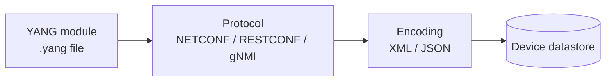
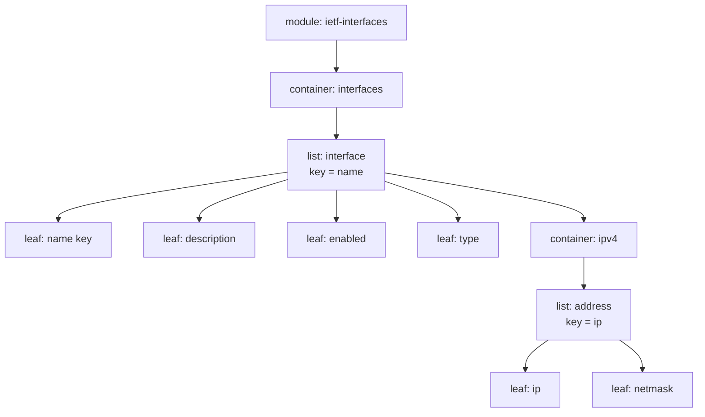
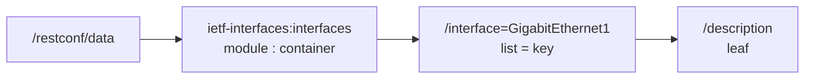

# T14 — YANG Data Models
**Blueprint 3.8, 5.11 · CBT: Full · 15 min** · Skip: writing YANG

## 1. What YANG is
- **Y**et **A**nother **N**ext **G**eneration — a **data modeling language** (RFC 7950) describing config data, state data, RPCs, and notifications.
- It is the **schema**, not the transport or encoding.
- Consumed by NETCONF, RESTCONF, gNMI; data is encoded as **XML or JSON**.
- Model families: **IETF** (ietf-interfaces), **OpenConfig** (vendor-neutral), **Native** (Cisco-IOS-XE-native, vendor-specific).
- Tools: `pyang` (validate/tree), YANG Suite, `pyang -f tree`.



## 2. Building blocks (nodes)
- **module** — top-level container of the model (`module ietf-interfaces { ... }`), has `namespace`, `prefix`.
- **container** — groups related nodes; no value itself. Like a JSON object.
- **list** — a sequence of entries, each identified by a **key**. Like a JSON array of objects.
- **leaf** — a single value with a type (string, int, boolean, enumeration). The actual data.
- **leaf-list** — a list of simple values.
- **key** — leaf(s) that uniquely identify a list entry.
- Also: `typedef`, `grouping`/`uses`, `choice`, `rpc`, `notification`, `config false` (read-only operational state).



## 3. Reading a YANG snippet
```yang
module ietf-interfaces {
  namespace "urn:ietf:params:xml:ns:yang:ietf-interfaces";
  prefix if;

  container interfaces {
    list interface {
      key "name";
      leaf name        { type string; }
      leaf description { type string; }
      leaf enabled     { type boolean; default "true"; }
    }
  }
}
```
- Read it top-down: module → container `interfaces` → list `interface` (key `name`) → leaves.
- Tree view (`pyang -f tree`):
```
module: ietf-interfaces
  +--rw interfaces
     +--rw interface* [name]
        +--rw name         string
        +--rw description? string
        +--rw enabled?     boolean
```
  - `rw` = config (read-write), `ro` = state (read-only), `*` = list, `?` = optional, `[name]` = key.

## 4. YANG → RESTCONF path (exam skill)
Pattern: `https://<host>/restconf/data/<module>:<top-container>/<list>=<key-value>/<leaf>`
- Prefix the **first** node with `module-name:`; children don't repeat it (unless module changes).
- Lists are addressed `listname=keyvalue` (multiple keys comma-separated; special chars URL-encoded, e.g. `GigabitEthernet1/0/1` → `GigabitEthernet1%2F0%2F1`).

Example: description of interface GigabitEthernet1:
```
GET /restconf/data/ietf-interfaces:interfaces/interface=GigabitEthernet1/description
```


### Same data, three encodings
| XML (NETCONF) | JSON (RESTCONF) |
|---|---|
| `<interface><name>Gi1</name><enabled>true</enabled></interface>` | `{"ietf-interfaces:interface":{"name":"Gi1","enabled":true}}` |
- JSON top key is `module:node` (RFC 7951).

## 5. Config vs operational
- `config true` (default) → in running/startup datastore; writable.
- `config false` → operational state (counters, oper-status); read-only, retrieved via `get` / `/restconf/data` or `/restconf/data` with `ietf-interfaces:interfaces-state`.
- Example: `admin` enabled (config) vs `oper-status` (state).

## 6. Exam tips
- Container = group; list = multiple entries with key; leaf = value.
- "What uniquely identifies a list entry?" → key.
- Build the path: module:container/list=key/leaf.
- YANG ≠ protocol ≠ encoding. YANG is the schema only.
