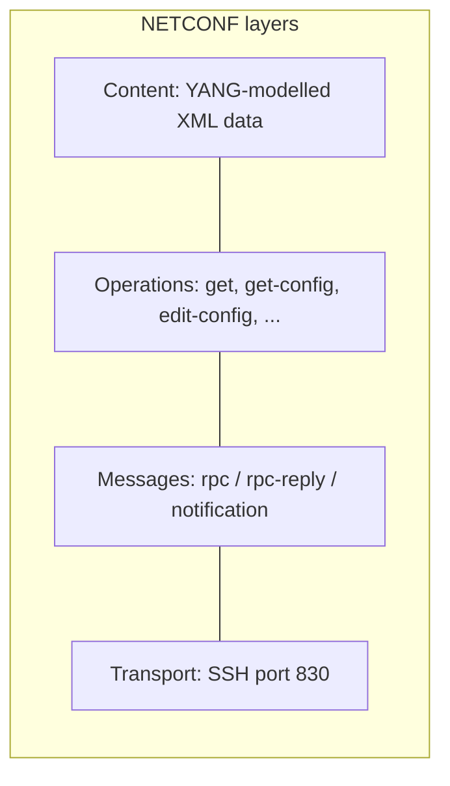
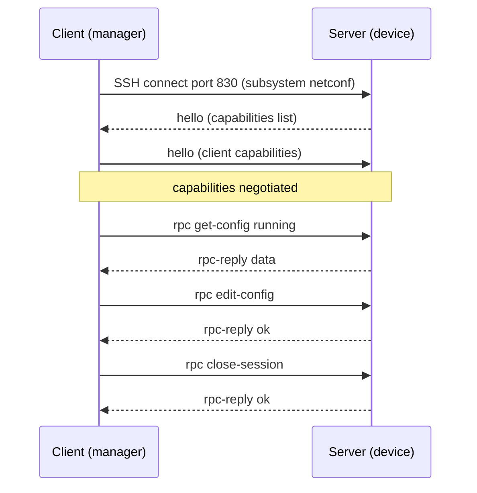
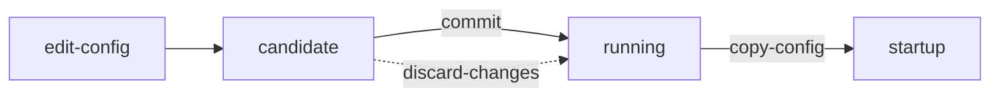

# T15 — NETCONF
**Blueprint 3.8, 5.10 · CBT: Full · 15 min** · Skip: full ncclient scripts

## 1. Essentials
- **NETCONF** (RFC 6241): network config protocol, **model-driven (YANG)**.
- Transport: **SSH, TCP port 830** (subsystem `netconf`). Encoding: **XML** only.
- Layers: Transport (SSH) → Messages (RPC) → Operations → Content (YANG-modelled XML).
- Transactional: supports **candidate datastore, commit, rollback, locks** → atomic multi-device changes.



## 2. Session flow


## 3. Datastores
| Datastore | Meaning |
|---|---|
| **running** | Active configuration on the device |
| **candidate** | Scratch/staging config; apply with `commit` (capability :candidate) |
| **startup** | Config loaded at boot (capability :startup; copy running → startup to persist) |
- Operational (state) data is only reachable via `<get>`, not `<get-config>`.



## 4. Operations
| Operation | What it does |
|---|---|
| `<get>` | Retrieve running config **and** operational state |
| `<get-config>` | Retrieve config only from a named datastore |
| `<edit-config>` | Change config (operation attr: merge, replace, create, delete, remove) |
| `<copy-config>` | Copy one datastore to another |
| `<delete-config>` | Delete a datastore (not running) |
| `<lock>` / `<unlock>` | Prevent concurrent edits |
| `<commit>` | Promote candidate → running |
| `<discard-changes>` | Revert candidate to running |
| `<close-session>` | Graceful end |
| `<kill-session>` | Force-end another session |

- **get vs get-config**: get = config + state; get-config = config only.
- `edit-config` default operation is **merge**.

## 5. Message examples
RPC request:
```xml
<rpc message-id="101" xmlns="urn:ietf:params:xml:ns:netconf:base:1.0">
  <get-config>
    <source><running/></source>
    <filter type="subtree">
      <interfaces xmlns="urn:ietf:params:xml:ns:yang:ietf-interfaces"/>
    </filter>
  </get-config>
</rpc>
```
edit-config:
```xml
<rpc message-id="102" xmlns="urn:ietf:params:xml:ns:netconf:base:1.0">
  <edit-config>
    <target><running/></target>
    <config>
      <interfaces xmlns="urn:ietf:params:xml:ns:yang:ietf-interfaces">
        <interface>
          <name>GigabitEthernet2</name>
          <description>uplink</description>
          <enabled>true</enabled>
        </interface>
      </interfaces>
    </config>
  </edit-config>
</rpc>
```
- `message-id` ties `rpc-reply` to the request. Reply success = `<ok/>`; failure = `<rpc-error>`.
- **Filters**: subtree (common) or XPath (capability).

## 6. Python (ncclient) — know the shape, not the detail
```python
from ncclient import manager
with manager.connect(host="10.0.0.1", port=830, username="u", password="p",
                     hostkey_verify=False) as m:
    reply = m.get_config(source="running", filter=("subtree", filt))
    m.edit_config(target="running", config=cfg)
```
- Enable on IOS XE: `netconf-yang` (global config).

## 7. Exam tips
- Port **830**, SSH, XML.
- get vs get-config difference; candidate requires commit.
- NETCONF = RPC over SSH; RESTCONF = REST over HTTPS (see T16).
