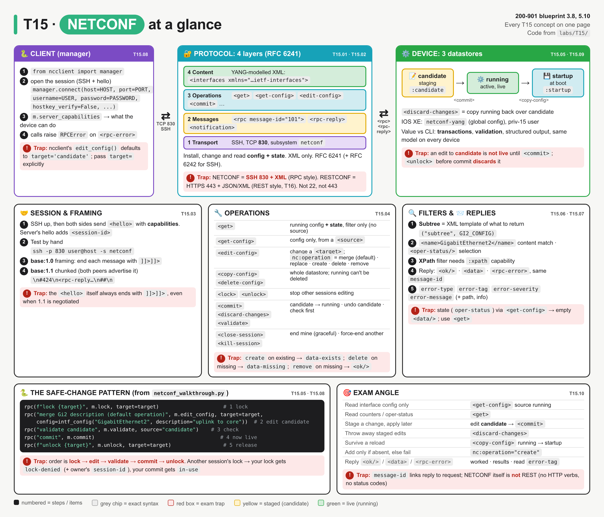
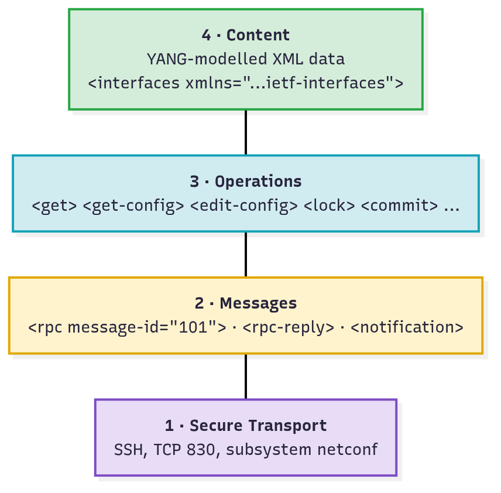
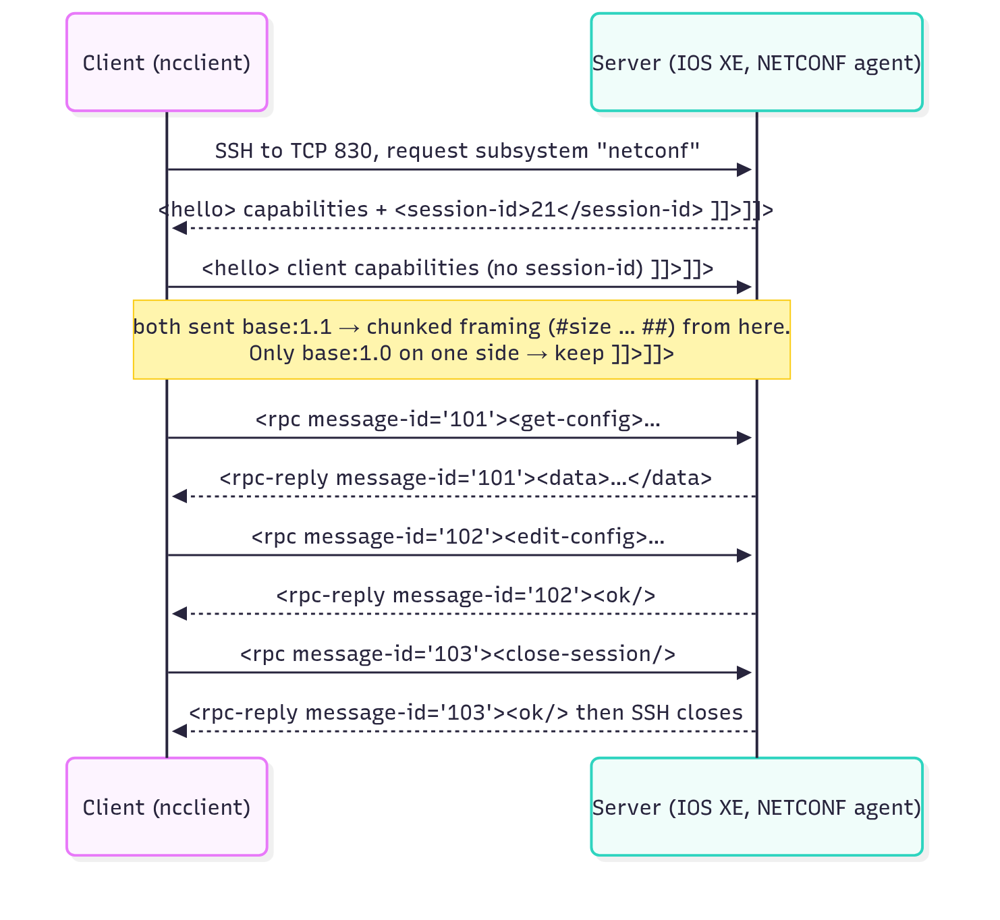
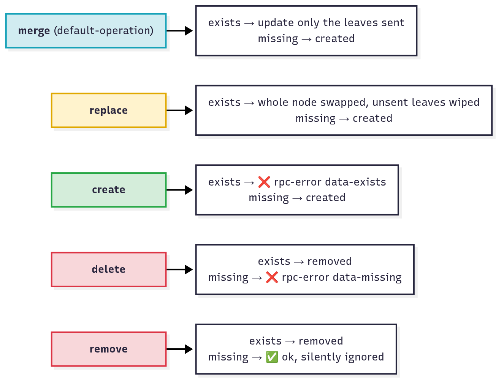
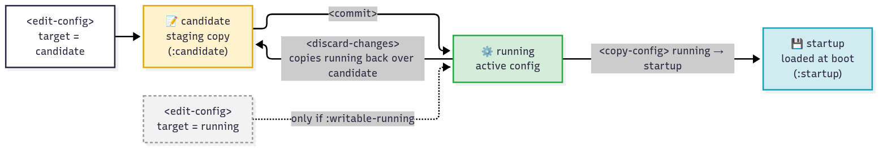
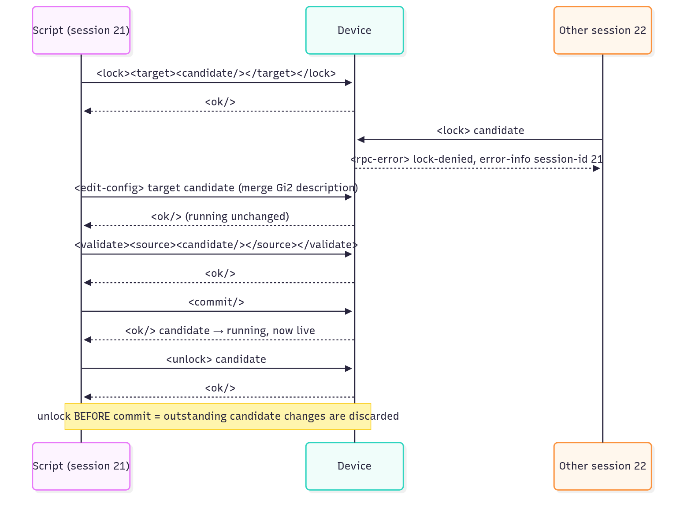
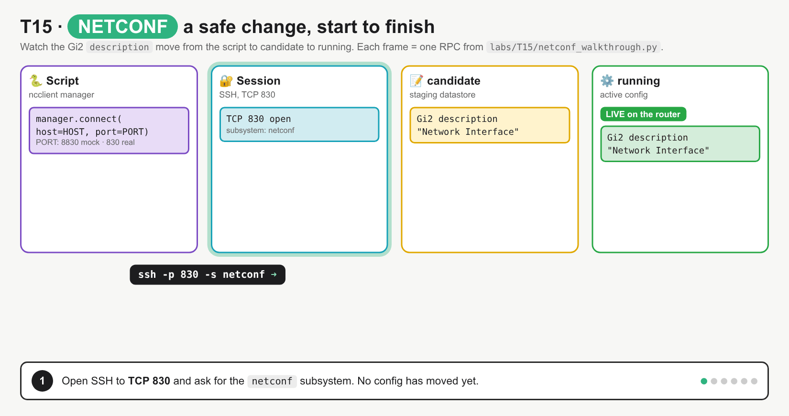
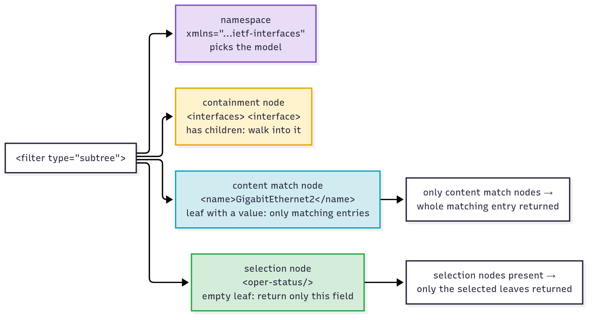
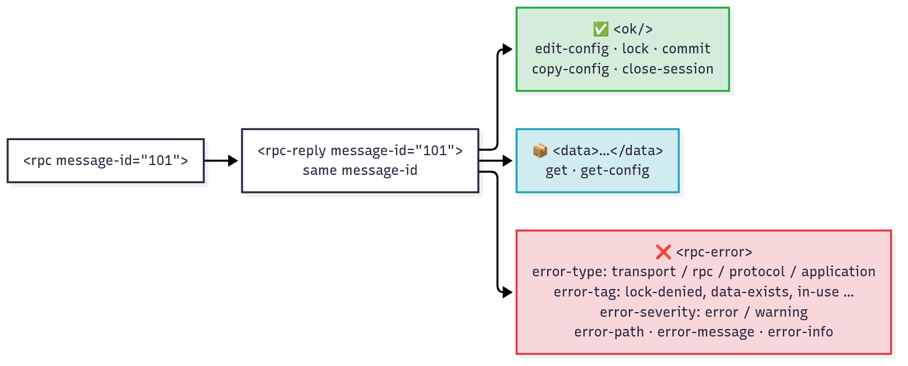

# T15 · NETCONF

> Owner: **Bob** · Blueprint: **3.8, 5.10** · CBT coverage: **Full** · Learn by 2026-10-10 · Teach-back 2026-10-12



*Every T15 concept on one page. The top row is the system map (client → SSH 830 → device datastores); the panels below are session, operations, filters/replies, the safe-change code and the exam angle. Concept IDs are in each header, numbers are steps or items, and red boxes are exam traps.*

## TL;DR (teach-back card)

- **NETCONF = RPC over SSH, TCP 830, XML only** (RFC 6241). Four layers: Transport (SSH) → Messages (`<rpc>`/`<rpc-reply>`/`<notification>`) → Operations (`<get>`, `<edit-config>` …) → Content (YANG-modelled XML). The session opens with a `<hello>` exchange of **capabilities**.
- **Pick the operation:** `<get>` = config **+ state**; `<get-config>` = config only from a `<source>`; `<edit-config>` changes a `<target>` (merge by default, or replace / create / delete / remove). Replies are `<ok/>`, `<data>` or `<rpc-error>` (read `error-tag`).
- **Datastores:** running (live), candidate (staging, needs `<commit>`), startup (boot; `<copy-config>` running → startup). The safe change is **lock → edit-config candidate → validate → commit → unlock**.
- **Trap:** an edit to candidate returns `<ok/>` but is **not live** until `<commit>`. `<unlock>` (or a dropped session) before commit **discards** it.

## Concepts

Every section below explains one part of the same NETCONF session. Read it once first.

- `labs/T15/mock_netconf.py` is a fake IOS XE router that speaks real NETCONF over SSH (paramiko). It listens on `127.0.0.1:8830`, has running/candidate/startup datastores and the `ietf-interfaces` model, and returns RFC 6241 `<rpc-error>`s. Like IOS XE with `netconf-yang feature candidate-datastore`, it advertises `:candidate` but **not** `:writable-running`.
- `labs/T15/netconf_walkthrough.py` (below) is the **reference program**. It's one ncclient script that connects, reads, locks, edits, commits and saves, and it triggers the common errors on purpose.
- `labs/T15/raw_framing.py` does the same thing with no ncclient, so you can see the raw bytes (`]]>]]>`, `#424`, `##`).
- To run: `bash labs/T15/run_lab.sh` (needs `ncclient`; see [Examples](#examples)). It starts the mock device, runs the client, then stops the device.

**`labs/T15/netconf_walkthrough.py`**

```python
"""T15 reference program: one NETCONF session that uses every operation on the exam.

Start the mock device first:  python3 labs/T15/mock_netconf.py
Then in another terminal:     python3 labs/T15/netconf_walkthrough.py
Or both at once:              bash labs/T15/run_lab.sh

Point it at a real IOS XE router with NETCONF_HOST / NETCONF_PORT / NETCONF_USER / NETCONF_PASS.
"""
import os

from lxml import etree
from ncclient import manager
from ncclient.operations import RPCError

HOST = os.environ.get("NETCONF_HOST", "127.0.0.1")
PORT = int(os.environ.get("NETCONF_PORT", "8830"))        # real devices: 830
USER = os.environ.get("NETCONF_USER", "admin")
PASSWORD = os.environ.get("NETCONF_PASS", "C1sco12345")

IF_NS = "urn:ietf:params:xml:ns:yang:ietf-interfaces"

# Subtree filters: an XML template of what to return
GI2_CONFIG = f"""
<interfaces xmlns="{IF_NS}">
  <interface>
    <name>GigabitEthernet2</name>
  </interface>
</interfaces>"""

GI2_STATE = f"""
<interfaces-state xmlns="{IF_NS}">
  <interface>
    <name>GigabitEthernet2</name>
    <oper-status/>
    <statistics><in-octets/></statistics>
  </interface>
</interfaces-state>"""

DESCRIPTIONS = f"""
<interfaces xmlns="{IF_NS}">
  <interface><name/><description/></interface>
</interfaces>"""


def intf_config(name, operation=None, **leaves):
    """Build an <edit-config> <config> payload for one ietf-interfaces entry."""
    op = f' xmlns:nc="urn:ietf:params:xml:ns:netconf:base:1.0" nc:operation="{operation}"' if operation else ""
    body = "".join(f"<{k}>{v}</{k}>" for k, v in leaves.items())
    if "type" in leaves:
        body = body.replace("<type>", '<type xmlns:ianaift="urn:ietf:params:xml:ns:yang:iana-if-type">')
    return (f'<config><interfaces xmlns="{IF_NS}"><interface{op}>'
            f"<name>{name}</name>{body}</interface></interfaces></config>")


def pretty(xml):
    return etree.tostring(etree.fromstring(xml.encode()), pretty_print=True).decode().rstrip()


def rpc(label, call, *args, **kwargs):
    """Run one ncclient call; print <ok/>, the <data>, or the <rpc-error> fields."""
    print(f"\n>>> {label}")
    try:
        reply = call(*args, **kwargs)
    except RPCError as err:                       # ncclient raises on <rpc-error> by default
        print(f"<<< rpc-error  type={err.type}  tag={err.tag}  severity={err.severity}")
        print(f"    message: {err.message}")
        if err.path:
            print(f"    path:    {err.path}")
        if err.info:                              # <error-info> children, e.g. session-id of the lock owner
            info = etree.fromstring(err.info.encode())
            print("    info:   ", " ".join(f"{etree.QName(c).localname}={c.text}" for c in info))
        return err
    if hasattr(reply, "data_xml"):                # get / get-config -> GetReply
        print(pretty(reply.data_xml))
    else:
        print("<<< ok" if reply.ok else f"<<< {reply.xml}")
    return reply


def descriptions(m, source):
    reply = m.get_config(source=source, filter=("subtree", DESCRIPTIONS))
    rows = reply.data.findall(f".//{{{IF_NS}}}interface")
    return {r.findtext(f"{{{IF_NS}}}name"): r.findtext(f"{{{IF_NS}}}description") for r in rows}


def main():
    print("== 1. Connect: SSH, subsystem netconf, <hello> ==")
    m = manager.connect(host=HOST, port=PORT, username=USER, password=PASSWORD,
                        hostkey_verify=False, look_for_keys=False, allow_agent=False)
    caps = m.server_capabilities
    print(f"session-id {m.session_id}; server sent {len(list(caps))} capabilities")
    for short in (":base:1.0", ":base:1.1", ":candidate", ":writable-running", ":startup",
                  ":validate", ":xpath"):
        print(f"  {short:<18} {short in caps}")
    print("  model:", next(c for c in caps if "ietf-interfaces" in c))
    target = "candidate" if ":candidate" in caps else "running"
    print(f"edits will target: {target}")

    print("\n== 2. Read: get-config (config only) vs get (config + state) ==")
    rpc("get-config source=running, filter Gi2", m.get_config, source="running",
        filter=("subtree", GI2_CONFIG))
    rpc("get-config source=running, filter interfaces-state", m.get_config, source="running",
        filter=("subtree", GI2_STATE))
    rpc("get, filter interfaces-state Gi2", m.get, filter=("subtree", GI2_STATE))

    print("\n== 3. Lock the target so nobody else edits it ==")
    rpc(f"lock {target}", m.lock, target=target)
    other = manager.connect(host=HOST, port=PORT, username=USER, password=PASSWORD,
                            hostkey_verify=False, look_for_keys=False, allow_agent=False)
    rpc(f"(session {other.session_id}) lock {target}", other.lock, target=target)
    other.close_session()

    if target == "candidate":
        print("\n== 4. discard-changes: throw away candidate edits ==")
        rpc("edit-config candidate: Gi3 description", m.edit_config, target="candidate",
            config=intf_config("GigabitEthernet3", description="temp test"))
        print("candidate Gi3:", descriptions(m, "candidate")["GigabitEthernet3"])
        rpc("discard-changes", m.discard_changes)
        print("candidate Gi3:", descriptions(m, "candidate")["GigabitEthernet3"])

    print(f"\n== 5. edit-config on {target}: operations merge / create / delete / remove ==")
    rpc("merge Gi2 description (default operation)", m.edit_config, target=target,
        config=intf_config("GigabitEthernet2", description="uplink to core"))
    print("running   Gi2:", descriptions(m, "running")["GigabitEthernet2"])
    print(f"{target:<9} Gi2:", descriptions(m, target)["GigabitEthernet2"])
    rpc("create Loopback100", m.edit_config, target=target,
        config=intf_config("Loopback100", "create", description="mgmt loopback",
                           type="ianaift:softwareLoopback", enabled="true"))
    rpc("create Loopback100 again", m.edit_config, target=target,
        config=intf_config("Loopback100", "create", description="mgmt loopback",
                           type="ianaift:softwareLoopback", enabled="true"))
    rpc("delete Loopback99 (does not exist)", m.edit_config, target=target,
        config=intf_config("Loopback99", "delete"))
    rpc("remove Loopback99 (does not exist)", m.edit_config, target=target,
        config=intf_config("Loopback99", "remove"))
    rpc("merge Gi3 enabled=yes (bad value)", m.edit_config, target=target,
        config=intf_config("GigabitEthernet3", enabled="yes"))
    if ":writable-running" not in caps:
        rpc("edit-config target=running", m.edit_config, target="running",
            config=intf_config("GigabitEthernet2", description="direct"))

    if target == "candidate":
        print("\n== 6. validate, commit, then unlock ==")
        rpc("validate candidate", m.validate, source="candidate")
        rpc("commit", m.commit)
    rpc(f"unlock {target}", m.unlock, target=target)
    print("running:", descriptions(m, "running"))
    rpc("get, filter Loopback100 state", m.get, filter=("subtree", GI2_STATE.replace(
        "GigabitEthernet2", "Loopback100")))

    print("\n== 7. Save and close ==")
    if ":startup" in caps:
        rpc("copy-config running -> startup", m.copy_config, source="running", target="startup")
    rpc("close-session", m.close_session)


if __name__ == "__main__":
    main()
```

**Real output** (`bash labs/T15/run_lab.sh`):

```text
== 1. Connect: SSH, subsystem netconf, <hello> ==
session-id 21; server sent 8 capabilities
  :base:1.0          True
  :base:1.1          True
  :candidate         True
  :writable-running  False
  :startup           True
  :validate          True
  :xpath             False
  model: urn:ietf:params:xml:ns:yang:ietf-interfaces?module=ietf-interfaces&revision=2014-05-08
edits will target: candidate

== 2. Read: get-config (config only) vs get (config + state) ==

>>> get-config source=running, filter Gi2
<data xmlns="urn:ietf:params:xml:ns:netconf:base:1.0">
  <interfaces xmlns="urn:ietf:params:xml:ns:yang:ietf-interfaces">
    <interface>
      <name>GigabitEthernet2</name>
      <description>Network Interface</description>
      <type xmlns:ianaift="urn:ietf:params:xml:ns:yang:iana-if-type">ianaift:ethernetCsmacd</type>
      <enabled>true</enabled>
    </interface>
  </interfaces>
</data>

>>> get-config source=running, filter interfaces-state
<data xmlns="urn:ietf:params:xml:ns:netconf:base:1.0"/>

>>> get, filter interfaces-state Gi2
<data xmlns="urn:ietf:params:xml:ns:netconf:base:1.0">
  <interfaces-state xmlns="urn:ietf:params:xml:ns:yang:ietf-interfaces">
    <interface>
      <name>GigabitEthernet2</name>
      <oper-status>up</oper-status>
      <statistics>
        <in-octets>3668422</in-octets>
      </statistics>
    </interface>
  </interfaces-state>
</data>

== 3. Lock the target so nobody else edits it ==

>>> lock candidate
<<< ok

>>> (session 22) lock candidate
<<< rpc-error  type=protocol  tag=lock-denied  severity=error
    message: Lock failed, lock is already held
    info:    session-id=21

== 4. discard-changes: throw away candidate edits ==

>>> edit-config candidate: Gi3 description
<<< ok
candidate Gi3: temp test

>>> discard-changes
<<< ok
candidate Gi3: Network Interface

== 5. edit-config on candidate: operations merge / create / delete / remove ==

>>> merge Gi2 description (default operation)
<<< ok
running   Gi2: Network Interface
candidate Gi2: uplink to core

>>> create Loopback100
<<< ok

>>> create Loopback100 again
<<< rpc-error  type=application  tag=data-exists  severity=error
    message: object already exists
    path:    /if:interfaces/if:interface[if:name='Loopback100']

>>> delete Loopback99 (does not exist)
<<< rpc-error  type=application  tag=data-missing  severity=error
    message: object does not exist
    path:    /if:interfaces/if:interface[if:name='Loopback99']

>>> remove Loopback99 (does not exist)
<<< ok

>>> merge Gi3 enabled=yes (bad value)
<<< rpc-error  type=application  tag=invalid-value  severity=error
    message: "yes" is not a valid value.
    path:    /if:interfaces/if:interface[if:name='GigabitEthernet3']/if:enabled

>>> edit-config target=running
<<< rpc-error  type=protocol  tag=operation-not-supported  severity=error
    message: running is not writable (:writable-running not advertised); edit the candidate

== 6. validate, commit, then unlock ==

>>> validate candidate
<<< ok

>>> commit
<<< ok

>>> unlock candidate
<<< ok
running: {'GigabitEthernet1': "MANAGEMENT INTERFACE - DON'T TOUCH ME", 'GigabitEthernet2': 'uplink to core', 'GigabitEthernet3': 'Network Interface', 'Loopback0': 'router-id', 'Loopback100': 'mgmt loopback'}

>>> get, filter Loopback100 state
<data xmlns="urn:ietf:params:xml:ns:netconf:base:1.0">
  <interfaces-state xmlns="urn:ietf:params:xml:ns:yang:ietf-interfaces">
    <interface>
      <name>Loopback100</name>
      <oper-status>up</oper-status>
      <statistics>
        <in-octets>9171055</in-octets>
      </statistics>
    </interface>
  </interfaces-state>
</data>

== 7. Save and close ==

>>> copy-config running -> startup
<<< ok

>>> close-session
<<< ok
```

### T15.01 · What NETCONF is

**Must cover:**

- [x] RFC 6241 protocol to install, change and read device config/state
- [x] XML-encoded messages over SSH, default port 830

**Notes:**

- **NETCONF** (Network Configuration Protocol, RFC 6241) is a protocol for a client to **install, change and read** device configuration and **read** operational state. It is **model-driven**: the data follows a YANG model ([T14](T14-yang-data-models.md)).
- Roles: the **client** (manager: your script, ncclient, Ansible, NSO) and the **server** (agent on the device).
- **Encoding: XML only.** **Transport: SSH, TCP port 830**, SSH subsystem `netconf` (RFC 6242).
  - In the program, `PORT` defaults to `8830` only because the mock runs without root. Real devices listen on **830**.
- **RPC style, not REST.** Every request is an `<rpc>` with an operation inside it. There are no HTTP verbs, URIs or status codes; those belong to RESTCONF ([T16](T16-restconf.md)).

| | NETCONF | RESTCONF (T16) | CLI over SSH |
|---|---|---|---|
| Transport / port | SSH, **830** | HTTPS, 443 | SSH, 22 |
| Encoding | **XML** | XML or JSON | free text |
| Style | RPC (`<rpc>` + operation) | REST (GET/POST/PUT/PATCH/DELETE) | screen-scraping |
| Datastores / candidate / lock | yes | running only, no lock | n/a |

### T15.02 · Layers

**Must cover:**

- [x] Content: config/state data (YANG-modelled)
- [x] Operations: get, get-config, edit-config…
- [x] Messages: <rpc>, <rpc-reply>, <notification>
- [x] Secure transport: SSH

**Notes:**

- RFC 6241 splits NETCONF into four layers. Exam questions name a layer and ask what lives there (or show an XML element and ask its layer).



*Bottom up: SSH carries messages, a message wraps one operation, the operation carries YANG-modelled content.*

| Layer | What it is | In the program |
|---|---|---|
| 4 · **Content** | the config/state data itself, shaped by a YANG model | `<interfaces xmlns="urn:ietf:params:xml:ns:yang:ietf-interfaces">` in `GI2_CONFIG`, `intf_config()` |
| 3 · **Operations** | what to do: `<get>`, `<get-config>`, `<edit-config>`, `<lock>`, `<commit>` … | each `m.get_config()`, `m.edit_config()`, `m.commit()` call |
| 2 · **Messages** | the envelope: `<rpc message-id="…">`, `<rpc-reply>`, `<notification>` (event push, RFC 5277) | ncclient builds the `<rpc>`; `rpc()` reads the `<rpc-reply>` |
| 1 · **Secure Transport** | SSH (TCP 830). RFC 6241 also allows TLS, but SSH is mandatory and is what the exam means | `manager.connect(host=HOST, port=PORT, …)` |

- `error-type` in an `<rpc-error>` names the failing layer: `transport`, `rpc` (messages), `protocol` (operations), `application` (content). In the output, the lock clash is `type=protocol`; the bad `enabled=yes` value is `type=application`.

### T15.03 · Session

**Must cover:**

- [x] Client and server exchange <hello> with their capabilities (supported models/features)
- [x] Test manually: ssh -p 830 user@host -s netconf
- [x] Message framing: ]]>]]> (1.0) vs chunked framing (1.1)

**Notes:**

- **Session start:** SSH connects to TCP 830 and requests the `netconf` **subsystem**. Then **both sides send `<hello>` at once**, each listing its **capabilities** (URIs).
  - The **server's** hello also carries the `<session-id>`. The client's hello has none.
  - Capabilities = base protocol versions (`urn:ietf:params:netconf:base:1.0`, `…base:1.1`), optional features (`urn:ietf:params:netconf:capability:candidate:1.0`, `:startup`, `:validate`, `:xpath`, `:writable-running`, `:rollback-on-error`, `:confirmed-commit`) and the supported **YANG models** (`…ietf-interfaces?module=ietf-interfaces&revision=2014-05-08`).
  - In the program, section 1 prints `m.server_capabilities` with ncclient's short names (`":candidate" in caps`), and picks `target` from it.
  - On IOS XE 17.x, YANG 1.1 modules are listed in `ietf-yang-library` (`<get>` on `modules-state`) rather than all in `<hello>`. ⚠ verify per release.



*Hello exchange first, then numbered rpc / rpc-reply pairs, then close-session. Which framing is used depends on what both hellos advertised.*

- **Test by hand**, with no Python at all:

```bash
ssh -p 830 admin@10.10.20.48 -s netconf
```

  - The server's `<hello>` prints straight away. Paste a client hello ending with `]]>]]>`, then an `<rpc>`, also ending with `]]>]]>` (full commands in [Examples §2](#2-hello-by-hand-ssh--s-netconf)).
- **Framing** marks where one XML message ends on the SSH stream (RFC 6242):

| | base:1.0 | base:1.1 (chunked) |
|---|---|---|
| Used when | either side only offers base:1.0 | **both** hellos advertise base:1.1 |
| Format | message then `]]>]]>` | `\n#<bytes>\n<data>` … then `\n##\n` |
| `<hello>` itself | ends with `]]>]]>` | **still** ends with `]]>]]>` |

- Real bytes from `raw_framing.py` (shown in full in Examples): the reply arrived as `'\n#424\n<rpc-reply … </rpc-reply>\n##\n'`, a single 424-byte chunk.

### T15.04 · Operations

**Must cover:**

- [x] <get>: config + operational state
- [x] <get-config>: config from a datastore (source)
- [x] <edit-config>: change a datastore (target); operation attribute merge / replace / create / delete / remove
- [x] <copy-config>, <delete-config>, <lock>/<unlock>
- [x] <commit>, <discard-changes>, <validate>, <close-session>, <kill-session>

**Notes:**

| Operation | What it does | Key parameter | In the program |
|---|---|---|---|
| `<get>` | running config **and** operational state | `filter` only (no source) | section 2: `GI2_STATE` returns `oper-status`, `in-octets` |
| `<get-config>` | config only, from one datastore | `source` + optional `filter` | section 2 and `descriptions()` |
| `<edit-config>` | change a datastore | `target`, `config`, `default-operation`, `test-option`, `error-option` | section 5 |
| `<copy-config>` | copy a whole datastore (or a `<config>`) onto another | `source`, `target` | section 7: running → startup |
| `<delete-config>` | delete a whole datastore; **running cannot be deleted** | `target` | not used |
| `<lock>` / `<unlock>` | stop other sessions changing a datastore | `target` | sections 3 and 6 |
| `<commit>` | set running = candidate (`:candidate`) | none (`<confirmed/>` with `:confirmed-commit`) | section 6 |
| `<discard-changes>` | reset candidate back to running | none | section 4 |
| `<validate>` | check a datastore is valid without applying it (`:validate`) | `source` | section 6 |
| `<close-session>` | end **my** session gracefully, releasing my locks | none | section 7 |
| `<kill-session>` | force-end **another** session (aborts its work, frees its locks) | `session-id` | see Q7 |

- **get vs get-config:** state data (counters, oper-status) is **only** in `<get>`. In the output, `get-config … filter interfaces-state` returns an empty `<data/>`, while `get` returns `oper-status up`.
- **`<edit-config>` `operation` attribute.** Put it on the element you want to act on, with the base namespace: `nc:operation="create"` and `xmlns:nc="urn:ietf:params:xml:ns:netconf:base:1.0"` (see `intf_config()`).



*Same five verbs, two cases. Only create and delete fail, and they fail in opposite cases.*

  - **merge** (the default): combine with what exists; only the leaves you send change. The Gi2 description merge kept its `type` and `enabled`.
  - **replace**: the sent node replaces the existing one entirely; leaves you didn't send are gone.
  - **create**: only if absent, else `data-exists` (the output's "create Loopback100 again").
  - **delete**: only if present, else `data-missing` ("delete Loopback99").
  - **remove**: delete if present; if absent, silently `<ok/>` ("remove Loopback99").
- **`default-operation`** applies when an element has no `operation` attribute: `merge` (default), `replace` (the whole `<config>` replaces the target, e.g. restoring a backup), `none` (touch only elements with an explicit `operation`).
- **`error-option`**: `stop-on-error` (default), `continue-on-error`, `rollback-on-error` (needs `:rollback-on-error`). **`test-option`** (needs `:validate:1.1`): `test-then-set` (default), `set`, `test-only`.

### T15.05 · Datastores

**Must cover:**

- [x] running: active config
- [x] candidate: staging area, applied with <commit> (if capability supported)
- [x] startup: config loaded at boot

**Notes:**

| Datastore | Meaning | Capability | Write it with |
|---|---|---|---|
| **running** | active, live config. Always exists | `:writable-running` to edit it directly | `<edit-config>` (if writable) or `<commit>` |
| **candidate** | full scratch copy; changes do nothing until committed | `:candidate` | `<edit-config>`, then `<commit>` |
| **startup** | config loaded at boot | `:startup` | `<copy-config>` running → startup |



*Edits land in candidate (yellow). Only commit makes them live in running (green). discard-changes copies running back over candidate. Saving to startup is a separate copy-config.*

- With `:startup`, changes to running are **not** saved automatically; copy running → startup explicitly. (IOS XE also offers its own `cisco-ia:save-config` RPC.)
- **The candidate is shared** by all sessions, so lock it before editing (RFC 6241 §8.3.1). The GIF below shows the safe order with real RPCs from the program.



*Lock first so session 22 is refused; edit candidate; validate; commit (now live); unlock last.*



*Steps: SSH :830 → `<hello>` capabilities → `<lock>` candidate → `<edit-config>` candidate (running unchanged) → `<commit>` (now live) → `<unlock>`. Fixes the misconception that an `<edit-config>` `<ok/>` on candidate means the change is live.*

- Rules that the exam (and the mock) enforce, from RFC 6241:
  - **Lock held by someone else** → your `<lock>` gets `lock-denied`, with the owner's `<session-id>` in `error-info` (`info: session-id=21` in the output). A session-id of `0` means a non-NETCONF user holds it (e.g. CLI `configure terminal lock` on IOS XE).
  - A candidate that already has **uncommitted changes** can't be locked either.
  - `<commit>` while another session locks running or candidate → `in-use`.
  - **`<unlock>` candidate, or the session dying, discards outstanding candidate changes.** That's why unlock comes **after** commit (Examples §3, edit 2, shows this happening).
- **IOS XE specifics** (Programmability Configuration Guide 17.x):
  - The default is running-only with `:writable-running`. `netconf-yang feature candidate-datastore` adds candidate **and removes** `:writable-running`, so every change must go through candidate + commit. Switching mode restarts NETCONF/RESTCONF and drops sessions.
  - The mock copies this: `edit-config target=running` → `operation-not-supported`. The program checks `":candidate" in caps` so the same script also works on a running-only device.
  - Confirmed commit (`<commit><confirmed/>`, default 600 s timeout) auto-rolls back if a second confirming `<commit>` doesn't arrive in time. ⚠ verify per release.

### T15.06 · Filters

**Must cover:**

- [x] Subtree filter (XML template of what to return) or XPath filter

**Notes:**

- With no filter, `<get>`/`<get-config>` returns **everything**. A filter trims the reply.
- **Subtree filter** (default, `type="subtree"`) = an **XML template** shaped like the data, with only the parts you want:



*Four building blocks. The namespace picks the model, containment nodes walk down, content match nodes pick list entries, selection nodes pick fields.*

  - `GI2_CONFIG`: `<interfaces>` and `<interface>` are **containment** nodes, and `<name>GigabitEthernet2</name>` is a **content match**. Only content matches inside, so the **whole** Gi2 entry comes back (description, type, enabled).
  - `GI2_STATE` adds **selection** nodes `<oper-status/>` and `<statistics><in-octets/></statistics>`, so **only** those leaves come back.
  - `DESCRIPTIONS`: `<name/>` and `<description/>` are selection nodes, so every interface returns but with just two leaves.
  - An empty `<filter/>` returns nothing (not an error). The wrong `xmlns` returns nothing too.
- **XPath filter** (`type="xpath"`, `select="/if:interfaces/if:interface[if:name='GigabitEthernet2']"`) needs the **`:xpath`** capability. The mock prints `:xpath False`; IOS XE advertises it. ncclient form: `filter=("xpath", "/interfaces/interface[name='GigabitEthernet2']")` (⚠ verify namespace handling on the device).
- ncclient form for subtree: `filter=("subtree", GI2_CONFIG)`. It wraps the string in `<filter type="subtree">` for you.

The XML ncclient sends for the first call in section 2 (same shape as Bob's original example):

```xml
<rpc message-id="101" xmlns="urn:ietf:params:xml:ns:netconf:base:1.0">
  <get-config>
    <source><running/></source>
    <filter type="subtree">
      <interfaces xmlns="urn:ietf:params:xml:ns:yang:ietf-interfaces">
        <interface>
          <name>GigabitEthernet2</name>
        </interface>
      </interfaces>
    </filter>
  </get-config>
</rpc>
```

### T15.07 · Replies

**Must cover:**

- [x] <ok/> on success
- [x] <data> containing results
- [x] <rpc-error> with error-type, error-tag, error-severity, error-message

**Notes:**

- Every `<rpc>` gets one `<rpc-reply>` with the **same `message-id`** (ncclient uses `urn:uuid:…` ids; the raw script uses `101`, `102`). Other attributes on the `<rpc>` are echoed back too.



*Three possible bodies. ok = an action worked, data = a read worked, rpc-error = read the error-tag.*

| Reply body | When | Example from the output |
|---|---|---|
| `<ok/>` | successful action with nothing to return (edit-config, lock, commit, copy-config, close-session) | `<<< ok` after `commit` |
| `<data>…</data>` | `<get>` / `<get-config>` results | the Gi2 interface XML |
| `<rpc-error>` | it failed | `lock-denied`, `data-exists`, `data-missing`, `invalid-value`, `operation-not-supported` |

- `<rpc-error>` fields:
  - `error-type`: `transport` / `rpc` / `protocol` / `application` (the layer).
  - `error-tag`: the condition. Know `in-use`, `invalid-value`, `lock-denied`, `data-exists`, `data-missing`, `access-denied`, `operation-not-supported`, `operation-failed`, `missing-element`, `unknown-element`, `malformed-message`.
  - `error-severity`: `error` or `warning`.
  - `error-message`: human text. Optional extras: `error-app-tag`, `error-path` (XPath to the bad node, e.g. `…[if:name='GigabitEthernet3']/if:enabled`), `error-info` (e.g. `<session-id>`).
- Reading a raw error reply (the shape of the mock's `data-exists` reply):

```xml
<rpc-reply xmlns="urn:ietf:params:xml:ns:netconf:base:1.0" message-id="104">
  <rpc-error>
    <error-type>application</error-type>
    <error-tag>data-exists</error-tag>
    <error-severity>error</error-severity>
    <error-path xmlns:if="urn:ietf:params:xml:ns:yang:ietf-interfaces">/if:interfaces/if:interface[if:name='Loopback100']</error-path>
    <error-message xml:lang="en">object already exists</error-message>
  </rpc-error>
</rpc-reply>
```

  - Read it as: content layer (`application`) refused a `create` because Loopback100 is already there. Fix: use `merge`, or check first.

### T15.08 · Python ncclient

**Must cover:**

- [x] from ncclient import manager
- [x] m = manager.connect(host=..., port=830, username=..., password=..., hostkey_verify=False)
- [x] m.get_config(source="running", filter=("subtree", f)); m.edit_config(target="running", config=xml)
- [x] m.server_capabilities lists capabilities

**Notes:**

- `from ncclient import manager`, then `manager.connect(...)` opens SSH, requests the subsystem and does the hello. It returns a `Manager` (`m`).
  - `hostkey_verify=False` skips checking the device's SSH host key against `known_hosts` (lab only). `look_for_keys=False, allow_agent=False` force password auth.
  - `m.session_id` is the server's session-id; `m.server_capabilities` is the capability list (supports `":candidate" in caps`).
- Method ↔ operation (all in the program):

| ncclient | NETCONF |
|---|---|
| `m.get(filter=...)` | `<get>` |
| `m.get_config(source="running", filter=("subtree", f))` | `<get-config>` |
| `m.edit_config(target="candidate", config=xml)` | `<edit-config>` (`config` must be a `<config>` element; see `intf_config()`) |
| `m.lock(target=...)` / `m.unlock(target=...)` / `with m.locked("candidate"):` | `<lock>` / `<unlock>` |
| `m.commit()`, `m.discard_changes()`, `m.validate(source="candidate")` | `<commit>`, `<discard-changes>`, `<validate>` |
| `m.copy_config(source="running", target="startup")` | `<copy-config>` |
| `m.close_session()`, `m.kill_session(session_id)` | `<close-session>`, `<kill-session>` |

- Replies: `reply.ok` (True on `<ok/>`), `reply.xml` (raw string), and for get/get-config `reply.data_xml` (string) and `reply.data` (lxml element, used by `descriptions()`).
- Errors: by default an `<rpc-error>` **raises** `ncclient.operations.RPCError`, with `.type .tag .severity .message .path .info` (exactly what `rpc()` prints).
- Gotcha: ncclient's `edit_config()` **defaults to `target='candidate'`**. Always pass `target=` explicitly.
- Bob's original "know the shape" snippet, still the exam minimum:

```python
from ncclient import manager

with manager.connect(host="10.0.0.1", port=830, username="u", password="p",
                     hostkey_verify=False) as m:
    reply = m.get_config(source="running", filter=("subtree", filt))
    m.edit_config(target="running", config=cfg)
```

  - `with` closes the session at the end. `filt` and `cfg` are XML strings like `GI2_CONFIG` and `intf_config(...)`. `target="running"` only works if the device has `:writable-running`.

### T15.09 · Device setup and value

**Must cover:**

- [x] IOS XE: netconf-yang (global config)
- [x] Value vs CLI: transactions, validation, structured output, network-wide consistency

**Notes:**

- **Enable on IOS XE** (global config). NETCONF needs a **privilege 15** user:

```text
configure terminal
 username netconf-admin privilege 15 secret Str0ngPass!
 aaa new-model
 aaa authentication login default local
 aaa authorization exec default local
 netconf-yang
 netconf-yang feature candidate-datastore
end
show netconf-yang sessions
show netconf-yang datastores
```

  - `netconf-yang` alone turns NETCONF on (SSH 830). The processes can take up to about 90 s to start.
  - `aaa new-model` is optional, but if it's configured, AAA authentication **and** authorization must be set up too.
  - `netconf-yang feature candidate-datastore` is optional (see T15.05); leave it out for running-only with `:writable-running`.
  - Verify with `show netconf-yang sessions` (R/C/S flags = global locks on running/candidate/startup) and `show netconf-yang datastores`.
- **Value vs CLI:**

| CLI screen-scraping | NETCONF |
|---|---|
| line by line; a typo half-applies a change | **transactions**: an edit/commit applies fully or not at all (`rollback-on-error`, candidate + commit) |
| device only finds problems as each line runs | **validation** against the YANG model before applying (`<validate>`, `test-option`; the `invalid-value` reply) |
| free text, breaks when output format changes | **structured** XML that parses straight into code (`reply.data`) |
| per-vendor, per-platform syntax | **same model and operations on every device** → **network-wide consistency**: lock + candidate + confirmed-commit on many devices, run by an orchestrator such as NSO ([T25](T25-nso-cisco-modeling-labs.md)) |

### T15.10 · Exam angle

**Must cover:**

- [x] Pick the operation/datastore for a task; read an rpc-reply; know port 830 and SSH

**Notes:**

| Scenario | Answer |
|---|---|
| Read interface counters / oper-status | `<get>` (state data) |
| Read only the configured interfaces | `<get-config>` `<source><running/>` + subtree filter |
| Prepare a change now, apply it in the maintenance window | edit **candidate**, `<commit>` later |
| Abandon staged changes | `<discard-changes>` |
| Make the change survive a reload | `<copy-config>` running → startup |
| Stop a colleague's script editing while yours runs | `<lock>` (and expect `lock-denied` if they got there first) |
| A hung session holds the lock | `<kill-session>` with its session-id |
| Add a VLAN/interface only if absent; fail if it exists | `operation="create"` |
| Delete something; no error if already gone | `operation="remove"` |
| What port / transport / encoding? | **TCP 830**, **SSH** (subsystem `netconf`), **XML** |
| Which messages pair up? | `<rpc message-id="X">` ↔ `<rpc-reply message-id="X">` |
| Reply has `<rpc-error><error-tag>lock-denied` | another session holds the lock; `error-info` names its session-id |

- Reading output (blueprint 5.10): find the reply type first (`<ok/>` / `<data>` / `<rpc-error>`), then the YANG namespace (which model), then the leaves (`<name>`, `<enabled>`, `<oper-status>`).

## Exam traps

- **830, not 22 or 443.** NETCONF = SSH **830**, XML. RESTCONF = HTTPS **443**, XML or JSON. Plain CLI SSH = 22.
- **`<get>` vs `<get-config>`:** `<get>` = config + **state**, no source. `<get-config>` = config only, **needs `<source>`**. Counters via `<get-config>` → empty `<data/>`.
- **`<source>` vs `<target>`:** read operations take `source` (get-config, validate, copy-config's from), write operations take `target` (edit-config, lock, unlock, delete-config, copy-config's to).
- **Candidate `<ok/>` ≠ live.** Nothing changes on the device until `<commit>`.
- **Order:** lock → edit → (validate) → commit → unlock. **Unlock before commit discards** the edits (so does losing the session).
- **`<discard-changes>`** resets candidate from running. It never touches running.
- **`create` vs `merge`:** create fails with `data-exists` if present; merge just updates.
- **`delete` vs `remove`:** delete on missing data → `data-missing`; remove on missing data → `<ok/>`.
- **`replace`** wipes leaves you didn't send; **`merge`** keeps them. Merge is the default.
- **`<delete-config>`** can't target running. **`<kill-session>`** is for someone else's session; ending your own is `<close-session>`.
- **`lock-denied`** comes back on `<lock>`; **`in-use`** comes back on `<commit>`/edit when another session holds the lock.
- **Capabilities decide what's allowed:** no `:candidate` → no candidate/commit/discard; no `:writable-running` → can't edit running directly (IOS XE with candidate enabled); no `:xpath` → subtree filters only.
- **Framing:** `]]>]]>` = base:1.0; `#<size>` chunks ending `##` = base:1.1 (only when **both** advertise 1.1). The `<hello>` always uses `]]>]]>`.
- **`message-id`** ties a reply to its request; the server copies it back.
- **ncclient `edit_config()` default target is `candidate`**, not running.
- **Turning it on:** IOS XE `netconf-yang` in global config, and a privilege-15 user.

## Examples

### 1. Run the reference program

Needs Python 3 and `ncclient` (which brings `paramiko` and `lxml`). No DevNet sandbox needed.

```bash
python3 -m venv /tmp/t15-venv
/tmp/t15-venv/bin/pip install ncclient
PYTHON=/tmp/t15-venv/bin/python bash labs/T15/run_lab.sh                         # mock device + netconf_walkthrough.py
PYTHON=/tmp/t15-venv/bin/python bash labs/T15/run_lab.sh labs/T15/raw_framing.py # mock device + raw bytes
```

Or by hand, in two terminals:

```bash
/tmp/t15-venv/bin/python labs/T15/mock_netconf.py -v      # terminal 1: -v logs each RPC per session
/tmp/t15-venv/bin/python labs/T15/netconf_walkthrough.py  # terminal 2
```

In the lab container (ncclient is already in `labs/requirements.txt`):

```bash
docker build --tag ccna-auto-lab:latest --file labs/Dockerfile labs/
docker run --rm --volume "$(pwd)":/work --workdir /work ccna-auto-lab:latest bash labs/T15/run_lab.sh
```

**`labs/T15/raw_framing.py`** prints what ncclient hides:

```python
"""T15 raw NETCONF over SSH: what ncclient hides. Prints the bytes on the wire.

1. open SSH, request the "netconf" subsystem (same as: ssh -p 830 user@host -s netconf)
2. read the server <hello>, ended by ]]>]]>
3. send our <hello> with base:1.1, so both sides switch to chunked framing
4. send <get-config> as one chunk: \\n#<bytes>\\n<xml>\\n##\\n
5. send <close-session>
Uses paramiko only (installed with ncclient). Same env vars as netconf_walkthrough.py.
"""
import os
import re

import paramiko

HOST = os.environ.get("NETCONF_HOST", "127.0.0.1")
PORT = int(os.environ.get("NETCONF_PORT", "8830"))
USER = os.environ.get("NETCONF_USER", "admin")
PASSWORD = os.environ.get("NETCONF_PASS", "C1sco12345")

CLIENT_HELLO = """<?xml version="1.0" encoding="UTF-8"?>
<hello xmlns="urn:ietf:params:xml:ns:netconf:base:1.0">
  <capabilities>
    <capability>urn:ietf:params:netconf:base:1.0</capability>
    <capability>urn:ietf:params:netconf:base:1.1</capability>
  </capabilities>
</hello>]]>]]>"""

GET_CONFIG = """<rpc message-id="101" xmlns="urn:ietf:params:xml:ns:netconf:base:1.0">
  <get-config>
    <source><running/></source>
    <filter type="subtree">
      <interfaces xmlns="urn:ietf:params:xml:ns:yang:ietf-interfaces">
        <interface><name>Loopback0</name></interface>
      </interfaces>
    </filter>
  </get-config>
</rpc>"""

CLOSE = '<rpc message-id="102" xmlns="urn:ietf:params:xml:ns:netconf:base:1.0"><close-session/></rpc>'


def chunk(xml):
    data = xml.encode()
    return b"\n#%d\n" % len(data) + data + b"\n##\n"


def read_until(chan, marker):
    buf = b""
    while marker.encode() not in buf:
        buf += chan.recv(65535)
    return buf.decode()


client = paramiko.SSHClient()
client.set_missing_host_key_policy(paramiko.AutoAddPolicy())
client.connect(HOST, port=PORT, username=USER, password=PASSWORD, look_for_keys=False, allow_agent=False)
chan = client.get_transport().open_session()
chan.invoke_subsystem("netconf")

hello = read_until(chan, "]]>]]>")
print("<<< server hello (capabilities shortened):")
print(re.sub(r"(<capabilities>).*(</capabilities>)", r"\1...\2", hello))
print("    capabilities:", hello.count("<capability>"), "| base:1.1 offered:", "base:1.1" in hello)

chan.sendall(CLIENT_HELLO.encode())
print("\n>>> client hello sent (base:1.0 + base:1.1), so chunked framing from now on")

chan.sendall(chunk(GET_CONFIG))
print(f"\n>>> get-config sent as one chunk: #{len(GET_CONFIG.encode())}")
print("<<< raw reply bytes:")
print(repr(read_until(chan, "\n##\n")))

chan.sendall(chunk(CLOSE))
print("\n>>> close-session")
print("<<<", repr(read_until(chan, "\n##\n")))
client.close()
```

Real output:

```text
<<< server hello (capabilities shortened):
<?xml version="1.0" encoding="UTF-8"?><hello xmlns="urn:ietf:params:xml:ns:netconf:base:1.0"><capabilities>...</capabilities><session-id>21</session-id></hello>]]>]]>
    capabilities: 8 | base:1.1 offered: True

>>> client hello sent (base:1.0 + base:1.1), so chunked framing from now on

>>> get-config sent as one chunk: #327
<<< raw reply bytes:
'\n#424\n<rpc-reply xmlns="urn:ietf:params:xml:ns:netconf:base:1.0" message-id="101"><data xmlns="urn:ietf:params:xml:ns:netconf:base:1.0"><interfaces xmlns="urn:ietf:params:xml:ns:yang:ietf-interfaces"><interface><name>Loopback0</name><description>router-id</description><type xmlns:ianaift="urn:ietf:params:xml:ns:yang:iana-if-type">ianaift:softwareLoopback</type><enabled>true</enabled></interface></interfaces></data></rpc-reply>\n##\n'

>>> close-session
<<< '\n#93\n<rpc-reply xmlns="urn:ietf:params:xml:ns:netconf:base:1.0" message-id="102"><ok/></rpc-reply>\n##\n'
```

- The hello ends with `]]>]]>`. After both sides offer base:1.1, the reply arrives as one chunk: `\n#424\n` + 424 bytes + `\n##\n`. The `message-id="101"` you sent comes back in the reply.

### 2. Hello by hand (`ssh -s netconf`)

Against the mock (start `mock_netconf.py` first; the password is `C1sco12345`). Paste the hello, then the rpc, each ending with `]]>]]>`:

```bash
ssh -p 8830 -o StrictHostKeyChecking=no -o UserKnownHostsFile=/dev/null admin@127.0.0.1 -s netconf
```

```xml
<?xml version="1.0" encoding="UTF-8"?>
<hello xmlns="urn:ietf:params:xml:ns:netconf:base:1.0">
  <capabilities>
    <capability>urn:ietf:params:netconf:base:1.0</capability>
  </capabilities>
</hello>]]>]]>
<rpc message-id="1" xmlns="urn:ietf:params:xml:ns:netconf:base:1.0"><close-session/></rpc>]]>]]>
```

Real output (one line from the server, wrapped here at `]]>]]>`):

```text
<?xml version="1.0" encoding="UTF-8"?><hello xmlns="urn:ietf:params:xml:ns:netconf:base:1.0"><capabilities><capability>urn:ietf:params:netconf:base:1.0</capability><capability>urn:ietf:params:netconf:base:1.1</capability><capability>urn:ietf:params:netconf:capability:candidate:1.0</capability><capability>urn:ietf:params:netconf:capability:startup:1.0</capability><capability>urn:ietf:params:netconf:capability:validate:1.1</capability><capability>urn:ietf:params:netconf:capability:rollback-on-error:1.0</capability><capability>urn:ietf:params:xml:ns:yang:ietf-interfaces?module=ietf-interfaces&amp;revision=2014-05-08</capability><capability>urn:ietf:params:xml:ns:yang:iana-if-type?module=iana-if-type&amp;revision=2014-05-08</capability></capabilities><session-id>21</session-id></hello>]]>]]>
<rpc-reply xmlns="urn:ietf:params:xml:ns:netconf:base:1.0" message-id="1"><ok/></rpc-reply>]]>]]>
```

- This client hello offered only base:1.0, so the reply uses `]]>]]>` and not chunks.
- On a real router it's the same with `-p 830` and the device address.

### 3. Break it on purpose

Edit `labs/T15/netconf_walkthrough.py`, run `bash labs/T15/run_lab.sh`, then `git checkout -- labs/T15/netconf_walkthrough.py` to undo. All of these were run; the result shown is the real output line.

| Edit | What changes in the output | Lesson |
|---|---|---|
| 1. Delete the line `rpc(f"lock {target}", m.lock, target=target)` | `(session 22) lock candidate` → `<<< ok`; later `unlock candidate` → `rpc-error … tag=operation-failed … candidate is not locked by this session` | without your lock, anyone can grab the datastore |
| 2. Move `rpc(f"unlock {target}", m.unlock, target=target)` to just **before** `rpc("validate candidate", …)` | `commit` still says `<<< ok`, but `running:` shows `'GigabitEthernet2': 'Network Interface'` with no Loopback100, and the Loopback100 state is `<data …/>` (empty) | unlock discards uncommitted candidate changes, and commit then has nothing to apply |
| 3. In "create Loopback100 again", change `"create"` to `"merge"` | `<<< ok` instead of `data-exists` | merge never fails on existing data |
| 4. Run with `NETCONF_PORT=8831` (nothing listening) | `ncclient.transport.errors.SSHError: Could not open socket to 127.0.0.1:8831` | wrong port / NETCONF not enabled |
| 5. Run with `NETCONF_PORT=22` | `ncclient.transport.errors.AuthenticationError: AuthenticationException('Authentication failed.')` | port 22 is the box's normal sshd, not the NETCONF agent |
| 6. Run with `NETCONF_PASS=wrong` | `ncclient.transport.errors.AuthenticationError: AuthenticationException('Authentication failed.')` | SSH auth fails before any `<hello>` |

### 4. Real IOS XE (DevNet Sandbox)

Same program, pointed at a router with NETCONF enabled. ⚠ verify the host and credentials at developer.cisco.com/sandbox, and put them in `labs/.env`:

```bash
set -a && source labs/.env && set +a     # NETCONF_HOST, NETCONF_PORT=830, NETCONF_USER, NETCONF_PASS
python3 labs/T15/netconf_walkthrough.py
```

- If the router has no `:candidate`, the script targets running and skips discard/commit. Section 5 also skips the "edit running" error.
- Real IOS XE replies differ in detail: error messages, many more capabilities, and `interfaces-state` may be deprecated in favour of the NMDA `interfaces` + `ietf-yang-library` on newer releases.

## Practice questions

**Q1.** An engineer needs the input-octet counters of GigabitEthernet2 over NETCONF. Which operation returns them?
A. `<get-config>` with `<source><running/></source>`  B. `<get>` with a subtree filter  C. `<edit-config>` with `operation="merge"`  D. `<copy-config>` from running to candidate

<details><summary>Answer</summary>

**B.** Counters are operational **state**, which only `<get>` returns. `<get-config>` returns configuration only, so the reply would be an empty `<data/>`. (T15.04)
</details>

**Q2.** Put these RPCs in the correct order for a safe change on a device that supports `:candidate`: `<commit>` · `<edit-config>` target candidate · `<unlock>` candidate · `<lock>` candidate · `<validate>` source candidate

<details><summary>Answer</summary>

`<lock>` → `<edit-config>` → `<validate>` → `<commit>` → `<unlock>`. Unlocking before commit would discard the uncommitted candidate changes. (T15.05)
</details>

**Q3.** Refer to the reply:

```xml
<rpc-reply message-id="7" xmlns="urn:ietf:params:xml:ns:netconf:base:1.0">
  <rpc-error>
    <error-type>protocol</error-type>
    <error-tag>lock-denied</error-tag>
    <error-severity>error</error-severity>
    <error-message>Lock failed, lock is already held</error-message>
    <error-info><session-id>34</session-id></error-info>
  </rpc-error>
</rpc-reply>
```

What happened?
A. The script's credentials are wrong  B. Session 34 already holds a lock on the target datastore  C. The device doesn't support the candidate datastore  D. The XML was malformed

<details><summary>Answer</summary>

**B.** `lock-denied` on a `<lock>` means another session holds it, and `error-info` gives the owner's session-id. Bad credentials fail at SSH, before any rpc-reply. (T15.07)
</details>

**Q4.** Complete the ncclient call to read only the running configuration of the ietf-interfaces model:

```python
reply = m.__________(source="running", filter=("subtree", IF_FILTER))
```

<details><summary>Answer</summary>

**`get_config`**. `source=` is a `<get-config>` parameter; `m.get()` takes no source. (T15.08)
</details>

**Q5.** Which edit-config operation adds Loopback100 only if it doesn't already exist, and returns an error if it does?
A. merge  B. replace  C. create  D. remove

<details><summary>Answer</summary>

**C.** `create` returns `data-exists` if the node is present. Merge and replace would silently overwrite it; remove deletes. (T15.04)
</details>

**Q6.** A script sends `<edit-config>` with `<target><candidate/></target>` and gets `<ok/>`. `show running-config` on the router doesn't show the change. Why?
A. NETCONF changes need a reload  B. The change is in candidate and needs `<commit>`  C. The reply was for a different message-id  D. Candidate changes go to startup first

<details><summary>Answer</summary>

**B.** Candidate is a staging datastore. Only `<commit>` copies it into running. (T15.05)
</details>

**Q7.** A crashed automation job left NETCONF session 41 open, holding the lock on running. From a new session, which operation releases it?
A. `<unlock>`  B. `<close-session>`  C. `<kill-session>` with session-id 41  D. `<discard-changes>`

<details><summary>Answer</summary>

**C.** `<unlock>` only works for the lock owner, and `<close-session>` ends **your own** session. `<kill-session>` force-ends another session and frees its locks. (T15.04)
</details>

**Q8.** Which two statements about NETCONF transport are correct? (Choose two.)
A. It runs over SSH using the `netconf` subsystem  B. Its default port is TCP 443  C. Its default port is TCP 830  D. It encodes data in JSON by default  E. It uses HTTP status codes in replies

<details><summary>Answer</summary>

**A, C.** SSH on TCP 830, XML encoding, results as `<ok/>`/`<data>`/`<rpc-error>`. Port 443, JSON and HTTP status codes describe RESTCONF. (T15.01, T15.03)
</details>

## Study aids

| Aid | Type | Title | Est. min | Resource |
|---|---|---|---|---|
| T15.1 | Video | Develop NETCONF Scripts for Cisco IOS-XE Devices | 42 | CBT module |
| T15.2 | Lab | ncclient get / get-config / edit-config; ssh -s netconf hello | 60 | DevNet always-on IOS XE sandbox (or `labs/T15/` mock) |
| T15.3 | Drill | Flashcards: operations, datastores, port 830 | 20 | Own cheat sheet |

- Skip / low priority: full ncclient scripts (know the shape in T15.08; the reference program is for practice, not memorising).

## Sources

- Overview image: HTML source `assets/T15/00-overview.html`, rendered to PNG (see `assets/README.md`). Diagrams: Mermaid sources in `assets/T15/*.mmd` (01–07; Bob's original layers, session and datastore diagrams moved there and extended). Animation: `assets/T15/08-candidate-commit-anim.html` → `.gif`.
- RFC 6241, NETCONF (layers, operations, edit-config operation/default-operation/test-option/error-option, datastores and capabilities, subtree filtering, rpc-error fields and error-tag list, lock-denied with session-id, candidate shared and discarded on unlock, delete-config can't target running): https://www.rfc-editor.org/rfc/rfc6241
- RFC 6242, NETCONF over SSH (port 830, `netconf` subsystem, `]]>]]>` vs chunked framing): https://www.rfc-editor.org/rfc/rfc6242
- Cisco Programmability Configuration Guide, IOS XE 17.17.x, NETCONF Protocol (`netconf-yang`, privilege 15, AAA notes, `netconf-yang feature candidate-datastore` removing `:writable-running`, confirmed commit, global lock, `show netconf-yang sessions/datastores`, `cisco-ia:save-config`, ietf-yang-library): https://www.cisco.com/c/en/us/td/docs/ios-xml/ios/prog/configuration/1717/b_1717_programmability_cg/m_1717_prog_yang_netconf.html
- ncclient manager API (method signatures, `edit_config` default target candidate, `locked()`, filter tuple forms, `data_xml`): https://ncclient.readthedocs.io/en/latest/manager.html
- Cisco 200-901 v1.1 exam topics (3.8, 5.10): https://learningcontent.cisco.com/documents/marketing/exam-topics/200-901-CCNAAUTO_v.1.1.pdf

## To verify

- ⚠ **Not run against a live device.** The DevNet always-on IOS XE sandbox (`sandbox-iosxe-latest-1.cisco.com:830`, also `devnetsandboxiosxe.cisco.com`) accepted TCP but rejected the published default credentials (`AuthenticationError`) on 2026-10-10. Everything shown was run against `labs/T15/mock_netconf.py`. Check the current sandbox host/credentials and run Example 4.
- ⚠ The mock is a teaching stand-in. Real IOS XE differs in error-message text, capability list (hundreds of models), message-ids and some error choices. Mock-specific choices: `edit-config target=running` without `:writable-running` → `operation-not-supported`; `<unlock>` by a non-owner → `operation-failed`; `delete-config running` → `invalid-value`. RFC 6241 doesn't fix the error-tag for those.
- ⚠ IOS XE: whether a given release lists all models in `<hello>` or only via `ietf-yang-library` (17.8.1 / 17.10.1 change per the guide); whether `interfaces-state` is still served; the confirmed-commit default timeout (600 s per the 17.17 guide).
- ⚠ ncclient XPath filter namespace handling on IOS XE (`("xpath", …)` form) was not run (the mock has no `:xpath`).
- ⚠ Docker command in Example 1: not run here; the lab image wasn't built in this session. The local venv runs used Python 3.10, ncclient 0.7.1, paramiko 5.0.0.
- Fixes to the round-1 note:
  - The old datastore diagram drew `discard-changes` as an arrow from candidate **to** running. It actually copies running **back over** candidate and never touches running; redrawn in `03-datastores.mmd`.
  - "Transactional … → atomic multi-device changes": NETCONF transactions are **per device**. Network-wide consistency comes from running the same lock/candidate/(confirmed-)commit pattern on every device, usually driven by an orchestrator such as NSO. Reworded in T15.09.
  - The old ncclient snippet used an undefined `filt`/`cfg`; it's kept, with a note on what they are, and the full working version is the reference program.
