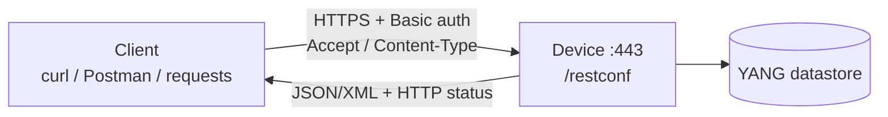
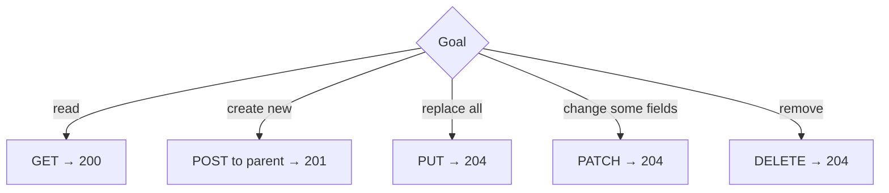
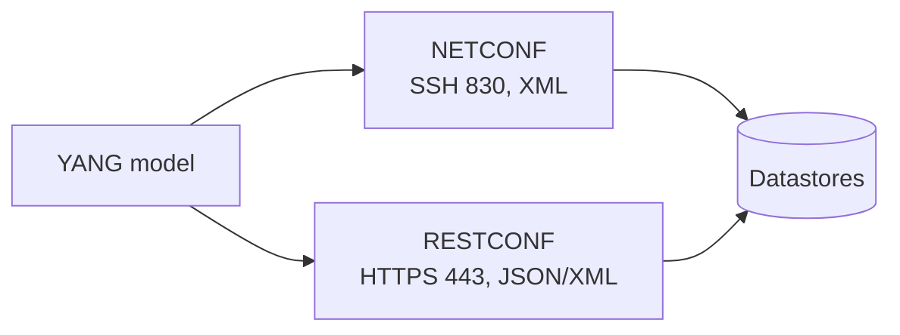

# T16 — RESTCONF
**Blueprint 3.8, 5.10, 2.9 · CBT: Full · 15 min** (schedule Thu 08 + Fri 09 Oct)

## 1. Essentials
- **RESTCONF** (RFC 8040): REST-style HTTP interface to YANG-modelled data; subset of NETCONF functionality.
- Transport: **HTTPS (443)**. Encodings: **JSON or XML**.
- Uses standard HTTP verbs → operations on **datastore resources**.
- Enable on IOS XE: `restconf` + `ip http secure-server`.
- Auth: HTTP **Basic** (user:pass base64) typically.



## 2. URL structure
`https://<host>/restconf/data/<module>:<container>/<list>=<key>/<leaf>`
- `/restconf` — root (discoverable at `/.well-known/host-meta`).
- `/restconf/data` — datastore resource (config + state).
- `/restconf/operations` — RPC operations.
- `/restconf/yang-library-version` and `/restconf/data/ietf-yang-library:modules-state` — discover supported models.
- Query params: `?content=config|nonconfig|all`, `?depth=N`, `?fields=`.

## 3. Media types (headers)
| Encoding | Content-Type / Accept |
|---|---|
| JSON | `application/yang-data+json` |
| XML | `application/yang-data+xml` |
- `Accept` = format you want back; `Content-Type` = format of your body.
- Common trap: plain `application/json` is not the RESTCONF type.

## 4. HTTP method ↔ operation
| Method | Action | NETCONF analog | Notes |
|---|---|---|---|
| **GET** | Read resource | get / get-config | 200 OK |
| **POST** | **Create** child resource (or invoke RPC) | edit-config (create) | 201 Created; 409 if exists |
| **PUT** | **Replace** whole resource | edit-config (replace) | 204 No Content (or 201) |
| **PATCH** | **Merge/modify** part | edit-config (merge) | 204 No Content |
| **DELETE** | Remove resource | edit-config (delete) | 204 No Content |



## 5. Examples
Read an interface:
```
GET https://10.0.0.1/restconf/data/ietf-interfaces:interfaces/interface=GigabitEthernet1
Accept: application/yang-data+json
```
Reply:
```json
{
  "ietf-interfaces:interface": {
    "name": "GigabitEthernet1",
    "description": "WAN",
    "type": "iana-if-type:ethernetCsmacd",
    "enabled": true
  }
}
```
Create (POST to the **parent** `interfaces`):
```
POST /restconf/data/ietf-interfaces:interfaces
Content-Type: application/yang-data+json

{"ietf-interfaces:interface":{"name":"Loopback100","type":"iana-if-type:softwareLoopback","enabled":true}}
```
Modify one leaf (PATCH to the resource):
```
PATCH /restconf/data/ietf-interfaces:interfaces/interface=Loopback100
{"ietf-interfaces:interface":{"description":"test"}}
```

## 6. Interpreting replies
| Code | Meaning in RESTCONF |
|---|---|
| 200 OK | GET succeeded (body returned) |
| 201 Created | POST created resource (Location header) |
| 204 No Content | PUT/PATCH/DELETE OK, no body |
| 400 Bad Request | Malformed body / invalid value |
| 401 Unauthorized | Bad/missing credentials |
| 403 Forbidden | Authenticated but not allowed |
| 404 Not Found | Path/resource (or key) doesn't exist |
| 409 Conflict | POST on resource that already exists |
| 415 Unsupported Media Type | Wrong Content-Type |

## 7. Python requests (ties to T11)
```python
import requests
url = "https://10.0.0.1/restconf/data/ietf-interfaces:interfaces"
h = {"Accept": "application/yang-data+json",
     "Content-Type": "application/yang-data+json"}
r = requests.get(url, auth=("u", "p"), headers=h, verify=False)
r.raise_for_status()
print(r.json())
```

## 8. NETCONF vs RESTCONF
| | NETCONF | RESTCONF |
|---|---|---|
| Transport | SSH | HTTPS |
| Port | 830 | 443 |
| Encoding | XML | JSON or XML |
| Operations | RPCs (get, edit-config…) | HTTP verbs (GET/POST/PUT/PATCH/DELETE) |
| Datastores | running, candidate, startup | Unified `/data` (running only; no candidate) |
| Transactions | commit, lock, rollback | Each request is atomic; no commit/lock |
| Style | Session-based, stateful | Stateless |
| Model | YANG | YANG |



## 9. Exam tips
- Media type `application/yang-data+json`.
- POST=create (to parent), PUT=replace, PATCH=merge.
- Build path from YANG (T14), read status codes.
