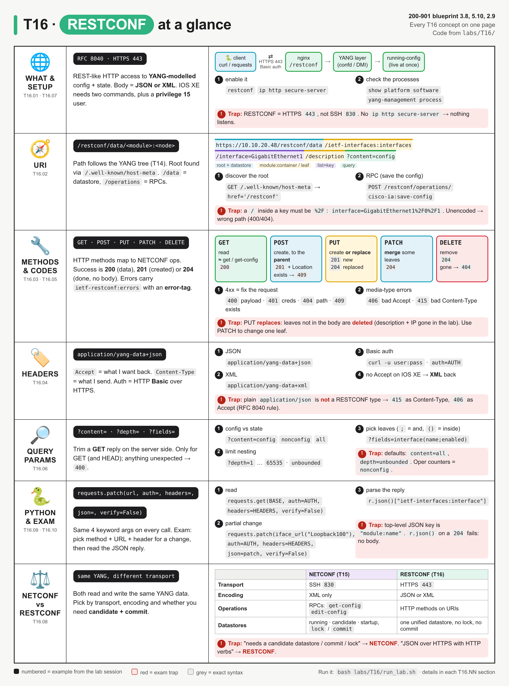
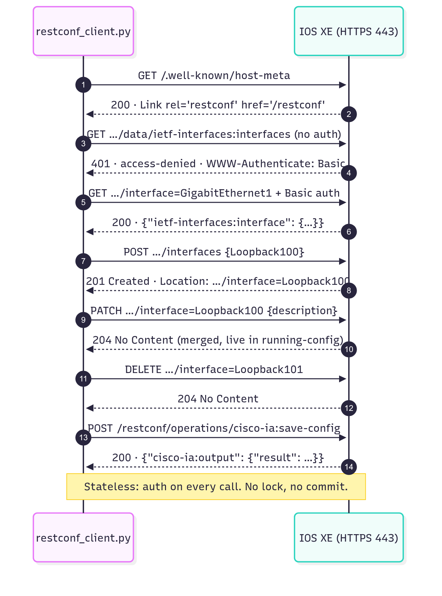
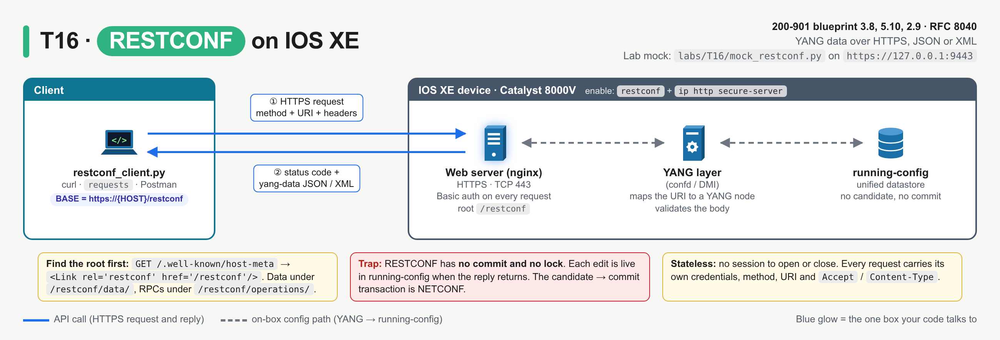
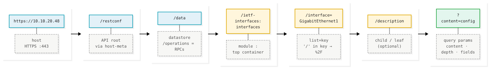
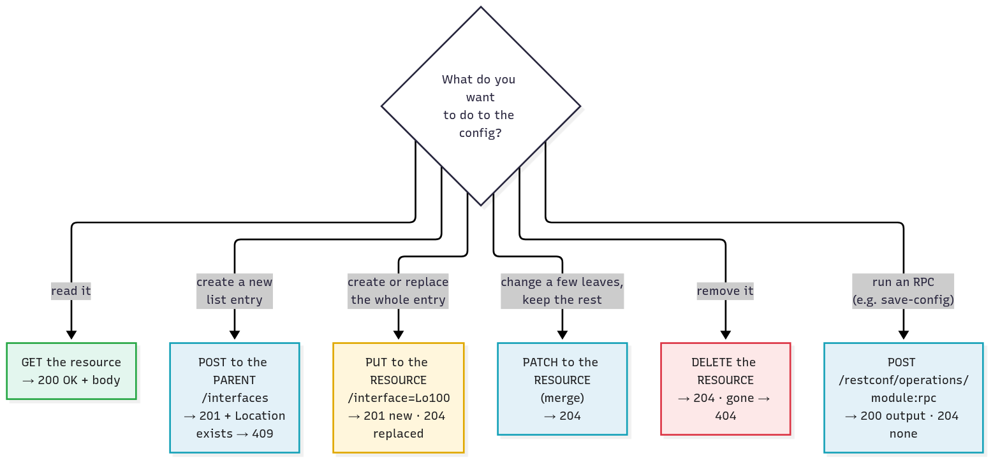
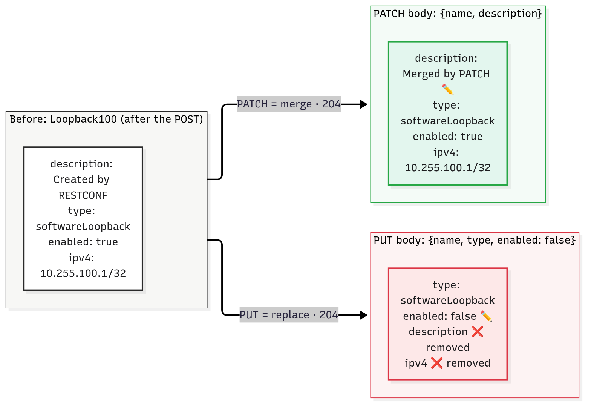
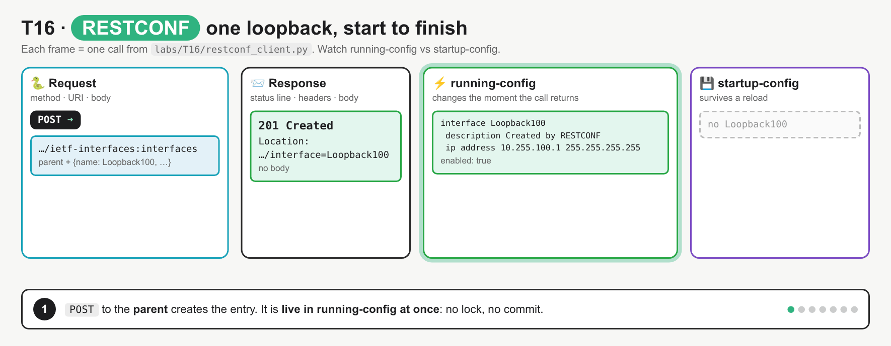
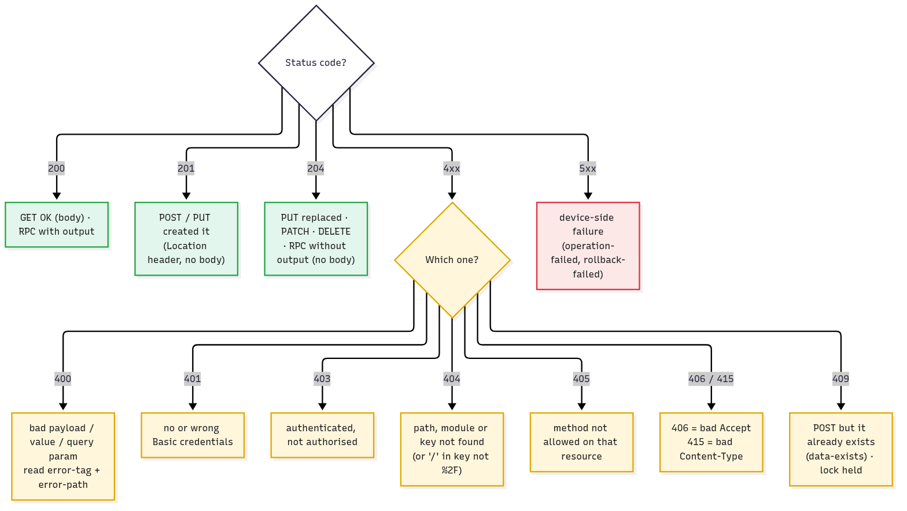
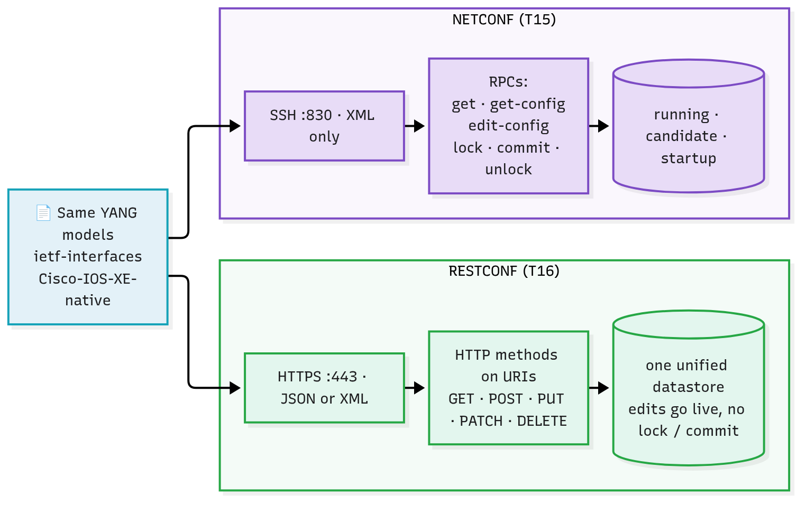

# T16 · RESTCONF

> Owner: **Bob** · Blueprint: **3.8, 5.10, 2.9** · CBT coverage: **Full** · Learn by 2026-10-11 · Teach-back 2026-10-12



*Every T16 concept on one page. Each row is a concept group (IDs under the icon), numbered items are calls from the lab session in `labs/T16/`, red boxes are exam traps, and the last row is the NETCONF vs RESTCONF table.*

## TL;DR (teach-back card)

- **RESTCONF (RFC 8040) = YANG data over HTTPS 443**, in JSON or XML, using HTTP methods on URIs. The URI follows the YANG tree: `/restconf/data/<module>:<container>/<list>=<key>/<leaf>`. RPCs go under `/restconf/operations/`. On IOS XE you enable it with `restconf` + `ip http secure-server`.
- **Methods and codes:** GET → `200` + body. POST to the **parent** → `201` + `Location` (`409` if it already exists). PUT = create **or replace** → `201` new / `204` replaced. PATCH = **merge** → `204`. DELETE → `204`. Errors come back as `ietf-restconf:errors` with an `error-tag`.
- **Headers:** `Accept` and `Content-Type` = `application/yang-data+json` (or `+xml`). Auth = HTTP Basic. In Python: `requests.<method>(url, auth=AUTH, headers=HEADERS, json=body, verify=False)`.
- **Trap:** PUT replaces the whole resource, so any leaf you leave out is **deleted** (in the lab, PUT wiped the description and IP). And plain `application/json` isn't a RESTCONF media type.

## Concepts

Every section below explains one part of the same RESTCONF session. Read it once first.

- `labs/T16/mock_restconf.py` is a stand-in for an IOS XE (Catalyst 8000V) RESTCONF interface, written with the Python standard library only. It serves the `ietf-interfaces` model over **HTTPS** on `https://127.0.0.1:9443/restconf`, with a throwaway self-signed certificate. It returns RFC 8040-shaped replies and error bodies. Its 401 reply copies what the real DevNet always-on IOS XE sandbox returned on 10 Oct 2026.
- `labs/T16/restconf_client.py` (shown below) is the **reference program**. It's one `requests` client that discovers the API root, reads interfaces several ways, creates, merges, replaces and deletes loopbacks, triggers every common error and then saves the config.
- To run both: `bash labs/T16/run_lab.sh`. It makes the certificate, starts the mock, runs the client, then stops the mock. To point the client at a real device instead, set `RESTCONF_HOST`, `RESTCONF_USER` and `RESTCONF_PASS`.

**`labs/T16/restconf_client.py`**

```python
"""T16 reference program: one RESTCONF session against an IOS XE device.

Discover the root, read interfaces (whole list, one entry, one leaf, filtered),
create / merge / replace / delete a loopback, trigger the common errors, then save.

Mock device:  bash labs/T16/run_lab.sh      (starts labs/T16/mock_restconf.py first)
Real device:  RESTCONF_HOST=<ip-or-name> RESTCONF_USER=<user> RESTCONF_PASS=<pass> \
              python3 labs/T16/restconf_client.py
"""
import json
import os
from urllib.parse import quote

import requests
import urllib3

HOST = os.environ.get("RESTCONF_HOST", "127.0.0.1:9443")
AUTH = (os.environ.get("RESTCONF_USER", "admin"), os.environ.get("RESTCONF_PASS", "C1sco12345"))
BASE = f"https://{HOST}/restconf"                      # API root (found via host-meta)
IFACES = f"{BASE}/data/ietf-interfaces:interfaces"     # <module>:<container>
HEADERS = {"Accept": "application/yang-data+json",     # what I want back
           "Content-Type": "application/yang-data+json"}  # what I am sending

urllib3.disable_warnings(urllib3.exceptions.InsecureRequestWarning)  # self-signed cert


def iface_url(name):
    """List entry URI: list=key, with '/' in the key percent-encoded as %2F."""
    return f"{IFACES}/interface={quote(name, safe='')}"


def show(r, pretty=False):
    """Print request line, status line, key headers and the body."""
    print(f"\n>>> {r.request.method} {r.request.url}")
    print(f"<<< {r.status_code} {r.reason}")
    for name in ("Content-Type", "Location", "WWW-Authenticate"):
        if name in r.headers:
            print(f"    {name}: {r.headers[name]}")
    if r.text:
        if pretty or "json" not in r.headers.get("Content-Type", ""):
            print("    " + r.text.strip().replace("\n", "\n    "))
        else:
            print("    " + json.dumps(r.json(), separators=(",", ":")))
    return r


LOOPBACK = {"ietf-interfaces:interface": {
    "name": "Loopback100",
    "description": "Created by RESTCONF",
    "type": "iana-if-type:softwareLoopback",
    "enabled": True,
    "ietf-ip:ipv4": {"address": [{"ip": "10.255.100.1", "netmask": "255.255.255.255"}]},
}}


def main():
    print("== 1. Discover the API root ==")
    show(requests.get(f"https://{HOST}/.well-known/host-meta", verify=False))
    show(requests.get(BASE, auth=AUTH, headers=HEADERS, verify=False))
    show(requests.get(IFACES, headers=HEADERS, verify=False))        # 401: forgot auth=

    print("\n== 2. Read (GET) ==")
    r = show(requests.get(iface_url("GigabitEthernet1"), auth=AUTH, headers=HEADERS, verify=False),
             pretty=True)
    gi1 = r.json()["ietf-interfaces:interface"]
    print(f"    -> parsed: {gi1['name']} ip={gi1['ietf-ip:ipv4']['address'][0]['ip']} "
          f"oper={gi1['oper-status']}")
    show(requests.get(IFACES + "?fields=interface(name;enabled)", auth=AUTH, headers=HEADERS, verify=False))
    show(requests.get(iface_url("GigabitEthernet2") + "?content=nonconfig",
                      auth=AUTH, headers=HEADERS, verify=False))
    show(requests.get(iface_url("GigabitEthernet2") + "/description",
                      auth=AUTH, headers=HEADERS, verify=False))
    show(requests.get(iface_url("GigabitEthernet2"), auth=AUTH, verify=False,
                      headers={"Accept": "application/yang-data+xml"}))

    print("\n== 3. Create (POST to the parent) ==")
    show(requests.post(IFACES, auth=AUTH, headers=HEADERS, json=LOOPBACK, verify=False))   # 201
    show(requests.post(IFACES, auth=AUTH, headers=HEADERS, json=LOOPBACK, verify=False))   # 409

    print("\n== 4. Update: PATCH merges, PUT replaces ==")
    patch = {"ietf-interfaces:interface": {"name": "Loopback100", "description": "Merged by PATCH"}}
    show(requests.patch(iface_url("Loopback100"), auth=AUTH, headers=HEADERS, json=patch, verify=False))
    show(requests.get(iface_url("Loopback100"), auth=AUTH, headers=HEADERS, verify=False))
    put = {"ietf-interfaces:interface": {"name": "Loopback100", "type": "iana-if-type:softwareLoopback",
                                         "enabled": False}}
    show(requests.put(iface_url("Loopback100"), auth=AUTH, headers=HEADERS, json=put, verify=False))
    show(requests.get(iface_url("Loopback100"), auth=AUTH, headers=HEADERS, verify=False))
    put["ietf-interfaces:interface"]["name"] = "Loopback101"
    show(requests.put(iface_url("Loopback101"), auth=AUTH, headers=HEADERS, json=put, verify=False))

    print("\n== 5. Errors you must recognise ==")
    bad = {"ietf-interfaces:interface": {"name": "Loopback100", "enabled": "yes"}}
    show(requests.patch(iface_url("Loopback100"), auth=AUTH, headers=HEADERS, json=bad, verify=False))
    show(requests.post(IFACES, auth=AUTH, json=LOOPBACK, verify=False,
                       headers={"Accept": "application/yang-data+json", "Content-Type": "application/json"}))
    show(requests.get(iface_url("Loopback100"), auth=AUTH, verify=False,
                      headers={"Accept": "application/json"}))
    show(requests.get(f"{IFACES}/interface=GigabitEthernet1/0/1", auth=AUTH, headers=HEADERS, verify=False))
    show(requests.get(iface_url("GigabitEthernet1/0/1"), auth=AUTH, headers=HEADERS, verify=False))

    print("\n== 6. Delete, then save ==")
    show(requests.delete(iface_url("Loopback101"), auth=AUTH, headers=HEADERS, verify=False))   # 204
    show(requests.delete(iface_url("Loopback101"), auth=AUTH, headers=HEADERS, verify=False))   # 404
    show(requests.post(f"{BASE}/operations/cisco-ia:save-config", auth=AUTH, headers=HEADERS, verify=False))


if __name__ == "__main__":
    main()
```

**Output** (`bash labs/T16/run_lab.sh`):

```
== 1. Discover the API root ==

>>> GET https://127.0.0.1:9443/.well-known/host-meta
<<< 200 OK
    Content-Type: application/xrd+xml
    <XRD xmlns='http://docs.oasis-open.org/ns/xri/xrd-1.0'>
      <Link rel='restconf' href='/restconf'/>
    </XRD>

>>> GET https://127.0.0.1:9443/restconf
<<< 200 OK
    Content-Type: application/yang-data+json
    {"ietf-restconf:restconf":{"data":{},"operations":{},"yang-library-version":"2016-06-21"}}

>>> GET https://127.0.0.1:9443/restconf/data/ietf-interfaces:interfaces
<<< 401 Unauthorized
    Content-Type: application/yang-data+json
    WWW-Authenticate: Basic realm="restconf"
    {"ietf-restconf:errors":{"error":[{"error-type":"protocol","error-tag":"access-denied"}]}}

== 2. Read (GET) ==

>>> GET https://127.0.0.1:9443/restconf/data/ietf-interfaces:interfaces/interface=GigabitEthernet1
<<< 200 OK
    Content-Type: application/yang-data+json
    {
      "ietf-interfaces:interface": {
        "name": "GigabitEthernet1",
        "description": "MANAGEMENT - DO NOT TOUCH",
        "type": "iana-if-type:ethernetCsmacd",
        "enabled": true,
        "ietf-ip:ipv4": {
          "address": [
            {
              "ip": "10.10.20.48",
              "netmask": "255.255.255.0"
            }
          ]
        },
        "oper-status": "up",
        "phys-address": "00:50:56:bf:49:a1",
        "statistics": {
          "in-octets": 918273,
          "out-octets": 459136
        }
      }
    }
    -> parsed: GigabitEthernet1 ip=10.10.20.48 oper=up

>>> GET https://127.0.0.1:9443/restconf/data/ietf-interfaces:interfaces?fields=interface(name;enabled)
<<< 200 OK
    Content-Type: application/yang-data+json
    {"ietf-interfaces:interfaces":{"interface":[{"name":"GigabitEthernet1","enabled":true},{"name":"GigabitEthernet2","enabled":true},{"name":"GigabitEthernet3","enabled":true}]}}

>>> GET https://127.0.0.1:9443/restconf/data/ietf-interfaces:interfaces/interface=GigabitEthernet2?content=nonconfig
<<< 200 OK
    Content-Type: application/yang-data+json
    {"ietf-interfaces:interface":{"name":"GigabitEthernet2","oper-status":"up","phys-address":"00:50:56:bf:49:a2","statistics":{"in-octets":55120,"out-octets":27560}}}

>>> GET https://127.0.0.1:9443/restconf/data/ietf-interfaces:interfaces/interface=GigabitEthernet2/description
<<< 200 OK
    Content-Type: application/yang-data+json
    {"ietf-interfaces:description":"WAN to ISP-A"}

>>> GET https://127.0.0.1:9443/restconf/data/ietf-interfaces:interfaces/interface=GigabitEthernet2
<<< 200 OK
    Content-Type: application/yang-data+xml
    <interface xmlns="urn:ietf:params:xml:ns:yang:ietf-interfaces">
      <name>GigabitEthernet2</name>
      <description>WAN to ISP-A</description>
      <type xmlns:ianaift="urn:ietf:params:xml:ns:yang:iana-if-type">ianaift:ethernetCsmacd</type>
      <enabled>true</enabled>
      <ipv4 xmlns="urn:ietf:params:xml:ns:yang:ietf-ip">
        <address>
          <ip>172.16.1.1</ip>
          <netmask>255.255.255.0</netmask>
        </address>
      </ipv4>
      <oper-status>up</oper-status>
      <phys-address>00:50:56:bf:49:a2</phys-address>
      <statistics>
        <in-octets>55120</in-octets>
        <out-octets>27560</out-octets>
      </statistics>
    </interface>

== 3. Create (POST to the parent) ==

>>> POST https://127.0.0.1:9443/restconf/data/ietf-interfaces:interfaces
<<< 201 Created
    Location: https://127.0.0.1:9443/restconf/data/ietf-interfaces:interfaces/interface=Loopback100

>>> POST https://127.0.0.1:9443/restconf/data/ietf-interfaces:interfaces
<<< 409 Conflict
    Content-Type: application/yang-data+json
    {"ietf-restconf:errors":{"error":[{"error-type":"application","error-tag":"data-exists","error-message":"object already exists: /ietf-interfaces:interfaces/interface[name='Loopback100']"}]}}

== 4. Update: PATCH merges, PUT replaces ==

>>> PATCH https://127.0.0.1:9443/restconf/data/ietf-interfaces:interfaces/interface=Loopback100
<<< 204 No Content

>>> GET https://127.0.0.1:9443/restconf/data/ietf-interfaces:interfaces/interface=Loopback100
<<< 200 OK
    Content-Type: application/yang-data+json
    {"ietf-interfaces:interface":{"name":"Loopback100","description":"Merged by PATCH","type":"iana-if-type:softwareLoopback","enabled":true,"ietf-ip:ipv4":{"address":[{"ip":"10.255.100.1","netmask":"255.255.255.255"}]}}}

>>> PUT https://127.0.0.1:9443/restconf/data/ietf-interfaces:interfaces/interface=Loopback100
<<< 204 No Content

>>> GET https://127.0.0.1:9443/restconf/data/ietf-interfaces:interfaces/interface=Loopback100
<<< 200 OK
    Content-Type: application/yang-data+json
    {"ietf-interfaces:interface":{"name":"Loopback100","type":"iana-if-type:softwareLoopback","enabled":false}}

>>> PUT https://127.0.0.1:9443/restconf/data/ietf-interfaces:interfaces/interface=Loopback101
<<< 201 Created

== 5. Errors you must recognise ==

>>> PATCH https://127.0.0.1:9443/restconf/data/ietf-interfaces:interfaces/interface=Loopback100
<<< 400 Bad Request
    Content-Type: application/yang-data+json
    {"ietf-restconf:errors":{"error":[{"error-type":"application","error-tag":"invalid-value","error-path":"/ietf-interfaces:interfaces/interface[name='Loopback100']/enabled","error-message":"invalid value \"yes\" for boolean leaf"}]}}

>>> POST https://127.0.0.1:9443/restconf/data/ietf-interfaces:interfaces
<<< 415 Unsupported Media Type
    Content-Type: application/yang-data+json
    {"ietf-restconf:errors":{"error":[{"error-type":"protocol","error-tag":"invalid-value","error-message":"unsupported Content-Type 'application/json'"}]}}

>>> GET https://127.0.0.1:9443/restconf/data/ietf-interfaces:interfaces/interface=Loopback100
<<< 406 Not Acceptable
    Content-Type: application/yang-data+json
    {"ietf-restconf:errors":{"error":[{"error-type":"protocol","error-tag":"invalid-value","error-message":"Accept must be a yang-data media type"}]}}

>>> GET https://127.0.0.1:9443/restconf/data/ietf-interfaces:interfaces/interface=GigabitEthernet1/0/1
<<< 400 Bad Request
    Content-Type: application/yang-data+json
    {"ietf-restconf:errors":{"error":[{"error-type":"application","error-tag":"invalid-value","error-message":"unknown node '0/1' (unencoded '/' in a key?)"}]}}

>>> GET https://127.0.0.1:9443/restconf/data/ietf-interfaces:interfaces/interface=GigabitEthernet1%2F0%2F1
<<< 404 Not Found
    Content-Type: application/yang-data+json
    {"ietf-restconf:errors":{"error":[{"error-type":"application","error-tag":"invalid-value","error-message":"uri keypath not found"}]}}

== 6. Delete, then save ==

>>> DELETE https://127.0.0.1:9443/restconf/data/ietf-interfaces:interfaces/interface=Loopback101
<<< 204 No Content

>>> DELETE https://127.0.0.1:9443/restconf/data/ietf-interfaces:interfaces/interface=Loopback101
<<< 404 Not Found
    Content-Type: application/yang-data+json
    {"ietf-restconf:errors":{"error":[{"error-type":"application","error-tag":"invalid-value","error-path":"/ietf-interfaces:interfaces/interface[name='Loopback101']","error-message":"uri keypath not found"}]}}

>>> POST https://127.0.0.1:9443/restconf/operations/cisco-ia:save-config
<<< 200 OK
    Content-Type: application/yang-data+json
    {"cisco-ia:output":{"result":"Save running config is successful"}}
```



*The main calls of the program in order. Notice that every request carries its own credentials, and nothing is locked or committed.*

### T16.01 · What RESTCONF is

**Must cover:**

- [x] RFC 8040: HTTP-based, REST-like access to YANG-modelled data
- [x] JSON or XML encoding over HTTPS (port 443)

**Notes:**

- **RESTCONF** (RFC 8040) is an HTTP-based protocol that gives REST-like access to data defined in **YANG** models (T14). The RFC calls it a subset of NETCONF functionality, over HTTP instead of SSH.
  - The client uses standard HTTP methods (GET, POST, PUT, PATCH, DELETE) on **resources** (URIs).
  - Those resources are YANG nodes: containers, lists, leaves (T14).
- **Transport:** HTTPS, so TCP **443** by default. The program's `BASE` starts with `https://`.
- **Encoding:** JSON **or** XML. A server must support at least one, and IOS XE supports both. In the output, the same Gi2 entry came back as JSON, then as XML when `Accept` asked for `application/yang-data+xml`.
- **Stateless:** like any REST API, every request stands alone and carries its own credentials. There's no session to open or close (NETCONF has one, see T15).



*The client talks HTTPS to nginx on the device. The request goes through the YANG layer into the running config, and the reply comes back as a status code plus yang-data JSON/XML.*

### T16.02 · URI structure

**Must cover:**

- [x] Root discovery: GET /.well-known/host-meta → /restconf
- [x] /restconf/data = datastore resources; /restconf/operations = RPCs
- [x] /restconf/data/<module>:<container>/<list>=<key>/<leaf>

**Notes:**

- **Root discovery:** `GET /.well-known/host-meta` returns an XRD document with `<Link rel='restconf' href='/restconf'/>`. The `href` is the API root. It's almost always `/restconf` (RFC 8040 allows another path, e.g. `/top/restconf`).
  - `GET /restconf` returns the API resource: `data`, `operations` and `yang-library-version` (`2016-06-21` in the output, as in the Cisco IOS XE guide).
- **Top-level resources under the root:**

| Resource | Holds | In the program |
|---|---|---|
| `/restconf/data` | the **datastore**: config + state data, addressed by YANG path | `IFACES = f"{BASE}/data/ietf-interfaces:interfaces"` |
| `/restconf/operations` | YANG **RPCs** you can invoke with POST | `POST {BASE}/operations/cisco-ia:save-config` |
| `/restconf/yang-library-version` | revision of the `ietf-yang-library` module | in the `GET /restconf` reply |

- **Data resource path:** `/restconf/data/<module>:<container>/<list>=<key>/<leaf>`.



*Blue = the fixed root and datastore, yellow = the YANG path, green = query parameters. Only the first node needs the module prefix.*

- **Module prefix:** the first node is `module-name:node` (`ietf-interfaces:interfaces`). Children in the same module have no prefix (`/interface=…`). A node from another module needs its own prefix, e.g. `ietf-ip:ipv4` inside an interface.
- **List entry = `list=key`:** `interface=GigabitEthernet1`. For a list with several keys, separate them with commas: `list=key1,key2`.
- **Reserved characters in a key must be percent-encoded.** A `/` becomes `%2F`, so `GigabitEthernet1/0/1` → `interface=GigabitEthernet1%2F0%2F1`.
  - The program's `iface_url()` does this with `quote(name, safe='')`.
  - In section 5 of the output, the unencoded URL was read as interface `GigabitEthernet1` + child node `0/1` → `400`. The encoded URL reached the right key → `404` (no such interface on this router, which is correct).
- **Leaf path:** add the leaf name to read just one value: `…/interface=GigabitEthernet2/description` → `{"ietf-interfaces:description":"WAN to ISP-A"}`.
- Build paths from the YANG tree: `pyang -f tree ietf-interfaces.yang` shows `interfaces` → `interface* [name]` → `description`. See [T14](T14-yang-data-models.md).

### T16.03 · Methods

**Must cover:**

- [x] GET = read (≈ NETCONF get/get-config)
- [x] POST = create a child resource (error if it exists)
- [x] PUT = create or replace
- [x] PATCH = merge (partial update)
- [x] DELETE = remove

**Notes:**

| Method | Does | Target URI | NETCONF equivalent (RFC 8040 §4) | Success | In the program |
|---|---|---|---|---|---|
| **GET** | read | any data resource | `<get-config>`, `<get>` | `200` + body | section 2 |
| **POST** | **create** a child; fails if it exists. Also invokes an RPC | the **parent** (`/interfaces`) or `/operations/<rpc>` | `<edit-config>` `operation="create"` | `201` + `Location` | section 3: `201`, then `409` |
| **PUT** | create **or replace** | the resource itself (`/interface=Loopback100`) | `<edit-config>` `operation="create/replace"` | `201` new · `204` replaced | section 4: `204`, then `201` for Loopback101 |
| **PATCH** | **merge** the body into the resource | the resource itself | `<edit-config>` `operation="merge"` (plain patch) | `204` (or `200` with a body) | section 4: only `description` changes |
| **DELETE** | remove | the resource itself | `<edit-config>` `operation="delete"` | `204` | section 6: `204`, then `404` |



*Start from what you want to do to the config. POST is the only data method that targets the parent; the rest target the resource itself.*

- **POST vs PUT for create:** with POST you name the **parent** and the key is in the body. With PUT you name the **new resource** in the URI (`/interface=Loopback101`), and the key in the body must match the key in the URI.
- **PUT vs PATCH:** this is the one to remember.



*Same starting loopback. PATCH merges, so untouched leaves stay. PUT replaces, so every leaf not in the body is removed.*

- Proof from the output, section 4:
  - After `PATCH {name, description}` → `GET` shows the new description **and** the IP address still there.
  - After `PUT {name, type, enabled: false}` → `GET` shows only `name`, `type`, `enabled`. **Description and IP are gone.**



*One loopback through the program: POST `201` → POST again `409` → PATCH `204` (IP kept) → PUT `204` (description and IP removed) → PUT a new URI `201` → DELETE `204` → `save-config` `200`. Watch the two config columns: every edit is live in running-config the moment it returns, with no lock or commit, and startup-config only changes at `save-config`.*

- **Edits are live immediately.** There's no candidate and no commit (see T16.08). On IOS XE they land in the **running-config** only. To survive a reload, call the `cisco-ia:save-config` RPC (= `copy running-config startup-config`), as the last call in the program does. ⚠ verify the RPC reply text on a real device.

### T16.04 · Headers

**Must cover:**

- [x] Accept and Content-Type: application/yang-data+json or application/yang-data+xml
- [x] Authentication: HTTP basic over HTTPS

**Notes:**

| Header | Says | Value in the program |
|---|---|---|
| `Accept` | format I **want back** | `application/yang-data+json` |
| `Content-Type` | format of the body I'm **sending** (needed whenever there's a body) | `application/yang-data+json` |
| `Authorization` | credentials | `Basic <base64 user:pass>`, built by `auth=AUTH` |

- **Media types:** `application/yang-data+json` and `application/yang-data+xml`. These are YANG-specific types from RFC 8040, not plain `application/json` / `application/xml`.
  - RFC 8040 rule: an unsupported **Content-Type** → `415 Unsupported Media Type`, and an unsupported **Accept** → `406 Not Acceptable`. Section 5 of the output shows both. ⚠ verify how IOS XE reacts to plain `application/json`.
  - **No Accept header:** the RFC lets the server choose. IOS XE answered **XML** in the curl drill (step 2), and the real sandbox did the same on 10 Oct 2026 (`Content-Type: application/yang-data+xml` on its 401 reply). Always send `Accept`.
- (YANG Patch, RFC 8072, uses `application/yang-patch+json` with PATCH for ordered multi-edit changes. You only need to recognise the name.)
- **Authentication:** HTTP **Basic** over HTTPS. That's `base64(user:pass)` in `Authorization`, which is encoding, not encryption, so TLS is what protects it.
  - IOS XE accepts users with **privilege level 15** (local or via AAA/TACACS+/RADIUS).
  - No credentials → `401` + `WWW-Authenticate: Basic realm="restconf"` + error-tag `access-denied` (first block of the output).
- **TLS:** devices usually have self-signed certificates, so lab scripts pass `verify=False` (curl `-k`). Remove it and `requests` raises `SSLError` (Break-it 3).

### T16.05 · Responses

**Must cover:**

- [x] 200 OK with data (GET)
- [x] 201 Created (POST/PUT new)
- [x] 204 No Content (successful PUT/PATCH/DELETE)
- [x] 400 bad payload; 401 auth; 404 path/resource not found; 409 already exists

**Notes:**



*Green = success (only 200 has a body), yellow = fix your request, red = the device failed.*

| Code | When (RFC 8040) | In the output |
|---|---|---|
| `200 OK` | GET with data; RPC with output | Gi1 GET; `save-config` |
| `201 Created` | POST created a child (+ `Location`, **no body**); PUT created a new resource | POST Loopback100; PUT Loopback101 |
| `204 No Content` | PUT replaced, PATCH merged, DELETE removed; RPC with no output | PATCH, PUT Loopback100, DELETE |
| `400 Bad Request` | malformed body, invalid value, bad/unknown query parameter | `"enabled": "yes"` → `invalid-value` with `error-path` |
| `401 Unauthorized` | no or bad credentials (`access-denied`) | GET without `auth=` |
| `403 Forbidden` | authenticated, but not allowed (`access-denied`) | (not triggered) |
| `404 Not Found` | path, module or key doesn't exist | `GigabitEthernet1%2F0%2F1`; second DELETE |
| `405 Method Not Allowed` | method not supported on that resource | (not triggered) |
| `406` / `415` | unsupported Accept / Content-Type | plain `application/json` |
| `409 Conflict` | POST on an existing resource (`data-exists`); NETCONF lock held (`in-use` / `lock-denied`) | second POST of Loopback100 |
| `5xx` | device-side failure (`operation-failed`, `rollback-failed`, `partial-operation`) | (not triggered) |

- **Error body** (every 4xx/5xx): `ietf-restconf:errors` → `error` list → each item has `error-type`, `error-tag` and optionally `error-path` and `error-message`. Read them in that order:
  - `error-tag` says what kind of error (`invalid-value`, `data-exists`, `access-denied`).
  - `error-path` says which node is wrong.
  - `error-message` says why, in words.
- RFC 8040 §7 maps NETCONF error-tags to HTTP codes. Ones worth knowing: `invalid-value` → 400/404/406, `access-denied` → 401/403, `data-exists` / `in-use` / `lock-denied` → 409, `operation-not-supported` → 405/501.
- Status codes in general (2xx/4xx/5xx, `Location`, empty `204`) are in [T07](../bee/T07-rest-fundamentals-http-codes.md).

### T16.06 · Query parameters

**Must cover:**

- [x] depth=N limits nesting; fields= selects leaves
- [x] content=config | nonconfig | all

**Notes:**

| Parameter | Values | Default | Effect | In the program |
|---|---|---|---|---|
| `content` | `config` · `nonconfig` · `all` | `all` | config only, state only (counters, oper-status), or both | `?content=nonconfig` → only `oper-status`, `phys-address`, `statistics` (+ the key) |
| `depth` | `1`–`65535` or `unbounded` | `unbounded` | stop returning nodes deeper than N levels; the target node is level 1 | (explained only) |
| `fields` | `a;b`, `a/b`, `a(b;c)` | all | return only the named descendants; `;` separates, `/` goes down, `()` selects inside a node | `?fields=interface(name;enabled)` → 3 small entries |

- RFC rules: query parameters are case-sensitive, each one can appear only once, and an unexpected one → `400`. `content`, `depth` and `fields` are only allowed on **GET** (and HEAD).
- Others in RFC 8040 (awareness only): `filter`, `start-time`, `stop-time` (event streams), `insert` / `point` (ordered lists, POST/PUT), `with-defaults`.
- IOS XE: the Cisco guide shows `fields` and `depth`, and lists `filter`, `start-time`, `stop-time` as unsupported. ⚠ verify `content=` on your IOS XE version.
- The state in this mock sits inside `ietf-interfaces:interfaces` (RFC 8343 / NMDA layout). Older IOS XE releases put state in `ietf-interfaces:interfaces-state` or the `Cisco-IOS-XE-interfaces-oper` model instead. ⚠ verify.

### T16.07 · Device setup

**Must cover:**

- [x] IOS XE: restconf and ip http secure-server

**Notes:**

- Minimum config on IOS XE (16.6 or later), from the Cisco Programmability Configuration Guide:

```
configure terminal
 username admin privilege 15 secret <password>
 ip http secure-server
 ip http authentication local
 restconf
end
```

- `restconf` enables the RESTCONF interface. `ip http secure-server` turns on the HTTPS server that nginx uses to front RESTCONF. You need **both**.
- The user needs **privilege 15**. `ip http authentication local` points HTTP auth at the local user database. It appears in Cisco's sample config, though the guide doesn't list it as a step. ⚠ verify whether it's needed on your release.
- **Verify:**
  - `show platform software yang-management process` lists the processes. After `restconf`: `nginx`, `confd`, `nesd`, `syncfd`, `dmiauthd`, `ndbmand` … Running.
  - Then the quick test: `curl -k -u admin:<password> -H "Accept: application/yang-data+json" https://<ip>/restconf/data/ietf-interfaces:interfaces`.
- NETCONF is a separate feature (`netconf-yang`, port 830, see T15). You can enable one, the other or both.
- (Not run: there's no IOS XE device with admin access in this setup; see To verify.)

### T16.08 · NETCONF vs RESTCONF

**Must cover:**

- [x] Transport: SSH 830 vs HTTPS 443
- [x] Encoding: XML only vs JSON or XML
- [x] Datastores: running/candidate/startup + lock/commit vs a single unified datastore, no locking
- [x] Style: RPC operations vs HTTP methods on resources

**Notes:**

| | NETCONF ([T15](T15-netconf.md)) | RESTCONF (T16) |
|---|---|---|
| RFC | 6241 | 8040 |
| Transport | SSH | HTTPS |
| Port | **830** | **443** |
| Encoding | **XML only** | **JSON or XML** |
| Operations | RPCs: `get`, `get-config`, `edit-config`, `lock`, `commit` … | HTTP methods: GET / POST / PUT / PATCH / DELETE on URIs |
| Datastores | named: running, candidate, startup | one **unified** datastore view |
| Transactions | `lock`, edit **candidate**, `validate`, `commit` (confirmed-commit, rollback) | each request applied on its own; **no lock, no commit** |
| Session | stateful SSH session (hello + capabilities) | stateless: credentials on every request |
| Data model | YANG | YANG |
| Typical client | `ncclient` | `requests`, curl, Postman |



*The same YANG models sit behind both. They differ in transport, encoding and what happens to your edit.*

- **"Unified datastore"** (RFC 8040): RESTCONF hides the datastore names.
  - If the server has a writable running datastore, edits go straight into running.
  - If it only has a candidate, the server **commits it automatically** after every successful edit.
  - RESTCONF can't manipulate locks. If a NETCONF client holds a lock, a RESTCONF edit fails with `409`.
- Exam rule of thumb:
  - "candidate", "commit", "lock", "SSH", "830", "XML only" → **NETCONF**.
  - "JSON", "HTTP verbs", "443", "URI", "stateless" → **RESTCONF**.

### T16.09 · Python

**Must cover:**

- [x] requests.get(url, auth=(u, p), headers={"Accept": "application/yang-data+json"}, verify=False)
- [x] requests.patch(url, json=body, ...) for a partial change

**Notes:**

- Every call in the program uses the same four keyword arguments:

| Argument | In the program | Why |
|---|---|---|
| `auth=` | `AUTH = (user, pass)` tuple | `requests` builds the `Authorization: Basic …` header |
| `headers=` | `HEADERS` dict with `Accept` + `Content-Type` = `application/yang-data+json` | RESTCONF media types |
| `json=` | `json=LOOPBACK`, `json=patch`, `json=put` | serialises the dict **and** sets `Content-Type: application/json` unless you pass one. `HEADERS` overrides it with the yang-data type |
| `verify=False` | every call | skip the TLS check for self-signed device certs (with `urllib3.disable_warnings(...)` to hide the warning) |

- **Read:** `requests.get(iface_url("GigabitEthernet1"), auth=AUTH, headers=HEADERS, verify=False)`, then parse with `r.json()["ietf-interfaces:interface"]["ietf-ip:ipv4"]["address"][0]["ip"]` → `10.10.20.48` (the `-> parsed:` line).
- **Partial change:** `requests.patch(iface_url("Loopback100"), auth=AUTH, headers=HEADERS, json=patch, verify=False)` → `204`.
- **Check before parsing:** `r.status_code` (or `r.raise_for_status()`). `201` and `204` have **no body**, so `r.json()` on them raises an error. `show()` only parses when `r.text` isn't empty.
- **Trap from Break-it 1:** with `Accept: application/json` the mock answers `406`. The script then does `r.json()["ietf-interfaces:interface"]` on an error body → `KeyError`. Check the status code first.
- `requests` basics (sessions, `raise_for_status`, retries) are in [T11](../bee/T11-python-requests-scripting.md).

### T16.10 · Exam angle

**Must cover:**

- [x] Choose the method/URL/header for a change; interpret a RESTCONF JSON reply

**Notes:**

- **Choose the call:** decide method → target URI → headers.
  - New loopback → `POST …/ietf-interfaces:interfaces` (the parent).
  - Change only the description → `PATCH …/interface=Loopback100`.
  - Make it exactly this config → `PUT …/interface=Loopback100`.
  - Headers → `Content-Type` + `Accept: application/yang-data+json`.
- **Interpret a JSON reply** (Gi1 GET in the output):
  - The top-level key is `"module:node"`: `"ietf-interfaces:interface"`.
  - A node from another module carries its own prefix: `"ietf-ip:ipv4"`.
  - A YANG **list** is a JSON **array** (`"address": [ {...} ]`), even with one entry.
  - Identity values are module-qualified: `"type": "iana-if-type:ethernetCsmacd"`.
  - A boolean leaf is JSON `true`/`false`, not a string.
  - Config leaves (`description`, `enabled`) and state (`oper-status`, `statistics`) come back together unless you use `?content=`.
- **Interpret an error:** status line first, then `error-tag`, then `error-path`. Example: `400` + `invalid-value` + `…/enabled` = wrong type for `enabled`.

## Exam traps

- **Port and transport:** RESTCONF = HTTPS **443**. NETCONF = SSH **830**.
- **Media type:** `application/yang-data+json` / `application/yang-data+xml`. Plain `application/json` is not a RESTCONF type (RFC rule: `415` as Content-Type, `406` as Accept).
- **`Accept` vs `Content-Type`:** what I want back vs what I'm sending. A GET needs only `Accept`. POST/PUT/PATCH need both.
- **POST targets the parent** (`…/interfaces`). PUT, PATCH and DELETE target the resource (`…/interface=Loopback100`). POST on something that exists → `409`.
- **PUT vs PATCH:** PUT replaces, so leaves not in the body are **removed**. PATCH merges. Both return `204` when the resource already existed, so the code doesn't tell them apart.
- **PUT returns `201` or `204`:** 201 when it created the resource, 204 when it replaced one.
- **`201` and `204` have no body**, so read `Location` for the new URI and don't call `.json()`.
- **Key encoding:** `interface=GigabitEthernet1%2F0%2F1`. A raw `/` splits the path.
- **Module prefix only where the module changes:** `ietf-interfaces:interfaces/interface=Gi1`, not `ietf-interfaces:interfaces/ietf-interfaces:interface=Gi1`.
- **No candidate, no commit, no lock** in RESTCONF. Edits are live in running at once. On IOS XE, `startup-config` needs `POST /restconf/operations/cisco-ia:save-config`.
- **RPCs** live under `/restconf/operations/…` and are invoked with **POST**: `200` with output, `204` without.
- **Device setup:** `restconf` **and** `ip http secure-server`, plus a privilege 15 user.
- **`content=` default is `all`**: config + state together. Use `nonconfig` for counters and oper-status.
- **Auth:** HTTP Basic over HTTPS. `401` = bad/missing credentials, `403` = authenticated but not allowed.

## Examples

### 1. Run the reference program

Needs Python 3 with `requests`, plus `openssl` and `curl`. No device needed.

```bash
bash labs/T16/run_lab.sh                          # mock device + restconf_client.py
bash labs/T16/run_lab.sh labs/T16/curl_drill.sh   # mock device + curl drill
```

By hand, in two terminals:

```bash
openssl req -x509 -newkey rsa:2048 -nodes -days 1 -subj "/CN=localhost" \
  -keyout /tmp/t16-key.pem -out /tmp/t16-cert.pem
MOCK_CERT=/tmp/t16-cert.pem MOCK_KEY=/tmp/t16-key.pem python3 labs/T16/mock_restconf.py   # terminal 1
python3 labs/T16/restconf_client.py                                                       # terminal 2
```

In the lab container (the mock and the client share the container's localhost; `openssl` comes with the image's `ca-certificates`):

```bash
docker build --tag ccna-auto-lab:latest --file labs/Dockerfile labs/
docker run --rm --volume "$(pwd)":/work --workdir /work ccna-auto-lab:latest bash labs/T16/run_lab.sh
```

Against a real IOS XE device (e.g. a reserved DevNet sandbox; the always-on sandboxes now hand out per-user credentials):

```bash
RESTCONF_HOST=<device-ip> RESTCONF_USER=<user> RESTCONF_PASS=<password> python3 labs/T16/restconf_client.py
```

### 2. curl drill (`labs/T16/curl_drill.sh`)

```bash
#!/usr/bin/env bash
# T16 curl drill. Mock: bash labs/T16/run_lab.sh labs/T16/curl_drill.sh
# Real device: RESTCONF_HOST=... RESTCONF_USER=... RESTCONF_PASS=... bash labs/T16/curl_drill.sh
set -u
HOST="${RESTCONF_HOST:-127.0.0.1:9443}"
CREDS="${RESTCONF_USER:-admin}:${RESTCONF_PASS:-C1sco12345}"
URL="https://$HOST/restconf/data/ietf-interfaces:interfaces"

echo "== 1. GET one leaf, JSON, show status line + headers"
curl --silent --insecure --include --user "$CREDS" \
  --header "Accept: application/yang-data+json" \
  "$URL/interface=GigabitEthernet1/description"

echo; echo "== 2. Same GET with no Accept header: which encoding comes back?"
curl --silent --insecure --user "$CREDS" \
  "$URL/interface=GigabitEthernet1/description"

echo; echo "== 3. PATCH (merge) a description: 204, no body"
curl --silent --insecure --include --request PATCH --user "$CREDS" \
  --header "Content-Type: application/yang-data+json" \
  --header "Accept: application/yang-data+json" \
  --data '{"ietf-interfaces:interface": {"name": "GigabitEthernet3", "description": "LAN users - floor 2"}}' \
  "$URL/interface=GigabitEthernet3"

echo; echo "== 4. --data with curl's default Content-Type: 415"
curl --silent --insecure --include --request PATCH --user "$CREDS" \
  --header "Accept: application/yang-data+json" \
  --data '{"ietf-interfaces:interface": {"name": "GigabitEthernet3", "enabled": false}}' \
  "$URL/interface=GigabitEthernet3"

echo; echo "== 5. Wrong password: 401"
curl --silent --insecure --output /dev/null --write-out "HTTP %{http_code}\n" \
  --user "admin:wrong" --header "Accept: application/yang-data+json" "$URL"
```

Output (curl 7.81.0, `bash labs/T16/run_lab.sh labs/T16/curl_drill.sh`):

```
== 1. GET one leaf, JSON, show status line + headers
HTTP/1.1 200 OK
Server: openresty
Date: Sat, 10 Oct 2026 12:17:19 GMT
Content-Type: application/yang-data+json
Content-Length: 65

{
  "ietf-interfaces:description": "MANAGEMENT - DO NOT TOUCH"
}

== 2. Same GET with no Accept header: which encoding comes back?
<description xmlns="urn:ietf:params:xml:ns:yang:ietf-interfaces">MANAGEMENT - DO NOT TOUCH</description>

== 3. PATCH (merge) a description: 204, no body
HTTP/1.1 204 No Content
Server: openresty
Date: Sat, 10 Oct 2026 12:17:19 GMT
Content-Length: 0


== 4. --data with curl's default Content-Type: 415
HTTP/1.1 415 Unsupported Media Type
Server: openresty
Date: Sat, 10 Oct 2026 12:17:19 GMT
Content-Type: application/yang-data+json
Content-Length: 233

{
  "ietf-restconf:errors": {
    "error": [
      {
        "error-type": "protocol",
        "error-tag": "invalid-value",
        "error-message": "unsupported Content-Type 'application/x-www-form-urlencoded'"
      }
    ]
  }
}

== 5. Wrong password: 401
HTTP 401
```

- Step 2: with no `Accept` header the device picks the encoding, and IOS XE picks **XML**.
- Step 4: `--data` without a `Content-Type` header sends `application/x-www-form-urlencoded` → `415` (same trap as T07, with RESTCONF's error body).

### 3. Break it on purpose

Copy `labs/T16/restconf_client.py` to `/tmp/b.py`, make one edit, then run `bash labs/T16/run_lab.sh /tmp/b.py`. All four were run, and the result shown is the first changed part of the real output.

| Edit | First change in the output | Lesson |
|---|---|---|
| 1. In `HEADERS`, change `"Accept": "application/yang-data+json"` to `"Accept": "application/json"` | `GET …/restconf` → `<<< 406 Not Acceptable`, then `KeyError: 'ietf-interfaces:interface'` at the `gi1 = r.json()[…]` line | wrong media type, and check the code before parsing |
| 2. In `iface_url()`, change `quote(name, safe='')` to `quote(name)` | `GET …/interface=GigabitEthernet1/0/1` → `<<< 400 Bad Request` … `unknown node '0/1' (unencoded '/' in a key?)` | `quote()` keeps `/` by default; keys need `safe=''` |
| 3. In the first `show(requests.get(…host-meta…))`, delete `, verify=False` | `requests.exceptions.SSLError: … CERTIFICATE_VERIFY_FAILED] certificate verify failed: self-signed certificate` | device certs are self-signed; lab code uses `verify=False` |
| 4. In section 4, change `requests.patch(iface_url("Loopback100"), …, json=patch, …)` to `requests.put(…)` | `PUT …/interface=Loopback100` → `<<< 400 Bad Request` … `missing mandatory leaf 'type'` | PUT needs the **whole** resource; PATCH needs only the change |

### 4. Read a reply without running anything (drill for 5.10)

Given this reply to `GET …/ietf-interfaces:interfaces?content=nonconfig`, answer: which interface has errors, and is it up?

```json
{"ietf-interfaces:interfaces": {"interface": [
  {"name": "GigabitEthernet1", "oper-status": "up", "statistics": {"in-errors": 0}},
  {"name": "GigabitEthernet2", "oper-status": "down", "statistics": {"in-errors": 1742}}]}}
```

<details><summary>Answer</summary>

GigabitEthernet2: `in-errors` 1742 and `oper-status` `down`. In Python: `[i["name"] for i in r.json()["ietf-interfaces:interfaces"]["interface"] if i["statistics"]["in-errors"]]` → `['GigabitEthernet2']`.
</details>

## Practice questions

**Q1.** An engineer must add `Loopback200` to an IOS XE router with RESTCONF, without touching existing interfaces. Which request is correct?
A. `PUT /restconf/data/ietf-interfaces:interfaces` with the Loopback200 entry
B. `POST /restconf/data/ietf-interfaces:interfaces` with the Loopback200 entry
C. `PATCH /restconf/operations/ietf-interfaces:interfaces` with the Loopback200 entry
D. `GET /restconf/data/ietf-interfaces:interfaces/interface=Loopback200`

<details><summary>Answer</summary>

**B.** POST to the **parent** creates a child (`201` + `Location`). A PUT on the `interfaces` container would replace the whole container, so every other interface not in the body would be removed. `/operations` is for RPCs. (T16.03)
</details>

**Q2.** Complete the headers for a RESTCONF PATCH with a JSON body:

```python
headers = {"Accept": "__________", "Content-Type": "__________"}
```

<details><summary>Answer</summary>

Both `application/yang-data+json`. Plain `application/json` isn't a RESTCONF media type. (T16.04)
</details>

**Q3.** Refer to the exchange:

```
PUT /restconf/data/ietf-interfaces:interfaces/interface=Loopback100
{"ietf-interfaces:interface": {"name": "Loopback100", "type": "iana-if-type:softwareLoopback", "enabled": false}}

HTTP/1.1 204 No Content
```

Before the call, Loopback100 had a description and the IP 10.255.100.1/32. What's true now?
A. Only `enabled` changed; the description and IP remain
B. The interface was created, because the code is 204
C. The description and IP were removed
D. Nothing changed until a commit is sent

<details><summary>Answer</summary>

**C.** PUT replaces the resource with the body. `204` means an existing resource was replaced (`201` would mean created). RESTCONF has no commit. A PATCH would have kept the other leaves. (T16.03, T16.05)
</details>

**Q4.** Which two statements describe RESTCONF compared with NETCONF? (Choose two.)
A. It runs over SSH on port 830
B. It can encode data as JSON
C. It edits a candidate datastore, then commits it
D. It maps HTTP methods to operations on YANG data resources
E. It uses only XML

<details><summary>Answer</summary>

**B, D.** A, C and E describe NETCONF. RESTCONF uses HTTPS 443, JSON or XML, and a unified datastore with no commit. (T16.08)
</details>

**Q5.** A script sends `GET https://10.1.1.1/restconf/data/ietf-interfaces:interfaces/interface=GigabitEthernet1/0/1` and gets `400 Bad Request`. The interface exists. What's the fix?
A. Add `?content=all`
B. Encode the key: `interface=GigabitEthernet1%2F0%2F1`
C. Change the method to POST
D. Use port 830

<details><summary>Answer</summary>

**B.** The `/` characters in the key split the path, so the device sees `interface=GigabitEthernet1` followed by an unknown child `0/1`. Reserved characters in a key must be percent-encoded. (T16.02)
</details>

**Q6.** Refer to the reply:

```json
{"ietf-restconf:errors": {"error": [{"error-type": "application", "error-tag": "data-exists",
  "error-message": "object already exists: /ietf-interfaces:interfaces/interface[name='Loopback100']"}]}}
```

Which status code and which method most likely produced it?
A. `404`, DELETE  B. `409`, POST  C. `400`, PATCH  D. `401`, GET

<details><summary>Answer</summary>

**B.** `data-exists` maps to `409 Conflict`, and only a create (POST) fails because the resource already exists. A PUT would have replaced it with `204`. (T16.05)
</details>

**Q7.** Put the steps in order to make a RESTCONF change on a new IOS XE router survive a reload:
`POST /restconf/operations/cisco-ia:save-config` · `restconf` + `ip http secure-server` · `PATCH …/interface=GigabitEthernet2` · `username admin privilege 15 secret …`

<details><summary>Answer</summary>

`username admin privilege 15 secret …` → `restconf` + `ip http secure-server` → `PATCH …/interface=GigabitEthernet2` → `POST /restconf/operations/cisco-ia:save-config`. You need a privilege 15 user before RESTCONF accepts calls. The PATCH is live in running at once, and save-config copies running to startup. (T16.07, T16.03)
</details>

**Q8.** In `restconf_client.py`, which expression prints `10.10.20.48` from the Gi1 reply?
A. `r.json()["interface"]["ipv4"]["address"]["ip"]`
B. `r.json()["ietf-interfaces:interface"]["ietf-ip:ipv4"]["address"][0]["ip"]`
C. `r.json()["ietf-interfaces:interface"]["ietf-ip:ipv4"]["address"]["ip"]`
D. `r.json()["ietf-interfaces:interfaces"]["interface"][0]["ip"]`

<details><summary>Answer</summary>

**B.** The top-level key is module-qualified. `ipv4` comes from another module (`ietf-ip`), so it keeps its prefix. `address` is a YANG list, so it's a JSON array, hence `[0]`. (T16.09, T16.10)
</details>

## Study aids

| Aid | Type | Title | Est. min | Resource |
|---|---|---|---|---|
| T16.1 | Video | Develop RESTCONF Scripts for Cisco IOS-XE | 25 | CBT module |
| T16.2 | Lab | GET / PATCH / PUT / DELETE via curl + requests | 60 | DevNet always-on IOS XE sandbox |
| T16.3 | Top-up | NETCONF vs RESTCONF comparison table | 30 | Own notes |
| T16.4 | Drill | Interpret RESTCONF / NETCONF replies | 30 | Output from labs |

- T16.2 runs locally with `bash labs/T16/run_lab.sh`. The same client runs against a sandbox with `RESTCONF_HOST` / `RESTCONF_USER` / `RESTCONF_PASS`.
- T16.3 is the table in T16.08. T16.4 is Examples §4 plus the output in Concepts.

## Sources

- Overview image: HTML source `assets/T16/00-overview.html`, rendered to PNG (see `assets/README.md`). Diagrams: Mermaid sources in `assets/T16/*.mmd`. Animation: `assets/T16/08-loopback-lifecycle-anim.html` → `.gif`.
- Architecture diagram: HTML source `assets/T16/01-architecture.html` (shared kit `assets/_arch/`).
- RFC 8040, RESTCONF Protocol: host-meta discovery (§3.1), API resource / data / operations / yang-library-version (§3.3), list key encoding (§3.5.3), methods and their NETCONF mapping (§4), POST `201` + `Location` / `409` (§4.4.1), PUT `201` vs `204` (§4.5), PATCH = merge, `200`/`204` (§4.6), DELETE `204` (§4.7), query parameters (§4.8), `415`/`406` and default encoding (§5.2), error-tag → status table (§7), unified datastore and candidate auto-commit (§1.4): https://www.rfc-editor.org/rfc/rfc8040
- RFC 7951, JSON encoding of YANG data (module-qualified names, lists as arrays): https://www.rfc-editor.org/rfc/rfc7951
- RFC 8343, YANG model for interface management (`ietf-interfaces`, NMDA state nodes): https://www.rfc-editor.org/rfc/rfc8343
- RFC 8072, YANG Patch media types: https://www.rfc-editor.org/rfc/rfc8072
- Cisco IOS XE 17.18.x Programmability Configuration Guide, RESTCONF Protocol (enable steps, privilege 15, nginx/confd, `show platform software yang-management process`, `GET /restconf` reply, supported query parameters): https://www.cisco.com/c/en/us/td/docs/ios-xml/ios/prog/configuration/1718/b-1718-programmability-cg/restconf_protocol.html
- Cisco IOS XE 17.17.x guide, RESTCONF Protocol (stateless HTTPS, method table): https://www.cisco.com/c/en/us/td/docs/ios-xml/ios/prog/configuration/1717/b_1717_programmability_cg/restconf-protocol.html
- DevNet always-on IOS XE sandbox (`devnetsandboxiosxe.cisco.com`): probed on 10 Oct 2026 for the real 401 reply, `WWW-Authenticate: Basic realm="restconf"` and the XML default. Credentials change note: https://community.cisco.com/t5/devnet-general-blogs/new-always-on-devnet-sandbox-for-cisco-catalyst-8000-amp/ba-p/5330526
- Python `requests` (auth, headers, json, verify): https://requests.readthedocs.io/en/latest/user/quickstart/ · `urllib.parse.quote`: https://docs.python.org/3/library/urllib.parse.html#urllib.parse.quote
- Cisco 200-901 v1.1 exam topics (2.9, 3.8, 5.10): https://learningcontent.cisco.com/documents/marketing/exam-topics/200-901-CCNAAUTO_v.1.1.pdf

## To verify

- ⚠ **Not run against a live device.** The DevNet always-on IOS XE sandbox was reachable, but it now issues per-user credentials, so the old shared `admin` / `C1sco12345` gets `401`. All lab output comes from the local mock (`labs/T16/mock_restconf.py`). Only the 401 reply, its headers and the XML default were checked against the real sandbox. Rerun `restconf_client.py` against a reserved sandbox and update the output if anything differs.
- ⚠ IOS XE returns a single list entry as a JSON **object** (`"ietf-interfaces:interface": {…}`), as in Cisco's examples. RFC 8040/7951 examples use a one-item **array**. The mock returns the object form and accepts both in request bodies. Check on a device.
- ⚠ Plain `application/json` as Accept/Content-Type: the mock follows the RFC rule (`406`/`415`). Check what IOS XE actually returns.
- ⚠ DELETE (and PATCH) on a missing resource: the mock returns `404` + `invalid-value` (RFC 8040 §4.7 allows 404). Some servers use `409` `data-missing`. Check on IOS XE.
- ⚠ `cisco-ia:save-config` reply body (`{"cisco-ia:output": {"result": …}}`) and its exact text are from memory and the mock, not from a device.
- ⚠ Whether IOS XE supports `content=` (the Cisco guide only shows `fields` and `depth`), and where ietf-interfaces state lives on your release (`interfaces` with NMDA vs `interfaces-state` / `Cisco-IOS-XE-interfaces-oper`).
- ⚠ Whether `ip http authentication local` is required on your IOS XE release (it's in Cisco's sample config, not in the enable steps).
- ⚠ Docker command in Examples §1 wasn't run here; the image isn't built in this environment. The mock, client, curl drill and the four break-it edits were all run locally (Python requests 2.34.2, curl 7.81.0, OpenSSL 3.0.2), and the output shown is real.
- Fixes to the round-1 note:
  - The PATCH example body had no key leaf. It now includes `"name"`, which a list entry needs to identify itself.
  - "Unified `/data` (running only; no candidate)" was refined. RFC 8040 allows a candidate-only server, which must **auto-commit** after each edit.
  - Added that POST `201` has no response body, per RFC 8040 §4.4.1.
- CBT: the coverage of the video "Develop RESTCONF Scripts for Cisco IOS-XE" is from its title only. Not watched or confirmed here.
