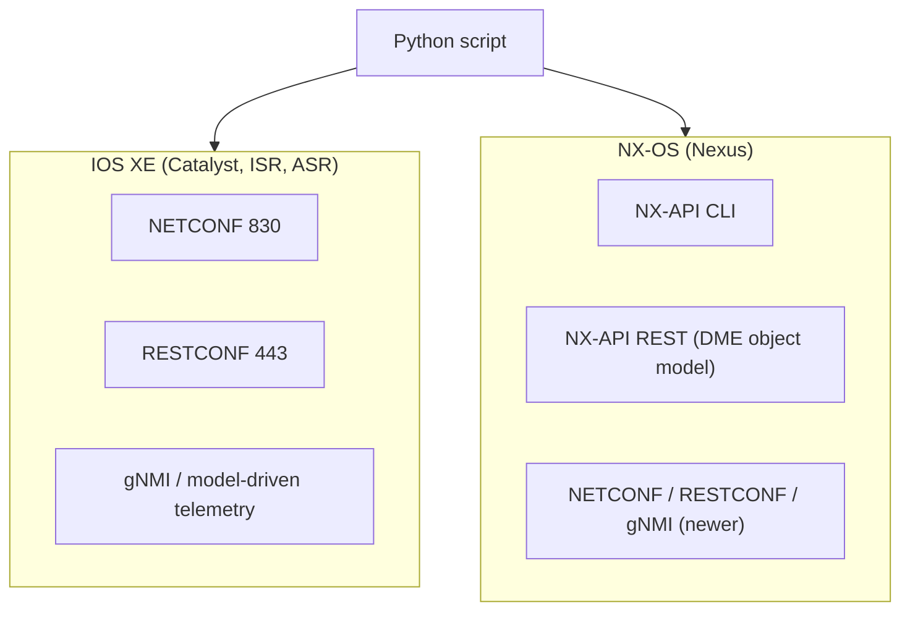
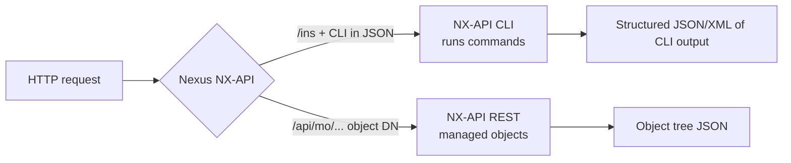

# T17 — IOS XE and NX-OS Device-level APIs
**Blueprint 3.6 · CBT: Full · 10 min** · Optional: Real-World Nexus video

## 1. Overview


## 2. IOS XE
- Programmability is **model-driven using YANG**: **NETCONF** and **RESTCONF** (T14–T16), plus gNMI.
- Enable: `netconf-yang`, `restconf`, `ip http secure-server`.
- Models: IETF, OpenConfig, native (`Cisco-IOS-XE-native`).
- Also: on-box **Guest Shell** (Linux container running Python), **EEM**, on-box Python `cli` module.
- Exam: "IOS XE uses RESTCONF/NETCONF."

## 3. NX-OS and NX-API
- **NX-API** = HTTP/HTTPS interface on Nexus; runs on the switch as a web server.
- Enable: `feature nxapi` (then optional `nxapi http port 80` / `nxapi https port 443`).
- Endpoint: `https://<switch>/ins` (NX-API CLI) ; `/api/mo/...` (NX-API REST).
- Auth: Basic, or session cookie via `aaaLogin`.
- Sandbox: built-in web **NX-API Sandbox** at `https://<switch>` to build/test requests and get Python/JSON.

### 3.1 NX-API CLI
- Send **CLI commands** inside a JSON-RPC or XML/JSON wrapper to `/ins`; returns output as **structured JSON/XML** (not text).
- Request types: `cli_show` (show commands, structured), `cli_show_ascii` (raw text), `cli_conf` (config).
- Multiple commands separated by ` ;` (space-semicolon).
- Good for: quickly reusing known CLI with structured output.

```json
{
  "ins_api": {
    "version": "1.0",
    "type": "cli_show",
    "chunk": "0",
    "sid": "1",
    "input": "show version",
    "output_format": "json"
  }
}
```
JSON-RPC variant:
```json
[{"jsonrpc":"2.0","method":"cli","params":{"cmd":"show version","version":1},"id":1}]
```
(header `Content-Type: application/json-rpc`)

### 3.2 NX-API REST
- Exposes the Nexus **Data Management Engine (DME) object model** as **managed objects (MOs)** in a tree — the same model concept as ACI (T19).
- Access MO by DN: `GET /api/mo/sys/intf/phys-[eth1/1].json`; class: `/api/class/ipv4Addr.json`.
- CRUD via HTTP verbs; config via POST with JSON body.
- Good for: model-based config, consistent object structure, no CLI parsing.



### 3.3 CLI vs REST comparison
| | NX-API CLI | NX-API REST |
|---|---|---|
| Input | CLI commands | Object model (MOs / DN) |
| Endpoint | `/ins` | `/api/mo/`, `/api/class/` |
| Learning curve | Low (know CLI) | Higher (know model) |
| Output | Structured version of CLI | Object tree |
| Verbs | POST only | GET/POST/DELETE |

## 4. Python example (NX-API CLI)
```python
import requests, json
url = "https://10.0.0.5/ins"
hdr = {"content-type": "application/json-rpc"}
payload = [{"jsonrpc": "2.0", "method": "cli",
            "params": {"cmd": "show interface brief", "version": 1}, "id": 1}]
r = requests.post(url, data=json.dumps(payload), headers=hdr,
                  auth=("admin", "pw"), verify=False)
print(r.json()["result"]["body"])
```

## 5. Side-by-side
| Platform | Primary device-level API | Format |
|---|---|---|
| IOS XE | NETCONF, RESTCONF | XML / JSON (YANG) |
| NX-OS | NX-API CLI, NX-API REST (+ NETCONF/RESTCONF) | JSON / XML |
| IOS XR | NETCONF, gRPC, YANG | XML |

## 6. Exam tips
- "Run CLI commands and get JSON/XML back on Nexus" → **NX-API CLI**.
- "Object-model, managed objects on Nexus" → **NX-API REST**.
- "IOS XE" → RESTCONF/NETCONF.
- Enable with `feature nxapi`.
