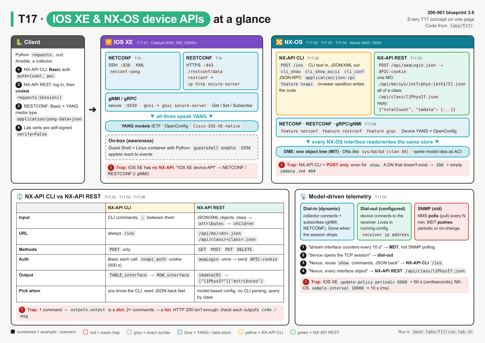
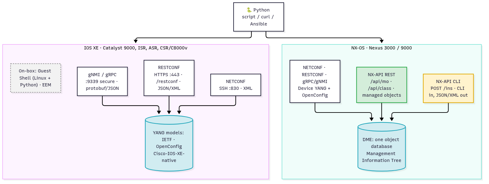
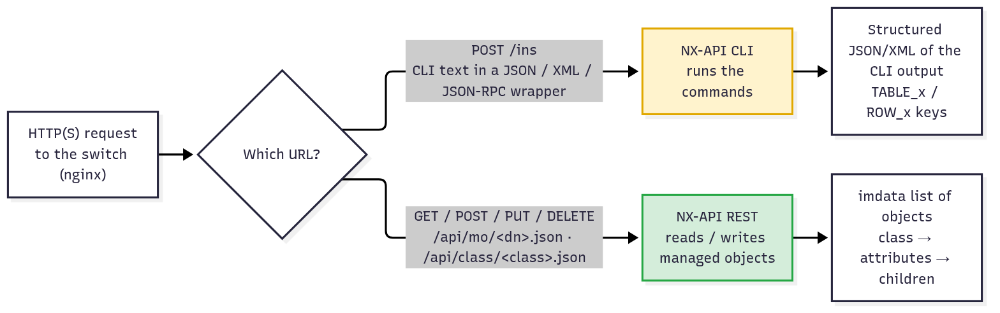
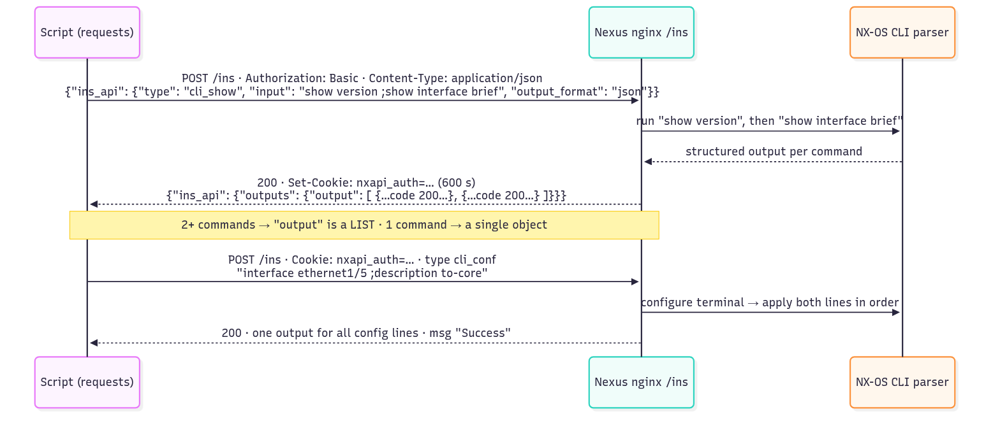
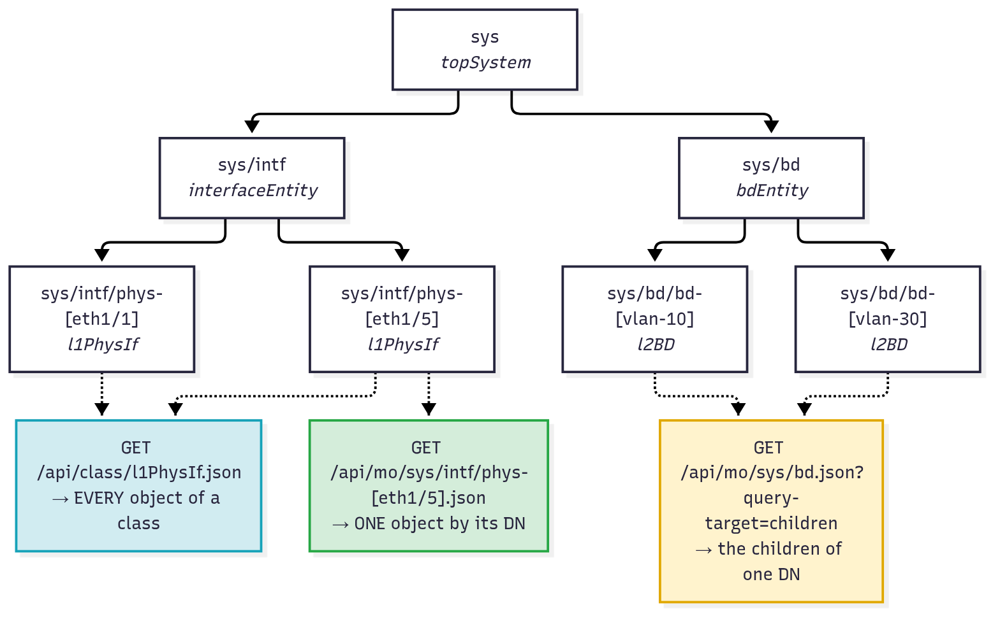
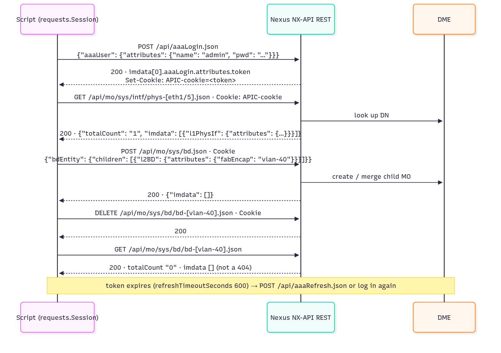
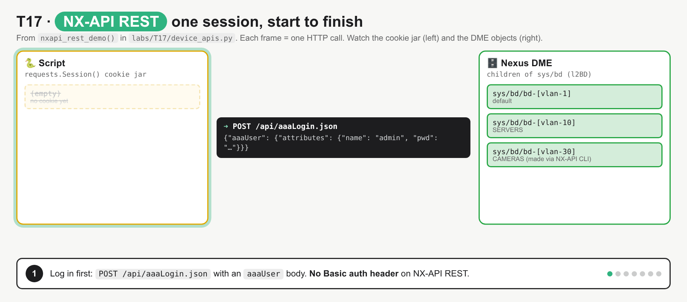
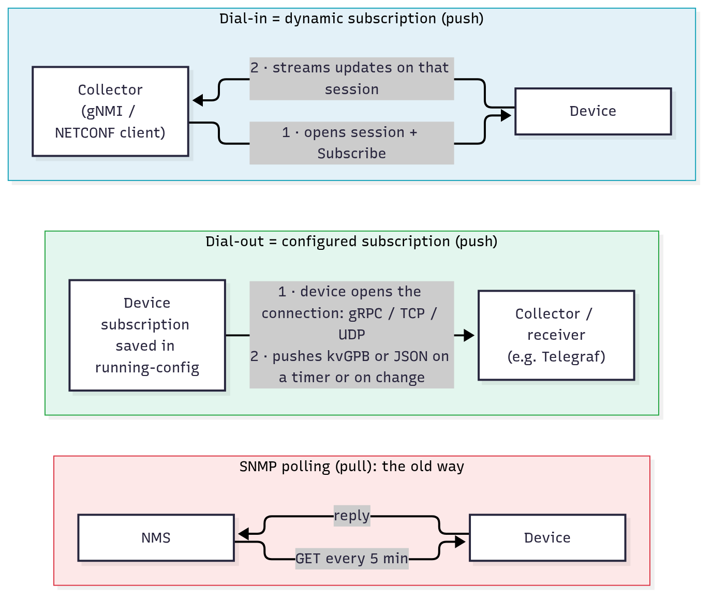
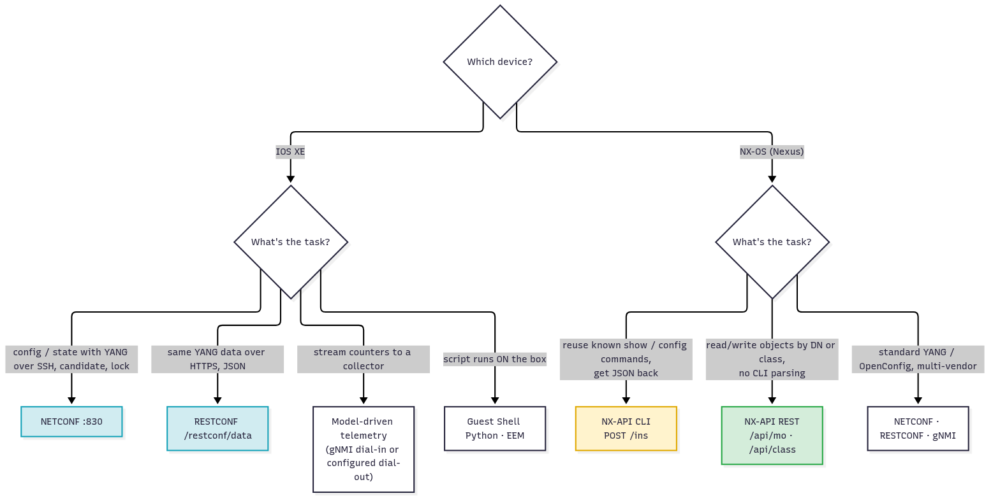

# T17 · IOS XE and NX-OS device-level APIs

> Owner: **Bob** · Blueprint: **3.6** · CBT coverage: **Full** · Learn by 2026-10-11 · Teach-back 2026-10-12



*System map, read left to right: the client, then IOS XE (YANG interfaces), then NX-OS (NX-API CLI, NX-API REST and YANG interfaces, all on one DME). The bottom row compares NX-API CLI with NX-API REST and covers telemetry. Numbered items are examples or scenarios, and red boxes are exam traps.*

## TL;DR (teach-back card)

- **IOS XE = YANG interfaces.** NETCONF (SSH 830), RESTCONF (HTTPS `/restconf`) and gNMI (9339), over IETF / OpenConfig / `Cisco-IOS-XE-native` models. There's no NX-API on IOS XE. Guest Shell (on-box Python) and EEM are awareness-level only.
- **NX-OS has two Cisco APIs on top of the YANG ones, and all of them share one DME.** **NX-API CLI** = CLI text sent in a `POST /ins` (`cli_show` gives structured output, `cli_show_ascii` gives raw text, `cli_conf` configures; JSON, XML or JSON-RPC). **NX-API REST** = DME managed objects: log in with `POST /api/aaaLogin.json` to get the `APIC-cookie`, then use `/api/mo/<dn>.json` for one object or `/api/class/<class>.json` for every object of a class.
- **Telemetry pushes, SNMP pulls.** Dial-in = the collector subscribes over its own session (dynamic). Dial-out = the device connects to the receiver from config in running-config (configured).
- **Trap:** "Nexus + you know the show command + want JSON" → NX-API CLI `/ins`. "Nexus + objects / DN / class" → NX-API REST `/api/mo` or `/api/class`. NX-API CLI is always `POST`, even for `show`.

## Concepts

Every section below explains one part of the same program. Read it once first.

- `labs/T17/mock_devices.py` fakes two devices with the Python standard library: a Nexus (`sbx-n9kv`, NX-API CLI on `/ins` plus NX-API REST on `/api/...`, port 18443) and an IOS XE router (`csr1`, RESTCONF, port 18444). The response shapes follow the Cisco NX-API docs. Both Nexus APIs read and write **one shared state**, the way the real DME works.
- `labs/T17/device_apis.py` (shown below) is the **reference program**. On the Nexus it reads the version and interfaces, sets a description on Ethernet1/5, creates VLAN 30 through NX-API CLI, then creates and deletes VLAN 40 through NX-API REST. On IOS XE it reads one interface with RESTCONF.
- Run both together with `bash labs/T17/run_lab.sh`. To point the same program at a real switch, set `NXOS_URL`, `NXOS_USER` and `NXOS_PASS` (and the `IOSXE_*` equivalents).

**`labs/T17/device_apis.py`**

```python
"""T17 reference program: one interface job done through every device-level API.

Job: on a Nexus, read the version and interfaces, set a description on Ethernet1/5,
create VLAN 30 (CLI) and VLAN 40 (REST), delete VLAN 40; on IOS XE, read one interface.

    NX-API CLI   POST /ins            CLI text in, structured JSON/XML out
    NX-API REST  /api/mo, /api/class  DME managed objects (same model idea as ACI)
    RESTCONF     /restconf/data/...   YANG on IOS XE (full story in T16)

Start the mock devices first:   python3 labs/T17/mock_devices.py
Then:                           python3 labs/T17/device_apis.py
Point at a real switch by setting NXOS_URL, NXOS_USER, NXOS_PASS (and IOSXE_*).
"""
import json
import os

import requests
import urllib3

urllib3.disable_warnings()                       # lab devices use self-signed certs

NXOS = os.environ.get("NXOS_URL", "http://127.0.0.1:18443")
NX_AUTH = (os.environ.get("NXOS_USER", "admin"), os.environ.get("NXOS_PASS", "Admin_1234!"))
IOSXE = os.environ.get("IOSXE_URL", "http://127.0.0.1:18444")
XE_AUTH = (os.environ.get("IOSXE_USER", "admin"), os.environ.get("IOSXE_PASS", "Admin_1234!"))


def ins_api(cmd_type, commands, fmt="json"):
    """NX-API CLI, JSON message format: every call is a POST to /ins."""
    payload = {"ins_api": {"version": "1.0", "type": cmd_type, "chunk": "0", "sid": "1",
                           "input": commands, "output_format": fmt}}
    r = requests.post(f"{NXOS}/ins", json=payload, auth=NX_AUTH, verify=False, timeout=10)
    print(f"\n>>> POST /ins  type={cmd_type}  input={commands!r}")
    print(f"<<< {r.status_code}  Set-Cookie: {r.headers.get('Set-Cookie', '-')}")
    return r


def json_rpc(commands, method="cli"):
    """NX-API CLI, JSON-RPC message format: one object per command, ids 1..n."""
    payload = [{"jsonrpc": "2.0", "method": method, "params": {"cmd": c, "version": 1}, "id": i}
               for i, c in enumerate(commands, start=1)]
    r = requests.post(f"{NXOS}/ins", data=json.dumps(payload), auth=NX_AUTH, verify=False,
                      headers={"Content-Type": "application/json-rpc"}, timeout=10)
    print(f"\n>>> POST /ins  JSON-RPC method={method}  cmds={commands}")
    print(f"<<< {r.status_code}")
    return r


def nxapi_cli_demo():
    print("== 1. NX-API CLI (ins_api JSON) ==")
    out = ins_api("cli_show", "show version").json()["ins_api"]["outputs"]["output"]
    print("    nxos_ver_str:", out["body"]["nxos_ver_str"], "| host_name:", out["body"]["host_name"])

    outs = ins_api("cli_show", "show version ;show interface brief").json()["ins_api"]["outputs"]["output"]
    print("    two commands -> output is a", type(outs).__name__, "of", len(outs))
    for row in outs[1]["body"]["TABLE_interface"]["ROW_interface"]:
        print(f"    {row['interface']:<13} {row['state']}")

    conf = ins_api("cli_conf", "interface ethernet1/5 ;description to-core").json()
    print("    cli_conf msg:", conf["ins_api"]["outputs"]["output"]["msg"])
    text = ins_api("cli_show_ascii", "show running-config interface ethernet1/5")
    print("    raw text body ends:", text.json()["ins_api"]["outputs"]["output"]["body"].splitlines()[-2:])

    bad = ins_api("cli_show", "show vlan bried").json()["ins_api"]["outputs"]["output"]
    print("    inner code:", bad["code"], "| msg:", bad["msg"])

    xml = requests.post(f"{NXOS}/ins", auth=NX_AUTH, verify=False, timeout=10,
                        headers={"Content-Type": "application/xml"},
                        data="<ins_api><version>1.0</version><type>cli_show</type><chunk>0</chunk>"
                             "<sid>1</sid><input>show switchname</input>"
                             "<output_format>xml</output_format></ins_api>")
    print("\n>>> POST /ins  XML message format")
    print("<<<", xml.status_code, xml.text.split("<outputs>")[1].split("</outputs>")[0])

    print("\n== 2. NX-API CLI (JSON-RPC) ==")
    one = json_rpc(["show vlan brief"]).json()
    for row in one["result"]["body"]["TABLE_vlanbriefxbrief"]["ROW_vlanbriefxbrief"]:
        print(f"    vlan {row['vlanshowbr-vlanid-utf']:<4} {row['vlanshowbr-vlanname']}")
    print("    config result:", json_rpc(["vlan 30", "name CAMERAS"]).json())
    print("    error:", json_rpc(["show vlan bried"]).json()["error"]["message"])


def nxapi_rest_demo():
    print("\n== 3. NX-API REST (DME object model) ==")
    s = requests.Session()                       # keeps the APIC-cookie for every later call
    s.verify = False
    login = {"aaaUser": {"attributes": {"name": NX_AUTH[0], "pwd": NX_AUTH[1]}}}
    r = s.post(f"{NXOS}/api/aaaLogin.json", json=login, timeout=10)
    token = r.json()["imdata"][0]["aaaLogin"]["attributes"]["token"]
    print(f">>> POST /api/aaaLogin.json\n<<< {r.status_code}  token={token[:8]}...  cookies={list(s.cookies.keys())}")

    def get(path):
        r = s.get(f"{NXOS}{path}", timeout=10)
        data = r.json()
        print(f">>> GET {path}\n<<< {r.status_code}  totalCount={data['totalCount']}")
        return data["imdata"]

    eth5 = get("/api/mo/sys/intf/phys-[eth1/5].json")[0]["l1PhysIf"]["attributes"]
    print(f"    dn={eth5['dn']}  descr={eth5['descr']!r}  (set earlier via NX-API CLI)")
    print("    l1PhysIf ids:", [o["l1PhysIf"]["attributes"]["id"] for o in get("/api/class/l1PhysIf.json")])
    print("    sys/bd children:", [o["l2BD"]["attributes"]["fabEncap"]
                                    for o in get("/api/mo/sys/bd.json?query-target=children")])

    body = {"bdEntity": {"children": [{"l2BD": {"attributes": {"fabEncap": "vlan-40", "name": "PRINTERS"}}}]}}
    r = s.post(f"{NXOS}/api/mo/sys/bd.json", json=body, timeout=10)
    print(f">>> POST /api/mo/sys/bd.json  (create vlan-40)\n<<< {r.status_code}  {r.json()}")
    print("    new MO:", get("/api/mo/sys/bd/bd-[vlan-40].json")[0]["l2BD"]["attributes"])

    r = s.delete(f"{NXOS}/api/mo/sys/bd/bd-[vlan-40].json", timeout=10)
    print(f">>> DELETE /api/mo/sys/bd/bd-[vlan-40].json\n<<< {r.status_code}")
    print("    after delete:", get("/api/mo/sys/bd/bd-[vlan-40].json"))

    r = requests.get(f"{NXOS}/api/class/l2BD.json", verify=False, timeout=10)   # no cookie
    print(f">>> GET /api/class/l2BD.json  (plain requests.get, no cookie)\n<<< {r.status_code}  "
          f"{r.json()['imdata'][0]['error']['attributes']['text']}")


def iosxe_demo():
    print("\n== 4. IOS XE: RESTCONF (YANG) ==")
    url = f"{IOSXE}/restconf/data/ietf-interfaces:interfaces/interface=GigabitEthernet1"
    r = requests.get(url, auth=XE_AUTH, verify=False, timeout=10,
                     headers={"Accept": "application/yang-data+json"})
    intf = r.json()["ietf-interfaces:interface"]
    print(f">>> GET {url.replace(IOSXE, '')}\n<<< {r.status_code}  {r.headers['Content-Type']}")
    print(f"    {intf['name']}  {intf['ietf-ip:ipv4']['address'][0]['ip']}  enabled={intf['enabled']}")


if __name__ == "__main__":
    nxapi_cli_demo()
    nxapi_rest_demo()
    iosxe_demo()
```

**Output** (`bash labs/T17/run_lab.sh`; the token is random on each run):

```
== 1. NX-API CLI (ins_api JSON) ==

>>> POST /ins  type=cli_show  input='show version'
<<< 200  Set-Cookie: nxapi_auth=mock-nxapi-session; Max-Age=600
    nxos_ver_str: 10.3(3) | host_name: sbx-n9kv

>>> POST /ins  type=cli_show  input='show version ;show interface brief'
<<< 200  Set-Cookie: nxapi_auth=mock-nxapi-session; Max-Age=600
    two commands -> output is a list of 2
    mgmt0         up
    Ethernet1/1   up
    Ethernet1/2   up
    Ethernet1/3   down
    Ethernet1/4   down
    Ethernet1/5   up

>>> POST /ins  type=cli_conf  input='interface ethernet1/5 ;description to-core'
<<< 200  Set-Cookie: nxapi_auth=mock-nxapi-session; Max-Age=600
    cli_conf msg: Success

>>> POST /ins  type=cli_show_ascii  input='show running-config interface ethernet1/5'
<<< 200  Set-Cookie: nxapi_auth=mock-nxapi-session; Max-Age=600
    raw text body ends: ['interface Ethernet1/5', '  description to-core']

>>> POST /ins  type=cli_show  input='show vlan bried'
<<< 400  Set-Cookie: nxapi_auth=mock-nxapi-session; Max-Age=600
    inner code: 400 | msg: Input CLI command error

>>> POST /ins  XML message format
<<< 200 <output><input>show switchname</input><body><hostname>sbx-n9kv</hostname></body><code>200</code><msg>Success</msg></output>

== 2. NX-API CLI (JSON-RPC) ==

>>> POST /ins  JSON-RPC method=cli  cmds=['show vlan brief']
<<< 200
    vlan 1    default
    vlan 10   SERVERS

>>> POST /ins  JSON-RPC method=cli  cmds=['vlan 30', 'name CAMERAS']
<<< 200
    config result: [{'jsonrpc': '2.0', 'result': None, 'id': 1}, {'jsonrpc': '2.0', 'result': None, 'id': 2}]

>>> POST /ins  JSON-RPC method=cli  cmds=['show vlan bried']
<<< 500
    error: Invalid params

== 3. NX-API REST (DME object model) ==
>>> POST /api/aaaLogin.json
<<< 200  token=uxI2kCsO...  cookies=['APIC-cookie']
>>> GET /api/mo/sys/intf/phys-[eth1/5].json
<<< 200  totalCount=1
    dn=sys/intf/phys-[eth1/5]  descr='to-core'  (set earlier via NX-API CLI)
>>> GET /api/class/l1PhysIf.json
<<< 200  totalCount=5
    l1PhysIf ids: ['eth1/1', 'eth1/2', 'eth1/3', 'eth1/4', 'eth1/5']
>>> GET /api/mo/sys/bd.json?query-target=children
<<< 200  totalCount=3
    sys/bd children: ['vlan-1', 'vlan-10', 'vlan-30']
>>> POST /api/mo/sys/bd.json  (create vlan-40)
<<< 200  {'totalCount': '0', 'imdata': []}
>>> GET /api/mo/sys/bd/bd-[vlan-40].json
<<< 200  totalCount=1
    new MO: {'dn': 'sys/bd/bd-[vlan-40]', 'fabEncap': 'vlan-40', 'id': '40', 'name': 'PRINTERS'}
>>> DELETE /api/mo/sys/bd/bd-[vlan-40].json
<<< 200
>>> GET /api/mo/sys/bd/bd-[vlan-40].json
<<< 200  totalCount=0
    after delete: []
>>> GET /api/class/l2BD.json  (plain requests.get, no cookie)
<<< 403  Need a valid webtoken cookie (named APIC-cookie)

== 4. IOS XE: RESTCONF (YANG) ==
>>> GET /restconf/data/ietf-interfaces:interfaces/interface=GigabitEthernet1
<<< 200  application/yang-data+json
    GigabitEthernet1  10.10.20.48  enabled=True
```



*Same script, two platforms. On IOS XE every interface ends in YANG models. On NX-OS every interface (yellow NX-API CLI, green NX-API REST, plus the YANG agents) reads and writes the same DME (blue).*

### T17.01 · IOS XE programmability

**Must cover:**

- [x] NETCONF, RESTCONF, gNMI/gRPC over YANG models
- [x] Model-driven telemetry (streaming)
- [x] On-box Python (guestshell) and EEM (awareness)

**Notes:**

- IOS XE (Catalyst 9000, ISR 1000/4000, ASR 1000, Catalyst 8000 / CSR 1000v) is **model-driven**. Its device-level APIs all carry data defined in **YANG** models (T14):
  | Interface | Transport / port | Encoding | Enable (global config) | Deep dive |
  |---|---|---|---|---|
  | NETCONF | SSH, TCP **830** | XML | `netconf-yang` | [T15](T15-netconf.md) |
  | RESTCONF | HTTPS, TCP **443**, root `/restconf` | JSON or XML (`application/yang-data+json`) | `restconf` + `ip http secure-server` | [T16](T16-restconf.md) |
  | gNMI (gRPC) | HTTP/2, secure port **9339** by default (insecure 50052) | protobuf or JSON_IETF | `gnxi` + `gnxi secure-server` | here |
- Model families: **IETF** (e.g. `ietf-interfaces`), **OpenConfig** (vendor-neutral), and **native** (`Cisco-IOS-XE-native`, which maps to the whole running-config).
- In the program, `iosxe_demo()` does a RESTCONF `GET` of `ietf-interfaces:interfaces/interface=GigabitEthernet1` with Basic auth and `Accept: application/yang-data+json`. The reply's top key is `"ietf-interfaces:interface"` (module:node), which is the YANG fingerprint.
- **gNMI** = gRPC Network Management Interface. It has 4 RPCs: `Capabilities`, `Get`, `Set` and `Subscribe`. `Subscribe` is how a collector dials in for streaming telemetry.
- **Model-driven telemetry (MDT):** the device streams YANG data (periodic or on-change) to a collector, instead of an NMS polling it. See T17.05.
- **On-box (awareness):**
  - **Guest Shell** = a Linux container that runs on the device and includes a Python interpreter. Enable it with `iox`, then `guestshell enable`, then `guestshell run python3`. Inside it, the `cli` module runs IOS commands: `from cli import cli, configure`, then `cli("show version")`.
  - **EEM** (Embedded Event Manager) = on-box automation that runs an action (CLI, syslog, a Python script) when an event happens (a syslog pattern, an interface going down, a timer).
- Exam line: "device-level API on IOS XE" → **NETCONF / RESTCONF** (gNMI if streaming is mentioned). NX-API is Nexus-only.

### T17.02 · NX-API CLI

**Must cover:**

- [x] Send CLI commands over HTTP/HTTPS POST to /ins
- [x] Formats: JSON, XML, JSON-RPC
- [x] Command types: cli_show (structured output), cli_show_ascii (raw text), cli_conf (config)
- [x] Enable with feature nxapi; NX-API sandbox in the browser generates request code

**Notes:**

- **NX-API** = the HTTP/HTTPS interface on Nexus 3000/9000. An nginx web server runs on the switch. **NX-API CLI** is the half of it that takes **CLI commands** in the body of a `POST` to **`/ins`** and returns the output as **structured JSON or XML** instead of screen text.
- Enable and check it (Bob's round-1 commands, confirmed in the 10.5(x) guide):
  ```
  switch(config)# feature nxapi
  switch(config)# nxapi https port 443
  switch(config)# nxapi http port 80
  switch# show nxapi
  ```
  HTTPS 443 is the default and HTTP is off. ⚠ verify: the 10.5(x) guide says that from 9.2(1) NX-API is "enabled by default on HTTPS port 443". For the exam, the enable command is `feature nxapi`.
- **Auth:** HTTP Basic on the request. The first reply sets a session cookie, `nxapi_auth`, which lasts **600 s** (fixed). Sending it back avoids a new login on every call (`Set-Cookie: nxapi_auth=…` lines in the output).
- **Three message formats**, all sent to the same `/ins`:
  | Format | `Content-Type` | Body shape | In the program |
  |---|---|---|---|
  | JSON | `application/json` | `{"ins_api": {"version", "type", "chunk", "sid", "input", "output_format"}}` | `ins_api()` |
  | XML | `application/xml` | `<ins_api><type>…</type><input>…</input>…</ins_api>` | the `show switchname` call |
  | JSON-RPC 2.0 | `application/json-rpc` | a list of `{"jsonrpc": "2.0", "method": "cli", "params": {"cmd": …, "version": 1}, "id": n}` | `json_rpc()` |
- **Command types** (`"type"` in ins_api; the `method` in JSON-RPC):
  | ins_api `type` | JSON-RPC `method` | Use | Output |
  |---|---|---|---|
  | `cli_show` | `cli` | show commands | **structured** (`body` is a dict, e.g. `body["nxos_ver_str"]`) |
  | `cli_show_ascii` | `cli_ascii` | show commands | **raw text**, as on screen (`body` is a string) |
  | `cli_conf` | `cli` (config lines) | configuration | `msg: Success` |
  | `bash` | n/a | Linux bash on the switch (needs `feature bash-shell`) | text |
  | n/a | `cli_array` | show commands | like `cli`, but the body is always wrapped in a list |
- **Several commands in ins_api:** put them in one `input` string separated by **space-semicolon** (`"show version ;show interface brief"`). In JSON-RPC, each command is its own object with its own `id` (`json_rpc(["vlan 30", "name CAMERAS"])`).
- Structured CLI output uses **`TABLE_<x>` → `ROW_<x>`** keys. The program reads `body["TABLE_interface"]["ROW_interface"]` and `body["TABLE_vlanbriefxbrief"]["ROW_vlanbriefxbrief"]`.
- Reply shape: `ins_api.outputs.output` holds one object per show command, each with `input`, `body`, `code` and `msg`. `cli_conf` returns **one** output for all its lines, because config commands need context (`interface …` then `description …`).
  - One command gives a single dict. Two or more give a **list** (`two commands -> output is a list of 2` in the output).
  - Errors are reported **per command**: `code: 400`, `msg: "Input CLI command error"` for the typo `show vlan bried`.
- **NX-API Developer Sandbox:** browse to `https://<switch>` after `feature nxapi`. Type a CLI command, pick NX-API CLI or NX-API REST and a format, and it shows the request and the response and **generates Python** (and other languages) code. It can also convert CLI into an NX-API REST (DME) payload. ⚠ verify: some newer releases also need `nxapi sandbox` to turn the web page on.



*One web server on the switch, two APIs. The URL picks which one: `/ins` (CLI in, CLI output as JSON) or `/api/mo` and `/api/class` (objects).*



*NX-API CLI is always a POST to `/ins`. Two show commands give a list of outputs, and a `cli_conf` batch runs in order inside `configure terminal` and gives one output.*

### T17.03 · NX-API REST

**Must cover:**

- [x] Object model (DME): Management Information Tree of managed objects with DNs, like ACI
- [x] Login POST /api/aaaLogin.json → token cookie
- [x] Read: GET /api/mo/<dn>.json (one object) or /api/class/<class>.json (all of a class)

**Notes:**

- NX-OS keeps its whole config and state in the **DME** (Data Management Engine). The DME is a tree called the **Management Information Tree (MIT)**, made of **managed objects (MOs)**. This is the same model idea as ACI's APIC ([T19](T19-aci.md)), so the URLs, JSON shape and even the cookie name match.
  - Every MO has a **class** (its type: `l1PhysIf` = physical interface, `l2BD` = VLAN/bridge domain, `topSystem` = the root) and a **DN** (distinguished name, its unique path from the root `sys`).
  - DN = the parent DN + `/` + the relative name (RN): `sys` → `sys/intf` → `sys/intf/phys-[eth1/5]`. DME interface ids are lower-case `eth1/5`, not `Ethernet1/5`.
- **Log in first:** `POST /api/aaaLogin.json` with body `{"aaaUser": {"attributes": {"name": …, "pwd": …}}}`. The token comes back in `imdata[0]["aaaLogin"]["attributes"]["token"]` **and** as the cookie **`APIC-cookie`**. Every later call sends that cookie (not a Basic header). It times out (`refreshTimeoutSeconds` 600); call `POST /api/aaaRefresh.json` to renew it, or `/api/aaaLogout.json` to end.
  - In the program, `requests.Session()` stores the cookie automatically (`cookies=['APIC-cookie']`). The last call uses plain `requests.get()` without it and gets **403**.
- **URLs:** `{http|https}://switch/api/{mo|class}/{dn|class}.{json|xml}[?options]`:
  - `GET /api/mo/sys/intf/phys-[eth1/5].json` → **one** object by DN.
  - `GET /api/class/l1PhysIf.json` → **every** object of that class, wherever it sits in the tree (5 interfaces in the output).
  - `?query-target=children` (or `subtree`) → what's under a DN (`sys/bd children: ['vlan-1', 'vlan-10', 'vlan-30']`). `?rsp-subtree=full` returns an object with all its children. `?query-target-filter=eq(l1PhysIf.adminSt,"up")` filters.
  - Bob's round-1 example `/api/class/ipv4Addr.json` (every IPv4 address object) has the same shape.
- **Reply shape:** `{"totalCount": "1", "imdata": [{"<class>": {"attributes": {…}, "children": [...]}}]}`. Read it as `imdata[0]["l1PhysIf"]["attributes"]["descr"]`.
- **Write:** `POST` to a DN with the object in the body creates it or merges into it. The program posts `{"bdEntity": {"children": [{"l2BD": {"attributes": {"fabEncap": "vlan-40", "name": "PRINTERS"}}}]}}` to `/api/mo/sys/bd.json`. `DELETE /api/mo/sys/bd/bd-[vlan-40].json` removes it. The Developer Sandbox lists `POST`, `GET`, `PUT` and `DELETE` for NX-API REST.
- **A missing object isn't a 404.** The `GET` after the delete returns `200` with `totalCount 0` and `imdata []`. Check `totalCount`.
- **One DME:** `descr='to-core'` on `eth1/5` and VLAN 30 were both set through NX-API **CLI**, and NX-API **REST** sees them straight away.
- **Visore** (`https://<switch>/visore.html`) is the browser object-store viewer for finding DNs and classes (awareness). ⚠ verify the path on your release.



*Each box is one managed object: DN on top, class in italics. Green reads one DN, blue reads every object of a class wherever it is, and yellow reads the children of one DN.*



*Log in once, then the `APIC-cookie` goes with every call. Writes go to a DN. A missing object comes back as `200` with an empty `imdata`.*



*`nxapi_rest_demo()` one call per frame: aaaLogin → `200` + `APIC-cookie` → GET children of `sys/bd` → POST creates `vlan-40` → DELETE → GET returns `totalCount 0` (still `200`) → a call without the cookie gets `403`. It fixes two misconceptions: that NX-API REST uses Basic auth or an `Authorization` header on every call (it's a login token sent as a cookie), and that a missing object gives a 404.*

### T17.04 · Other NX-OS interfaces

**Must cover:**

- [x] NETCONF, RESTCONF and gRPC/gNMI with YANG (native and OpenConfig)

**Notes:**

- NX-OS also has the standards-based YANG agents, so the same tools work on Nexus and IOS XE:
  | Agent | Transport | Encoding | Enable ⚠ verify |
  |---|---|---|---|
  | NETCONF | SSH (port 830) | XML | `feature netconf` |
  | RESTCONF | HTTP(S) | XML or JSON | `feature restconf` |
  | gRPC / gNMI | HTTP/2 | Google protobuf | `feature grpc` |
- Two YANG model families on NX-OS:
  - **Device YANG** (Cisco's native NX-OS model, `Cisco-NX-OS-device`). It's a YANG view of the DME, so its paths look like DME (`System/intf-items/phys-items/…`).
  - **OpenConfig** (vendor-neutral, e.g. `openconfig-interfaces`). Use it when one script has to work across vendors.
- Cisco's 10.6(x) guide: "Cisco NX-OS maintains a centralized DME database. The Device and OpenConfig YANG are the wrapping representation of the DME database." So all five Nexus interfaces see the same config.
- NETCONF/RESTCONF mechanics (operations, datastores, URLs, headers) are the same as on IOS XE; see [T15](T15-netconf.md) and [T16](T16-restconf.md).

### T17.05 · Dynamic interfaces

**Must cover:**

- [x] Model-driven telemetry: devices stream data (push) instead of SNMP polling (pull)
- [x] Dial-in (collector subscribes) vs dial-out (device connects to collector)

**Notes:**

- **SNMP polling (pull):** the NMS asks every N minutes. You get coarse data, you miss spikes between polls, and polling costs CPU.
- **Model-driven telemetry (push):** the device streams YANG-modelled data on a timer (**periodic**) or the moment it changes (**on-change**). Encodings are kvGPB (key-value protobuf) or JSON. Transport is gRPC, gNMI, NETCONF, or (NX-OS) also HTTP/UDP.
- **Dial-in = dynamic subscription.** The collector opens the session (gNMI `Subscribe`, NETCONF `establish-subscription`) and the data comes back **on that session**. Nothing goes into the running-config, and the subscription disappears when the session drops or the device reloads.
- **Dial-out = configured subscription.** The subscription is **in the running-config**. The **device** opens the connection to the receiver, reconnects by itself after a reload or switchover, and has a fixed subscription ID.
- IOS XE dial-out (from the 17.15 guide). `update-policy periodic` is in **centiseconds**, so 6000 = 60 s:
  ```
  telemetry ietf subscription 101
   encoding encode-kvgpb
   filter xpath /memory-ios-xe-oper:memory-statistics/memory-statistic
   stream yang-push
   update-policy periodic 6000
   receiver ip address 10.28.35.45 57555 protocol grpc-tcp
  ```
- NX-OS dial-out (from the 10.x guide). The sensor `path` is a **DME DN**, and `sample-interval` is in **milliseconds**, so 10000 = 10 s:
  ```
  feature telemetry
  telemetry
    destination-group 1
      ip address 171.68.197.40 port 50051 protocol gRPC encoding GPB
    sensor-group 1
      path sys/intf depth unbounded
    subscription 1
      dst-grp 1
      snsr-grp 1 sample-interval 10000
  ```
- Not run: there's no collector in the lab. The config above is quoted from the Cisco guides.



*Blue: the collector starts the session (dial-in). Green: the device starts it from config (dial-out). Red: the old pull model.*

### T17.06 · Exam angle

**Must cover:**

- [x] NX-API CLI vs NX-API REST; pick the interface/URL for a task

**Notes:**

| | NX-API CLI | NX-API REST |
|---|---|---|
| Input | CLI commands (`" ;"` between them) | object model: MOs by DN / class |
| Endpoint | `/ins` | `/api/mo/<dn>.json`, `/api/class/<class>.json` |
| HTTP methods | `POST` only | `GET`, `POST`, `PUT`, `DELETE` |
| Auth | Basic (+ `nxapi_auth` cookie, 600 s) | `POST /api/aaaLogin.json` → `APIC-cookie` |
| Output | structured version of the CLI (`TABLE_x`/`ROW_x`), or raw text | object tree (`imdata` → class → `attributes`) |
| Learning curve | low (you know the CLI) | higher (you need the model and the DNs) |
| Good for | quickly reusing known CLI with structured output | model-based config, consistent objects, no CLI parsing, "all objects of type X" |

| Platform | Primary device-level API | Format |
|---|---|---|
| IOS XE | NETCONF, RESTCONF (+ gNMI) | XML / JSON (YANG) |
| NX-OS | NX-API CLI, NX-API REST (+ NETCONF, RESTCONF, gNMI) | JSON / XML |
| IOS XR | NETCONF, gRPC/gNMI (YANG) | XML / protobuf |



*Platform first, then the task. The scenario wording points at one box.*

## Exam traps

- **NX-API is Nexus-only.** An IOS XE question with `/ins` or `aaaLogin` in the options: those are distractors. IOS XE → NETCONF/RESTCONF.
- **NX-API CLI is `POST` only, to `/ins`, even for `show` commands.** A `GET /ins` is wrong (the lab returns `405`).
- **`cli_show` vs `cli_show_ascii`:** structured JSON/XML vs screen text. Commands without structured output (e.g. `show running-config`) need `cli_show_ascii` (`cli_show` gives code `501` "Structured output unsupported" in the lab).
- **`cli_conf` vs `cli_show`:** config lines need `cli_conf`. In ins_api, several commands go in one `input` string separated by **space-semicolon** (`" ;"`). In JSON-RPC, each command is a separate object with its own `id`.
- **Content-Type picks the format:** `application/json` (ins_api) vs `application/json-rpc` vs `application/xml`. JSON-RPC methods are `cli` / `cli_ascii`, not `cli_show`.
- **`/api/mo` vs `/api/class`:** mo + DN = one object; class + class name = every object of that class. A DN contains brackets (`phys-[eth1/5]`), so curl needs `--globoff`.
- **NX-API REST auth is a login + cookie (`APIC-cookie`),** not a Basic header on each call. NX-API CLI's cookie is `nxapi_auth`. Mixing the two up is a classic distractor.
- **Missing DN → `200` with `totalCount "0"` and `imdata []`,** not `404`. And NX-API CLI errors sit **inside** each `output` (`code`, `msg`), so check them as well as the HTTP status.
- **1 vs many outputs:** one command → `outputs["output"]` is a dict; two or more → a list. Code that indexes `["body"]` breaks when a second command is added.
- **Dial-in vs dial-out:** who opens the connection. Collector → device = dial-in (dynamic, not in config). Device → collector = dial-out (configured, survives a reload).
- **Telemetry is push, SNMP is pull.** "Real-time / sub-minute / on-change" → MDT.
- **Units:** IOS XE `update-policy periodic` is in centiseconds; NX-OS `sample-interval` is in milliseconds.

## Examples

### 1. Run the reference program

Needs Python 3, `requests` and curl. No switch and no DevNet sandbox needed.

```bash
python3 -m venv /tmp/t17-venv && /tmp/t17-venv/bin/pip install requests
PYTHON=/tmp/t17-venv/bin/python bash labs/T17/run_lab.sh          # mock devices + device_apis.py
bash labs/T17/run_lab.sh labs/T17/curl_drill.sh                   # mock devices + curl drill
```

Or by hand, in two terminals:

```bash
python3 labs/T17/mock_devices.py                                  # terminal 1: leave running
python3 labs/T17/device_apis.py                                   # terminal 2 (needs requests)
```

In the lab container (`requests` is already installed there):

```bash
docker build --tag ccna-auto-lab:latest --file labs/Dockerfile labs/
docker run --rm --volume "$(pwd)":/work --workdir /work ccna-auto-lab:latest bash labs/T17/run_lab.sh
```

Against a real Nexus (e.g. a reserved DevNet Nexus sandbox): `export NXOS_URL=https://<switch> NXOS_USER=<user> NXOS_PASS=<pass>`, then `python3 labs/T17/device_apis.py`. Comment out `iosxe_demo()` unless `IOSXE_URL` points at a router that has an interface named GigabitEthernet1.

### 2. curl drill (`labs/T17/curl_drill.sh`)

```bash
#!/usr/bin/env bash
# T17 curl drill: NX-API CLI, NX-API REST and IOS XE RESTCONF with plain curl.
# Run via:  bash labs/T17/run_lab.sh labs/T17/curl_drill.sh   (starts the mock devices first)
# Real switch: export NXOS_URL=https://<switch> NXOS_USER=... NXOS_PASS=...
set -u
NXOS="${NXOS_URL:-http://127.0.0.1:18443}"
IOSXE="${IOSXE_URL:-http://127.0.0.1:18444}"
NX_USER="${NXOS_USER:-admin}"; NX_PASS="${NXOS_PASS:-Admin_1234!}"
XE_USER="${IOSXE_USER:-admin}"; XE_PASS="${IOSXE_PASS:-Admin_1234!}"
JAR="$(mktemp)"; trap 'rm -f "$JAR"' EXIT

echo "== 1. NX-API CLI, ins_api JSON: POST /ins with Basic auth =="
curl --silent --insecure --user "$NX_USER:$NX_PASS" \
  --header "Content-Type: application/json" \
  --data '{"ins_api": {"version": "1.0", "type": "cli_show", "chunk": "0", "sid": "1", "input": "show switchname", "output_format": "json"}}' \
  "$NXOS/ins"
echo

echo "== 2. NX-API CLI, JSON-RPC: Content-Type application/json-rpc =="
curl --silent --insecure --user "$NX_USER:$NX_PASS" \
  --header "Content-Type: application/json-rpc" \
  --data '[{"jsonrpc": "2.0", "method": "cli_ascii", "params": {"cmd": "show switchname", "version": 1}, "id": 1}]' \
  "$NXOS/ins"
echo

echo "== 3. NX-API CLI with GET: wrong method =="
curl --silent --insecure --user "$NX_USER:$NX_PASS" --output /dev/null \
  --write-out "HTTP %{http_code}\n" "$NXOS/ins"

echo "== 4. NX-API REST: aaaLogin, cookie saved to a jar =="
curl --silent --insecure --cookie-jar "$JAR" \
  --header "Content-Type: application/json" \
  --data "{\"aaaUser\": {\"attributes\": {\"name\": \"$NX_USER\", \"pwd\": \"$NX_PASS\"}}}" \
  --output /dev/null --write-out "HTTP %{http_code}\n" \
  "$NXOS/api/aaaLogin.json"
grep --only-matching "APIC-cookie" "$JAR"

echo "== 5. NX-API REST: GET one MO by DN (cookie sent back) =="
curl --silent --insecure --globoff --cookie "$JAR" \
  "$NXOS/api/mo/sys/intf/phys-[eth1/1].json"
echo

echo "== 6. NX-API REST: GET without the cookie =="
curl --silent --insecure --globoff --write-out "\nHTTP %{http_code}\n" \
  "$NXOS/api/class/l1PhysIf.json"

echo "== 7. IOS XE RESTCONF: GET with Basic auth and the YANG media type =="
curl --silent --insecure --user "$XE_USER:$XE_PASS" \
  --header "Accept: application/yang-data+json" \
  "$IOSXE/restconf/data/ietf-interfaces:interfaces/interface=GigabitEthernet1"
echo
```

Output (`bash labs/T17/run_lab.sh labs/T17/curl_drill.sh`):

```
== 1. NX-API CLI, ins_api JSON: POST /ins with Basic auth ==
{"ins_api": {"type": "cli_show", "version": "1.0", "sid": "eoc", "outputs": {"output": {"input": "show switchname", "body": {"hostname": "sbx-n9kv"}, "code": "200", "msg": "Success"}}}}
== 2. NX-API CLI, JSON-RPC: Content-Type application/json-rpc ==
{"jsonrpc": "2.0", "result": {"msg": "sbx-n9kv\n"}, "id": 1}
== 3. NX-API CLI with GET: wrong method ==
HTTP 405
== 4. NX-API REST: aaaLogin, cookie saved to a jar ==
HTTP 200
APIC-cookie
== 5. NX-API REST: GET one MO by DN (cookie sent back) ==
{"totalCount": "1", "imdata": [{"l1PhysIf": {"attributes": {"id": "eth1/1", "descr": "to-server1", "adminSt": "up", "mtu": "1500", "mode": "access", "layer": "Layer2", "dn": "sys/intf/phys-[eth1/1]"}}}]}
== 6. NX-API REST: GET without the cookie ==
{"totalCount": "1", "imdata": [{"error": {"attributes": {"code": "403", "text": "Need a valid webtoken cookie (named APIC-cookie)"}}}]}
HTTP 403
== 7. IOS XE RESTCONF: GET with Basic auth and the YANG media type ==
{"ietf-interfaces:interface": {"name": "GigabitEthernet1", "description": "MANAGEMENT INTERFACE - DON'T TOUCH ME", "type": "iana-if-type:ethernetCsmacd", "enabled": true, "ietf-ip:ipv4": {"address": [{"ip": "10.10.20.48", "netmask": "255.255.255.0"}]}, "ietf-ip:ipv6": {}}}
```

- Step 4 uses `--cookie-jar` to save the `APIC-cookie`, and step 5 sends it back with `--cookie`. Step 6 shows what happens without it.
- `--globoff` stops curl from treating `[eth1/1]` as a URL range.

### 3. Break it on purpose

Edit `labs/T17/device_apis.py`, run `bash labs/T17/run_lab.sh`, then `git checkout -- labs/T17/device_apis.py` to undo. All four were run on a throwaway copy; the result shown is the real output.

| Edit | First changed output | Lesson |
|---|---|---|
| In `nxapi_cli_demo()`, change `ins_api("cli_show_ascii", "show running-config …")` to `"cli_show"` | `<<< 400`, then `KeyError: 'body'` (the inner output is code `501` "Structured output unsupported") | running-config is text only, so use `cli_show_ascii` |
| In `json_rpc()`, delete `headers={"Content-Type": "application/json-rpc"},` | `>>> POST /ins  JSON-RPC …` → `<<< 415`, then `KeyError: 'result'` | the Content-Type tells NX-API which format the body is in (the mock returns 415; a real switch errors differently ⚠ verify) |
| In `nxapi_rest_demo()`, inside `get()`, replace `s.get(…)` with `requests.get(f"{NXOS}{path}", verify=False, timeout=10)` | `>>> GET /api/mo/sys/intf/phys-[eth1/5].json` → `<<< 403`, then `KeyError: 'l1PhysIf'` | the cookie lives in the Session, so a plain `requests.get` drops it |
| In `ins_api()`, delete `auth=NX_AUTH, ` | `<<< 401  Set-Cookie: -`, then `JSONDecodeError` (the 401 body is HTML) | NX-API CLI needs Basic auth; check `status_code` before `.json()` |

### 4. Bob's round-1 snippet: NX-API CLI with JSON-RPC

The same call as `json_rpc()`, written flat. This is the shape the NX-API Developer Sandbox generates, and the shape exam code questions use:

```python
import json
import os

import requests

url = os.environ.get("NXOS_URL", "http://127.0.0.1:18443") + "/ins"
hdr = {"content-type": "application/json-rpc"}
payload = [{"jsonrpc": "2.0", "method": "cli",
            "params": {"cmd": "show interface brief", "version": 1}, "id": 1}]
r = requests.post(url, data=json.dumps(payload), headers=hdr,
                  auth=(os.environ.get("NXOS_USER", "admin"), os.environ.get("NXOS_PASS", "Admin_1234!")),
                  verify=False)
print(r.json()["result"]["body"]["TABLE_interface"]["ROW_interface"][1])
```

Output, run against the mock (`python3 labs/T17/mock_devices.py` in another terminal):

```
{'interface': 'Ethernet1/1', 'vlan': '1', 'type': 'eth', 'portmode': 'access', 'state': 'up', 'state_rsn_desc': 'none', 'speed': '1000', 'ratemode': 'D'}
```

- With **one** JSON-RPC object, the reply is a single object, so `r.json()["result"]` works. With two or more, it's a list (`r.json()[0]["result"]`).

### 5. IOS XE on-box (awareness, not run)

```
Router(config)# iox
Router# guestshell enable
Router# guestshell run python3
>>> from cli import cli, configure
>>> print(cli("show ip interface brief"))
>>> configure(["interface Loopback100", "description set from guestshell"])
```

## Practice questions

**Q1.** A script must collect `show interface brief` from 40 Nexus 9000 switches and parse the result as JSON, with the least effort for an engineer who knows the CLI. Which API and URL?
A. RESTCONF `GET /restconf/data/ietf-interfaces:interfaces`  B. NX-API CLI `POST /ins` with `type` `cli_show`  C. NX-API REST `GET /api/mo/sys.json`  D. NX-API CLI `GET /ins?cmd=show+interface+brief`

<details><summary>Answer</summary>

**B.** NX-API CLI takes the known CLI command and returns structured JSON. It's always a POST to `/ins` (so D is wrong). A and C work but need model knowledge. (T17.02, T17.06)
</details>

**Q2.** Complete the payload so the switch returns the running-config of Ethernet1/5 exactly as it appears on screen:

```json
{"ins_api": {"version": "1.0", "type": "__________", "chunk": "0", "sid": "1",
             "input": "show running-config interface ethernet1/5", "output_format": "json"}}
```

<details><summary>Answer</summary>

**`cli_show_ascii`.** It returns raw text. `cli_show` asks for structured output, which running-config doesn't have (the lab returns code 501). (T17.02)
</details>

**Q3.** Refer to the code:

```python
s = requests.Session()
s.post(f"{NXOS}/api/aaaLogin.json", json=login, verify=False)
r = s.get(f"{NXOS}/api/class/l1PhysIf.json", verify=False)
```

What does the GET return?
A. One interface, the one whose DN matches `l1PhysIf`  B. Every physical-interface object on the switch  C. A 404, because the URL has no DN  D. The raw text of `show interface`

<details><summary>Answer</summary>

**B.** `/api/class/<class>` returns every MO of that class. `/api/mo/<dn>` returns one. The Session sends the `APIC-cookie` from the login. (T17.03)
</details>

**Q4.** After `aaaLogin` succeeds, which header carries the authentication on later NX-API REST calls?
A. `Authorization: Basic …`  B. `X-Auth-Token: …`  C. `Cookie: APIC-cookie=…`  D. `Authorization: Bearer …`

<details><summary>Answer</summary>

**C.** The token is returned in the `aaaLogin` body and set as the `APIC-cookie`, the same scheme ACI uses. `X-Auth-Token` is Catalyst Center's header. (T17.03)
</details>

**Q5.** Put the NX-API REST steps in order to create VLAN 40 and confirm it: `GET /api/mo/sys/bd/bd-[vlan-40].json` · `POST /api/aaaLogin.json` · `POST /api/mo/sys/bd.json` with an `l2BD` child · read `token` from `imdata[0]`

<details><summary>Answer</summary>

`POST /api/aaaLogin.json` → read `token` from `imdata[0]` (the cookie is set) → `POST /api/mo/sys/bd.json` with the `l2BD` child → `GET /api/mo/sys/bd/bd-[vlan-40].json` to check that `totalCount` is `"1"`. (T17.03)
</details>

**Q6.** An operations team wants interface counters from IOS XE routers every 10 seconds. The routers must reconnect to the collector by themselves after a reload, and the subscription must be visible in the running-config. Which option fits?
A. SNMP polling every 10 s  B. gNMI dial-in Subscribe from the collector  C. A configured (dial-out) telemetry subscription  D. A RESTCONF GET loop

<details><summary>Answer</summary>

**C.** Configured subscription = dial-out: it's in the running-config, the device opens the connection and reconnects after a reload. Dial-in (B) is dynamic and dies with the session. A and D are polling (pull). (T17.05)
</details>

**Q7.** Which two are device-level APIs on a Catalyst 9300 running IOS XE? (Choose two.)
A. NX-API CLI  B. RESTCONF  C. NETCONF  D. NX-API REST  E. APIC REST

<details><summary>Answer</summary>

**B, C.** IOS XE exposes YANG through NETCONF and RESTCONF (and gNMI). NX-API is Nexus-only. APIC is the ACI controller. (T17.01)
</details>

**Q8.** A script sends `"input": "show version ;show interface brief"` with `type` `cli_show` and then runs `print(r.json()["ins_api"]["outputs"]["output"]["body"])`. What happens?
A. It prints both bodies merged  B. It fails, because `output` is now a list of two outputs  C. The switch rejects two commands in one request  D. It prints only the first body

<details><summary>Answer</summary>

**B.** One command gives a dict, and two or more give a list, so index first: `["output"][1]["body"]`. The `" ;"` separator is valid. (T17.02)
</details>

## Study aids

| Aid | Type | Title | Est. min | Resource |
|---|---|---|---|---|
| T17.1 | Video | Nexus Programmability with NX-API CLI | 30 | CBT module |
| T17.2 | Video | Nexus Programmability with NX-API REST | 36 | CBT module |
| T17.3 | Video | Real-World Nexus Automation for Real-World Network Engineers (optional) | 28 | CBT module |

- Skip / low priority: Real-World Nexus video (optional)
- Lab: `bash labs/T17/run_lab.sh` (reference program) and `bash labs/T17/run_lab.sh labs/T17/curl_drill.sh`.

## Sources

- Overview image: HTML source `assets/T17/00-overview.html`, rendered to PNG (see `assets/README.md`). Diagrams: Mermaid sources in `assets/T17/*.mmd`. Animation: `assets/T17/08-nxapi-rest-session-anim.html` → `.gif`.
- Cisco Nexus 9000 NX-OS Programmability Guide 10.5(x), NX-API CLI (enable commands, HTTPS 443 default, `nxapi_auth` cookie 600 s, request/response elements, XML/JSON examples, curl example): https://www.cisco.com/c/en/us/td/docs/dcn/nx-os/nexus9000/105x/programmability/cisco-nexus-9000-series-nx-os-programmability-guide-105x/m-n9k-nx-api-cli-101x.html
- Same guide 9.3(x), NX-API CLI (JSON-RPC methods `cli`, `cli_ascii`, `cli_array`; `configure terminal` runs first for JSON-RPC): https://www.cisco.com/c/en/us/td/docs/switches/datacenter/nexus9000/sw/93x/progammability/guide/b-cisco-nexus-9000-series-nx-os-programmability-guide-93x/b-cisco-nexus-9000-series-nx-os-programmability-guide-93x_chapter_010011.html
- Same guide 10.2(x)/10.3(x), NX-API Developer Sandbox (message formats and command types; NXAPI-REST methods POST/GET/PUT/DELETE; code generation; CLI↔REST conversion): https://www.cisco.com/c/en/us/td/docs/dcn/nx-os/nexus9000/102x/programmability/cisco-nexus-9000-series-nx-os-programmability-guide-release-102x/m-n9k-nx-api-developer-sandbox-101x.html
- Same guide 9.3(x), NX-API REST: https://www.cisco.com/c/en/us/td/docs/switches/datacenter/nexus9000/sw/93x/progammability/guide/b-cisco-nexus-9000-series-nx-os-programmability-guide-93x/b-cisco-nexus-9000-series-nx-os-programmability-guide-93x_chapter_0101110.html
- DevNet, NX-API REST SDK, Logging in (`aaaUser` body, `aaaLogin` token, `refreshTimeoutSeconds`): https://developer.cisco.com/docs/cisco-nexus-3000-and-9000-series-nx-api-rest-sdk-user-guide-and-api-reference/latest/logging-in
- DevNet, NX-API REST SDK, Getting Started (`query-target` self/children/subtree, filters, `totalCount`/`imdata` replies, Visore): https://developer.cisco.com/docs/cisco-nexus-3000-and-9000-series-nx-api-rest-sdk-user-guide-and-api-reference/latest/getting-started-with-the-cisco-nexus-3000-and-9000-series-nx-api-rest-sdk
- DevNet, NX-API CLI Developer Sandbox (enabled with `feature nxapi`, browse to the switch IP): https://developer.cisco.com/docs/nx-os/nx-api-cli-developer-sandbox
- Cisco APIC REST API Configuration Guide (`/api/mo|class/…{json|xml}` URI form, the same as NX-API REST): https://www.cisco.com/c/en/us/td/docs/dcn/aci/apic/all/apic-rest-api-configuration-guide/cisco-apic-rest-api-configuration-guide/m_using_the_rest_api.html
- Nexus 9000 Programmability Guide 10.6(x), Overview (NETCONF/RESTCONF/gRPC agents table; the DME as the central database, wrapped by Device and OpenConfig YANG): https://www.cisco.com/c/en/us/td/docs/dcn/nx-os/nexus9000/106x/programmability/cisco-nexus-9000-series-nx-os-programmability-guide-106x/chapter-1.html
- Nexus 9000 Programmability Guide 10.5(x), Telemetry (dial-out config, DME sensor paths, sample-interval): https://www.cisco.com/c/en/us/td/docs/dcn/nx-os/nexus9000/105x/programmability/cisco-nexus-9000-series-nx-os-programmability-guide-105x/chapter-3.html
- IOS XE 17.15 Programmability Configuration Guide, Model-Driven Telemetry (dynamic = dial-in, configured = dial-out; config example; transports and encodings): https://www.cisco.com/c/en/us/td/docs/ios-xml/ios/prog/configuration/1715/b_1715_programmability_cg/m_1715_prog_ietf_telemetry.html
- IOS XE 17.18 Programmability Configuration Guide, gNMI (`gnxi secure-server`, default secure port 9339; insecure default 50052 from the 17.14 PDF): https://www.cisco.com/c/en/us/td/docs/ios-xml/ios/prog/configuration/1718/b-1718-programmability-cg/gnmi.html
- IOS XE Programmability Configuration Guide, Guest Shell (`guestshell enable`, `guestshell run python`): https://www.cisco.com/c/en/us/td/docs/ios-xml/ios/prog/configuration/26x/26x-programmability-cg/guest_shell.html
- Cisco 200-901 v1.1 exam topics (3.6): https://learningcontent.cisco.com/documents/marketing/exam-topics/200-901-CCNAAUTO_v.1.1.pdf

## To verify

- ⚠ **Not run against a live sandbox.** `sbx-nxos-mgmt.cisco.com` and `devnetsandboxiosxe.cisco.com` were reachable on 10 Oct 2026, but both rejected the published default credentials (`401` / `access-denied`), so the program ran against `labs/T17/mock_devices.py`. The mock follows the documented response shapes, but these details are mock behaviour and still need checking on a real Nexus:
  - the HTTP status when a command fails (the mock returns `400` for ins_api and `500` for JSON-RPC);
  - the JSON-RPC error object (`-32602 Invalid params`);
  - the `415` for a missing Content-Type;
  - the exact 403 text when the cookie is missing;
  - that a single-command reply is a dict and a multi-command reply is a list.
- ⚠ NX-API enabled by default: the 10.5(x) guide says "Starting with Cisco NX-OS Release 9.2(1), the NX-API feature is enabled by default on HTTPS port 443." Check with `show feature | include nxapi` on a sandbox. Exam answer: `feature nxapi`.
- ⚠ Whether `nxapi sandbox` is needed to turn on the browser sandbox on 9.3+/10.x.
- ⚠ Visore path (`/visore.html`) on standalone NX-OS.
- ⚠ The NX-OS `feature netconf` / `feature restconf` / `feature grpc` command names (from prior knowledge; the agents themselves are confirmed in the 10.6 guide).
- ⚠ Code `501` "Structured output unsupported" for `cli_show` on running-config. It's mock behaviour based on the documented NX-API response-code table, which wasn't re-read this session.
- **Fixes to Bob's round-1 note:**
  - The comparison table said NX-API REST verbs are "GET/POST/DELETE". The Developer Sandbox doc lists **POST, GET, PUT, DELETE**, so PUT was added.
  - The line "Auth: Basic, or session cookie via `aaaLogin`" mixed up the two APIs. NX-API CLI uses Basic (plus the `nxapi_auth` cookie). NX-API REST uses the `aaaLogin` token as the `APIC-cookie`. The two are now split.
- The IOS XE Guest Shell example (Example 5) and both telemetry configs weren't run (no IOS XE device or collector in the lab).
- Docker command in Example 1: not run here, because the lab image isn't built on this machine. Locally the program ran with Python 3.10 + requests 2.34 in a venv.
