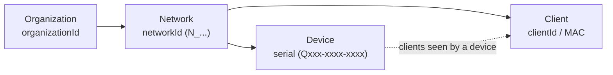

# T18 · Meraki

> Owner: **Bob** · Blueprint: **3.1, 3.2, 3.9** · CBT coverage: **Full** · Learn by 2026-10-13 · Teach-back 2026-10-16

## TL;DR (teach-back card)

- **Cloud-managed, no on-prem controller.** MX (security/SD-WAN appliance), MS (switch), MR (wireless AP), MV (camera) are all configured in the Meraki dashboard. The **Dashboard API** (REST, `https://api.meraki.com/api/v1`) is the way in.
- **Auth = API key as a bearer token** (`Authorization: Bearer <key>`). Hierarchy to walk: **organization → network → device (by serial) → client**. You need the org ID before the network ID, and the network ID before devices or clients.
- **Limit: 10 requests/s per organization** (+10 burst in the first second); over it → **HTTP 429 + `Retry-After`**. Lists are paginated via the **`Link` header** (`perPage`, `startingAfter`). The Python SDK (`pip install meraki`) retries on 429 and can fetch all pages.
- **Trap:** the Dashboard API (*you* poll the cloud) is not the Scanning API / webhooks (*the cloud* POSTs to *your* server). Different direction, different use.

## Concepts

### T18.01 · Platform

**Must cover:**

- [x] Cloud-managed networking (MX security appliance, MS switch, MR wireless, MV camera)
- [x] Managed in the Meraki dashboard; no on-prem controller

**Notes:**

- High-level idea: **management plane lives in the Meraki cloud; devices phone home and pull config**. There is no controller to install or patch.
- Product families (letter code = product line):

| Code | Product | Notes |
|---|---|---|
| MX | Security / SD-WAN appliance | Firewall, VPN, uplinks |
| MS | Switch | |
| MR | Wireless access point | |
| MV | Smart camera | Edge analytics (see MV Sense, T18.02) |

- Other families exist (e.g. MG cellular gateway, MT sensors); not the focus of the exam.
- Everything you can click in the dashboard is also an API operation, so **dashboard = GUI, Dashboard API = programmatic equivalent**.
- API access must be **enabled for the organization** before keys work, and each admin generates their own key.
- Blueprint 3.2 asks you to recognise Meraki as a *network management platform* (alongside Catalyst Center, ACI, SD-WAN, NSO). Meraki's differentiator: **fully cloud-hosted**.

### T18.02 · APIs

**Must cover:**

- [x] Dashboard API: REST, base https://api.meraki.com/api/v1
- [x] Scanning API: location data POSTed to your server (webhook-style)
- [x] MV Sense: camera analytics (REST/MQTT)
- [x] Webhooks for alerts; captive portal APIs (awareness)

**Notes:**

- Meraki exposes **several different APIs**; match the name to the job.

| API | Direction | What it does |
|---|---|---|
| **Dashboard API** | You → cloud (REST, GET/POST/PUT/DELETE) | Configure and monitor orgs, networks, devices, clients. The main one |
| **Scanning API** | Cloud → your server (HTTP POST of JSON) | Real-time Wi-Fi and BLE device location/presence from APs, batched roughly every minute per AP |
| **MV Sense** | REST and MQTT | Camera analytics (people counting, line crossing, occupancy); MQTT/custom CV needs a paid licence |
| **Webhooks** | Cloud → your HTTPS server | Alert notifications; optional `sharedSecret` the receiver can check |
| **Captive portal (splash)** | Cloud ↔ your web app | Custom login/splash page for guest Wi-Fi (awareness only) |

- Dashboard API base URI: `https://api.meraki.com/api/v1`. Some regional dashboards (e.g. Canada, China, India, US FedRAMP) use a different base URI.
- Dashboard API is **RESTful JSON over HTTPS**; responses are JSON lists/objects; standard HTTP verbs and status codes (200, 201, 204, 400, 401, 404, 429).
- Webhook receivers must be reachable over **HTTPS with a valid certificate** on a public server.
- "Webhook-style" for Scanning API = you publish an endpoint and the cloud pushes to it (see T43 webhooks).

### T18.03 · Authentication

**Must cover:**

- [x] API key generated in the dashboard user profile
- [x] Header X-Cisco-Meraki-API-Key: <key> or Authorization: Bearer <key>

**Notes:**

- High-level idea: **one static API key per admin identity, sent on every request**. It carries that admin's permissions, so a read-only admin gets a read-only key.
- Generating a key: dashboard → **Organization → API & Webhooks → API keys and access** (older material says *My profile* → API access). ⚠ verify the menu path.
- Header options:
  - `Authorization: Bearer <key>` → the **v1 standard** (current docs).
  - `X-Cisco-Meraki-API-Key: <key>` → the **v0 style header**, still seen in many examples (e.g. MV Sense sample). ⚠ verify it is still accepted on v1.
- Treat the key like a password: read it from an **environment variable**, never commit it.
- API **redirects** requests to the org's shard. In curl use `-L` plus `--location-trusted` so the `Authorization` header is re-sent after the redirect (Postman: enable "Follow Authorization header").
- No OAuth needed for basic scripts; the dashboard also supports an OAuth2 flow for integrations (awareness).

### T18.04 · Hierarchy and endpoints

**Must cover:**

- [x] organizations → networks → devices (by serial) → clients
- [x] GET /organizations; /organizations/{orgId}/networks; /networks/{networkId}/devices; /networks/{networkId}/clients

**Notes:**

- Object hierarchy (each level's ID feeds the next call):



- Endpoints to know (all under `https://api.meraki.com/api/v1`):

| Goal | Method + path | SDK call |
|---|---|---|
| List orgs | `GET /organizations` | `dashboard.organizations.getOrganizations()` |
| List networks in an org | `GET /organizations/{organizationId}/networks` | `dashboard.organizations.getOrganizationNetworks(org_id)` |
| List devices in a network | `GET /networks/{networkId}/devices` | `dashboard.networks.getNetworkDevices(net_id)` |
| List devices in an org | `GET /organizations/{organizationId}/devices` | `dashboard.organizations.getOrganizationDevices(org_id)` |
| List clients in a network | `GET /networks/{networkId}/clients` | `dashboard.networks.getNetworkClients(net_id)` |
| One client | `GET /networks/{networkId}/clients/{clientId}` | `dashboard.networks.getNetworkClient(net_id, client_id)` |
| Clients of one device | `GET /devices/{serial}/clients` | `dashboard.devices.getDeviceClients(serial)` |

- Devices are addressed by **serial number**, not by ID. Networks have IDs like `N_123456...`; orgs have numeric IDs (as strings).
- Python SDK naming: `dashboard.<scope>.<operationId>()` where scope = first tag of the OpenAPI spec (organizations, networks, devices, wireless, appliance, switch, camera ...).
- Response example (network list): `[{"id": "N_1234", "organizationId": "12345678", "type": "wireless", "name": "My network", "timeZone": "US/Pacific", "tags": null}]` ⚠ shape from docs example; fields vary by network type.

### T18.05 · Constraints

**Must cover:**

- [x] Rate limit ~10 requests/second per organisation → 429 + Retry-After
- [x] Pagination via Link header (rel=next) and startingAfter/perPage

**Notes:**

- **Rate limits** (Dashboard API):
  - **10 requests/second per organization**, shared by *all* applications using that org's keys.
  - Burst allowance: **+10 extra requests in the first second** (max 30 in 2 s).
  - **100 requests/second per source IP**.
  - Over the limit → **HTTP 429**; the `Retry-After` header says how long to wait. Body: `{"errors": ["API rate limit exceeded for organization"]}`.
- Handling 429: read `Retry-After`, sleep, retry (add backoff). The SDK does this automatically.
- Reduce calls: use **org-wide** operations (e.g. `getOrganizationDevices`) instead of looping per-network/per-device; `getNetworkClients` instead of per-device `getDeviceClients`.
- **Pagination** (for paginated operations):
  - `perPage` = records per page; `startingAfter` / `endingBefore` = opaque tokens.
  - Response header **`Link`** carries up to four URLs: `rel=first`, `prev`, `next`, `last`. **Follow the `next` URL**; don't build tokens yourself.
  - In `requests`: `resp.links["next"]["url"]`.
  - In the SDK: pass `total_pages="all"` (or an int) to fetch pages automatically.
- `getNetworkClients` time window: `timespan` in seconds, default 1 day, max 31 days; data refreshed at most every five minutes.

### T18.06 · Python SDK

**Must cover:**

- [x] pip install meraki
- [x] dashboard = meraki.DashboardAPI(api_key)
- [x] dashboard.organizations.getOrganizations(); dashboard.networks.getNetworkClients(net_id)
- [x] SDK handles retries on 429 and pagination

**Notes:**

- Install: `pip install meraki`. Import: `import meraki`.
- Create the client: `dashboard = meraki.DashboardAPI(api_key)`. With no argument it reads the key from an environment variable (documented name `MERAKI_DASHBOARD_API_KEY` ⚠ verify).
- Call pattern: **`dashboard.<scope>.<operation>(args)`**.
  - `dashboard.organizations.getOrganizations()` → list of dicts.
  - `dashboard.networks.getNetworkClients(net_id, timespan=3600, total_pages="all")`.
- Built-in features (from the library docs): automatic **retry on 429 using `Retry-After`**, **pagination control**, logging to file/console, tunable retries/cert path, and **simulate mode** for POST/PUT/DELETE (`simulate=True`) to preview without changing config.
- Return values are plain Python lists/dicts parsed from JSON; no custom objects.
- Useful constructor options: `suppress_logging=True`, `maximum_retries=<n>`, `output_log=False`.
- Skip list: deep SDK walkthrough is low priority; know the pattern above.

### T18.07 · Client discovery (3.9.c)

**Must cover:**

- [x] List clients per network/device; look up a client by MAC/IP to find where it is connected

**Notes:**

- Goal: answer "**where is this client plugged in / associated?**".
- Three approaches:
  1. **Per network:** `GET /networks/{networkId}/clients?mac=<mac>` (filters: `mac`, `ip`, `description`, `statuses`, ...). Needs the network ID.
  2. **Per client:** `GET /networks/{networkId}/clients/{clientId}`. `clientId` = client key, or MAC / IP depending on whether the network is **track-by-IP**.
  3. **Org-wide search:** `GET /organizations/{organizationId}/clients/search?mac=<mac>` (`mac` required; `perPage` 3-5). Use when you don't know which network.
- Fields that tell you the attachment point: `recentDeviceSerial`, `recentDeviceName`, `recentDeviceConnection` (`Wired` / `Wireless`), `switchport`, `ssid`, `vlan`, `ip`, `mac`, `status` (`Online`/`Offline`).
- Pattern for code: loop `organizations → networks → clients(mac=...)`, stop at first match, print device serial + port/SSID.
- Mind the rate limit when looping over many networks.

### T18.08 · Exam angle

**Must cover:**

- [x] Order the calls org → network → device; complete SDK/requests code; know the auth header

**Notes:**

- Likely shapes:
  - **Ordering:** put API calls in the right sequence (orgs → networks → devices/clients).
  - **Complete the code:** fill in the URL path, the `Authorization: Bearer` header, the SDK method name, or the `Retry-After` handling.
  - **Scenario → API:** "push location data to our server" → Scanning API; "alert to our server" → webhooks; "automate config/monitoring" → Dashboard API.
  - **Status code:** 429 → rate limit → read `Retry-After`.
- Dependencies: no `networkId` without the org; no device calls without serial; clients need `networkId`.

## Exam traps

- **Header:** v1 docs use `Authorization: Bearer <key>`; `X-Cisco-Meraki-API-Key` is the older v0 style. If both appear as options, Bearer is the safest answer. ⚠ verify
- **Dashboard API vs Scanning API vs webhooks:** Dashboard = *you call the cloud*. Scanning API and webhooks = *the cloud POSTs to your server*.
- **Devices are keyed by serial**, networks by `networkId` (`N_...`), orgs by `organizationId`. A device call needs a serial, not a network ID.
- **Clients hang off networks**: `/networks/{networkId}/clients`, not `/organizations/.../clients` (the org-level one is `clients/search` and needs a `mac`).
- **429 means slow down, not auth failure.** Auth failure is 401. Wait for `Retry-After`. Limit is **per organization** (10/s), not per script or per key.
- **Pagination:** follow the `Link` header's `rel=next`. Don't invent `startingAfter` values; omitting pagination means you may only get the first page.
- **curl redirect:** use `-L --location-trusted` or the auth header is dropped on the redirect and you get 401.
- **SDK call shape:** `dashboard.networks.getNetworkClients(net_id)`; the scope (`networks`) is the first OpenAPI tag, not the product name.
- **MV Sense** = camera analytics via REST/MQTT, not video streaming and not the Dashboard config API.
- **Current names:** dashboard-managed Meraki needs no controller; do not confuse with Catalyst Center (DNA Center), which is an on-prem controller (T20).

## Examples

All examples read the key from the environment. Export once:

```bash
export MERAKI_API_KEY='<your-key>'          # from Organization > API & Webhooks > API keys and access
```

Target: Meraki DevNet sandbox (always-on read-only org; get its key from the sandbox page) or your own org. Docs show the sandbox org as "DevNet Sandbox".

### 1. curl: walk org → network → devices → clients

```bash
curl -s -L --location-trusted \
  -H "Authorization: Bearer $MERAKI_API_KEY" \
  -H "Accept: application/json" \
  https://api.meraki.com/api/v1/organizations

export ORG_ID='<id-from-above>'
curl -s -L --location-trusted \
  -H "Authorization: Bearer $MERAKI_API_KEY" \
  https://api.meraki.com/api/v1/organizations/$ORG_ID/networks

export NET_ID='<N_...-from-above>'
curl -s -L --location-trusted \
  -H "Authorization: Bearer $MERAKI_API_KEY" \
  https://api.meraki.com/api/v1/networks/$NET_ID/devices

curl -s -L --location-trusted \
  -H "Authorization: Bearer $MERAKI_API_KEY" \
  "https://api.meraki.com/api/v1/networks/$NET_ID/clients?timespan=86400&perPage=10"
```

### 2. Python `requests`: pagination + 429 handling

```python
#!/usr/bin/env python3
"""List all networks and the first page of clients for each. Needs MERAKI_API_KEY."""
import os
import time

import requests

BASE = "https://api.meraki.com/api/v1"
HEADERS = {
    "Authorization": f"Bearer {os.environ['MERAKI_API_KEY']}",
    "Accept": "application/json",
}


def get_all(url, params=None):
    """GET a paginated list, follow Link rel=next, back off on 429."""
    results = []
    while url:
        resp = requests.get(url, headers=HEADERS, params=params, timeout=30)
        if resp.status_code == 429:
            time.sleep(int(resp.headers.get("Retry-After", 1)))
            continue
        resp.raise_for_status()
        results.extend(resp.json())
        url = resp.links.get("next", {}).get("url")  # requests parses the Link header
        params = None  # the next URL already carries the paging tokens
    return results


for org in get_all(f"{BASE}/organizations"):
    print(f"ORG {org['id']} {org['name']}")
    for net in get_all(f"{BASE}/organizations/{org['id']}/networks"):
        clients = get_all(f"{BASE}/networks/{net['id']}/clients", {"perPage": 10, "timespan": 3600})
        print(f"  NET {net['id']} {net['name']}: {len(clients)} clients (last hour)")
```

### 3. Python SDK: find where a MAC is connected

```python
#!/usr/bin/env python3
"""Usage: python3 find_client.py aa:bb:cc:dd:ee:ff   (needs: pip install meraki; MERAKI_API_KEY)"""
import os
import sys

import meraki

mac = sys.argv[1].lower()
dashboard = meraki.DashboardAPI(os.environ["MERAKI_API_KEY"], suppress_logging=True)

for org in dashboard.organizations.getOrganizations():
    for net in dashboard.organizations.getOrganizationNetworks(org["id"], total_pages="all"):
        clients = dashboard.networks.getNetworkClients(
            net["id"], mac=mac, timespan=7 * 86400, total_pages="all"
        )
        for c in clients:
            print(
                f"{c['mac']} ip={c.get('ip')} status={c.get('status')} "
                f"org={org['name']} net={net['name']} "
                f"device={c.get('recentDeviceName')} ({c.get('recentDeviceSerial')}) "
                f"conn={c.get('recentDeviceConnection')} "
                f"port={c.get('switchport')} ssid={c.get('ssid')} vlan={c.get('vlan')}"
            )
```

Org-wide one-liner when the network is unknown:

```python
import os
import meraki

dashboard = meraki.DashboardAPI(os.environ["MERAKI_API_KEY"])
print(dashboard.organizations.getOrganizationClientsSearch(os.environ["ORG_ID"], "aa:bb:cc:dd:ee:ff", total_pages="all"))
```

## Practice questions

**Q1.** Which HTTP header carries the API key for the Meraki Dashboard API v1?
- A. `X-Auth-Token: <key>`
- B. `Authorization: Bearer <key>`
- C. `Authorization: Basic <key>`
- D. `Cookie: meraki=<key>`

<details><summary>Answer</summary>

**B.** v1 uses a bearer token. (`X-Cisco-Meraki-API-Key` is the older v0 style.)

</details>

**Q2. (ordering)** A script must list the clients of a given network. Put the calls in order:
`GET /networks/{networkId}/clients` · `GET /organizations` · `GET /organizations/{organizationId}/networks`

<details><summary>Answer</summary>

`GET /organizations` → `GET /organizations/{organizationId}/networks` → `GET /networks/{networkId}/clients`. Each response supplies the ID needed by the next call.

</details>

**Q3.** A script looping over every network starts receiving `429 Too Many Requests`. What should it do?
- A. Generate a new API key and retry immediately
- B. Read `Retry-After`, wait that long, then retry
- C. Switch to `Authorization: Basic`
- D. Treat it as an authentication failure and abort

<details><summary>Answer</summary>

**B.** 429 is the per-organization rate limit (10 req/s); wait for `Retry-After`. A new key doesn't help as the limit is per org.

</details>

**Q4. (complete the code)** Fill in the blanks:

```python
import meraki
dashboard = meraki.DashboardAPI(api_key)
orgs = dashboard.organizations.____1____()
nets = dashboard.organizations.____2____(orgs[0]["id"])
clients = dashboard.____3____.getNetworkClients(nets[0]["id"])
```

<details><summary>Answer</summary>

1 = `getOrganizations`, 2 = `getOrganizationNetworks`, 3 = `networks`. The pattern is `dashboard.<scope>.<operationId>()`.

</details>

**Q5.** An application needs the Meraki cloud to push real-time Wi-Fi/BLE device presence data to its own HTTPS server. Which API is designed for this?
- A. Dashboard API
- B. Scanning API
- C. MV Sense REST API
- D. `GET /networks/{networkId}/clients`

<details><summary>Answer</summary>

**B.** The Scanning API has the cloud HTTP POST JSON to your server. The Dashboard API is pull-based.

</details>

**Q6.** A response to `GET /networks/{networkId}/clients?perPage=10` has a `Link` header with `rel=next`. How do you get the next page?
- A. Increment `perPage` by 10
- B. Send a request to the URL given in `rel=next`
- C. Repeat the same request after 60 s
- D. Add `?page=2`

<details><summary>Answer</summary>

**B.** Follow the `next` URL; it includes the correct `startingAfter` token. There is no `page=` parameter.

</details>

**Q7. (complete the code)** Complete the curl so the key survives the redirect:

```bash
curl -s ____1____ ____2____ \
  -H "Authorization: Bearer $MERAKI_API_KEY" \
  https://api.meraki.com/api/v1/organizations
```

<details><summary>Answer</summary>

1 = `-L`, 2 = `--location-trusted`. Without them the redirect can drop the `Authorization` header.

</details>

**Q8.** You know only a client's MAC address and not which network it is in. Which call helps most directly?
- A. `GET /organizations/{organizationId}/clients/search?mac=<mac>`
- B. `GET /devices/{serial}/clients`
- C. `GET /networks/{networkId}/devices`
- D. `GET /organizations/{organizationId}/devices`

<details><summary>Answer</summary>

**A.** Org-wide client search takes the MAC (required) and returns where it was seen. The others need a serial or only list devices.

</details>

## Study aids

| Aid | Type | Title | Est. min | Resource |
|---|---|---|---|---|
| T18.1 | Video | Automate Cisco Meraki Networks | 26 | CBT module |
| T18.2 | Video | Automation with the Meraki Python SDK | 22 | CBT module |
| T18.3 | Lab | orgs > networks > devices > clients (requests + SDK) | 30 | Meraki sandbox / docs API key |

- Skip / low priority: Deep SDK walkthrough
- Lab T18.3: examples 2 and 3 above are the runnable version.

## Sources

- Meraki Dashboard API v1, Getting started: https://developer.cisco.com/meraki/api-v1/getting-started/
- Authentication: https://developer.cisco.com/meraki/api-v1/authorization/
- Rate limit: https://developer.cisco.com/meraki/api-v1/rate-limit/
- Pagination: https://developer.cisco.com/meraki/api-v1/pagination/
- Meraki Python library: https://developer.cisco.com/meraki/api-v1/python/
- Get Network Clients: https://developer.cisco.com/meraki/api-v1/get-network-clients/
- Get Network Client: https://developer.cisco.com/meraki/api-v1/get-network-client/
- Get Organization Clients Search: https://developer.cisco.com/meraki/api-v1/get-organization-clients-search/
- Scanning API: https://developer.cisco.com/meraki/scanning-api/
- Webhooks: https://developer.cisco.com/meraki/webhooks/
- MV Sense: https://developer.cisco.com/meraki/mv-sense/
- Developer hub / API introduction: https://developer.cisco.com/meraki/ · https://developer.cisco.com/meraki/api-v1/introduction
- Exam topics PDF (exact blueprint wording): https://learningcontent.cisco.com/documents/marketing/exam-topics/200-901-CCNAAUTO_v.1.1.pdf

## To verify

- ⚠ verify: **`X-Cisco-Meraki-API-Key` on v1.** The current auth page tells you to use `Authorization: Bearer` "and not v0's `X-Cisco-Meraki-API-Key`", but some sample code still uses the old header. Confirm in a sandbox call whether the old header is still accepted, and what the exam expects.
- ⚠ verify: **where the API key is generated.** Current docs say Organization → API & Webhooks → API keys and access; the tracker says "dashboard user profile". Confirm in the dashboard.
- ⚠ verify: **rate limit values.** Docs now say 10 req/s per org, +10 burst in the first second (30 in 2 s), and 100 req/s per source IP. The tracker's "~10 req/s" is consistent; re-check before the exam in case numbers change.
- ⚠ verify: **SDK env var name** for the no-argument `meraki.DashboardAPI()` form (believed `MERAKI_DASHBOARD_API_KEY`). The examples avoid relying on it.
- ⚠ verify: **response field names** used in the client-discovery example (`recentDeviceSerial`, `recentDeviceName`, `recentDeviceConnection`, `switchport`, `ssid`) come from the docs' example payload; confirm against a live call.
- ⚠ verify: **`getOrganizationClientsSearch`**: `perPage` allowed range 3-5 and `mac` required, per the current spec. Confirm; this operation may change.
- ⚠ verify: **MV Sense MQTT/custom CV licensing** ("requires a paid licence") and exact REST vs MQTT split.
- ⚠ verify: **Scanning API details** (current version 3, validator/secret handshake, post frequency) were taken from the overview page only.
- ⚠ verify: blueprint 3.9 sub-item labels (3.9.a, 3.9.c) paraphrased in the tracker; confirm wording in the Cisco PDF.
- Not claimed: what the two CBT Meraki videos cover beyond their titles.
