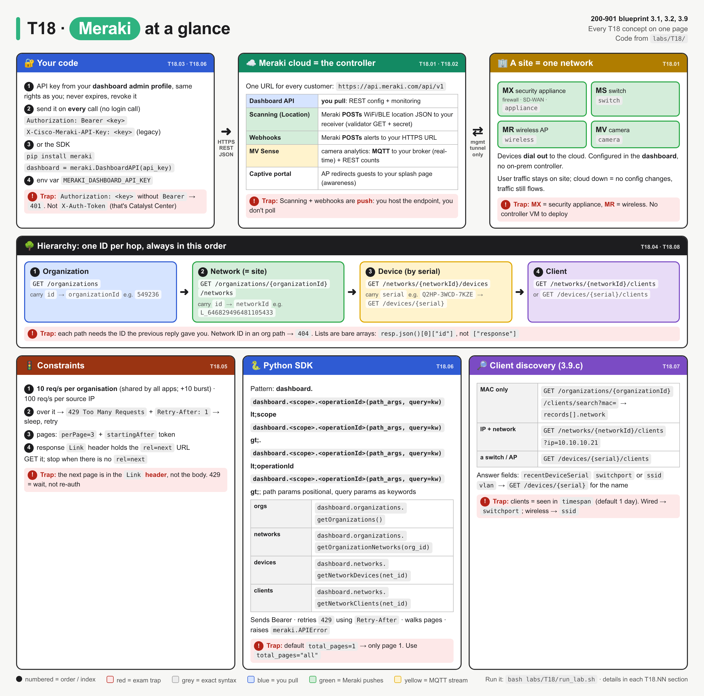
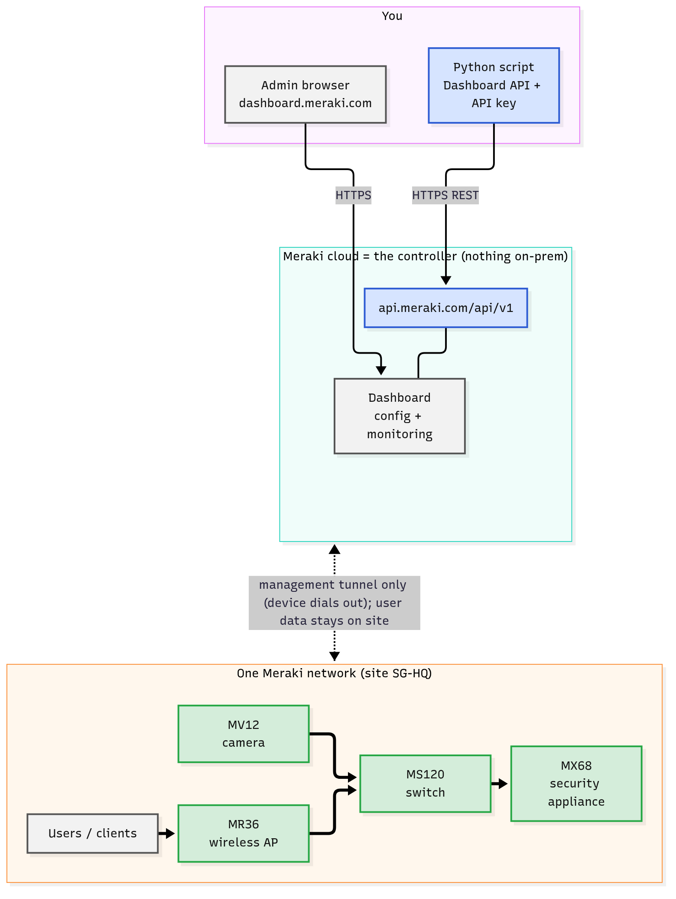
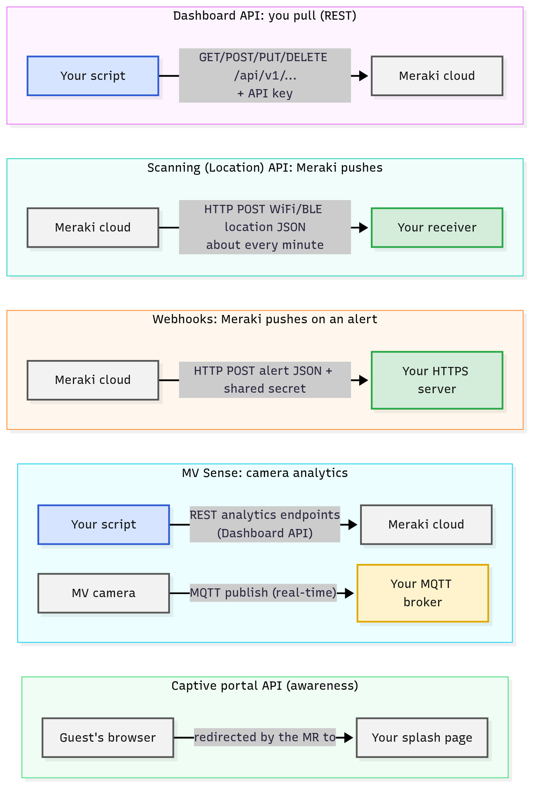
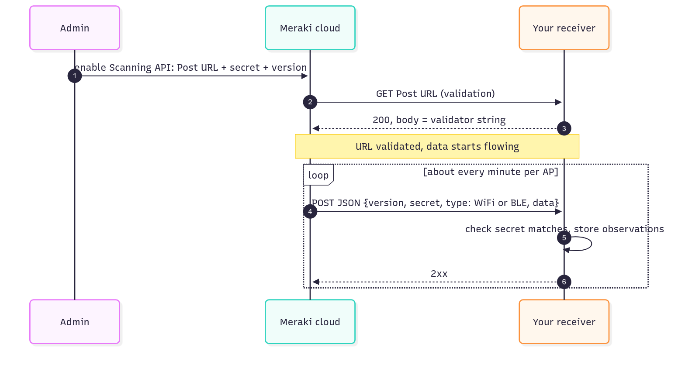
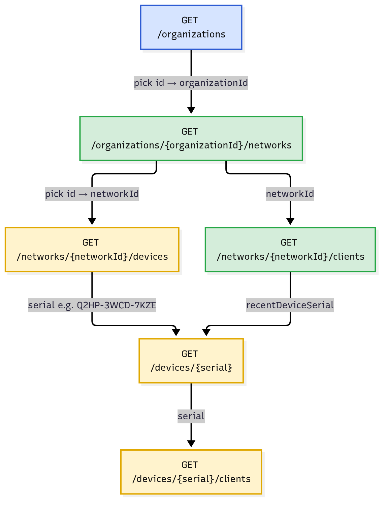
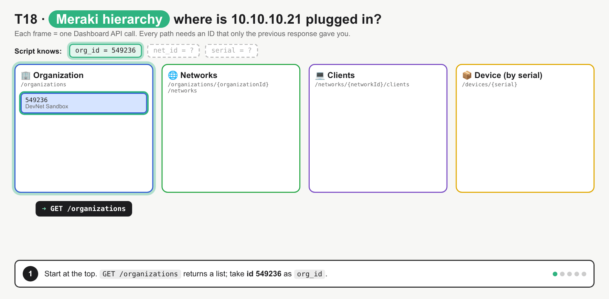
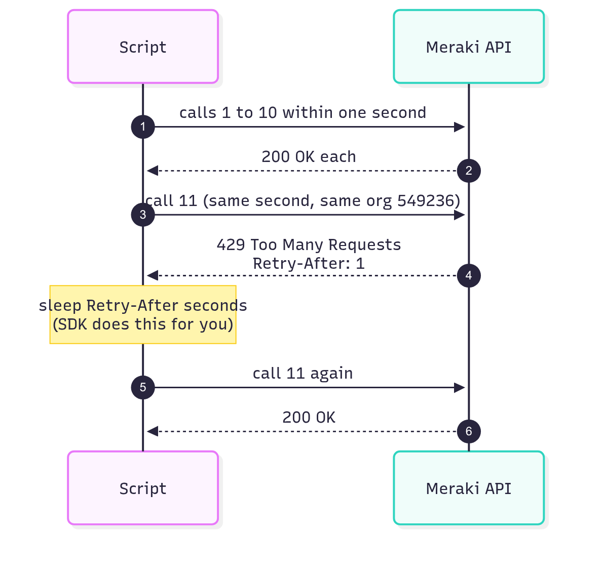
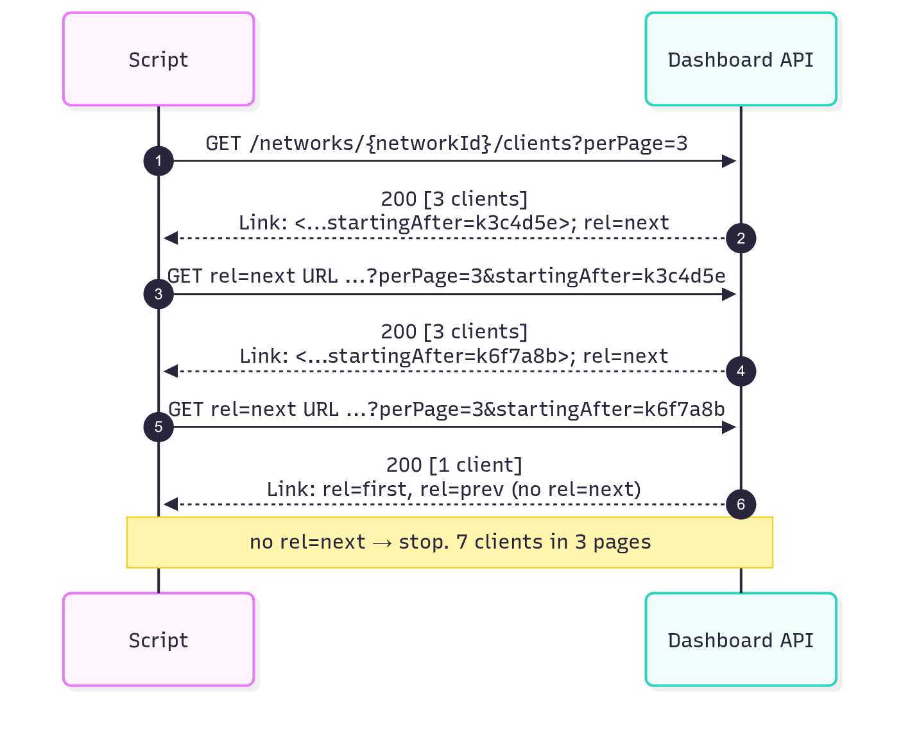
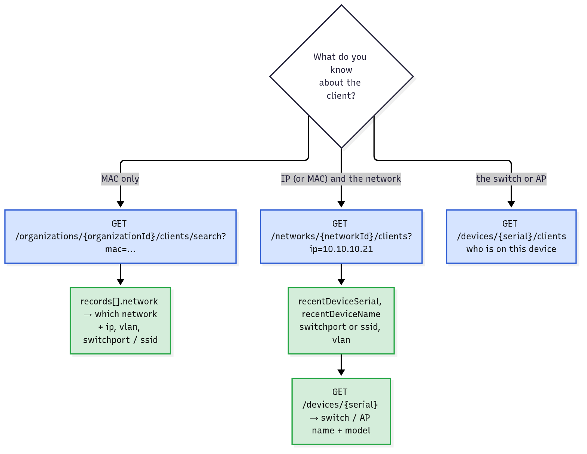

# T18 · Meraki

> Owner: **Bob** · Blueprint: **3.1, 3.2, 3.9** · CBT coverage: **Full** · Learn by 2026-10-13 · Teach-back 2026-10-16



*Read it left to right like traffic: your script (left) → Meraki cloud (middle) → devices and clients (right). Numbered circles are the call order from `labs/T18/`; red boxes are exam traps; IDs under each panel title map to the T18.NN sections.*

## TL;DR (teach-back card)

- **Cloud-managed, no controller on-prem.** MX (security/SD-WAN appliance), MS (switch), MR (wireless AP), MV (camera) dial out to the Meraki cloud. Config, monitoring and the API all live at `https://api.meraki.com/api/v1`. User traffic stays on site.
- **Walk the tree, one ID per hop:** `GET /organizations` → `organizationId` → `/organizations/{organizationId}/networks` → `networkId` → `/networks/{networkId}/devices` (by **serial**) and `/networks/{networkId}/clients`. Auth = API key from the dashboard profile, sent as `Authorization: Bearer <key>` (or the legacy `X-Cisco-Meraki-API-Key: <key>`).
- **Limits:** 10 requests/s per **organisation** → `429` + `Retry-After`. Big lists page with `perPage` + `startingAfter`, and the next page URL is in the `Link` header (`rel=next`). The SDK (`pip install meraki`, `meraki.DashboardAPI(api_key)`) retries 429s and walks pages for you.
- **Trap:** the SDK only fetches **all** pages if you pass `total_pages="all"` (or `-1`). The default is `total_pages=1`, so you silently get page 1 only.

## Concepts

Every section below points at the same small program. It answers the 3.9.c question "where is client 10.10.10.21 plugged in?" by walking org → network → device → client. Read it once first.

- `labs/T18/mock_meraki.py` is a local stand-in for the Dashboard API v1, written with the Python standard library only. It runs at `http://127.0.0.1:8118/api/v1` and returns bodies shaped like the examples in the Meraki API reference. It also enforces the API key, pagination with `Link` headers, and the per-org rate limit (`429` + `Retry-After`).
- `labs/T18/meraki_requests.py` is the **reference program**: plain `requests`, so every header and page is visible.
- `labs/T18/meraki_sdk.py` does the same walk with the **Meraki Python SDK** (T18.06).
- `labs/T18/curl_drill.sh` shows the raw HTTP (headers, `Link`, `429`).
- To run: `bash labs/T18/run_lab.sh` starts the mock, runs a client, then stops the mock. Point `MERAKI_BASE_URL` at `https://api.meraki.com/api/v1` and set `MERAKI_DASHBOARD_API_KEY` to run the same code against a real org.

**Endpoints the program uses** (all `GET`, base `https://api.meraki.com/api/v1`):

| Path | Returns | Key fields you carry to the next call |
|---|---|---|
| `/organizations` | orgs your key can see | `id` → `organizationId` |
| `/organizations/{organizationId}/networks` | networks (paginated) | `id` → `networkId`, `productTypes` |
| `/networks/{networkId}/devices` | devices in that network | `serial`, `model`, `name`, `lanIp` |
| `/networks/{networkId}/clients` | clients seen in `timespan` (paginated, filters `mac`, `ip`, `vlan` …) | `recentDeviceSerial`, `switchport`, `ssid`, `vlan` |
| `/organizations/{organizationId}/clients/search?mac=` | one client across **all** networks in the org | `records[].network` |
| `/devices/{serial}` | one device | `name`, `model` |
| `/devices/{serial}/clients` | clients on one switch/AP | `mac`, `ip`, `switchport` |

**`labs/T18/meraki_requests.py`**

```python
"""T18 reference program, part 1: walk the Meraki hierarchy with plain `requests`.

    org -> networks -> devices -> clients -> "where is this client plugged in?"

Default target is the local mock (python3 labs/T18/mock_meraki.py).
For the real cloud:  export MERAKI_BASE_URL=https://api.meraki.com/api/v1
                     export MERAKI_DASHBOARD_API_KEY=<your key>
"""
import os
import time

import requests

BASE_URL = os.environ.get("MERAKI_BASE_URL", "http://127.0.0.1:8118/api/v1")
API_KEY = os.environ.get("MERAKI_DASHBOARD_API_KEY", "0123456789abcdef0123456789abcdef01234567")

session = requests.Session()
session.headers.update({
    "Authorization": f"Bearer {API_KEY}",        # v1 standard; X-Cisco-Meraki-API-Key also works
    "Accept": "application/json",
})


def meraki_get(path, params=None, max_retries=3):
    """GET one URL; on 429 sleep for Retry-After seconds and try again."""
    url = path if path.startswith("http") else BASE_URL + path
    for attempt in range(1, max_retries + 1):
        resp = session.get(url, params=params, timeout=30)
        if resp.status_code == 429:
            wait = int(resp.headers.get("Retry-After", "1"))
            print(f"    429 Too Many Requests -> Retry-After: {wait}s (attempt {attempt})")
            time.sleep(wait)
            continue
        resp.raise_for_status()                    # 401/404/400 -> requests.HTTPError
        return resp
    raise RuntimeError(f"still rate-limited after {max_retries} tries: {url}")


def get_all_pages(path, params=None):
    """Follow the Link header (rel=next) until there is no next page."""
    items, resp = [], meraki_get(path, params)
    pages = 1
    items.extend(resp.json())
    while "next" in resp.links:                    # requests parses the Link header for us
        resp = meraki_get(resp.links["next"]["url"])   # next URL already has perPage + startingAfter
        items.extend(resp.json())
        pages += 1
    print(f"    {path}: {len(items)} items in {pages} page(s)")
    return items


def find_client(org_id, net_id, mac=None, ip=None):
    """3.9.c client discovery: MAC -> org-wide search; IP -> filter the network's clients."""
    if mac:
        hit = meraki_get(f"/organizations/{org_id}/clients/search", params={"mac": mac}).json()
        rec = hit["records"][0]
        return {"id": hit["clientId"], "network": rec["network"]["name"], "ip": rec["ip"],
                "vlan": rec["vlan"], "switchport": rec["switchport"], "ssid": rec["ssid"]}
    clients = meraki_get(f"/networks/{net_id}/clients", params={"ip": ip, "timespan": 86400}).json()
    c = clients[0]
    return {"id": c["id"], "mac": c["mac"], "device": c["recentDeviceName"],
            "serial": c["recentDeviceSerial"], "vlan": c["vlan"], "switchport": c["switchport"],
            "ssid": c["ssid"]}


def main():
    print("== 1. Auth: wrong header name ==")
    bad = requests.get(BASE_URL + "/organizations", headers={"X-API-Key": API_KEY}, timeout=30)
    print(f"    {bad.status_code} {bad.reason}: {bad.json()}")

    print("\n== 2. Organizations ==")
    orgs = meraki_get("/organizations").json()
    org_id = orgs[0]["id"]
    print(f"    org {org_id} = {orgs[0]['name']}")

    print("\n== 3. Networks (paginated, perPage=3) ==")
    networks = get_all_pages(f"/organizations/{org_id}/networks", params={"perPage": 3})
    for n in networks:
        print(f"    {n['id']}  {n['name']:<13} {','.join(n['productTypes'])}")
    net_id = next(n["id"] for n in networks if n["name"] == "SG-HQ")

    print("\n== 4. Devices in SG-HQ (identified by serial) ==")
    for d in meraki_get(f"/networks/{net_id}/devices").json():
        print(f"    {d['serial']}  {d['model']:<10} {d['name']:<15} lanIp={d['lanIp']}")

    print("\n== 5. Clients in SG-HQ (last 24 h, perPage=3) ==")
    clients = get_all_pages(f"/networks/{net_id}/clients", params={"timespan": 86400, "perPage": 3})
    for c in clients:
        where = f"port {c['switchport']}" if c["switchport"] else f"SSID {c['ssid']}"
        print(f"    {c['mac']}  {c['ip']:<12} {c['description']:<18} -> {c['recentDeviceName']} {where}")

    print("\n== 6. Find one client ==")
    print(f"    by MAC: {find_client(org_id, net_id, mac='a4:83:e7:5c:02:3f')}")
    by_ip = find_client(org_id, net_id, ip="10.10.10.21")
    print(f"    by IP:  {by_ip}")
    sw = meraki_get(f"/devices/{by_ip['serial']}").json()
    print(f"    -> plugged into {sw['model']} {sw['name']} port {by_ip['switchport']}, VLAN {by_ip['vlan']}")

    print("\n== 7. Rate limit: 12 fast calls against one org ==")
    time.sleep(1.1)                                # start with a fresh 1-second budget
    for _ in range(12):
        meraki_get(f"/networks/{net_id}/devices")
    print("    all 12 succeeded (the 429s were retried after Retry-After)")


if __name__ == "__main__":
    main()
```

**Output** (`bash labs/T18/run_lab.sh`):

```
== 1. Auth: wrong header name ==
    401 Unauthorized: {'errors': ['Invalid API key']}

== 2. Organizations ==
    org 549236 = DevNet Sandbox

== 3. Networks (paginated, perPage=3) ==
    /organizations/549236/networks: 5 items in 2 page(s)
    L_646829496481105433  SG-HQ         appliance,switch,wireless,camera
    L_646829496481105434  SG-Branch-01  appliance,wireless
    L_646829496481105435  SG-Branch-02  appliance,wireless
    L_646829496481105436  TY-Lab        switch
    L_646829496481105437  NY-Office     appliance,switch,wireless

== 4. Devices in SG-HQ (identified by serial) ==
    Q2KY-8TRB-6LQA  MX68       HQ-MX68         lanIp=None
    Q2HP-3WCD-7KZE  MS120-8LP  HQ-MS120-01     lanIp=10.10.1.2
    Q3AB-9XJM-2VDN  MR36       HQ-MR36-Lobby   lanIp=10.10.1.21
    Q2FV-5MNP-4GHT  MV12WE     HQ-MV12-Door    lanIp=10.10.1.31

== 5. Clients in SG-HQ (last 24 h, perPage=3) ==
    /networks/L_646829496481105433/clients: 7 items in 3 page(s)
    f8:4d:89:01:aa:10  10.10.10.21  bob-laptop         -> HQ-MS120-01 port 3
    f8:4d:89:01:aa:11  10.10.10.22  beedy-laptop       -> HQ-MS120-01 port 4
    a4:83:e7:5c:02:3f  10.10.20.51  Bob's iPhone       -> HQ-MR36-Lobby SSID Corp-WiFi
    a4:83:e7:5c:02:40  10.10.20.52  Meeting-Room-iPad  -> HQ-MR36-Lobby SSID Corp-WiFi
    00:1b:63:84:45:e6  10.10.30.10  printer-l2         -> HQ-MS120-01 port 7
    3c:22:fb:9d:10:aa  10.10.20.77  guest-android      -> HQ-MR36-Lobby SSID Guest
    00:0c:29:4f:8e:35  10.10.1.50   nas01              -> HQ-MS120-01 port 8

== 6. Find one client ==
    by MAC: {'id': 'k3c4d5e', 'network': 'SG-HQ', 'ip': '10.10.20.51', 'vlan': '20', 'switchport': None, 'ssid': 'Corp-WiFi'}
    by IP:  {'id': 'k1a2b3c', 'mac': 'f8:4d:89:01:aa:10', 'device': 'HQ-MS120-01', 'serial': 'Q2HP-3WCD-7KZE', 'vlan': '10', 'switchport': '3', 'ssid': None}
    -> plugged into MS120-8LP HQ-MS120-01 port 3, VLAN 10

== 7. Rate limit: 12 fast calls against one org ==
    429 Too Many Requests -> Retry-After: 1s (attempt 1)
    all 12 succeeded (the 429s were retried after Retry-After)
```

### T18.01 · Platform

**Must cover:**

- [x] Cloud-managed networking (MX security appliance, MS switch, MR wireless, MV camera)
- [x] Managed in the Meraki dashboard; no on-prem controller

**Notes:**

- **Meraki = cloud-managed networking.** Every device ships with no local controller to install. You plug it in, it dials out to the Meraki cloud over the internet, and it pulls its config from there.
- Product families (the letters show up in model numbers and in `productTypes`):

| Line | What it is | `productTypes` value | In the mock |
|---|---|---|---|
| **MX** | security appliance: firewall, SD-WAN, VPN, routing at the edge | `appliance` | `MX68` |
| **MS** | access/aggregation switch | `switch` | `MS120-8LP` |
| **MR** | wireless access point | `wireless` | `MR36` |
| **MV** | smart security camera (on-camera analytics, T18.02) | `camera` | `MV12WE` |
| (also) MG cellular gateway, MT sensors, SM endpoint management | awareness only | `cellularGateway`, `sensor`, `systemsManager` | not used |

- **Dashboard** (`dashboard.meraki.com`) is the web UI. The **Dashboard API** is the same cloud, driven by code. Anything you click is the same cloud object you GET/PUT.
- **No on-prem controller.** Compare: Catalyst Center (DNA Center) and the SD-WAN Manager (vManage) are controllers *you* deploy (or Cisco hosts for you); with Meraki the controller **is** the cloud, so the API URL is the same for every customer (`api.meraki.com`).
- **Out-of-band management:** only management traffic goes to the cloud. If the cloud is unreachable, the site keeps forwarding user traffic; you just can't change config.



*Blue = the API path your script uses. Dotted = the management tunnel each device opens to the cloud. Thick arrows = user traffic, which stays on site.*

### T18.02 · APIs

**Must cover:**

- [x] Dashboard API: REST, base https://api.meraki.com/api/v1
- [x] Scanning API: location data POSTed to your server (webhook-style)
- [x] MV Sense: camera analytics (REST/MQTT)
- [x] Webhooks for alerts; captive portal APIs (awareness)

**Notes:**

- Meraki has one main API and several "data out" APIs. The exam tests **who calls whom**.



*Blue = you call Meraki (pull). Green = Meraki calls your server (push). Yellow = the camera streams to your MQTT broker.*

| API | Direction | Transport / format | Use it for |
|---|---|---|---|
| **Dashboard API** | you → Meraki | REST over HTTPS, JSON, base `https://api.meraki.com/api/v1` | config + monitoring: orgs, networks, devices, clients, SSIDs, VLANs … |
| **Scanning API** (now called the **Location API**, current version v3) | Meraki → your receiver | HTTPS `POST` of JSON | WiFi and BLE device location (lat/lng, x/y on the floor plan), footfall analytics |
| **Webhooks** | Meraki → your receiver | HTTPS `POST` of JSON alert, with a shared secret | react to alerts (device down, settings changed) instead of polling. Same push pattern as T43 |
| **MV Sense** | camera → your MQTT broker, **or** you → Meraki REST | **MQTT** (real-time detections, light level) + **REST** (people/vehicle counts, zones; part of the Dashboard API) | turn the camera into a sensor (occupancy, counting) |
| **Captive portal (ExCaP)** | the AP redirects the guest's browser → your splash page | HTTP redirect with query parameters | custom guest Wi-Fi sign-on pages. Awareness only |

- **Webhooks, from the Meraki docs:**
  - You add an **HTTP server** in the dashboard with a name, an **HTTPS (TLS) URL** on a public server with a valid certificate, and an optional **shared secret**. You can also pick a payload template.
  - Each alert is a JSON `POST` that carries `sharedSecret`, `sentAt` and `version` (among others). Your receiver compares `sharedSecret` with the value it expects and drops the alert if they don't match.
  - The full list of alert types comes from the Dashboard API (the Alert Types endpoint).
- **Captive Portal API, from the Meraki docs:** there are two methods.
  - **Click-through** (simple: branding, terms of service, less secure). Meraki appends `base_grant_url`, `user_continue_url`, `node_mac`, `client_ip` and `client_mac` to your splash URL. To let the guest on, redirect the browser with a `GET` to `base_grant_url`, optionally adding `continue_url` and `duration`.
  - **Sign-on** (adds authentication and accounting; more secure). Meraki appends `login_url` (which carries an mauth token), `continue_url`, `ap_name`, `ap_mac`, `ap_tags`, `client_ip` and `client_mac`. Your page `POST`s `username` + `password` to `login_url`, optionally with `success_url` (which wins over `continue_url`).
- **Dashboard API is the only one you "call".** Scanning and webhooks are **push**: you host an HTTPS endpoint and Meraki sends to it. That's why they're described as "webhook-style".
- **Scanning API handshake** (the flow behind "Meraki POSTs to your server"):



*Meraki first sends a GET to prove the URL is yours (you answer with the **validator** string from the dashboard). After that it POSTs JSON that includes your **secret**, so you can check the sender.*

- Data is batched about every minute per AP. Positions are a "best effort estimate".
- **MV Sense MQTT:** you configure a broker (e.g. Mosquitto) on the camera in the dashboard, and the camera *publishes* to topics on that broker. MQTT is publish/subscribe over TCP, built for IoT. The REST half is read with ordinary Dashboard API calls.

### T18.03 · Authentication

**Must cover:**

- [x] API key generated in the dashboard user profile
- [x] Header X-Cisco-Meraki-API-Key: <key> or Authorization: Bearer <key>

**Notes:**

- **Get a key:** it's generated in the dashboard against **your own admin profile**. Current docs: **Organization > API & Webhooks > API keys and access**. Older dashboards and most exam material: **My Profile > API access**. The key is a 40-character hex string, shown **once** ⚠ verify the menu path.
- **Scope:** the key is tied to **your admin account**, not to an org. It can do whatever your admin role can, in every org you're an admin of. Read-only admin → read-only key. Max 2 keys per admin. Keys don't expire; you revoke them.
- **Send it on every request** (REST is stateless, T07.02). Two header forms:

| Header | Status | In the program |
|---|---|---|
| `Authorization: Bearer <key>` | the documented v1 standard; what the SDK sends | `session.headers.update({"Authorization": f"Bearer {API_KEY}", ...})` |
| `X-Cisco-Meraki-API-Key: <key>` | the original header, still in most exam material and older scripts | curl drill step 2 → `HTTP 200` (mock) ⚠ verify on the live API |

- **No login call.** Unlike Catalyst Center (POST `/auth/token` first, T20) or ACI (`aaaLogin`, T19), Meraki has no token exchange. The static key goes straight into the header.
- Wrong or missing header → `401 Unauthorized` with `{"errors": ["Invalid API key"]}`. Section 1 of the output sends the key in a made-up `X-API-Key` header: the key is right but the header name is wrong, so → `401`.
- Store the key in the env var `MERAKI_DASHBOARD_API_KEY`, which the SDK reads by itself (T18.06). Never in the script.

### T18.04 · Hierarchy and endpoints

**Must cover:**

- [x] organizations → networks → devices (by serial) → clients
- [x] GET /organizations; /organizations/{orgId}/networks; /networks/{networkId}/devices; /networks/{networkId}/clients

**Notes:**

- **The hierarchy:**
  - **Organization** = the customer / tenant, with licences and admins. One API key can see several orgs.
  - **Network** = usually one **site**. It groups the devices there (MX + MS + MR + MV can share one network). IDs look like `L_646829496481105433` (combined network) or `N_…`.
  - **Device** = one box, identified by its **serial** (`Q2HP-3WCD-7KZE`), not by name or IP.
  - **Client** = an end host (laptop, phone, printer) seen *by* a network's devices.
- **Each call needs an ID from the previous response.** You can't start at `/networks/.../clients`; you don't know the `networkId` until you've listed the org's networks.



*Each arrow is the field you copy out of one response into the next path. Devices are reached by serial, from either the device list or a client's `recentDeviceSerial`.*



*One lookup, one call per frame: `GET /organizations` → networks page 1 → `rel=next` page 2 → clients `?ip=10.10.10.21` → `GET /devices/{serial}`. Watch the "Script knows" chips fill in: every path uses an ID the previous reply just gave you, which is why the calls must run in this order.*

- In the program:
  - section 2: `orgs[0]["id"]` → `org_id = "549236"`
  - section 3: `get_all_pages(f"/organizations/{org_id}/networks", ...)` → pick SG-HQ's `id`
  - section 4: `/networks/{net_id}/devices` → 4 devices, one per product line
  - section 5: `/networks/{net_id}/clients` → 7 clients
- Path parameter names in the docs are `{organizationId}`, `{networkId}`, `{serial}`. The blueprint shorthand `{orgId}` means the same thing.
- **Org-level shortcuts exist** (e.g. `GET /organizations/{organizationId}/devices` lists every device in every network). The exam still expects the org → network → device order.

### T18.05 · Constraints

**Must cover:**

- [x] Rate limit ~10 requests/second per organisation → 429 + Retry-After
- [x] Pagination via Link header (rel=next) and startingAfter/perPage

**Notes:**

**Rate limit**

- **10 requests per second per organisation**, shared by **every** app and key that hits that org. Short bursts get an extra 10 in the first second. There's also a **100 requests/s per source IP** cap across all orgs.
- Over the limit → `429 Too Many Requests` + a `Retry-After` header (seconds to wait) + body `{"errors": ["API rate limit exceeded for organization"]}`.
- The fix: sleep `Retry-After` seconds, retry, and back off if it keeps happening.



*The 11th call in the same second for the same org gets 429. The client waits the `Retry-After` value and retries; it doesn't give up.*

- In the program, `meraki_get()` does exactly this: `if resp.status_code == 429: wait = int(resp.headers.get("Retry-After", "1")); time.sleep(wait); continue`.
  - Section 7 fires 12 calls in well under a second: call 11 gets `429 … Retry-After: 1s`, the loop sleeps 1 s, and all 12 end up succeeding.
  - Curl drill step 7 shows the raw codes: `200` ×10, then `429` ×5.
- The mock simplifies to "10 per 1-second window" with no burst allowance.

**Pagination**

- List endpoints return **one page** at a time. You control the size with `perPage` (each endpoint documents its range: clients `3`–`5000`, default `10`).
- The response carries an RFC 5988 **`Link` header** with up to 4 URLs: `rel=first`, `rel=prev`, `rel=next`, `rel=last`. Each URL already contains `perPage` plus a `startingAfter` or `endingBefore` token.
- **Loop: GET → read `rel=next` → GET that URL → stop when there's no `rel=next`.** Don't build `startingAfter` yourself; the docs say the tokens are set by the server (a timestamp or an ID).



*7 clients at `perPage=3` = 3 pages. The last page has no `rel=next`, which is the stop condition.*

- In the program, `get_all_pages()` loops `while "next" in resp.links:`. `requests` parses the `Link` header into `resp.links["next"]["url"]`. Output: `5 items in 2 page(s)` for networks and `7 items in 3 page(s)` for clients.
- Real `Link` URLs are absolute (`<https://api.meraki.com/api/v1/organizations/549236/networks?perPage=3&startingAfter=…>; rel=next`). The mock sends base-relative paths (curl drill step 4), and `meraki_get()` handles both.

### T18.06 · Python SDK

**Must cover:**

- [x] pip install meraki
- [x] dashboard = meraki.DashboardAPI(api_key)
- [x] dashboard.organizations.getOrganizations(); dashboard.networks.getNetworkClients(net_id)
- [x] SDK handles retries on 429 and pagination

**Notes:**

- `pip install meraki` (already in the lab Dockerfile). Then `import meraki`.
- `dashboard = meraki.DashboardAPI(api_key)` creates one session. If you leave `api_key` out, it reads `MERAKI_DASHBOARD_API_KEY` from the environment.
- **Call pattern = `dashboard.<scope>.<operationId>(...)`**. The scope is the first part of the path; the method name is the operation ID in the docs, in camelCase:

| REST call | SDK method |
|---|---|
| `GET /organizations` | `dashboard.organizations.getOrganizations()` |
| `GET /organizations/{organizationId}/networks` | `dashboard.organizations.getOrganizationNetworks(org_id)` |
| `GET /networks/{networkId}/devices` | `dashboard.networks.getNetworkDevices(net_id)` |
| `GET /networks/{networkId}/clients` | `dashboard.networks.getNetworkClients(net_id)` |
| `GET /devices/{serial}` | `dashboard.devices.getDevice(serial)` |
| `GET /organizations/{organizationId}/clients/search` | `dashboard.organizations.getOrganizationClientsSearch(org_id, mac)` |

- Path parameters are **positional** arguments. Query parameters are **keyword** arguments: `getNetworkClients(net_id, timespan=86400, perPage=3)`.
- **What the SDK does for you:**
  - sends `Authorization: Bearer <key>` (seen in its source: `'Authorization': 'Bearer ' + self._api_key`)
  - on `429`, sleeps `Retry-After` seconds and retries (`wait_on_rate_limit=True`, up to `maximum_retries`)
  - retries 5xx errors
  - follows the `Link` header **if you ask for more than one page**: `total_pages="all"` or `-1`
  - raises `meraki.APIError` (with `.status`, `.reason`, `.message`) on other 4xx
  - writes a log file and console log by default (`suppress_logging=True` or `output_log=False` turns that off)

**`labs/T18/meraki_sdk.py`**

```python
"""T18 reference program, part 2: the same walk with the Meraki Python SDK.

    pip install meraki
Default target is the local mock (python3 labs/T18/mock_meraki.py).
For the real cloud: unset MERAKI_BASE_URL and export MERAKI_DASHBOARD_API_KEY=<your key>
"""
import os

import meraki

BASE_URL = os.environ.get("MERAKI_BASE_URL", "http://127.0.0.1:8118/api/v1")
API_KEY = os.environ.get("MERAKI_DASHBOARD_API_KEY", "0123456789abcdef0123456789abcdef01234567")

dashboard = meraki.DashboardAPI(
    api_key=API_KEY,              # omit it and the SDK reads MERAKI_DASHBOARD_API_KEY itself
    base_url=BASE_URL,            # default https://api.meraki.com/api/v1
    suppress_logging=True,        # no log file / console noise for the demo
    wait_on_rate_limit=True,      # default: on 429, sleep Retry-After and retry
    maximum_retries=3,
)


def main():
    print("== 1. Organizations ==")
    orgs = dashboard.organizations.getOrganizations()
    org_id = orgs[0]["id"]
    print(f"    {len(orgs)} org: {org_id} {orgs[0]['name']}")

    print("\n== 2. Networks: total_pages trap ==")
    first = dashboard.organizations.getOrganizationNetworks(org_id, perPage=3)
    every = dashboard.organizations.getOrganizationNetworks(org_id, perPage=3, total_pages="all")
    print(f"    default total_pages=1 -> {len(first)} networks")
    print(f"    total_pages='all'     -> {len(every)} networks")
    net_id = next(n["id"] for n in every if n["name"] == "SG-HQ")

    print("\n== 3. Devices ==")
    for d in dashboard.networks.getNetworkDevices(net_id):
        print(f"    {d['serial']}  {d['model']}")

    print("\n== 4. Clients (all pages) ==")
    clients = dashboard.networks.getNetworkClients(net_id, timespan=86400, perPage=3, total_pages="all")
    print(f"    {len(clients)} clients; first: {clients[0]['description']} on {clients[0]['recentDeviceName']}")

    print("\n== 5. Where is 10.10.10.21? ==")
    hit = dashboard.networks.getNetworkClients(net_id, ip="10.10.10.21")[0]
    switch = dashboard.devices.getDevice(hit["recentDeviceSerial"])
    print(f"    {hit['mac']} -> {switch['name']} ({switch['model']}) port {hit['switchport']}")

    print("\n== 6. Rate limit: 12 fast calls, SDK retries 429 for you ==")
    for _ in range(12):
        dashboard.networks.getNetworkDevices(net_id)
    print("    12/12 returned; no 429 reached this code")

    print("\n== 7. Errors surface as meraki.APIError ==")
    try:
        dashboard.organizations.getOrganizationNetworks("999999")
    except meraki.APIError as err:
        print(f"    status={err.status} reason={err.reason} message={err.message}")


if __name__ == "__main__":
    main()
```

**Output** (`bash labs/T18/run_lab.sh labs/T18/meraki_sdk.py`, meraki 2.2.0):

```
== 1. Organizations ==
    1 org: 549236 DevNet Sandbox

== 2. Networks: total_pages trap ==
    default total_pages=1 -> 3 networks
    total_pages='all'     -> 5 networks

== 3. Devices ==
    Q2KY-8TRB-6LQA  MX68
    Q2HP-3WCD-7KZE  MS120-8LP
    Q3AB-9XJM-2VDN  MR36
    Q2FV-5MNP-4GHT  MV12WE

== 4. Clients (all pages) ==
    7 clients; first: bob-laptop on HQ-MS120-01

== 5. Where is 10.10.10.21? ==
    f8:4d:89:01:aa:10 -> HQ-MS120-01 (MS120-8LP) port 3

== 6. Rate limit: 12 fast calls, SDK retries 429 for you ==
    12/12 returned; no 429 reached this code

== 7. Errors surface as meraki.APIError ==
    status=404 reason=Not Found message={'errors': ['Organization not found']}
```

- Section 2 is the trap: `getOrganizationNetworks(org_id, perPage=3)` returns **3** networks, because `total_pages` defaults to `1`. With `total_pages="all"`, the SDK walks the `Link` header and returns all **5**.
- Section 6 never sees a `429`, because the SDK swallowed and retried it. With logging on, it logs `WARNING > networks, getNetworkDevices - 429 Too Many Requests, retrying in 1 seconds` (Examples §3).
- Section 7: a 404 becomes a Python exception, `meraki.APIError`, not a return value.

### T18.07 · Client discovery (3.9.c)

**Must cover:**

- [x] List clients per network/device; look up a client by MAC/IP to find where it is connected

**Notes:**

- "Where is this host plugged in?" Choose the call by what you know:



*MAC only → org-wide search. IP + network → filter the network's client list. A switch/AP → list its clients.*

| You know | Call | Answer is in |
|---|---|---|
| MAC, not the network | `GET /organizations/{organizationId}/clients/search?mac=a4:83:e7:5c:02:3f` | `records[].network.name`, `ip`, `vlan`, `switchport` / `ssid` |
| IP (or MAC) and the network | `GET /networks/{networkId}/clients?ip=10.10.10.21` (`mac=`, `vlan=` filters too) | `recentDeviceSerial`, `recentDeviceName`, `switchport` (wired) or `ssid` (wireless), `vlan` |
| one client's ID / MAC / IP | `GET /networks/{networkId}/clients/{clientId}` | same fields, one object |
| the switch or AP | `GET /devices/{serial}/clients` | each client's `mac`, `ip`, `vlan`, `switchport` |

- **`recentDeviceSerial` → `GET /devices/{serial}`** turns "Q2HP-3WCD-7KZE" into "HQ-MS120-01, MS120-8LP". This is section 6 of the program: `-> plugged into MS120-8LP HQ-MS120-01 port 3, VLAN 10`.
- **Wired vs wireless:** `switchport` is set and `ssid` is `null` for a wired client; the reverse for a wireless one (`recentDeviceConnection` says `Wired` / `Wireless`). The `by MAC` line in the output is Bob's iPhone: `switchport: None, ssid: 'Corp-WiFi'`.
- **Time window:** network clients are "clients seen in the `timespan`" (default 1 day, max 31 days). An offline host from last month won't appear.
- `{clientId}` in `/networks/{networkId}/clients/{clientId}` can be the client key (`k1a2b3c`), or the MAC or IP depending on the network's Track-by-IP setting.

### T18.08 · Exam angle

**Must cover:**

- [x] Order the calls org → network → device; complete SDK/requests code; know the auth header

**Notes:**

- **Order the calls:** `GET /organizations` → `GET /organizations/{organizationId}/networks` → `GET /networks/{networkId}/devices` → `GET /networks/{networkId}/clients` (or `/devices/{serial}/clients`). Each one consumes the ID the previous one returned (see the GIF in T18.04).
- **Complete the `requests` code:** expect blanks in:
  - the URL: `https://api.meraki.com/api/v1/organizations/{org_id}/networks`
  - the header dict: `{"Authorization": f"Bearer {API_KEY}"}` or `{"X-Cisco-Meraki-API-Key": API_KEY}`
  - the parse: `resp.json()[0]["id"]`. Meraki list endpoints return a **bare JSON array**, so it's `[0]`, not `["response"]` (that's Catalyst Center, T20).
- **Complete the SDK code:** `meraki.DashboardAPI(API_KEY)` → `dashboard.organizations.getOrganizations()` → `dashboard.organizations.getOrganizationNetworks(org_id)` → `dashboard.networks.getNetworkDevices(net_id)`.
- **Diagnose:** `401` = key/header wrong; `404` = wrong ID in the path, or an ID of the wrong type (a network ID where an org ID goes); `429` = rate limit (wait `Retry-After`); a list that is "too short" = you didn't paginate.

## Exam traps

- **Auth header names:** `Authorization: Bearer <key>` or `X-Cisco-Meraki-API-Key: <key>`. Not `X-Auth-Token` (Catalyst Center), not a cookie (ACI APIC), and no login call first.
- **`Bearer` needs the word `Bearer `.** `Authorization: <key>` alone → `401` (Examples §3, edit 1).
- **The API key belongs to an admin user**, not an org. Same permissions as that admin, across all their orgs.
- **Rate limit is per organisation** (10/s, shared by every app on that org), not per key or per script. The second cap is 100/s per source IP.
- **429 → read `Retry-After`** (a header, in seconds), sleep, retry. Not "re-authenticate".
- **Pagination lives in the `Link` header**, not in the JSON body. Follow `rel=next` until it's gone.
- **SDK `total_pages` defaults to 1.** `getOrganizationNetworks(org_id)` can silently return only page 1. Use `total_pages="all"` (or `-1`).
- **Devices are keyed by `serial`** (`/devices/{serial}`), networks by `networkId`, orgs by `organizationId`. Using a network ID in an org path → `404`.
- **Push vs pull:** the Scanning/Location API and webhooks **POST to your server**. You don't poll them. MV Sense real-time = **MQTT**; MV Sense historical counts = REST.
- **Base URL is the same for every customer:** `https://api.meraki.com/api/v1` (regional exceptions such as China and the US federal cloud exist). Meraki has no on-prem controller to point at.
- **Meraki lists are bare arrays.** `resp.json()[0]`, not `resp.json()["response"][0]`.

## Examples

### 1. Run the reference programs

Needs Python 3 with `requests` and `meraki`, plus curl. No Meraki account needed: the mock plays the cloud.

```bash
python3 -m venv /tmp/t18-venv
/tmp/t18-venv/bin/pip install requests meraki
PYTHON=/tmp/t18-venv/bin/python bash labs/T18/run_lab.sh                         # requests version
PYTHON=/tmp/t18-venv/bin/python bash labs/T18/run_lab.sh labs/T18/meraki_sdk.py   # SDK version
bash labs/T18/run_lab.sh labs/T18/curl_drill.sh                                   # raw HTTP
```

In the lab container (it already has `requests` and `meraki`):

```bash
docker build --tag ccna-auto-lab:latest --file labs/Dockerfile labs/
docker run --rm --volume "$(pwd)":/work --workdir /work ccna-auto-lab:latest bash labs/T18/run_lab.sh
docker run --rm --volume "$(pwd)":/work --workdir /work ccna-auto-lab:latest bash labs/T18/run_lab.sh labs/T18/meraki_sdk.py
```

Against your own Meraki org (read-only calls only):

```bash
export MERAKI_BASE_URL=https://api.meraki.com/api/v1
export MERAKI_DASHBOARD_API_KEY=<your 40-char key>
python3 labs/T18/meraki_requests.py
```

The org/network names and the MAC/IP in section 6 come from the mock data, so change them to match your org.

### 2. curl drill (`labs/T18/curl_drill.sh`)

```bash
#!/usr/bin/env bash
# T18 curl drill: the Meraki calls the exam shows, against the local mock.
# Real cloud:  export MERAKI_BASE_URL=https://api.meraki.com/api/v1 MERAKI_DASHBOARD_API_KEY=<key>
set -u
BASE="${MERAKI_BASE_URL:-http://127.0.0.1:8118/api/v1}"
KEY="${MERAKI_DASHBOARD_API_KEY:-0123456789abcdef0123456789abcdef01234567}"
NET="L_646829496481105433"

echo "== 1. Bearer header (v1 standard)"
curl --silent --show-error \
  --header "Authorization: Bearer $KEY" \
  "$BASE/organizations"

echo; echo; echo "== 2. Legacy header X-Cisco-Meraki-API-Key"
curl --silent --show-error \
  --header "X-Cisco-Meraki-API-Key: $KEY" \
  --write-out "\nHTTP %{http_code}\n" --output /dev/null \
  "$BASE/organizations"

echo; echo "== 3. No key -> 401"
curl --silent --show-error --include "$BASE/organizations" | tr -d '\r' | grep -E '^HTTP|^\{'

echo; echo "== 4. Page 1 of networks: read the Link header"
curl --silent --show-error --include \
  --header "Authorization: Bearer $KEY" \
  "$BASE/organizations/549236/networks?perPage=3" | tr -d '\r' | grep -E '^HTTP|^Link'

echo; echo "== 5. Page 2: copy startingAfter from rel=next"
curl --silent --show-error \
  --header "Authorization: Bearer $KEY" \
  "$BASE/organizations/549236/networks?perPage=3&startingAfter=L_646829496481105435" \
  | python3 -c "import json, sys; print([n['name'] for n in json.load(sys.stdin)])"

echo; echo "== 6. Which switch port is 10.10.10.21 on?"
curl --silent --show-error --get \
  --header "Authorization: Bearer $KEY" \
  --data "ip=10.10.10.21" \
  "$BASE/networks/$NET/clients" \
  | python3 -c "import json, sys; c = json.load(sys.stdin)[0]; print(c['recentDeviceName'], c['recentDeviceSerial'], 'port', c['switchport'])"

echo; echo "== 7. 15 calls in under a second -> some 429s"
sleep 1.1
for i in $(seq 1 15); do
  curl --silent --output /dev/null --write-out "%{http_code} " \
    --header "Authorization: Bearer $KEY" "$BASE/networks/$NET/devices"
done
echo
curl --silent --show-error --include \
  --header "Authorization: Bearer $KEY" "$BASE/networks/$NET/devices" | tr -d '\r' | grep -E '^HTTP|^Retry-After|^\{"errors'
```

Output (`bash labs/T18/run_lab.sh labs/T18/curl_drill.sh`):

```
== 1. Bearer header (v1 standard)
[{"id": "549236", "name": "DevNet Sandbox", "url": "https://n149.meraki.com/o/-t35Mb/manage/organization/overview", "api": {"enabled": true}, "licensing": {"model": "co-term"}, "cloud": {"region": {"name": "North America"}}, "management": {"details": []}}]

== 2. Legacy header X-Cisco-Meraki-API-Key

HTTP 200

== 3. No key -> 401
HTTP/1.1 401 Unauthorized
{"errors": ["Invalid API key"]}

== 4. Page 1 of networks: read the Link header
HTTP/1.1 200 OK
Link: </organizations/549236/networks?perPage=3&startingAfter=0>; rel=first, </organizations/549236/networks?perPage=3&startingAfter=L_646829496481105435>; rel=next

== 5. Page 2: copy startingAfter from rel=next
['TY-Lab', 'NY-Office']

== 6. Which switch port is 10.10.10.21 on?
HQ-MS120-01 Q2HP-3WCD-7KZE port 3

== 7. 15 calls in under a second -> some 429s
200 200 200 200 200 200 200 200 200 200 429 429 429 429 429 
HTTP/1.1 429 Too Many Requests
Retry-After: 1
{"errors": ["API rate limit exceeded for organization"]}
```

- Step 3: no key at all → `401`, the same code as a wrong key.
- Step 4: the `Link` header carries the next page URL, with `startingAfter` already filled in. Step 5 just GETs it.
- Step 7: the 11th call in the same second for the same org → `429` + `Retry-After: 1`.

### 3. Break it on purpose

Each edit was made on a copy of `labs/T18/meraki_requests.py` (or `meraki_sdk.py`) and run with `run_lab.sh`. The result column is the real changed output.

| Edit | Result | Lesson |
|---|---|---|
| `"Authorization": f"Bearer {API_KEY}",` → `"Authorization": API_KEY,` | `requests.exceptions.HTTPError: 401 Client Error: Unauthorized for url: http://127.0.0.1:8118/api/v1/organizations` | the `Bearer ` scheme word is part of the header |
| in `get_all_pages()`, `while "next" in resp.links:` → `while False and "next" in resp.links:` | `/organizations/549236/networks: 3 items in 1 page(s)` and `/networks/L_646829496481105433/clients: 3 items in 1 page(s)` | no error, just missing data. Unpaginated lists look fine but are short |
| `def meraki_get(path, params=None, max_retries=3):` → `max_retries=1` | `429 Too Many Requests -> Retry-After: 1s (attempt 1)` then `RuntimeError: still rate-limited after 1 tries: http://127.0.0.1:8118/api/v1/networks/L_646829496481105433/devices` | a client that doesn't retry 429s fails under load |
| in section 3, `f"/organizations/{org_id}/networks"` → `f"/organizations/L_646829496481105433/networks"` | `requests.exceptions.HTTPError: 404 Client Error: Not Found for url: http://127.0.0.1:8118/api/v1/organizations/L_646829496481105433/networks?perPage=3` | a network ID in an org path → 404 |
| in `meraki_sdk.py`, `suppress_logging=True, …` → `suppress_logging=False, output_log=False,` | under `== 6.` the SDK logs `meraki:  WARNING > networks, getNetworkDevices - 429 Too Many Requests, retrying in 1 seconds` (twice) and still prints `12/12 returned` | proof that the SDK retries 429s itself |

### 4. Drill: one-liners to know cold

```python
import os
import meraki

dashboard = meraki.DashboardAPI(os.environ["MERAKI_DASHBOARD_API_KEY"])
org_id = dashboard.organizations.getOrganizations()[0]["id"]
networks = dashboard.organizations.getOrganizationNetworks(org_id, total_pages="all")
net_id = networks[0]["id"]
devices = dashboard.networks.getNetworkDevices(net_id)
clients = dashboard.networks.getNetworkClients(net_id, timespan=86400, total_pages="all")
```

```bash
curl --silent --header "Authorization: Bearer $MERAKI_DASHBOARD_API_KEY" \
  https://api.meraki.com/api/v1/organizations
```

## Practice questions

**Q1.** A script must list every client on one Meraki switch at a branch. It knows only the organisation name. Put the calls in order:
`GET /devices/{serial}/clients` · `GET /organizations` · `GET /networks/{networkId}/devices` · `GET /organizations/{organizationId}/networks`

<details><summary>Answer</summary>

`GET /organizations` → `GET /organizations/{organizationId}/networks` → `GET /networks/{networkId}/devices` → `GET /devices/{serial}/clients`. Each call needs the ID returned by the one before it: org ID → network ID → switch serial. (T18.04, T18.07)
</details>

**Q2.** Complete the header so the request authenticates to the Dashboard API v1:

```python
headers = {"__________": f"Bearer {api_key}", "Accept": "application/json"}
resp = requests.get("https://api.meraki.com/api/v1/organizations", headers=headers)
```

<details><summary>Answer</summary>

**`Authorization`**. Meraki v1 accepts `Authorization: Bearer <key>`; the older form is `X-Cisco-Meraki-API-Key: <key>` (without `Bearer`). (T18.03)
</details>

**Q3.** A nightly job makes 40 Dashboard API calls per second against one organisation. Which response does it get, and what should the code do?
A. `401`, regenerate the API key  B. `403`, ask for a full-admin key  C. `429`, wait the `Retry-After` seconds and retry  D. `503`, switch to the Scanning API

<details><summary>Answer</summary>

**C.** The limit is about 10 requests/s per organisation. Over it → `429 Too Many Requests` with a `Retry-After` header. Back off and retry; the key is fine. (T18.05)
</details>

**Q4.** Refer to the code:

```python
dashboard = meraki.DashboardAPI(API_KEY)
nets = dashboard.organizations.getOrganizationNetworks(org_id, perPage=3)
print(len(nets))
```

The org has 5 networks, but the script prints `3`. What's the fix?
A. Add `perPage=5000`  B. Add `total_pages="all"`  C. Call `getOrganizations()` first  D. Set `wait_on_rate_limit=False`

<details><summary>Answer</summary>

**B.** SDK list methods default to `total_pages=1`, so you get one page. `total_pages="all"` (or `-1`) makes the SDK follow the `Link` header for every page. A bigger `perPage` would also work here, but it isn't the general fix. (T18.06, `meraki_sdk.py` section 2)
</details>

**Q5.** Which two Meraki APIs **push** data to a server you host? (Choose two.)
A. Dashboard API  B. Scanning (Location) API  C. Webhooks  D. MV Sense REST endpoints  E. The Python SDK

<details><summary>Answer</summary>

**B, C.** Scanning and webhooks are HTTP POSTs from the Meraki cloud to your URL. The Dashboard API, MV Sense REST and the SDK are all calls *you* make. (T18.02)
</details>

**Q6.** Refer to the response headers:

```
HTTP/1.1 200 OK
Link: <https://api.meraki.com/api/v1/networks/L_123/clients?perPage=10&startingAfter=k5e6f7a>; rel=next
```

How does the script get the remaining clients?
A. Increase `timespan`  B. Send a GET to the URL in `rel=next`  C. Repeat the same request with `endingBefore=k5e6f7a`  D. Wait for the `Retry-After` value

<details><summary>Answer</summary>

**B.** Meraki pagination follows RFC 5988: the `Link` header's `rel=next` URL already holds `perPage` and the `startingAfter` token. Keep going until there's no `rel=next`. (T18.05)
</details>

**Q7.** An engineer knows a laptop's MAC address but not which of the org's 200 networks it's in. Which single call finds it?
A. `GET /networks/{networkId}/clients?mac=…`  B. `GET /organizations/{organizationId}/clients/search?mac=…`  C. `GET /devices/{serial}/clients`  D. `GET /organizations/{organizationId}/networks?mac=…`

<details><summary>Answer</summary>

**B.** The org-level client search takes a MAC and returns `records[]` with the `network` the client was seen on. A needs the network ID first, C needs the device serial. (T18.07)
</details>

**Q8.** Which statement about the Meraki platform is true?
A. A Meraki network needs an on-prem controller VM to push configuration  B. MR is the Meraki security appliance  C. Devices are managed from the cloud, and user traffic doesn't pass through the cloud  D. The API base URL differs per customer controller

<details><summary>Answer</summary>

**C.** Meraki is cloud-managed with no on-prem controller. Only management traffic goes to the cloud. MX is the security appliance (MR = wireless), and every customer uses `https://api.meraki.com/api/v1`. (T18.01)
</details>

## Study aids

| Aid | Type | Title | Est. min | Resource |
|---|---|---|---|---|
| T18.1 | Video | Automate Cisco Meraki Networks | 26 | CBT module |
| T18.2 | Video | Automation with the Meraki Python SDK | 22 | CBT module |
| T18.3 | Lab | orgs > networks > devices > clients (requests + SDK) | 30 | Meraki sandbox / docs API key |

- Skip / low priority: Deep SDK walkthrough
- Lab T18.3 is `labs/T18/` (mock by default; set `MERAKI_BASE_URL` + `MERAKI_DASHBOARD_API_KEY` for a real org).

## Sources

- Overview image: HTML source `assets/T18/00-overview.html`, rendered to PNG (see `assets/README.md`). Diagrams: Mermaid sources in `assets/T18/*.mmd`. Animation: `assets/T18/08-hierarchy-walk-anim.html` → `08-hierarchy-walk.gif`.
- Meraki Dashboard API v1, authorization (Bearer header, key generation, key scope, 2 keys per admin, `MERAKI_DASHBOARD_API_KEY`): https://developer.cisco.com/meraki/api-v1/authorization/
- Rate limit (10 req/s per org, burst, 100 req/s per IP, 429 + `Retry-After`): https://developer.cisco.com/meraki/api-v1/rate-limit/
- Pagination (`perPage`, `startingAfter`, `endingBefore`, RFC 5988 `Link` header, `total_pages`): https://developer.cisco.com/meraki/api-v1/pagination/
- Get network clients (filters, `perPage` 3–5000, response fields): https://developer.cisco.com/meraki/api-v1/get-network-clients/
- Get network client (`clientId` = key, MAC or IP): https://developer.cisco.com/meraki/api-v1/get-network-client/
- Get device clients: https://developer.cisco.com/meraki/api-v1/get-device-clients/
- Search organization clients by MAC: https://developer.cisco.com/meraki/api-v1/get-organization-clients-search/
- Meraki Python SDK README and `config.py` (install, `DashboardAPI`, retries, logging, base URLs): https://github.com/meraki/dashboard-api-python · https://raw.githubusercontent.com/meraki/dashboard-api-python/main/meraki/config.py
- SDK 2.2.0 source read locally (`rest_session.py`: Bearer header, 429 `Retry-After` handling, `Link` pagination; `api/*.py`: `total_pages=1` default).
- Scanning / Location API (POST JSON, validator GET, secret, ~1 min batching, WiFi + BLE): https://developer.cisco.com/meraki/scanning-api/introduction/ · https://developer.cisco.com/meraki/scanning-api/overview · https://developer.cisco.com/meraki/scanning-api/enable-scanning-api · https://documentation.meraki.com/Wireless/Operate_and_Maintain/FAQs/Scanning_API_for_Location_Analytics_Solutions
- MV Sense (REST + MQTT, people/vehicle detection, broker config): https://developer.cisco.com/meraki/mv-sense · https://developer.cisco.com/meraki/mv-sense/mqtt · https://developer.cisco.com/meraki/mv-sense/mv-camera-intelligence-overview
- Webhooks (HTTP server setup, HTTPS/TLS requirement, `sharedSecret`, `sentAt`, `version`, Alert Types endpoint): https://developer.cisco.com/meraki/webhooks/introduction/
- Captive Portal API (Click-through vs Sign-on, `base_grant_url` / `user_continue_url`, `login_url` / `success_url`): https://developer.cisco.com/meraki/captive-portal-api/ · https://developer.cisco.com/meraki/captive-portal-api/click-through-api/ · https://developer.cisco.com/meraki/captive-portal-api/sign-on-api/
- Cisco 200-901 v1.1 exam topics (3.1, 3.2, 3.9): https://learningcontent.cisco.com/documents/marketing/exam-topics/200-901-CCNAAUTO_v.1.1.pdf

## To verify

- ⚠ **Not run against a live Meraki org.** api.meraki.com was reachable, but no valid key was available this session. Everything ran against `labs/T18/mock_meraki.py`, whose bodies follow the API reference examples. Run Example 1's "own org" block once with a real key.
- ⚠ **`X-Cisco-Meraki-API-Key` on v1:** the current authorization page shows only `Authorization: Bearer` for v1 and calls `X-Cisco-Meraki-API-Key` the v0 header. Older v1 material and many exam prep sources still use it. The mock accepts both. Confirm against the live API that v1 still accepts the legacy header.
- ⚠ **Rate-limit numbers** (10/s per org + 10 burst, 100/s per IP) are from the current rate-limit page. They have changed before.
- ⚠ **SDK version:** this session's pip mirror only had `meraki` 2.2.0. Upstream is newer (the README shows 4.x and adds "smart flow" throttling), and `MAXIMUM_RETRIES` defaults to 2 in 2.2.0 vs 5 in the current `config.py`. Method names, `total_pages`, `wait_on_rate_limit` and `APIError` are the same in both.
- ⚠ **Dashboard menu path** for generating a key (Organization > API & Webhooks > API keys and access, vs the older My Profile > API access) changes with dashboard UI updates.
- Webhooks and captive portal (ExCaP) details were checked against the Meraki developer docs on 10 Oct 2026. These cover the HTTPS-only receiver, the optional `sharedSecret` in the payload, and the Click-through vs Sign-on parameters (see Sources). ⚠ The webhooks page also carries an HTTP deprecation notice; its exact timeline wasn't read.
- ⚠ **Scanning API v3 payload field names** (`version`, `secret`, `type`, `data`) are summarised from the receiver guides; check the v3 schema page if a question goes deeper.
- The mock is a teaching stand-in: base-relative `Link` URLs (the real API sends absolute ones), no burst allowance, fixed data. The Docker commands in Example 1 weren't run here (the image isn't built in this session).
