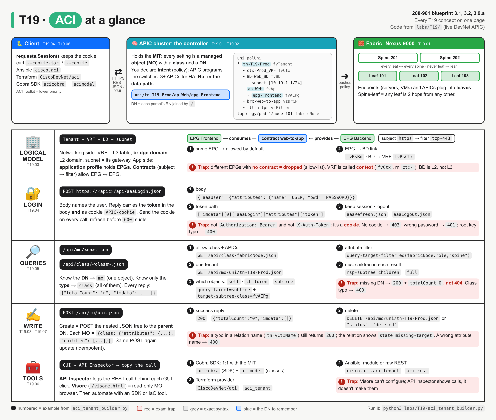
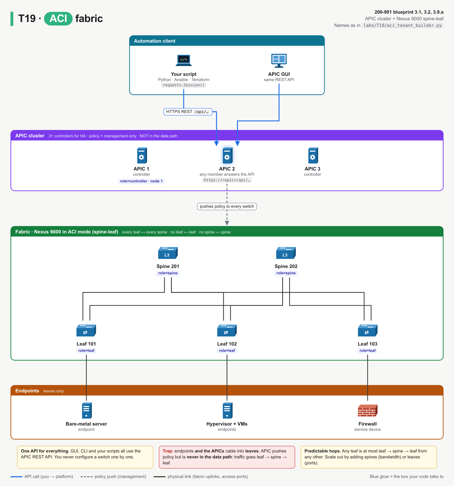
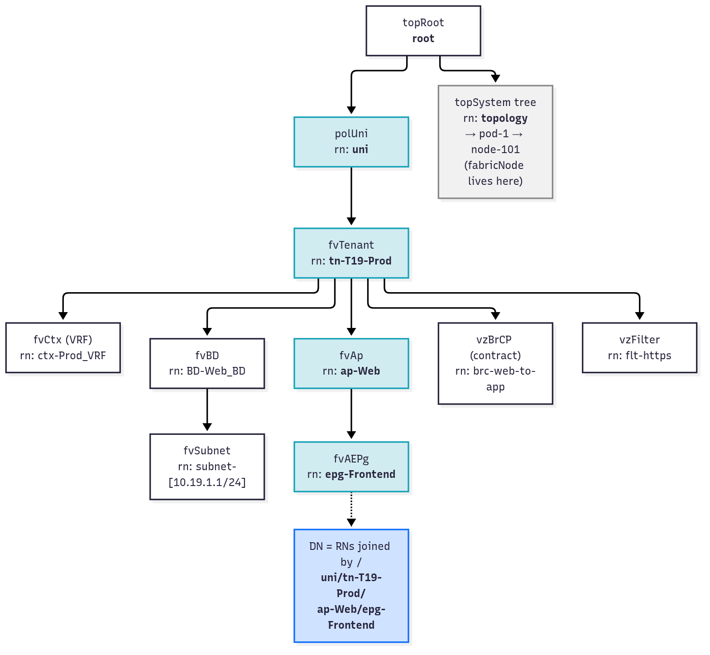
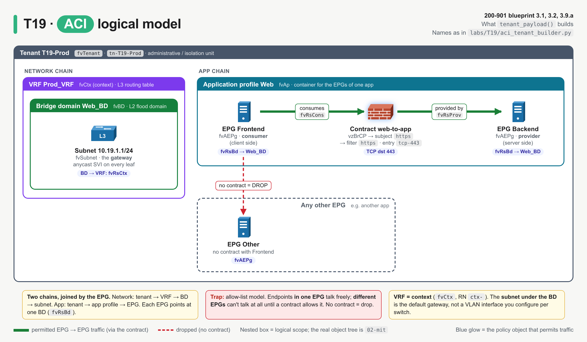
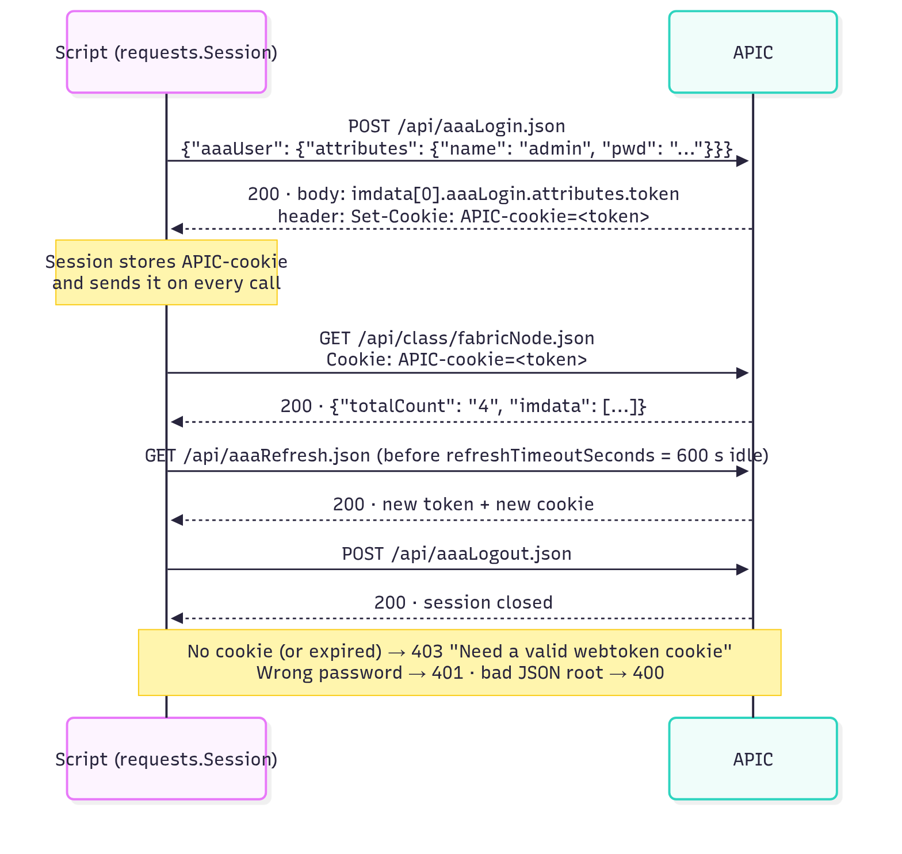
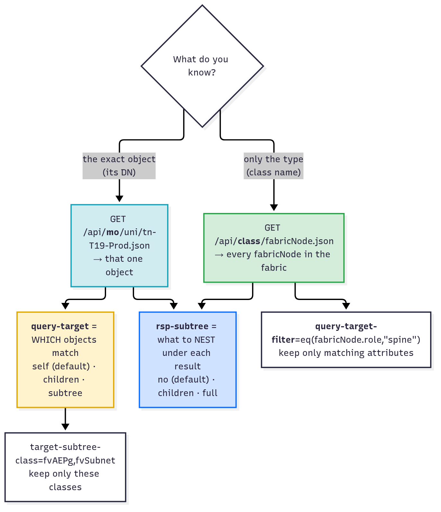
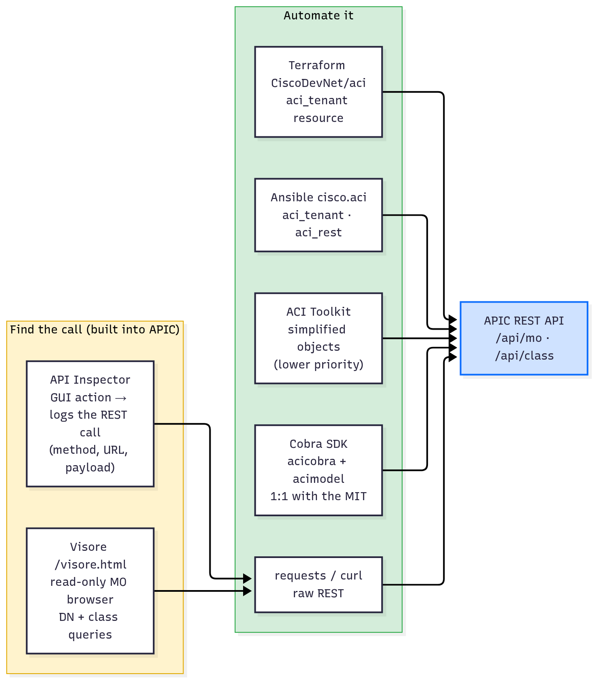

# T19 · ACI

> Owner: **Bob** · Blueprint: **3.1, 3.2, 3.9.a** · CBT coverage: **Full** · Learn by 2026-10-13 · Teach-back 2026-10-16



*Top band = the system map (client → APIC with its object tree → spine-leaf fabric). Each row below is a concept group (IDs under the icon), numbered items are calls from `labs/T19/aci_tenant_builder.py`, and red boxes are exam traps.*

## TL;DR (teach-back card)

- **ACI = SDN for the data centre.** The APIC cluster (the controller) holds the policy; the Nexus 9000 spine-leaf fabric forwards traffic. You declare intent (tenant, EPGs, contracts) and APIC programs every switch. APIC is not in the data path.
- **Everything is a managed object (MO) in one tree (the MIT).** Each MO has a **class** (`fvTenant`, `fvAEPg`, `fabricNode`) and a **DN** built from RNs: `uni/tn-Prod/ap-Web/epg-Frontend`. Logical chain: tenant → VRF (`fvCtx`) → bridge domain → subnet; application profile → EPGs; contracts (subject → filter) allow traffic between EPGs. No contract = drop.
- **REST in 3 calls:** `POST /api/aaaLogin.json` with `{"aaaUser": {"attributes": {"name", "pwd"}}}` → token in the body **and** the `APIC-cookie`. `GET /api/mo/<dn>.json` = one object. `GET /api/class/<class>.json` = all objects of a class. Scope with `query-target`, `query-target-filter` and `rsp-subtree`.
- **Trap:** the APIC token travels as a **cookie** (`APIC-cookie`), not an `Authorization` header. A `requests.Session()` sends it automatically; plain `requests.get()` doesn't, so you get `403`. And a DN that doesn't exist returns `200` with `totalCount 0`, not `404`.

## Concepts

Every section below explains one part of the same APIC session.

- `labs/T19/aci_tenant_builder.py` is the **reference program**. It logs in to the DevNet always-on APIC sandbox, queries the fabric, builds a whole tenant in one POST, queries it four ways, triggers two errors, deletes the tenant and logs out.
- Run it: `python3 labs/T19/aci_tenant_builder.py` (needs `requests`). Credentials come from `APIC_HOST`, `APIC_USER`, `APIC_PASS`. The defaults are the public DevNet sandbox values.
- The sandbox is shared, so other people's tenants appear in it. The program only touches its own `T19-Prod` tenant and deletes it at the end.

**`labs/T19/aci_tenant_builder.py`**

```python
"""T19 reference program: one APIC REST session, from login to cleanup.

1. aaaLogin            -> token + APIC-cookie
2. class queries       -> /api/class/fabricNode.json (+ query-target-filter)
3. build a tenant      -> one POST of nested JSON to /api/mo/uni.json
4. DN (mo) queries     -> query-target, target-subtree-class, rsp-subtree
5. errors              -> 400 bad class, 403 no cookie, empty result (not 404)
6. delete + logout

Target: DevNet always-on APIC sandbox (or any APIC). Credentials from env vars:
    export APIC_HOST=sandboxapicdc.cisco.com APIC_USER=admin APIC_PASS='...'
    python3 labs/T19/aci_tenant_builder.py
"""
import os
from urllib.parse import unquote

import requests
import urllib3

APIC = os.environ.get("APIC_HOST", "sandboxapicdc.cisco.com")
USER = os.environ.get("APIC_USER", "admin")
PASSWORD = os.environ.get("APIC_PASS", "!v3G@!4@Y")      # public DevNet sandbox default
TENANT = os.environ.get("APIC_TENANT", "T19-Prod")
BASE = f"https://{APIC}/api"

urllib3.disable_warnings()                                 # sandbox uses a self-signed cert


def login(session):
    """POST aaaLogin.json; APIC returns the token in the body AND as the APIC-cookie."""
    body = {"aaaUser": {"attributes": {"name": USER, "pwd": PASSWORD}}}
    resp = session.post(f"{BASE}/aaaLogin.json", json=body, verify=False, timeout=30)
    resp.raise_for_status()
    attrs = resp.json()["imdata"][0]["aaaLogin"]["attributes"]
    print(f"POST /api/aaaLogin.json -> {resp.status_code}")
    print(f"    token          : {attrs['token'][:20]}...")
    print(f"    refresh timeout: {attrs['refreshTimeoutSeconds']} s")
    print(f"    cookie jar     : {list(session.cookies.keys())}")
    return attrs["token"]


def get(session, path, **params):
    """GET /api/<path>; every APIC reply is {"totalCount": "n", "imdata": [ {class: {attributes: {...}}} ]}."""
    resp = session.get(f"{BASE}/{path}", params=params, verify=False, timeout=30)
    resp.raise_for_status()
    data = resp.json()
    print(f"\nGET {unquote(resp.url).replace(BASE, '/api')}")
    print(f"    -> {resp.status_code}, totalCount={data['totalCount']}")
    return data["imdata"]


def show(imdata, *fields):
    """Print class name + chosen attributes of each managed object (MO)."""
    for mo in imdata:
        (cls, body), = mo.items()                          # one key per MO: its class name
        attrs = body["attributes"]
        print(f"    {cls:<16} " + "  ".join(f"{f}={attrs[f]}" for f in fields))


def tenant_payload():
    """Tenant -> VRF -> BD -> subnet, filter + contract, app profile -> 2 EPGs (consumer, provider)."""
    return {"fvTenant": {"attributes": {"name": TENANT}, "children": [
        {"fvCtx": {"attributes": {"name": "Prod_VRF"}}},
        {"fvBD": {"attributes": {"name": "Web_BD"}, "children": [
            {"fvRsCtx": {"attributes": {"tnFvCtxName": "Prod_VRF"}}},
            {"fvSubnet": {"attributes": {"ip": "10.19.1.1/24"}}},
        ]}},
        {"vzFilter": {"attributes": {"name": "https"}, "children": [
            {"vzEntry": {"attributes": {"name": "tcp-443", "etherT": "ip", "prot": "tcp",
                                        "dFromPort": "443", "dToPort": "443"}}},
        ]}},
        {"vzBrCP": {"attributes": {"name": "web-to-app"}, "children": [
            {"vzSubj": {"attributes": {"name": "https"}, "children": [
                {"vzRsSubjFiltAtt": {"attributes": {"tnVzFilterName": "https"}}},
            ]}},
        ]}},
        {"fvAp": {"attributes": {"name": "Web"}, "children": [
            {"fvAEPg": {"attributes": {"name": "Frontend"}, "children": [
                {"fvRsBd": {"attributes": {"tnFvBDName": "Web_BD"}}},
                {"fvRsCons": {"attributes": {"tnVzBrCPName": "web-to-app"}}},
            ]}},
            {"fvAEPg": {"attributes": {"name": "Backend"}, "children": [
                {"fvRsBd": {"attributes": {"tnFvBDName": "Web_BD"}}},
                {"fvRsProv": {"attributes": {"tnVzBrCPName": "web-to-app"}}},
            ]}},
        ]}},
    ]}}


def main():
    session = requests.Session()                           # keeps the APIC-cookie for every call

    print("== 1. Login ==")
    login(session)

    print("\n== 2. Class queries: every object of one class ==")
    show(get(session, "class/fabricNode.json"), "id", "name", "role", "model")
    show(get(session, "class/fabricNode.json",
             **{"query-target-filter": 'eq(fabricNode.role,"spine")'}), "id", "name", "role")

    print("\n== 3. Create: POST the whole tenant tree to the parent DN (uni) ==")
    resp = session.post(f"{BASE}/mo/uni.json", json=tenant_payload(), verify=False, timeout=30)
    print(f"POST /api/mo/uni.json -> {resp.status_code}, body={resp.text}")

    print("\n== 4. DN queries: one object, then down the tree ==")
    tn = f"mo/uni/tn-{TENANT}.json"
    show(get(session, tn), "dn")                                                # the tenant only
    show(get(session, tn, **{"query-target": "children"}), "dn")                # direct children
    show(get(session, tn, **{"query-target": "subtree",
                             "target-subtree-class": "fvAEPg,fvSubnet"}), "dn")  # whole tree, 2 classes
    epg = get(session, f"mo/uni/tn-{TENANT}/ap-Web/epg-Frontend.json", **{"rsp-subtree": "children"})
    for child in epg[0]["fvAEPg"]["children"]:                                  # EPG + its children
        (cls, body), = child.items()
        if cls.startswith("fvRs"):
            a = body["attributes"]
            print(f"    child {cls:<14} tDn={a['tDn']}  state={a['state']}")

    print("\n== 5. Errors ==")
    for label, sess, path in (("typo in class", session, "class/fvTenantt.json"),
                              ("no cookie", requests.Session(), "class/fvTenant.json")):
        resp = sess.get(f"{BASE}/{path}", verify=False, timeout=30)
        print(f"{label:<14} GET /api/{path} -> {resp.status_code}: "
              f"{resp.json()['imdata'][0]['error']['attributes']['text'][:60]}")

    print("\n== 6. Delete, check, logout ==")
    resp = session.delete(f"{BASE}/{tn}", verify=False, timeout=30)
    print(f"DELETE /api/{tn} -> {resp.status_code}")
    get(session, tn)                                       # gone: 200 + totalCount 0, not 404
    resp = session.post(f"{BASE}/aaaLogout.json", json={"aaaUser": {"attributes": {"name": USER}}},
                        verify=False, timeout=30)
    print(f"POST /api/aaaLogout.json -> {resp.status_code}")


if __name__ == "__main__":
    main()
```

**Output** (live run against `sandboxapicdc.cisco.com`, APIC 6.1(4h), 10 Oct 2026):

```
== 1. Login ==
POST /api/aaaLogin.json -> 200
    token          : eyJhbGciOiJSUzI1NiIs...
    refresh timeout: 600 s
    cookie jar     : ['APIC-cookie']

== 2. Class queries: every object of one class ==

GET /api/class/fabricNode.json
    -> 200, totalCount=4
    fabricNode       id=102  name=leaf-2  role=leaf  model=N9K-C9396PX
    fabricNode       id=201  name=spine-1  role=spine  model=N9K-C9508
    fabricNode       id=101  name=leaf-1  role=leaf  model=N9K-C9396PX
    fabricNode       id=1  name=apic1  role=controller  model=

GET /api/class/fabricNode.json?query-target-filter=eq(fabricNode.role,"spine")
    -> 200, totalCount=1
    fabricNode       id=201  name=spine-1  role=spine

== 3. Create: POST the whole tenant tree to the parent DN (uni) ==
POST /api/mo/uni.json -> 200, body={"totalCount":"0","imdata":[]}

== 4. DN queries: one object, then down the tree ==

GET /api/mo/uni/tn-T19-Prod.json
    -> 200, totalCount=1
    fvTenant         dn=uni/tn-T19-Prod

GET /api/mo/uni/tn-T19-Prod.json?query-target=children
    -> 200, totalCount=8
    fvAp             dn=uni/tn-T19-Prod/ap-Web
    fvBD             dn=uni/tn-T19-Prod/BD-Web_BD
    fvCtx            dn=uni/tn-T19-Prod/ctx-Prod_VRF
    fvEpTags         dn=uni/tn-T19-Prod/eptags
    fvRsTenantMonPol dn=uni/tn-T19-Prod/rsTenantMonPol
    vnsSvcCont       dn=uni/tn-T19-Prod/svcCont
    vzBrCP           dn=uni/tn-T19-Prod/brc-web-to-app
    vzFilter         dn=uni/tn-T19-Prod/flt-https

GET /api/mo/uni/tn-T19-Prod.json?query-target=subtree&target-subtree-class=fvAEPg,fvSubnet
    -> 200, totalCount=3
    fvSubnet         dn=uni/tn-T19-Prod/BD-Web_BD/subnet-[10.19.1.1/24]
    fvAEPg           dn=uni/tn-T19-Prod/ap-Web/epg-Backend
    fvAEPg           dn=uni/tn-T19-Prod/ap-Web/epg-Frontend

GET /api/mo/uni/tn-T19-Prod/ap-Web/epg-Frontend.json?rsp-subtree=children
    -> 200, totalCount=1
    child fvRsBd         tDn=uni/tn-T19-Prod/BD-Web_BD  state=formed
    child fvRsCons       tDn=uni/tn-T19-Prod/brc-web-to-app  state=formed
    child fvRsCustQosPol tDn=uni/tn-common/qoscustom-default  state=formed

== 5. Errors ==
typo in class  GET /api/class/fvTenantt.json -> 400: Request failed, unresolved class for fvTenantt
no cookie      GET /api/class/fvTenant.json -> 403: Need a valid webtoken cookie (named APIC-Cookie) or a signed

== 6. Delete, check, logout ==
DELETE /api/mo/uni/tn-T19-Prod.json -> 200

GET /api/mo/uni/tn-T19-Prod.json
    -> 200, totalCount=0
POST /api/aaaLogout.json -> 200
```

- The order of the `fabricNode` rows changes between runs. APIC doesn't sort class results unless you ask (`order-by`).

### T19.01 · What ACI is

**Must cover:**

- [x] Cisco SDN for the data centre: APIC controller cluster + Nexus 9000 spine-leaf fabric
- [x] Policy model: define application intent, APIC programs the fabric

**Notes:**

- **ACI** = Application Centric Infrastructure. It's Cisco's **SDN** (software-defined networking) for the **data centre**. One controller manages the whole fabric, so you don't configure each switch.
- Two parts:
  - **APIC** (Application Policy Infrastructure Controller): a **cluster** of controllers, normally 3 or more for redundancy. It holds all the configuration and exposes the REST API. The GUI, the CLI and your scripts all use the same REST API.
  - **Fabric**: Nexus 9000 switches running in **ACI mode** (not standalone NX-OS), cabled as **spine-leaf**.
- **Spine-leaf** rules (exam angle):
  - every leaf connects to every spine; leaves never connect to leaves, and spines never connect to spines
  - endpoints (servers, VMs, firewalls) and the APICs plug into **leaves**, never into spines
  - so any leaf is at most leaf → spine → leaf away from any other: predictable latency, scale out by adding spines
- In the program's output, `class/fabricNode.json` returns exactly this: `role=leaf` (101, 102), `role=spine` (201) and `role=controller` (the APIC itself, node 1).



*Scripts and the GUI both talk REST to the APIC. APIC pushes policy to the switches, but traffic flows leaf → spine → leaf and never through the APIC.*

- **Policy model / intent-based:** you describe **what the application needs** (these servers form a group, this group may talk to that group on TCP 443). APIC turns it into switch config (VLANs/VXLAN, ACL entries, routes) on the right leaves.
  - Compare device-by-device CLI (T12): you'd configure VLANs, SVIs and ACLs on every switch yourself.
- Where ACI sits among the platforms (blueprint 3.2): Meraki = cloud-managed campus/branch (T18), Catalyst Center = on-prem campus controller (T20), Catalyst SD-WAN = WAN (T22), **ACI = data centre**, NSO = multi-vendor orchestration (T25).

### T19.02 · Object model

**Must cover:**

- [x] Management Information Tree (MIT): every element is a managed object (MO) with a class and a distinguished name (DN)
- [x] Example DN: uni/tn-Prod/ap-Web/epg-Frontend

**Notes:**

- APIC stores **everything** (config and live state) as objects in one tree: the **Management Information Tree (MIT)**.
- Each node in the tree is a **managed object (MO)**. Each MO has:
  - a **class**: its type, e.g. `fvTenant`, `fvAEPg`, `fabricNode`. The prefix is the package: `fv` = fabric virtualisation (tenant objects), `vz` = contracts and filters, `fabric` = physical fabric, `aaa` = users and login.
  - an **RN** (relative name): its name under its parent, e.g. `tn-T19-Prod`, `ap-Web`, `epg-Frontend`. Each class has a fixed RN prefix (`tn-`, `ap-`, `epg-`, `BD-`, `ctx-`, `brc-`, `flt-`).
  - a **DN** (distinguished name): every RN from the root down, joined by `/`. It's unique in the whole fabric.
- Example DN, read left to right: `uni/tn-Prod/ap-Web/epg-Frontend` = policy universe → tenant `Prod` → application profile `Web` → EPG `Frontend`.
- Two big branches under the root:
  - `uni` (class `polUni`): the **policy** universe. All tenants live here.
  - `topology` : the **physical** fabric, e.g. `topology/pod-1/node-101` is a `fabricNode` (see the output of section 2).



*Each box shows the class and the RN. Follow the blue boxes down: their RNs joined by `/` give the DN `uni/tn-T19-Prod/ap-Web/epg-Frontend`.*

- In the program's output (section 4), every `dn=` line is a path in this tree: `uni/tn-T19-Prod/BD-Web_BD/subnet-[10.19.1.1/24]` is a subnet under a BD under the tenant. Square brackets wrap RN values that contain `/` or `.`.
- In JSON, every MO has the same shape, so one parser works for every class:

```json
{"fvTenant": {"attributes": {"dn": "uni/tn-T19-Prod", "name": "T19-Prod"}, "children": [ ... ]}}
```

- `show()` in the program relies on this: `(cls, body), = mo.items()` takes the one key (the class name), then reads `body["attributes"]`.

### T19.03 · Logical constructs

**Must cover:**

- [x] Tenant → VRF (context) → bridge domain (L2) → subnets
- [x] Application profile → EPGs (endpoint groups)
- [x] Contracts (with filters) permit traffic between EPGs

**Notes:**

- `tenant_payload()` builds every construct below in one nested JSON tree. Each row is one dict in that function:

| Construct | Class | RN | Networking meaning (Bob's mental map) | In `tenant_payload()` |
|---|---|---|---|---|
| **Tenant** | `fvTenant` | `tn-` | administrative/isolation unit (customer, BU, environment) | `T19-Prod` |
| **VRF** (a.k.a. **context**) | `fvCtx` | `ctx-` | L3 routing table | `Prod_VRF` |
| **Bridge domain (BD)** | `fvBD` | `BD-` | L2 forwarding/flood domain, tied to one VRF (`fvRsCtx`) | `Web_BD` |
| **Subnet** | `fvSubnet` | `subnet-[ip]` | gateway IP on the BD (anycast SVI on every leaf) | `10.19.1.1/24` |
| **Application profile** | `fvAp` | `ap-` | container that groups the EPGs of one app | `Web` |
| **EPG** (endpoint group) | `fvAEPg` | `epg-` | set of endpoints with the same policy; tied to one BD (`fvRsBd`) | `Frontend`, `Backend` |
| **Filter** | `vzFilter` + `vzEntry` | `flt-` | L2–L4 match, like an ACL line | `https`: TCP dst 443 |
| **Contract** | `vzBrCP` + `vzSubj` | `brc-` | the rule that allows EPG ↔ EPG traffic; a subject points at filters | `web-to-app` |

- **Network chain:** tenant → VRF → BD → subnet. **App chain:** tenant → application profile → EPG. The EPG joins the two by pointing at a BD.
- **Contracts:** one EPG **provides** the contract (the server side, `fvRsProv`), the other **consumes** it (the client side, `fvRsCons`). Contract → **subject** → **filter** → entries.
  - In the program: `Backend` provides `web-to-app`, and `Frontend` consumes it. So Frontend may open TCP 443 to Backend.
- **Allow-list model:** endpoints in the **same** EPG talk freely. Endpoints in **different** EPGs can't talk at all until a contract allows it. This is the opposite of a traditional switch, where everything in a VLAN/VRF can talk by default.



*Left = network chain (VRF → BD → subnet), right = app chain (app profile → EPGs); each EPG's tag shows its `fvRsBd` relation to Web_BD. The green arrows through the glowing contract are the only permitted EPG-to-EPG traffic. "EPG Other" has no contract, so it's dropped (red).*

- **Relation objects** (`fvRs…`, `vzRs…`) link MOs by name. They're children too: `fvRsBd` with `tnFvBDName: "Web_BD"` is how an EPG says "my BD is Web_BD". The last query in section 4 shows the Frontend EPG's relations resolved to real DNs (`tDn=uni/tn-T19-Prod/BD-Web_BD`, `state=formed`).

### T19.04 · REST API login

**Must cover:**

- [x] POST https://<apic>/api/aaaLogin.json
- [x] Body: {"aaaUser": {"attributes": {"name": "...", "pwd": "..."}}}
- [x] Returns a token, also set as the APIC-cookie for later calls

**Notes:**

- `login()` in the program, step by step:
  1. `POST https://<apic>/api/aaaLogin.json`. The `.json` suffix picks the encoding (use `.xml` for XML).
  2. Body: `{"aaaUser": {"attributes": {"name": USER, "pwd": PASSWORD}}}`. The login body is itself an MO (class `aaaUser`), so it has the usual `{class: {"attributes": {...}}}` shape.
  3. Reply `200`. The token is at `["imdata"][0]["aaaLogin"]["attributes"]["token"]`.
  4. The **same token** also arrives as a `Set-Cookie` header, cookie name **`APIC-cookie`**. The output line `cookie jar : ['APIC-cookie']` proves `requests.Session()` stored it.
  5. Every later call sends `Cookie: APIC-cookie=<token>`. The session does this automatically.
- **Session lifetime:** `refreshTimeoutSeconds` = `600` on the sandbox. Idle longer and the token dies. Keep it alive with `GET /api/aaaRefresh.json` (returns a new token and cookie). End it with `POST /api/aaaLogout.json`.
- Errors seen live (section 5 and the break-it table):
  - no cookie → `403` "Need a valid webtoken cookie (named APIC-Cookie)…"
  - wrong password → `401` "User credential is incorrect"
  - wrong root key (`aaaUsers`) → `400`



*Login once, then the cookie rides on every call. Refresh before the 600 s idle timeout; log out at the end.*

- Compared with other platforms (full detail in [T10](../bee/T10-api-authentication.md)):

| Platform | Get a token | Send it as |
|---|---|---|
| **ACI APIC** | `POST /api/aaaLogin.json` with a JSON body | cookie `APIC-cookie` |
| Catalyst Center | `POST /dna/system/api/v1/auth/token` with Basic auth | header `X-Auth-Token` |
| Meraki | API key from the dashboard | header `Authorization: Bearer <key>` |

### T19.05 · Queries

**Must cover:**

- [x] GET /api/mo/<dn>.json: one object (and children with query-target=children/subtree)
- [x] GET /api/class/<class>.json: all objects of a class, e.g. fabricNode, fvTenant
- [x] Filters: query-target-filter, rsp-subtree

**Notes:**

- Two kinds of query. Choose by what you know:

| You know | URL | Returns | In the program |
|---|---|---|---|
| the **DN** of one object | `GET /api/mo/<dn>.json` | that object (`totalCount` 1, or 0 if it doesn't exist) | `mo/uni/tn-T19-Prod.json` |
| only the **class** | `GET /api/class/<class>.json` | every object of that class, anywhere in the tree | `class/fabricNode.json` → 4 nodes |

- Every reply has the same envelope: `{"totalCount": "<n as a string>", "imdata": [ MO, MO, … ]}`. `get()` returns `imdata`.
- Options go in the query string. `get()` passes them as `params`, so `requests` builds and encodes `?key=value`:

| Option | Answers | Values | Program line → result |
|---|---|---|---|
| `query-target` | **which** objects to return, relative to the DN | `self` (default), `children`, `subtree` | `children` → 8 direct children of the tenant |
| `target-subtree-class` | keep only these classes (with `children`/`subtree`) | class names, comma-separated | `subtree` + `fvAEPg,fvSubnet` → 3 objects from anywhere under the tenant |
| `query-target-filter` | keep only objects whose **attributes** match | `eq(class.attr,"value")`, also `ne`, `lt`, `gt`, `wcard`, `and(...)`, `or(...)` | `eq(fabricNode.role,"spine")` → 1 node |
| `rsp-subtree` | what to **nest** under each returned object | `no` (default), `children`, `full` | `children` on the Frontend EPG → its `fvRs…` relations inside `"children"` |
| `rsp-subtree-class` | which nested classes to include | class names | (not in the program) |



*DN known → `mo`. Class known → `class`. `query-target` changes **which** objects come back; `rsp-subtree` changes **how much** of each one comes back.*

- The difference that gets tested: `query-target=children` returns the children **as the results** (8 separate items in `imdata`). `rsp-subtree=children` returns the **object itself** with its children nested inside it (1 item in `imdata`, with a `"children"` list).
- A DN that doesn't exist isn't an HTTP error: section 6 shows `200, totalCount=0` after the delete. Check `totalCount`, not just the status code.

### T19.06 · Tools

**Must cover:**

- [x] API Inspector (shows API calls behind GUI actions); Visore (object browser)
- [x] Cobra SDK (acicobra/acimodel); ACI Toolkit (lower priority)
- [x] Ansible and Terraform providers for ACI

**Notes:**

- **Find the call** (built into APIC):
  - **API Inspector**: in the APIC GUI, user menu → *Show API Inspector*. It logs every REST call the GUI makes (method, URL, payload, response). Click "create tenant" in the GUI, then copy the logged POST into your script. It shows calls; it doesn't send them.
  - **Visore** (Managed Object Browser, "Object Store Browser" in the GUI): `https://<apic>/visore.html`. A **read-only** browser for the MIT. Type a class or a DN, see the attributes, click through to parents and children. It shows the query it ran. It can't change configuration.
- **Automate it:**

| Tool | What it is | Install / name | Shown in |
|---|---|---|---|
| `requests` / curl | raw REST, as in this note | `pip install requests` | reference program, curl drill |
| **Cobra SDK** | Cisco's official Python SDK; one Python class per MIT class | two packages: **`acicobra`** (the SDK: session, `MoDirectory`, requests) + **`acimodel`** (the generated model classes, `cobra.model.fv.Tenant`…). Download both `.whl` files from your APIC at `https://<apic>/cobra/_downloads/` | Example 4 |
| **ACI Toolkit** | older, simplified object library (`Tenant`, `EPG`, `Contract`) over the REST API | `acitoolkit` on GitHub | lower priority |
| **Ansible** | `cisco.aci` collection: one module per object, plus `aci_rest` for any REST path | `ansible-galaxy collection install cisco.aci` | Example 3 (run live) |
| **Terraform** | `CiscoDevNet/aci` provider: `aci_tenant`, `aci_vrf`, … resources | `terraform init` downloads it | Example 5 |



*Every tool ends up calling the same `/api/mo` and `/api/class` endpoints. API Inspector and Visore help you find the right call; the rest automate it.*

- Cobra vs Toolkit: Cobra maps 1:1 to the MIT, so it can do everything but you need to know the class names. Toolkit hides the classes behind simpler objects, but covers less.

### T19.07 · Exam angle

**Must cover:**

- [x] Build the login or class query; map tenant/EPG/contract terms; complete Python requests code

**Notes:**

- **Build the login:** URL `https://<apic>/api/aaaLogin.json`, method `POST`, body `{"aaaUser": {"attributes": {"name": "...", "pwd": "..."}}}`. Token at `["imdata"][0]["aaaLogin"]["attributes"]["token"]`.
- **Build a class query:** `https://<apic>/api/class/fabricNode.json`. A filtered one: `?query-target-filter=eq(fabricNode.role,"leaf")`.
- **Map the terms:**
  - VRF = context (`fvCtx`)
  - BD = L2 (`fvBD`)
  - EPG = group of endpoints with one policy (`fvAEPg`, under an application profile `fvAp`)
  - contract = permits EPG ↔ EPG (`vzBrCP` → subject → filter)
  - provider = serves, consumer = calls
- **Complete the code.** The blanks usually sit on these lines of the program:
  - `session = requests.Session()` (keeps the cookie)
  - `session.post(f"{BASE}/aaaLogin.json", json=body, verify=False)`
  - `resp.json()["imdata"][0]["aaaLogin"]["attributes"]["token"]`
  - `session.get(f"{BASE}/class/fabricNode.json", verify=False)`
  - looping `for mo in data["imdata"]: mo["fabricNode"]["attributes"]["name"]`
- If the code doesn't use a session, it must send the cookie itself: `requests.get(url, cookies={"APIC-cookie": token}, verify=False)`. Example 2 shows this.

## Exam traps

- **Cookie, not header.** APIC sends the token back as `APIC-cookie`. `Authorization: Bearer` is Meraki/Webex; `X-Auth-Token` is Catalyst Center. No cookie → `403`.
- **`requests.Session()` vs `requests.get()`.** The session replays the cookie automatically. A bare `requests.get()` after login has no cookie → `403` (break-it edit 2).
- **`mo` vs `class`.** `mo` + a **DN** = one object. `class` + a **class name** = all of them. `/api/mo/fabricNode.json` → `400`; `/api/class/uni/tn-X.json` makes no sense.
- **`query-target` vs `rsp-subtree`.** query-target = which objects are the results (`self` / `children` / `subtree`). rsp-subtree = what's nested inside each result (`no` / `children` / `full`).
- **Filter syntax:** `query-target-filter=eq(fabricNode.role,"spine")`. That's `class.attribute`, then a **quoted** value, inside `eq(...)`.
- **Not found ≠ 404.** A missing DN gives `200` and `"totalCount": "0"`. A misspelt **class** gives `400` "unresolved class".
- **POST creates and updates.** Create = POST the tree to the **parent** DN (`/api/mo/uni.json` for a tenant). The reply is `200` with an empty `imdata`, not `201`. Delete = `DELETE /api/mo/<dn>.json`, or POST the MO with `"status": "deleted"`.
- **Relation typos don't fail.** `tnFvCtxName: "Prod-VRF"` (wrong name) still returns `200`. The relation's `state` becomes `missing-target`. An unknown **attribute** name returns `400`.
- **VRF = context.** The class is `fvCtx`, the RN is `ctx-`. BD = L2 domain; the **subnet under the BD** is the gateway.
- **No contract = drop** between different EPGs (allow-list). Inside one EPG, everything's allowed.
- **Provider vs consumer:** the provider EPG serves (the server side); the consumer EPG starts the connection.
- **Spine-leaf:** endpoints and APICs connect to **leaves** only. There are no leaf-to-leaf or spine-to-spine links. APIC is never in the data path.
- **Visore is read-only.** API Inspector shows the calls the GUI makes; it doesn't send any.
- **Cobra = `acicobra` + `acimodel`.** It comes from the APIC (`/cobra/_downloads/`), not as a single PyPI package.

## Examples

### 1. Run the reference program

```bash
export APIC_HOST=sandboxapicdc.cisco.com APIC_USER=admin APIC_PASS='<sandbox password from developer.cisco.com/sandbox>'
python3 -m pip install requests
python3 labs/T19/aci_tenant_builder.py
```

In the lab container (`requests` is already in the image):

```bash
docker build --tag ccna-auto-lab:latest --file labs/Dockerfile labs/
docker run --rm --volume "$(pwd)":/work --workdir /work \
  --env APIC_HOST --env APIC_USER --env APIC_PASS \
  ccna-auto-lab:latest python3 labs/T19/aci_tenant_builder.py
```

### 2. curl drill (`labs/T19/curl_drill.sh`)

This is study aid T19.3: aaaLogin plus a class query on `fabricNode`, with curl.

```bash
#!/usr/bin/env bash
# T19 curl drill: APIC aaaLogin + class query (fabricNode) + DN query, against the DevNet always-on APIC.
#   export APIC_HOST=sandboxapicdc.cisco.com APIC_USER=admin APIC_PASS='...'
#   bash labs/T19/curl_drill.sh
set -u
APIC="${APIC_HOST:-sandboxapicdc.cisco.com}"
USER="${APIC_USER:-admin}"
PASS="${APIC_PASS:-!v3G@!4@Y}"            # public DevNet sandbox default
JAR="$(mktemp)"                           # curl cookie jar: holds APIC-cookie after login
trap 'rm -f "$JAR"' EXIT

echo "== 1. aaaLogin: POST JSON body, save the Set-Cookie into the jar"
curl --silent --insecure --request POST \
  --cookie-jar "$JAR" \
  --header "Content-Type: application/json" \
  --data "{\"aaaUser\": {\"attributes\": {\"name\": \"$USER\", \"pwd\": \"$PASS\"}}}" \
  "https://$APIC/api/aaaLogin.json" \
  | python3 -c "import json, sys; a = json.load(sys.stdin)['imdata'][0]['aaaLogin']['attributes']; print('token', a['token'][:20] + '...', 'refresh', a['refreshTimeoutSeconds'])"
grep -o 'APIC-cookie' "$JAR"

echo; echo "== 2. Class query: all fabricNode objects (send the cookie back with --cookie)"
curl --silent --insecure --cookie "$JAR" \
  "https://$APIC/api/class/fabricNode.json" \
  | python3 -c "import json, sys; d = json.load(sys.stdin); print('totalCount', d['totalCount']); [print(' ', n['fabricNode']['attributes']['dn'], n['fabricNode']['attributes']['role']) for n in d['imdata']]"

echo; echo "== 3. Class query + filter (--get --data-urlencode builds the ?query string)"
curl --silent --insecure --cookie "$JAR" --get \
  --data-urlencode 'query-target-filter=eq(fabricNode.role,"leaf")' \
  "https://$APIC/api/class/fabricNode.json" \
  | python3 -c "import json, sys; d = json.load(sys.stdin); print('totalCount', d['totalCount'])"

echo; echo "== 4. DN query: one object by its distinguished name"
curl --silent --insecure --cookie "$JAR" \
  "https://$APIC/api/mo/uni/tn-common.json" \
  | python3 -c "import json, sys; d = json.load(sys.stdin); print(d['imdata'][0]['fvTenant']['attributes']['dn'])"

echo; echo "== 5. Same query with no cookie -> 403"
curl --silent --insecure --output /dev/null --write-out "HTTP %{http_code}\n" \
  "https://$APIC/api/class/fabricNode.json"
```

Output (`bash labs/T19/curl_drill.sh`, live sandbox):

```
== 1. aaaLogin: POST JSON body, save the Set-Cookie into the jar
token eyJhbGciOiJSUzI1NiIs... refresh 600
APIC-cookie

== 2. Class query: all fabricNode objects (send the cookie back with --cookie)
totalCount 4
  topology/pod-1/node-101 leaf
  topology/pod-1/node-102 leaf
  topology/pod-1/node-201 spine
  topology/pod-1/node-1 controller

== 3. Class query + filter (--get --data-urlencode builds the ?query string)
totalCount 2

== 4. DN query: one object by its distinguished name
uni/tn-common

== 5. Same query with no cookie -> 403
HTTP 403
```

- curl doesn't keep cookies by default. `--cookie-jar FILE` **saves** the `Set-Cookie` from the login, and `--cookie FILE` **sends** it back.
- `--get --data-urlencode` builds and encodes the query string. Typing `?query-target-filter=eq(...)` straight into the URL also works if you quote it.
- Without a session, send the token by hand in Python:

```python
import os
import requests
import urllib3

urllib3.disable_warnings()
apic = os.environ.get("APIC_HOST", "sandboxapicdc.cisco.com")
body = {"aaaUser": {"attributes": {"name": os.environ["APIC_USER"], "pwd": os.environ["APIC_PASS"]}}}
login = requests.post(f"https://{apic}/api/aaaLogin.json", json=body, verify=False, timeout=30)
token = login.json()["imdata"][0]["aaaLogin"]["attributes"]["token"]
nodes = requests.get(f"https://{apic}/api/class/fabricNode.json",
                     cookies={"APIC-cookie": token}, verify=False, timeout=30)
print(nodes.status_code, nodes.json()["totalCount"])
```

Output: `200 4`.

### 3. Ansible: `cisco.aci` collection (`labs/T19/aci_tenant.yml`)

```yaml
---
# T19 Ansible example: the same tenant/VRF objects through the cisco.aci collection.
#   ansible-galaxy collection install cisco.aci
#   export APIC_HOST=sandboxapicdc.cisco.com APIC_USER=admin APIC_PASS='...'
#   ansible-playbook labs/T19/aci_tenant.yml
- name: T19 ACI tenant with cisco.aci
  hosts: localhost
  gather_facts: false
  module_defaults:
    group/cisco.aci.all:
      host: "{{ lookup('env', 'APIC_HOST') | default('sandboxapicdc.cisco.com', true) }}"
      username: "{{ lookup('env', 'APIC_USER') | default('admin', true) }}"
      password: "{{ lookup('env', 'APIC_PASS') }}"
      validate_certs: false
  tasks:
    - name: Tenant exists
      cisco.aci.aci_tenant:
        tenant: T19-Ansible
        state: present

    - name: VRF exists in the tenant
      cisco.aci.aci_vrf:
        tenant: T19-Ansible
        vrf: Prod_VRF
        state: present

    - name: Raw class query when no module fits (aci_rest = any APIC REST path)
      cisco.aci.aci_rest:
        path: /api/class/fabricNode.json?query-target-filter=eq(fabricNode.role,"spine")
        method: get
      register: spines

    - name: Show the spine names
      ansible.builtin.debug:
        msg: "{{ spines.imdata | map(attribute='fabricNode.attributes.name') | list }}"

    - name: Clean up (state absent deletes the tenant and everything under it)
      cisco.aci.aci_tenant:
        tenant: T19-Ansible
        state: absent
```

```bash
ansible-galaxy collection install cisco.aci
export APIC_HOST=sandboxapicdc.cisco.com APIC_USER=admin APIC_PASS='<sandbox password>'
ansible-playbook labs/T19/aci_tenant.yml
```

Output (ansible-core 2.17 with cisco.aci 2.13.0, live sandbox):

```
[WARNING]: No inventory was parsed, only implicit localhost is available
[WARNING]: provided hosts list is empty, only localhost is available. Note that
the implicit localhost does not match 'all'

PLAY [T19 ACI tenant with cisco.aci] *******************************************

TASK [Tenant exists] ***********************************************************
changed: [localhost]

TASK [VRF exists in the tenant] ************************************************
changed: [localhost]

TASK [Raw class query when no module fits (aci_rest = any APIC REST path)] *****
ok: [localhost]

TASK [Show the spine names] ****************************************************
ok: [localhost] => {
    "msg": [
        "spine-1"
    ]
}

TASK [Clean up (state absent deletes the tenant and everything under it)] ******
changed: [localhost]

PLAY RECAP *********************************************************************
localhost                  : ok=5    changed=3    unreachable=0    failed=0    skipped=0    rescued=0    ignored=0   
```

- The modules are declarative (`state: present` / `absent`): they report `changed` only when the APIC object differs from what you asked for.
- `aci_rest` is the escape hatch. It takes any `/api/...` path, so anything the REST API can do, Ansible can do.

### 4. Cobra SDK (not run: see To verify)

Same login, class query and tenant create, using Cisco's SDK. Install `acicobra` and `acimodel` from `https://<apic>/cobra/_downloads/` first.

```python
import os

from cobra.mit.access import MoDirectory
from cobra.mit.request import ConfigRequest
from cobra.mit.session import LoginSession
from cobra.model.fv import Ctx, Tenant

apic = os.environ.get("APIC_HOST", "sandboxapicdc.cisco.com")
session = LoginSession(f"https://{apic}", os.environ["APIC_USER"], os.environ["APIC_PASS"], secure=False)
mo_dir = MoDirectory(session)
mo_dir.login()                                         # aaaLogin under the hood

for node in mo_dir.lookupByClass("fabricNode"):        # = GET /api/class/fabricNode.json
    print(node.dn, node.role)

uni = mo_dir.lookupByDn("uni")                         # = GET /api/mo/uni.json
tenant = Tenant(uni, "T19-Cobra")                      # parent + name -> DN uni/tn-T19-Cobra
Ctx(tenant, "Prod_VRF")                                # child VRF -> uni/tn-T19-Cobra/ctx-Prod_VRF
config = ConfigRequest()
config.addMo(tenant)
mo_dir.commit(config)                                  # = POST /api/mo/uni.json
mo_dir.logout()
```

- Each Cobra class is an MIT class: `cobra.model.fv.Tenant` = `fvTenant`, `cobra.model.fv.Ctx` = `fvCtx`. You create a child by passing its parent object, which builds the DN for you.

### 5. Terraform (not run: see To verify)

```hcl
terraform {
  required_providers {
    aci = {
      source = "CiscoDevNet/aci"
    }
  }
}

variable "apic_password" {
  type      = string
  sensitive = true
}

provider "aci" {
  url      = "https://sandboxapicdc.cisco.com"
  username = "admin"
  password = var.apic_password
  insecure = true
}

resource "aci_tenant" "t19" {
  name = "T19-Terraform"
}

resource "aci_vrf" "prod" {
  tenant_dn = aci_tenant.t19.id
  name      = "Prod_VRF"
}
```

```bash
export TF_VAR_apic_password='<sandbox password>'
terraform init
terraform apply -auto-approve
terraform destroy -auto-approve
```

- `aci_tenant.t19.id` is the tenant's **DN** (`uni/tn-T19-Terraform`). The child resource references its parent by DN, exactly as in the MIT.

### 6. Break it on purpose

Edit `labs/T19/aci_tenant_builder.py`, run it, and then `git checkout -- labs/T19/aci_tenant_builder.py` to undo. All five were run against the live sandbox, in a copy of the file. The result shown is the real output (for edit 4, the `missing-target` state was read with a separate GET on `…/BD-Web_BD/rsctx.json`).

| # | Edit | Result | Lesson |
|---|---|---|---|
| 1 | In `login()`, change `"aaaUser"` to `"aaaUsers"` | `HTTPError: 400 Client Error: Bad Request for url: …/api/aaaLogin.json` | the root key must be the class name `aaaUser` |
| 2 | In `get()`, change `session.get(` to `requests.get(` | login still `200`, then `HTTPError: 403 Client Error: Forbidden for url: …/api/class/fabricNode.json` | a bare request carries no `APIC-cookie` |
| 3 | In `main()`, change `"class/fabricNode.json"` to `"mo/fabricNode.json"` on the first `show(get(...))` line | `HTTPError: 400 Client Error: Bad Request for url: …/api/mo/fabricNode.json` | `mo` needs a DN, not a class name |
| 4 | In `tenant_payload()`, change `"tnFvCtxName": "Prod_VRF"` to `"Prod-VRF"` | `POST /api/mo/uni.json -> 200, body={"totalCount":"0","imdata":[]}`; the BD's `fvRsCtx` then shows `state=missing-target` | relation names aren't validated at POST time |
| 5 | In `tenant_payload()`, change `{"name": TENANT}` to `{"name": TENANT, "colour": "red"}` | `POST /api/mo/uni.json -> 400, body={…"text":"unknown attribute 'colour' in element 'fvTenant'"…}` | attribute names **are** validated |

## Practice questions

**Q1.** Complete the code so that the script authenticates to APIC and reuses the token on the next call.

```python
session = requests.__________()
body = {"aaaUser": {"attributes": {"name": user, "pwd": password}}}
session.post(f"https://{apic}/api/__________.json", json=body, verify=False)
nodes = session.get(f"https://{apic}/api/class/fabricNode.json", verify=False)
```

<details><summary>Answer</summary>

**`Session`** and **`aaaLogin`**. The session stores the `APIC-cookie` from the login reply and sends it on the `GET`. (T19.04)
</details>

**Q2.** Which URL returns every leaf and spine switch registered in the fabric?
A. `GET /api/mo/fabricNode.json`  B. `GET /api/class/fabricNode.json`  C. `GET /api/mo/uni/fabricNode.json`  D. `GET /api/node/class/uni.json`

<details><summary>Answer</summary>

**B.** You know the type, not one DN, so it's a **class** query. `mo` needs a DN; `mo/fabricNode.json` returns `400` (break-it edit 3). (T19.05)
</details>

**Q3.** An engineer needs servers in EPG `Web` to reach servers in EPG `DB` on TCP 1433. Both EPGs are in the same VRF and bridge domain, but traffic is dropped. What's missing?
A. A second bridge domain  B. A contract provided by `DB` and consumed by `Web`, with a TCP 1433 filter  C. A new tenant  D. A subnet on the EPG

<details><summary>Answer</summary>

**B.** ACI is an allow-list: different EPGs need a contract, even in the same BD. The server side (`DB`) provides it and the client side (`Web`) consumes it. (T19.03)
</details>

**Q4.** Put these in containment order, from the root of the logical model: EPG · tenant · application profile · `uni`

<details><summary>Answer</summary>

`uni` → tenant → application profile → EPG, which gives DNs like `uni/tn-Prod/ap-Web/epg-Frontend`. (T19.02)
</details>

**Q5.** A script calls `GET /api/mo/uni/tn-Finance.json` with a valid cookie. The tenant doesn't exist. What does APIC return?
A. `404 Not Found`  B. `403 Forbidden`  C. `200 OK` with `"totalCount": "0"` and an empty `imdata`  D. `400 Bad Request`

<details><summary>Answer</summary>

**C.** A query that matches nothing is still a successful query. Check `totalCount`. `400` is for an unknown **class**; `403` is for a missing or expired cookie. (T19.05)
</details>

**Q6.** Which query returns the tenant `Prod` **itself**, with its direct children nested inside it in a `children` list?
A. `/api/mo/uni/tn-Prod.json?query-target=children`  B. `/api/mo/uni/tn-Prod.json?rsp-subtree=children`  C. `/api/class/fvTenant.json?query-target=self`  D. `/api/mo/uni/tn-Prod.json?query-target=subtree`

<details><summary>Answer</summary>

**B.** `rsp-subtree` nests children inside each result. `query-target=children` (A) returns the children **instead of** the tenant, as separate results. (T19.05)
</details>

**Q7.** Which APIC tool shows the exact REST method, URL and JSON payload behind a configuration change made in the GUI?
A. Visore  B. API Inspector  C. Cobra SDK  D. `aaaRefresh`

<details><summary>Answer</summary>

**B.** API Inspector logs the GUI's REST calls. Visore is a read-only object browser and doesn't record GUI actions. (T19.06)
</details>

**Q8.** Match each ACI construct to its traditional-network equivalent: VRF · bridge domain · subnet on the BD · filter.
Options: L2 flood domain · ACL entry · L3 routing table · default gateway (SVI)

<details><summary>Answer</summary>

VRF → L3 routing table · bridge domain → L2 flood domain · subnet on the BD → default gateway (SVI) · filter → ACL entry. (T19.03)
</details>

## Study aids

| Aid | Type | Title | Est. min | Resource |
|---|---|---|---|---|
| T19.1 | Video | Automate the Data Center with ACI | 43 | CBT module |
| T19.2 | Video | Easier ACI Automation with the Toolkit (optional) | 24 | CBT module |
| T19.3 | Lab | APIC aaaLogin + class query (fabricNode) via curl | 40 | DevNet always-on APIC sandbox → `labs/T19/curl_drill.sh` |

- Skip / low priority: ACI Toolkit detail

## Sources

- Overview image: HTML source `assets/T19/00-overview.html`, rendered to PNG (see `assets/README.md`). Diagrams: Mermaid sources in `assets/T19/*.mmd`. Architecture diagrams: HTML sources `assets/T19/01-fabric.html` and `assets/T19/03-logical.html` (shared kit `assets/_arch/`).
- Cisco APIC REST API Configuration Guide, 4.2(x) and later: Using the REST API (aaaLogin / aaaRefresh / aaaLogout, `APIC-cookie`, URL format, `query-target`, `target-subtree-class`, `query-target-filter`, `rsp-subtree`, Visore): https://www.cisco.com/c/en/us/td/docs/dcn/aci/apic/all/apic-rest-api-configuration-guide/cisco-apic-rest-api-configuration-guide-42x-and-later/m_using_the_rest_api.html
- Cisco APIC REST API Configuration Guide (PDF, filter examples): https://www.cisco.com/c/en/us/td/docs/dcn/aci/apic/all/apic-rest-api-configuration-guide/cisco-apic-rest-api-configuration-guide.pdf
- Cisco ACI Policy Model Guide (MIT, MOs, tenant contents, contracts/subjects/filters, API Inspector, Visore): https://www.cisco.com/c/en/us/td/docs/switches/datacenter/aci/apic/sw/policy-model-guide/b-Cisco-ACI-Policy-Model-Guide.html
- Cisco ACI Fundamentals 6.0(x), ACI Policy Model (tenant, VRF = context, BD, EPG): https://www.cisco.com/c/en/us/td/docs/dcn/aci/apic/6x/aci-fundamentals/cisco-aci-fundamentals-60x/policy-model-60x.html
- Cisco ACI Contract Guide white paper (provider/consumer, subjects, filters): https://www.cisco.com/c/en/us/products/collateral/networking/cloud-networking/application-centric-infrastructure/contract-guide.html
- Cisco APIC Getting Started Guide 6.1(x), GUI overview (Show API Inspector, Object Store Browser): https://www.cisco.com/c/en/us/td/docs/dcn/aci/apic/6x/getting-started/cisco-apic-getting-started-guide-61x/apic-gui-overview-61x.html
- Cisco ACI Hardening (token as Set-Cookie and in the body, `APIC-cookie`, login rate limit): https://www.cisco.com/c/en/us/td/docs/dcn/whitepapers/cisco-aci-hardening.html
- Cisco APIC Python SDK (Cobra) install: `acicobra` + `acimodel` from `/cobra/_downloads/`: https://cobra.readthedocs.io/en/latest/install.html
- Ansible Galaxy, `cisco.aci` collection 2.13.0 (downloaded and run): https://galaxy.ansible.com/ui/repo/published/cisco/aci/
- Live behaviour (status codes, error texts, `refreshTimeoutSeconds`, `APIC-cookie` name, `missing-target`, empty result on a missing DN): DevNet always-on APIC sandbox `sandboxapicdc.cisco.com`, APIC 6.1(4h), tested 10 Oct 2026.
- Cisco 200-901 v1.1 exam topics (3.1, 3.2, 3.9): https://learningcontent.cisco.com/documents/marketing/exam-topics/200-901-CCNAAUTO_v.1.1.pdf

## To verify

- ⚠ **Sandbox password.** The program's fallback `APIC_PASS` is the publicly listed DevNet always-on password that worked on 10 Oct 2026. DevNet rotates it, so check developer.cisco.com/sandbox and set `APIC_PASS`.
- ⚠ **Cookie name case.** The cookie is set as `APIC-cookie` (Cisco docs and the live cookie jar), but the 403 error text says `APIC-Cookie`. Cookie names are case-sensitive; use `APIC-cookie`.
- ⚠ **`refreshTimeoutSeconds` = 600** is the sandbox value. It's configurable per APIC.
- ⚠ **Cobra example (Example 4) not run.** The sandbox's `/cobra/_downloads/` returned 404, and the packages aren't on PyPI. The code follows the Cobra docs pattern (`LoginSession`, `MoDirectory`, `ConfigRequest`); check it against an APIC that serves the wheels.
- ⚠ **Terraform example (Example 5) not run** (Terraform isn't installed here). Check the `aci_vrf` argument name (`tenant_dn`; newer provider versions may prefer `parent_dn`) on registry.terraform.io/providers/CiscoDevNet/aci.
- ⚠ **Docker commands not run.** The lab image wasn't built in this session. The Ansible example also needs `ansible-galaxy collection install cisco.aci` inside the container, because the collection isn't baked into `labs/Dockerfile`.
- ⚠ Blueprint 3.9.a wording is paraphrased in `data/blueprint-map.csv`; check it in the Cisco PDF.
- The reference program, the curl drill, the bare-`requests` snippet, the Ansible playbook and all five break-it edits **were run live** against the always-on sandbox on 10 Oct 2026. The output shown is real. The sandbox is shared, so node order and tenant lists vary between runs.
