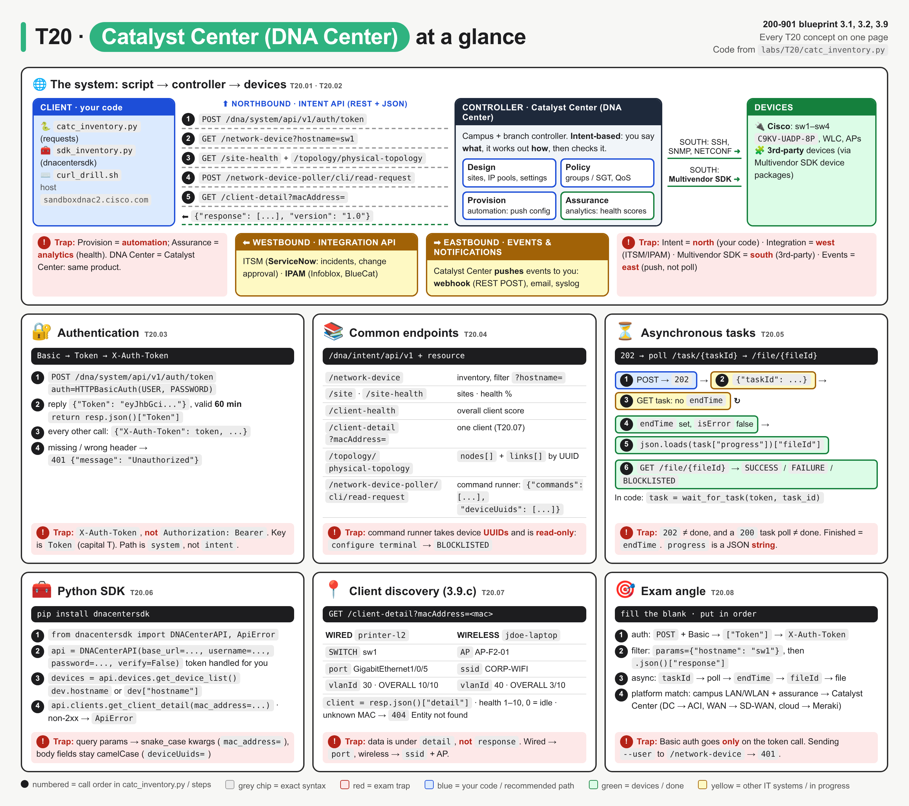
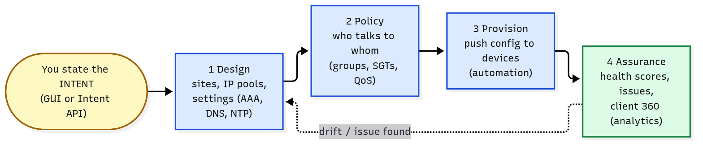
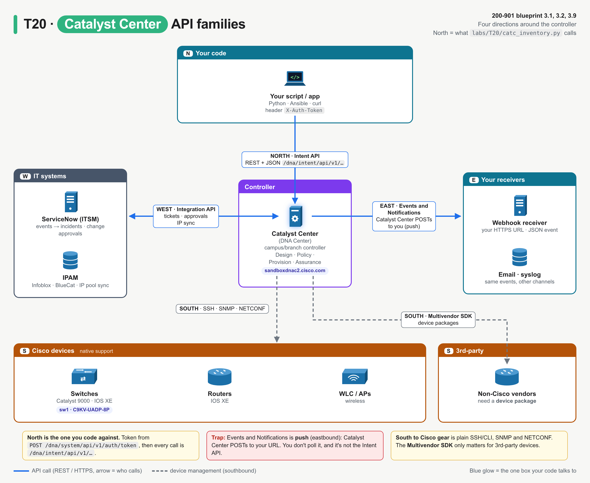
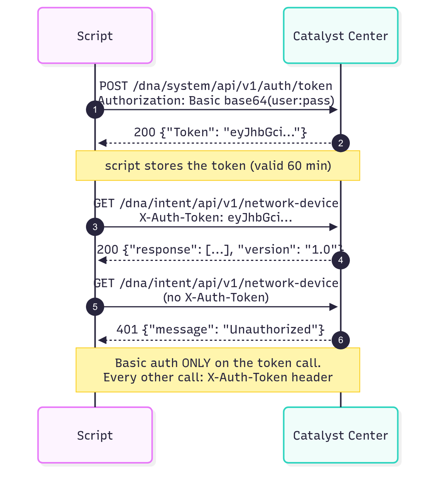
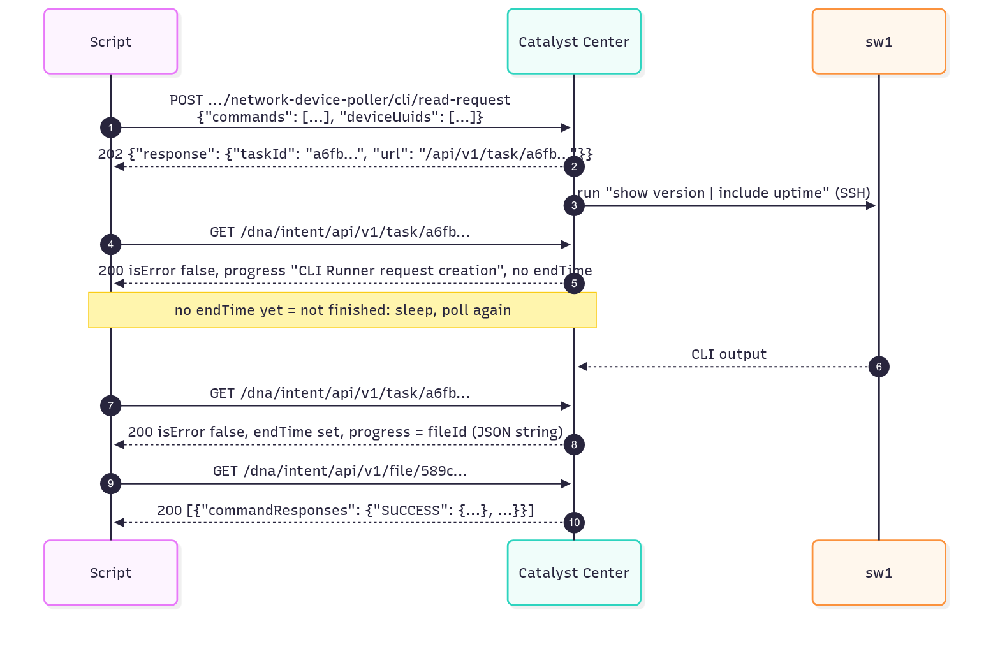
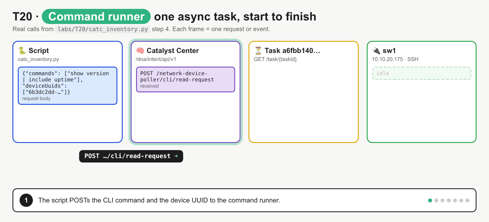
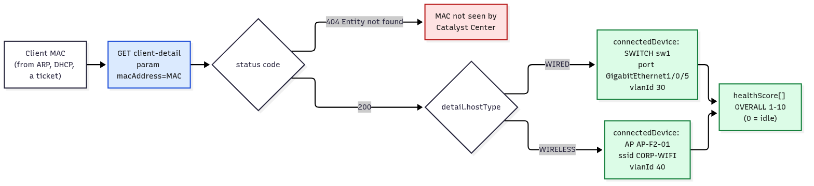

# T20 · Catalyst Center (DNA Center)

> Owner: **Bob** · Blueprint: **3.1, 3.2, 3.9** · CBT coverage: **Full** · Learn by 2026-10-14 · Teach-back 2026-10-16



*Read it as a system map, left to right: your script → Catalyst Center → devices. The coloured zones are the four API directions. Numbered circles are the calls in `labs/T20/catc_inventory.py`, in order. Red boxes are exam traps.*

## TL;DR (teach-back card)

- **Catalyst Center (DNA Center) is the campus/branch controller.** You state the intent and it turns that into device config. Four jobs: **Design → Policy → Provision → Assurance**. Four API directions: **north = Intent API** (your scripts), **west = Integration API** (ServiceNow, IPAM), **south = Multivendor SDK** (3rd-party devices), **east = Events and Notifications** (webhook, email, syslog, pushed to you).
- **Auth is two steps.** `POST /dna/system/api/v1/auth/token` with **Basic auth** returns `{"Token": "..."}`, valid **60 min**. Every other call sends it in the **`X-Auth-Token`** header (not `Authorization: Bearer`). Intent paths start `/dna/intent/api/v1/`: `network-device`, `site-health`, `client-detail?macAddress=`, `topology/physical-topology`.
- **Long jobs are async.** Command runner (`POST .../network-device-poller/cli/read-request`) returns **`202` + `taskId`**. Poll `GET /task/{taskId}` until `endTime` is set and check `isError`. `progress` then holds a **JSON string** with a `fileId`, and `GET /file/{fileId}` gives the CLI output. SDK: `DNACenterAPI(...)` → `api.devices.get_device_list()`.
- **Trap:** a `202` (or a `200` on the first task poll) **doesn't mean finished**. No `endTime` = still running. Also, `client-detail` puts its data under **`detail`**, not `response`.

## Concepts

Every section below explains one part of the same program. Read it once first.

- `labs/T20/catc_inventory.py` (shown below) is the **reference program**. It uses `requests` against the Catalyst Center Intent API in 5 steps: token → inventory → health and topology → command runner (async task) → client discovery.
- It runs against the **DevNet always-on sandbox** (`sandboxdnac2.cisco.com`) by default. It was run there for real this session; that output is in **Examples §2**.
- `labs/T20/mock_catc.py` is a local stand-in, written with the Python standard library only. Its device, topology and command-runner data were copied from the sandbox. It adds two clients, because the sandbox has none. `bash labs/T20/run_lab.sh` starts the mock, runs the program, then stops the mock. The output below is from that run.
- `labs/T20/sdk_inventory.py` does the same jobs with the `dnacentersdk` SDK (T20.06).

**Endpoints the program calls** (all paths are on `https://<catalyst-center>`):

| Step | Method | Path | Success | Key response field |
|---|---|---|---|---|
| 1 | `POST` | `/dna/system/api/v1/auth/token` (Basic auth) | `200` | `Token` |
| 2 | `GET` | `/dna/intent/api/v1/network-device` (`?hostname=`, `?platformId=`, …) | `200` | `response[]` |
| 3 | `GET` | `/dna/intent/api/v1/site-health` | `200` | `response[].networkHealthAverage` |
| 3 | `GET` | `/dna/intent/api/v1/topology/physical-topology` | `200` | `response.nodes[]`, `response.links[]` |
| 4 | `POST` | `/dna/intent/api/v1/network-device-poller/cli/read-request` | **`202`** | `response.taskId` |
| 4 | `GET` | `/dna/intent/api/v1/task/{taskId}` | `200` | `isError`, `endTime`, `progress` |
| 4 | `GET` | `/dna/intent/api/v1/file/{fileId}` | `200` | `[].commandResponses` |
| 5 | `GET` | `/dna/intent/api/v1/client-detail?macAddress=` | `200` / `404` | **`detail`** |

**`labs/T20/catc_inventory.py`**

```python
"""T20 reference program: Catalyst Center (DNA Center) Intent API with requests.

Live sandbox (default):  python3 labs/T20/catc_inventory.py
Local mock:              bash labs/T20/run_lab.sh

1 token -> 2 inventory -> 3 health + topology -> 4 command runner (async task) -> 5 client discovery
"""
import json
import os
import time

import requests
import urllib3
from requests.auth import HTTPBasicAuth

urllib3.disable_warnings()                      # sandbox has a self-signed cert (verify=False below)

BASE_URL = os.environ.get("DNAC_URL", "https://sandboxdnac2.cisco.com")
USER = os.environ.get("DNAC_USER", "devnetuser")          # public DevNet sandbox defaults
PASSWORD = os.environ.get("DNAC_PASS", "Cisco123!")
CLIENT_MACS = os.environ.get("CLIENT_MACS", "00:1e:13:a5:b9:40,a4:83:e7:2c:11:9f").split(",")
INTENT = "/dna/intent/api/v1"                   # every Intent API path starts here
COMMAND = "show version | include uptime"


def get_token():
    """Step 1: the ONLY call that sends username/password (HTTP Basic). Returns the token."""
    resp = requests.post(f"{BASE_URL}/dna/system/api/v1/auth/token",
                         auth=HTTPBasicAuth(USER, PASSWORD), verify=False, timeout=30)
    resp.raise_for_status()                     # 401 here = wrong username/password
    return resp.json()["Token"]                 # capital T


def intent(method, path, token, **kwargs):
    """Every other call: Intent API base path + token in the X-Auth-Token header."""
    headers = {"X-Auth-Token": token, "Content-Type": "application/json",
               "Accept": "application/json"}
    resp = requests.request(method, BASE_URL + INTENT + path, headers=headers,
                            verify=False, timeout=30, **kwargs)
    print(f"  {method} {resp.request.path_url} -> {resp.status_code}")
    return resp


def wait_for_task(token, task_id, interval=1, attempts=10):
    """Step 4b: poll GET /task/{taskId} until it has an endTime, or isError is true."""
    for _ in range(attempts):
        task = intent("GET", f"/task/{task_id}", token).json()["response"]
        if task.get("isError"):
            raise RuntimeError(f"task failed: {task.get('failureReason')}")
        if task.get("endTime"):                 # finished
            return task
        print(f"    still running: progress={task.get('progress')!r}")
        time.sleep(interval)
    raise TimeoutError(f"task {task_id} not finished after {attempts} polls")


def main():
    print("== 1. Authenticate ==")
    token = get_token()
    print(f"  POST /dna/system/api/v1/auth/token -> Token {token[:20]}... (valid 60 min)")

    print("\n== 2. Inventory ==")
    devices = intent("GET", "/network-device", token).json()["response"]
    for dev in devices:
        print(f"    {dev['hostname']:4} {dev['managementIpAddress']:13} {dev['platformId']:13} "
              f"IOS-XE {dev['softwareVersion']:12} {dev['role']:7} {dev['reachabilityStatus']}")
    one = intent("GET", "/network-device", token, params={"hostname": "sw1"}).json()["response"]
    print(f"    filter ?hostname=sw1 -> {len(one)} device, id {one[0]['id']}")

    print("\n== 3. Health and topology ==")
    for site in intent("GET", "/site-health", token).json()["response"]:
        print(f"    {site['siteName'].strip()}: network health {site['networkHealthAverage']}%, "
              f"{site['numberOfNetworkDevice']} devices")
    topo = intent("GET", "/topology/physical-topology", token).json()["response"]
    names = {node["id"]: node["label"] for node in topo["nodes"]}
    for link in topo["links"]:
        if "1/0/" in link["startPortName"]:     # skip the Gi0/0 management mesh
            print(f"    {names[link['source']]} {link['startPortName']} <-> "
                  f"{names[link['target']]} {link['endPortName']} ({link['linkStatus']})")

    print("\n== 4. Command runner (asynchronous) ==")
    resp = intent("POST", "/network-device-poller/cli/read-request", token,
                  json={"commands": [COMMAND], "deviceUuids": [one[0]["id"]]})
    task_id = resp.json()["response"]["taskId"]           # 202 Accepted: work not done yet
    print(f"    taskId {task_id}")
    task = wait_for_task(token, task_id)
    file_id = json.loads(task["progress"])["fileId"]       # progress is a JSON *string*
    output = intent("GET", f"/file/{file_id}", token).json()
    for result in output:                                  # one entry per device
        answers = result["commandResponses"]               # SUCCESS / FAILURE / BLOCKLISTED
        for cmd, text in answers["SUCCESS"].items():
            print(f"    SUCCESS {cmd!r}: {text.splitlines()[1]}")
        for cmd, reason in answers["BLOCKLISTED"].items():
            print(f"    BLOCKLISTED {cmd!r}: {reason}")

    print("\n== 5. Client discovery ==")
    for mac in CLIENT_MACS:
        resp = intent("GET", "/client-detail", token, params={"macAddress": mac})
        if resp.status_code != 200:
            print(f"    {mac}: {resp.json()['response']['message']}")
            continue
        client = resp.json()["detail"]
        health = {h["healthType"]: h["score"] for h in client["healthScore"]}
        where = client["port"] or f"SSID {client['ssid']}"
        print(f"    {client['hostName']} {client['hostIpV4']} {client['hostType']}: "
              f"{client['connectedDevice'][0]['type']} {client['clientConnection']} {where}, "
              f"VLAN {client['vlanId']}, health {health['OVERALL']}/10")


if __name__ == "__main__":
    main()
```

**Output** (`bash labs/T20/run_lab.sh`, against the mock):

```
== 1. Authenticate ==
  POST /dna/system/api/v1/auth/token -> Token eyJhbGciOiJFUzI1NiIs... (valid 60 min)

== 2. Inventory ==
  GET /dna/intent/api/v1/network-device -> 200
    sw1  10.10.20.175  C9KV-UADP-8P  IOS-XE 17.12.1prd9  ACCESS  Reachable
    sw2  10.10.20.176  C9KV-UADP-8P  IOS-XE 17.12.1prd9  ACCESS  Reachable
    sw3  10.10.20.177  C9KV-UADP-8P  IOS-XE 17.12.1prd9  ACCESS  Reachable
    sw4  10.10.20.178  C9KV-UADP-8P  IOS-XE 17.12.1prd9  ACCESS  Reachable
  GET /dna/intent/api/v1/network-device?hostname=sw1 -> 200
    filter ?hostname=sw1 -> 1 device, id 6b3dc2dd-a26f-4807-97eb-9d316b22fa83

== 3. Health and topology ==
  GET /dna/intent/api/v1/site-health -> 200
    All Sites: network health 100%, 4 devices
  GET /dna/intent/api/v1/topology/physical-topology -> 200
    sw2 GigabitEthernet1/0/1 <-> sw4 GigabitEthernet1/0/2 (up)
    sw3 GigabitEthernet1/0/1 <-> sw4 GigabitEthernet1/0/1 (up)
    sw1 GigabitEthernet1/0/3 <-> sw2 GigabitEthernet1/0/2 (up)
    sw1 GigabitEthernet1/0/1 <-> sw3 GigabitEthernet1/0/2 (up)

== 4. Command runner (asynchronous) ==
  POST /dna/intent/api/v1/network-device-poller/cli/read-request -> 202
    taskId a6fbb140-9bf9-5f83-91c4-b065c164fd63
  GET /dna/intent/api/v1/task/a6fbb140-9bf9-5f83-91c4-b065c164fd63 -> 200
    still running: progress='CLI Runner request creation'
  GET /dna/intent/api/v1/task/a6fbb140-9bf9-5f83-91c4-b065c164fd63 -> 200
  GET /dna/intent/api/v1/file/589cb9a1-7359-572f-8646-0ffe765cb41b -> 200
    SUCCESS 'show version | include uptime': sw1 uptime is 1 week, 4 days, 22 hours, 0 minutes

== 5. Client discovery ==
  GET /dna/intent/api/v1/client-detail?macAddress=00%3A1e%3A13%3Aa5%3Ab9%3A40 -> 200
    printer-l2 10.10.30.21 WIRED: SWITCH sw1 GigabitEthernet1/0/5, VLAN 30, health 10/10
  GET /dna/intent/api/v1/client-detail?macAddress=a4%3A83%3Ae7%3A2c%3A11%3A9f -> 200
    jdoe-laptop 10.10.40.57 WIRELESS: AP AP-F2-01 SSID CORP-WIFI, VLAN 40, health 3/10
```

### T20.01 · What Catalyst Center is

**Must cover:**

- [x] Formerly DNA Center: controller for campus/branch, intent-based networking
- [x] Functions: design, policy, provision (automation), assurance (analytics)

**Notes:**

- **Catalyst Center** = Cisco's controller for the **enterprise campus and branch**: Catalyst switches, wireless LAN controllers and APs, and ISR/Catalyst edge routers. It was called **DNA Center** (Digital Network Architecture Center) until Cisco renamed it in 2023. The API paths still start with `/dna/`, and the SDK is still `dnacentersdk`.
- It's a **controller**, not a device: it's an appliance (physical or virtual) that manages hundreds of devices. Scripts talk to the controller's REST API, and the controller talks to the devices. See [T12](T12-automation-foundations-controller-vs-device.md) for controller vs device APIs.
- **Intent-based networking (IBN):** you say **what** you want ("guests can reach only the internet"). The controller works out **how** (VLANs, ACLs, SGTs), pushes it to every device, and then **checks** that the network really does it.
- The four GUI sections are the IBN loop:



*Blue = automation (you state intent, the controller configures). Green = analytics (Assurance measures the result). The dotted arrow closes the loop: an issue found in Assurance feeds back into Design.*

| Function | Does | Example | Program step |
|---|---|---|---|
| **Design** | model the network: site hierarchy (area → building → floor), IP pools, global settings (AAA, DNS, NTP, syslog), golden images | create "Global/SJC/Floor-2" | (sites appear in client `location`) |
| **Policy** | who can talk to whom: group-based access (SGTs, with ISE), QoS, app policy | "Guests → internet only" | (not in the program) |
| **Provision** | **automation**: onboard devices (PnP), push config and templates, upgrade software (SWIM) | assign sw1 to a site, push templates | 4: command runner (read-only) |
| **Assurance** | **analytics**: health scores for network, devices and clients, issues, root cause | `site-health`, `client-detail` | 3 and 5 |

- **SD-Access** (fabric) = Catalyst Center + ISE building an overlay fabric on the campus. You only need the name for this exam.
- Exam mapping: "which platform manages a campus LAN/WLAN with intent and assurance?" → Catalyst Center. Data centre fabric → ACI ([T19](T19-aci.md)). WAN overlay → SD-WAN Manager ([T22](T22-catalyst-sd-wan.md)). Cloud-managed → Meraki ([T18](T18-meraki.md)).

### T20.02 · API families

**Must cover:**

- [x] Intent API: northbound REST for apps
- [x] Integration API: ITSM (e.g. ServiceNow), IPAM
- [x] Multivendor SDK: southbound to third-party devices
- [x] Events and notifications: webhooks, email, syslog

**Notes:**

- Cisco groups the platform's APIs by **direction**, as on a compass, with Catalyst Center in the middle:



*North = what your script calls. West and east = Catalyst Center talking to other IT systems. South = Catalyst Center talking to devices. Blue = REST API calls, arrowhead = who receives the call (east is push, from Catalyst Center to you). Grey dashed = southbound device management.*

| Family | Direction | Who calls whom | Used for |
|---|---|---|---|
| **Intent API** | **Northbound** | your app → Catalyst Center (REST, JSON, HTTPS) | everything in `catc_inventory.py`: inventory, health, command runner, client detail. Paths `/dna/intent/api/v1/...` |
| **Integration API** | **Westbound** | Catalyst Center ↔ IT systems | **ITSM** (ServiceNow: events → incidents, change approvals), **IPAM** (Infoblox, BlueCat: IP pool sync), reporting |
| **Multivendor SDK** | **Southbound** | Catalyst Center → **3rd-party** devices | device packages that teach Catalyst Center to manage non-Cisco devices |
| **Events and Notifications** | **Eastbound** | Catalyst Center → you (**push**) | subscribe to Assurance/SWIM/system events. Delivered by **REST webhook**, email or syslog |

- **Intent API is the one you code against.** It's called "intent" because you ask for an outcome ("run this command on that device", "give me client health"). You don't script device-by-device CLI.
- **Events and Notifications is push, not poll.** Catalyst Center POSTs a JSON event to your webhook URL when something happens. The concept is the same as the webhooks in T43.
- Southbound to Cisco devices, Catalyst Center itself uses SSH/CLI, SNMP and NETCONF. The **Multivendor SDK** only matters for 3rd-party devices.

### T20.03 · Authentication

**Must cover:**

- [x] POST /dna/system/api/v1/auth/token with HTTP basic auth → {"Token": "..."}
- [x] Send the token in the X-Auth-Token header on every call

**Notes:**

- Two steps: **one** Basic-auth call to get a token, then the token on **every** other call.



*Credentials are sent once (call 1). Calls 3 and 5 differ only in the `X-Auth-Token` header, and that header alone decides `200` or `401`.*

- In the program, `get_token()`:
  - `requests.post(f"{BASE_URL}/dna/system/api/v1/auth/token", auth=HTTPBasicAuth(USER, PASSWORD), verify=False, ...)`.
    - `HTTPBasicAuth` builds `Authorization: Basic base64(user:pass)`. curl's `--user user:pass` does the same.
  - Path is **`/dna/system/api/v1/auth/token`**: `system`, not `intent`. (Versions before 1.2.6 used `/api/system/v1/auth/token`.)
  - Reply: `{"Token": "eyJhbGci..."}`. The key is **`Token` with a capital T**. `resp.json()["token"]` → `KeyError` (Examples §4).
  - Wrong password → `401` with an **empty body** (seen on the live sandbox). `raise_for_status()` turns that into `requests.exceptions.HTTPError: 401 Client Error`.
- `intent()` puts the token in **`X-Auth-Token: <token>`** on every Intent API call. It's a custom header, not `Authorization: Bearer`.
  - Missing or wrong header → `401 {"message": "Unauthorized"}` (curl drill step 2).
- The token is valid for **60 minutes**. After that you get `401`, so request a new token. The SDK does this for you (T20.06).
- `verify=False` because the sandbox uses a self-signed certificate. `urllib3.disable_warnings()` hides the warning it causes. Platform auth styles side by side: T10.

### T20.04 · Common endpoints

**Must cover:**

- [x] /dna/intent/api/v1/network-device (inventory)
- [x] /site, /site-health, /client-health, /client-detail?macAddress=
- [x] /topology/physical-topology; /network-device-poller/cli/read-request (command runner)

**Notes:**

- Every Intent endpoint = `https://<host>` + **`/dna/intent/api/v1`** + resource. The program stores the prefix once as `INTENT`.
- Most replies use the same envelope: `{"response": <data>, "version": "1.0"}`. So the program reads `.json()["response"]`. Exceptions: `client-detail` (`detail`) and the token call (`Token`).

| Endpoint (after `/dna/intent/api/v1`) | Method | Returns | In the program |
|---|---|---|---|
| `/network-device` | GET | device list: `hostname`, `managementIpAddress`, `platformId`, `softwareVersion`, `role`, `reachabilityStatus`, `id` (UUID) | step 2 |
| `/network-device?hostname=sw1` | GET | filtered list (query params: `hostname`, `platformId`, `family`, `managementIpAddress`, `serialNumber`, …) | step 2, `params={"hostname": "sw1"}` |
| `/network-device/{id}` · `/network-device/count` | GET | one device · `{"response": 4}` | (curl it) |
| `/site` | GET | site hierarchy: `name`, `siteNameHierarchy` (e.g. `Global`), `id` | (curl it) |
| `/site-health` | GET | per site: `networkHealthAverage`, `healthyNetworkDevicePercentage`, client counts | step 3 |
| `/client-health` | GET | overall client health score, split wired/wireless | (curl it) |
| `/client-detail?macAddress=<mac>` | GET | one client: where it connects and its health (T20.07) | step 5 |
| `/topology/physical-topology` | GET | `nodes[]` (devices) + `links[]` (`source`, `startPortName`, `target`, `endPortName`, `linkStatus`) | step 3 |
| `/network-device-poller/cli/read-request` | POST | **command runner**: `202` + `taskId` (T20.05) | step 4 |
| `/task/{taskId}` · `/file/{fileId}` | GET | task status · task result file | step 4 |

- **Topology links refer to devices by UUID** (`source`/`target`), not by hostname. The program builds `names = {node["id"]: node["label"] ...}` to turn them back into names.
- **Command runner body:** `{"commands": [...], "deviceUuids": [...]}`. It takes device **UUIDs** (the `id` from `/network-device`), not IPs or hostnames. That's why step 2 runs first.
- Command runner is **read-only**: `show` commands work. `configure terminal` comes back under `BLOCKLISTED` with "The command is on the blocked list and is not supported" (seen on the live sandbox, and in Examples §4).
- MAC addresses in a query string are URL-encoded: `:` → `%3A`, as in the step-5 `GET` lines of the output (`macAddress=00%3A1e%3A...`). `requests` does this for you when you pass `params=`.

### T20.05 · Asynchronous tasks

**Must cover:**

- [x] Many POST/PUT calls return 202 with a taskId
- [x] Poll GET /dna/intent/api/v1/task/{taskId} until finished; check isError and progress

**Notes:**

- Jobs that touch devices (command runner, provisioning, discovery, template deploy, image upgrade) can take seconds to minutes. So Catalyst Center **doesn't make you wait**. It answers at once with **`202 Accepted`** and a task ID, then does the work in the background.



*Calls 1–2 return straight away, and the device work (3, 6) happens in the background. Poll 4–5 gets a `200` with no `endTime` (not done). Poll 7–8 has `endTime` set. Only then does the `fileId` exist for call 9.*



*Step by step: POST → `202` + `taskId` → Catalyst Center runs the CLI on sw1 → poll 1 (`200`, no `endTime`) → output returned, task finished → poll 2 (`endTime` + `fileId`) → GET the file. This fixes the misconception that `202` (or a `200` on the task) means the job is done, or that the POST reply contains the output.*

- `202` body: `{"response": {"taskId": "a6fbb140-...", "url": "/api/v1/task/a6fbb140-..."}, "version": "1.0"}`.
- `wait_for_task()` polls `GET /dna/intent/api/v1/task/{taskId}` and checks three fields:

| Field | Meaning | Program does |
|---|---|---|
| `isError` | `true` = the task failed | raise `RuntimeError` with `failureReason` |
| `endTime` | present only when the task has **finished** (epoch ms) | return the task |
| `progress` | free text while running; for command runner, a **JSON string** `{"fileId": "..."}` at the end | print it, then `json.loads(task["progress"])["fileId"]` |

- It sleeps `interval` seconds between polls and gives up after `attempts` (a `TimeoutError`). Never poll in a tight loop.
- **`progress` is a string, not an object.** `task["progress"]["fileId"]` → `TypeError: string indices must be integers`. You must `json.loads()` it first.
- On the live sandbox the task had finished by the first poll (one `GET /task` line in Examples §2). The mock makes the first poll "still running", so the loop runs in the output above.
- Newer releases also have `GET /dna/intent/api/v1/tasks/{id}`, which returns `"status": "SUCCESS"` (it answered on the sandbox). The API reference tags `/task/{taskId}` "Sunset". The exam blueprint and most code still use `/task/{taskId}` + `isError`/`endTime`/`progress`. ⚠ verify

### T20.06 · Python SDK

**Must cover:**

- [x] pip install dnacentersdk
- [x] api = DNACenterAPI(base_url=..., username=..., password=..., verify=False)
- [x] api.devices.get_device_list()

**Notes:**

- `pip install dnacentersdk` (version 2.11.0 here). It's the official Cisco DevNet SDK and keeps the old DNA Center name. It wraps every Intent API call as a Python method.
- What the SDK does for you, compared with `catc_inventory.py`:

| `requests` (reference program) | `dnacentersdk` (`sdk_inventory.py`) |
|---|---|
| `get_token()`: POST with `HTTPBasicAuth`, read `["Token"]` | done inside `DNACenterAPI(...)` (lazily, on the first call); **re-fetched once automatically on a `401`** |
| `headers={"X-Auth-Token": token}` on each call | added for you |
| `intent("GET", "/network-device", token, params={"hostname": "sw1"})` | `api.devices.get_device_list(hostname="sw1")` |
| `.json()["response"][0]["hostname"]` | `.response[0].hostname` (dot access) **or** `["response"][0]["hostname"]` |
| check `resp.status_code` | non-2xx raises `dnacentersdk.ApiError` (`err.status_code`) |

**`labs/T20/sdk_inventory.py`**

```python
"""T20 SDK version: the same inventory + command runner + client lookup with dnacentersdk.

pip install dnacentersdk
Live sandbox (default):  python3 labs/T20/sdk_inventory.py
Local mock:              bash labs/T20/run_lab.sh labs/T20/sdk_inventory.py

The SDK does the token call and the X-Auth-Token header for you.
"""
import json
import os
import time

import urllib3
from dnacentersdk import DNACenterAPI, ApiError

urllib3.disable_warnings()

api = DNACenterAPI(base_url=os.environ.get("DNAC_URL", "https://sandboxdnac2.cisco.com"),
                   username=os.environ.get("DNAC_USER", "devnetuser"),
                   password=os.environ.get("DNAC_PASS", "Cisco123!"),
                   verify=False)                      # SDK gets the token; re-gets it once on a 401

devices = api.devices.get_device_list()              # GET /dna/intent/api/v1/network-device
for dev in devices.response:                         # dot access works (MyDict) as well as ["key"]
    print(dev.hostname, dev.managementIpAddress, dev.id)

sw1 = api.devices.get_device_list(hostname="sw1").response[0]    # snake_case kwarg -> ?hostname=
run = api.command_runner.run_read_only_commands_on_devices(
    commands=["show version | include uptime"], deviceUuids=[sw1.id])   # 202 + taskId
for _ in range(10):
    task = api.task.get_task_by_id(task_id=run.response.taskId).response
    if task.get("endTime") or task.get("isError"):
        break
    time.sleep(1)
print("task done, isError =", task.isError, "progress =", task.progress)
file_id = json.loads(task.progress)["fileId"]
print("file", file_id)

try:
    client = api.clients.get_client_detail(mac_address="00:1e:13:a5:b9:40").detail
    print(client.hostName, "on", client.clientConnection, client.port, "VLAN", client.vlanId)
except ApiError as err:                              # non-2xx -> ApiError
    print("client-detail:", err.status_code, err.response.json()["response"]["message"])
```

**Output** (`bash labs/T20/run_lab.sh labs/T20/sdk_inventory.py`, mock):

```
sw1 10.10.20.175 6b3dc2dd-a26f-4807-97eb-9d316b22fa83
sw2 10.10.20.176 f0eb8382-1dae-4212-bbf4-c08f17b3417e
sw3 10.10.20.177 fe048e81-1f22-49f7-9eac-ac06119c635d
sw4 10.10.20.178 ffde3775-f30c-411e-9a96-f435d2b834e5
task done, isError = False progress = {"fileId": "589cb9a1-7359-572f-8646-0ffe765cb41b"}
file 589cb9a1-7359-572f-8646-0ffe765cb41b
printer-l2 on sw1 GigabitEthernet1/0/5 VLAN 30
```

- Method names = **API domain + operation**: `api.devices.*`, `api.clients.*`, `api.command_runner.*`, `api.task.*`, `api.sites.*`, `api.topology.*`.
- **Query parameters become snake_case** keyword arguments (`hostname=`, `platform_id=`, `mac_address=`, `task_id=`). **Body fields keep their JSON camelCase** names (`commands=`, `deviceUuids=`). Exam snippets test exactly this.
- `DNACenterAPI()` with no arguments reads `DNA_CENTER_BASE_URL`, `DNA_CENTER_USERNAME`, `DNA_CENTER_PASSWORD`, `DNA_CENTER_VERIFY` and `DNA_CENTER_VERSION` from the environment. There's also a `version=` argument that picks the API version (SDK 2.11.0 defaults to `3.1.6.0`).
- Same result as the `requests` program, in fewer lines. You still poll the task yourself.

### T20.07 · Client discovery (3.9.c)

**Must cover:**

- [x] client-detail by MAC shows where a client connects (device, port, SSID) and its health

**Notes:**

- The "where is this laptop/printer plugged in?" question. You know a **MAC address** (from ARP, DHCP or a ticket). Catalyst Center Assurance knows which switch port or AP it's on.



*`404` = Catalyst Center has never seen that MAC. On `200`, `hostType` decides where to look: wired → switch + `port`, wireless → AP + `ssid`. Both have `vlanId` and a `healthScore` list.*

- Call: `GET /dna/intent/api/v1/client-detail?macAddress=00:1e:13:a5:b9:40` (the `macAddress` query parameter is **required**). There's also an optional `timestamp` (epoch ms) for "where was it at time T?".
- The reply has three top-level keys: **`detail`**, `connectionInfo` and `topology`. There's **no `response` wrapper**, so step 5 reads `resp.json()["detail"]`.

| `detail` field | Wired client (`printer-l2`) | Wireless client (`jdoe-laptop`) |
|---|---|---|
| `hostType` | `WIRED` | `WIRELESS` |
| `hostName`, `hostIpV4`, `hostMac` | `printer-l2`, `10.10.30.21` | `jdoe-laptop`, `10.10.40.57` |
| `connectedDevice[0].type` / `.name` | `SWITCH` / `sw1` | `AP` / `AP-F2-01` |
| `clientConnection` | `sw1` | `AP-F2-01` |
| `port` | `GigabitEthernet1/0/5` | `None` |
| `ssid` | `None` | `CORP-WIFI` |
| `vlanId` | `30` | `40` |
| `location` | `Global/SJC/Floor-2` | `Global/SJC/Floor-2` |
| `healthScore[]` (`healthType` → `score`) | `OVERALL` → 10 | `OVERALL` → 3 (`reason: Poor RSSI`) |

- The program turns the health list into a dict: `health = {h["healthType"]: h["score"] for h in client["healthScore"]}`, then reads `health["OVERALL"]`. Scores run **1–10**, and **0 = idle** client.
- `where = client["port"] or f"SSID {client['ssid']}"`: a wired client has a port, a wireless one has an SSID.
- Unknown MAC → `404 {"response": {"errorCode": 1005, "message": "Entity not found", ...}}`. This came back for real from the sandbox, which has no clients (Examples §2). The program prints the message and moves on.
- The mock's two clients are made up, using the field names from the API reference. Meraki answers the same question differently (`/networks/{id}/clients`, T18).

### T20.08 · Exam angle

**Must cover:**

- [x] Auth flow and header; async task polling; complete code calling the intent API

**Notes:**

- **Auth flow:** questions show a script and ask what's missing. Look for these:
  - token URL (`/dna/system/api/v1/auth/token`)
  - method (`POST`)
  - Basic auth (`auth=HTTPBasicAuth(user, pwd)` or `--user`)
  - JSON key (`["Token"]`)
  - header name (`X-Auth-Token`)
- **Async polling:** `202` → read `["response"]["taskId"]` → loop `GET /task/{taskId}` → stop on `endTime` (or `isError`) → `json.loads(progress)` → `fileId` → `GET /file/{fileId}`. Put-in-order questions use exactly this chain.
- **Complete the code:** the reference program covers the usual blanks:
  - `requests.post` vs `.get`
  - `auth=` vs `headers=`
  - `params={"hostname": "sw1"}` vs putting it in the path
  - `.json()["response"]`
  - `verify=False`
  - SDK `api.devices.get_device_list()`
- **Names:** answers may say "DNA Center" or "Catalyst Center"; they're the same product. "Intent API" = northbound REST.

## Exam traps

- **`X-Auth-Token`, not `Authorization: Bearer`.** Catalyst Center uses a custom header. Meraki uses `Authorization: Bearer <api-key>` (older: `X-Cisco-Meraki-API-Key`), and ACI uses an `APIC-cookie`.
- **Basic auth is only for the token call.** Sending `--user` on `/network-device` instead of the token → `401`.
- **Token URL is `/dna/system/api/v1/auth/token`** (`system`, POST). Not `/dna/intent/...`, and not a GET.
- **JSON key is `Token` (capital T)**, and the token is valid for **60 minutes**.
- **`202` ≠ done.** It's queued: poll `/task/{taskId}`. A `200` from the task endpoint also ≠ done. Finished = `endTime` present; failed = `isError: true`.
- **`progress` is a JSON string.** `json.loads()` it to get `fileId`. The command output is in `/file/{fileId}`, not in the task.
- **Command runner takes `deviceUuids`**, not IPs or hostnames. It's **read-only**: config commands come back `BLOCKLISTED`.
- **`client-detail` → `detail`**, not `response`. Wired → `port`; wireless → `ssid` + AP. Unknown MAC → `404`.
- **API families by direction:** Intent = north (your code), Integration = west (ITSM/IPAM), Multivendor SDK = south (3rd-party devices), Events and Notifications = east (**push** via webhook/email/syslog).
- **SDK:** `pip install dnacentersdk`, `from dnacentersdk import DNACenterAPI`. Query params are snake_case kwargs (`mac_address=`), but body fields stay camelCase (`deviceUuids=`).
- **Design / Policy / Provision / Assurance:** Provision = automation (push config), Assurance = analytics (health). "Health score for a client" → Assurance.

## Examples

### 1. Run the reference program

Needs Python 3 with `requests` (and `dnacentersdk` for the SDK file). Use a venv:

```bash
python3 -m venv /tmp/venv-t20
/tmp/venv-t20/bin/pip install requests dnacentersdk
export PATH=/tmp/venv-t20/bin:$PATH

bash labs/T20/run_lab.sh                              # mock + catc_inventory.py
bash labs/T20/run_lab.sh labs/T20/sdk_inventory.py    # mock + SDK version
bash labs/T20/run_lab.sh labs/T20/curl_drill.sh       # mock + curl drill
python3 labs/T20/catc_inventory.py                    # live DevNet sandbox (defaults)
```

In the lab container (it already has `requests` and `dnacentersdk`; the mock and the client share the container's localhost):

```bash
docker build --tag ccna-auto-lab:latest --file labs/Dockerfile labs/
docker run --rm --volume "$(pwd)":/work --workdir /work ccna-auto-lab:latest bash labs/T20/run_lab.sh
```

### 2. Same program against the live DevNet sandbox

`python3 labs/T20/catc_inventory.py`, using the env-var defaults (`DNAC_URL=https://sandboxdnac2.cisco.com`, `devnetuser`). This is real output from 10 Oct 2026:

```
== 1. Authenticate ==
  POST /dna/system/api/v1/auth/token -> Token eyJhbGciOiJFUzI1NiIs... (valid 60 min)

== 2. Inventory ==
  GET /dna/intent/api/v1/network-device -> 200
    sw1  10.10.20.175  C9KV-UADP-8P  IOS-XE 17.12.1prd9  ACCESS  Reachable
    sw2  10.10.20.176  C9KV-UADP-8P  IOS-XE 17.12.1prd9  ACCESS  Reachable
    sw3  10.10.20.177  C9KV-UADP-8P  IOS-XE 17.12.1prd9  ACCESS  Reachable
    sw4  10.10.20.178  C9KV-UADP-8P  IOS-XE 17.12.1prd9  ACCESS  Reachable
  GET /dna/intent/api/v1/network-device?hostname=sw1 -> 200
    filter ?hostname=sw1 -> 1 device, id 6b3dc2dd-a26f-4807-97eb-9d316b22fa83

== 3. Health and topology ==
  GET /dna/intent/api/v1/site-health -> 200
    All Sites: network health 100%, 4 devices
  GET /dna/intent/api/v1/topology/physical-topology -> 200
    sw2 GigabitEthernet1/0/1 <-> sw4 GigabitEthernet1/0/2 (up)
    sw3 GigabitEthernet1/0/1 <-> sw4 GigabitEthernet1/0/1 (up)
    sw1 GigabitEthernet1/0/3 <-> sw2 GigabitEthernet1/0/2 (up)
    sw1 GigabitEthernet1/0/1 <-> sw3 GigabitEthernet1/0/2 (up)

== 4. Command runner (asynchronous) ==
  POST /dna/intent/api/v1/network-device-poller/cli/read-request -> 202
    taskId 01a125b2-ff1a-70ba-b5f8-b11e40ef8017
  GET /dna/intent/api/v1/task/01a125b2-ff1a-70ba-b5f8-b11e40ef8017 -> 200
  GET /dna/intent/api/v1/file/58e184a1-d91a-4e0f-a8e3-1e1770a8e4da -> 200
    SUCCESS 'show version | include uptime': sw1 uptime is 1 week, 4 days, 22 hours, 7 minutes

== 5. Client discovery ==
  GET /dna/intent/api/v1/client-detail?macAddress=00%3A1e%3A13%3Aa5%3Ab9%3A40 -> 404
    00:1e:13:a5:b9:40: Entity not found
  GET /dna/intent/api/v1/client-detail?macAddress=a4%3A83%3Ae7%3A2c%3A11%3A9f -> 404
    a4:83:e7:2c:11:9f: Entity not found
```

- Same code, same shape. Two differences from the mock run:
  - The task had finished by the first poll, so there's only one `GET /task` line.
  - The sandbox has no clients, so `client-detail` returns `404 Entity not found`.
- The SDK file also ran live: the same 4 switches, `task done, isError = False progress = {"fileId":"bc17e316-..."}`, then `client-detail: 404 Entity not found`.

### 3. curl drill (`labs/T20/curl_drill.sh`)

```bash
#!/usr/bin/env bash
# T20 curl drill: token -> X-Auth-Token -> async task, against DNAC_URL (mock or live sandbox).
# Mock:  bash labs/T20/run_lab.sh labs/T20/curl_drill.sh
# Live:  DNAC_URL=https://sandboxdnac2.cisco.com bash labs/T20/curl_drill.sh
set -u
BASE="${DNAC_URL:-https://sandboxdnac2.cisco.com}"
USER_PASS="${DNAC_USER:-devnetuser}:${DNAC_PASS:-Cisco123!}"
json() { python3 -c "import json, sys; d = json.load(sys.stdin); print($1)"; }

echo "== 1. POST auth/token with Basic auth -> {\"Token\": ...}"
TOKEN=$(curl --silent --insecure --request POST --user "$USER_PASS" \
  "$BASE/dna/system/api/v1/auth/token" | json 'd["Token"]')
echo "Token: ${TOKEN:0:20}..."

echo; echo "== 2. No X-Auth-Token header -> 401"
curl --silent --insecure --output /dev/null --write-out "HTTP %{http_code}\n" \
  "$BASE/dna/intent/api/v1/network-device"

echo; echo "== 3. With X-Auth-Token + query filter"
curl --silent --insecure --header "X-Auth-Token: $TOKEN" \
  "$BASE/dna/intent/api/v1/network-device?hostname=sw1" \
  | json '[(x["hostname"], x["managementIpAddress"], x["id"]) for x in d["response"]]'

echo; echo "== 4. Command runner POST -> 202 + taskId"
TASK=$(curl --silent --insecure --request POST \
  --header "X-Auth-Token: $TOKEN" --header "Content-Type: application/json" \
  --data '{"commands": ["show version | include uptime"], "deviceUuids": ["6b3dc2dd-a26f-4807-97eb-9d316b22fa83"]}' \
  --write-out '\n%{http_code}' \
  "$BASE/dna/intent/api/v1/network-device-poller/cli/read-request")
echo "HTTP $(echo "$TASK" | tail -1)  $(echo "$TASK" | head -1)"
TASK_ID=$(echo "$TASK" | head -1 | json 'd["response"]["taskId"]')

echo; echo "== 5. Poll GET task/{taskId} (twice)"
for _ in 1 2; do
  curl --silent --insecure --header "X-Auth-Token: $TOKEN" \
    "$BASE/dna/intent/api/v1/task/$TASK_ID" \
    | json '{k: d["response"].get(k) for k in ("isError", "progress", "endTime")}'
  sleep 1
done
```

Output (`bash labs/T20/run_lab.sh labs/T20/curl_drill.sh`, mock):

```
== 1. POST auth/token with Basic auth -> {"Token": ...}
Token: eyJhbGciOiJFUzI1NiIs...

== 2. No X-Auth-Token header -> 401
HTTP 401

== 3. With X-Auth-Token + query filter
[('sw1', '10.10.20.175', '6b3dc2dd-a26f-4807-97eb-9d316b22fa83')]

== 4. Command runner POST -> 202 + taskId
HTTP 202  {"response": {"taskId": "a6fbb140-9bf9-5f83-91c4-b065c164fd63", "url": "/api/v1/task/a6fbb140-9bf9-5f83-91c4-b065c164fd63"}, "version": "1.0"}

== 5. Poll GET task/{taskId} (twice)
{'isError': False, 'progress': 'CLI Runner request creation', 'endTime': None}
{'isError': False, 'progress': '{"fileId": "589cb9a1-7359-572f-8646-0ffe765cb41b"}', 'endTime': 1791633401604}
```

- Live sandbox (`DNAC_URL=https://sandboxdnac2.cisco.com bash labs/T20/curl_drill.sh`): steps 1–4 gave the same results, with a different `taskId`. In step 5 both polls already showed `endTime` set and a `fileId`.

### 4. Break it on purpose

Copy `labs/T20/catc_inventory.py`, make one edit, and run it against the mock: `python3 labs/T20/mock_catc.py &`, then `DNAC_URL=http://127.0.0.1:18020 python3 copy.py`. All five were run; the result shown is the real last line.

| Edit | Result | Lesson |
|---|---|---|
| In `intent()`, change `{"X-Auth-Token": token,` to `{"Authorization": token,` | `GET /dna/intent/api/v1/network-device -> 401`, then `KeyError: 'response'` | wrong header name = not authenticated; the 401 body is `{"message": "Unauthorized"}` with no `response` key |
| In `get_token()`, change `["Token"]` to `["token"]` | `KeyError: 'token'` | JSON keys are case-sensitive |
| Run with `DNAC_PASS=wrong` | `requests.exceptions.HTTPError: 401 Client Error: Unauthorized for url: http://127.0.0.1:18020/dna/system/api/v1/auth/token` | bad credentials fail at the token call |
| Change `COMMAND = "show version \| include uptime"` to `COMMAND = "configure terminal"` | `BLOCKLISTED 'configure terminal': The command is on the blocked list and is not supported` | command runner is read-only |
| Replace `task = wait_for_task(token, task_id)` with `task = resp.json()["response"]` | `KeyError: 'progress'` | the `202` body has only `taskId` and `url`; the result needs polling |

## Practice questions

**Q1.** An engineer's script must authenticate to Catalyst Center. Which request returns a token?
A. `GET /dna/intent/api/v1/auth/token` with `X-Auth-Token`  B. `POST /dna/system/api/v1/auth/token` with HTTP Basic authentication  C. `POST /dna/intent/api/v1/network-device` with a JSON body of username and password  D. `GET /dna/system/api/v1/auth/token` with `Authorization: Bearer`

<details><summary>Answer</summary>

**B.** The token comes from a POST to the `system` token path, using Basic auth. The reply is `{"Token": "..."}`. (T20.03)
</details>

**Q2.** Complete the code so that the inventory call succeeds:

```python
token = requests.post(url + "/dna/system/api/v1/auth/token",
                      auth=HTTPBasicAuth(user, pwd), verify=False).json()["Token"]
devices = requests.get(url + "/dna/intent/api/v1/network-device",
                       headers={"__________": token}, verify=False).json()["response"]
```

<details><summary>Answer</summary>

**`X-Auth-Token`.** Catalyst Center expects the token in this custom header on every Intent API call. Without it the call gets `401`. (T20.03)
</details>

**Q3.** A script POSTs to `/dna/intent/api/v1/network-device-poller/cli/read-request` and receives `202` with `{"response": {"taskId": "a6fb...", "url": "/api/v1/task/a6fb..."}}`. Put the next steps in order:
`GET /dna/intent/api/v1/file/{fileId}` · `json.loads(progress)["fileId"]` · `GET /dna/intent/api/v1/task/{taskId}` until `endTime` is present · check `isError` is false

<details><summary>Answer</summary>

`GET /task/{taskId}` until `endTime` is present → check `isError` is false → `json.loads(progress)["fileId"]` → `GET /file/{fileId}`. `202` only means queued. The output is in the file, and `progress` is a JSON string. (T20.05)
</details>

**Q4.** Which Catalyst Center API family sends a JSON event to an external URL when a device becomes unreachable?
A. Intent API  B. Integration API  C. Multivendor SDK  D. Events and Notifications

<details><summary>Answer</summary>

**D.** Events and Notifications (eastbound) **pushes** events by webhook, email or syslog. Intent API is what your code calls (northbound). Integration API connects ITSM/IPAM systems (westbound). Multivendor SDK is southbound to 3rd-party devices. (T20.02)
</details>

**Q5.** A help-desk ticket gives a laptop's MAC address. Which call shows the AP, SSID and health score of that laptop?
A. `GET /dna/intent/api/v1/client-health`  B. `GET /dna/intent/api/v1/network-device?macAddress=<mac>`  C. `GET /dna/intent/api/v1/client-detail?macAddress=<mac>`  D. `GET /dna/intent/api/v1/site-health`

<details><summary>Answer</summary>

**C.** `client-detail` takes the client MAC and returns `detail` with `connectedDevice`, `ssid`/`port`, `vlanId` and `healthScore`. `client-health` is an overall summary. `network-device?macAddress=` looks up a **network device's** MAC, not a client's. (T20.07)
</details>

**Q6.** Refer to the code:

```python
from dnacentersdk import DNACenterAPI
api = DNACenterAPI(base_url="https://10.10.20.85", username="admin", password=pwd, verify=False)
result = api.devices.get_device_list(platform_id="C9300-48U")
```

Which REST request does the last line send?
A. `POST /dna/intent/api/v1/network-device` with body `{"platformId": "C9300-48U"}`  B. `GET /dna/intent/api/v1/network-device?platformId=C9300-48U` with `X-Auth-Token`  C. `GET /dna/intent/api/v1/network-device/C9300-48U`  D. `GET /dna/system/api/v1/network-device?platform_id=C9300-48U`

<details><summary>Answer</summary>

**B.** The SDK maps the snake_case kwarg to the `platformId` query parameter, gets the token itself, and adds `X-Auth-Token`. (T20.06)
</details>

**Q7.** In the reference program, the line `task = wait_for_task(token, task_id)` is replaced by `task = resp.json()["response"]`. What happens?
A. It works, but more slowly  B. `KeyError: 'progress'`, because the `202` body holds only `taskId` and `url`  C. `401 Unauthorized`  D. The command runs twice

<details><summary>Answer</summary>

**B.** The POST reply never contains the result. You must poll the task, and only the finished task has `progress` with the `fileId`. (T20.05, Examples §4)
</details>

**Q8.** Which Catalyst Center function provides client and device health scores and issue root cause?
A. Design  B. Policy  C. Provision  D. Assurance

<details><summary>Answer</summary>

**D.** Assurance is the analytics side. Provision is the automation side (push config, PnP, SWIM). Design models sites and settings, and Policy defines access/QoS intent. (T20.01)
</details>

## Study aids

| Aid | Type | Title | Est. min | Resource |
|---|---|---|---|---|
| T20.1 | Video | Automate the Campus with DNA Center Platform | 36 | CBT module |
| T20.2 | Video | Easier DNA Center Automation with the SDK | 19 | CBT module |

- Skip / low priority: SDK walkthrough

## Sources

- Overview image: HTML source `assets/T20/00-overview.html`, rendered to PNG (see `assets/README.md`). Diagrams: Mermaid sources in `assets/T20/*.mmd`. Architecture diagram: HTML source `assets/T20/02-api-families.html` (shared kit `assets/_arch/`). Animation: `assets/T20/06-command-runner-anim.html` → `06-command-runner.gif`.
- Catalyst Center API 3.1.6, Introduction (rename from DNA Center; Intent API northbound, Integration westbound, Events and Notifications eastbound): https://developer.cisco.com/docs/catalyst-center/
- Catalyst Center API, Authentication (Basic auth → token, `X-Auth-Token`, 60-minute lifetime): https://developer.cisco.com/docs/catalyst-center/authentication
- Authentication and Authorization guide 2.3.7.x (`/dna/system/api/v1/auth/token` from 1.2.6, older `/api/system/v1/auth/token`, `HTTPBasicAuth` + `["Token"]`): https://developer.cisco.com/docs/dna-center/2-3-7-4/authentication-and-authorization
- Devices guide (`/network-device`, query-param filters such as `platformId`): https://developer.cisco.com/docs/catalyst-center/devices
- Get Client Detail (`macAddress` required, `timestamp` optional; `detail` / `connectionInfo` / `topology`; field names; health score 1–10, 0 = idle): https://developer.cisco.com/docs/catalyst-center/get-client-detail
- Get Task by ID (`isError`, `progress`, `endTime`, `failureReason`; "Sunset" banner): https://developer.cisco.com/docs/catalyst-center/get-task-by-id
- Catalyst Center ITSM integration guide (ServiceNow, IPAM integrations): https://www.cisco.com/c/en/us/td/docs/cloud-systems-management/network-automation-and-management/Catalyst-Center-Platform-Documentation/2-3-7/itsm-ig/b-cisco-catalyst-center-itsm-ig-2-3-7/m_about_itsm_support_1_4_0_0.pdf
- dnacentersdk 2.11.0 source (`DNACenterAPI` arguments, `DNA_CENTER_*` env vars, lazy token + one retry on 401, `ApiError`): https://pypi.org/project/dnacentersdk/ · https://github.com/cisco-en-programmability/dnacentersdk
- DevNet always-on sandbox `sandboxdnac2.cisco.com`: every live call in this note (token, network-device, site-health, physical-topology, command runner, task, tasks, file, client-detail 404, bad-credential 401).
- Cisco 200-901 v1.1 exam topics (3.1, 3.2, 3.9): https://learningcontent.cisco.com/documents/marketing/exam-topics/200-901-CCNAAUTO_v.1.1.pdf

## To verify

- ⚠ **Sandbox host and credentials:** `sandboxdnac2.cisco.com` with `devnetuser` / `Cisco123!` worked on 10 Oct 2026. `sandboxdnac.cisco.com` (the SDK default) returned `401` with the same credentials. Both can change, so check developer.cisco.com/sandbox.
- ⚠ **`/task/{taskId}` vs `/tasks/{id}`:** the API reference marks `/task/{taskId}` "Sunset". The newer `/dna/intent/api/v1/tasks/{id}` (with `status: SUCCESS`) answered on the sandbox. The exam is assumed to still test `isError`/`progress`/`endTime`.
- ⚠ **Mock "still running" text:** the progress string `CLI Runner request creation` that the mock returns on the first poll wasn't observed live, because sandbox tasks finished before the first poll. Real in-progress text may differ.
- ⚠ **Client discovery wasn't run live:** the sandbox has no clients (`404 Entity not found`). The two clients in `mock_catc.py` are made up, with field names from the Get Client Detail reference. Values such as `hostType: WIRED` casing are taken from that reference.
- ⚠ **Events and Notifications channels:** the docs confirm webhook (REST), email and syslog. Other channels (e.g. SNMP trap) weren't checked.
- ⚠ **Rename year (2023)** is from memory of Cisco's announcement. The docs only say "Cisco DNA Center is now Catalyst Center".
- Docker command in Examples §1: not run (Docker isn't installed on this machine). Everything else was run locally (Python 3.10, requests, dnacentersdk 2.11.0, curl), both against the mock and against the live sandbox, and the output shown is real.
