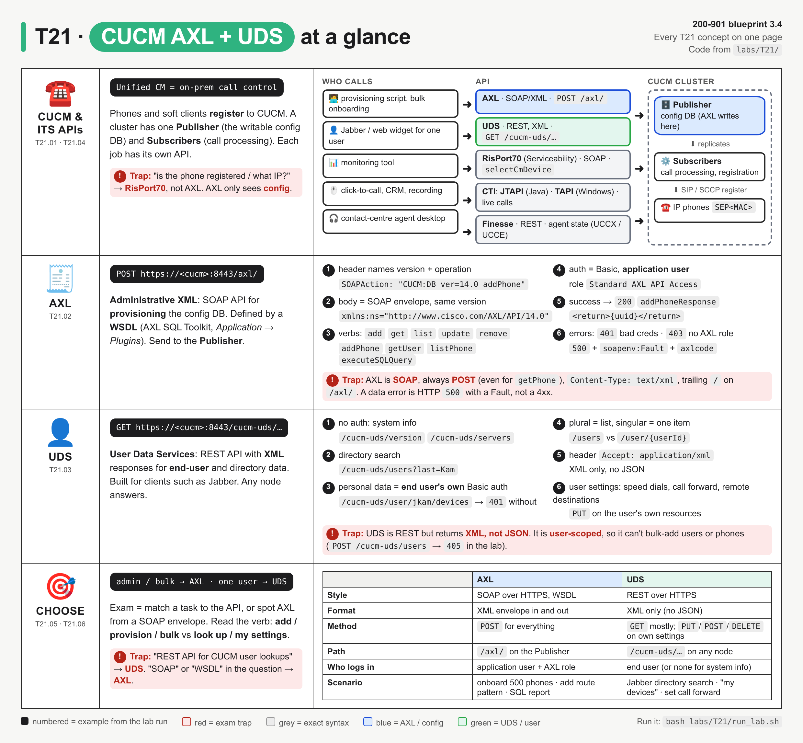
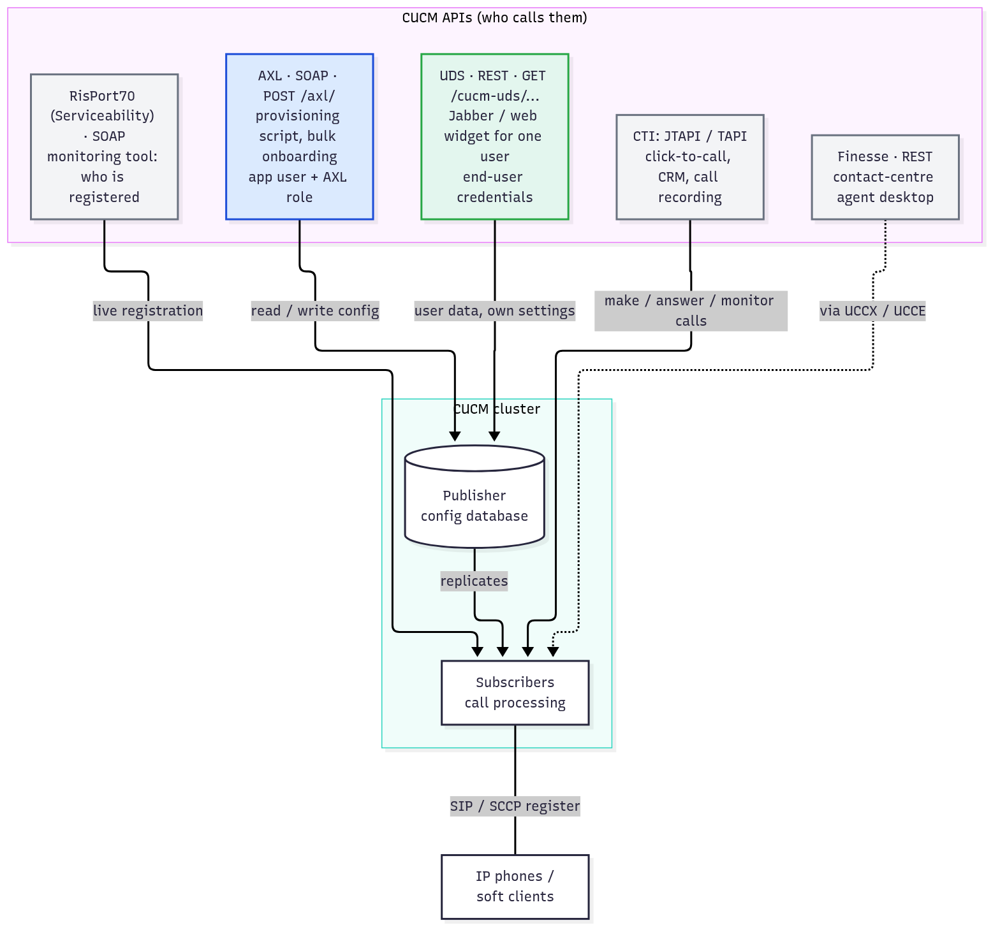
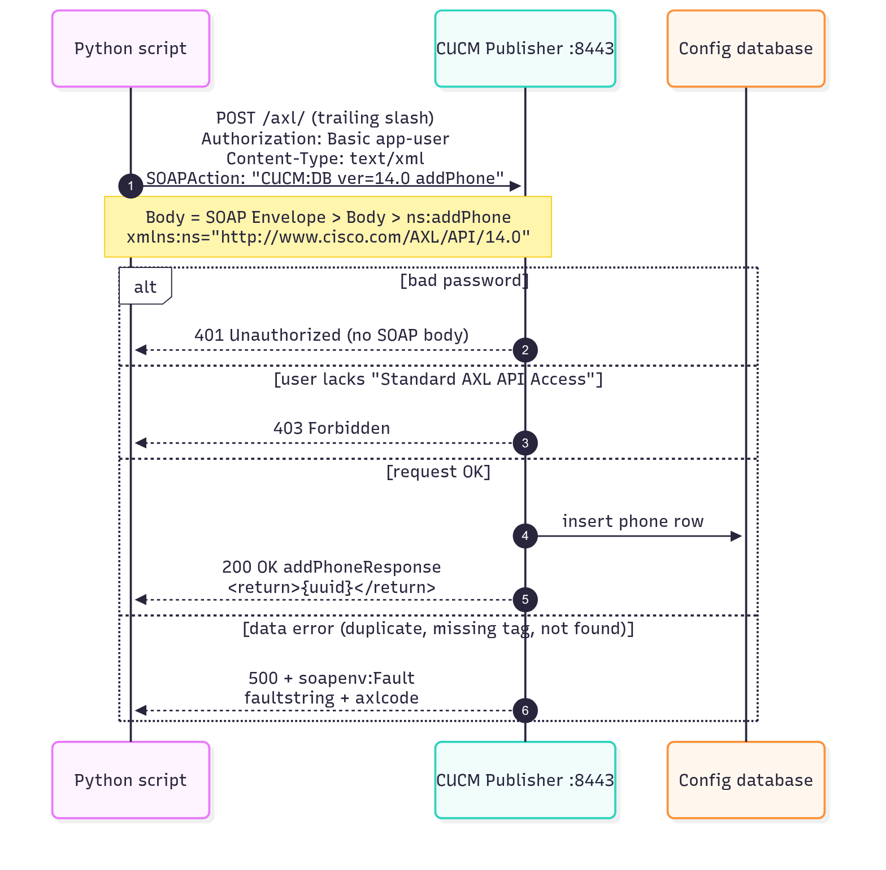
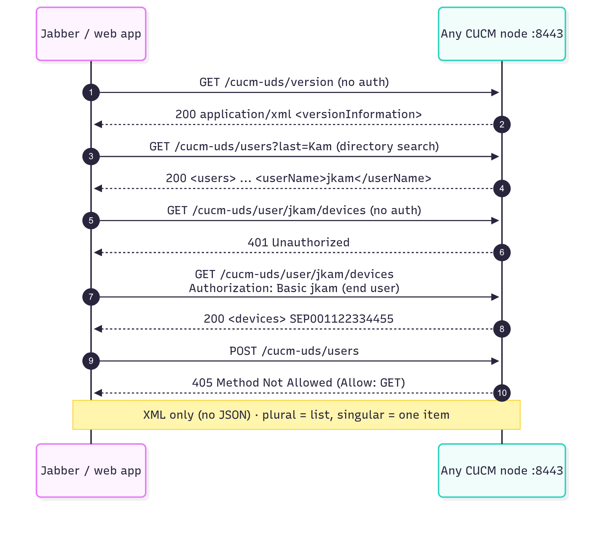
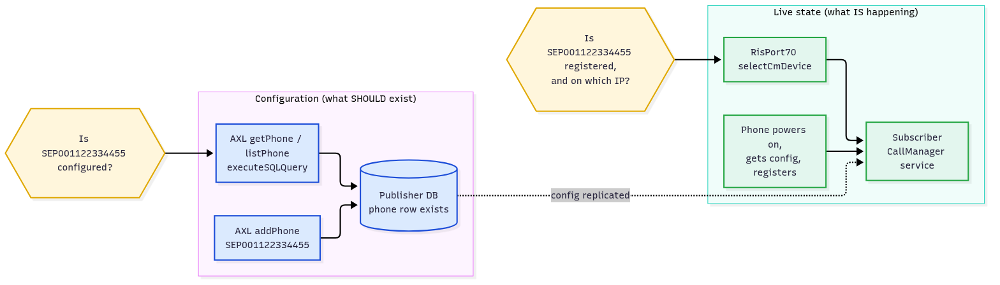
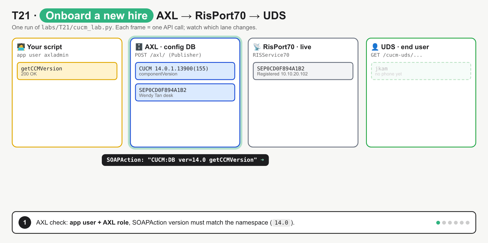
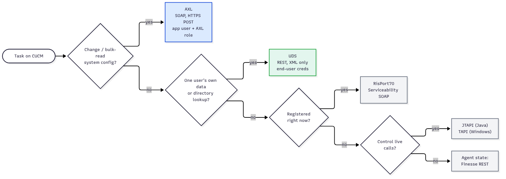

# T21 · Collaboration: CUCM AXL + UDS

> Owner: **Bob** · Blueprint: **3.4** · CBT coverage: **Full** · Learn by 2026-10-14 · Teach-back 2026-10-16



*Every T21 concept on one page. Top row is the system map (who calls which API, and what each API touches inside the cluster). The AXL and UDS rows list exact syntax from `labs/T21/`, numbered items are calls from the lab run, red boxes are exam traps, and the bottom row is the AXL vs UDS decision table.*

## TL;DR (teach-back card)

- **CUCM (Unified CM) = on-prem call control.** Phones register to it. One **Publisher** holds the writable config DB; **Subscribers** process calls. Several APIs, one job each: AXL (config), UDS (one user's data), RisPort70 (live registration), JTAPI/TAPI (live calls), Finesse (contact-centre agents).
- **AXL = SOAP/XML for admin and bulk provisioning.** Always `POST https://<cucm>:8443/axl/` to the Publisher, `Content-Type: text/xml`, `SOAPAction: "CUCM:DB ver=14.0 addPhone"`, envelope namespace `http://www.cisco.com/AXL/API/14.0`. Defined by a **WSDL** (AXL SQL Toolkit). Needs an **application user** with **Standard AXL API Access**. Operations are verb+object: `addPhone`, `getUser`, `listPhone`, `updateUser`, `removeLine`, plus `executeSQLQuery`.
- **UDS = REST with XML responses for end users.** `GET https://<cucm>:8443/cucm-uds/...`. System info needs no auth (`/version`, `/servers`). Personal data needs **that end user's own** credentials (`/user/{userId}/devices`). It's what Jabber uses for directory search and "my settings".
- **Trap:** "SOAP", "WSDL" or "provision 500 phones" → **AXL**. "REST", "user lookup" or "a user's own devices" → **UDS**. And AXL success ≠ phone online: "is it registered?" is **RisPort70**.

## Concepts

Every section below explains part of one run: **onboarding a new hire, Jun Hao Kam (`jkam`), extension 2001, Cisco 8845 phone `SEP001122334455`.**

- `labs/T21/mock_cucm.py` is a fake CUCM, written with the Python standard library only. It serves HTTPS on `https://127.0.0.1:8443` with a throwaway self-signed cert, like a real CUCM. It implements AXL (`/axl/`), UDS (`/cucm-uds/...`) and RisPort70 (`/realtimeservice2/services/RISService70`), with response shapes trimmed from the Cisco developer guides.
- `labs/T21/cucm_lab.py` (below) is the **reference program**. Admin side: AXL version check, add line + phone, link phone to user, read it back three ways. Live side: RisPort70. User side: UDS.
- Run both: `bash labs/T21/run_lab.sh`. It makes the cert, starts the mock, runs the client, then stops the mock.
- No always-on DevNet CUCM exists, so this didn't run against a live sandbox (see `## To verify`). To point it at a real CUCM, export `CUCM_HOST`, `AXL_USER`, `AXL_PASS`, `UDS_USER`, `UDS_PASS`.

**Mock users** (fake, local only):

| User | Type | Password | Can call |
|---|---|---|---|
| `axladmin` | application user, role `Standard AXL API Access` | `C1sco12345` | AXL, RisPort70 |
| `reportuser` | application user, **no** AXL role | `Report123` | nothing (AXL → `403`) |
| `jkam`, `wtan` | end users | `Us3rPass` | UDS, own data only |

**`labs/T21/cucm_lab.py`**

```python
"""T21 reference program: onboard one new hire on CUCM with AXL, check it with RisPort70, look it up with UDS.

Admin side  (AXL, SOAP)  : version check, add line + phone, link phone to user, read it back 3 ways.
Live state  (RisPort70)  : is the phone registered? (AXL can't tell you)
User side   (UDS, REST)  : what the new hire's Jabber / web app sees.

Run:  bash labs/T21/run_lab.sh          (starts labs/T21/mock_cucm.py on https://127.0.0.1:8443)
Real CUCM: export CUCM_HOST, AXL_USER, AXL_PASS, UDS_USER, UDS_PASS first.
"""
import os
import xml.etree.ElementTree as ET

import requests
import urllib3

urllib3.disable_warnings(urllib3.exceptions.InsecureRequestWarning)   # lab CUCM uses a self-signed cert

CUCM = os.environ.get("CUCM_HOST", "127.0.0.1")
PORT = os.environ.get("CUCM_PORT", "8443")
BASE = f"https://{CUCM}:{PORT}"
AXL_VERSION = "14.0"                                       # must match the CUCM schema version
AXL_AUTH = (os.environ.get("AXL_USER", "axladmin"), os.environ.get("AXL_PASS", "C1sco12345"))  # application user
UDS_AUTH = (os.environ.get("UDS_USER", "jkam"), os.environ.get("UDS_PASS", "Us3rPass"))        # end user
NEW_PHONE = "SEP001122334455"                              # SEP + MAC address of the new phone


def axl(operation, inner_xml, auth=AXL_AUTH):
    """POST one AXL SOAP request; return the <...Response> element, or None on a fault."""
    envelope = (
        '<soapenv:Envelope xmlns:soapenv="http://schemas.xmlsoap.org/soap/envelope/" '
        f'xmlns:ns="http://www.cisco.com/AXL/API/{AXL_VERSION}">'
        f"<soapenv:Header/><soapenv:Body><ns:{operation}>{inner_xml}</ns:{operation}>"
        "</soapenv:Body></soapenv:Envelope>"
    )
    headers = {"Content-Type": "text/xml", "Accept": "text/xml",
               "SOAPAction": f'"CUCM:DB ver={AXL_VERSION} {operation}"'}
    resp = requests.post(f"{BASE}/axl/", data=envelope, headers=headers, auth=auth, verify=False)
    action = headers["SOAPAction"].strip('"')
    print(f"\n>>> POST /axl/  SOAPAction: {action}")
    print(f"<<< {resp.status_code} {resp.reason}")
    if resp.status_code in (401, 403):                     # HTTP-level auth problem, no SOAP body
        return None
    body = ET.fromstring(resp.content).find("{http://schemas.xmlsoap.org/soap/envelope/}Body")[0]
    if body.tag.endswith("Fault"):                         # SOAP fault arrives with HTTP 500
        print(f"    FAULT axlcode={body.findtext('.//axlcode')}: {body.findtext('faultstring')}")
        return None
    return body


def uds(path, auth=None, method="GET"):
    """Call one UDS resource (REST, XML only); return the parsed XML root, or None on an error code."""
    resp = requests.request(method, f"{BASE}/cucm-uds{path}", headers={"Accept": "application/xml"},
                            auth=auth, verify=False)
    print(f"\n>>> {method} /cucm-uds{path}  auth={'end user ' + auth[0] if auth else 'none'}")
    print(f"<<< {resp.status_code} {resp.reason}" + (f"  Allow: {resp.headers['Allow']}" if "Allow" in resp.headers else ""))
    return ET.fromstring(resp.content) if resp.ok and resp.content else None


def risport_status(name_pattern):
    """RisPort70 selectCmDevice: live registration state (a Serviceability SOAP API, not AXL)."""
    envelope = (
        '<soapenv:Envelope xmlns:soapenv="http://schemas.xmlsoap.org/soap/envelope/" '
        'xmlns:soap="http://schemas.cisco.com/ast/soap"><soapenv:Body><soap:selectCmDevice>'
        "<soap:StateInfo></soap:StateInfo><soap:CmSelectionCriteria>"
        "<soap:MaxReturnedDevices>100</soap:MaxReturnedDevices><soap:DeviceClass>Phone</soap:DeviceClass>"
        "<soap:Model>255</soap:Model><soap:Status>Any</soap:Status><soap:SelectBy>Name</soap:SelectBy>"
        f"<soap:SelectItems><soap:item><soap:Item>{name_pattern}</soap:Item></soap:item></soap:SelectItems>"
        "</soap:CmSelectionCriteria></soap:selectCmDevice></soapenv:Body></soapenv:Envelope>"
    )
    resp = requests.post(f"{BASE}/realtimeservice2/services/RISService70", data=envelope, auth=AXL_AUTH,
                         headers={"Content-Type": "text/xml", "SOAPAction": '"selectCmDevice"'}, verify=False)
    print(f"\n>>> POST /realtimeservice2/services/RISService70  selectCmDevice {name_pattern}")
    print(f"<<< {resp.status_code} {resp.reason}")
    ns = {"r": "http://schemas.cisco.com/ast/soap"}
    root = ET.fromstring(resp.content)
    print(f"    TotalDevicesFound={root.findtext('.//r:TotalDevicesFound', namespaces=ns)}")
    for dev in root.iterfind(".//r:CmDevices/r:item", ns):
        print(f"    {dev.findtext('r:Name', namespaces=ns)}  {dev.findtext('r:Status', namespaces=ns)}"
              f"  {dev.findtext('r:IPAddress/r:item/r:IP', namespaces=ns)}")


def main():
    print("== 1. Discover the cluster (UDS, no auth) ==")
    ver = uds("/version")
    print(f"    version={ver.findtext('version')}  usersResourceAuthEnabled="
          f"{ver.findtext('capabilities/usersResourceAuthEnabled')}")
    servers = uds("/servers")
    print("    nodes: " + ", ".join(s.text for s in servers.iter("server")))

    print("\n== 2. AXL auth: application user + AXL role ==")
    axl("getCCMVersion", "", auth=("axladmin", "wrong-password"))     # 401: bad credentials
    axl("getCCMVersion", "", auth=("reportuser", "Report123"))        # 403: valid user, no AXL role
    resp = axl("getCCMVersion", "")                                   # 200
    print(f"    CUCM {resp.findtext('.//version')}")

    print("\n== 3. Provision (AXL add / update) ==")
    resp = axl("addLine", "<line><pattern>2001</pattern><description>Jun Hao Kam</description>"
                          "<usage>Device</usage><routePartitionName></routePartitionName></line>")
    print(f"    line uuid={resp.findtext('return')}")
    phone_xml = ("<phone><name>SEP001122334455</name><description>Jun Hao Kam desk</description>"
                 "<product>Cisco 8845</product><class>Phone</class><protocol>SIP</protocol>"
                 "<protocolSide>User</protocolSide><devicePoolName>Default</devicePoolName>"
                 "<commonPhoneConfigName>Standard Common Phone Profile</commonPhoneConfigName>"
                 "<locationName>Hub_None</locationName><useTrustedRelayPoint>Default</useTrustedRelayPoint>"
                 "<ownerUserName>jkam</ownerUserName>"
                 "<lines><line><index>1</index><dirn><pattern>2001</pattern><routePartitionName></routePartitionName>"
                 "</dirn></line></lines></phone>")
    resp = axl("addPhone", phone_xml)
    print(f"    phone uuid={resp.findtext('return')}")
    axl("addPhone", phone_xml)                                        # same name again -> SOAP fault
    axl("updateUser", "<userid>jkam</userid><associatedDevices><device>SEP001122334455</device>"
                      "</associatedDevices>")

    print("\n== 4. Read it back (AXL get / list / SQL) ==")
    resp = axl("getPhone", f"<name>{NEW_PHONE}</name>")
    phone = resp.find(".//phone")
    print(f"    {phone.findtext('name')}  {phone.findtext('product')}  owner={phone.findtext('ownerUserName')}"
          f"  DN={phone.findtext('lines/line/dirn/pattern')}")
    resp = axl("listPhone", "<searchCriteria><name>SEP%</name></searchCriteria>"
                            "<returnedTags><name/><description/><product/></returnedTags>")
    for p in resp.iter("phone"):
        print(f"    {p.findtext('name')}  {p.findtext('description')}")
    resp = axl("executeSQLQuery", "<sql>select name, description from device where tkclass = 1</sql>")
    print(f"    rows={len(resp.findall('.//row'))}")

    print("\n== 5. Live state (RisPort70): config is not registration ==")
    risport_status("SEP*")                                            # new phone is in the DB, not registered
    requests.post(f"{BASE}/mock/boot/{NEW_PHONE}", verify=False)      # mock only: the phone powers on
    print("\n    (phone SEP001122334455 boots and registers)")
    risport_status("SEP*")

    print("\n== 6. User side (UDS, REST + XML) ==")
    users = uds("/users?last=Kam")                                    # directory search
    for u in users.iter("user"):
        print(f"    {u.findtext('userName')}  {u.findtext('firstName')} {u.findtext('lastName')}"
              f"  ext {u.findtext('phoneNumber')}")
    uds("/user/jkam/devices")                                         # 401: personal data needs end-user auth
    devices = uds("/user/jkam/devices", auth=UDS_AUTH)                # 200, the new phone
    for d in devices.iter("device"):
        print(f"    {d.findtext('name')}  {d.findtext('model')}  {d.findtext('protocol')}")
    uds("/users", auth=UDS_AUTH, method="POST")                       # 405: UDS can't bulk-provision users


if __name__ == "__main__":
    main()
```

**Output** (`bash labs/T21/run_lab.sh`):

```
== 1. Discover the cluster (UDS, no auth) ==

>>> GET /cucm-uds/version  auth=none
<<< 200 OK
    version=14.0.1  usersResourceAuthEnabled=false

>>> GET /cucm-uds/servers  auth=none
<<< 200 OK
    nodes: cucm-pub.lab.local, cucm-sub1.lab.local

== 2. AXL auth: application user + AXL role ==

>>> POST /axl/  SOAPAction: CUCM:DB ver=14.0 getCCMVersion
<<< 401 Unauthorized

>>> POST /axl/  SOAPAction: CUCM:DB ver=14.0 getCCMVersion
<<< 403 Forbidden

>>> POST /axl/  SOAPAction: CUCM:DB ver=14.0 getCCMVersion
<<< 200 OK
    CUCM 14.0.1.13900(155)

== 3. Provision (AXL add / update) ==

>>> POST /axl/  SOAPAction: CUCM:DB ver=14.0 addLine
<<< 200 OK
    line uuid={12D098BA-C3A3-55FF-8050-18BD467E1D89}

>>> POST /axl/  SOAPAction: CUCM:DB ver=14.0 addPhone
<<< 200 OK
    phone uuid={483CBC89-AC32-5034-B8E1-61A94A107673}

>>> POST /axl/  SOAPAction: CUCM:DB ver=14.0 addPhone
<<< 500 Internal Server Error
    FAULT axlcode=-239: Could not insert new row - duplicate value in a UNIQUE INDEX column

>>> POST /axl/  SOAPAction: CUCM:DB ver=14.0 updateUser
<<< 200 OK

== 4. Read it back (AXL get / list / SQL) ==

>>> POST /axl/  SOAPAction: CUCM:DB ver=14.0 getPhone
<<< 200 OK
    SEP001122334455  Cisco 8845  owner=jkam  DN=2001

>>> POST /axl/  SOAPAction: CUCM:DB ver=14.0 listPhone
<<< 200 OK
    SEP001122334455  Jun Hao Kam desk
    SEP0CD0F894A1B2  Wendy Tan desk

>>> POST /axl/  SOAPAction: CUCM:DB ver=14.0 executeSQLQuery
<<< 200 OK
    rows=2

== 5. Live state (RisPort70): config is not registration ==

>>> POST /realtimeservice2/services/RISService70  selectCmDevice SEP*
<<< 200 OK
    TotalDevicesFound=1
    SEP0CD0F894A1B2  Registered  10.10.20.102

    (phone SEP001122334455 boots and registers)

>>> POST /realtimeservice2/services/RISService70  selectCmDevice SEP*
<<< 200 OK
    TotalDevicesFound=2
    SEP001122334455  Registered  10.10.20.101
    SEP0CD0F894A1B2  Registered  10.10.20.102

== 6. User side (UDS, REST + XML) ==

>>> GET /cucm-uds/users?last=Kam  auth=none
<<< 200 OK
    jkam  Jun Hao Kam  ext 2001

>>> GET /cucm-uds/user/jkam/devices  auth=none
<<< 401 Unauthorized

>>> GET /cucm-uds/user/jkam/devices  auth=end user jkam
<<< 200 OK
    SEP001122334455  Cisco 8845  SIP

>>> POST /cucm-uds/users  auth=end user jkam
<<< 405 Method Not Allowed  Allow: GET
```

### T21.01 · CUCM

**Must cover:**

- [x] Cisco Unified Communications Manager: call control for IP phones and UC

**Notes:**

- **What it is:** Cisco Unified Communications Manager (Unified CM, CUCM; older name CallManager). It's the **on-prem call-control server** for an enterprise phone system.
  - IP phones and soft clients (Jabber) **register** to it over SIP or SCCP.
  - It routes calls (dial plan: directory numbers, route patterns, partitions, calling search spaces), and handles features such as hold, transfer, voicemail integration and mobility.
  - Cloud counterpart: Webex Calling, which is configured through Webex APIs instead ([T42](T42-webex-webex-devices.md)).
- **Cluster roles** (this matters for which API goes where):

| Node | Job | API angle |
|---|---|---|
| **Publisher** (one per cluster) | holds the **writable** copy of the config database | send **AXL** here |
| **Subscribers** | call processing: phones register here | **RisPort70** reports their live state |
| any node | runs UDS, Tomcat web services on `:8443` | **UDS** answers on any node |

- **Device naming:** a phone's device name is `SEP` + its MAC address, e.g. `SEP001122334455`. The lab's existing phone is `SEP0CD0F894A1B2`.
- **Config vs live state:** the DB says what *should* exist (the phone row, its line `2001`, owner `jkam`). Registration is what *is* happening (the phone booted, registered, has IP `10.10.20.101`). Section 5 of the output shows the gap: the phone exists in AXL but RisPort70 finds only 1 device until it boots.



*Blue = AXL (writes config to the Publisher), green = UDS (one user's data), grey = the other UC APIs. Notice that only RisPort70 and CTI talk about live phones and calls.*

### T21.02 · AXL

**Must cover:**

- [x] Administrative XML: SOAP/XML API for provisioning and configuration
- [x] Add/update/list phones, users, lines (e.g. addPhone, getUser, listPhone, executeSQLQuery)
- [x] Defined by a WSDL; HTTPS POST to https://<cucm>:8443/axl/; needs an application user with the AXL role

**Notes:**

- **What it is:** AXL (Administrative XML Web Service) is a **SOAP/XML** API to **create, read, update and delete** objects in the CUCM config database: phones, lines (directory numbers), users, device pools, route patterns, partitions, CSSs, gateways and more.
  - Cisco calls it "a provisioning and configuration API, **not a real-time API**".
  - It's the API behind bulk onboarding, migrations and config reports.
- **SOAP in one minute** (first principles):
  - Every request is an XML **Envelope** containing a **Body**; the Body holds one element named after the operation (`<ns:addPhone>`).
  - The contract is a **WSDL** file (Web Services Description Language). It lists every operation and the XSD schema of its request and response. Tools such as SoapUI or Python `zeep` read it and generate the calls.
  - The response is an Envelope too: `<ns:addPhoneResponse>` on success, or `<soapenv:Fault>` on error.
- **Getting the WSDL:** CUCM Administration → **Application → Plugins** → download the **Cisco AXL SQL Toolkit** (`axlsqltoolkit.zip`). Each version folder holds `AXLAPI.wsdl` plus its schemas (`AXLEnums.xsd`, `axlmessage.xsd`, `axlsoap.xsd`, `axl.xsd`).
- **The HTTP request** (`axl()` in the program):

| Part | Value | In `axl()` |
|---|---|---|
| Method | always `POST`, even for `getPhone` / `listPhone` | `requests.post(...)` |
| URL | `https://<cucm>:8443/axl/` on the **Publisher**, trailing `/` required | `f"{BASE}/axl/"` |
| `Content-Type` | `text/xml` | `headers` dict |
| `SOAPAction` | `"CUCM:DB ver=14.0 <operation>"`, quotes included | `f'"CUCM:DB ver={AXL_VERSION} {operation}"'` |
| Namespace | `xmlns:ns="http://www.cisco.com/AXL/API/14.0"`, **same version** as `SOAPAction` | the `envelope` string |
| Auth | HTTP Basic, an **application user** with role **Standard AXL API Access** | `auth=AXL_AUTH` |
| TLS | CUCM uses a self-signed Tomcat cert by default; trust it, or `verify=False` in a lab | `verify=False` |

- **Versioning:** the schema version picks which AXL schema CUCM uses. CUCM supports the current schema plus a few older ones, so an old script keeps working after an upgrade. ⚠ verify the exact supported range per release.
- **Operations are `verb` + `Object`:**

| Verb | Example in the lab | Returns |
|---|---|---|
| `add` | `addLine`, `addPhone` | `<return>{uuid}</return>` |
| `get` | `getPhone`, `getUser`, `getCCMVersion` | the full object |
| `list` | `listPhone` with `<searchCriteria><name>SEP%</name>` + `<returnedTags>` | many objects, only the tags you asked for (`%` = wildcard) |
| `update` | `updateUser` with `<associatedDevices>` | `<return>{uuid}</return>` |
| `remove` | `removePhone` (not in the lab) | `<return>{uuid}</return>` |
| also | `applyPhone`, `resetPhone`, `restartPhone`, `executeSQLQuery`, `executeSQLUpdate` | |

- **Response names:** the response element is the request name + `Response` (`addPhone` → `addPhoneResponse`). `getPhone` in the lab reads `phone.findtext('lines/line/dirn/pattern')` → `2001`.
- **`executeSQLQuery`:** sends raw Informix SQL against the CUCM DB, e.g. `select name, description from device where tkclass = 1` (tkclass 1 = phone). It's powerful for reports, but **not version-stable** like the standard methods; `executeSQLUpdate` does writes.
- **Errors** (section 2 and 3 of the output):

| What went wrong | HTTP | Body |
|---|---|---|
| bad password | `401 Unauthorized` | no SOAP |
| valid user without the AXL role | `403 Forbidden` (⚠ verify on a real CUCM) | no SOAP |
| data problem: duplicate, missing mandatory tag, not found, bad SQL | `500 Internal Server Error` | `soapenv:Fault` with `faultstring` and `<axlError><axlcode>` |
| too many writes queued | `503 Service Unavailable` | retry after a few seconds |
| query result > 8 MB | Fault "Query request too large…" | split the query |

- **Throttling:** AXL throttles writes based on the DB transaction queue, and rejects reads that would return more than 8 MB. Wait for each response before sending the next query.
- Why `axl()` checks the code before parsing: `401`/`403` have no SOAP body, so `ET.fromstring()` would fail on them. Faults come back as `500`, so `resp.raise_for_status()` would hide the useful `faultstring`.



*One POST, four possible endings. Notice that auth problems are plain HTTP codes, but data problems are a `500` with a SOAP Fault in the body.*

### T21.03 · UDS

**Must cover:**

- [x] User Data Services: REST API (XML responses) for end-user and directory data
- [x] Read-mostly, user-level tasks (e.g. look up users, user devices); /cucm-uds/...

**Notes:**

- **What it is:** UDS (User Data Services) is a **REST** API that gives **authenticated access to one user's resources**: their devices, speed dials, subscribed services, remote destinations and credentials, plus directory search. It's installed and active on every CUCM node.
  - Built for **user-facing apps**: Jabber uses it for directory search and service discovery; a web widget uses it for "my phones" or "set call-forward-all".
- **REST, but XML:** standard HTTP methods on resource URLs. Responses are **XML only**; UDS doesn't do JSON. Send `Accept: application/xml` (and `Content-Type: application/xml` on `PUT`/`POST`).
- **Base URL:** `https://<cucm>:8443/cucm-uds/`. Resources used in the lab (`uds()` in the program):

| Resource | Auth | Returns |
|---|---|---|
| `GET /cucm-uds/version` | none | `<versionInformation>`, version `14.0.1` |
| `GET /cucm-uds/servers` | none | cluster nodes: `cucm-pub.lab.local`, `cucm-sub1.lab.local` |
| `GET /cucm-uds/users?last=Kam` | none in the lab (see below) | directory search: `jkam  Jun Hao Kam  ext 2001` |
| `GET /cucm-uds/user/jkam/devices` | **end user `jkam`'s own** Basic auth | his phones: `SEP001122334455  Cisco 8845  SIP` |
| `POST /cucm-uds/users` | | `405` (`Allow: GET`) in the lab: you can't create users through UDS |

- **Plural vs singular:** a plural resource (`users`, `devices`) gives a **list**; the singular one (`user/{userId}`, `device/{deviceId}`) drills into **one item**.
- **Authentication:**
  - General info (`version`, `servers`, time zones, locales) needs **no auth**.
  - User resources (`user`, `devices`, `speedDials`, `remoteDestinations`, `credentials`…) need **HTTP Basic with the end user's own** username and password (or an SSO bearer token).
  - Directory search on `/users` can be configured to need auth. `/version` reports it as `usersResourceAuthEnabled` (`false` in the lab). ⚠ verify.
- **"Read-mostly":** most calls are `GET`. A user can `PUT`/`POST`/`DELETE` **their own** settings (speed dials, call forward, remote destinations). There's no admin bulk provisioning: that's AXL.
- **Status codes** (Cisco's UDS guide): `200` with body, `201` created, `204` deleted, `401` not authenticated (also locked/expired accounts), `404` no such resource, `405` method not supported on that resource, `409` duplicate, `503` overloaded.



*A Jabber-style session. Notice that the same `devices` URL gives `401` until the end user's own credentials are sent, and that every answer is XML.*

### T21.04 · Other UC APIs (awareness)

**Must cover:**

- [x] Serviceability (RisPort for device registration status), CTI/JTAPI/TAPI for call control, Finesse for contact centre

**Notes:**

- Awareness level only. Know **which API answers which question**:

| API | Style | Question it answers | Lab |
|---|---|---|---|
| **Serviceability XML (SXML): RisPort70** | SOAP, `/realtimeservice2/services/RISService70` | "Is phone X **registered right now**? Which node, which IP?" (`selectCmDevice`) | `risport_status()` |
| other SXML services | SOAP | PerfMon counters, Control Center (start/stop services), log collection, CDR on demand | |
| **CTI: JTAPI** | Java library | **real-time call control**: make, answer, transfer, monitor calls (call recording, CRM click-to-call, IVR) | |
| **CTI: TAPI** | Windows TAPI via Cisco TSP | same, for Windows apps | |
| **Finesse** | REST, XML | **contact-centre agent** desktop: agent state (Ready/Not Ready), call control, reason codes, queues, teams (UCCX / UCCE) | |

- **Config is not registration.** Section 5 of the output: after `addPhone` succeeded, `selectCmDevice SEP*` still finds `TotalDevicesFound=1`. Only after the phone boots does it show `SEP001122334455  Registered  10.10.20.101`. AXL can't tell you that.
- RisPort70 requests are SOAP too (`<soap:selectCmDevice>` with `<soap:CmSelectionCriteria>`), and use an application user, like AXL. The mock simplifies the response.
- **CTI vs AXL:** CTI acts on **calls happening now**. AXL changes **configuration**. "Build an app that answers calls and logs the caller ID" → JTAPI, not AXL.



*Blue = configuration (what should exist), green = live state (what is happening). Each yellow question has exactly one API that answers it.*



*Steps in order: `getCCMVersion` → `addLine` + `addPhone` → `updateUser` → `selectCmDevice` (new phone not found) → phone boots, `selectCmDevice` shows `Registered` → UDS `GET /cucm-uds/user/jkam/devices` with jkam's own credentials. It fixes the misconception that a `200` from AXL `addPhone` means the phone is online, and that UDS is called with the admin account.*

### T21.05 · Choosing

**Must cover:**

- [x] Admin/bulk provisioning → AXL; user-facing lookups → UDS

**Notes:**

- **Rule:** admin/bulk provisioning → **AXL**. User-facing lookups and "my settings" → **UDS**.

| | AXL | UDS |
|---|---|---|
| Purpose | provision and configure the whole system | one user's data and directory search |
| Style | SOAP over HTTPS, defined by a WSDL | REST over HTTPS |
| Format | XML envelope in and out | XML responses only (no JSON) |
| Method | `POST` for everything | mostly `GET`; `PUT`/`POST`/`DELETE` on own settings |
| URL | `https://<cucm>:8443/axl/` on the Publisher | `https://<cucm>:8443/cucm-uds/...` on any node |
| Credentials | **application user** + `Standard AXL API Access` | **end user**'s own (none for system info) |
| Typical caller | provisioning script, migration tool, reporting | Jabber, a web widget, a self-service portal |



*Work left to right; stop at the first "yes". Blue = AXL, green = UDS.*

### T21.06 · Exam angle

**Must cover:**

- [x] Match AXL vs UDS to a task; recognise AXL as SOAP

**Notes:**

- **Recognise AXL on sight:** `soapenv:Envelope`, `xmlns:ns="http://www.cisco.com/AXL/API/…"`, a `SOAPAction: "CUCM:DB ver=…"` header, `POST …/axl/`, operation names such as `addPhone` / `getUser` / `listPhone` / `executeSQLQuery`. Any one of these → AXL.
- **Recognise UDS on sight:** `/cucm-uds/` in the URL, `GET`, `Accept: application/xml`, resources such as `users`, `user/{id}/devices`, `speedDials`.
- **Scenario → answer:**

| Scenario | Answer |
|---|---|
| Add 300 phones and lines for a new office from a CSV | AXL (`addLine`, `addPhone`) |
| Report every phone and its description | AXL `listPhone` or `executeSQLQuery` |
| Jabber directory search by last name | UDS `GET /cucm-uds/users?last=…` |
| A self-service portal shows "my phones" and sets call-forward-all | UDS `/cucm-uds/user/{userId}/…` with the user's credentials |
| Dashboard of unregistered phones | RisPort70 `selectCmDevice` |
| CRM click-to-dial, or recording live calls | CTI (JTAPI / TAPI) |
| Contact-centre agent goes Ready/Not Ready | Finesse REST |

- **Code-completion favourites:** fill in `POST`, `/axl/`, `text/xml`, the `SOAPAction` value, the namespace URL, or `verify=False` (self-signed cert). For UDS: the `/cucm-uds/` path, `Accept: application/xml`, end-user auth.

## Exam traps

- **AXL is SOAP, not REST.** Every AXL call is `POST` to the same URL `/axl/`; the operation is in the body (`<ns:getPhone>`) and in `SOAPAction`, not in the method or path.
- **UDS is REST but XML-only.** "REST API that returns JSON for CUCM users" doesn't exist; UDS returns XML.
- **Who logs in:** AXL = **application user** with **Standard AXL API Access**. UDS user resources = the **end user's own** account. In the lab, the AXL admin gets `401` on `/cucm-uds/user/jkam/devices`.
- **`401` vs `403` on AXL:** `401` = wrong username/password. `403` = valid user, missing the AXL role (re-entering the password won't help).
- **A SOAP Fault is HTTP `500`.** Duplicate name, missing mandatory tag, "not found": all `500` + `soapenv:Fault` + `axlcode`. Read `faultstring`, don't just check `ok`.
- **`SOAPAction` and namespace versions must match** (`ver=14.0` and `/AXL/API/14.0`). The header value includes the double quotes.
- **`/axl/` needs the trailing slash**, and AXL goes to the **Publisher** (the writable DB).
- **AXL ≠ registration status.** `getPhone` returns config only. "Registered? Which IP?" → RisPort70 (Serviceability).
- **AXL ≠ call control.** Live calls → CTI (JTAPI/TAPI). Agent state → Finesse.
- **`executeSQLQuery` is not version-safe** (direct DB schema). Prefer `get`/`list` methods; split big queries (> 8 MB result is rejected).
- **WSDL** = the AXL contract, from the AXL SQL Toolkit (CUCM Admin → Application → Plugins). "Which file describes the AXL operations?" → the WSDL.
- **Port `8443`** for AXL, UDS and RisPort70.

## Examples

### 1. Run the reference program

Needs Python 3 with `requests`, plus `openssl` and `curl`. No CUCM needed.

```bash
bash labs/T21/run_lab.sh                         # mock CUCM + cucm_lab.py
bash labs/T21/run_lab.sh labs/T21/curl_drill.sh  # mock CUCM + curl drill
CUCM_PORT=28443 bash labs/T21/run_lab.sh         # if 8443 is already in use
```

In the lab container:

```bash
docker build --tag ccna-auto-lab:latest --file labs/Dockerfile labs/
docker run --rm --volume "$(pwd)":/work --workdir /work ccna-auto-lab:latest bash labs/T21/run_lab.sh
```

Against a real CUCM (for example a reserved DevNet Collaboration sandbox over VPN), skip `run_lab.sh` and set the env vars:

```bash
export CUCM_HOST=cucm-pub.example.com AXL_USER=axl_api AXL_PASS='...' UDS_USER=jkam UDS_PASS='...'
python3 labs/T21/cucm_lab.py
```

- Section 5 calls `/mock/boot/...`, which exists only in the mock (it simulates the phone powering on). On a real CUCM that call fails harmlessly, and the second RisPort70 query shows the true state.

### 2. curl drill (`labs/T21/curl_drill.sh`)

The same two APIs with nothing hidden: AXL is a SOAP file POSTed with two headers; UDS is a plain GET.

```bash
#!/usr/bin/env bash
# T21 curl drill: raw AXL (SOAP) vs raw UDS (REST) against the mock CUCM.
# Run:  bash labs/T21/run_lab.sh labs/T21/curl_drill.sh
# Real CUCM: export CUCM_HOST, AXL_USER, AXL_PASS, UDS_USER, UDS_PASS first.
set -u
BASE="https://${CUCM_HOST:-127.0.0.1}:${CUCM_PORT:-8443}"
AXL_USER="${AXL_USER:-axladmin}"; AXL_PASS="${AXL_PASS:-C1sco12345}"
UDS_USER="${UDS_USER:-jkam}";     UDS_PASS="${UDS_PASS:-Us3rPass}"
WORK="$(mktemp -d)"; trap 'rm -rf "$WORK"' EXIT

cat > "$WORK/request.xml" <<'XML'
<soapenv:Envelope xmlns:soapenv="http://schemas.xmlsoap.org/soap/envelope/" xmlns:ns="http://www.cisco.com/AXL/API/14.0">
  <soapenv:Header/>
  <soapenv:Body>
    <ns:executeSQLQuery>
      <sql>select name, description from device where tkclass = 1</sql>
    </ns:executeSQLQuery>
  </soapenv:Body>
</soapenv:Envelope>
XML

echo "== 1. AXL: POST a SOAP envelope to /axl/ (SOAPAction names version + operation)"
curl --silent --insecure --user "$AXL_USER:$AXL_PASS" \
  --header 'Content-Type: text/xml' \
  --header 'SOAPAction: "CUCM:DB ver=14.0 executeSQLQuery"' \
  --data @"$WORK/request.xml" \
  "$BASE/axl/"
echo

echo; echo "== 2. AXL: SOAPAction version does not match the namespace -> SOAP fault, HTTP 500"
curl --silent --insecure --user "$AXL_USER:$AXL_PASS" --write-out '\nHTTP %{http_code}\n' \
  --header 'Content-Type: text/xml' \
  --header 'SOAPAction: "CUCM:DB ver=12.5 executeSQLQuery"' \
  --data @"$WORK/request.xml" \
  "$BASE/axl/"

echo; echo "== 3. AXL: GET instead of POST -> 405"
curl --silent --insecure --user "$AXL_USER:$AXL_PASS" --output /dev/null --write-out 'HTTP %{http_code}\n' \
  "$BASE/axl/"

echo; echo "== 4. UDS: plain GET, no envelope, no SOAPAction; XML back"
curl --silent --insecure --header 'Accept: application/xml' \
  "$BASE/cucm-uds/users?last=Kam"
echo

echo; echo "== 5. UDS: personal resource needs the END USER's own credentials"
curl --silent --insecure --output /dev/null --write-out 'no auth   -> HTTP %{http_code}\n' \
  --header 'Accept: application/xml' "$BASE/cucm-uds/user/$UDS_USER/devices"
curl --silent --insecure --output /dev/null --write-out 'AXL admin -> HTTP %{http_code}\n' \
  --user "$AXL_USER:$AXL_PASS" --header 'Accept: application/xml' "$BASE/cucm-uds/user/$UDS_USER/devices"
curl --silent --insecure --output /dev/null --write-out 'end user  -> HTTP %{http_code}\n' \
  --user "$UDS_USER:$UDS_PASS" --header 'Accept: application/xml' "$BASE/cucm-uds/user/$UDS_USER/devices"
```

Output (curl 7.81.0, `bash labs/T21/run_lab.sh labs/T21/curl_drill.sh`):

```
== 1. AXL: POST a SOAP envelope to /axl/ (SOAPAction names version + operation)
<?xml version="1.0" encoding="UTF-8"?><soapenv:Envelope xmlns:soapenv="http://schemas.xmlsoap.org/soap/envelope/"><soapenv:Body><ns:executeSQLQueryResponse xmlns:ns="http://www.cisco.com/AXL/API/14.0"><return><row><name>SEP0CD0F894A1B2</name><description>Wendy Tan desk</description></row></return></ns:executeSQLQueryResponse></soapenv:Body></soapenv:Envelope>

== 2. AXL: SOAPAction version does not match the namespace -> SOAP fault, HTTP 500
<?xml version="1.0" encoding="UTF-8"?><soapenv:Envelope xmlns:soapenv="http://schemas.xmlsoap.org/soap/envelope/"><soapenv:Body><soapenv:Fault><faultcode>soapenv:Server</faultcode><faultstring>SOAPAction 'CUCM:DB ver=12.5 executeSQLQuery' does not match request executeSQLQuery ver=14.0</faultstring><detail><axlError><axlcode>5003</axlcode><axlmessage>SOAPAction 'CUCM:DB ver=12.5 executeSQLQuery' does not match request executeSQLQuery ver=14.0</axlmessage><request>executeSQLQuery</request></axlError></detail></soapenv:Fault></soapenv:Body></soapenv:Envelope>
HTTP 500

== 3. AXL: GET instead of POST -> 405
HTTP 405

== 4. UDS: plain GET, no envelope, no SOAPAction; XML back
<users version="14.0.1" uri="https://127.0.0.1:8443/cucm-uds/users" start="0" requestedCount="64" returnedCount="1" totalCount="1"><user uri="https://127.0.0.1:8443/cucm-uds/user/jkam"><id>a3c1e2f0-1111-4c4c-9a9a-000000000001</id><userName>jkam</userName><firstName>Jun Hao</firstName><lastName>Kam</lastName><phoneNumber>2001</phoneNumber><email>jkam@lab.local</email></user></users>

== 5. UDS: personal resource needs the END USER's own credentials
no auth   -> HTTP 401
AXL admin -> HTTP 401
end user  -> HTTP 200
```

- Step 1 is the DevNet "Hello World with cURL" pattern: `--data @request.xml` + `Content-Type: text/xml` + `SOAPAction`.
- Step 2's fault text comes from the mock. A real CUCM also rejects mismatched versions, with its own wording.
- Step 5: the AXL admin can't read jkam's personal UDS data; only jkam can.

### 3. Break it on purpose

Edit `labs/T21/cucm_lab.py`, run `bash labs/T21/run_lab.sh`, then `git checkout -- labs/T21/cucm_lab.py` to undo. All four were run; the result shown is the real first changed output.

| Edit | First changed output | Lesson |
|---|---|---|
| In `axl()`, change `f"{BASE}/axl/"` to `f"{BASE}/axl"` | `<<< 404 Not Found`, then `xml.etree.ElementTree.ParseError: no element found` | trailing `/` is required; check the code before parsing |
| In `axl()`, change `ver={AXL_VERSION}` in the `SOAPAction` to `ver=12.5` | `<<< 500 Internal Server Error` · `FAULT axlcode=5003: SOAPAction 'CUCM:DB ver=12.5 getCCMVersion' does not match request getCCMVersion ver=14.0` | header and namespace versions must match; faults are `500` |
| In `main()`, change `uds("/user/jkam/devices", auth=UDS_AUTH)` to `auth=AXL_AUTH` | `>>> GET /cucm-uds/user/jkam/devices  auth=end user axladmin` · `<<< 401 Unauthorized` | UDS personal data = the end user's own credentials |
| In `uds()`, change `verify=False` to `verify=True` | `requests.exceptions.SSLError: … [SSL: CERTIFICATE_VERIFY_FAILED] certificate verify failed: self-signed certificate` | CUCM's default Tomcat cert is self-signed: trust it, or `verify=False` in a lab |

### 4. Trap snippet: which API is this?

```xml
<soapenv:Envelope xmlns:soapenv="http://schemas.xmlsoap.org/soap/envelope/" xmlns:ns="http://www.cisco.com/AXL/API/14.0">
  <soapenv:Body>
    <ns:listPhone>
      <searchCriteria><name>SEP%</name></searchCriteria>
      <returnedTags><name/><description/><product/></returnedTags>
    </ns:listPhone>
  </soapenv:Body>
</soapenv:Envelope>
```

- AXL: a SOAP envelope, the AXL namespace, and a `list` + object operation. It's sent with `POST https://<cucm>:8443/axl/` and `SOAPAction: "CUCM:DB ver=14.0 listPhone"`. `%` is the wildcard; `returnedTags` limits the reply to three fields.

## Practice questions

**Q1.** An engineer must create 400 phones and directory numbers on Unified CM from a spreadsheet. Which API fits?
A. UDS  B. AXL  C. RisPort70  D. JTAPI

<details><summary>Answer</summary>

**B.** Bulk configuration of the CUCM database is AXL's job (`addLine`, `addPhone`). UDS is user-scoped, RisPort70 only reports live registration, and JTAPI controls live calls. (T21.05)
</details>

**Q2.** Complete the request so CUCM accepts it:

```python
headers = {"Content-Type": "text/xml",
           "SOAPAction": '"CUCM:DB ver=14.0 getPhone"'}
resp = requests.______("https://cucm-pub.example.com:8443/______",
                       data=envelope, headers=headers,
                       auth=("axl_api", password), verify=False)
```

<details><summary>Answer</summary>

**`post`** and **`axl/`**. AXL is SOAP, so even a read (`getPhone`) is an HTTP POST of an XML envelope to `/axl/` (trailing slash included). (T21.02)
</details>

**Q3.** A web portal lets each employee see their own phones and set call-forward-all, signing in with their own CUCM credentials. Which API and URL prefix?
A. AXL, `/axl/`  B. UDS, `/cucm-uds/`  C. RisPort70, `/realtimeservice2/`  D. Finesse, `/finesse/api/`

<details><summary>Answer</summary>

**B.** User-facing, per-user data and settings with the end user's own credentials is UDS (`/cucm-uds/user/{userId}/devices`). (T21.03, T21.05)
</details>

**Q4.** An AXL script returns `403 Forbidden` on every call, and the password is correct. What is the most likely fix?
A. Change `SOAPAction` to the newest version  B. Send the request to a Subscriber  C. Give the application user the Standard AXL API Access role  D. Switch to `GET`

<details><summary>Answer</summary>

**C.** The credentials are accepted (that would be `401`), but the account isn't authorised for AXL. Add the AXL role through an access control group. (T21.02)
</details>

**Q5.** After a successful `addPhone` (`200`, uuid returned), the help desk asks whether `SEP001122334455` is online and which IP it has. Which call answers that?
A. AXL `getPhone`  B. AXL `executeSQLQuery`  C. RisPort70 `selectCmDevice`  D. UDS `GET /cucm-uds/servers`

<details><summary>Answer</summary>

**C.** AXL reads the config DB, which doesn't hold live registration. RisPort70 (a Serviceability API) returns registration status, node and IP. In the lab, the phone isn't found until it boots. (T21.04)
</details>

**Q6.** Which two statements about UDS are true? (Choose two.)
A. It is a SOAP API defined by a WSDL  B. Responses are XML  C. `/cucm-uds/version` can be read without authentication  D. It is the recommended API for bulk user provisioning  E. Requests must go to the Publisher

<details><summary>Answer</summary>

**B, C.** UDS is REST with XML-only responses, and system-information resources need no auth. A is AXL, D is AXL, and UDS answers on any node. (T21.03)
</details>

**Q7.** Refer to the response:

```
HTTP/1.1 500 Internal Server Error
Content-Type: text/xml;charset=UTF-8

<soapenv:Envelope ...><soapenv:Body><soapenv:Fault>
  <faultcode>soapenv:Server</faultcode>
  <faultstring>Could not insert new row - duplicate value in a UNIQUE INDEX column</faultstring>
  <detail><axlError><axlcode>-239</axlcode><request>addPhone</request></axlError></detail>
</soapenv:Fault></soapenv:Body></soapenv:Envelope>
```

What happened?
A. CUCM crashed; retry later  B. The phone name already exists  C. The SOAPAction header is missing  D. The user lacks the AXL role

<details><summary>Answer</summary>

**B.** AXL reports data errors as HTTP `500` with a SOAP Fault. The `faultstring` says a unique value (the device name) is duplicated. A role problem would be `403` with no SOAP body. (T21.02)
</details>

**Q8.** Put the onboarding steps in order: UDS `GET /cucm-uds/user/jkam/devices` · AXL `addPhone` · RisPort70 `selectCmDevice` shows `Registered` · AXL `addLine` · AXL `updateUser` (associate the phone).

<details><summary>Answer</summary>

`addLine` → `addPhone` → `updateUser` → RisPort70 `Registered` → UDS `GET …/devices`. The line must exist before the phone references it, and the user must own the phone before UDS lists it. This is the order of the lab run and of the GIF. (T21.02–T21.04)
</details>

## Study aids

| Aid | Type | Title | Est. min | Resource |
|---|---|---|---|---|
| T21.1 | Video | Automate Cisco Collaboration Platforms | 30 | CBT module |

- Skip / low priority: n/a

## Sources

- Overview image: HTML source `assets/T21/00-overview.html`, rendered to PNG (see `assets/README.md`). Diagrams: Mermaid sources in `assets/T21/*.mmd`. Animation: `assets/T21/06-onboard-anim.html` → `06-onboard.gif`.
- AXL overview (SOAP/XML, WSDL, CRUD on the config DB, object list): https://developer.cisco.com/docs/axl/
- AXL Developer Guide (POST to Publisher, `https://{cucm}:8443/axl/` with required trailing `/`, `text/xml`, `SOAPAction: "CUCM:DB ver=14.0 …"` + matching namespace, `…Response` naming, operation verbs, throttling, 503 on write queue, 8 MB read limit, `executeSQLQuery` not version-stable, faults as HTTP 500, AXL read-only role since 11.5): https://developer.cisco.com/docs/axl/axl-developer-guide/
- Download the AXL WSDL (AXL SQL Toolkit, Application → Plugins): https://developer.cisco.com/docs/axl/download-the-axl-wsdl
- Hello World with Java (application user with Standard CCM Admin User and Standard AXL API Access roles): https://developer.cisco.com/docs/axl/hello-world-with-java
- Hello World with cURL (`curl -k -u … -H 'SOAPAction: "CUCM:DB ver=12.5 executeSQLQuery"' -d @request.xml https://…:8443/axl/`): https://developer.cisco.com/docs/axl/hello-world-with-curl
- UDS Developer Guide (REST, XML only, resources, CORS, status codes, plural vs singular, installed on all nodes): https://developer.cisco.com/docs/user-data-services/
- UDS system resources (`/version`, `/servers`, `/users`, `/clusterUser`, options): https://developer.cisco.com/docs/user-data-services/system-resources
- UDS authentication (which resources need end-user auth): https://developer.cisco.com/site/user-data-services/overview/authentication
- UDS FAQ (general info needs no auth; restricted resources use Basic auth): https://developer.cisco.com/site/user-data-services/help/faq
- RisPort70 API (selectCmDevice: real-time registration status, IP, model): https://developer.cisco.com/docs/sxml/risport70-api
- Finesse REST APIs (agent desktop and configuration APIs): https://developer.cisco.com/docs/finesse/cisco-finesse-rest-apis
- Python `requests` and `xml.etree.ElementTree`: https://requests.readthedocs.io/ · https://docs.python.org/3/library/xml.etree.elementtree.html
- Cisco 200-901 v1.1 exam topics (3.4): https://learningcontent.cisco.com/documents/marketing/exam-topics/200-901-CCNAAUTO_v.1.1.pdf

## To verify

- ⚠ **Not run against a live CUCM.** There's no always-on DevNet CUCM; the Collaboration sandbox needs a reservation and VPN. All output comes from `labs/T21/mock_cucm.py`. Re-run `cucm_lab.py` against a reserved sandbox when possible.
- ⚠ The Docker lab command wasn't run (no Docker on the drafting host). `run_lab.sh` needs the `openssl` CLI inside `python:3.12-slim`; if it's missing, add `openssl` to the `apt-get install` line in `labs/Dockerfile`. Run locally, it was tested with Python 3.10, requests 2.34 and curl 7.81.
- ⚠ Mock shapes are trimmed: real `addPhone` needs more mandatory tags (for example `phoneTemplateName`, `primaryPhoneName`, `builtInBridgeStatus`, `packetCaptureMode`, `certificateOperation`, `deviceMobilityMode`; check the 14.0 schema). Real `getPhone` and RisPort70 responses have many more fields.
- ⚠ HTTP `403` for an application user without the AXL role: modelled in the mock, not confirmed on a real CUCM.
- ⚠ The fault text for a `SOAPAction`/namespace version mismatch (drill step 2) is the mock's wording. The `axlcode -239` duplicate-row code comes from Informix; confirm on a real CUCM.
- ⚠ UDS `/users` directory search may require auth depending on configuration (`usersResourceAuthEnabled` in `/cucm-uds/version`); exact enterprise parameter name to confirm.
- ⚠ Application-user credentials on UDS user resources → `401` (drill step 5): modelled, not confirmed.
- ⚠ RisPort70 `SOAPAction` value (`"selectCmDevice"`) and the `http://schemas.cisco.com/ast/soap` namespace: confirm against the RisPort70 WSDL (`https://<cucm>:8443/realtimeservice2/services/RISService70?wsdl`).
- ⚠ Which AXL schema versions each CUCM release accepts (e.g. 14 vs 15). The AXL guide notes no API changes in release 15.
- ⚠ Finesse port and URL pattern (`https://<finesse>:8445/finesse/api/User/<id>` from memory): not used in the note's code; confirm before adding it.
