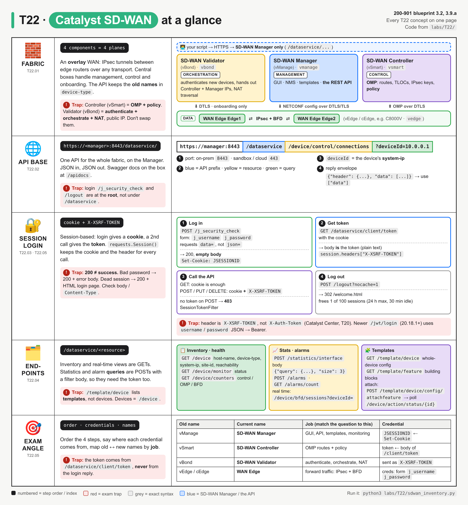
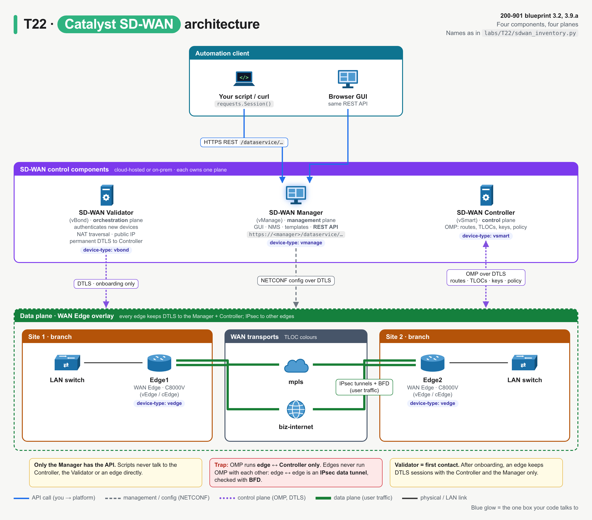
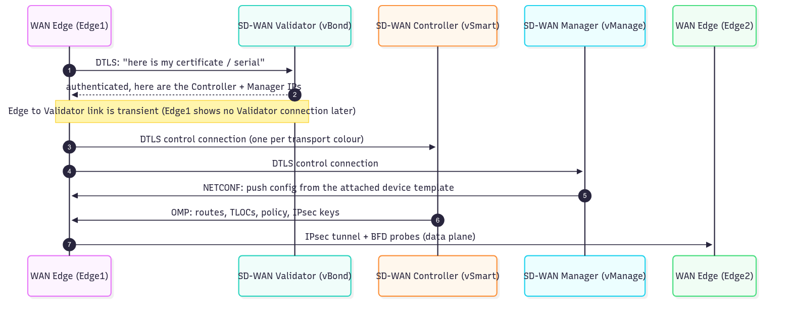
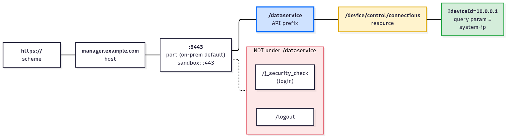
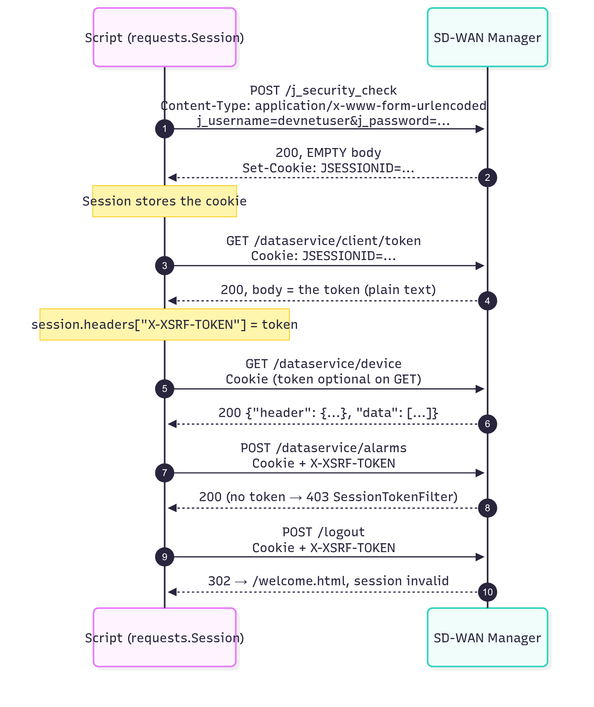
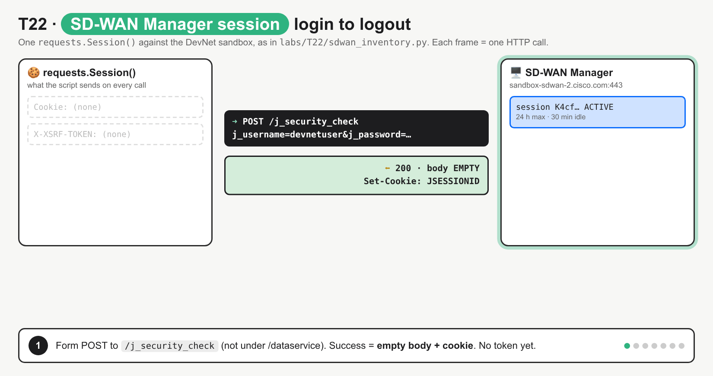
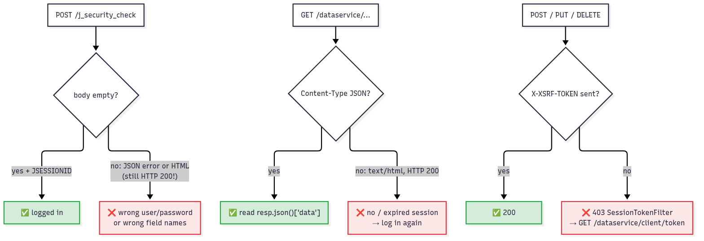
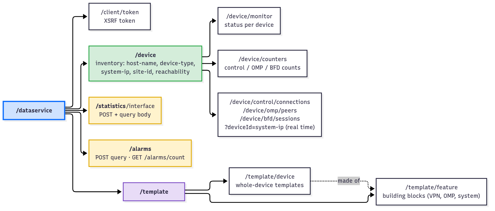

# T22 · Catalyst SD-WAN

> Owner: **Bob** · Blueprint: **3.2, 3.9.a** · CBT coverage: **Full** · Learn by 2026-10-15 · Teach-back 2026-10-16



*Every T22 concept on one page. The top panel is the fabric (4 components, old name in brackets, one plane each), the middle panels are the API (base URL, login steps numbered in order, endpoints), and red boxes are exam traps.*

## TL;DR (teach-back card)

- **Four components, four planes.** SD-WAN **Manager** (vManage) = management + the **only REST API**. SD-WAN **Controller** (vSmart) = control plane, runs **OMP**, pushes policy. SD-WAN **Validator** (vBond) = orchestration, **authenticates** devices and points them at the controllers. **WAN Edge** (vEdge/cEdge) = data plane, IPsec tunnels + BFD.
- **API base = `https://<manager>:8443/dataservice/`.** Login and logout are at the root (`/j_security_check`, `/logout`), everything else is under `/dataservice`. Inventory `/device`, health `/device/monitor` + `/device/counters`, stats `/statistics/...`, `/alarms`, `/template/device` + `/template/feature`.
- **Session login, in order:** ① `POST /j_security_check` form data `j_username` + `j_password` → empty body + `JSESSIONID` cookie ② `GET /dataservice/client/token` → token in the body ③ send cookie + `X-XSRF-TOKEN` header on every call (`requests.Session()` keeps both) ④ `POST /logout`.
- **Trap:** SD-WAN Manager answers **HTTP 200 even when it failed**: a bad password returns 200 with an error body, and a dead session returns 200 with an HTML login page. Check the body / `Content-Type`. A POST without `X-XSRF-TOKEN` is the one that gives a real error: `403`.

## Concepts

Every section below explains one part of the same program. Read it once first.

- `labs/T22/sdwan_inventory.py` (shown below) is the **reference program**. It logs in to SD-WAN Manager, builds an inventory with the current component names, checks health, reads interface statistics and alarms, lists templates, then logs out.
  - It deliberately sends one POST **without** the XSRF token, and makes one GET **after** logout, so both failure modes appear in the output.
  - It's read-only. Its two POSTs are queries (statistics, alarms) that don't change anything.
- It runs against the **DevNet always-on Catalyst SD-WAN sandbox** by default (`sandbox-sdwan-2.cisco.com`, release 20.18). The output below is a real run from 10 Oct 2026.
- Offline: `bash labs/T22/run_lab.sh` starts `labs/T22/mock_sdwan.py`, which copies the sandbox's response shapes and quirks, and runs the same program against it. The output is identical apart from the logout redirect URL.
- Needs `requests` (already in the lab image).

**`labs/T22/sdwan_inventory.py`**

```python
"""T22 reference program: SD-WAN Manager (vManage) login, inventory and health report.

Live DevNet sandbox (default):  python3 labs/T22/sdwan_inventory.py
Offline mock:                   bash labs/T22/run_lab.sh
Read-only: the POSTs below are queries (statistics, alarms); nothing is created or changed.
"""
import os
import sys
from collections import Counter

import requests
import urllib3

urllib3.disable_warnings(urllib3.exceptions.InsecureRequestWarning)  # sandbox cert is self-signed

SCHEME = os.environ.get("SDWAN_SCHEME", "https")
HOST = os.environ.get("SDWAN_HOST", "sandbox-sdwan-2.cisco.com")
PORT = os.environ.get("SDWAN_PORT", "443")            # on-prem default is 8443; the sandbox uses 443
USER = os.environ.get("SDWAN_USER", "devnetuser")     # public DevNet sandbox defaults, env vars win
PASSWORD = os.environ.get("SDWAN_PASS", "RG!_Yw919_83")

BASE = f"{SCHEME}://{HOST}:{PORT}"                    # login and logout live at the root
API = f"{BASE}/dataservice"                           # every REST resource lives under /dataservice

NEW_NAME = {"vmanage": "SD-WAN Manager", "vsmart": "SD-WAN Controller",
            "vbond": "SD-WAN Validator", "vedge": "WAN Edge"}   # API device-type -> current name


def login(session):
    """Step 1: form POST to /j_security_check. Success = empty body + JSESSIONID cookie."""
    resp = session.post(f"{BASE}/j_security_check",
                        data={"j_username": USER, "j_password": PASSWORD})  # data= -> form-encoded
    if resp.status_code != 200 or resp.text.strip():     # a FAILED login is also HTTP 200, with a body
        sys.exit(f"Login failed: HTTP {resp.status_code}, body: {resp.text.strip()[:60]!r}")
    print(f"1. POST /j_security_check -> {resp.status_code}, empty body, "
          f"JSESSIONID cookie stored: {'JSESSIONID' in session.cookies}")


def get_xsrf_token(session):
    """Step 2: GET the XSRF token (plain text body) and send it on every later request."""
    resp = session.get(f"{API}/client/token")
    resp.raise_for_status()
    session.headers["X-XSRF-TOKEN"] = resp.text
    print(f"2. GET /dataservice/client/token -> {resp.status_code}, "
          f"{len(resp.text)}-char token, now sent as X-XSRF-TOKEN")


def get(session, path, params=None):
    """GET /dataservice<path> and return the "data" list (the "header" key is column metadata)."""
    resp = session.get(f"{API}{path}", params=params)
    resp.raise_for_status()
    if "json" not in resp.headers.get("Content-Type", ""):   # dead session -> 200 + HTML login page
        sys.exit(f"GET {path}: HTTP {resp.status_code} but HTML, not JSON (session expired?)")
    return resp.json()["data"]


def query(session, path, hours=1, size=5):
    """POST a read-only query body (statistics/alarms APIs take filters in a JSON body)."""
    body = {"query": {"condition": "AND", "rules": [{"value": [str(hours)], "field": "entry_time",
                                                      "type": "date", "operator": "last_n_hours"}]},
            "size": size}
    return session.post(f"{API}{path}", json=body)       # json= -> Content-Type: application/json


def main():
    session = requests.Session()        # keeps the JSESSIONID cookie and our headers for every call
    session.verify = False              # skip TLS checks (like curl -k) for the self-signed cert
    session.trust_env = False           # else a REQUESTS_CA_BUNDLE env var overrides verify=False

    print("== Authenticate ==")
    login(session)
    get_xsrf_token(session)

    print("\n== 3. Inventory: GET /dataservice/device ==")
    devices = get(session, "/device")
    print(f"{'host-name':<13}{'device-type':<12}{'= current name':<19}{'system-ip':<13}{'site':<6}{'reach':<11}version")
    for d in devices:
        print(f"{d['host-name']:<13}{d['device-type']:<12}{NEW_NAME[d['device-type']]:<19}"
              f"{d['system-ip']:<13}{d['site-id']:<6}{d['reachability']:<11}{d['version']}")

    print("\n== 4. Health: GET /dataservice/device/monitor + /device/counters ==")
    status = {d["system-ip"]: d["status"] for d in get(session, "/device/monitor")}
    for c in get(session, "/device/counters"):
        print(f"{c['system-ip']:<13}status={status[c['system-ip']]:<8}"
              f"control={c['number-vsmart-control-connections']}/{c['expectedControlConnections']}  "
              f"omp_up={c.get('ompPeersUp', '-')}  bfd_up={c.get('bfdSessionsUp', '-')}")

    edge = next(d for d in devices if d["device-type"] == "vedge")
    print(f"\n   Control connections of {edge['host-name']} "
          f"(GET /dataservice/device/control/connections?deviceId={edge['system-ip']}):")
    for c in get(session, "/device/control/connections", params={"deviceId": edge["system-ip"]}):
        print(f"   {c['local-color']:<13}-> {c['peer-type']:<8}{c['peer-host-name']:<14}{c['protocol']} {c['state']}")

    print("\n== 5. Statistics: POST /dataservice/statistics/interface (query body) ==")
    resp = query(session, "/statistics/interface", hours=1, size=3)
    for row in resp.json()["data"]:
        print(f"{row['host_name']:<7}{row['interface']:<18}{row['oper_status']:<5}"
              f"tx_octets={row['tx_octets']}  rx_errors={row['rx_errors']}")

    print("\n== 6. Alarms: GET /dataservice/alarms/count, then a POST query without the token ==")
    print(f"alarm count: {get(session, '/alarms/count')[0]}")
    resp = session.post(f"{API}/alarms", json={"size": 1},
                        headers={"X-XSRF-TOKEN": None})          # None drops the Session header
    print(f"POST /alarms WITHOUT X-XSRF-TOKEN -> {resp.status_code} {resp.text.strip()[:110]}")
    resp = query(session, "/alarms", hours=24, size=5)
    print(f"POST /alarms WITH    X-XSRF-TOKEN -> {resp.status_code}, {len(resp.json()['data'])} alarms in last 24 h")

    print("\n== 7. Templates: GET /dataservice/template/device + /template/feature ==")
    device_templates = get(session, "/template/device")
    print(f"device templates: {len(device_templates)} "
          f"({sum(t['factoryDefault'] for t in device_templates)} factory default)")
    for t in device_templates:
        if not t["factoryDefault"]:
            print(f"  {t['templateName']:<18}{t['deviceType']:<15}{t['configType']:<10}attached={t['devicesAttached']}")
    feature_templates = get(session, "/template/feature")
    top = Counter(t["templateType"] for t in feature_templates).most_common(3)
    print(f"feature templates: {len(feature_templates)}, top types: {top}")

    print("\n== 8. Log out: POST /logout ==")
    resp = session.post(f"{BASE}/logout", params={"nocache": "1"}, allow_redirects=False)
    print(f"POST /logout -> {resp.status_code} (redirect to {resp.headers.get('Location', '-').split('?')[0]})")
    resp = session.get(f"{API}/device")
    print(f"GET /dataservice/device after logout -> {resp.status_code}, "
          f"Content-Type: {resp.headers.get('Content-Type')}  <- login page, not data")


if __name__ == "__main__":
    main()
```

**Output** (`python3 labs/T22/sdwan_inventory.py`, live sandbox):

```
== Authenticate ==
1. POST /j_security_check -> 200, empty body, JSESSIONID cookie stored: True
2. GET /dataservice/client/token -> 200, 100-char token, now sent as X-XSRF-TOKEN

== 3. Inventory: GET /dataservice/device ==
host-name    device-type = current name     system-ip    site  reach      version
Manager01    vmanage     SD-WAN Manager     100.0.0.1    100   reachable  20.18.2.1
Controller01 vsmart      SD-WAN Controller  100.0.0.101  100   reachable  20.18.2.1
Validator01  vbond       SD-WAN Validator   100.0.0.201  100   reachable  20.18.2.1
Edge1        vedge       WAN Edge           10.0.0.1     1     reachable  17.18.01a.0.182
Edge2        vedge       WAN Edge           10.0.0.2     2     reachable  17.18.01a.0.182
Edge3        vedge       WAN Edge           10.0.0.3     3     reachable  17.18.01a.0.182
Edge4        vedge       WAN Edge           10.0.0.4     4     reachable  17.18.01a.0.182

== 4. Health: GET /dataservice/device/monitor + /device/counters ==
100.0.0.1    status=normal  control=1/1  omp_up=-  bfd_up=-
100.0.0.201  status=normal  control=1/1  omp_up=-  bfd_up=-
100.0.0.101  status=normal  control=0/0  omp_up=4  bfd_up=-
10.0.0.3     status=normal  control=2/2  omp_up=1  bfd_up=6
10.0.0.4     status=normal  control=2/2  omp_up=1  bfd_up=6
10.0.0.1     status=normal  control=2/2  omp_up=1  bfd_up=6
10.0.0.2     status=normal  control=2/2  omp_up=1  bfd_up=6

   Control connections of Edge1 (GET /dataservice/device/control/connections?deviceId=10.0.0.1):
   biz-internet -> vsmart  Controller01  dtls up
   mpls         -> vsmart  Controller01  dtls up
   biz-internet -> vmanage Manager01     dtls up

== 5. Statistics: POST /dataservice/statistics/interface (query body) ==
Edge4  GigabitEthernet5  Up   tx_octets=3370  rx_errors=0
Edge4  GigabitEthernet8  Up   tx_octets=3370  rx_errors=0
Edge4  GigabitEthernet6  Up   tx_octets=3370  rx_errors=0

== 6. Alarms: GET /dataservice/alarms/count, then a POST query without the token ==
alarm count: {'count': 304, 'cleared_count': 408}
POST /alarms WITHOUT X-XSRF-TOKEN -> 403 <html><head><title>Error</title></head><body>SessionTokenFilter: Token provided via HTTP Header does not match
POST /alarms WITH    X-XSRF-TOKEN -> 200, 0 alarms in last 24 h

== 7. Templates: GET /dataservice/template/device + /template/feature ==
device templates: 19 (17 factory default)
  edge_basic        vedge-C8000V   template  attached=0
  controller_basic  vsmart         template  attached=1
feature templates: 142, top types: [('cisco_vpn_interface', 47), ('cisco_vpn', 31), ('cisco_omp', 8)]

== 8. Log out: POST /logout ==
POST /logout -> 302 (redirect to https://sandbox-sdwan-2.cisco.com:443/welcome.html)
GET /dataservice/device after logout -> 200, Content-Type: text/html;charset=UTF-8  <- login page, not data
```

### T22.01 · Components

**Must cover:**

- [x] SD-WAN Manager (formerly vManage): management/NMS and API
- [x] SD-WAN Controller (vSmart): control plane, OMP routing and policy
- [x] SD-WAN Validator (vBond): orchestration, authenticates devices
- [x] WAN Edge routers: data plane

**Notes:**

- **SD-WAN** = a WAN built as an **overlay**: IPsec tunnels between branch routers, across any transport (MPLS, internet, LTE). A central controller decides routing and policy, so you don't configure each router by hand.
- Cisco's product is **Catalyst SD-WAN** (formerly Viptela / Cisco SD-WAN). It has **four components, each owning one plane**:

| Current name | Old name | Plane | What it does | In the program's output |
|---|---|---|---|---|
| **SD-WAN Manager** | vManage | **Management** | GUI, NMS, templates, monitoring, **the REST API** | `Manager01  vmanage` |
| **SD-WAN Controller** | vSmart | **Control** | runs **OMP** (Overlay Management Protocol) with every edge: advertises routes, TLOCs, IPsec keys and **policy** | `Controller01  vsmart`, `omp_up=4` (one OMP peer per edge) |
| **SD-WAN Validator** | vBond | **Orchestration** | **first contact** for a new device: **authenticates** it, tells it where the Controllers and Manager are, helps with NAT traversal. Needs a public IP | `Validator01  vbond` |
| **WAN Edge** | vEdge / cEdge | **Data** | the branch/DC routers (e.g. C8000V) that forward user traffic over IPsec tunnels and check them with **BFD** | `Edge1`…`Edge4  vedge`, `bfd_up=6` |



*Your script talks only to the Manager (blue). The Manager configures edges with NETCONF, the Controller runs OMP with them, and the Validator is only involved at onboarding. User traffic flows edge to edge over IPsec.*

- The API keeps the **old names**: `device-type` is `vmanage`, `vsmart`, `vbond` or `vedge`. The program's `NEW_NAME` dict maps them to the current names, which is the same mapping the exam asks for.
  - IOS XE routers running SD-WAN are called **cEdge** in older docs. The API still reports them as `device-type: vedge` (`device-model: vedge-C8000V` in the output).
- The rename to SD-WAN Manager / Controller / Validator came with release 20.12 (Cisco release notes).
- **How a new edge joins** (the order matters for "what happens next" questions):



*The Validator authenticates the edge and hands over the Controller and Manager addresses. After that the edge keeps DTLS sessions only with the Controller and the Manager.*

- Proof in the output: `Control connections of Edge1` lists the **Controller** (one per transport colour: `biz-internet`, `mpls`) and the **Manager**, but **no Validator**. The Validator's own counters show `control=1/1`, which is its permanent link to the Controller.
- **OMP** runs between edges and the Controller **only**. Edges never run OMP with each other. The edge-to-edge links are IPsec data tunnels, monitored by **BFD**.

### T22.02 · API base

**Must cover:**

- [x] REST API on SD-WAN Manager: https://<manager>:8443/dataservice/

**Notes:**

- There is **one API endpoint for the whole fabric: SD-WAN Manager.** You never call the Controller, the Validator or the edges directly. The Manager collects their data (over its NETCONF/DTLS channels) and exposes it through REST.
- Base URL = `https://<manager>:8443/dataservice/`. Cisco's docs: "The system prefixes the Cisco Catalyst SD-WAN Manager API URL with /dataservice."
  - `8443` is the usual on-prem HTTPS port. The DevNet sandbox and cloud-hosted fabrics answer on `443`, which is why the program reads `SDWAN_PORT` from the environment.
  - Payloads are JSON (apart from a few file uploads).



*`/dataservice` (blue) is the API prefix for every resource. The login and logout URLs (red) sit at the root, not under `/dataservice`.*

- In the program: `BASE = f"{SCHEME}://{HOST}:{PORT}"` is used for login and logout, and `API = f"{BASE}/dataservice"` for everything else.
  - Break-it 4 in Examples removes `/dataservice` and gets a `404` on `/client/token`.
- **Interactive docs** (Swagger) are on the Manager itself at `https://<manager>/apidocs`.
- **Response envelope:** most GETs return `{"header": {...}, "data": [...]}`. `header` describes columns for the GUI; your data is under `data`. The program's `get()` returns `resp.json()["data"]`.

### T22.03 · Authentication

**Must cover:**

- [x] POST /j_security_check with form data j_username and j_password → JSESSIONID cookie
- [x] GET /dataservice/client/token → token sent as X-XSRF-TOKEN header on POST/PUT/DELETE
- [x] requests.Session() keeps the cookie

**Notes:**

- Classic SD-WAN Manager auth is **session-based** (a cookie), unlike the bearer-token APIs in T20 Catalyst Center or T18 Meraki. There are 3 steps plus a logout:



*Login gives you a cookie, not a token. The token is a second call. GETs need only the cookie; POST/PUT/DELETE need cookie + token.*



*One session from login to logout: login → cookie only → GET the token → GET works → POST without the token → 403 → POST with it → 200 → logout → GET returns an HTML login page with 200. It fixes three misconceptions: that the login reply contains the token, that the cookie is enough for a POST, and that 200 always means success.*

1. **Login: `login()`**
   - `session.post(f"{BASE}/j_security_check", data={"j_username": USER, "j_password": PASSWORD})`.
   - `data=` (not `json=`) sends `Content-Type: application/x-www-form-urlencoded`, which is what the form endpoint expects. The field names are exactly `j_username` and `j_password`.
   - Success = `200`, **empty body**, and `Set-Cookie: JSESSIONID=<session hash>` (curl drill step 1).
   - Failure is **also `200`**, but with a body. The sandbox (20.18) returns a JSON `"Login Error"` (curl drill step 6); Cisco's docs say older releases return an HTML login page. So `login()` checks `resp.text.strip()` and doesn't trust the status code.
2. **XSRF token: `get_xsrf_token()`**
   - `GET /dataservice/client/token` with the cookie. The **body is the token**, as plain text (`resp.text`, not `.json()`). The sandbox's is 100 characters.
   - The program sets `session.headers["X-XSRF-TOKEN"] = resp.text`, so every later request carries it.
   - XSRF (CSRF) protection was added in release 19.2. Before that the cookie alone was enough.
3. **Calls.**
   - **GET** needs only the cookie. Break-it 2 skips step 2, and the inventory and health GETs still work.
   - **POST/PUT/DELETE** need cookie **+** `X-XSRF-TOKEN`. Without it → `403` and the HTML message `SessionTokenFilter: Token provided via HTTP Header does not match the token generated by the server` (program step 6).
   - Cisco's guidance is to send the token on every request; the server ignores it where it isn't needed.
4. **Logout:** `POST /logout` (optionally `?nocache=<random>`) → `302` to `/welcome.html`. This invalidates the session on the server.
   - It matters because the Manager allows **100 concurrent sessions** and then evicts the least-recently-used one. Sessions last 24 h at most, with a 30-minute idle timeout (Cisco docs).
   - After logout, `GET /dataservice/device` returns `200` + `text/html`: a login page, not data. The program's `get()` checks `Content-Type` for exactly this reason.



*Two of the three failure cases still return HTTP 200, so check the body and `Content-Type`. Only the missing XSRF token gives a real error code (403).*

- **`requests.Session()`** is what makes this easy:
  - It stores the `JSESSIONID` from `Set-Cookie` in `session.cookies` and sends it back on every request to that host. The program prints `JSESSIONID cookie stored: True`.
  - `session.headers[...]` adds a header to every request, which is how the token rides along.
  - `session.verify = False` skips TLS certificate checks for the self-signed cert, like curl `-k`.
  - With plain `requests.get()` / `requests.post()` you'd have to copy the cookie by hand: `headers={"Cookie": "JSESSIONID=..."}`. That's the style of Cisco's own sample.
- curl does the same with a **cookie jar**: `-c jar` saves the cookie on login, `-b jar` sends it back (curl drill).
- **Newer option (⚠ verify, release 20.18.1+):** `POST /jwt/login` with a JSON body `{"username", "password"}` returns a JWT plus a `csrf` value in one call. You then send `Authorization: Bearer <JWT>`. The exam blueprint and this note use the classic session flow.

### T22.04 · Common endpoints

**Must cover:**

- [x] /dataservice/device (inventory)
- [x] /dataservice/device/monitor, /statistics, /alarms
- [x] /dataservice/template/... (device/feature templates)

**Notes:**



*Everything hangs off `/dataservice`. Real-time device calls take `?deviceId=<system-ip>`. The statistics and alarm queries are POSTs with a filter body.*

| Endpoint | Method | Returns | In the program |
|---|---|---|---|
| `/dataservice/device` | GET | **inventory**: every Manager, Controller, Validator and edge, with `host-name`, `device-type`, `system-ip`, `site-id`, `reachability`, `version`, `uuid` | step 3 table, 7 devices |
| `/dataservice/device/monitor` | GET | status per device (`normal`, …) | step 4 `status=normal` |
| `/dataservice/device/counters` | GET | control connections up vs expected, OMP peers, BFD sessions | step 4 `control=2/2 omp_up=1 bfd_up=6` |
| `/dataservice/device/control/connections?deviceId=` | GET | **real-time** DTLS control connections of one device | Edge1 → Controller ×2, Manager |
| `/dataservice/device/omp/peers?deviceId=`, `/device/bfd/sessions?deviceId=` | GET | real-time OMP peers / BFD sessions | (see the endpoint map) |
| `/dataservice/statistics/interface` | **POST** + query body | interface stats from the Manager's stats database | step 5, 3 rows |
| `/dataservice/alarms` | **POST** + query body (also GET) | alarms matching the filter | step 6 `0 alarms in last 24 h` |
| `/dataservice/alarms/count` | GET | `{"count": …, "cleared_count": …}` | step 6 `304` |
| `/dataservice/template/device` | GET | **device templates** (one whole-device config) | step 7: 19, two custom |
| `/dataservice/template/feature` | GET | **feature templates** (building blocks: VPN, interface, OMP, system) | step 7: 142 |

- **`deviceId` = the device's system IP** (e.g. `10.0.0.1`). In the inventory, `deviceId` and `system-ip` are the same value. `uuid` is the chassis or serial-style ID used for template attachment.
- **Real-time vs statistics:**
  - `/device/...` real-time calls ask the device now (via the Manager), for one `deviceId` at a time.
  - `/statistics/...` reads the history the Manager has already collected, filtered with a JSON query. The program's `query()` sends `{"query": {"condition": "AND", "rules": [{"field": "entry_time", "operator": "last_n_hours", …}]}, "size": N}`.
  - A query POST changes nothing, but it is still a POST, so it **needs the XSRF token**.
- **Templates (UX 1.0):** a **device template** is the full config for a device type, assembled from **feature templates**. Attaching one is a POST to `/dataservice/template/device/config/attachfeature` (feature-based) or `/attachcli` (CLI-based). That returns an action `id` that you poll at `/dataservice/device/action/status/{id}`. That flow writes config, so the lab doesn't run it.
  - Newer releases add **configuration groups** (UX 2.0, `/v1/config-group`). The blueprint names templates. ⚠ verify which one the exam expects if it ever comes up.

### T22.05 · Exam angle

**Must cover:**

- [x] Order the login steps; know the cookie + XSRF token; map component names old ↔ new

**Notes:**

- **Order the steps:** `POST /j_security_check` (form) → cookie `JSESSIONID` → `GET /dataservice/client/token` → header `X-XSRF-TOKEN` on the call → `POST /logout`.
- **Which credential where:**

| Item | Comes from | Sent as | Needed on |
|---|---|---|---|
| `JSESSIONID` | `Set-Cookie` on the login reply | `Cookie:` header (the Session does it) | **every** call |
| XSRF token | body of `GET /dataservice/client/token` | `X-XSRF-TOKEN:` header | POST / PUT / DELETE (recommended on all) |
| username / password | you | form fields `j_username`, `j_password` | login only |

- **Names, old ↔ new:** vManage = SD-WAN **Manager**, vSmart = SD-WAN **Controller**, vBond = SD-WAN **Validator**, vEdge/cEdge = **WAN Edge**. Match by **job**: API/GUI → Manager; OMP/policy → Controller; authenticate/orchestrate/NAT → Validator; forward traffic → Edge.
- **Compare with T20 Catalyst Center:** Catalyst Center = `POST /dna/system/api/v1/auth/token` with Basic auth → token in a JSON body → `X-Auth-Token` header. SD-WAN Manager = form login → **cookie** + separate XSRF token.

## Exam traps

- **Login gives a cookie, not the token.** The XSRF token is a **second** call, `GET /dataservice/client/token`. "Which call returns the X-XSRF-TOKEN value?" → `/dataservice/client/token`, never `/j_security_check`.
- **Form, not JSON.** `j_username`/`j_password` go as `application/x-www-form-urlencoded` (`requests` `data=`). `json=` fails (break-it 1).
- **Field names are exact:** `j_username`, `j_password` (not `username`/`password`; those belong to the newer `/jwt/login`).
- **Login and logout are not under `/dataservice`:** `https://<manager>/j_security_check`, `https://<manager>/logout`. Everything else is `https://<manager>:8443/dataservice/...`.
- **HTTP 200 ≠ success.** Bad password → `200` + error body. Expired/no session → `200` + HTML login page. Check the body and `Content-Type`.
- **403 on a POST, with GETs working fine** → the `X-XSRF-TOKEN` header is missing or stale. Fix it by fetching `/dataservice/client/token`, not by logging in again with the same code.
- **The header name is `X-XSRF-TOKEN`.** Not `X-Auth-Token` (Catalyst Center), not `X-Cisco-Meraki-API-Key`, not `Authorization: Bearer` (classic flow).
- **Only the Manager has the API.** "Your script needs edge interface stats" → call SD-WAN Manager `/dataservice/...`, not the edge or the Controller.
- **Controller ≠ Validator.** Controller (vSmart) = OMP + policy (control plane). Validator (vBond) = authentication + orchestration + NAT traversal (needs a public IP).
- **OMP** runs edge ↔ Controller, not edge ↔ edge. Edge ↔ edge = IPsec data tunnels + BFD.
- **Device vs feature template:** a device template is the whole config and is made of feature templates (building blocks).
- **`requests.Session()`** is the answer to "which object keeps the JSESSIONID between calls?". Plain `requests.get()` forgets it.

## Examples

### 1. Run the reference program

```bash
python3 labs/T22/sdwan_inventory.py                       # live DevNet sandbox (defaults built in)
bash labs/T22/run_lab.sh                                  # offline: mock SD-WAN Manager + the same program
bash labs/T22/run_lab.sh --live labs/T22/curl_drill.sh    # curl drill against the live sandbox
```

Use your own SD-WAN Manager or sandbox reservation by overriding the env vars:

```bash
export SDWAN_HOST="sandbox-sdwan-2.cisco.com" SDWAN_PORT="443" SDWAN_USER="devnetuser" SDWAN_PASS='RG!_Yw919_83'
python3 labs/T22/sdwan_inventory.py
```

In the lab container:

```bash
docker build --tag ccna-auto-lab:latest --file labs/Dockerfile labs/
docker run --rm --volume "$(pwd)":/work --workdir /work ccna-auto-lab:latest python3 labs/T22/sdwan_inventory.py
docker run --rm --volume "$(pwd)":/work --workdir /work ccna-auto-lab:latest bash labs/T22/run_lab.sh
```

### 2. curl drill (`labs/T22/curl_drill.sh`)

The official 3-step flow with a cookie jar. `--cookie-jar` (`-c`) saves the cookie and `--cookie` (`-b`) sends it.

```bash
#!/usr/bin/env bash
# T22 curl drill: the official 3-step session login with a cookie jar, then GET, POST and logout.
# Live sandbox by default; bash labs/T22/run_lab.sh labs/T22/curl_drill.sh runs it on the mock.
set -u
BASE="${SDWAN_SCHEME:-https}://${SDWAN_HOST:-sandbox-sdwan-2.cisco.com}:${SDWAN_PORT:-443}"
JAR="$(mktemp)"
trap 'rm -f "$JAR"' EXIT

echo "== 1. Log in: form POST, cookie saved to the jar (-c)"
curl --silent --insecure --include --cookie-jar "$JAR" --request POST \
  --header "Content-Type: application/x-www-form-urlencoded" \
  --data-urlencode "j_username=${SDWAN_USER:-devnetuser}" \
  --data-urlencode "j_password=${SDWAN_PASS:-RG!_Yw919_83}" \
  "$BASE/j_security_check" | grep -iE '^(HTTP|content-length|set-cookie)' | sed -E 's/JSESSIONID=[^;]+/JSESSIONID=<session-hash>/'

echo; echo "== 2. Get the XSRF token: cookie sent from the jar (-b), body = token"
TOKEN=$(curl --silent --insecure --cookie "$JAR" "$BASE/dataservice/client/token")
echo "TOKEN is ${#TOKEN} chars"

echo; echo "== 3. GET inventory with cookie + token"
curl --silent --insecure --cookie "$JAR" \
  --header "X-XSRF-TOKEN: $TOKEN" \
  "$BASE/dataservice/device" \
  | python3 -c "import json, sys; [print(d['host-name'], d['device-type'], d['system-ip']) for d in json.load(sys.stdin)['data']]"

echo; echo "== 4. POST without the token -> 403 SessionTokenFilter"
curl --silent --insecure --cookie "$JAR" --request POST \
  --header "Content-Type: application/json" --data '{"size": 1}' \
  --write-out "\nHTTP %{http_code}\n" "$BASE/dataservice/alarms"

echo; echo "== 5. Log out (POST /logout with the token)"
curl --silent --insecure --cookie "$JAR" --request POST \
  --header "X-XSRF-TOKEN: $TOKEN" --output /dev/null \
  --write-out "HTTP %{http_code} -> %{redirect_url}\n" "$BASE/logout?nocache=1"

echo; echo "== 6. Wrong password: still HTTP 200, but the body is an error"
curl --silent --insecure --request POST \
  --data "j_username=devnetuser&j_password=wrong" \
  --write-out "\nHTTP %{http_code}\n" "$BASE/j_security_check"
```

Output (live sandbox, `bash labs/T22/curl_drill.sh`; the session hash is masked by the script's `sed`):

```
== 1. Log in: form POST, cookie saved to the jar (-c)
HTTP/2 200 
content-length: 0
set-cookie: JSESSIONID=<session-hash>; path=/; secure; HttpOnly; SameSite=Lax

== 2. Get the XSRF token: cookie sent from the jar (-b), body = token
TOKEN is 100 chars

== 3. GET inventory with cookie + token
Manager01 vmanage 100.0.0.1
Controller01 vsmart 100.0.0.101
Validator01 vbond 100.0.0.201
Edge1 vedge 10.0.0.1
Edge2 vedge 10.0.0.2
Edge3 vedge 10.0.0.3
Edge4 vedge 10.0.0.4

== 4. POST without the token -> 403 SessionTokenFilter
<html><head><title>Error</title></head><body>SessionTokenFilter: Token provided via HTTP Header does not match the token generated by the server.</body></html>
HTTP 403

== 5. Log out (POST /logout with the token)
HTTP 302 -> https://sandbox-sdwan-2.cisco.com:443/welcome.html?nocache=1791634897838

== 6. Wrong password: still HTTP 200, but the body is an error


{
    "error": {
        "message":"Login Error",
        "code":"Failed to login user ",
        "details":" devnetuser",
        "type": "Error"
    }
}
HTTP 200
```

- Step 1: `content-length: 0` + `set-cookie: JSESSIONID`. This is what a successful login looks like.
- Step 4: the cookie alone gets `403` on a POST.
- Step 6: a wrong password still gives `HTTP 200`.

### 3. Break it on purpose

Copy the program, make one edit, then run it against the live sandbox (each run was done in a throwaway copy). The result shown is the real first changed output.

| Edit in `sdwan_inventory.py` | Result | Lesson |
|---|---|---|
| 1. In `login()`, change `data={"j_username": …}` to `json={"j_username": …}` | `Login failed: HTTP 200, body: '{\n    "error": {\n        "message":"Login Error",…` | the login form wants form encoding, and failure is still 200 |
| 2. In `main()`, replace `get_xsrf_token(session)` with `pass` | steps 3–4 (all GETs) still print normally; step 5 dies with `requests.exceptions.JSONDecodeError: Expecting value: line 1 column 1 (char 0)` because the POST got the 403 HTML page | GET = cookie only, POST = cookie + token |
| 3. No code edit: `SDWAN_PASS=wrong python3 labs/T22/sdwan_inventory.py` | `Login failed: HTTP 200, body: '{\n    "error": {…` | check the body, not the code |
| 4. Change `API = f"{BASE}/dataservice"` to `API = f"{BASE}"` | `requests.exceptions.HTTPError: 404 Client Error: Not Found for url: https://sandbox-sdwan-2.cisco.com:443/client/token` | every resource lives under `/dataservice` |

### 4. Trap snippet: `verify=False` silently ignored

On machines that set `REQUESTS_CA_BUNDLE` (as this lab machine does), `requests` lets the env var **override** `session.verify = False`. The first run failed with `SSLError: [SSL: CERTIFICATE_VERIFY_FAILED]`. The program fixes it with `session.trust_env = False`. Passing `verify=False` on each call also works:

```python
import requests
session = requests.Session()
session.verify = False
session.trust_env = False      # ignore REQUESTS_CA_BUNDLE / proxy env vars for this Session
```

### 5. Drill: what to fix?

Symptom → cause → fix, one line each:

- `GET /dataservice/device` → `200`, `Content-Type: text/html` → session missing/expired → log in again.
- `POST /dataservice/statistics/interface` → `403 SessionTokenFilter` → add `X-XSRF-TOKEN` from `/dataservice/client/token`.
- `POST /j_security_check` → `200`, body `{"error": {"message": "Login Error"...}}` → wrong credentials or wrong field names.
- `GET /client/token` → `404` → missing `/dataservice` prefix.

## Practice questions

**Q1.** Put the steps of a classic SD-WAN Manager API session in order: `GET /dataservice/client/token` · `POST /logout` · `POST /j_security_check` · `GET /dataservice/device` with `X-XSRF-TOKEN`.

<details><summary>Answer</summary>

`POST /j_security_check` → `GET /dataservice/client/token` → `GET /dataservice/device` with `X-XSRF-TOKEN` → `POST /logout`. Login gives the cookie, the token call needs that cookie, and API calls use both. (T22.03)
</details>

**Q2.** Which SD-WAN component authenticates a new WAN Edge router when it first joins the fabric and tells it where the controllers are?
A. SD-WAN Manager  B. SD-WAN Controller  C. SD-WAN Validator  D. WAN Edge hub

<details><summary>Answer</summary>

**C.** The SD-WAN Validator (formerly vBond) handles orchestration: authentication, controller discovery and NAT traversal. The Controller (vSmart) runs OMP and policy afterwards. (T22.01)
</details>

**Q3.** Complete the code so that the login works and the cookie is kept for the next call:

```python
session = requests.________()
resp = session.post("https://manager:8443/j_security_check",
                    ____={"j_username": "admin", "j_password": "secret"}, verify=False)
```

<details><summary>Answer</summary>

`requests.Session()` and `data=`. The Session stores the `JSESSIONID` cookie, and `data=` sends the form-encoded body the endpoint expects (`json=` fails). (T22.03)
</details>

**Q4.** A script logs in and can read `GET /dataservice/device` successfully, but `POST /dataservice/alarms` returns `403` with `SessionTokenFilter: Token provided via HTTP Header does not match…`. What is missing?
A. The `JSESSIONID` cookie  B. The `X-XSRF-TOKEN` header from `/dataservice/client/token`  C. An `X-Auth-Token` header  D. Basic auth on the POST

<details><summary>Answer</summary>

**B.** GETs prove the cookie is fine. State-changing and query POSTs also need the XSRF token header. `X-Auth-Token` is Catalyst Center's header. (T22.03, T22.05)
</details>

**Q5.** Match each old name to the current Cisco name: vManage, vSmart, vBond, vEdge → SD-WAN Controller, WAN Edge, SD-WAN Manager, SD-WAN Validator.

<details><summary>Answer</summary>

vManage → SD-WAN Manager · vSmart → SD-WAN Controller · vBond → SD-WAN Validator · vEdge → WAN Edge. (T22.01, T22.05)
</details>

**Q6.** A script gets HTTP `200` from `GET https://manager:8443/dataservice/device`, but `resp.json()` raises `JSONDecodeError` and `Content-Type` is `text/html`. What is the most likely cause?
A. The device list is empty  B. The session cookie is missing or expired, so the Manager returned its login page  C. The XSRF token is wrong  D. The URL needs `/api/v1`

<details><summary>Answer</summary>

**B.** SD-WAN Manager doesn't send a 401 here: with no valid session it returns the HTML login page with 200. A missing XSRF token on a GET is ignored, and a missing token on a POST gives 403. (T22.03)
</details>

**Q7.** Which URL returns the list of all devices in the overlay (Manager, Controllers, Validators and edges) with their system IP and reachability?
A. `https://manager:8443/dataservice/device`  B. `https://manager:8443/j_security_check/device`  C. `https://manager:8443/dataservice/template/device`  D. `https://validator:8443/dataservice/device`

<details><summary>Answer</summary>

**A.** `/dataservice/device` is the inventory. `/template/device` lists **device templates**, not devices. The API is only on the Manager, not the Validator. (T22.02, T22.04)
</details>

**Q8.** Which protocol does the SD-WAN Controller use to distribute routes, TLOCs and policy to WAN Edge routers?
A. BGP  B. OMP  C. BFD  D. NETCONF

<details><summary>Answer</summary>

**B.** OMP (Overlay Management Protocol), over DTLS control connections. BFD checks the IPsec data tunnels between edges, and NETCONF is how the Manager pushes configuration. (T22.01)
</details>

## Study aids

| Aid | Type | Title | Est. min | Resource |
|---|---|---|---|---|
| T22.1 | Video | Automate WAN Workloads with SD-WAN | 20 | CBT module (vManage = SD-WAN Manager) |

- Skip / low priority: n/a

## Sources

- Overview image: HTML source `assets/T22/00-overview.html`, rendered to PNG (see `assets/README.md`). Architecture diagram: HTML source `assets/T22/01-architecture.html` (shared kit `assets/_arch/`). Other diagrams: Mermaid sources in `assets/T22/*.mmd`. Animation: `assets/T22/07-session-anim.html` → `07-session.gif`.
- Cisco DevNet, SD-WAN Manager API, Authentication (session login, empty body + JSESSIONID, HTML body on failure, XSRF token since 19.2, POST /logout with nocache, 24 h / 30 min / 100 sessions, JWT 20.18.1+): https://developer.cisco.com/docs/sdwan/authentication/
- Cisco DevNet, SD-WAN Manager API, Getting Started (base URI `/dataservice`, API categories, curl cookie-jar flow, logout): https://developer.cisco.com/docs/sdwan/getting-started
- Cisco DevNet, Device Inventory (`/device` response fields): https://developer.cisco.com/docs/sdwan/device-inventory
- Cisco DevNet, Device Template (attach flow, action status): https://developer.cisco.com/docs/sdwan/device-template
- Cisco, API Cross-Site Request Forgery Prevention (403 `SessionTokenFilter`, release 19.2.1): https://www.cisco.com/c/en/us/td/docs/routers/sdwan/configuration/sdwan-xe-gs-book/cisco-sd-wan-api-cross-site-request-forgery-prevention.html
- Cisco, Catalyst SD-WAN Getting Started Guide, The Cisco Catalyst SD-WAN Solution (components, Validator authentication and public IP, Manager uses NETCONF over DTLS/TLS): https://www.cisco.com/c/en/us/td/docs/routers/sdwan/configuration/sdwan-xe-gs-book/system-overview.html
- Cisco, Release Notes 17.16 (rename vManage/vSmart/vBond → Manager/Controller/Validator from 20.12.1): https://www.cisco.com/c/en/us/td/docs/routers/sdwan/release/notes/17-16/sd-wan-rel-notes-xe-17-16.html
- Cisco 300-415 ENSDWI v1.2 exam topics (plane-to-component mapping: orchestration = Validator, management = Manager, control = Controller + OMP, data = WAN Edge): https://learningcontent.cisco.com/documents/marketing/exam-topics/300-415-ENSDWI-v1.2-7-2025.pdf
- Requests docs, Session objects: https://requests.readthedocs.io/en/latest/user/advanced/#session-objects
- Cisco 200-901 v1.1 exam topics (3.2, 3.9): https://learningcontent.cisco.com/documents/marketing/exam-topics/200-901-CCNAAUTO_v.1.1.pdf

## To verify

- ⚠ **Ran live** against the DevNet always-on sandbox `sandbox-sdwan-2.cisco.com:443` (SD-WAN Manager 20.18.2.1) on 10 Oct 2026. The host, the `devnetuser` credentials and the device list can change; check developer.cisco.com/sandbox if the login fails.
- ⚠ **Failed-login body differs by release:** the sandbox (20.18) returned a JSON `"Login Error"` body with HTTP 200. Cisco's docs describe an HTML login page. Either way it's 200 with a non-empty body, which is what the program checks.
- ⚠ **Edge ↔ Validator connection is transient:** observed in the sandbox (Edge1 has no Validator control connection) and consistent with the Validator's onboarding role. I didn't find an official page that states it in these words.
- ⚠ **Port:** `8443` is the on-prem default in the concept list and Cisco's JWT examples. The sandbox and cloud-hosted Managers use `443`.
- ⚠ **JWT login (`/jwt/login`, 20.18.1+) and UX 2.0 configuration groups** are newer than the 200-901 v1.1 content. This note treats the session flow and templates as the exam answer.
- ⚠ The Docker commands weren't run (lab image not built in this session). The program, the curl drill, the mock run and the four break-it edits were all run (Python 3.10, requests 2.34).
- ⚠ `/apidocs` (Swagger UI on the Manager) is from Cisco's CSRF page ("API Docs page") and community posts. Confirm the exact path on your Manager version.
- Template attach (`/template/device/config/attachfeature`) is described from Cisco docs only. It writes config to a shared sandbox, so it wasn't run.
