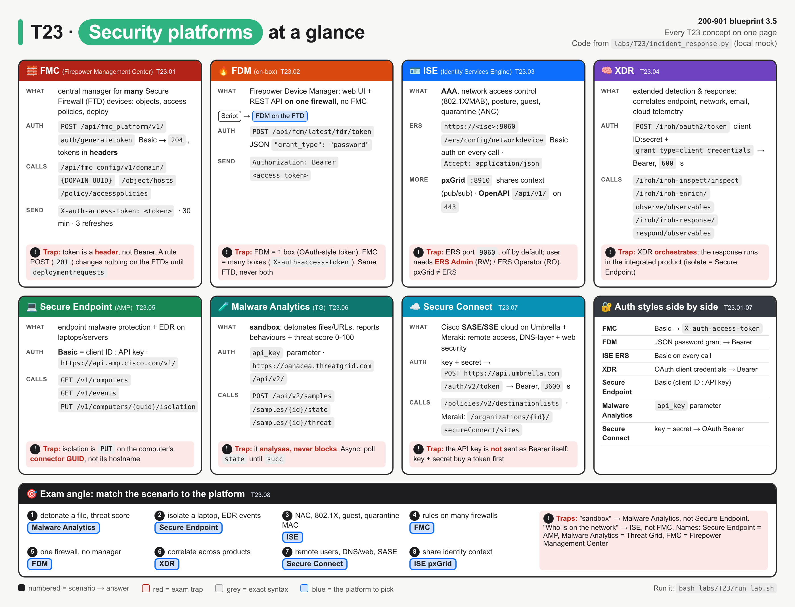
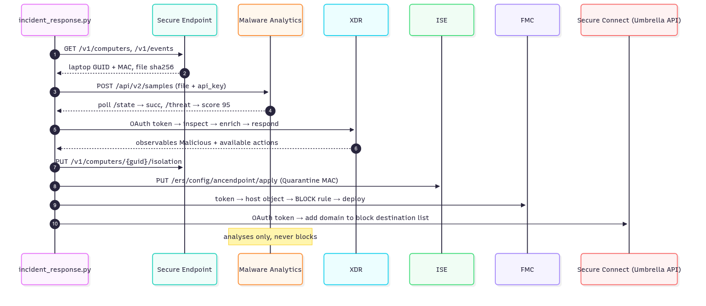
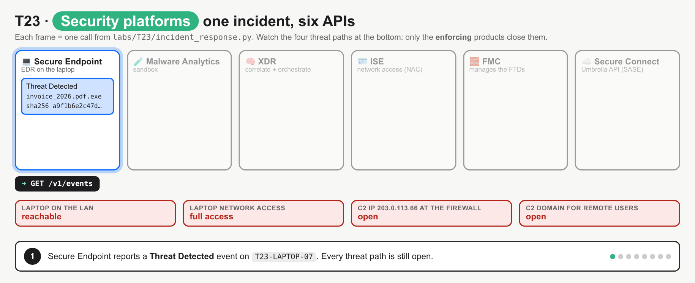
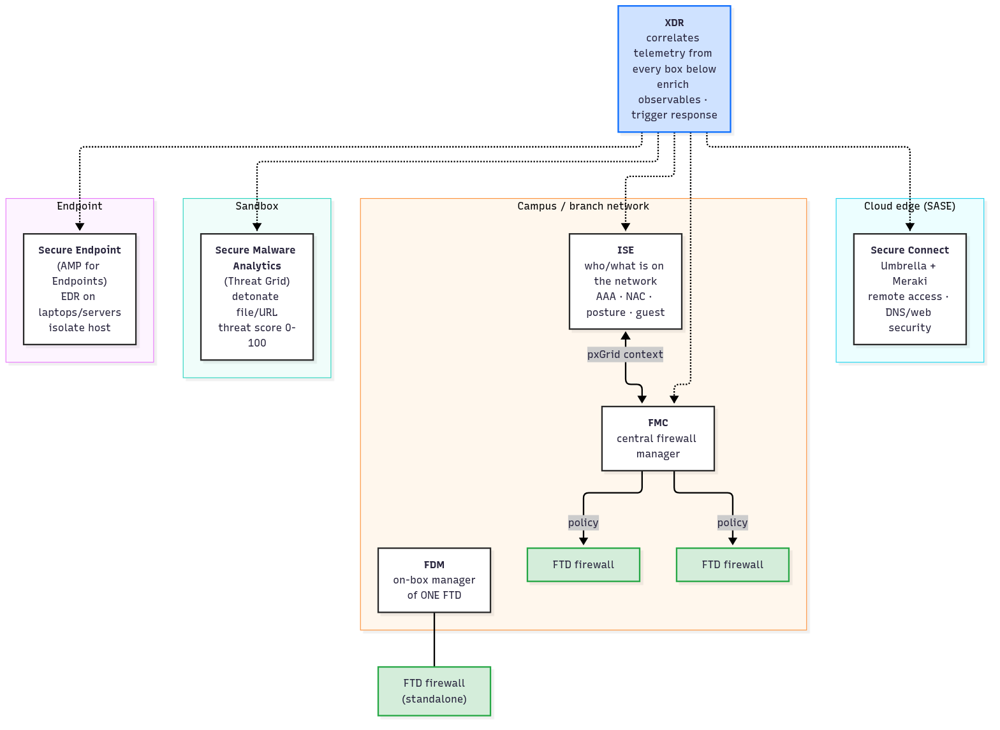
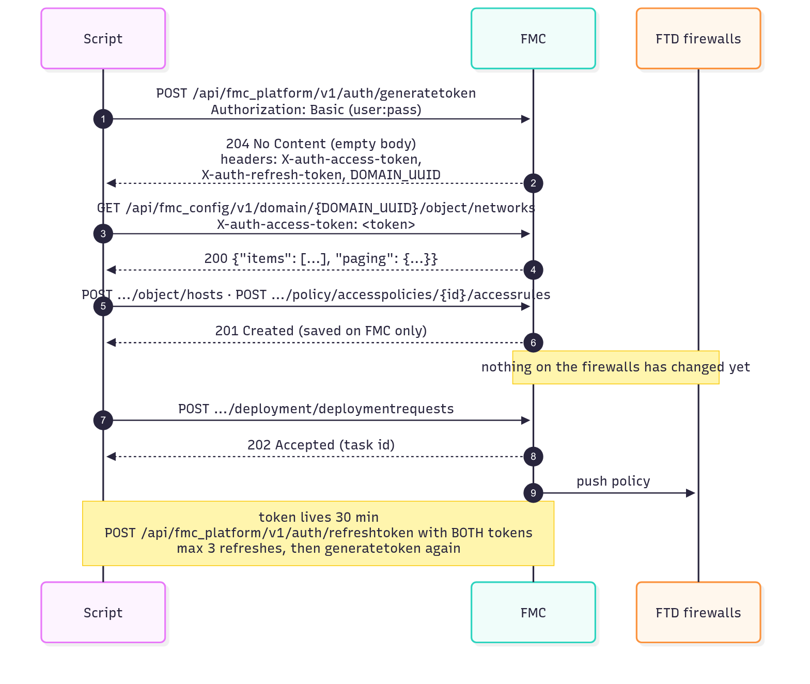
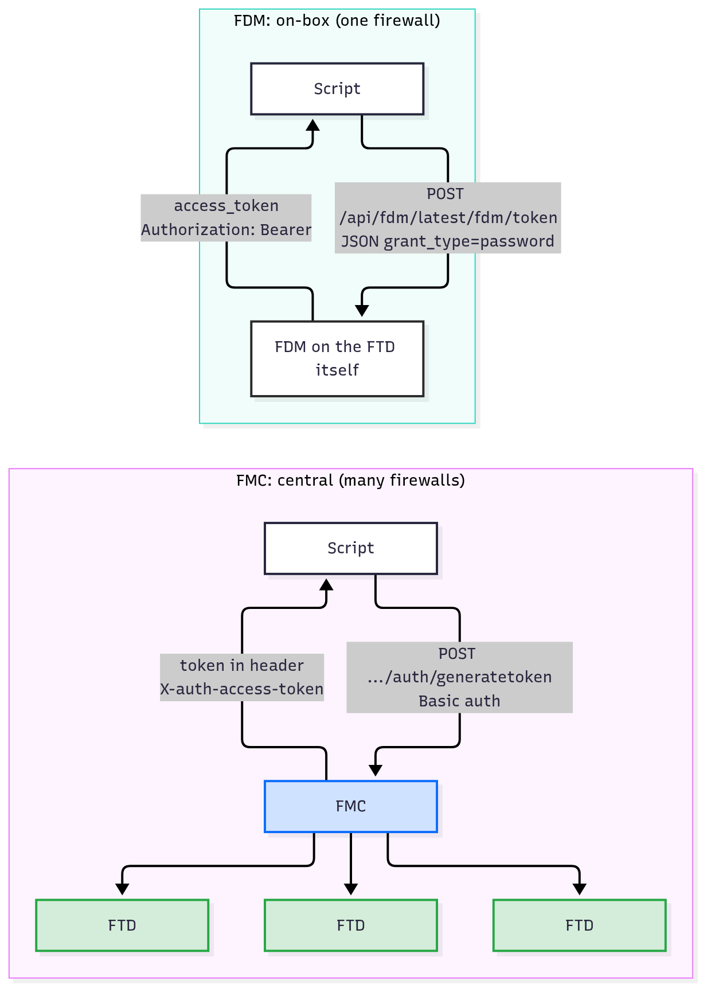
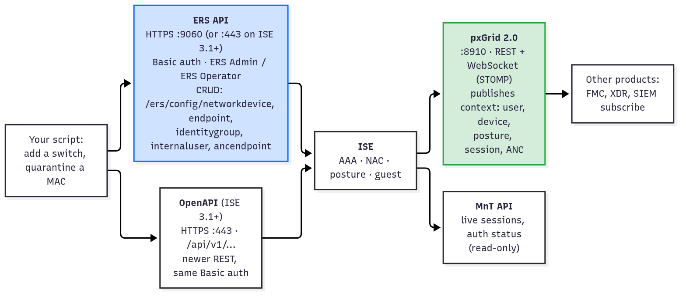
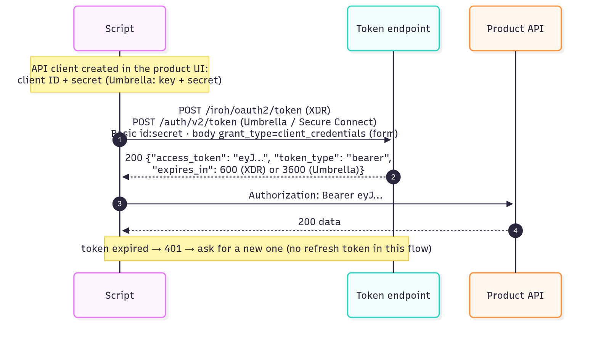
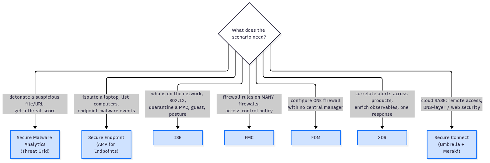

# T23 · Security platforms

> Owner: **Bob** · Blueprint: **3.5** · CBT coverage: **Partial** · Learn by 2026-10-17 · Teach-back 2026-10-20



*One card per platform, all with the same parts (what · auth · calls · trap) so the differences pop. The dark card compares the auth styles; the bottom strip is the exam's "scenario → platform" mapping. Red = exam traps, grey = exact syntax.*

## TL;DR (teach-back card)

- **Know the job of each box.** FMC = central manager for many firewalls; FDM = on-box manager for one firewall; ISE = who/what is on the network (AAA, NAC, posture, guest); Secure Endpoint (AMP) = EDR on the laptop; Secure Malware Analytics (Threat Grid) = sandbox that detonates files and returns a threat score; XDR = correlates telemetry from all of them and triggers responses; Secure Connect = cloud SASE (Umbrella + Meraki) for remote users and DNS/web security.
- **Know how each one authenticates.** FMC: `POST /api/fmc_platform/v1/auth/generatetoken` with Basic auth → `204`, tokens come back in **response headers** (`X-auth-access-token`, `X-auth-refresh-token`, `DOMAIN_UUID`), and you send `X-auth-access-token` on every call. ISE ERS: Basic auth on every call, port `9060`. Secure Endpoint: Basic with client ID + API key. Malware Analytics: `api_key` parameter. XDR and Secure Connect/Umbrella: OAuth client credentials → Bearer token. FDM: JSON password grant → Bearer.
- **Know the FMC URL shape:** `/api/fmc_config/v1/domain/{DOMAIN_UUID}/object/...` and `/policy/accesspolicies/{id}/accessrules`. A change returns `201`, but the firewalls don't change until you `POST .../deployment/deploymentrequests`.
- **Trap:** the analysers don't enforce. Malware Analytics only analyses, and XDR only correlates and orchestrates. The block happens in the enforcing product: Secure Endpoint isolates the host, ISE quarantines the MAC, FMC/FTD blocks the IP, Umbrella/Secure Connect blocks the domain.

## Concepts

All eight concepts are covered by **one incident**, run end to end by one script.

- `labs/T23/incident_response.py` is the **reference program**. Secure Endpoint flags a file on a branch laptop. The script then detonates the file, enriches the indicators in XDR, isolates the laptop, quarantines its MAC in ISE, blocks the C2 IP on the FMC-managed firewalls, and blocks the C2 domain in Secure Connect (Umbrella). It finishes with an FDM login and three deliberate `401`s.
- `labs/T23/mock_security.py` is a local mock (stdlib only) with one port per product. Its paths, headers and response shapes follow the Cisco docs listed in Sources. The DevNet always-on FMC and ISE sandboxes now hand out per-user credentials, so the program wasn't run against them (see To verify).
- Run it: `bash labs/T23/run_lab.sh` starts the mock, runs the program and stops the mock. To point it at real products, set `FMC_URL`, `ISE_URL`, `SE_URL`, … and the credential env vars listed at the top of the file.



*Read top to bottom: discover (1–2), analyse (3–6), then the four enforcing calls (7–10). Malware Analytics and XDR never block anything themselves.*

**`labs/T23/incident_response.py`**

```python
"""T23 reference program: one malware incident, handled through every Cisco security API.

Story: Secure Endpoint flags a file on a branch laptop. The script
  1. Secure Endpoint   finds the laptop and the detection        (Basic auth: client ID + API key)
  2. Malware Analytics detonates the file, gets a threat score    (api_key parameter)
  3. XDR               pulls observables out of text, enriches them, lists response actions (OAuth client credentials)
  4. Secure Endpoint   isolates the laptop                         (PUT .../isolation)
  5. ISE ERS           finds the endpoint by MAC, applies ANC Quarantine (Basic auth, port 9060)
  6. FMC               token -> host object for the C2 IP -> block rule -> deploy (X-auth-access-token)
  7. Secure Connect    blocks the C2 domain via the Umbrella API   (key + secret -> OAuth bearer token)
  8. FDM               on-box manager of ONE firewall: password-grant token
  9. errors            401s from a missing token / wrong credentials

Every base URL and credential comes from an env var. The defaults point at the local mock:
    python3 labs/T23/mock_security.py &      # or: bash labs/T23/run_lab.sh
    python3 labs/T23/incident_response.py
"""
import os
import time
from urllib.parse import urlsplit

import requests
import urllib3

urllib3.disable_warnings()                          # lab boxes use self-signed certs
env = os.environ.get
FMC = env("FMC_URL", "http://127.0.0.1:9401")
FDM = env("FDM_URL", "http://127.0.0.1:9402")
ISE = env("ISE_URL", "http://127.0.0.1:9060")       # real ISE: https://<ise>:9060 (or :443 on ISE 3.1+)
XDR = env("XDR_URL", "http://127.0.0.1:9404")       # real: https://visibility.amp.cisco.com
SE = env("SE_URL", "http://127.0.0.1:9405")         # real: https://api.amp.cisco.com
SMA = env("SMA_URL", "http://127.0.0.1:9406")       # real: https://panacea.threatgrid.com
UMB = env("UMB_URL", "http://127.0.0.1:9407")       # real: https://api.umbrella.com
SE_AUTH = (env("SE_CLIENT_ID", "t23-se-client-id"), env("SE_API_KEY", "T23-se-api-key"))
SMA_KEY = env("SMA_API_KEY", "t23-sma-api-key")
XDR_AUTH = (env("XDR_CLIENT_ID", "client-t23-xdr"), env("XDR_CLIENT_SECRET", "T23-xdr-secret"))
ISE_AUTH = (env("ISE_USER", "ersadmin"), env("ISE_PASS", "T23-ise-pass"))
FMC_AUTH = (env("FMC_USER", "apiuser"), env("FMC_PASS", "T23-fmc-pass"))
UMB_AUTH = (env("UMB_KEY", "t23-umbrella-key"), env("UMB_SECRET", "T23-umbrella-secret"))
FDM_USER, FDM_PASS = env("FDM_USER", "admin"), env("FDM_PASS", "T23-fdm-pass")
JSON = {"Accept": "application/json", "Content-Type": "application/json"}


def oauth_client_credentials(token_url, client_auth):
    """XDR, Umbrella/Secure Connect (and Secure Endpoint v3): POST id:secret as Basic -> bearer token."""
    resp = requests.post(token_url, auth=client_auth, data={"grant_type": "client_credentials"},
                         headers={"Accept": "application/json"}, verify=False, timeout=30)
    resp.raise_for_status()
    tok = resp.json()
    print(f"POST {urlsplit(token_url).path} -> {resp.status_code}, "
          f"{tok['token_type']} token, expires_in={tok['expires_in']}")
    return {"Authorization": f"Bearer {tok['access_token']}", **JSON}


def secure_endpoint_find(hostname):
    comp = requests.get(f"{SE}/v1/computers", params={"hostname": hostname},
                        auth=SE_AUTH, verify=False, timeout=30).json()["data"][0]
    print(f"GET /v1/computers?hostname={hostname} -> guid={comp['connector_guid'][:8]}... "
          f"mac={comp['network_addresses'][0]['mac']} isolation={comp['isolation']['status']}")
    event = requests.get(f"{SE}/v1/events", params={"connector_guid[]": comp["connector_guid"]},
                         auth=SE_AUTH, verify=False, timeout=30).json()["data"][0]
    print(f"GET /v1/events -> {event['event_type']}: {event['file']['file_name']} "
          f"sha256={event['file']['identity']['sha256'][:12]}...")
    return comp, event


def malware_analytics_detonate(filename, content):
    resp = requests.post(f"{SMA}/api/v2/samples", files={"sample": (filename, content)},
                         data={"api_key": SMA_KEY, "private": "true"}, verify=False, timeout=60)
    sample = resp.json()["data"]
    print(f"POST /api/v2/samples -> {resp.status_code}, id={sample['id'][:8]}... state={sample['state']}")
    while True:                                     # analysis is asynchronous: poll the state
        st = requests.get(f"{SMA}/api/v2/samples/{sample['id']}/state", params={"api_key": SMA_KEY},
                          verify=False, timeout=30).json()["data"]["state"]
        print(f"GET  .../state -> {st}")
        if st == "succ":
            break
        time.sleep(float(env("SMA_POLL_SECONDS", "0.2")))
    threat = requests.get(f"{SMA}/api/v2/samples/{sample['id']}/threat", params={"api_key": SMA_KEY},
                          verify=False, timeout=30).json()["data"]
    print(f"GET  .../threat -> score={threat['score']}/100, behaviours={threat['bis']}")
    return threat["score"]


def xdr_investigate(text):
    hdrs = oauth_client_credentials(f"{XDR}/iroh/oauth2/token", XDR_AUTH)
    observables = requests.post(f"{XDR}/iroh/iroh-inspect/inspect", json={"content": text},
                                headers=hdrs, verify=False, timeout=30).json()
    print(f"POST /iroh/iroh-inspect/inspect -> {[o['type'] for o in observables]}")
    enrich = requests.post(f"{XDR}/iroh/iroh-enrich/observe/observables", json=observables,
                           headers=hdrs, verify=False, timeout=30).json()["data"]
    for module in enrich:
        verdicts = module["data"].get("verdicts", {}).get("docs", [])
        print(f"    enrich {module['module']:<25} " + (", ".join(
            f"{v['observable']['type']}={v['disposition_name']}" for v in verdicts) or "sightings=1"))
    actions = requests.post(f"{XDR}/iroh/iroh-response/respond/observables", json=observables[:1],
                            headers=hdrs, verify=False, timeout=30).json()["data"]
    print(f"POST /iroh/iroh-response/respond/observables -> {[a['title'] for a in actions]}")
    return observables


def secure_endpoint_isolate(guid):
    resp = requests.put(f"{SE}/v1/computers/{guid}/isolation", auth=SE_AUTH, verify=False, timeout=30)
    print(f"PUT /v1/computers/<guid>/isolation -> {resp.status_code}, status={resp.json()['data']['status']}")


def ise_quarantine(mac):
    ers = f"{ISE}/ers/config"
    found = requests.get(f"{ers}/endpoint", params={"filter": f"mac.EQ.{mac}"}, auth=ISE_AUTH,
                         headers=JSON, verify=False, timeout=30).json()["SearchResult"]
    print(f"GET /ers/config/endpoint?filter=mac.EQ.{mac} -> total={found['total']}")
    body = {"OperationAdditionalData": {"additionalData": [
        {"name": "macAddress", "value": mac}, {"name": "policyName", "value": "Quarantine"}]}}
    resp = requests.put(f"{ers}/ancendpoint/apply", json=body, auth=ISE_AUTH, headers=JSON,
                        verify=False, timeout=30)
    print(f"PUT /ers/config/ancendpoint/apply -> {resp.status_code} (ANC policy Quarantine)")
    nads = requests.get(f"{ers}/networkdevice", auth=ISE_AUTH, headers=JSON,
                        verify=False, timeout=30).json()["SearchResult"]
    print(f"GET /ers/config/networkdevice -> {[r['name'] for r in nads['resources']]}")


def fmc_block(ip):
    resp = requests.post(f"{FMC}/api/fmc_platform/v1/auth/generatetoken", auth=FMC_AUTH,
                         verify=False, timeout=30)
    print(f"POST /api/fmc_platform/v1/auth/generatetoken -> {resp.status_code} (empty body, tokens in headers)")
    token, refresh = resp.headers["X-auth-access-token"], resp.headers["X-auth-refresh-token"]
    domain = resp.headers["DOMAIN_UUID"]
    print(f"    X-auth-access-token={token[:8]}...  DOMAIN_UUID={domain}")
    resp = requests.post(f"{FMC}/api/fmc_platform/v1/auth/refreshtoken", verify=False, timeout=30,
                         headers={"X-auth-access-token": token, "X-auth-refresh-token": refresh})
    print(f"POST /api/fmc_platform/v1/auth/refreshtoken -> {resp.status_code} (refresh 1 of 3)")
    hdrs = {"X-auth-access-token": resp.headers["X-auth-access-token"], **JSON}
    base = f"{FMC}/api/fmc_config/v1/domain/{domain}"

    nets = requests.get(f"{base}/object/networks", params={"offset": 0, "limit": 2}, headers=hdrs,
                        verify=False, timeout=30).json()
    print(f"GET .../object/networks?offset=0&limit=2 -> {[o['name'] for o in nets['items']]} "
          f"paging={nets['paging']}")
    host = requests.post(f"{base}/object/hosts", headers=hdrs, verify=False, timeout=30,
                         json={"type": "Host", "name": "T23-C2-server", "value": ip}).json()
    print(f"POST .../object/hosts -> id={host['id'][:8]}... name={host['name']} value={host['value']}")
    acp = requests.get(f"{base}/policy/accesspolicies", headers=hdrs, verify=False, timeout=30).json()["items"][0]
    rule = {"name": "T23-block-C2", "action": "BLOCK", "enabled": True,
            "destinationNetworks": {"objects": [{"type": "Host", "id": host["id"]}]}}
    resp = requests.post(f"{base}/policy/accesspolicies/{acp['id']}/accessrules", json=rule,
                         headers=hdrs, verify=False, timeout=30)
    print(f"POST .../policy/accesspolicies/<{acp['name']}>/accessrules -> {resp.status_code}, "
          f"action={resp.json()['action']}")
    dev = requests.get(f"{base}/deployment/deployabledevices", params={"expanded": "true"}, headers=hdrs,
                       verify=False, timeout=30).json()["items"][0]
    resp = requests.post(f"{base}/deployment/deploymentrequests", headers=hdrs, verify=False, timeout=30,
                         json={"type": "DeploymentRequest", "version": dev["version"], "forceDeploy": False,
                               "ignoreWarning": True, "deviceList": [dev["device"]["id"]]})
    print(f"POST .../deployment/deploymentrequests -> {resp.status_code}, "
          f"task {resp.json()['metadata']['task']['status']} to {dev['name']}")


def secure_connect_block(domain):
    hdrs = oauth_client_credentials(f"{UMB}/auth/v2/token", UMB_AUTH)
    dl = requests.get(f"{UMB}/policies/v2/destinationlists", headers=hdrs,
                      verify=False, timeout=30).json()["data"][0]
    resp = requests.post(f"{UMB}/policies/v2/destinationlists/{dl['id']}/destinations", headers=hdrs,
                         json=[{"destination": domain, "comment": "T23 incident"}], verify=False, timeout=30)
    print(f"POST /policies/v2/destinationlists/{dl['id']}/destinations -> {resp.status_code}, "
          f"'{dl['name']}' ({dl['access']}) now has {resp.json()['data']['meta']['destinationCount']} entry")


def fdm_awareness():
    resp = requests.post(f"{FDM}/api/fdm/latest/fdm/token", headers=JSON, verify=False, timeout=30,
                         json={"grant_type": "password", "username": FDM_USER, "password": FDM_PASS})
    tok = resp.json()
    print(f"POST /api/fdm/latest/fdm/token -> {resp.status_code}, {tok['token_type']}, "
          f"expires_in={tok['expires_in']}")
    nets = requests.get(f"{FDM}/api/fdm/latest/object/networks", verify=False, timeout=30,
                        headers={"Authorization": f"Bearer {tok['access_token']}", **JSON}).json()
    print(f"GET /api/fdm/latest/object/networks -> {[(n['name'], n['value']) for n in nets['items']]}")


def errors():
    checks = [
        ("FMC, no token", "GET", f"{FMC}/api/fmc_config/v1/domain/x/object/networks", {}),
        ("ISE, bad password", "GET", f"{ISE}/ers/config/networkdevice", {"auth": ("ersadmin", "wrong")}),
        ("SE, bad API key", "GET", f"{SE}/v1/computers", {"auth": ("t23-se-client-id", "wrong")}),
    ]
    for label, method, url, kw in checks:
        resp = requests.request(method, url, headers=JSON, verify=False, timeout=30, **kw)
        print(f"{label:<18} -> {resp.status_code}")


def main():
    print("== 1. Secure Endpoint: which laptop, which file? ==")
    comp, event = secure_endpoint_find("T23-LAPTOP-07")
    print("\n== 2. Secure Malware Analytics: detonate the file in the sandbox ==")
    score = malware_analytics_detonate(event["file"]["file_name"], b"T23 harmless test bytes\n")
    print("\n== 3. XDR: extract observables, enrich them, list response actions ==")
    note = f"EDR alert on {comp['hostname']}: sha256 {event['file']['identity']['sha256']} beacons to " \
           f"203.0.113.66 and update-checker.example"
    xdr_investigate(note)
    if score >= 90:
        print("\n== 4. Secure Endpoint: isolate the laptop ==")
        secure_endpoint_isolate(comp["connector_guid"])
        print("\n== 5. ISE: quarantine the endpoint on the network (ANC) ==")
        ise_quarantine(comp["network_addresses"][0]["mac"].upper())
        print("\n== 6. FMC: block the C2 IP on every managed firewall ==")
        fmc_block("203.0.113.66")
        print("\n== 7. Secure Connect (Umbrella API): block the C2 domain for remote users ==")
        secure_connect_block("update-checker.example")
    print("\n== 8. FDM (awareness): one firewall, its own on-box API ==")
    fdm_awareness()
    print("\n== 9. Errors ==")
    errors()


if __name__ == "__main__":
    main()
```

**Output** (`bash labs/T23/run_lab.sh`, local mock, 10 Oct 2026):

```
== 1. Secure Endpoint: which laptop, which file? ==
GET /v1/computers?hostname=T23-LAPTOP-07 -> guid=6b8e0c2a... mac=00:50:56:a1:23:23 isolation=not_isolated
GET /v1/events -> Threat Detected: invoice_2026.pdf.exe sha256=a9f1b6e2c47d...

== 2. Secure Malware Analytics: detonate the file in the sandbox ==
POST /api/v2/samples -> 200, id=654b40c2... state=wait
GET  .../state -> run
GET  .../state -> succ
GET  .../threat -> score=95/100, behaviours=['malware-known-trojan-av', 'network-communications-http-get-url', 'registry-autorun-key-modified']

== 3. XDR: extract observables, enrich them, list response actions ==
POST /iroh/oauth2/token -> 200, bearer token, expires_in=600
POST /iroh/iroh-inspect/inspect -> ['sha256', 'ip', 'domain']
    enrich Secure Malware Analytics  sha256=Malicious, ip=Malicious, domain=Malicious
    enrich Secure Endpoint           sightings=1
POST /iroh/iroh-response/respond/observables -> ['Add SHA256 to File List', 'Isolate Host', 'Block this domain']

== 4. Secure Endpoint: isolate the laptop ==
PUT /v1/computers/<guid>/isolation -> 200, status=pending_start

== 5. ISE: quarantine the endpoint on the network (ANC) ==
GET /ers/config/endpoint?filter=mac.EQ.00:50:56:A1:23:23 -> total=1
PUT /ers/config/ancendpoint/apply -> 204 (ANC policy Quarantine)
GET /ers/config/networkdevice -> ['T23-BR1-C9300', 'T23-BR1-WLC']

== 6. FMC: block the C2 IP on every managed firewall ==
POST /api/fmc_platform/v1/auth/generatetoken -> 204 (empty body, tokens in headers)
    X-auth-access-token=6672fb02...  DOMAIN_UUID=e276abec-e0f2-11e3-8169-6d9ed49b625f
POST /api/fmc_platform/v1/auth/refreshtoken -> 204 (refresh 1 of 3)
GET .../object/networks?offset=0&limit=2 -> ['any-ipv4', 'IPv4-Private-10.0.0.0-8'] paging={'offset': 0, 'limit': 2, 'count': 4, 'pages': 2}
POST .../object/hosts -> id=D3B7834A... name=T23-C2-server value=203.0.113.66
POST .../policy/accesspolicies/<T23-Branch-ACP>/accessrules -> 201, action=BLOCK
POST .../deployment/deploymentrequests -> 202, task Deploying to T23-BR1-FTD

== 7. Secure Connect (Umbrella API): block the C2 domain for remote users ==
POST /auth/v2/token -> 200, bearer token, expires_in=3600
POST /policies/v2/destinationlists/15755711/destinations -> 200, 'T23 Block List' (block) now has 1 entry

== 8. FDM (awareness): one firewall, its own on-box API ==
POST /api/fdm/latest/fdm/token -> 200, Bearer, expires_in=1800
GET /api/fdm/latest/object/networks -> [('any-ipv4', '0.0.0.0/0'), ('OutsideIPv4Gateway', '198.51.100.1')]

== 9. Errors ==
FMC, no token      -> 401
ISE, bad password  -> 401
SE, bad API key    -> 401
```

- The sample ID, FMC token and host object ID are new random UUIDs on every run.



*Steps: SE detection → Malware Analytics score 95 → XDR enrich → SE isolate → ISE quarantine → FMC rule (`201`, still not deployed) → FMC deploy (`202`) → Secure Connect blocks the domain. Watch the four red "threat path" boxes at the bottom. Frames 2–3 fix the misconception "the sandbox/XDR blocked it", and frame 6 fixes "an FMC rule is live as soon as the POST returns".*



*XDR (blue) sits above everything and correlates. Each box below it owns one domain: endpoint, sandbox, network/identity, firewall or cloud edge. FMC manages many FTDs; FDM manages the single FTD it runs on. ISE shares context with FMC over pxGrid.*

### T23.01 · Secure Firewall Management Center (FMC)

**Must cover:**

- [x] Central manager for Firepower/Secure Firewall devices
- [x] Token: POST /api/fmc_platform/v1/auth/generatetoken with basic auth → X-auth-access-token and X-auth-refresh-token response headers + DOMAIN_UUID
- [x] Config calls: /api/fmc_config/v1/domain/{domainUUID}/object/..., /policy/accesspolicies/...
- [x] Token sent in the X-auth-access-token header

**Notes:**

- **FMC** = Secure Firewall Management Center (Firepower Management Center). It's the **central manager** for Secure Firewall Threat Defense (FTD) devices.
  - You build objects (hosts, networks, ports), access control policies, NAT and VPN on the FMC. FMC then **deploys** them to every managed FTD.
  - The firewalls enforce the policy; FMC stores it and pushes it out. Compare it with ACI: like APIC, FMC isn't in the data path ([T19](T19-aci.md)).
- **Token flow** (`fmc_block()` in the program):
  1. `POST https://<fmc>/api/fmc_platform/v1/auth/generatetoken` with `Authorization: Basic` (username:password). No JSON body.
  2. The reply is **`204 No Content`**, with an empty body. Everything useful is in the **response headers**:
     - `X-auth-access-token`: send this on every later call
     - `X-auth-refresh-token`: used only to refresh
     - `DOMAIN_UUID`: goes into every config URL (also `DOMAINS`, a JSON list of all the domains you can use)
  3. Send `X-auth-access-token: <token>` as a request header on every call. It's **not** `Authorization: Bearer` (break-it edit 2 → `401`).
  4. Tokens live **30 minutes**. `POST /api/fmc_platform/v1/auth/refreshtoken` with **both** tokens in the headers gives a new pair. You can refresh **3 times**, then you must call `generatetoken` again (Example 3 shows refresh 4 → `401`).
- **Two API families**, split by path:

| Path prefix | Holds | Example |
|---|---|---|
| `/api/fmc_platform/v1/` | platform services: auth, server info | `/auth/generatetoken`, `/auth/refreshtoken` |
| `/api/fmc_config/v1/domain/{DOMAIN_UUID}/` | configuration, per domain | `/object/networks`, `/object/hosts`, `/policy/accesspolicies`, `/devices/devicerecords`, `/deployment/deploymentrequests` |

- **Calls in the program:**
  - `GET .../object/networks?offset=0&limit=2` returns `{"items": [...], "paging": {"offset", "limit", "count", "pages"}}`. Page with `offset` and `limit`. Add `expanded=true` to get full objects instead of just name and ID.
  - `POST .../object/hosts` with `{"type": "Host", "name": "T23-C2-server", "value": "203.0.113.66"}` → `201` + the object with its new `id`.
  - `POST .../policy/accesspolicies/{policyId}/accessrules` with `"action": "BLOCK"` and the host as `destinationNetworks` → `201`.
  - `GET .../deployment/deployabledevices` then `POST .../deployment/deploymentrequests` with that `version` and the device IDs → `202` + a task.
- **Saved ≠ deployed.** After the `201`, the rule exists only on FMC. The FTDs still pass the traffic until the deployment runs (GIF frame 6 → 7).
- **Rate limit:** at most 120 requests per minute and 10 simultaneous connections per source IP. Over the limit → `429`. Payload limit about 2 MB.



*Tokens arrive in headers on a `204`. Config changes return `201` but sit on the FMC (yellow note) until the deploy request (step 7) pushes them to the firewalls.*

### T23.02 · FDM (awareness)

**Must cover:**

- [x] Firepower Device Manager: on-box manager for a single firewall, with its own REST API (OAuth-style tokens)

**Notes:**

- **FDM** = Firepower Device Manager. A web UI and REST API **built into one FTD**, for small sites with no FMC. One FTD is managed **either** by FDM (local) **or** by FMC (central), never both at once.
- The API is called the "FTD REST API". It lives on the firewall itself: `https://<ftd>/api/fdm/latest/...` (`latest` or a version such as `v6`).
- **OAuth-style token** (`fdm_awareness()`):
  - `POST /api/fdm/latest/fdm/token` with a **JSON** body: `{"grant_type": "password", "username": "admin", "password": "..."}`
  - The reply is a JSON body: `access_token`, `refresh_token`, `expires_in`, `token_type: "Bearer"`
  - Send `Authorization: Bearer <access_token>` on every call
  - Refresh with `grant_type: "refresh_token"`. `grant_type: "custom_token"` creates longer-lived tokens for integrations.
- Like FMC, a change on FDM is staged until you deploy it (`POST /api/fdm/latest/operational/deploy`).



*FMC (blue): one manager, many FTDs, token in `X-auth-access-token`. FDM: the API runs on the firewall it manages, with a standard Bearer token.*

| | FMC | FDM |
|---|---|---|
| Manages | many FTDs | the one FTD it runs on |
| Token call | `POST /api/fmc_platform/v1/auth/generatetoken` (Basic) | `POST /api/fdm/latest/fdm/token` (JSON password grant) |
| Token arrives in | response **headers** (`204`, no body) | JSON **body** |
| Send it as | `X-auth-access-token: <token>` | `Authorization: Bearer <token>` |
| Domain in path | yes, `/domain/{DOMAIN_UUID}/` | no |

### T23.03 · ISE

**Must cover:**

- [x] Identity Services Engine: AAA, network access control, posture, guest
- [x] ERS API (REST, HTTPS port 9060, basic auth) for endpoints, identity groups, network devices: /ers/config/...
- [x] pxGrid shares context (user, device, posture) with other systems; newer OpenAPI

**Notes:**

- **ISE** = Identity Services Engine. It answers "**who** and **what** is on the network, and what may it reach?". In Bob's terms, it's the RADIUS/TACACS+ server behind 802.1X and MAB on the switches and WLCs.
  - **AAA**: RADIUS for network access, TACACS+ for device admin
  - **NAC**: 802.1X / MAB; the authorisation result is a VLAN, dACL or SGT
  - **Posture**: is the laptop patched, with AV running? (Secure Client agent)
  - **Guest**: sponsor and self-registration portals
  - **ANC** (Adaptive Network Control): quarantine or shut an endpoint on demand. The program uses this.
- **ERS** = External RESTful Services, the classic CRUD config API (`ise_quarantine()`):
  - `https://<ise>:9060/ers/config/<resource>`. Port **9060**; ISE 3.1+ also serves ERS on `443` through its API gateway.
  - **Basic auth on every call**: there's no token. The user must be in the **ERS Admin** group (read/write) or **ERS Operator** (read-only).
  - ERS is **off by default**. Enable it under *Administration > System > Settings > API Settings*.
  - Send `Accept: application/json` (and `Content-Type: application/json` on writes). Otherwise ERS answers in XML, and `.json()` crashes (break-it edit 3).
  - Resources: `networkdevice` (NADs: switches, WLCs), `endpoint` (MACs), `identitygroup`, `endpointgroup`, `internaluser`, `ancendpoint`, `guestuser`…
  - A list returns `{"SearchResult": {"total": n, "resources": [{"id", "name", "link"}]}}`; a GET by ID returns the full object. Filter with `?filter=mac.EQ.00:50:56:A1:23:23`.
  - Quarantine: `PUT /ers/config/ancendpoint/apply` with `macAddress` + `policyName` → `204`.
- **OpenAPI** (ISE 3.1+): a newer REST API at `https://<ise>/api/v1/...` on 443, with the same Basic auth. It covers the newer features (policy sets, certificates, backups…).
- **pxGrid** (Platform Exchange Grid) is for **context sharing**, not CRUD:
  - ISE publishes live context: user, device, posture, session, SGT, ANC state.
  - Other products (FMC, XDR, SIEMs, partner tools) subscribe to it, e.g. FMC writes rules by **user/group** instead of IP.
  - pxGrid 2.0 = REST (control and queries) + WebSocket with STOMP (pushed events), on port **8910**, with client-certificate or approved-account auth.
- **MnT** (monitoring) API: read-only live sessions and authentication status.



*Blue = ERS, the one the exam names: port 9060, Basic auth, CRUD. Green = pxGrid: ISE **pushes** context to other products. OpenAPI is the newer CRUD API on 443.*

### T23.04 · XDR

**Must cover:**

- [x] Extended detection and response: correlates telemetry from endpoint, network, email and cloud
- [x] APIs (OAuth client credentials) to enrich observables and respond (e.g. block, isolate)

**Notes:**

- **XDR** = eXtended Detection and Response. EDR looks at endpoints only. XDR **pulls telemetry from many products** (Secure Endpoint, firewalls, email, Umbrella, ISE, third-party), correlates it into one incident, and lets you **respond** from one place.
- The API is called **IROH** (from the old SecureX/Threat Response). Base URL `https://visibility.amp.cisco.com` (NA); EU and APJC have their own hosts.
- **Auth = OAuth 2.0 client credentials** (`oauth_client_credentials()`):
  1. Create an API client in the XDR UI → **client ID + client password**, with scopes such as `enrich`, `inspect`, `response`.
  2. `POST /iroh/oauth2/token`: Basic auth with `client_id:client_password`, form body `grant_type=client_credentials`, `Content-Type: application/x-www-form-urlencoded`.
  3. The reply is `{"access_token": "eyJ...", "token_type": "bearer", "expires_in": 600}`. Send `Authorization: Bearer <token>`. It lasts **10 minutes**; get a new one when it expires.
- **Observables** = indicators such as `{"type": "sha256", "value": "..."}`, `ip`, `domain`, `url`.
  - `POST /iroh/iroh-inspect/inspect` with `{"content": "<free text>"}` → finds the observables in the text
  - `POST /iroh/iroh-enrich/observe/observables` with the list of observables → verdicts and sightings from each integrated module
  - `POST /iroh/iroh-response/respond/observables` → the **response actions** available (isolate host, block domain, add to file list…). Triggering one runs it **in the integrated product**.
- Break-it edit 4: sending the token request as JSON instead of a form body → `400`.



*Same flow on both platforms: ID + secret go in as Basic auth on the token call, and only the short-lived Bearer token goes to the API. There's no refresh token; ask again when it expires.*

### T23.05 · Secure Endpoint

**Must cover:**

- [x] Formerly AMP for Endpoints: endpoint malware protection, EDR
- [x] API with client ID + API key (basic auth): list computers, events, isolate endpoints

**Notes:**

- **Secure Endpoint** (AMP for Endpoints) is an agent ("connector") on Windows/macOS/Linux/mobile. It does malware prevention (file reputation, exploit prevention) plus **EDR**: it records activity, finds threats and isolates hosts.
- **API v1**: `https://api.amp.cisco.com/v1/` (NA; EU = `api.eu.amp.cisco.com`, APJC = `api.apjc.amp.cisco.com`).
  - Credentials: **3rd Party API Client ID + API key**, generated once in the console.
  - **Basic auth**: the client ID is the username and the API key is the password (`auth=SE_AUTH` in the program). Wrong key → `401` "Unknown API key or Client ID".
  - The newer **v3** API uses an OAuth bearer token from Cisco XDR / Secure Client instead.
- Calls in `secure_endpoint_find()` / `secure_endpoint_isolate()`:
  - `GET /v1/computers?hostname=...` → `connector_guid`, IPs, MACs, `isolation.status`
  - `GET /v1/events?connector_guid[]=...` → events such as `Threat Detected`, with the file's SHA-256
  - `PUT /v1/computers/{connector_guid}/isolation` → starts **isolation** (`status: pending_start`). `DELETE` on the same URL stops it.
- Every reply uses one envelope: `{"version", "metadata": {"results": {"total", ...}, "links"}, "data": ..., "errors": []}`. Pages are 500 items; use `offset`.
- Rate-limit headers: `X-RateLimit-Limit`, `X-RateLimit-Remaining`, `X-RateLimit-Reset`. Over the limit → `429`.

### T23.06 · Secure Malware Analytics

**Must cover:**

- [x] Formerly Threat Grid: sandbox that detonates files/URLs and reports behaviour
- [x] API key: submit samples, get analysis reports and threat scores

**Notes:**

- **Secure Malware Analytics** (Threat Grid) is a **sandbox**. It runs ("detonates") a suspicious file or URL in an instrumented VM and watches what it does: files dropped, registry keys, network calls.
  - The output: **behavioural indicators** (BIs), observables (domains, IPs, hashes) and a **threat score 0–100**.
  - It's available as a cloud service or an on-prem appliance. Secure Endpoint, FMC, email and web security can submit files to it automatically.
- **API**: `https://panacea.threatgrid.com/api/v2/` (cloud), with **`api_key`** (from the account page) sent as a parameter or form field. v3 adds curated feeds.
- `malware_analytics_detonate()`:
  1. `POST /api/v2/samples`, multipart form: `sample=@file`, `api_key`, optional `vm` and `private`. The reply holds the sample `id` and `state: "wait"`.
  2. Analysis is **asynchronous**. Poll `GET /api/v2/samples/{id}/state` until `succ`.
  3. `GET /api/v2/samples/{id}/threat` → `score` (95 here) and the triggered behaviours.
- Feeds for threat intel: `/api/v2/iocs/feeds/domains`, `/api/v2/samples/feeds/...` and the curated `/api/v3/feeds/<name>.json`.
- **Analyses, never enforces.** A score of 95 blocks nothing. A product such as Secure Endpoint, FMC or Umbrella has to act on it.

### T23.07 · Secure Connect

**Must cover:**

- [x] Cisco SASE/SSE cloud security service (built on Umbrella and Meraki): secure remote access, DNS-layer and web security
- [x] APIs use key/secret to get an OAuth token

**Notes:**

- **SASE** (Secure Access Service Edge) = networking (SD-WAN) + **SSE** (Security Service Edge: secure web gateway, CASB, ZTNA, firewall-as-a-service) delivered from the cloud.
- **Secure Connect** is Cisco's turnkey SASE. It's built on **Umbrella** (DNS-layer and web security, cloud firewall) and the **Meraki** dashboard (Meraki SD-WAN sites, management):
  - **remote access** for users (Secure Client VPN or clientless ZTNA)
  - site-to-cloud tunnels from Meraki MX, Catalyst SD-WAN or other IPsec devices
  - **DNS-layer security**: block a domain before the connection even starts; plus a secure web gateway
- **APIs: key + secret → OAuth token** (`secure_connect_block()`):
  - Create an API **key and secret** in the dashboard (Admin > API Keys).
  - `POST https://api.umbrella.com/auth/v2/token`: Basic auth `key:secret`, form `grant_type=client_credentials`. The reply is `{"access_token", "token_type": "bearer", "expires_in": 3600}`, so the token lasts **1 hour**.
  - Send `Authorization: Bearer <token>`. Example: `POST /policies/v2/destinationlists/{id}/destinations` adds a domain to a **block** destination list.
  - The Meraki side has the "Integrated API for Secure Connect" under the Meraki dashboard API: `/organizations/{orgId}/secureConnect/sites` and similar (Meraki API key as Bearer, see [T18](T18-meraki.md)).
- Same OAuth pattern as XDR (diagram above). Only the token URL and lifetime differ.

### T23.08 · Exam angle

**Must cover:**

- [x] Match platform → capability (e.g. sandboxing → Malware Analytics; NAC → ISE; firewall policy → FMC)

**Notes:**



*Pick the platform from the keyword in the question.*

| Scenario keyword | Platform | API style to remember |
|---|---|---|
| detonate / sandbox / threat score / behavioural indicators | **Secure Malware Analytics** (Threat Grid) | `api_key`, `POST /api/v2/samples` |
| isolate a host / endpoint malware / connector / EDR | **Secure Endpoint** (AMP) | Basic client ID : API key, `/v1/computers` |
| 802.1X / MAB / NAC / guest / posture / quarantine a MAC / who is on the network | **ISE** | ERS Basic auth, `:9060/ers/config/` |
| share user/device context with other products | **ISE pxGrid** | REST + WebSocket, `:8910` |
| access control policy on many firewalls / IPS / deploy | **FMC** | `X-auth-access-token`, `/api/fmc_config/v1/domain/{uuid}/` |
| one firewall, no central manager | **FDM** | password grant → Bearer |
| correlate across endpoint, network, email, cloud / enrich observables / one-click response | **XDR** | OAuth client credentials, `/iroh/` |
| remote workers / SASE / SSE / DNS-layer security / cloud web gateway | **Secure Connect** (Umbrella + Meraki) | key + secret → OAuth, `api.umbrella.com` |

- The old names still appear in questions: AMP → Secure Endpoint, Threat Grid → Secure Malware Analytics, Firepower Management Center → Secure Firewall Management Center, SecureX → XDR.
- Code questions usually test **where the token goes**: FMC = response header in, `X-auth-access-token` request header out; everything OAuth = `Authorization: Bearer`; ISE ERS and Secure Endpoint = `auth=(user, key)` on every call.

## Exam traps

- **FMC token is in the response headers, not the body.** `generatetoken` returns `204` with an empty body; `resp.json()` raises `JSONDecodeError` (break-it 1). Read `resp.headers["X-auth-access-token"]` and `resp.headers["DOMAIN_UUID"]`.
- **FMC request header is `X-auth-access-token`,** not `Authorization: Bearer` (→ `401`, break-it 2). Not `X-Auth-Token` either; that's Catalyst Center.
- **FMC lifetime:** 30 min, refresh with **both** tokens, maximum **3** refreshes, then `generatetoken` again.
- **`DOMAIN_UUID` is in the path** of every `fmc_config` call: `/api/fmc_config/v1/domain/{DOMAIN_UUID}/object/hosts`. `fmc_platform` (auth) has no domain.
- **FMC `201` ≠ live on the firewall.** Changes need `POST .../deployment/deploymentrequests` (`202`).
- **FMC vs FDM:** many firewalls vs one; header token vs Bearer; `/api/fmc_config/...` vs `/api/fdm/latest/...`.
- **ISE ERS:** port **9060**, Basic auth on every call (no token), user in **ERS Admin** (RW) or **ERS Operator** (RO), disabled until enabled. Without `Accept: application/json` the reply is XML.
- **ERS vs pxGrid:** ERS = CRUD configuration (add a network device, look up an endpoint). pxGrid = publish/subscribe **context sharing** (port 8910).
- **Secure Endpoint auth** = Basic with **client ID as the username, API key as the password**. Isolation = `PUT /v1/computers/{connector_guid}/isolation`.
- **Malware Analytics** = sandbox + score; it **never blocks**. Analysis is async: submit, poll `state`, then read `threat`.
- **XDR** correlates and **orchestrates**. The isolate/block action runs in the integrated product. Its token request is a **form** body (`grant_type=client_credentials`), not JSON (break-it 4 → `400`).
- **OAuth lifetimes:** XDR `600` s, Umbrella/Secure Connect `3600` s. Client credentials have no refresh token; just request a new token.
- **Secure Connect = Umbrella + Meraki SASE.** "Remote users + DNS-layer security from the cloud" → Secure Connect, not FMC.

## Examples

### 1. Run the reference program

```bash
python3 -m pip install requests
bash labs/T23/run_lab.sh
```

In the lab container (`requests` is already in the image):

```bash
docker build --tag ccna-auto-lab:latest --file labs/Dockerfile labs/
docker run --rm --volume "$(pwd)":/work --workdir /work ccna-auto-lab:latest bash labs/T23/run_lab.sh
```

Against real products, export the base URLs and credentials, then run the program without the mock:

```bash
export FMC_URL=https://fmc.example.net FMC_USER=apiuser FMC_PASS='<password>'
export ISE_URL=https://ise.example.net:9060 ISE_USER=ersadmin ISE_PASS='<password>'
export SE_URL=https://api.amp.cisco.com SE_CLIENT_ID='<client id>' SE_API_KEY='<api key>'
export SMA_URL=https://panacea.threatgrid.com SMA_API_KEY='<api key>'
export XDR_URL=https://visibility.amp.cisco.com XDR_CLIENT_ID='<client id>' XDR_CLIENT_SECRET='<secret>'
export UMB_URL=https://api.umbrella.com UMB_KEY='<key>' UMB_SECRET='<secret>'
export FDM_URL=https://ftd.example.net FDM_USER=admin FDM_PASS='<password>'
python3 labs/T23/incident_response.py
```

- Against real tenants the program **makes changes** (isolates a host, quarantines a MAC, adds a rule and deploys it). Only run it against a lab. The hostname `T23-LAPTOP-07`, the policy and the destination list must exist there.

### 2. curl drill: three auth styles side by side (`labs/T23/curl_drill.sh`)

```bash
#!/usr/bin/env bash
# T23 curl drill: the three auth styles side by side (FMC header token, ISE ERS Basic, XDR OAuth).
# Defaults hit the local mock:  bash labs/T23/run_lab.sh labs/T23/curl_drill.sh
# Real boxes: export FMC_URL=https://<fmc> FMC_USER=... FMC_PASS=... (and the ISE_/XDR_ vars)
set -u
FMC="${FMC_URL:-http://127.0.0.1:9401}"
ISE="${ISE_URL:-http://127.0.0.1:9060}"
XDR="${XDR_URL:-http://127.0.0.1:9404}"

echo "== 1. FMC: generatetoken = Basic auth in, tokens OUT in the response headers (204, no body)"
HDRS="$(curl --silent --insecure --request POST --user "${FMC_USER:-apiuser}:${FMC_PASS:-T23-fmc-pass}" \
  --dump-header - --output /dev/null "$FMC/api/fmc_platform/v1/auth/generatetoken")"
echo "$HDRS" | grep -iE '^(HTTP|X-auth-access-token|DOMAIN_UUID)' | sed 's/\r$//'
TOKEN="$(echo "$HDRS" | awk -F': ' 'tolower($1)=="x-auth-access-token" {print $2}' | tr -d '\r')"
DOMAIN="$(echo "$HDRS" | awk -F': ' '$1=="DOMAIN_UUID" {print $2}' | tr -d '\r')"

echo; echo "== 2. FMC: config call = token in the X-auth-access-token header, domain UUID in the path"
curl --silent --insecure --header "X-auth-access-token: $TOKEN" \
  "$FMC/api/fmc_config/v1/domain/$DOMAIN/object/networks?offset=0&limit=2" \
  | python3 -c "import json, sys; d = json.load(sys.stdin); print([o['name'] for o in d['items']], d['paging'])"

echo; echo "== 3. ISE ERS: Basic auth on EVERY call + Accept: application/json"
curl --silent --insecure --user "${ISE_USER:-ersadmin}:${ISE_PASS:-T23-ise-pass}" \
  --header "Accept: application/json" "$ISE/ers/config/networkdevice" \
  | python3 -c "import json, sys; r = json.load(sys.stdin)['SearchResult']; print('total', r['total'], [x['name'] for x in r['resources']])"

echo; echo "== 4. XDR: OAuth client credentials (form body), then Bearer"
XTOKEN="$(curl --silent --request POST --user "${XDR_CLIENT_ID:-client-t23-xdr}:${XDR_CLIENT_SECRET:-T23-xdr-secret}" \
  --header "Accept: application/json" --header "Content-Type: application/x-www-form-urlencoded" \
  --data "grant_type=client_credentials" "$XDR/iroh/oauth2/token" \
  | python3 -c "import json, sys; print(json.load(sys.stdin)['access_token'])")"
curl --silent --request POST --header "Authorization: Bearer $XTOKEN" \
  --header "Content-Type: application/json" --header "Accept: application/json" \
  --data '{"content": "beacon to 203.0.113.66 and update-checker.example"}' \
  "$XDR/iroh/iroh-inspect/inspect"; echo

echo; echo "== 5. Same FMC call with no token -> 401"
curl --silent --insecure --output /dev/null --write-out "HTTP %{http_code}\n" \
  "$FMC/api/fmc_config/v1/domain/$DOMAIN/object/networks"
```

Output (`bash labs/T23/run_lab.sh labs/T23/curl_drill.sh`, local mock):

```
== 1. FMC: generatetoken = Basic auth in, tokens OUT in the response headers (204, no body)
HTTP/1.1 204 No Content
X-auth-access-token: be03ef45-3e50-42a9-9b28-13978a4667dc
DOMAIN_UUID: e276abec-e0f2-11e3-8169-6d9ed49b625f

== 2. FMC: config call = token in the X-auth-access-token header, domain UUID in the path
['any-ipv4', 'IPv4-Private-10.0.0.0-8'] {'offset': 0, 'limit': 2, 'count': 4, 'pages': 2}

== 3. ISE ERS: Basic auth on EVERY call + Accept: application/json
total 2 ['T23-BR1-C9300', 'T23-BR1-WLC']

== 4. XDR: OAuth client credentials (form body), then Bearer
[{"type": "ip", "value": "203.0.113.66"}, {"type": "domain", "value": "update-checker.example"}]

== 5. Same FMC call with no token -> 401
HTTP 401
```

- `--dump-header -` prints the response headers, which is where FMC puts its tokens. `--output /dev/null` drops the empty body.
- ISE has no token step: `--user` goes on every call.
- The XDR token request uses `--data` with a form body, plus `--user` for the client ID and secret.

### 3. FMC refresh limit (`labs/T23/fmc_refresh_limit.py`)

```python
"""FMC token lifetime drill: one generatetoken, then four refreshes (the 4th fails: max 3).

    bash labs/T23/run_lab.sh labs/T23/fmc_refresh_limit.py
"""
import os

import requests

FMC = os.environ.get("FMC_URL", "http://127.0.0.1:9401")
auth = (os.environ.get("FMC_USER", "apiuser"), os.environ.get("FMC_PASS", "T23-fmc-pass"))
resp = requests.post(f"{FMC}/api/fmc_platform/v1/auth/generatetoken", auth=auth, verify=False, timeout=30)
print("generatetoken", resp.status_code)
for n in range(1, 5):
    resp = requests.post(f"{FMC}/api/fmc_platform/v1/auth/refreshtoken", verify=False, timeout=30, headers={
        "X-auth-access-token": resp.headers.get("X-auth-access-token", ""),
        "X-auth-refresh-token": resp.headers.get("X-auth-refresh-token", "")})
    print(f"refresh {n}", resp.status_code)
```

```bash
bash labs/T23/run_lab.sh labs/T23/fmc_refresh_limit.py
```

```
generatetoken 204
refresh 1 204
refresh 2 204
refresh 3 204
refresh 4 401
```

- Three refreshes work; the fourth returns `401`. With a 30-minute token, one `generatetoken` lasts up to about 2 hours in total.

### 4. Break it on purpose

Edit `labs/T23/incident_response.py`, run `bash labs/T23/run_lab.sh`, then undo with `git checkout -- labs/T23/incident_response.py`. All five were run against the mock, in a copy of the file, and the results below are the real errors.

| # | Edit | Result | Lesson |
|---|---|---|---|
| 1 | In `fmc_block()`, change `token, refresh = resp.headers["X-auth-access-token"], resp.headers["X-auth-refresh-token"]` to `token, refresh = resp.json()["X-auth-access-token"], None` | `requests.exceptions.JSONDecodeError: Expecting value: line 1 column 1 (char 0)` | `generatetoken` returns `204` with an **empty body**; the tokens are in the headers |
| 2 | In `fmc_block()`, change `hdrs = {"X-auth-access-token": resp.headers["X-auth-access-token"], **JSON}` to `hdrs = {"Authorization": "Bearer " + resp.headers["X-auth-access-token"], **JSON}` | refresh still `204`, then the `GET .../object/networks` gets a `401` body → `KeyError: 'items'` | FMC wants `X-auth-access-token`, not Bearer; check `status_code` before you parse |
| 3 | In `ise_quarantine()`, change `headers=JSON` to `headers={}` on the endpoint GET | `requests.exceptions.JSONDecodeError: Expecting value: line 1 column 1 (char 0)` (the mock returns XML, as ERS does without `Accept`) | always send `Accept: application/json` to ERS |
| 4 | In `oauth_client_credentials()`, change `data={"grant_type": ...}` to `json={"grant_type": ...}` | `HTTPError: 400 Client Error: Bad Request for url: http://127.0.0.1:9404/iroh/oauth2/token` | the OAuth token request is form-encoded, not JSON |
| 5 | Change `SMA_KEY = env("SMA_API_KEY", "t23-sma-api-key")` to `SMA_KEY = "wrong-key"` | `KeyError: 'data'` (the reply was `401` `{"error": ...}`) | a wrong `api_key` → `401`; the program reads `["data"]` without checking the status |

## Practice questions

**Q1.** Complete the code so that the script gets an FMC token and lists network objects.

```python
resp = requests.post(f"https://{fmc}/api/fmc_platform/v1/auth/generatetoken",
                     auth=(user, password), verify=False)
token = resp.__________["X-auth-access-token"]
domain = resp.headers["DOMAIN_UUID"]
nets = requests.get(f"https://{fmc}/api/fmc_config/v1/domain/{domain}/object/networks",
                    headers={"__________": token}, verify=False)
```

<details><summary>Answer</summary>

**`headers`** and **`X-auth-access-token`**. `generatetoken` returns `204` with the tokens in the response headers, and FMC expects the token back in the `X-auth-access-token` request header, not `Authorization: Bearer`. (T23.01)
</details>

**Q2.** A SOC analyst wants to run an unknown email attachment in an isolated VM and get a threat score and a list of behaviours. Which product's API should the script call?
A. Secure Endpoint  B. ISE  C. Secure Malware Analytics  D. FMC

<details><summary>Answer</summary>

**C.** Detonating a file in a sandbox and scoring it is Secure Malware Analytics (Threat Grid): `POST /api/v2/samples`, then `/threat`. Secure Endpoint protects and isolates endpoints but isn't the sandbox. (T23.06, T23.08)
</details>

**Q3.** Which statements about the ISE ERS API are true? (Choose two.)
A. It uses HTTPS on port 9060.
B. You first call a token endpoint and then send `Authorization: Bearer`.
C. The API user must be in the ERS Admin or ERS Operator group.
D. It publishes session events to subscribers over WebSocket.

<details><summary>Answer</summary>

**A and C.** ERS uses Basic auth on every call (no token), so B is false. D describes pxGrid, not ERS. (T23.03)
</details>

**Q4.** Put the FMC steps in order to block a new IP on all managed firewalls: deployment request · generatetoken · create host object · create access rule

<details><summary>Answer</summary>

`generatetoken` → create host object (`POST .../object/hosts`) → create access rule (`POST .../policy/accesspolicies/{id}/accessrules`) → deployment request (`POST .../deployment/deploymentrequests`). Until the last step, the rule exists only on the FMC. (T23.01, GIF frames 6–7)
</details>

**Q5.** An engineer needs to manage a single branch FTD that isn't registered to any FMC. Which API and token type?
A. FMC REST API with `X-auth-access-token`
B. FDM (FTD REST API) with an OAuth-style password-grant token sent as `Authorization: Bearer`
C. ISE ERS with Basic auth
D. XDR with client credentials

<details><summary>Answer</summary>

**B.** FDM is the on-box manager for one firewall: `POST /api/fdm/latest/fdm/token` with `grant_type: password`, then Bearer. (T23.02)
</details>

**Q6.** A script sends this request to XDR and gets `400 Bad Request`. Why?

```python
requests.post("https://visibility.amp.cisco.com/iroh/oauth2/token",
              auth=(client_id, client_secret), json={"grant_type": "client_credentials"})
```

<details><summary>Answer</summary>

The OAuth token endpoint expects a **form-encoded** body (`Content-Type: application/x-www-form-urlencoded`). Use `data={"grant_type": "client_credentials"}` instead of `json=`. That's break-it edit 4. (T23.04)
</details>

**Q7.** Match each requirement to a platform: correlate alerts from endpoint, email and firewall into one incident · protect remote users with DNS-layer security from the cloud · quarantine a wired endpoint by MAC address at the switch · isolate a compromised laptop from the network using its agent.
Options: ISE · XDR · Secure Endpoint · Secure Connect

<details><summary>Answer</summary>

Correlate → **XDR** · remote users + DNS-layer → **Secure Connect** · quarantine by MAC (ANC) → **ISE** · isolate via the agent → **Secure Endpoint**. (T23.08)
</details>

**Q8.** Which request isolates an endpoint with the Secure Endpoint v1 API?
A. `POST /v1/computers/isolate?hostname=PC1` with a Bearer token
B. `PUT /v1/computers/{connector_guid}/isolation` with Basic auth (client ID : API key)
C. `PUT /ers/config/ancendpoint/apply` with Basic auth
D. `POST /iroh/iroh-enrich/observe/observables`

<details><summary>Answer</summary>

**B.** Secure Endpoint v1 uses Basic auth with the client ID and API key, and isolation is a `PUT` on the computer's connector GUID. C is ISE ANC quarantine (network-side, not the agent). D only enriches. (T23.05)
</details>

## Study aids

| Aid | Type | Title | Est. min | Resource |
|---|---|---|---|---|
| T23.1 | Video | Automate the Cisco Security Platform (FMC) | 21 | CBT module |
| T23.2 | Video | Create Access Policies in FMC with Python | 17 | CBT module |
| T23.3 | Video | Security Solutions, FDM REST API, ISE REST API | 43 | CBT: Understand Cisco Compute & Security Solutions |
| T23.4 | Top-up | XDR, Secure Endpoint, Secure Connect, Secure Malware Analytics: 1-liner each | 50 | developer.cisco.com product API pages → covered in T23.04–T23.07 above |

- Skip / low priority: ASA video
- CBT coverage is Partial (blueprint 3.5): FMC, FDM and ISE come from the CBT modules by title; XDR, Secure Endpoint, Secure Connect and Malware Analytics are the top-up (T23.4). This note covers all of them.

## Sources

- Overview image: HTML source `assets/T23/00-overview.html`, rendered to PNG (see `assets/README.md`). Diagrams: Mermaid sources in `assets/T23/*.mmd`. Animation: `assets/T23/08-playbook-anim.html`.
- Secure Firewall Management Center REST API Quick Start Guide 7.7, Connecting with a Client (generatetoken, refreshtoken, `X-auth-access-token`, `Domain_UUID`, 30 min, 3 refreshes): https://www.cisco.com/c/en/us/td/docs/security/firepower/770/API/REST/secure_firewall_management_center_rest_api_quick_start_guide_770/Connecting_With_A_Client.html
- FMC REST API Quick Start Guide 7.1 PDF (rate limit 120/min, 10 connections, `429`, payload limit): https://www.cisco.com/c/en/us/td/docs/security/firepower/710/api/REST/firepower_management_center_rest_api_quick_start_guide_71.pdf
- FMC REST API Quick Start 7.2, Objects in the REST API (accesspolicies URLs): https://www.cisco.com/c/en/us/td/docs/security/firepower/720/api/REST/secure_firewall_management_center_rest_api_quick_start_guide_720/Objects_In_The_REST_API.html
- FMC REST API Quick Start 7.6, Objects in the REST API: https://www.cisco.com/c/en/us/td/docs/security/firepower/760/api/REST/secure_firewall_management_center_rest_api_quick_start_guide_760/Objects_In_The_REST_API.html
- Cisco TechNote, How to generate an authentication token for FMC REST API (`204`, header list incl. `DOMAINS`, empty body): https://www.cisco.com/c/en/us/support/docs/security/firepower-management-center/215918-how-to-generate-authentication-token-for.html
- Secure Firewall Threat Defense REST API Guide, Authenticating using OAuth (FDM `/fdm/token`, password and custom_token grants): https://www.cisco.com/c/en/us/td/docs/security/firepower/ftd-api/guide/ftd-rest-api/auth-ftd-rest-api.html
- DevNet, FTD API reference, Authenticating your REST API client: https://developer.cisco.com/docs/ftd-api-reference/latest/authenticating-your-rest-api-client-using-oauth
- DevNet, ISE APIs overview (ERS, MnT, pxGrid, OpenAPI): https://developer.cisco.com/identity-services-engine
- Cisco TechNote, Collect ISE support bundle using ERS API (ERS on 443 and 9060, 9060 closed by default): https://www.cisco.com/c/en/us/support/docs/security/identity-services-engine/221010-collect-ise-support-bundle-using-ers-api.html
- Cisco Community (Cisco-authored), ISE ERS API Examples (enable ERS + OpenAPI, admin groups, `SearchResult` shape, 443 via the API gateway from ISE 3.1): https://community.cisco.com/t5/security-knowledge-base/ise-ers-api-examples/ta-p/3622623
- Secure Web Appliance 15.2 user guide (ERS Admin = full CRUD, ERS Operator = GET only, port 9060): https://www.cisco.com/c/en/us/td/docs/security/wsa/wsa-15-2/user-guide/swa-userguide-15-2.pdf
- ISE 3.3 Admin Guide, pxGrid (pxGrid 2.0 = REST + WebSocket on 8910): https://www.cisco.com/c/en/us/td/docs/security/ise/3-3/admin_guide/b_ise_admin_3_3/b_ISE_admin_33_pxgrid.html
- DevNet, pxGrid technical overview (STOMP over WebSocket, port 8910): https://developer.cisco.com/docs/pxgrid/technical-overview
- DevNet, Cisco XDR OAuth2 client credentials (`/iroh/oauth2/token`, form body, `/iroh/iroh-inspect/inspect`): https://developer.cisco.com/docs/cisco-xdr/oauth2-client-credentials-scripts
- DevNet, Cisco XDR Enrich Observables (`/iroh/iroh-enrich/observe/observables`): https://developer.cisco.com/docs/cisco-xdr/enrich-observables
- DevNet, Cisco XDR authorization-code doc (`expires_in: 600` example): https://developer.cisco.com/docs/cisco-xdr/oauth2-authorization-code-grant-credentials-web-applications
- DevNet, Cisco XDR Getting Started (regions, inspect/enrich/respond flow): https://developer.cisco.com/docs/cisco-xdr/getting-started
- DevNet, Secure Endpoint API overview (Basic auth = client ID : API key, envelope, rate-limit headers, 500-item pages): https://developer.cisco.com/docs/secure-endpoint/overview
- DevNet, Secure Endpoint API authentication (v3 OAuth via XDR / Secure Client): https://developer.cisco.com/docs/secure-endpoint/authentication
- Cisco TechNote, Automate start/stop isolation on multiple endpoints (`PUT {base}/{connector_guid}/isolation` with client ID + API key): https://www.cisco.com/c/en/us/support/docs/security/secure-endpoint/222226-automate-start-stop-isolation-on-multipl.pdf
- DevNet, Secure Malware Analytics (Threat Grid) APIs: https://developer.cisco.com/threat-grid
- CiscoDevNet/ThreatGRID "Intro to Threat Grid API" lab (`panacea.threatgrid.com/api/v2`, `api_key`, IOC/sample/curated feeds): https://github.com/CiscoDevNet/ThreatGRID/tree/master/labs/intro-Threat-Grid-API
- Cisco Secure Malware Analytics product page (formerly Threat Grid, sandbox + threat intel): https://www.cisco.com/site/us/en/products/security/security-analytics/malware-analytics/index.html
- DevNet, Cloud Security API quick start (Umbrella and Secure Access token endpoints, key + secret, `expires_in: 3600`): https://developer.cisco.com/docs/cloud-security/quick-start
- DevNet, Umbrella API getting started (OAuth 2.0 client credentials, 1-hour token): https://developer.cisco.com/docs/cloud-security/umbrella-api-getting-started
- Meraki, Cisco Secure Connect solution overview (SASE on Meraki + Umbrella, remote access, SIA): https://documentation.meraki.com/SASE_and_SD-WAN/Cisco_Secure_Connect/Product_Information/Cisco__Secure_Connect_-__Solution_Overview
- Meraki Integrated API for Secure Connect: https://developer.cisco.com/meraki/api-v1/integrated-apis-secureconnect-overview
- Meraki API index (`/organizations/{organizationId}/secureConnect/sites`, BETA): https://developer.cisco.com/meraki/api-v1/api-index
- Cisco 200-901 v1.1 exam topics (3.5): https://learningcontent.cisco.com/documents/marketing/exam-topics/200-901-CCNAAUTO_v.1.1.pdf

## To verify

- ⚠ **Not run against live products.** The reference program, curl drill, refresh drill and break-it edits ran only against `labs/T23/mock_security.py`. On 10 Oct 2026 the DevNet always-on FMC (`fmcrestapisandbox.cisco.com`) answered `generatetoken` with `401` without credentials, and the always-on ISE (`devnetsandboxise.cisco.com`) answered on 443 but not 9060. Both now use per-user credentials from the DevNet portal. Rerun Example 1 with those credentials.
- ⚠ **FMC token lifetime (30 min, 3 refreshes) and rate limit (120 req/min, 10 connections)** are from the 7.1/7.7 Quick Start guides. Check them for your FMC version.
- ⚠ **FMC paging default** (`limit` 25 when omitted) is modelled in the mock. Check it in the Quick Start "Paging" section. The access-rule body (`destinationNetworks.objects`) and the deploymentrequests body (`version`, `deviceList`, `forceDeploy`, `ignoreWarning`) follow the API Explorer model; check them in your FMC's API Explorer (`https://<fmc>/api/api-explorer`).
- ⚠ **ISE ERS port 9060** vs 443: 9060 is the classic port (closed by default); ISE 3.1+ also serves ERS on 443. The ERS-answers-XML-without-`Accept` behaviour (break-it 3) is modelled in the mock; confirm it on a live ISE.
- ⚠ **ISE ANC apply** (`PUT /ers/config/ancendpoint/apply`, `OperationAdditionalData` body, `204`) and the `filter=mac.EQ.` syntax: check them in the ISE SDK pages (`https://<ise>:9060/ers/sdk`).
- ⚠ **XDR token lifetime 600 s** comes from a Cisco doc example. Response-action IDs and titles in the mock are illustrative.
- ⚠ **Malware Analytics response fields** (`data.state` values `wait`/`run`/`succ`, `/threat` → `score`, `bis`) follow third-party integration docs and the CiscoDevNet lab, not an official reference page that could be fetched. Check them in the Threat Grid API help inside the product.
- ⚠ **Secure Endpoint isolation reply** (`status: pending_start`, `unlock_code`) is modelled; confirm it in the v1 API reference. v3 uses OAuth instead of Basic.
- ⚠ **Secure Connect API surface.** The Meraki "Integrated API for Secure Connect" endpoints are marked BETA, and Cisco now also sells Cisco Secure Access (SSE) with the same key + secret → token model. The Umbrella destination-list call is used here as the Secure Connect example; check which API your tenant exposes.
- ⚠ **Docker command not run.** The lab image wasn't built in this session. The mock and program need only `requests`, which is already in the image.
- ⚠ Blueprint 3.5 wording is paraphrased in `data/blueprint-map.csv`; check it in the Cisco PDF.
