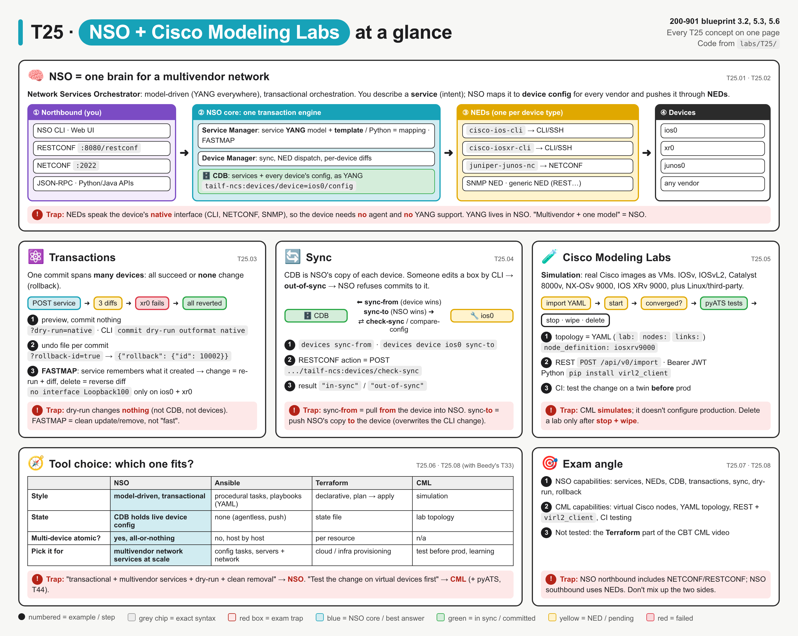
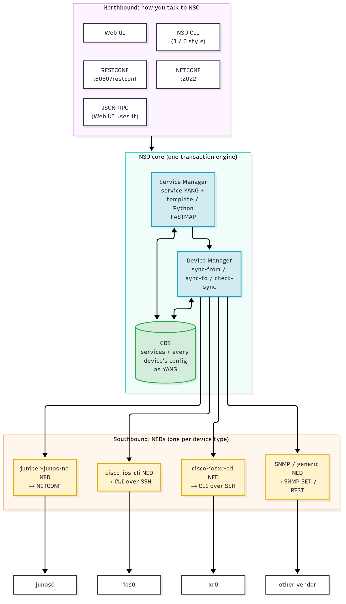
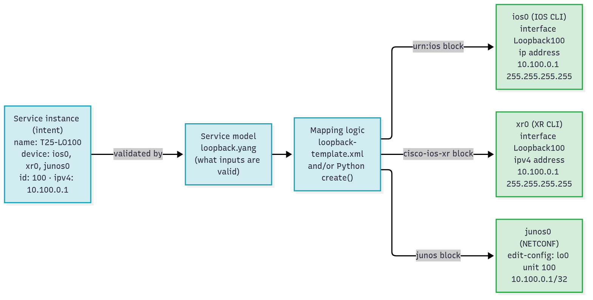
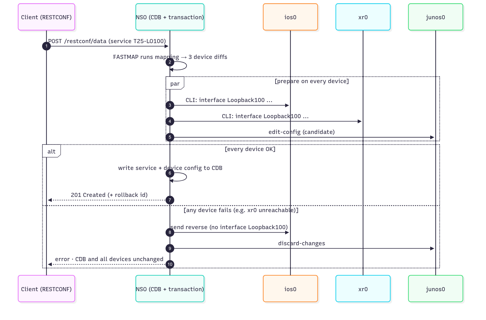
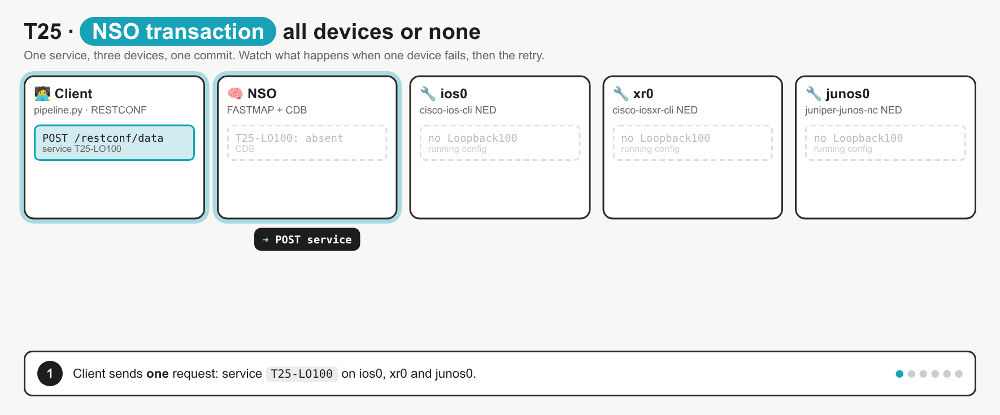
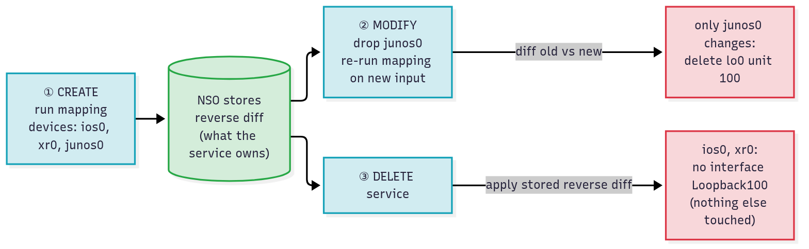
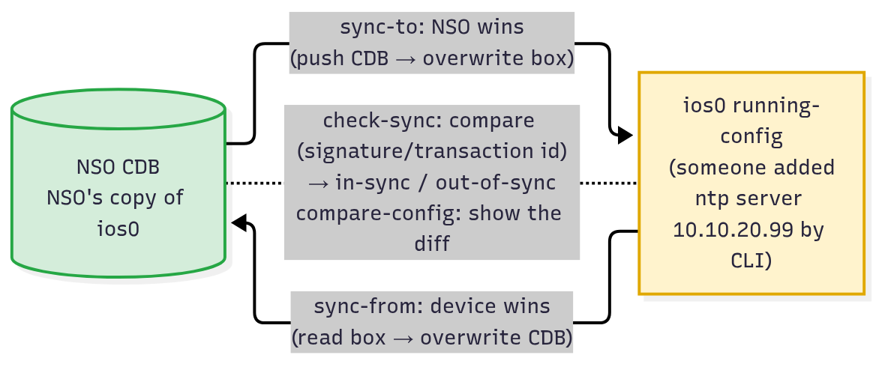
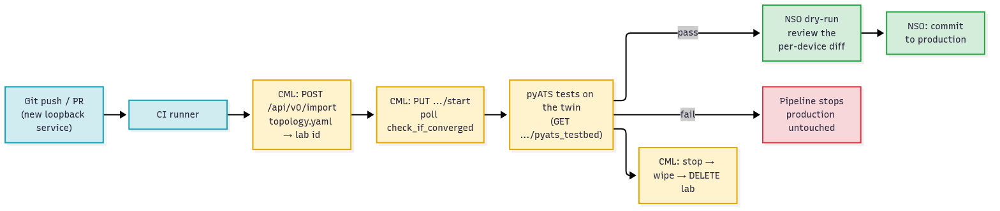
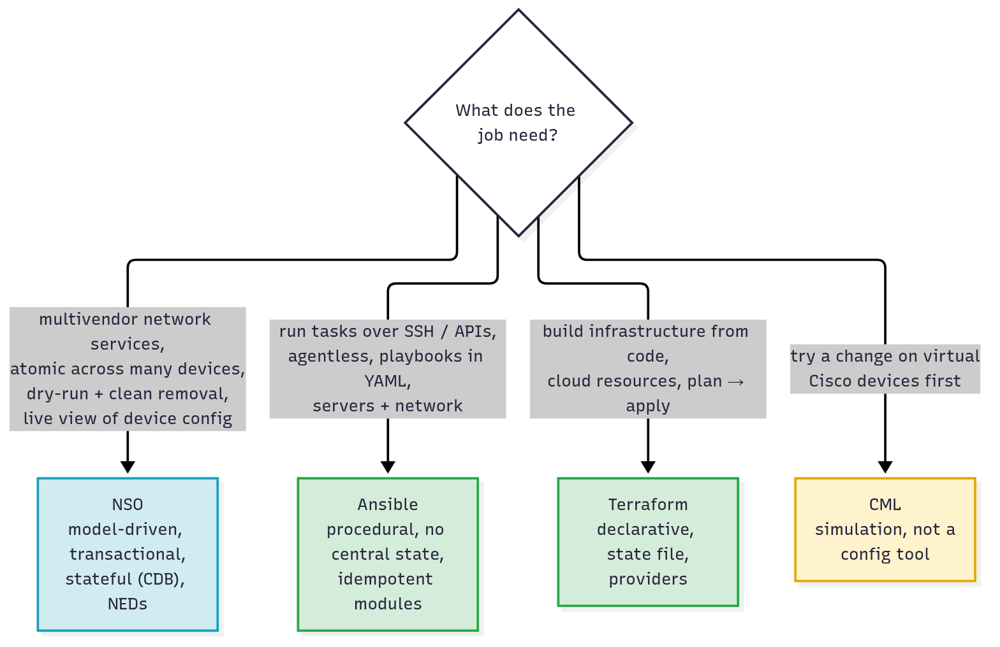

# T25 · NSO + Cisco Modeling Labs

> Owner: **Bob** · Blueprint: **3.2, 5.3, 5.6** · CBT coverage: **Full** · Learn by 2026-10-17 · Teach-back 2026-10-20



*Every T25 concept on one page. The top panel is the NSO system map, read left to right (you → NSO core → NEDs → devices). The panels below it cover transactions, sync, CML, tool choice and the exam angle. Numbers are examples taken from `labs/T25/`, and red boxes are exam traps.*

## TL;DR (teach-back card)

- **NSO = model-driven, transactional, multivendor orchestration.** A **service** (YANG model + template/Python mapping) turns intent into config for each device. **NEDs** translate that config into each device's native interface (CLI, NETCONF, SNMP, REST). **CDB** holds the services and every device's config. You reach NSO northbound through CLI, Web UI, RESTCONF, NETCONF or JSON-RPC.
- **Transactions + FASTMAP.** One commit covers many devices and is all-or-nothing. `commit dry-run outformat native` (RESTCONF `?dry-run=native`) previews the exact per-device commands. FASTMAP remembers what a service created, so changing or deleting the service touches only that config. Sync: `sync-from` pulls the device into CDB, `sync-to` pushes CDB to the device, and `check-sync` compares them.
- **CML = simulation, not configuration.** It runs virtual Cisco images (IOSv, Catalyst 8000v, NX-OSv 9000, IOS XRv 9000) from a **YAML** topology. You drive it through the REST API (`/api/v0`) or the `virl2_client` Python library. In CI it acts as a disposable twin: build it, run the tests, tear it down, all before NSO touches production.
- **Trap:** sync-**from** = the device wins (pull **from** the box). sync-**to** = NSO wins (push **to** the box, which overwrites CLI changes). Also: "transactional multivendor service" → NSO, not Ansible. "Test on virtual devices first" → CML, not NSO.

## Concepts

The whole topic is one CI story, told by one program.

- `labs/T25/pipeline.py` is the **reference program**. It runs in two stages:
  - **Stage 1, CML** (blueprint 5.3): import `topology.yaml`, start the lab, wait until it converges, fetch the pyATS testbed, then stop, wipe and delete the lab.
  - **Stage 2, NSO** (blueprint 3.2 / 5.6): push one "anycast loopback" service to an IOS, an IOS XR and a Junos device as **one** transaction. Along the way it shows check-sync, a refused commit, sync-from, dry-run, rollback ids and FASTMAP.
- `labs/T25/mock_nso_cml.py` is a local stand-in for NSO RESTCONF (`/restconf`) and the CML API (`/api/v0`) on `127.0.0.1:8125`. Its URL paths are taken from the NSO and CML docs. Real NSO listens on `:8080`, and CML on `https://<host>`.
  - DevNet's always-on NSO sandbox now issues per-user credentials, so the program wasn't run against it (see To verify).
- `labs/T25/nso-package/` holds the service model (`loopback.yang`) and the mapping template (`loopback-template.xml`) that the mock imitates.
- Run it all with `bash labs/T25/run_lab.sh`.

**`labs/T25/pipeline.py`**

```python
"""T25 reference program: test a change in CML, then roll it out with NSO.

Stage 1 (CML, blueprint 5.3): build a throwaway twin of the network from topology.yaml,
         boot it, hand it to the tests, tear it down.
Stage 2 (NSO, blueprint 3.2 / 5.6): push one "anycast loopback" service to three
         vendors' devices as ONE transaction, with sync checks, dry-run and FASTMAP.

Start the mock first:  python3 labs/T25/mock_nso_cml.py   (or: bash labs/T25/run_lab.sh)
Real targets: set CML_URL / CML_USER / CML_PASS and NSO_URL / NSO_USER / NSO_PASS.
"""
import json
import os
import pathlib
import time

import requests

CML_URL = os.environ.get("CML_URL", "http://127.0.0.1:8125")      # real CML: https://<cml-host>
CML_USER = os.environ.get("CML_USER", "admin")
CML_PASS = os.environ.get("CML_PASS", "T25-mock-pass")
NSO_URL = os.environ.get("NSO_URL", "http://127.0.0.1:8125")      # real NSO: http://<nso-host>:8080
NSO_USER = os.environ.get("NSO_USER", "admin")
NSO_PASS = os.environ.get("NSO_PASS", "admin")
TOPOLOGY = pathlib.Path(__file__).with_name("topology.yaml")
YANG_JSON = "application/yang-data+json"


def show(resp, body=True):
    """Print one request/response pair in a compact form."""
    req = resp.request
    print(f">>> {req.method} {req.url.replace(CML_URL, '').replace(NSO_URL, '')}")
    print(f"<<< {resp.status_code} {resp.reason}")
    if "Location" in resp.headers:
        print(f"    Location: {resp.headers['Location']}")
    if body and resp.text:
        try:
            print("    " + json.dumps(resp.json()).replace("\n", "\n    "))
        except ValueError:
            print("    " + resp.text.strip().replace("\n", "\n    "))
    return resp


def show_dry_run(resp):
    """dry-run=native returns, per device, exactly what the NED would send."""
    print(f">>> {resp.request.method} {resp.request.url.replace(NSO_URL, '')}")
    print(f"<<< {resp.status_code} {resp.reason}")
    for dev in resp.json()["dry-run-result"]["native"]["device"]:
        print(f"    --- {dev['name']} ---")
        print("    " + dev["data"].rstrip().replace("\n", "\n    "))


# ------------------------------------------------------------------ stage 1: CML
def cml_test_stage():
    cml = requests.Session()
    cml.verify = False                                    # CML ships a self-signed cert

    token = show(cml.post(f"{CML_URL}/api/v0/authenticate",
                          json={"username": CML_USER, "password": CML_PASS})).json()
    cml.headers["Authorization"] = f"Bearer {token}"      # JWT on every later call

    lab_id = show(cml.post(f"{CML_URL}/api/v0/import", params={"title": "T25-ci-twin"},
                           data=TOPOLOGY.read_text())).json()["id"]
    show(cml.put(f"{CML_URL}/api/v0/labs/{lab_id}/start"))
    while not show(cml.get(f"{CML_URL}/api/v0/labs/{lab_id}/check_if_converged")).json():
        time.sleep(0.2)                                   # real labs take minutes; poll ~5 s
    show(cml.get(f"{CML_URL}/api/v0/labs/{lab_id}/nodes", params={"data": "true"}))
    show(cml.get(f"{CML_URL}/api/v0/labs/{lab_id}/pyats_testbed"))
    print("    ... CI job now runs its pyATS tests against this testbed (T44) ...")

    for action in ("stop", "wipe"):                       # must stop + wipe before delete
        show(cml.put(f"{CML_URL}/api/v0/labs/{lab_id}/{action}"))
    show(cml.delete(f"{CML_URL}/api/v0/labs/{lab_id}"))


# ------------------------------------------------------------------ stage 2: NSO
def nso_deploy_stage():
    nso = requests.Session()
    nso.auth = (NSO_USER, NSO_PASS)                       # NSO RESTCONF: HTTP Basic
    nso.headers.update({"Accept": YANG_JSON, "Content-Type": YANG_JSON})
    data = f"{NSO_URL}/restconf/data"
    devices = f"{data}/tailf-ncs:devices"
    service = {"loopback:loopback": [{"name": "T25-LO100", "device": ["ios0", "xr0", "junos0"],
                                      "id": 100, "ipv4": "10.100.0.1"}]}
    svc_url = f"{data}/loopback:loopback=T25-LO100"

    print("\n-- managed devices: one NED per vendor/protocol --")
    show(nso.get(f"{devices}/device?fields=name;address;device-type"))

    print("\n-- is CDB the same as each box? --")
    show(nso.post(f"{devices}/check-sync"))

    print("\n-- commit while ios0 is out of sync: whole transaction refused --")
    show(nso.post(data, json=service))
    show(nso.get(svc_url))                                # 404: nothing was created anywhere

    print("\n-- pull the box's config into CDB, then re-check --")
    show(nso.post(f"{devices}/device=ios0/sync-from"))
    show(nso.post(f"{devices}/check-sync"))

    print("\n-- dry-run: what each NED would send, nothing committed --")
    show_dry_run(nso.post(data, json=service, params={"dry-run": "native"}))

    print("\n-- commit for real: one transaction, three devices --")
    show(nso.post(data, json=service, params={"rollback-id": "true"}))
    show(nso.get(f"{devices}/device=ios0/config/tailf-ned-cisco-ios:interface/Loopback=100"))

    print("\n-- FASTMAP: drop junos0 from the service; NSO works out the minimal change --")
    smaller = {"loopback:loopback": [{**service["loopback:loopback"][0], "device": ["ios0", "xr0"]}]}
    show_dry_run(nso.put(svc_url, json=smaller, params={"dry-run": "native"}))
    show(nso.put(svc_url, json=smaller))

    print("\n-- FASTMAP: delete the service; NSO removes exactly what it created --")
    show_dry_run(nso.delete(svc_url, params={"dry-run": "native"}))
    show(nso.delete(svc_url))
    show(nso.get(f"{devices}/device=ios0/config/tailf-ned-cisco-ios:interface/Loopback=100"))


if __name__ == "__main__":
    requests.packages.urllib3.disable_warnings()          # quiet the self-signed-cert warning
    print("== Stage 1: CML - test the change on a simulated twin ==")
    cml_test_stage()
    print("\n== Stage 2: NSO - deploy the change as one transaction ==")
    nso_deploy_stage()
```

**Output** (`bash labs/T25/run_lab.sh`):

```
== Stage 1: CML - test the change on a simulated twin ==
>>> POST /api/v0/authenticate
<<< 200 OK
    "eyJhbGciOiJIUzI1NiJ9.t25-mock.jwt"
>>> POST /api/v0/import?title=T25-ci-twin
<<< 200 OK
    {"id": "00000000-0000-0000-0000-000000000025", "warnings": []}
>>> PUT /api/v0/labs/00000000-0000-0000-0000-000000000025/start
<<< 204 No Content
>>> GET /api/v0/labs/00000000-0000-0000-0000-000000000025/check_if_converged
<<< 200 OK
    false
>>> GET /api/v0/labs/00000000-0000-0000-0000-000000000025/check_if_converged
<<< 200 OK
    false
>>> GET /api/v0/labs/00000000-0000-0000-0000-000000000025/check_if_converged
<<< 200 OK
    true
>>> GET /api/v0/labs/00000000-0000-0000-0000-000000000025/nodes?data=true
<<< 200 OK
    [{"id": "n0", "label": "ios0", "node_definition": "iosv", "state": "BOOTED"}, {"id": "n1", "label": "xr0", "node_definition": "iosxrv9000", "state": "BOOTED"}]
>>> GET /api/v0/labs/00000000-0000-0000-0000-000000000025/pyats_testbed
<<< 200 OK
    testbed:
      name: T25-ci-twin
    devices:
      ios0:
        os: ios
        connections:
          a:
            protocol: telnet
            proxy: terminal_server
            command: open /00000000-0000-0000-0000-000000000025/n0/0
      xr0:
        os: iosxr
        connections:
          a:
            protocol: telnet
            proxy: terminal_server
            command: open /00000000-0000-0000-0000-000000000025/n1/0
    ... CI job now runs its pyATS tests against this testbed (T44) ...
>>> PUT /api/v0/labs/00000000-0000-0000-0000-000000000025/stop
<<< 204 No Content
>>> PUT /api/v0/labs/00000000-0000-0000-0000-000000000025/wipe
<<< 204 No Content
>>> DELETE /api/v0/labs/00000000-0000-0000-0000-000000000025
<<< 204 No Content

== Stage 2: NSO - deploy the change as one transaction ==

-- managed devices: one NED per vendor/protocol --
>>> GET /restconf/data/tailf-ncs:devices/device?fields=name;address;device-type
<<< 200 OK
    {"tailf-ncs:device": [{"name": "ios0", "address": "10.10.20.51", "device-type": {"cli": {"ned-id": "cisco-ios-cli-6.106"}}}, {"name": "xr0", "address": "10.10.20.52", "device-type": {"cli": {"ned-id": "cisco-iosxr-cli-7.61"}}}, {"name": "junos0", "address": "10.10.20.53", "device-type": {"netconf": {"ned-id": "juniper-junos-nc-4.17"}}}]}

-- is CDB the same as each box? --
>>> POST /restconf/data/tailf-ncs:devices/check-sync
<<< 200 OK
    {"tailf-ncs:output": {"sync-result": [{"device": "ios0", "result": "out-of-sync"}, {"device": "xr0", "result": "in-sync"}, {"device": "junos0", "result": "in-sync"}]}}

-- commit while ios0 is out of sync: whole transaction refused --
>>> POST /restconf/data
<<< 409 Conflict
    {"ietf-restconf:errors": {"error": [{"error-type": "application", "error-tag": "in-use", "error-message": "Network Element Driver: device ios0: out of sync"}]}}
>>> GET /restconf/data/loopback:loopback=T25-LO100
<<< 404 Not Found
    {"ietf-restconf:errors": {"error": [{"error-type": "application", "error-tag": "invalid-value", "error-message": "uri keypath not found"}]}}

-- pull the box's config into CDB, then re-check --
>>> POST /restconf/data/tailf-ncs:devices/device=ios0/sync-from
<<< 200 OK
    {"tailf-ncs:output": {"result": true}}
>>> POST /restconf/data/tailf-ncs:devices/check-sync
<<< 200 OK
    {"tailf-ncs:output": {"sync-result": [{"device": "ios0", "result": "in-sync"}, {"device": "xr0", "result": "in-sync"}, {"device": "junos0", "result": "in-sync"}]}}

-- dry-run: what each NED would send, nothing committed --
>>> POST /restconf/data?dry-run=native
<<< 200 OK
    --- ios0 ---
    interface Loopback100
     ip address 10.100.0.1 255.255.255.255
    exit
    --- xr0 ---
    interface Loopback100
     ipv4 address 10.100.0.1 255.255.255.255
    exit
    --- junos0 ---
    <rpc xmlns="urn:ietf:params:xml:ns:netconf:base:1.0" message-id="1">
      <edit-config xmlns:nc="urn:ietf:params:xml:ns:netconf:base:1.0">
        <target><candidate/></target>
        <config>
          <configuration xmlns="http://xml.juniper.net/xnm/1.1/xnm">
            <interfaces><interface><name>lo0</name>
              <unit><name>100</name><family><inet><address><name>10.100.0.1/32</name></address></inet></family></unit>
            </interface></interfaces>
          </configuration>
        </config>
      </edit-config>
    </rpc>

-- commit for real: one transaction, three devices --
>>> POST /restconf/data?rollback-id=true
<<< 201 Created
    Location: /restconf/data/loopback:loopback=T25-LO100
    {"tailf-restconf:result": {"rollback": {"id": 10002}}}
>>> GET /restconf/data/tailf-ncs:devices/device=ios0/config/tailf-ned-cisco-ios:interface/Loopback=100
<<< 200 OK
    {"tailf-ned-cisco-ios:Loopback": [{"name": "100", "ip": {"address": {"primary": {"address": "10.100.0.1", "mask": "255.255.255.255"}}}}]}

-- FASTMAP: drop junos0 from the service; NSO works out the minimal change --
>>> PUT /restconf/data/loopback:loopback=T25-LO100?dry-run=native
<<< 200 OK
    --- junos0 ---
    <rpc xmlns="urn:ietf:params:xml:ns:netconf:base:1.0" message-id="1">
      <edit-config xmlns:nc="urn:ietf:params:xml:ns:netconf:base:1.0">
        <target><candidate/></target>
        <config>
          <configuration xmlns="http://xml.juniper.net/xnm/1.1/xnm">
            <interfaces><interface><name>lo0</name>
              <unit nc:operation="delete"><name>100</name></unit>
            </interface></interfaces>
          </configuration>
        </config>
      </edit-config>
    </rpc>
>>> PUT /restconf/data/loopback:loopback=T25-LO100
<<< 204 No Content

-- FASTMAP: delete the service; NSO removes exactly what it created --
>>> DELETE /restconf/data/loopback:loopback=T25-LO100?dry-run=native
<<< 200 OK
    --- ios0 ---
    no interface Loopback100
    --- xr0 ---
    no interface Loopback100
>>> DELETE /restconf/data/loopback:loopback=T25-LO100
<<< 204 No Content
>>> GET /restconf/data/tailf-ncs:devices/device=ios0/config/tailf-ned-cisco-ios:interface/Loopback=100
<<< 404 Not Found
    {"ietf-restconf:errors": {"error": [{"error-type": "application", "error-tag": "invalid-value", "error-message": "uri keypath not found"}]}}
```

### T25.01 · What NSO is

**Must cover:**

- [x] Network Services Orchestrator: model-driven orchestration across multivendor networks

**Notes:**

- **Cisco NSO (Network Services Orchestrator)**, formerly Tail-f NCS, so the CLI is `ncs` and the YANG prefix is `tailf-ncs`. It sits **above** the network and configures devices from many vendors through one model.
- **Model-driven** means everything inside NSO is described in YANG: the services you define, and each device's configuration. Read and write the network the way you'd read and write a database.
- **Orchestration** means you ask for a **service** ("anycast loopback 100 on these 3 routers"), not individual CLI lines. NSO works out the per-device config.
- **Multivendor:** in the program's output, the same `GET .../devices/device` lists `cisco-ios-cli`, `cisco-iosxr-cli` and `juniper-junos-nc` NEDs side by side.
- Typical users: service providers and large enterprises provisioning L2/L3 VPNs, ACLs, VRFs and loopbacks across thousands of boxes.
- Blueprint 3.2 lists NSO among the "network management platforms", next to Meraki ([T18](T18-meraki.md)), ACI ([T19](T19-aci.md)), Catalyst Center ([T20](T20-catalyst-center-dna-center.md)) and SD-WAN Manager ([T22](T22-catalyst-sd-wan.md)).
  - The difference: those platforms each manage **their own** product family. NSO manages **any** vendor through NEDs.

### T25.02 · Architecture

**Must cover:**

- [x] Service models (YANG) + templates/Python map a service to device config
- [x] NEDs (Network Element Drivers) translate to each device (CLI, NETCONF, SNMP)
- [x] CDB (configuration database) holds the network config
- [x] Northbound interfaces: CLI, web UI, REST/RESTCONF, NETCONF, JSON-RPC

**Notes:**



*Read it top to bottom. Every northbound interface reaches the same core. The Service Manager and Device Manager share the CDB. Each device type gets its own NED.*

- NSO has two layers, the **Service Manager** and the **Device Manager**, joined by one transaction engine and the **CDB**.

| Part | Does | In the lab |
|---|---|---|
| **Service model** (YANG) | defines the service's inputs and their types | `nso-package/loopback.yang`: `name`, `device` (leaf-list → leafref to managed devices), `id`, `ipv4` |
| **Mapping** (XML template and/or Python `create()`) | turns service inputs into device config | `nso-package/loopback-template.xml`: `{/device}`, `{/id}`, `{/ipv4}` placeholders |
| **Service Manager** | runs the mapping, tracks what each service owns (FASTMAP) | the 3 per-device diffs in the dry-run output |
| **Device Manager** | keeps device copies in CDB, sync actions, sends diffs through NEDs | `check-sync`, `sync-from` |
| **CDB** | NSO's database: service instances + **every device's config**, as YANG | `GET .../device=ios0/config/tailf-ned-cisco-ios:interface/Loopback=100` |
| **NED** (Network Element Driver) | translates the YANG diff into the device's native protocol | IOS/XR → CLI over SSH, Junos → NETCONF `edit-config` |



*One service instance, one template, three different device outputs. NSO applies only the template block whose namespace matches each device's NED.*

- **Service = YANG model + mapping.**
  - The template in the lab has three blocks: `urn:ios`, `http://tail-f.com/ned/cisco-ios-xr` and Junos `xnm`. Each device gets only the block for its own NED.
  - Use **Python** (or Java) mapping when the template needs logic, such as IP allocation, loops or lookups.
- **NED types** (device type in NSO = `cli`, `netconf`, `snmp` or `generic`):
  - **NETCONF NED**: NSO uses its built-in NETCONF client, so the native output is an `edit-config` RPC (see junos0 in the output).
  - **CLI NED**: NSO renders a CLI command sequence from YANG models that mirror the device CLI (see ios0 / xr0: `interface Loopback100 …`).
  - **SNMP NED**: changes become SNMP SET PDUs. The YANG is generated from the MIBs.
  - **Generic NED**: Java code for anything else (REST, SOAP, proprietary APIs).
  - The device needs **no** YANG and **no** agent. The NED does the translation.
- **Northbound interfaces** (how people and tools reach NSO): **NSO CLI** (Juniper-style or Cisco-style), **Web UI**, **RESTCONF**, **NETCONF**, **JSON-RPC** (what the Web UI uses), plus Python/Java/Erlang APIs.
  - The lab uses RESTCONF with HTTP Basic and `application/yang-data+json`, the same media type as [T16 RESTCONF](T16-restconf.md).
  - ⚠ verify the ports: the docs' examples use `:8080` for RESTCONF/Web UI, and NETCONF northbound defaults to `:2022` in local installs.

### T25.03 · Transactions

**Must cover:**

- [x] Changes commit as one transaction across many devices; all-or-nothing with rollback
- [x] commit dry-run previews device changes
- [x] FASTMAP: tracks what a service created so it can update/remove it cleanly

**Notes:**



*NSO prepares the change on every device. It commits to CDB only if all of them accept. If any device fails, NSO undoes the others and nothing changes.*



*Steps: POST service → FASTMAP builds 3 diffs → push to ios0, xr0, junos0 → xr0 fails → NSO reverts ios0 and discards the junos0 candidate, so CDB is unchanged → retry with all 3 committed → `201`. It fixes the misconception that "the devices that worked keep the change".*

- **Network-wide transaction:** one commit = one unit of work across **all** devices it touches. Either every device and CDB change, or **none** do.
  - The program shows a variant: ios0 is **out of sync**, so the commit for all three devices is refused (`409 … device ios0: out of sync`). The `GET` on the service then returns `404`, because nothing was created anywhere.
  - ⚠ verify: in real NSO the HTTP code and error-tag for this case may differ. The CLI message is `Aborted: Network Element Driver: device ios0: out of sync`.
- **Rollback:** each commit can write a rollback file. RESTCONF `?rollback-id=true` returns its id (`10002` in the output). You can later apply it with the `apply-rollback-file` action. CLI: `rollback configuration <id>` ⚠ verify the CLI syntax.
- **Dry-run** = validate and show the change, then **commit nothing** (CDB and devices untouched).
  - CLI: `commit dry-run outformat native`. RESTCONF: `?dry-run=native`.
  - Output formats: `cli` (NSO's own diff), `xml`, `native` (the exact commands/RPC each NED would send), and `cli-c` (Cisco-style diff).
  - The program's dry-run output: IOS gets `ip address …`, XR gets `ipv4 address …`, and Junos gets an `edit-config`. One service, three native dialects.
- **FASTMAP** is how NSO keeps services clean.
  - On **create**, NSO runs the mapping and stores the **reverse diff**: exactly what this service added.
  - On **modify**, it re-runs the mapping on the new input and applies only the difference. In the output, dropping `junos0` from the leaf-list produces a dry-run with **only** a junos0 `nc:operation="delete"`. ios0 and xr0 aren't touched.
  - On **delete**, it applies the stored reverse diff: `no interface Loopback100` on ios0 and xr0, and nothing else.
  - Because of this you write only the **create** logic. NSO derives update and delete for you.



*The stored reverse diff (green) is why modify and delete touch only what the service owns.*

- Related service actions (CLI or RESTCONF): `re-deploy` (re-run the mapping), `un-deploy` (remove the service's config but keep the service), `get-modifications` (show what the service changed) and `check-sync` on a **service** (would a re-deploy change anything?).

### T25.04 · Sync

**Must cover:**

- [x] devices sync-from (pull device config into CDB), sync-to (push CDB to device), check-sync

**Notes:**



*The two arrows point in opposite directions. The dotted line only compares, it changes nothing.*

| Action | Direction | Winner | Use when |
|---|---|---|---|
| `sync-from` | device → CDB | **device** config | first onboarding a device; accepting an out-of-band CLI change |
| `sync-to` | CDB → device | **NSO** config | undoing an out-of-band change (device is "wrong") |
| `check-sync` | compare only | — | cheap check (compares a config signature / transaction id) → `in-sync` / `out-of-sync` |
| `compare-config` | compare only | — | shows the actual **diff** between CDB and device |

- CLI: `devices sync-from` (all devices), `devices device ios0 sync-from`, `devices device ios0 sync-to`, `devices check-sync`.
- RESTCONF: an **action** is a `POST` on the action's path, e.g. `POST /restconf/data/tailf-ncs:devices/device=ios0/sync-from`. The result comes back in `"tailf-ncs:output"`.
- In the program:
  - `check-sync` reports ios0 `out-of-sync`, because someone added `ntp server 10.10.20.99` by CLI.
  - The commit is refused.
  - `sync-from` ios0 → CDB now matches → `check-sync` shows all `in-sync` → the commit works.
- The curl drill does the opposite: `sync-to` overwrites the box with NSO's copy.
- Out of sync blocks commits by default. The `no-out-of-sync-check` commit flag overrides this. Know that it exists; it isn't the normal answer.

### T25.05 · CML

**Must cover:**

- [x] Cisco Modeling Labs: simulate networks with virtual Cisco images (IOSv, Catalyst 8000v, NX-OSv, IOS XRv)
- [x] Topology defined in YAML; REST API and Python client (virl2_client)
- [x] Used to test changes in CI pipelines before production

**Notes:**

- **Cisco Modeling Labs (CML)**, formerly VIRL. It runs on a server or a VM, on-premises, and simulates networks with **real Cisco images** running as virtual machines.
  - Reference platforms: **IOSv**, **IOSvL2**, **CSR 1000v / Catalyst 8000v**, **NX-OSv 9000**, **IOS XRv 9000**, **Catalyst 9000v** ⚠ verify the list per CML version.
  - It also runs open-source nodes (Alpine, Ubuntu), unmanaged switches, external connectors and third-party KVM images or Docker containers.
  - Editions: **Free** (5 running nodes), **Personal** (20), **Personal Plus** (40), **Enterprise** and **Education** (multi-user, clustering).
- **Topology = YAML** (`labs/T25/topology.yaml`):
  - `lab:` holds the title, description and version.
  - `nodes:` lists each node's `id`, `label`, `node_definition` (`iosv`, `iosxrv9000`), x/y position, day-0 `configuration` and `interfaces`.
  - `links:` joins `n1`/`i1` to `n2`/`i2`.
  - Export a lab built in the UI and you get the same file, so a topology can be kept in Git.
- **REST API**, base `https://<cml>/api/v0`, with interactive docs under Tools → API Documentation:

| Step | Call (as in `cml_test_stage()`) |
|---|---|
| log in | `POST /api/v0/authenticate` `{"username","password"}` → JWT, then `Authorization: Bearer <jwt>` |
| create the lab from YAML | `POST /api/v0/import?title=T25-ci-twin` (body = YAML) → `{"id": …}` |
| boot it | `PUT /api/v0/labs/{id}/start`, then poll `GET …/check_if_converged` until `true` |
| inspect | `GET …/nodes?data=true` (state `BOOTED`), `GET …/pyats_testbed` (testbed YAML for [T44 pyATS](../bee/T44-pyats-genie.md)) |
| tear down | `PUT …/stop` → `PUT …/wipe` → `DELETE /api/v0/labs/{id}` |

- **`virl2_client`** (`pip install virl2_client`) wraps the same API. The client version should match the controller version. The equivalent code is in Examples §3.
- **CI use**, blueprint 5.3 (simulation and testing tools):



*The CML stage (yellow) is disposable. Only a passing test run reaches NSO (green). A failure stops the pipeline before production is touched.*

  - The pipeline builds a twin of the change area, applies the change, runs pyATS tests, then deletes the lab.
  - That is exactly the order `pipeline.py` runs in: stage 1 CML, stage 2 NSO.

### T25.06 · Tool choice

**Must cover:**

- [x] NSO vs Ansible vs Terraform (shared with Beedy T33): NSO = transactional, model-driven, multivendor services

**Notes:**



*Match the job's wording to the box. CML is a test environment, not a config tool.*

| | **NSO** | **Ansible** | **Terraform** |
|---|---|---|---|
| Model | model-driven (YANG), **services** | procedural tasks in playbooks (YAML) | declarative resources (HCL) |
| Transactions | **network-wide, all-or-nothing**, rollback | no; host by host, play stops or continues | plan → apply per resource; no multi-device atomicity |
| State | **CDB** holds live device config, sync checks | none, agentless push | state file (`terraform.tfstate`) |
| Preview | `commit dry-run` (native per device) | `--check --diff` | `terraform plan` |
| Remove cleanly | FASTMAP reverse diff | write separate "absent" tasks | `terraform destroy` |
| Best at | multivendor network **service** lifecycle at scale | config tasks, servers + network, glue | cloud / infra provisioning |

- Deeper Ansible / Terraform detail is in Beedy's [T33](../bee/T33-iac-tool-comparison.md). This note owns only the NSO column.
- They combine: Ansible has NSO modules, and a pipeline can call NSO's RESTCONF. The exam asks which tool **fits**, not which one is better.

### T25.07 · Not tested

**Must cover:**

- [x] Terraform segment of the CML video

**Notes:**

- The Terraform part of the CBT "Understand Network Simulation, NSO & Terraform" module is low priority for T25. Terraform itself belongs to T33.
- This note doesn't describe what that video contains (CBT is behind a login).

### T25.08 · Exam angle

**Must cover:**

- [x] Capabilities of NSO and CML; when to use each

**Notes:**

- **NSO capabilities to name:** multivendor through NEDs · YANG service models + templates/Python · CDB as the source of truth · network-wide transactions with rollback · dry-run (native) · FASTMAP clean update/delete · sync-from / sync-to / check-sync / compare-config · northbound CLI, Web UI, RESTCONF, NETCONF, JSON-RPC.
- **CML capabilities to name:** virtual Cisco images · YAML topologies (export/import, versioned in Git) · REST API + `virl2_client` · pyATS testbed export · use in CI to test before production · personal and team editions.
- **Scenario → answer:**
  - "Provision one L3VPN across 40 PE routers from 3 vendors; if any PE fails, leave none changed" → **NSO**.
  - "Show exactly which CLI lines NSO will send before committing" → `commit dry-run outformat native`.
  - "A device was changed by hand; make NSO accept the device's config" → `sync-from`.
  - "Run regression tests on IOS XRv before changing production" → **CML** (+ pyATS).
  - "Start a CML lab from a Python script" → `virl2_client` or `PUT /api/v0/labs/{id}/start`.

## Exam traps

- **sync-from vs sync-to:** `sync-from` = pull **from** the device into CDB (device wins). `sync-to` = push CDB **to** the device (NSO wins, overwriting the CLI change). `check-sync` only compares.
- **Out of sync blocks commits.** "NSO refuses to commit to a device that was changed by hand" → run `check-sync` / `compare-config`, then `sync-from` (accept the change) or `sync-to` (revert it).
- **Dry-run commits nothing.** `commit dry-run outformat native` shows the device-native commands. `outformat cli` shows NSO's own diff format instead.
- **All-or-nothing:** if one device in the transaction fails, **no** device keeps the change and CDB is untouched.
- **FASTMAP isn't about speed.** It means the service remembers what it created, so modify and delete touch only that. You write only the create logic.
- **NED vs northbound:** NEDs are **southbound** (NSO → device: CLI, NETCONF, SNMP, generic). RESTCONF/NETCONF/JSON-RPC/CLI/Web UI are **northbound** (you → NSO).
- **Devices don't need YANG or NETCONF** for NSO. A CLI NED is enough.
- **CDB holds device config too**, not just services. That's why you can `GET …/devices/device=ios0/config/...` from NSO without logging in to the box.
- **CML ≠ NSO.** CML simulates a network for testing and learning. NSO configures real networks. CML topology = **YAML**; Python library = **`virl2_client`**; API base = `/api/v0` with a **Bearer** token.
- **CML teardown order:** stop → wipe → delete. Deleting a running lab fails.
- **Names:** NSO was Tail-f NCS (so you'll see `ncs`, `tailf-ncs`). CML was VIRL (so you'll see `virl2_client`).

## Examples

### 1. Run the reference program

Needs Python 3 with `requests` and `pyyaml`. Both are already in the lab image.

```bash
bash labs/T25/run_lab.sh                         # mock + pipeline.py
bash labs/T25/run_lab.sh labs/T25/curl_drill.sh  # mock + curl drill
```

By hand, in two terminals:

```bash
python3 labs/T25/mock_nso_cml.py                 # terminal 1: leave running
python3 labs/T25/pipeline.py                     # terminal 2
```

In the lab container:

```bash
docker build --tag ccna-auto-lab:latest --file labs/Dockerfile labs/
docker run --rm --volume "$(pwd)":/work --workdir /work ccna-auto-lab:latest bash labs/T25/run_lab.sh
```

Against real systems: point the env vars at them. Don't run sync or commit actions against shared sandboxes.

```bash
export CML_URL="https://<cml-host>" CML_USER="<user>" CML_PASS="<pass>"
export NSO_URL="http://<nso-host>:8080" NSO_USER="<user>" NSO_PASS="<pass>"
python3 labs/T25/pipeline.py
```

### 2. curl drill (`labs/T25/curl_drill.sh`)

```bash
#!/usr/bin/env bash
# T25 curl drill: NSO RESTCONF actions and dry-run by hand. Start the mock first:
#   python3 labs/T25/mock_nso_cml.py      (or: bash labs/T25/run_lab.sh labs/T25/curl_drill.sh)
set -u
NSO="${NSO_URL:-http://127.0.0.1:8125}"
AUTH="${NSO_USER:-admin}:${NSO_PASS:-admin}"
JSON="application/yang-data+json"

echo "== 1. Wrong password -> 401 (NSO RESTCONF uses HTTP Basic)"
curl --silent --write-out "HTTP %{http_code}\n" --output /dev/null \
  --user "admin:wrong" --header "Accept: $JSON" \
  "$NSO/restconf/data/tailf-ncs:devices/device"

echo; echo "== 2. check-sync one device (an action = POST, no body)"
curl --silent --request POST --user "$AUTH" --header "Accept: $JSON" \
  "$NSO/restconf/data/tailf-ncs:devices/device=ios0/check-sync"

echo; echo; echo "== 3. sync-to: push NSO's copy (CDB) down to the box, overwriting the CLI change"
curl --silent --request POST --user "$AUTH" --header "Accept: $JSON" \
  "$NSO/restconf/data/tailf-ncs:devices/device=ios0/sync-to"
echo
curl --silent --request POST --user "$AUTH" --header "Accept: $JSON" \
  "$NSO/restconf/data/tailf-ncs:devices/check-sync"

echo; echo; echo "== 4. Service create with ?dry-run=native: preview only, nothing committed"
curl --silent --request POST --user "$AUTH" \
  --header "Content-Type: $JSON" --header "Accept: $JSON" \
  --data '{"loopback:loopback": [{"name": "T25-LO200", "device": ["xr0"], "id": 200, "ipv4": "10.200.0.1"}]}' \
  "$NSO/restconf/data?dry-run=native"
echo
curl --silent --write-out "after dry-run, GET the service: HTTP %{http_code}\n" --output /dev/null \
  --user "$AUTH" --header "Accept: $JSON" \
  "$NSO/restconf/data/loopback:loopback=T25-LO200"
```

Output (`bash labs/T25/run_lab.sh labs/T25/curl_drill.sh`):

```
== 1. Wrong password -> 401 (NSO RESTCONF uses HTTP Basic)
HTTP 401

== 2. check-sync one device (an action = POST, no body)
{
  "tailf-ncs:output": {
    "result": "out-of-sync"
  }
}

== 3. sync-to: push NSO's copy (CDB) down to the box, overwriting the CLI change
{
  "tailf-ncs:output": {
    "result": true
  }
}
{
  "tailf-ncs:output": {
    "sync-result": [
      {
        "device": "ios0",
        "result": "in-sync"
      },
      {
        "device": "xr0",
        "result": "in-sync"
      },
      {
        "device": "junos0",
        "result": "in-sync"
      }
    ]
  }
}

== 4. Service create with ?dry-run=native: preview only, nothing committed
{
  "dry-run-result": {
    "native": {
      "device": [
        {
          "name": "xr0",
          "data": "interface Loopback200\n ipv4 address 10.200.0.1 255.255.255.255\nexit\n"
        }
      ]
    }
  }
}
after dry-run, GET the service: HTTP 404
```

- Step 2: an NSO **action** is a `POST` on its path, with no body.
- Step 3: `sync-to` makes ios0 match CDB again, which removes the hand-added `ntp server`.
- Step 4: after a dry-run the service still returns `404`, which proves dry-run committed nothing.

### 3. Same CML stage with `virl2_client` (not run here; needs a real CML)

```python
import os
from virl2_client import ClientLibrary

client = ClientLibrary(os.environ["CML_URL"], os.environ["CML_USER"], os.environ["CML_PASS"],
                       ssl_verify=False)
with open("labs/T25/topology.yaml") as f:
    lab = client.import_lab(f.read(), title="T25-ci-twin")   # POST /api/v0/import
lab.start()                       # PUT .../start, waits until converged by default
print(lab.state())                # "STARTED"
print(lab.get_pyats_testbed())    # testbed YAML for pyATS (T44)
lab.stop()
lab.wipe()
lab.remove()                      # must be stopped and wiped first
```

- Method names were checked against the `virl2_client` source (`ClientLibrary.import_lab`, `Lab.start/stop/wipe/remove/state/get_pyats_testbed`).

### 4. The service package files

`labs/T25/nso-package/loopback.yang`:

```yang
// T25 service model: one "anycast loopback" service = the same Loopback<id> on many devices.
// In a real NSO package this file lives at packages/loopback/src/yang/loopback.yang.
module loopback {
  namespace "http://example.com/loopback";
  prefix loopback;

  import ietf-inet-types { prefix inet; }
  import tailf-ncs { prefix ncs; }

  list loopback {
    key name;
    uses ncs:service-data;                    // NSO keeps FASTMAP bookkeeping here
    ncs:servicepoint "loopback-servicepoint";  // links this model to the template below

    leaf name { type string; }
    leaf-list device {                        // must be devices NSO already manages
      type leafref { path "/ncs:devices/ncs:device/ncs:name"; }
    }
    leaf id { type uint32 { range "0..2147483647"; } }
    leaf ipv4 { type inet:ipv4-address; }
  }
}
```

`labs/T25/nso-package/loopback-template.xml`:

```xml
<!-- T25 service template: maps one loopback service instance to device config.
     Real package path: packages/loopback/templates/loopback-template.xml
     {/device} iterates over the leaf-list. NSO applies only the block whose namespace
     matches each device's NED, so one template serves IOS, IOS XR and Junos. -->
<config-template xmlns="http://tail-f.com/ns/config/1.0"
                 servicepoint="loopback-servicepoint">
  <devices xmlns="http://tail-f.com/ns/ncs">
    <device>
      <name>{/device}</name>
      <config>
        <!-- Cisco IOS / IOS XE: cisco-ios-cli NED -->
        <interface xmlns="urn:ios">
          <Loopback>
            <name>{/id}</name>
            <ip><address><primary>
              <address>{/ipv4}</address>
              <mask>255.255.255.255</mask>
            </primary></address></ip>
          </Loopback>
        </interface>
        <!-- Cisco IOS XR: cisco-iosxr-cli NED -->
        <interface xmlns="http://tail-f.com/ned/cisco-ios-xr">
          <Loopback>
            <id>{/id}</id>
            <ipv4><address>
              <ip>{/ipv4}</ip>
              <mask>255.255.255.255</mask>
            </address></ipv4>
          </Loopback>
        </interface>
        <!-- Juniper Junos: juniper-junos-nc NED (NETCONF) -->
        <configuration xmlns="http://xml.juniper.net/xnm/1.1/xnm">
          <interfaces><interface>
            <name>lo0</name>
            <unit>
              <name>{/id}</name>
              <family><inet><address><name>{/ipv4}/32</name></address></inet></family>
            </unit>
          </interface></interfaces>
        </configuration>
      </config>
    </device>
  </devices>
</config-template>
```

`labs/T25/topology.yaml` (CML):

```yaml
lab:
  title: T25-ci-twin
  description: CML twin of the NSO test devices ios0 and xr0, used as a CI test stage
  notes: ''
  version: 0.2.2
nodes:
  - id: n0
    label: ios0
    node_definition: iosv
    x: 0
    y: 0
    configuration: |-
      hostname ios0
      interface GigabitEthernet0/0
       ip address 10.0.0.1 255.255.255.252
       no shutdown
    interfaces:
      - id: i0
        label: Loopback0
        type: loopback
      - id: i1
        label: GigabitEthernet0/0
        slot: 0
        type: physical
  - id: n1
    label: xr0
    node_definition: iosxrv9000
    x: 240
    y: 0
    configuration: |-
      hostname xr0
      interface GigabitEthernet0/0/0/0
       ipv4 address 10.0.0.2 255.255.255.252
       no shutdown
    interfaces:
      - id: i0
        label: Loopback0
        type: loopback
      - id: i1
        label: MgmtEth0/RP0/CPU0/0
        slot: 0
        type: physical
      - id: i2
        label: GigabitEthernet0/0/0/0
        slot: 1
        type: physical
links:
  - id: l0
    n1: n0
    i1: i1
    n2: n1
    i2: i2
    label: ios0-Gi0/0<->xr0-Gi0/0/0/0
```

- In a real NSO you'd build these into a package (`ncs-make-package --service-skeleton template loopback`), then reload with `packages reload` ⚠ verify the flags.

### 5. Break it on purpose

Edit `labs/T25/pipeline.py`, run `bash labs/T25/run_lab.sh`, then `git checkout -- labs/T25/pipeline.py`. All four were run in a scratch copy, and the result shown is the real output line.

| Edit | First changed result | Lesson |
|---|---|---|
| Replace `show(nso.post(f"{devices}/device=ios0/sync-from"))` with `pass` | `POST /restconf/data?dry-run=native` → `<<< 409 Conflict`, then `KeyError: 'dry-run-result'` | out of sync blocks even the dry-run; sync first |
| Change the `NSO_PASS` default to `"Admin123"` | `GET …/devices/device?fields=…` → `<<< 401 Unauthorized` · `"error-tag": "access-denied"` | NSO RESTCONF = HTTP Basic |
| Swap to `for action in ("wipe", "stop")` | `DELETE /api/v0/labs/…` → `<<< 400 Bad Request` · `Lab must be stopped and wiped first` | CML order: stop → wipe → delete |
| In `smaller`, keep `"device": ["ios0", "xr0", "junos0"]` | the PUT dry-run prints `200 OK` with **no** device sections | FASTMAP: no input change = no device change |

## Practice questions

**Q1.** An engineer must deploy a VRF to 30 routers from Cisco and Juniper. If any router rejects the change, none may keep it. Which tool fits best?
A. Ansible playbook with `serial: 1`  B. Cisco NSO  C. Cisco Modeling Labs  D. A Python script using Netmiko

<details><summary>Answer</summary>

**B.** NSO commits one network-wide, all-or-nothing transaction across vendors through NEDs. Ansible and Netmiko apply device by device with no cross-device rollback. CML only simulates. (T25.03, T25.06)
</details>

**Q2.** An operator changed `ntp server` on `ios0` by CLI. NSO now refuses commits that touch `ios0`. The team wants to **keep** the operator's change. Which command fixes this?
A. `devices device ios0 sync-to`  B. `devices device ios0 sync-from`  C. `commit dry-run outformat native`  D. `devices device ios0 check-sync`

<details><summary>Answer</summary>

**B.** `sync-from` reads the device's config into CDB, so the device wins. `sync-to` would overwrite the operator's change. `check-sync` only reports. (T25.04)
</details>

**Q3.** Which NSO component translates a configuration change into the CLI commands or NETCONF RPCs that one particular device type understands?
A. CDB  B. Service Manager  C. NED  D. JSON-RPC

<details><summary>Answer</summary>

**C.** The Network Element Driver is the southbound translator per device type. The CDB stores config, the Service Manager runs service mappings, and JSON-RPC is a northbound API. (T25.02)
</details>

**Q4.** Complete the request so NSO shows the exact commands each device would receive, **without** committing:

```
POST /restconf/data?__________ HTTP/1.1
Content-Type: application/yang-data+json
```

<details><summary>Answer</summary>

**`dry-run=native`.** `native` gives the per-NED output: IOS CLI for ios0, XR CLI for xr0, `edit-config` for junos0, as in the program output. `dry-run=cli` would show NSO's own diff format. (T25.03)
</details>

**Q5.** A service `T25-LO100` created Loopback100 on ios0, xr0 and junos0. The service is changed so `junos0` is removed from its device list. What does NSO send?
A. Delete and re-create Loopback100 on all three devices  B. Only a delete of lo0 unit 100 on junos0  C. Nothing; services can't be modified, only deleted  D. A full config replace on every device

<details><summary>Answer</summary>

**B.** FASTMAP re-runs the mapping on the new input, diffs it against what the service owns, and sends the minimal change. That's the PUT dry-run in the program output. (T25.03)
</details>

**Q6.** Put the CI stages in order for testing a change with CML before production: ① `PUT /api/v0/labs/{id}/start` ② NSO commit to production ③ `POST /api/v0/import` with the topology YAML ④ run pyATS tests ⑤ poll `check_if_converged` ⑥ NSO `dry-run=native`

<details><summary>Answer</summary>

**③ → ① → ⑤ → ④ → ⑥ → ②.** Import, start, wait until booted, test, then preview and commit with NSO. The CML lab is stopped, wiped and deleted after the tests. (T25.05)
</details>

**Q7.** Which two statements about Cisco Modeling Labs are true? (Choose two.)
A. Lab topologies can be exported and imported as YAML files  B. CML pushes configuration to production devices through NEDs  C. The `virl2_client` Python library can create, start and stop labs  D. CML only runs third-party images, not Cisco software  E. CML replaces pyATS for testing

<details><summary>Answer</summary>

**A, C.** NEDs belong to NSO. CML runs real Cisco images (IOSv, IOS XRv 9000, NX-OSv 9000, Catalyst 8000v). pyATS runs the tests **on** CML nodes; it isn't replaced by CML. (T25.05)
</details>

**Q8.** Which is a **northbound** interface of NSO?
A. The cisco-ios-cli NED  B. SNMP SET to a switch  C. RESTCONF on port 8080  D. NETCONF edit-config sent to a Junos router

<details><summary>Answer</summary>

**C.** Northbound is how clients talk **to** NSO (CLI, Web UI, RESTCONF, NETCONF, JSON-RPC). A, B and D are southbound, from NSO to the devices. (T25.02)
</details>

## Study aids

| Aid | Type | Title | Est. min | Resource |
|---|---|---|---|---|
| T25.1 | Video | Automate Everything with NSO | 29 | CBT module |
| T25.2 | Video | CML + NSO in Action (skip Terraform) | 20 | CBT: Understand Network Simulation, NSO & Terraform |

- Skip / low priority: Terraform part

## Sources

- Overview image: HTML source `assets/T25/00-overview.html`, rendered to PNG (see `assets/README.md`). Diagrams: Mermaid sources in `assets/T25/*.mmd`. Animation: `assets/T25/08-transaction-anim.html` → `.gif`.
- NSO at a Glance (architecture, CDB, northbound interfaces, FASTMAP): https://nso-docs.cisco.com/nso-basics/nso-at-a-glance
- NSO Device Manager (NED types: CLI, NETCONF, SNMP, generic; YANG for non-NETCONF devices): https://nso-docs.cisco.com/guides/nso-6.4/operation-and-usage/operations/nso-device-manager
- NSO Lifecycle Operations (sync-from, sync-to, check-sync, compare-config, dry-run outformats, re-deploy, un-deploy, get-modifications): https://nso-docs.cisco.com/guides/operation-and-usage/operations/lifecycle-operations · https://nso-docs.cisco.com/guides/nso-6.1/operation-and-usage/operations/lifecycle-operations
- NSO RESTCONF API (`dry-run` query parameter values, `rollback-id`, `apply-rollback-file`, `/restconf/data`, port 8080 examples): https://nso-docs.cisco.com/guides/nso-6.4/development/core-concepts/northbound-apis/restconf-api · https://nso-docs.cisco.com/guides/development/core-concepts/northbound-apis/restconf-api
- NSO Services Deep Dive (FASTMAP re-runs create, reverse diffset): https://nso-docs.cisco.com/guides/development/advanced-development/developing-services/services-deep-dive
- Developing NEDs (device types `netconf`/`snmp`/`cli`/`generic`, generic NED for REST etc.): https://nso-docs.cisco.com/guides/development/advanced-development/developing-neds
- NSO CLI intro (`devices sync-from`, `devices check-sync`, commit dry-run): https://nso-docs.cisco.com/guides/nso-6.3/operation-and-usage/cli/introduction-to-nso-cli
- virl2_client source (ClientLibrary, `api/v0/` base, `authenticate`, Bearer token, `import`, `labs/{id}/start|stop|wipe|state|check_if_converged|pyats_testbed`, remove needs stop + wipe): https://github.com/CiscoDevNet/virl2-client (files `virl2_client/virl2_client.py`, `models/lab.py`, `models/authentication.py`) · README: https://github.com/CiscoDevNet/virl2-client/blob/main/README.md
- CML topology YAML example (`lab:` / `nodes:` / `links:` fields): https://github.com/CiscoDevNet/cml-community/blob/master/lab-topologies/ipsec-exploration.yaml
- CML editions and CML-Free 5-node limit: https://developer.cisco.com/modeling-labs · https://developer.cisco.com/docs/modeling-labs/cml-free
- CML 2.10 release notes (API changes): https://developer.cisco.com/docs/modeling-labs/cml-release-notes
- DevNet Sandbox (always-on = shared, restricted access): https://developer.cisco.com/docs/sandbox
- Cisco 200-901 v1.1 exam topics (3.2, 5.3, 5.6): https://learningcontent.cisco.com/documents/marketing/exam-topics/200-901-CCNAAUTO_v.1.1.pdf

## To verify

- ⚠ **Not run against a live NSO or CML.** `sandbox-nso-1.cisco.com` answered, but the documented shared login returned `401`; DevNet always-on sandboxes now issue per-user credentials. All output above comes from `labs/T25/mock_nso_cml.py`. Reserve the NSO sandbox (or a local NSO install with netsim devices) and a CML instance, then re-run `pipeline.py` with the env vars set.
- ⚠ Mock response shapes that came from memory, not docs:
  - the NSO `check-sync` output (`"tailf-ncs:output": {"sync-result": [{"device", "result": "in-sync"}]}`)
  - the `sync-from` output (`{"result": true}`)
  - the `dry-run-result` → `native` → `device[]` → `data` JSON shape
  - the HTTP code (`409`) and error-tag (`in-use`) for an out-of-sync commit
  - the JSON form of the rollback result (`tailf-restconf:result`). The docs show it only in XML.
- ⚠ The NSO native output for a NETCONF NED is simplified: the real `edit-config` adds test-option / error-option and may differ by NED version. NED ids and versions (`cisco-ios-cli-6.106` etc.) are illustrative.
- ⚠ Template XML paths for the IOS XR and Junos NEDs (`Loopback/id`, `ipv4/address/ip`, `lo0 unit`) should be checked against the installed NED YANG (`show running-config devices device xr0 config | display xpath`).
- ⚠ The CML `start`/`stop`/`wipe` responses are `204` in the mock; real CML may return `200`/`204`. The CML node-definition ids (`iosv`, `iosxrv9000`, `cat8000v`, `nxosv9000`) and the reference-platform list vary by CML version.
- ⚠ NSO ports: RESTCONF `:8080` in the docs' examples (configurable), NETCONF northbound `:2022` (local install default).
- ⚠ NSO CLI syntax for `rollback configuration <id>` and `ncs-make-package --service-skeleton template`.
- ⚠ The Docker command in Examples §1 wasn't run. The local runs used Python 3 with requests 2.34 and PyYAML 6.0.
- ⚠ Examples §3 (`virl2_client`) wasn't run: the library isn't in the lab image and there was no CML to target.
- The CBT videos are listed as study aids only. Their content wasn't checked.
