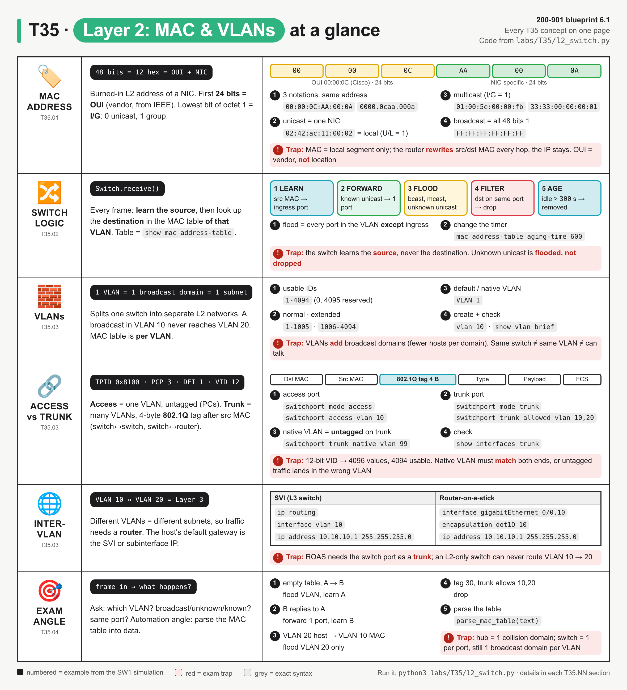
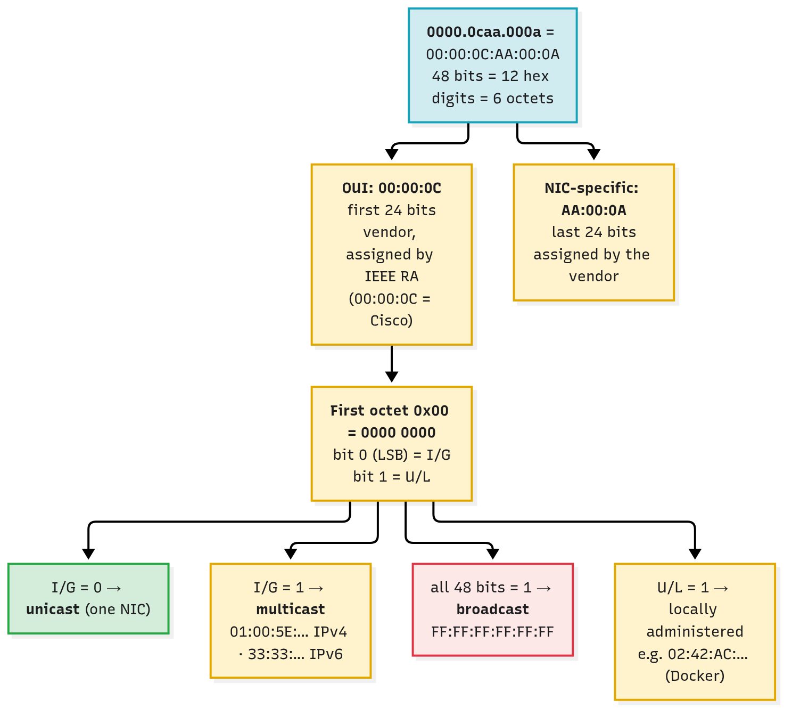
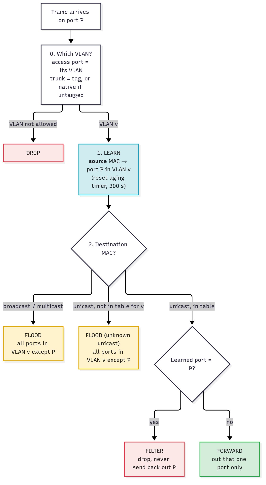
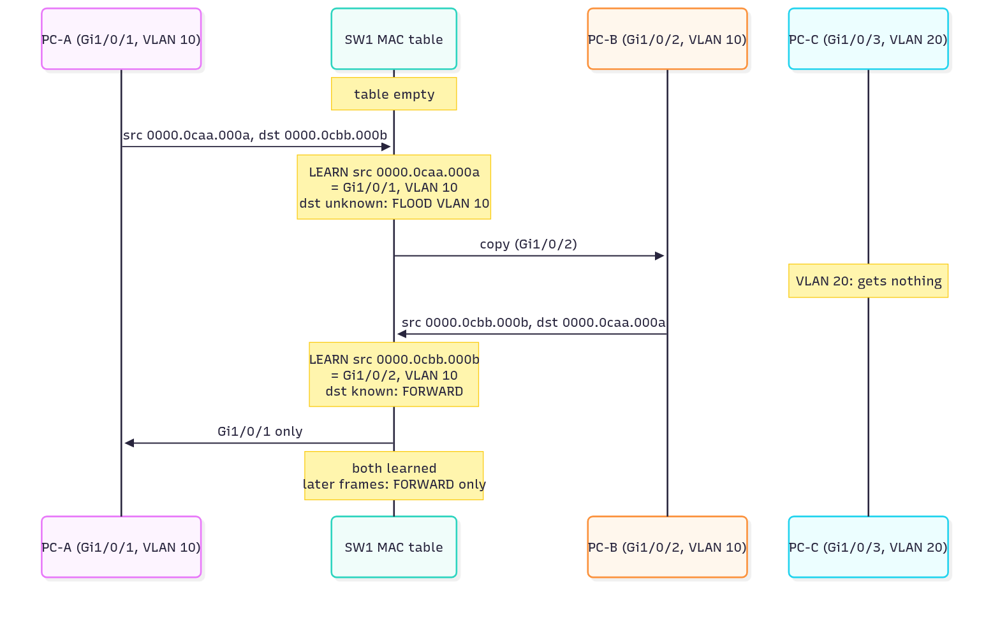
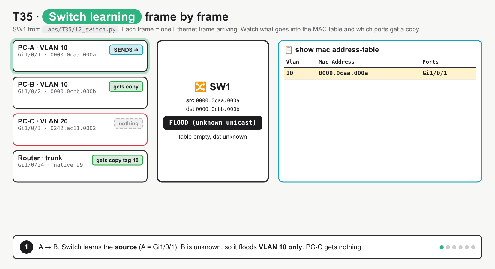
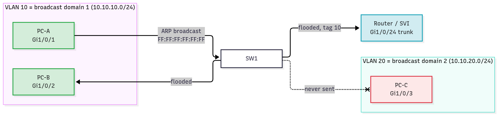
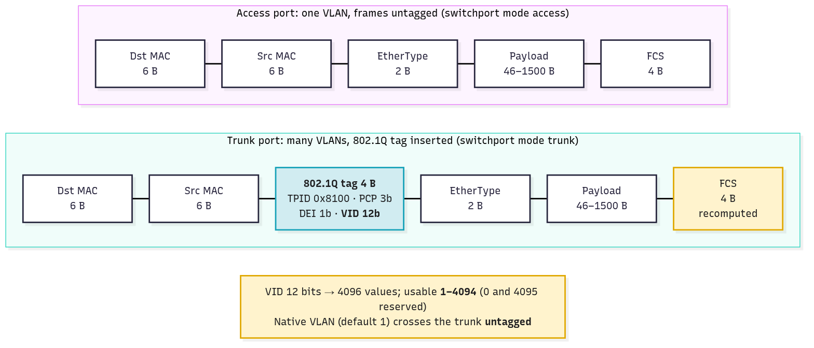
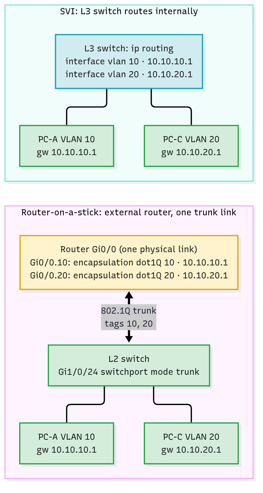

# T35 · Layer 2: MAC, VLANs

> Owner: **Bob** · Blueprint: **6.1** · CBT coverage: **Full** · Learn by 2026-10-06 · Teach-back 2026-10-08



*Every T35 concept on one page. Each row is a concept group (IDs under the icon), numbered items are examples from the SW1 simulation in `labs/T35/`, and red boxes are exam traps.*

## TL;DR (teach-back card)

- **MAC = 48 bits, 12 hex digits: first 24 bits = OUI (vendor), last 24 = NIC.** The lowest bit of the first octet (I/G) says unicast (0) or group (1). Broadcast = `FF:FF:FF:FF:FF:FF`.
- **A switch learns the *source* MAC → ingress port, then decides on the *destination*:** known unicast = forward out one port; broadcast, multicast or unknown unicast = flood the VLAN except the ingress port; destination on the same port = filter. Idle entries age out after 300 s (Cisco default).
- **VLAN = one broadcast domain (one subnet).** Access port = one VLAN, untagged. Trunk = many VLANs with a 4-byte 802.1Q tag (12-bit VID, usable 1–4094); the native VLAN goes untagged. VLAN-to-VLAN traffic needs Layer 3: an SVI or router-on-a-stick.
- **Trap:** the MAC table is **per VLAN**. A MAC learned in VLAN 10 is "unknown" to a frame in VLAN 20, so the switch floods VLAN 20. It never jumps VLANs, and a router is the only way across.

## Concepts

The whole topic is one question: *"A frame arrives on port X. What does the switch do?"* A small simulator answers it.

- `labs/T35/l2_switch.py` is the **reference program**: a VLAN-aware switch called SW1, written with the Python standard library only.
- It classifies MAC addresses, learns, forwards, floods, filters, ages, tags with 802.1Q, and parses a real `show mac address-table` capture (`labs/T35/show_mac_address_table.txt`).
- To run it: `python3 labs/T35/l2_switch.py`. Each `### T35.NN` section below points at the part of the program that shows that concept.

**Lab topology (SW1)**

| Port | Mode | VLAN(s) | Attached |
|---|---|---|---|
| `Gi1/0/1` | access | 10 | PC-A `0000.0caa.000a` and PC-D `0000.0cdd.000d` (both behind a hub) |
| `Gi1/0/2` | access | 10 | PC-B `0000.0cbb.000b` |
| `Gi1/0/3` | access | 20 | PC-C `0242.ac11.0002` |
| `Gi1/0/24` | trunk | allowed 10, 20, 99 · native 99 | router-on-a-stick `0000.0c99.0001` |

**`labs/T35/l2_switch.py`**

```python
"""T35 reference program: a VLAN-aware Layer 2 switch, in about 150 lines.

Run:  python3 labs/T35/l2_switch.py
Python stdlib only. Every exam question "what does the switch do with this frame?"
is one call to Switch.receive() below.
"""
import re

OUI_DB = {"00000C": "Cisco Systems"}            # tiny stand-in for the IEEE OUI registry
BROADCAST = "ffff.ffff.ffff"


def normalise(mac):
    """Any of aa:bb:cc:dd:ee:ff, AA-BB-CC-DD-EE-FF, aabb.ccdd.eeff -> Cisco dotted form."""
    digits = re.sub(r"[^0-9a-fA-F]", "", mac).lower()
    if len(digits) != 12:                        # 12 hex digits x 4 bits = 48 bits
        raise ValueError(f"not a 48-bit MAC: {mac}")
    return f"{digits[0:4]}.{digits[4:8]}.{digits[8:12]}"


def classify_mac(mac):
    """Split a MAC into OUI + NIC part and read the two special bits of the first octet."""
    mac = normalise(mac)
    digits = mac.replace(".", "")
    first_octet = int(digits[0:2], 16)
    if mac == BROADCAST:
        cast = "broadcast"
    elif first_octet & 0b01:                     # I/G bit (LSB of octet 1): 1 = group
        cast = "multicast"
    else:
        cast = "unicast"
    admin = "local" if first_octet & 0b10 else "universal"   # U/L bit (2nd LSB)
    oui = digits[0:6].upper()
    return {"mac": mac, "oui": oui, "nic": digits[6:].upper(), "cast": cast,
            "admin": admin, "vendor": OUI_DB.get(oui, "-")}


def dot1q_tag(vlan, pcp=0, dei=0):
    """The 4-byte 802.1Q tag inserted after the source MAC: TPID 0x8100 + PCP(3) DEI(1) VID(12)."""
    if not 1 <= vlan <= 4094:                    # 0 and 4095 are reserved
        raise ValueError(f"VLAN {vlan} outside 1-4094")
    tci = (pcp << 13) | (dei << 12) | vlan
    return (0x8100).to_bytes(2, "big") + tci.to_bytes(2, "big")


class Switch:
    def __init__(self, name, ports, aging_time=300):
        self.name = name
        self.ports = ports                       # {port: {"mode": "access"|"trunk", ...}}
        self.aging_time = aging_time             # Cisco default: 300 seconds
        self.table = {}                          # {(vlan, mac): (port, last_seen)}

    def ingress_vlan(self, port, tag):
        """Which VLAN does an arriving frame belong to? None = drop."""
        cfg = self.ports[port]
        if cfg["mode"] == "access":
            return cfg["vlan"] if tag is None else None      # access ports expect untagged
        vlan = cfg["native"] if tag is None else tag         # trunk: untagged = native VLAN
        return vlan if vlan in cfg["allowed"] else None

    def egress(self, port, vlan):
        """How does the frame leave this port? Tagged on a trunk unless it is the native VLAN."""
        cfg = self.ports[port]
        if cfg["mode"] == "access":
            return f"{port} (untagged)" if cfg["vlan"] == vlan else None
        if vlan not in cfg["allowed"]:
            return None
        return f"{port} (untagged, native)" if vlan == cfg["native"] else f"{port} (tag {vlan})"

    def receive(self, port, src, dst, now, tag=None):
        """Learn, then forward / flood / filter. Returns (action, list of egress ports)."""
        src, dst = normalise(src), normalise(dst)
        vlan = self.ingress_vlan(port, tag)
        if vlan is None:
            return "DROP (VLAN not allowed on port)", []
        self.table[(vlan, src)] = (port, now)    # 1. LEARN the SOURCE MAC -> ingress port
        self.age(now)

        if classify_mac(dst)["cast"] != "unicast":
            action = f"FLOOD ({classify_mac(dst)['cast']})"   # 2. broadcast / multicast
            out_ports = [p for p in self.ports if p != port]
        elif (vlan, dst) not in self.table:
            action = "FLOOD (unknown unicast)"                # 3. destination not learned yet
            out_ports = [p for p in self.ports if p != port]
        else:
            known_port = self.table[(vlan, dst)][0]
            if known_port == port:
                return f"FILTER (dst is on {port}, same port)", []   # 4. never send back
            action = "FORWARD (known unicast)"                # 5. one port only
            out_ports = [known_port]
        egress = [e for e in (self.egress(p, vlan) for p in out_ports) if e]
        return f"vlan {vlan}: {action}", egress

    def age(self, now):
        """Remove dynamic entries not refreshed within aging_time seconds."""
        for key, (_, last_seen) in list(self.table.items()):
            if now - last_seen > self.aging_time:
                del self.table[key]

    def show_mac_address_table(self):
        lines = ["          Mac Address Table", "-------------------------------------------",
                 "Vlan    Mac Address       Type        Ports", "----    -----------       --------    -----"]
        for (vlan, mac), (port, _) in sorted(self.table.items()):
            lines.append(f"{vlan:>4}    {mac}    DYNAMIC     {port}")
        lines.append(f"Total Mac Addresses for this criterion: {len(self.table)}")
        return "\n".join(lines)


def parse_mac_table(text):
    """Turn 'show mac address-table' text (real IOS XE output) into dicts: the automation angle."""
    row = re.compile(r"^\s*(\d+)\s+([0-9a-f]{4}\.[0-9a-f]{4}\.[0-9a-f]{4})\s+(\S+)\s+(\S+)", re.M)
    return [{"vlan": int(v), "mac": m, "type": t, "port": p} for v, m, t, p in row.findall(text)]


PC_A, PC_D = "00:00:0C:AA:00:0A", "00-00-0C-DD-00-0D"   # both behind Gi1/0/1 (via a hub)
PC_B, PC_C = "0000.0cbb.000b", "02:42:ac:11:00:02"      # PC_C: Docker-style local MAC
ROUTER = "0000.0c99.0001"                                # router-on-a-stick on the trunk


def main():
    print("== 1. MAC address anatomy ==")
    for mac in (PC_A, PC_C, "01:00:5e:00:00:fb", "33:33:00:00:00:01", "FF:FF:FF:FF:FF:FF"):
        c = classify_mac(mac)
        print(f"{mac:<18} -> {c['mac']}  OUI {c['oui']} ({c['vendor']})  "
              f"NIC {c['nic']}  {c['cast']:<9} {c['admin']}")

    sw = Switch("SW1", {
        "Gi1/0/1":  {"mode": "access", "vlan": 10},     # PC-A and PC-D (hub)
        "Gi1/0/2":  {"mode": "access", "vlan": 10},     # PC-B
        "Gi1/0/3":  {"mode": "access", "vlan": 20},     # PC-C
        "Gi1/0/24": {"mode": "trunk", "allowed": {10, 20, 99}, "native": 99},  # to router
    })

    print("\n== 2. What the switch does with each frame ==")
    frames = [
        ("A -> B, table empty",          "Gi1/0/1",  PC_A, PC_B, 0, None),
        ("B -> A, reply",                "Gi1/0/2",  PC_B, PC_A, 1, None),
        ("A -> B again",                 "Gi1/0/1",  PC_A, PC_B, 2, None),
        ("A -> broadcast (ARP request)", "Gi1/0/1",  PC_A, BROADCAST, 3, None),
        ("D -> A, same hub port",        "Gi1/0/1",  PC_D, PC_A, 4, None),
        ("C (VLAN 20) -> A's MAC",       "Gi1/0/3",  PC_C, PC_A, 5, None),
        ("router -> C, tagged 20",       "Gi1/0/24", ROUTER, PC_C, 6, 20),
        ("untagged frame on trunk",      "Gi1/0/24", ROUTER, BROADCAST, 7, None),
        ("tag 30 on trunk",              "Gi1/0/24", ROUTER, PC_A, 8, 30),
        ("A -> mDNS multicast",          "Gi1/0/1",  PC_A, "01:00:5e:00:00:fb", 9, None),
    ]
    for label, port, src, dst, t, tag in frames:
        action, out = sw.receive(port, src, dst, now=t, tag=tag)
        print(f"t={t:<3} {label:<29} in {port:<8} -> {action}")
        for e in out:
            print(f"{'':39}out {e}")
        if action.startswith("vlan") and not out:
            print(f"{'':39}out (none: no other port in that VLAN)")

    print(f"\n== 3. {sw.name}# show mac address-table (t=9) ==")
    print(sw.show_mac_address_table())

    sw.age(now=306)                               # entries last seen at t<=5 are now > 300 s old
    print("\n== 4. After aging (t=306, aging-time 300) ==")
    print(sw.show_mac_address_table())

    print("\n== 5. 802.1Q tag on the wire ==")
    for vlan, pcp in ((10, 0), (20, 5), (4094, 0)):
        tag = dot1q_tag(vlan, pcp)
        tci = int.from_bytes(tag[2:], "big")
        print(f"VLAN {vlan:<4} PCP {pcp}: {tag.hex(' ')}  -> TPID 0x{tag[:2].hex()} "
              f"PCP {tci >> 13} DEI {(tci >> 12) & 1} VID {tci & 0xFFF}")
    try:
        dot1q_tag(4095)
    except ValueError as err:
        print(f"VLAN 4095: ValueError: {err}")

    print("\n== 6. Parse real 'show mac address-table' text ==")
    with open(__file__.replace("l2_switch.py", "show_mac_address_table.txt")) as f:
        for entry in parse_mac_table(f.read()):
            print(entry)


if __name__ == "__main__":
    main()
```

**Output** (`python3 labs/T35/l2_switch.py`):

```
== 1. MAC address anatomy ==
00:00:0C:AA:00:0A  -> 0000.0caa.000a  OUI 00000C (Cisco Systems)  NIC AA000A  unicast   universal
02:42:ac:11:00:02  -> 0242.ac11.0002  OUI 0242AC (-)  NIC 110002  unicast   local
01:00:5e:00:00:fb  -> 0100.5e00.00fb  OUI 01005E (-)  NIC 0000FB  multicast universal
33:33:00:00:00:01  -> 3333.0000.0001  OUI 333300 (-)  NIC 000001  multicast local
FF:FF:FF:FF:FF:FF  -> ffff.ffff.ffff  OUI FFFFFF (-)  NIC FFFFFF  broadcast local

== 2. What the switch does with each frame ==
t=0   A -> B, table empty           in Gi1/0/1  -> vlan 10: FLOOD (unknown unicast)
                                       out Gi1/0/2 (untagged)
                                       out Gi1/0/24 (tag 10)
t=1   B -> A, reply                 in Gi1/0/2  -> vlan 10: FORWARD (known unicast)
                                       out Gi1/0/1 (untagged)
t=2   A -> B again                  in Gi1/0/1  -> vlan 10: FORWARD (known unicast)
                                       out Gi1/0/2 (untagged)
t=3   A -> broadcast (ARP request)  in Gi1/0/1  -> vlan 10: FLOOD (broadcast)
                                       out Gi1/0/2 (untagged)
                                       out Gi1/0/24 (tag 10)
t=4   D -> A, same hub port         in Gi1/0/1  -> FILTER (dst is on Gi1/0/1, same port)
t=5   C (VLAN 20) -> A's MAC        in Gi1/0/3  -> vlan 20: FLOOD (unknown unicast)
                                       out Gi1/0/24 (tag 20)
t=6   router -> C, tagged 20        in Gi1/0/24 -> vlan 20: FORWARD (known unicast)
                                       out Gi1/0/3 (untagged)
t=7   untagged frame on trunk       in Gi1/0/24 -> vlan 99: FLOOD (broadcast)
                                       out (none: no other port in that VLAN)
t=8   tag 30 on trunk               in Gi1/0/24 -> DROP (VLAN not allowed on port)
t=9   A -> mDNS multicast           in Gi1/0/1  -> vlan 10: FLOOD (multicast)
                                       out Gi1/0/2 (untagged)
                                       out Gi1/0/24 (tag 10)

== 3. SW1# show mac address-table (t=9) ==
          Mac Address Table
-------------------------------------------
Vlan    Mac Address       Type        Ports
----    -----------       --------    -----
  10    0000.0caa.000a    DYNAMIC     Gi1/0/1
  10    0000.0cbb.000b    DYNAMIC     Gi1/0/2
  10    0000.0cdd.000d    DYNAMIC     Gi1/0/1
  20    0000.0c99.0001    DYNAMIC     Gi1/0/24
  20    0242.ac11.0002    DYNAMIC     Gi1/0/3
  99    0000.0c99.0001    DYNAMIC     Gi1/0/24
Total Mac Addresses for this criterion: 6

== 4. After aging (t=306, aging-time 300) ==
          Mac Address Table
-------------------------------------------
Vlan    Mac Address       Type        Ports
----    -----------       --------    -----
  10    0000.0caa.000a    DYNAMIC     Gi1/0/1
  20    0000.0c99.0001    DYNAMIC     Gi1/0/24
  99    0000.0c99.0001    DYNAMIC     Gi1/0/24
Total Mac Addresses for this criterion: 3

== 5. 802.1Q tag on the wire ==
VLAN 10   PCP 0: 81 00 00 0a  -> TPID 0x8100 PCP 0 DEI 0 VID 10
VLAN 20   PCP 5: 81 00 a0 14  -> TPID 0x8100 PCP 5 DEI 0 VID 20
VLAN 4094 PCP 0: 81 00 0f fe  -> TPID 0x8100 PCP 0 DEI 0 VID 4094
VLAN 4095: ValueError: VLAN 4095 outside 1-4094

== 6. Parse real 'show mac address-table' text ==
{'vlan': 10, 'mac': '0000.0caa.000a', 'type': 'DYNAMIC', 'port': 'Gi1/0/1'}
{'vlan': 10, 'mac': '0000.0cbb.000b', 'type': 'DYNAMIC', 'port': 'Gi1/0/2'}
{'vlan': 10, 'mac': '0000.0cdd.000d', 'type': 'DYNAMIC', 'port': 'Gi1/0/1'}
{'vlan': 20, 'mac': '0242.ac11.0002', 'type': 'DYNAMIC', 'port': 'Gi1/0/3'}
{'vlan': 20, 'mac': '0000.0c99.0001', 'type': 'DYNAMIC', 'port': 'Gi1/0/24'}
{'vlan': 99, 'mac': '0000.0c99.0001', 'type': 'DYNAMIC', 'port': 'Gi1/0/24'}
```

### T35.01 · MAC addresses

**Must cover:**

- [x] 48-bit, hex; first 24 bits = OUI (vendor)
- [x] Unicast, multicast, broadcast (FF:FF:FF:FF:FF:FF)

**Notes:**



*The yellow OUI half comes from the IEEE; the vendor picks the NIC half. Two bits of the first octet decide the address type.*

- **48 bits = 6 octets = 12 hex digits.** One hex digit = 4 bits.
  - Three notations, same address: `00:00:0C:AA:00:0A` (IEEE/Linux), `00-00-0C-AA-00-0A` (Windows), `0000.0caa.000a` (Cisco IOS).
  - `normalise()` strips the separators and checks there are exactly 12 hex digits. The output in section 1 shows all of them reduced to Cisco dotted form.
- **OUI** (Organizationally Unique Identifier) = the **first 24 bits**. The IEEE Registration Authority assigns it to a vendor. `00:00:0C` = Cisco.
  - The last 24 bits are vendor-assigned (NIC-specific).
  - OUI identifies the **manufacturer**, not the location or the VLAN.
- **Two special bits in the first octet** (from the IEEE OUI tutorial):
  - **I/G bit** = least significant bit of octet 1. `0` = individual (**unicast**), `1` = group (**multicast**). `classify_mac()` checks `first_octet & 0b01`.
  - **U/L bit** = second least significant bit. `0` = universally administered (burned-in), `1` = locally administered (set by software). `02:42:ac:…` is the Docker default range: unicast but local.

| Type | Meaning | Example | Switch action |
|---|---|---|---|
| Unicast | one NIC, I/G = 0 | `0000.0caa.000a` | forward if known, flood if unknown |
| Multicast | group, I/G = 1 | `01:00:5E:xx:xx:xx` (IPv4), `33:33:xx:xx:xx:xx` (IPv6) | flood in the VLAN (unless IGMP/MLD snooping prunes it) |
| Broadcast | all hosts, all 48 bits = 1 | `FF:FF:FF:FF:FF:FF` | always flood in the VLAN |

- **Broadcast is a special multicast**: its I/G bit is 1 too. That's why section 1 of the output reports its U/L bit as `local`: every bit is 1. The U/L bit only means something for unicast.
- **A source MAC is always unicast.** Multicast and broadcast only ever appear as the **destination**.
- **MAC addresses are local to one L2 segment.** A router rewrites the source and destination MAC at every hop; the IP addresses stay the same end to end (see [T36](T36-layer-3-ip-masks-routes-gateways.md)). ARP maps IP → MAC inside the subnet ([T37](T37-transport-ports-ip-services.md)).

### T35.02 · Switching

**Must cover:**

- [x] Learn source MAC → port; forward known unicast; flood broadcast/unknown unicast; filter same-port; MAC table aging

**Notes:**



*Every frame goes through the same steps: pick the VLAN, learn the source, then one of four outcomes for the destination.*

- `Switch.receive()` is this flowchart in code. The five actions, mapped to section 2 of the output:

| Action | When | In the output |
|---|---|---|
| **Learn** | every frame: `(VLAN, source MAC) → ingress port`, timestamp refreshed | `self.table[(vlan, src)] = (port, now)`. The table in section 3 is built only from source addresses |
| **Forward** | destination unicast **and** in the table for that VLAN | `t=1` B → A goes out `Gi1/0/1` only |
| **Flood** | destination broadcast, multicast **or unknown unicast** | `t=0` (unknown), `t=3` (broadcast), `t=9` (multicast): every VLAN 10 port except `Gi1/0/1` |
| **Filter** | destination learned on the **same port** the frame came in on | `t=4` PC-D → PC-A, both behind the hub on `Gi1/0/1`: dropped, nothing sent |
| **Age** | entry not refreshed for longer than the aging time | section 4: at `t=306`, PC-B, PC-C and PC-D are gone; PC-A (refreshed at `t=9`) and the router stay |

- **Flood ≠ broadcast.** Flood = the switch's action (copy out every port in the VLAN except ingress). Broadcast = a destination address. An unknown **unicast** is flooded too.
- **Learning uses the source, never the destination.** That's why the first frame (`t=0`) is flooded and the reply (`t=1`) is forwarded.



*The first frame floods because B is unknown. B's reply teaches the switch where B lives. PC-C, in VLAN 20, sees neither.*



*Six frames: A → B flood, B → A forward, A → B forward, ARP broadcast flood, VLAN 20 host floods only VLAN 20, then aging. It fixes two misconceptions: "the switch learns the destination" and "a flood reaches every port on the switch".*

- **Aging:** dynamic entries are removed when idle for longer than the aging time. The Cisco default is **300 seconds**. Change it with `mac address-table aging-time <0 | 10-1000000> [vlan <id>]` (`0` disables aging). Static entries never age.
- **Moves:** if a known MAC shows up as a source on a different port, the entry is updated to the new port (in the program, the dictionary key is simply overwritten).
- **Collision vs broadcast domains:** each switch port is its own collision domain. Each VLAN is one broadcast domain. A hub is one collision domain for all its ports, which is why PC-A and PC-D share `Gi1/0/1`.

### T35.03 · VLANs

**Must cover:**

- [x] Separate L2 broadcast domain per VLAN
- [x] Access port (one VLAN) vs trunk (many VLANs, 802.1Q tag, 12-bit VLAN ID 1-4094, native VLAN untagged)
- [x] Inter-VLAN traffic needs L3 (SVI or router-on-a-stick)

**Notes:**



*PC-A's ARP broadcast reaches PC-B and the trunk (tagged 10), never PC-C in VLAN 20.*

**Broadcast domains**

- **VLAN = a separate L2 broadcast domain** on the same physical switch. In practice it's also **one IP subnet**.
- The MAC table key is `(vlan, mac)`, so the same MAC can be learned separately in two VLANs. In section 3 of the output, the router `0000.0c99.0001` appears in both VLAN 20 and VLAN 99.
- `t=5` in the output: PC-C (VLAN 20) sends to PC-A's MAC. PC-A is known in **VLAN 10**, but not in VLAN 20, so the switch floods VLAN 20 (only the trunk). It never crosses into VLAN 10.
- **Why VLANs:** smaller broadcast domains, segmentation/security (e.g. voice, cameras, guests), and grouping by function instead of location.

**VLAN IDs (Catalyst IOS XE)**

| Range | IDs | Notes |
|---|---|---|
| Reserved | 0, 4095 | not usable (802.1Q) |
| Normal | 1–1005 | VLAN 1 = default VLAN and default native VLAN; 1002–1005 are reserved legacy (FDDI/Token Ring) |
| Extended | 1006–4094 | ⚠ verify the VTP-mode requirements on your platform |

**Access vs trunk**



*The 4-byte 802.1Q tag sits between the source MAC and the EtherType. The FCS is recomputed because the frame changed.*

| | Access port | Trunk port |
|---|---|---|
| VLANs | exactly one | many (allowed list) |
| Frames | untagged | 802.1Q tagged, except the native VLAN |
| Connects | end hosts (PC, printer, AP in local mode) | switch ↔ switch, switch ↔ router, switch ↔ hypervisor |
| IOS XE | `switchport mode access` + `switchport access vlan 10` | `switchport mode trunk` + `switchport trunk allowed vlan 10,20` |
| In the program | `ingress_vlan()` returns the port's VLAN; a tagged frame is dropped | `ingress_vlan()` returns the tag, or `native` if untagged; a VLAN not on the allowed list → drop |

- **802.1Q tag = 4 bytes:** TPID `0x8100` (16 bits, marks the frame as tagged) + PCP (3 bits, 802.1p priority/CoS) + DEI (1 bit; it was CFI) + **VID (12 bits)**.
  - `dot1q_tag()` builds it. Section 5 of the output: VLAN 10 → `81 00 00 0a`; VLAN 20 with PCP 5 → `81 00 a0 14`.
  - 12 bits → 4096 values. 0 and 4095 are reserved, so **1–4094** are usable. `dot1q_tag(4095)` raises `ValueError`.
- **Native VLAN** = the one VLAN a trunk sends and receives **untagged**. The default is VLAN 1. Change it with `switchport trunk native vlan 99`.
  - In the program: `t=7` an untagged frame on the trunk lands in VLAN 99. `egress()` prints `(untagged, native)` for it.
  - **Native VLAN mismatch** (99 on one end, 1 on the other): untagged frames end up in a different VLAN on each side. CDP reports the mismatch.
- **Allowed list:** `t=8`, a frame tagged 30 arrives on a trunk that allows 10, 20 and 99, so it's dropped.
- Verify: `show vlan brief` (access ports per VLAN; trunks aren't listed), `show interfaces trunk` (mode, native VLAN, allowed and active VLANs), `show mac address-table [vlan 10 | interface Gi1/0/1]`.

**Inter-VLAN routing = Layer 3**



*Both give each VLAN a default-gateway IP. The SVI does it inside an L3 switch; router-on-a-stick uses one 802.1Q trunk to an external router.*

- Different VLANs = different subnets, so a host sends off-subnet traffic to its **default gateway**. Something has to route.

| | SVI (switched virtual interface) | Router-on-a-stick (ROAS) |
|---|---|---|
| Where | inside a multilayer (L3) switch | external router, one physical link |
| Config | `ip routing` · `interface vlan 10` · `ip address 10.10.10.1 255.255.255.0` | `interface gigabitEthernet 0/0.10` · `encapsulation dot1Q 10` · `ip address 10.10.10.1 255.255.255.0` |
| Switch side | nothing extra | the switch port to the router must be a **trunk** |
| Native VLAN on the router | n/a | `encapsulation dot1Q 99 native` |
| Trade-off | wire-speed, no extra box | cheap, but every inter-VLAN packet crosses one link twice |

- In the program, `t=6` is the router side of ROAS: the router sends the frame into VLAN 20 tagged `20`; SW1 removes the tag and forwards it untagged out the access port `Gi1/0/3`.

### T35.04 · Exam angle

**Must cover:**

- [x] Purpose/usage questions; what a switch does with a frame

**Notes:**

- **"What does the switch do with this frame?"** Ask four questions, in the order `receive()` does:
  1. Which VLAN? (access port VLAN, trunk tag, native if untagged, drop if not allowed)
  2. Learn the source.
  3. Is the destination broadcast/multicast → flood. Unknown unicast → flood.
  4. Known: same port → filter, else forward out one port.
- **Purpose questions:**

| Question | Answer |
|---|---|
| What does a switch use to build its MAC table? | the **source** MAC of incoming frames |
| What reduces the size of a broadcast domain? | VLANs (or routers) |
| What carries several VLANs over one link? | an 802.1Q trunk |
| Which VLAN is untagged on an 802.1Q trunk? | the native VLAN (default 1) |
| How do hosts in VLAN 10 and VLAN 20 talk? | a Layer 3 device: SVI on an L3 switch, or router-on-a-stick |
| Which part of a MAC identifies the vendor? | the first 24 bits (OUI) |
| How many usable VLAN IDs? | 4094 (1–4094) |

- **Automation angle (D6 meets D3/D5):** you rarely read the MAC table by eye in automation. You parse it. `parse_mac_table()` turns the captured CLI text into a list of dicts with a regex, and skips the `All … CPU` static rows. With structured APIs you skip parsing entirely: NETCONF/RESTCONF ([T15](T15-netconf.md), [T16](T16-restconf.md)) or pyATS/Genie parsers return the same data as structured objects.

## Exam traps

- **Source vs destination:** the switch *learns* from the **source** MAC and *forwards* on the **destination** MAC.
- **Unknown unicast is flooded, not dropped.** Only a frame whose destination is on the ingress port is filtered (dropped).
- **Flood scope = one VLAN, minus the ingress port.** It never reaches other VLANs, and never goes back out the port it came in on.
- **MAC table is per VLAN.** Same MAC in two VLANs = two entries. "Known in VLAN 10" doesn't help a VLAN 20 frame.
- **VLAN ID is 12 bits → 4096 values, 4094 usable (1–4094).** The full 802.1Q tag is **4 bytes (32 bits)**; the TPID is `0x8100`.
- **Native VLAN = untagged**, default **VLAN 1**. Both trunk ends must agree.
- **Access = one VLAN, untagged. Trunk = many VLANs, tagged.** The router-facing port for ROAS must be a trunk.
- **VLAN-to-VLAN needs Layer 3.** An L2 switch alone can never forward VLAN 10 → VLAN 20, whatever the MAC table says.
- **OUI = first 24 bits = vendor.** Not the last 24 bits, and not the location.
- **Multicast = I/G bit set** (lowest bit of the first octet), e.g. `01:00:5E…`. Broadcast = all ones. A source MAC is always unicast.
- **More VLANs = more (smaller) broadcast domains.** A switch port = one collision domain; a hub = one shared collision domain.
- **Aging default 300 s.** Static entries never age.

## Examples

### 1. Run the reference program

Needs only Python 3. Nothing to install, and no switch or sandbox needed.

```bash
python3 labs/T35/l2_switch.py
```

In the lab container:

```bash
docker build --tag ccna-auto-lab:latest --file labs/Dockerfile labs/
docker run --rm --volume "$(pwd)":/work --workdir /work ccna-auto-lab:latest python3 labs/T35/l2_switch.py
```

### 2. Break it on purpose

Edit `labs/T35/l2_switch.py`, run `python3 labs/T35/l2_switch.py`, and then `git checkout -- labs/T35/l2_switch.py` to undo. All three were run on a copy, and the lines shown are the real output.

| Edit | First changed output | Lesson |
|---|---|---|
| In `receive()`, change `self.table[(vlan, src)] = (port, now)` to `self.table[(vlan, dst)] = (port, now)` | `t=0   A -> B, table empty           in Gi1/0/1  -> FILTER (dst is on Gi1/0/1, same port)`, and `t=1`, `t=2` are also filtered | learning the **destination** breaks everything: the switch "learns" B on A's port and drops the frame |
| In `ingress_vlan()`, change `vlan = cfg["native"] if tag is None else tag` to `vlan = 1 if tag is None else tag` | `t=7   untagged frame on trunk       in Gi1/0/24 -> DROP (VLAN not allowed on port)` | native VLAN mismatch: untagged frames land in VLAN 1, which isn't on this trunk |
| In `receive()`, change the first `out_ports = [p for p in self.ports if p != port]` (the broadcast/multicast branch) to `out_ports = list(self.ports)` | after `t=3`: an extra `out Gi1/0/1 (untagged)` line | a flood must **exclude the ingress port**, or the sender gets its own broadcast back |

### 3. Drill: classify by hand, then check

Work out unicast/multicast/broadcast and the OUI for each address, then check with the program's function:

```bash
python3 -c "
import sys; sys.path.insert(0, 'labs/T35')
from l2_switch import classify_mac
for mac in ('0100.0ccc.cccc', '01:80:C2:00:00:00', '00-1A-2B-3C-4D-5E', 'ffff.ffff.ffff'):
    c = classify_mac(mac)
    print(mac, '->', c['oui'], c['cast'], c['admin'])
"
```

```
0100.0ccc.cccc -> 01000C multicast universal
01:80:C2:00:00:00 -> 0180C2 multicast universal
00-1A-2B-3C-4D-5E -> 001A2B unicast universal
ffff.ffff.ffff -> FFFFFF broadcast local
```

- `0100.0ccc.cccc` = the Cisco multicast address used by CDP/VTP/DTP. `01:80:C2:00:00:00` = the IEEE STP bridge-group address. Both appear as `STATIC CPU` rows in `labs/T35/show_mac_address_table.txt`.

### 4. Reference IOS XE config (not run: no switch in this session)

The SW1 topology as real Catalyst configuration:

```
configure terminal
vlan 10
 name USERS
vlan 20
 name CAMERAS
vlan 99
 name NATIVE
interface GigabitEthernet1/0/1
 switchport mode access
 switchport access vlan 10
interface GigabitEthernet1/0/3
 switchport mode access
 switchport access vlan 20
interface GigabitEthernet1/0/24
 switchport mode trunk
 switchport trunk native vlan 99
 switchport trunk allowed vlan 10,20,99
mac address-table aging-time 300
end
show vlan brief
show interfaces trunk
show mac address-table vlan 10
```

## Practice questions

**Q1.** A switch has just booted and its MAC table is empty. Host A on port Gi1/0/1 (VLAN 10) sends a unicast frame to host B on Gi1/0/2 (VLAN 10). What does the switch do? (Choose two.)
A. Adds B's MAC to the table on Gi1/0/2  B. Adds A's MAC to the table on Gi1/0/1  C. Drops the frame because B is unknown  D. Floods the frame out all VLAN 10 ports except Gi1/0/1  E. Floods the frame out every port on the switch

<details><summary>Answer</summary>

**B, D.** The switch learns the **source** (A) and floods the unknown unicast within VLAN 10 only, never back out the ingress port. B is only learned when B sends something. (T35.02)
</details>

**Q2.** Which part of the MAC address `00:1B:54:3A:7F:10` identifies the manufacturer?
A. `3A:7F:10`  B. `00:1B:54`  C. `00:1B`  D. `7F:10`

<details><summary>Answer</summary>

**B.** The OUI is the first 24 bits (first 3 octets). The last 3 octets are assigned by the vendor. (T35.01)
</details>

**Q3.** How many bits make up the VLAN ID in an 802.1Q tag, and what is the usable range?
A. 10 bits, 1–1023  B. 12 bits, 1–4094  C. 12 bits, 0–4095  D. 16 bits, 1–65535

<details><summary>Answer</summary>

**B.** 12 bits give 4096 values; 0 and 4095 are reserved. The whole tag is 4 bytes, but the VID is 12 bits. (T35.03)
</details>

**Q4.** Refer to the output:

```
  10    0000.0caa.000a    DYNAMIC     Gi1/0/1
  10    0000.0cdd.000d    DYNAMIC     Gi1/0/1
```

A frame from `0000.0cdd.000d` to `0000.0caa.000a` arrives on Gi1/0/1. What does the switch do?
A. Forwards it out Gi1/0/1  B. Floods it in VLAN 10  C. Filters (drops) it  D. Sends it to the default gateway

<details><summary>Answer</summary>

**C.** The destination is learned on the same port the frame came in on (both hosts are behind a hub or another switch on Gi1/0/1). The other device on that segment already received it, so the switch filters. (T35.02)
</details>

**Q5.** PC-A (VLAN 10, 10.10.10.10/24) can't ping PC-C (VLAN 20, 10.10.20.10/24). Both are on the same L2-only access switch, and the MAC table shows both MACs. What is missing?
A. A trunk between the two access ports  B. A Layer 3 device (SVI or router-on-a-stick) acting as the default gateway  C. A static MAC entry for PC-C in VLAN 10  D. A larger MAC aging time

<details><summary>Answer</summary>

**B.** Different VLANs are different broadcast domains and subnets. The traffic has to be routed, and the MAC table is per VLAN, so knowing PC-C's MAC in VLAN 20 doesn't help a VLAN 10 frame. (T35.03)
</details>

**Q6.** Complete the router-on-a-stick configuration so subinterface Gi0/0.20 routes VLAN 20:

```
interface gigabitEthernet 0/0.20
 ______________________
 ip address 10.10.20.1 255.255.255.0
```

<details><summary>Answer</summary>

**`encapsulation dot1Q 20`.** It ties the subinterface to 802.1Q tag 20. The switch port facing the router must be a trunk that allows VLAN 20. (T35.03)
</details>

**Q7.** Put the steps in the order a switch handles an arriving frame: forward/flood/filter on the destination · determine the VLAN · learn the source MAC · look up the destination MAC in that VLAN's table

<details><summary>Answer</summary>

Determine the VLAN → learn the source MAC → look up the destination MAC in that VLAN's table → forward / flood / filter. This is the order `Switch.receive()` uses. (T35.02, T35.04)
</details>

**Q8.** An untagged frame arrives on an 802.1Q trunk configured with `switchport trunk native vlan 99`. Which VLAN does the switch place it in?
A. VLAN 1  B. VLAN 99  C. None, it's dropped  D. The VLAN of the sender's access port

<details><summary>Answer</summary>

**B.** Untagged frames on a trunk belong to the native VLAN. VLAN 1 is only the default; here it was changed to 99. If the far end still uses native VLAN 1, that's a native VLAN mismatch. (T35.03)
</details>

## Study aids

| Aid | Type | Title | Est. min | Resource |
|---|---|---|---|---|
| T35.1 | Video | Describe How a Switch Performs Layer 2 Forwarding | 33 | CBT module |

- Skip / low priority: n/a

## Sources

- Overview image: HTML source `assets/T35/00-overview.html`, rendered to PNG (see `assets/README.md`). Diagrams: Mermaid sources in `assets/T35/*.mmd`. Animation: `assets/T35/07-learning-anim.html` → `07-learning.gif`.
- IEEE RA, Guidelines for Use of EUI, OUI and CID (OUI = 24 bits; I/G bit = LSB of octet 0, U/L bit = second LSB): https://standards-support.ieee.org/hc/en-us/articles/4888705676564-Guidelines-for-Use-of-Extended-Unique-Identifier-EUI-Organizationally-Unique-Identifier-OUI-and-Company-ID-CID
- IEEE RA FAQs (OUI is a 24-bit assigned number used to build EUI-48 MAC addresses): https://standards.ieee.org/faqs/regauth
- Cisco, Inter-Switch Link and IEEE 802.1Q Frame Format (4-byte tag, TPID 0x8100, 12-bit VID, FCS recomputed, native VLAN untagged): https://www.cisco.com/c/en/us/support/docs/lan-switching/8021q/17056-741-4.html
- Cisco Catalyst 9300 VLAN Configuration Guide, IOS XE 17.13 (normal 1–1005, extended 1006–4094, `vlan`, `switchport` commands): https://www.cisco.com/c/en/us/td/docs/switches/lan/catalyst9300/software/release/17-13/configuration_guide/vlan/b_1713_vlan_9300_cg/configuring_vlans.html
- Cisco Catalyst 9500, MAC address table / port security aging (default aging 300 s, range 10–1000000, 0 disables; static entries never age; learning from the source address): https://www.cisco.com/c/en/us/td/docs/switches/lan/catalyst9500/software/release/16-10/configuration_guide/sec/b_1610_sec_9500_cg/b_1610_sec_9500_cg_chapter_0101011.pdf
- Cisco, Configure Inter-VLAN Routing with an External Router (`encapsulation dot1Q 10`, `encapsulation dot1Q 1 native`): https://www.cisco.com/c/en/us/support/docs/lan-switching/inter-vlan-routing/14976-50.html
- Cisco Catalyst 9300, Configuring Layer 3 Subinterfaces (use the `native` keyword for the native VLAN subinterface): https://www.cisco.com/c/en/us/td/docs/switches/lan/catalyst9300/software/release/17-15/configuration_guide/vlan/b_1715_vlan_9300_cg/configuring_layer_3_subinterfaces.html
- Cisco ASR 9000 L2VPN guide (802.1Q VLAN IDs 1–4094; 0 and 4095 reserved): https://www.cisco.com/c/en/us/td/docs/routers/asr9000/software/26xx/l2vpn/configuration/guide/b-l2vpn-cg-asr9000-26xx/carrier-ethernet-model.html
- Cisco 200-901 v1.1 exam topics (6.1): https://learningcontent.cisco.com/documents/marketing/exam-topics/200-901-CCNAAUTO_v.1.1.pdf

## To verify

- ⚠ Extended-range VLANs (1006–4094): older platforms needed VTP transparent mode (or VTPv3) to create them. Check the current requirement for your platform's IOS XE release.
- ⚠ The reserved legacy VLANs 1002–1005 (FDDI/Token Ring defaults) are from prior knowledge, not from a source fetched this session.
- ⚠ `labs/T35/show_mac_address_table.txt` is hand-written to match the IOS XE `show mac address-table` layout. It wasn't captured from a live switch, and column spacing differs between platforms and releases. Check the regex in `parse_mac_table()` against real output (e.g. from a DevNet sandbox Catalyst 9000) before reusing it.
- The IOS XE config in Example 4 wasn't run: there was no switch or sandbox in this session.
- The Docker command in Example 1 wasn't run here. The program is stdlib-only, so it needs nothing beyond the existing image.
- The reference program, the drill and the three break-it edits were all run locally (Python 3.10), and the output shown is real.
- `classify_mac()` uses a one-entry OUI table (`00000C` = Cisco). Real lookups use the IEEE public listing.
