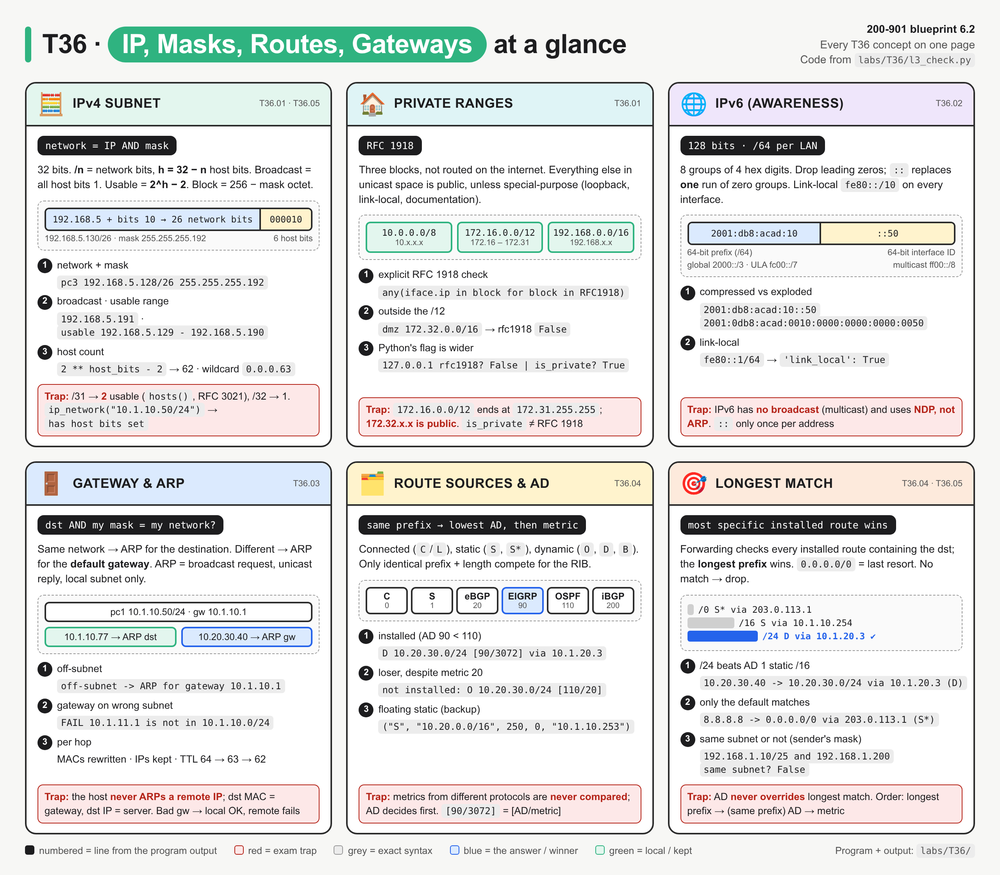
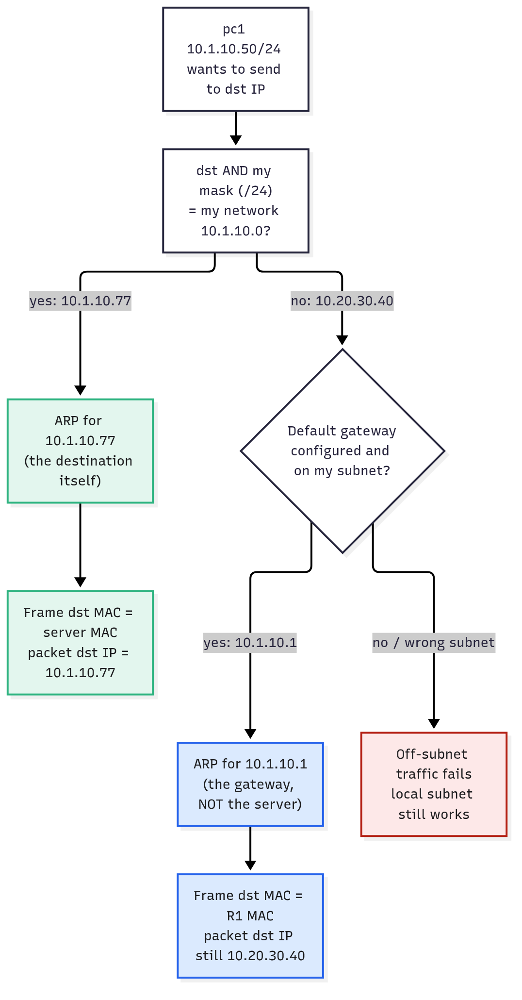
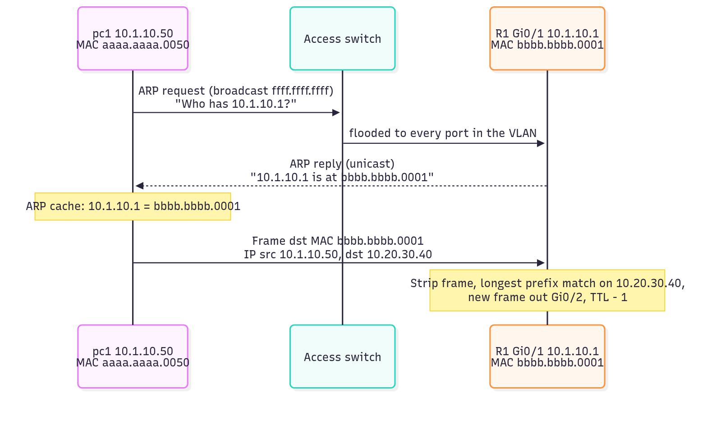
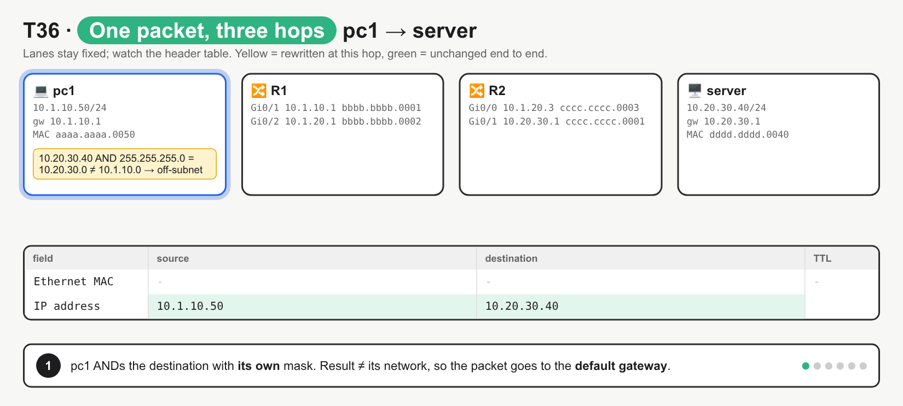
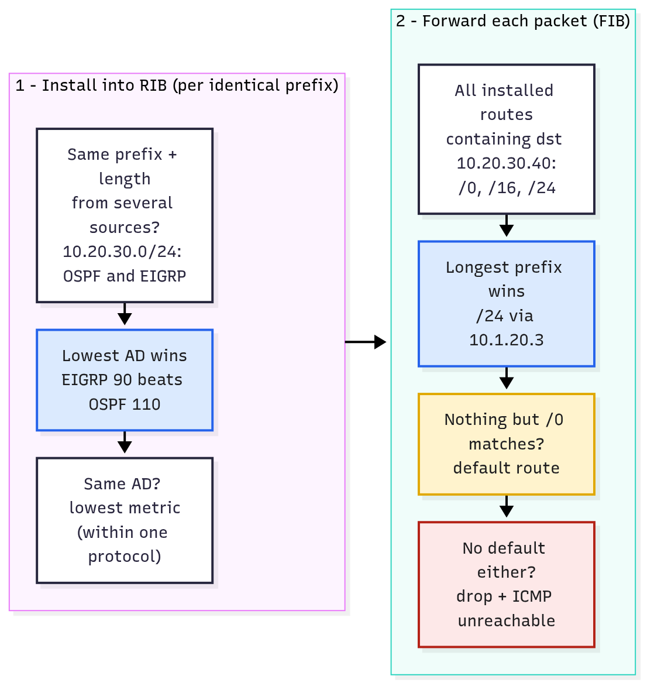

# T36 · Layer 3: IP, masks, routes, gateways

> Owner: **Bob** · Blueprint: **6.2** · CBT coverage: **Full** · Learn by 2026-10-06 · Teach-back 2026-10-08



*Every T36 concept on one page. Each card has the same parts: the rule (black pill), a mini diagram, numbered examples taken from `labs/T36/l3_check.py`, and a red exam trap.*

## TL;DR (teach-back card)

- **Mask splits network from host:** network = IP AND mask, broadcast = all host bits 1, usable = 2^h − 2 (except /31 = 2 and /32 = 1). RFC 1918 = `10/8`, `172.16/12` (up to 172.31), `192.168/16`.
- **Host decision:** destination AND **my** mask. Same network → ARP for the destination. Different → ARP for the **default gateway**. The dst IP never changes; only the frame's MAC does, hop by hop.
- **Router decision:** routes for the **same prefix** compete on AD (connected 0, static 1, eBGP 20, EIGRP 90, OSPF 110, iBGP 200) then metric. Forwarding then picks the **longest prefix match**; `0.0.0.0/0` is the last resort.
- **Trap:** a /24 learned by OSPF (AD 110) beats a /16 static (AD 1) for a destination inside the /24. AD never overrides longest match; it only compares identical prefixes.

## Concepts

Bob's home turf, so this note is the exam angle only. Every section points at one reference program, `labs/T36/l3_check.py`. It's a "Layer 3 pre-change checker" that uses only Python's standard-library `ipaddress` module (blueprint 6.2 in code form, and handy for later automation topics). Run `cd labs/T36 && python3 l3_check.py`.

```
labs/T36/
├── l3_check.py       reference program: subnet facts, gateway check, host decision, RIB + LPM, IPv6
└── subnet_drill.py   random subnetting drill (study aid T36.2)
```

**`labs/T36/l3_check.py`**

```python
"""T36 reference program: a Layer 3 pre-change checker built on the ipaddress module.

1. Subnet facts for each interface (network, broadcast, mask, hosts, RFC 1918)
2. Gateway sanity check per host
3. Host forwarding decision: same subnet -> ARP for the target, else ARP for the gateway
4. Router: install the best route per prefix (lowest AD, then metric), then forward by longest prefix match
5. IPv6 awareness: compressed/exploded, /64, link-local

Run: python3 l3_check.py   (standard library only)
"""
import ipaddress as ip

RFC1918 = [ip.ip_network(n) for n in ("10.0.0.0/8", "172.16.0.0/12", "192.168.0.0/16")]

HOSTS = [  # hostname, interface address/prefix, default gateway
    ("pc1", "10.1.10.50/24", "10.1.10.1"),
    ("pc2", "10.1.10.60/24", "10.1.11.1"),        # gateway on another subnet
    ("pc3", "192.168.5.130/26", "192.168.5.191"),  # gateway = broadcast address of its own /26
    ("lnk", "10.0.0.1/30", "10.0.0.2"),
    ("p2p", "10.0.0.8/31", "10.0.0.9"),
    ("dmz", "172.32.1.1/16", "172.32.0.1"),        # 172.32 is NOT in 172.16/12
]

# Candidate routes offered to R1's RIB: (code, prefix, admin distance, metric, next hop)
CANDIDATES = [
    ("C", "10.1.10.0/24", 0, 0, "Gi0/1"),
    ("L", "10.1.10.1/32", 0, 0, "Gi0/1"),
    ("C", "10.1.20.0/24", 0, 0, "Gi0/2"),
    ("C", "203.0.113.0/30", 0, 0, "Gi0/0"),
    ("S", "10.20.0.0/16", 1, 0, "10.1.10.254"),
    ("S", "10.20.0.0/16", 250, 0, "10.1.10.253"),  # floating static (backup)
    ("O", "10.20.30.0/24", 110, 20, "10.1.20.2"),
    ("D", "10.20.30.0/24", 90, 3072, "10.1.20.3"),
    ("B", "172.16.0.0/12", 20, 0, "203.0.113.1"),
    ("S*", "0.0.0.0/0", 1, 0, "203.0.113.1"),
    ("O*E2", "0.0.0.0/0", 110, 1, "10.1.20.2"),
]


def subnet_facts(cidr):
    """Return a dict of facts for one interface address such as 10.1.10.50/24."""
    iface = ip.ip_interface(cidr)                  # host address + prefix (host bits allowed)
    net = iface.network                            # same as ip_network(cidr, strict=False)
    host_bits = 32 - net.prefixlen
    usable = list(net.hosts())                     # excludes network + broadcast (except /31, /32)
    return {
        "address": str(iface.ip),
        "network": str(net),
        "mask": str(net.netmask),
        "wildcard": str(net.hostmask),
        "broadcast": str(net.broadcast_address),
        "formula": 2 ** host_bits - 2,             # classic 2^h - 2
        "usable": len(usable),
        "range": f"{usable[0]} - {usable[-1]}",
        "rfc1918": any(iface.ip in block for block in RFC1918),
        "is_private": iface.ip.is_private,         # wider than RFC 1918 (loopback, link-local...)
    }


def check_gateway(cidr, gateway):
    """A gateway must sit inside the host's subnet and not be its network or broadcast address."""
    net = ip.ip_interface(cidr).network
    gw = ip.ip_address(gateway)
    if gw not in net:
        return f"FAIL {gw} is not in {net}"
    if net.prefixlen < 31 and gw in (net.network_address, net.broadcast_address):
        return f"FAIL {gw} is the network/broadcast address of {net}"
    return "ok"


def host_next_hop(cidr, gateway, destination):
    """The host's own decision: AND dst with MY mask. Same network -> ARP dst, else ARP gateway."""
    net = ip.ip_interface(cidr).network
    dst = ip.ip_address(destination)
    if dst in net:
        return f"same subnet {net} -> ARP for {dst}"
    return f"off-subnet -> ARP for gateway {gateway} (dst IP stays {dst})"


def build_rib(candidates):
    """Route installation: for each identical prefix keep the lowest AD, then the lowest metric."""
    rib = {}
    for code, prefix, ad, metric, nh in candidates:
        net = ip.ip_network(prefix)                # strict=True: host bits set -> ValueError
        best = rib.get(net)
        if best is None or (ad, metric) < (best[1], best[2]):
            rib[net] = (code, ad, metric, nh)
    return rib


def lookup(rib, destination):
    """Forwarding: among installed routes that contain dst, the longest prefix wins. AD is not used."""
    dst = ip.ip_address(destination)
    matches = [net for net in rib if dst in net]
    if not matches:
        return "no route -> drop (ICMP unreachable)"
    best = max(matches, key=lambda n: n.prefixlen)
    code, ad, metric, nh = rib[best]
    lengths = " ".join(f"/{n.prefixlen}" for n in sorted(matches, key=lambda n: n.prefixlen))
    return f"{best} via {nh} ({code})   matched {lengths}"


def ipv6_facts(cidr):
    iface = ip.ip_interface(cidr)
    return {
        "compressed": str(iface.ip),
        "exploded": iface.ip.exploded,
        "network": str(iface.network),
        "link_local": iface.ip.is_link_local,      # fe80::/10
        "/64 hosts": f"2^{128 - iface.network.prefixlen}",
    }


def main():
    print("== 1. Subnet facts ==")
    print(f"{'host':<5}{'network':<18}{'mask':<17}{'broadcast':<16}{'2^h-2':>6}{'hosts()':>8}  rfc1918 is_private")
    for name, cidr, _gw in HOSTS:
        f = subnet_facts(cidr)
        print(f"{name:<5}{f['network']:<18}{f['mask']:<17}{f['broadcast']:<16}"
              f"{f['formula']:>6}{f['usable']:>8}  {str(f['rfc1918']):<8}{f['is_private']}")
    f = subnet_facts("192.168.5.130/26")
    print(f"pc3 detail: wildcard {f['wildcard']}, usable {f['range']}")
    print("127.0.0.1 rfc1918?", any(ip.ip_address("127.0.0.1") in b for b in RFC1918),
          "| is_private?", ip.ip_address("127.0.0.1").is_private)

    print("\n== 2. Gateway check ==")
    for name, cidr, gw in HOSTS:
        print(f"{name:<5}{cidr:<18} gw {gw:<14} {check_gateway(cidr, gw)}")

    print("\n== 3. Host decision (pc1 10.1.10.50/24, gw 10.1.10.1) ==")
    for dst in ("10.1.10.77", "10.1.11.5", "10.20.30.40"):
        print(f"to {dst:<12} {host_next_hop('10.1.10.50/24', '10.1.10.1', dst)}")
    print("192.168.1.10/25 and 192.168.1.200 same subnet?",
          ip.ip_address("192.168.1.200") in ip.ip_interface("192.168.1.10/25").network)

    print("\n== 4. R1 routing table (best per prefix) ==")
    rib = build_rib(CANDIDATES)
    for net, (code, ad, metric, nh) in sorted(rib.items(), key=lambda r: (r[0].network_address, r[0].prefixlen)):
        print(f"{code:<5}{str(net):<16}[{ad}/{metric}] via {nh}")
    installed = {(net, route[3]) for net, route in rib.items()}
    for code, prefix, ad, metric, nh in CANDIDATES:
        if (ip.ip_network(prefix), nh) not in installed:
            print(f"  not installed: {code} {prefix} [{ad}/{metric}] via {nh} (higher AD/metric)")
    print("\n== 5. R1 forwarding (longest prefix match) ==")
    for dst in ("10.1.10.77", "10.20.30.40", "10.20.99.1", "172.20.1.1", "8.8.8.8"):
        print(f"{dst:<12}-> {lookup(rib, dst)}")

    print("\n== 6. Subnetting helpers ==")
    print("10.1.10.0/24 into /26:", [str(n) for n in ip.ip_network("10.1.10.0/24").subnets(new_prefix=26)])
    print("10.20.30.0/24 subnet_of 10.20.0.0/16?",
          ip.ip_network("10.20.30.0/24").subnet_of(ip.ip_network("10.20.0.0/16")))
    try:
        ip.ip_network("10.1.10.50/24")
    except ValueError as err:
        print("ip_network('10.1.10.50/24') ->", err)

    print("\n== 7. IPv6 ==")
    for cidr in ("2001:db8:acad:10::50/64", "fe80::1/64"):
        print(cidr, ipv6_facts(cidr))


if __name__ == "__main__":
    main()
```

**Output** (`python3 l3_check.py`, Python 3.10):

```
== 1. Subnet facts ==
host network           mask             broadcast        2^h-2 hosts()  rfc1918 is_private
pc1  10.1.10.0/24      255.255.255.0    10.1.10.255        254     254  True    True
pc2  10.1.10.0/24      255.255.255.0    10.1.10.255        254     254  True    True
pc3  192.168.5.128/26  255.255.255.192  192.168.5.191       62      62  True    True
lnk  10.0.0.0/30       255.255.255.252  10.0.0.3             2       2  True    True
p2p  10.0.0.8/31       255.255.255.254  10.0.0.9             0       2  True    True
dmz  172.32.0.0/16     255.255.0.0      172.32.255.255   65534   65534  False   False
pc3 detail: wildcard 0.0.0.63, usable 192.168.5.129 - 192.168.5.190
127.0.0.1 rfc1918? False | is_private? True

== 2. Gateway check ==
pc1  10.1.10.50/24      gw 10.1.10.1      ok
pc2  10.1.10.60/24      gw 10.1.11.1      FAIL 10.1.11.1 is not in 10.1.10.0/24
pc3  192.168.5.130/26   gw 192.168.5.191  FAIL 192.168.5.191 is the network/broadcast address of 192.168.5.128/26
lnk  10.0.0.1/30        gw 10.0.0.2       ok
p2p  10.0.0.8/31        gw 10.0.0.9       ok
dmz  172.32.1.1/16      gw 172.32.0.1     ok

== 3. Host decision (pc1 10.1.10.50/24, gw 10.1.10.1) ==
to 10.1.10.77   same subnet 10.1.10.0/24 -> ARP for 10.1.10.77
to 10.1.11.5    off-subnet -> ARP for gateway 10.1.10.1 (dst IP stays 10.1.11.5)
to 10.20.30.40  off-subnet -> ARP for gateway 10.1.10.1 (dst IP stays 10.20.30.40)
192.168.1.10/25 and 192.168.1.200 same subnet? False

== 4. R1 routing table (best per prefix) ==
S*   0.0.0.0/0       [1/0] via 203.0.113.1
C    10.1.10.0/24    [0/0] via Gi0/1
L    10.1.10.1/32    [0/0] via Gi0/1
C    10.1.20.0/24    [0/0] via Gi0/2
S    10.20.0.0/16    [1/0] via 10.1.10.254
D    10.20.30.0/24   [90/3072] via 10.1.20.3
B    172.16.0.0/12   [20/0] via 203.0.113.1
C    203.0.113.0/30  [0/0] via Gi0/0
  not installed: S 10.20.0.0/16 [250/0] via 10.1.10.253 (higher AD/metric)
  not installed: O 10.20.30.0/24 [110/20] via 10.1.20.2 (higher AD/metric)
  not installed: O*E2 0.0.0.0/0 [110/1] via 10.1.20.2 (higher AD/metric)

== 5. R1 forwarding (longest prefix match) ==
10.1.10.77  -> 10.1.10.0/24 via Gi0/1 (C)   matched /0 /24
10.20.30.40 -> 10.20.30.0/24 via 10.1.20.3 (D)   matched /0 /16 /24
10.20.99.1  -> 10.20.0.0/16 via 10.1.10.254 (S)   matched /0 /16
172.20.1.1  -> 172.16.0.0/12 via 203.0.113.1 (B)   matched /0 /12
8.8.8.8     -> 0.0.0.0/0 via 203.0.113.1 (S*)   matched /0

== 6. Subnetting helpers ==
10.1.10.0/24 into /26: ['10.1.10.0/26', '10.1.10.64/26', '10.1.10.128/26', '10.1.10.192/26']
10.20.30.0/24 subnet_of 10.20.0.0/16? True
ip_network('10.1.10.50/24') -> 10.1.10.50/24 has host bits set

== 7. IPv6 ==
2001:db8:acad:10::50/64 {'compressed': '2001:db8:acad:10::50', 'exploded': '2001:0db8:acad:0010:0000:0000:0000:0050', 'network': '2001:db8:acad:10::/64', 'link_local': False, '/64 hosts': '2^64'}
fe80::1/64 {'compressed': 'fe80::1', 'exploded': 'fe80:0000:0000:0000:0000:0000:0000:0001', 'network': 'fe80::/64', 'link_local': True, '/64 hosts': '2^64'}
```

### T36.01 · IPv4 addressing

**Must cover:**

- [x] 32-bit dotted decimal; mask/prefix splits network vs host
- [x] Network, broadcast, usable hosts = 2^h − 2
- [x] RFC 1918 private ranges: 10/8, 172.16/12, 192.168/16

**Notes:**

- 32 bits as 4 octets. `/n` = first n bits are network; the remaining `h = 32 − n` bits are host.
- `subnet_facts()` does the whole drill for one interface address:

| Fact | Rule | Program field | pc3 `192.168.5.130/26` |
|---|---|---|---|
| Mask | n ones then zeros | `net.netmask` | `255.255.255.192` |
| Wildcard (ACLs/OSPF) | inverted mask, 255 − mask | `net.hostmask` | `0.0.0.63` |
| Network | IP AND mask (all host bits 0) | `iface.network` | `192.168.5.128/26` |
| Broadcast | all host bits 1 | `net.broadcast_address` | `192.168.5.191` |
| Usable hosts | 2^h − 2 | `"formula"` / `len(net.hosts())` | 62 (`.129`–`.190`) |

- **Block-size shortcut:** block = 256 − interesting-octet mask. /26 → 256 − 192 = 64 → networks .0, .64, .128, .192. `.130` sits in `.128`, broadcast is next block − 1 = `.191`.
- **Prefix ↔ mask to know cold:** /24 .0 · /25 .128 · /26 .192 · /27 .224 · /28 .240 · /29 .248 · /30 .252 · /31 .254 · /32 .255.
- **Edge cases in the output:** `lnk` /30 → 2 usable (classic point-to-point). `p2p` /31 → formula says 0, `hosts()` gives **2**: RFC 3021 lets point-to-point links use both addresses. /32 = one host (loopbacks, the `L` local route).
- **RFC 1918:** `10.0.0.0/8`, `172.16.0.0/12` (172.16.0.0–**172.31**.255.255), `192.168.0.0/16`. `dmz 172.32.1.1` prints `rfc1918 False`: it's public.
- `is_private` in Python is **wider** than RFC 1918: `127.0.0.1` → `rfc1918? False | is_private? True`. That's why the program checks the three blocks explicitly.
- Python strictness: `ip_network("10.1.10.50/24")` raises `has host bits set`. Use `ip_interface()` (host + prefix) or `strict=False`.

### T36.02 · IPv6 (awareness)

**Must cover:**

- [x] 128-bit hex; /64 subnets; link-local fe80::/10

**Notes:**

- 128 bits = 8 groups of 4 hex digits, `:`-separated. `ipv6_facts()` prints both forms:
  - exploded `2001:0db8:acad:0010:0000:0000:0000:0050`
  - compressed `2001:db8:acad:10::50`: drop leading zeros per group, replace **one** run of all-zero groups with `::` (only once per address, RFC 4291 §2.2).
- **/64** is the standard LAN subnet: 64-bit network prefix + 64-bit interface ID (RFC 4291 §2.5.1). Hosts per /64 = 2^64; no subnet maths on the exam beyond "it's a /64".
- Address types to recognise (RFC 4291 §2.4):

| Prefix | Type | IPv4 analogy |
|---|---|---|
| `fe80::/10` | link-local, every IPv6 interface has one, never routed | 169.254/16 |
| `2000::/3` | global unicast | public |
| `fc00::/7` | unique local | RFC 1918 (roughly) |
| `ff00::/8` | multicast | broadcast (IPv6 has **no** broadcast) |
| `::1/128` | loopback | 127.0.0.1 |
| `2001:db8::/32` | documentation (RFC 3849) | 203.0.113.0/24 |

- `fe80::1/64` → `link_local: True`. IPv6 replaces ARP with **NDP** (ICMPv6 Neighbor Solicitation/Advertisement); the default gateway is often learned from Router Advertisements and is usually the router's **link-local** address.

### T36.03 · Gateway and ARP

**Must cover:**

- [x] Default gateway forwards off-subnet traffic
- [x] ARP resolves IP → MAC on the local subnet

**Notes:**

- `host_next_hop()` is the whole host-side algorithm: destination AND **my** mask → same network or not.



*Green = local delivery, blue = the off-subnet answer the exam wants (ARP for the gateway), red = what a missing or wrong gateway breaks.*

- **Default gateway** = router IP on the host's own subnet, used for every destination outside it. Rules the program checks in `check_gateway()`:
  - must be **inside** the host's subnet (`pc2` gw `10.1.11.1` → FAIL)
  - must not be the network or broadcast address (`pc3` gw `192.168.5.191` → FAIL). /31 is exempt.
- Wrong/missing gateway symptom: **local pings work, anything off-subnet fails**.
- **ARP** (RFC 826) maps IPv4 → MAC, **only on the local subnet**:
  - request = broadcast to `ffff.ffff.ffff` ("who has 10.1.10.1?"); reply = unicast.
  - result cached (`show ip arp`, `ip neigh show`).



*The host ARPs for 10.1.10.1, never for 10.20.30.40. The frame is addressed to R1's MAC while the IP header still says 10.20.30.40.*

- Per hop: **MACs are rewritten, IPs stay** (no NAT), TTL − 1. Hop by hop:

| Hop | src MAC | dst MAC | src IP | dst IP | TTL |
|---|---|---|---|---|---|
| pc1 → R1 | aaaa.aaaa.0050 | bbbb.bbbb.0001 (R1 Gi0/1) | 10.1.10.50 | 10.20.30.40 | 64 |
| R1 → R2 | bbbb.bbbb.0002 (R1 Gi0/2) | cccc.cccc.0003 (R2 Gi0/0) | 10.1.10.50 | 10.20.30.40 | 63 |
| R2 → server | cccc.cccc.0001 (R2 Gi0/1) | dddd.dddd.0040 | 10.1.10.50 | 10.20.30.40 | 62 |



*Steps: pc1 ANDs with its own mask → ARPs for the gateway → frame to R1's MAC → R1 longest-prefix-matches and re-frames → R2 delivers on its connected subnet → summary. Fixes the belief that the host ARPs for the remote IP, or that the gateway's IP is written into the packet.*

### T36.04 · Routing table

**Must cover:**

- [x] Connected, static, dynamic (OSPF, EIGRP, BGP) routes
- [x] Longest prefix match wins; default route 0.0.0.0/0

**Notes:**

- Route sources in `CANDIDATES`, with IOS codes and default AD (Cisco AD table):

| Code | Source | Default AD | How it gets there |
|---|---|---|---|
| `C` / `L` | connected network / local /32 of the interface IP | 0 | interface up with an IP |
| `S` | static | 1 | `ip route 10.20.0.0 255.255.0.0 10.1.10.254` |
| `S*` | static default (gateway of last resort) | 1 | `ip route 0.0.0.0 0.0.0.0 203.0.113.1` |
| `B` | eBGP / iBGP | 20 / 200 | BGP neighbor |
| `D` / `D EX` | EIGRP internal / external | 90 / 170 | EIGRP |
| `O`, `O E2` | OSPF | 110 | OSPF |
| `R` | RIP | 120 | RIP |

- Two separate steps (see the diagram); the program mirrors them:
  1. **`build_rib()` = installation.** Only routes for the **identical prefix and length** compete. Lowest AD wins, then lowest metric. Output: `D 10.20.30.0/24 [90/3072]` installed, `O ... [110/20]` "not installed" even though 20 < 3072 (metrics from different protocols aren't comparable). The AD 250 static is a **floating static**: a backup that only installs if the AD 1 route disappears.
  2. **`lookup()` = forwarding.** Among installed routes that contain the destination, the **longest prefix** wins. AD isn't consulted. `10.20.30.40` matches `/0 /16 /24` → the EIGRP /24, not the AD 1 static /16.
- **Default route** `0.0.0.0/0` matches everything with 0 bits, so it only wins when nothing longer matches (`8.8.8.8 → S*`). No default and no match → drop + ICMP unreachable.
- `[90/3072]` in `show ip route` = `[AD/metric]`.



*Left box picks among identical prefixes; right box picks among different prefix lengths. Blue = the deciding rule in each stage.*

### T36.05 · Exam angle

**Must cover:**

- [x] Subnet maths; same-subnet or not; which route is used

**Notes:**

- **Subnet maths** (≈20 s each): find the interesting octet → block size → network = multiple of block at or below the IP → broadcast = next network − 1 → usable = between. Drill: `python3 labs/T36/subnet_drill.py`.
- **Same subnet or not:** apply the **sender's** mask to both IPs. `192.168.1.10/25` and `192.168.1.200` → `False` (/25 halves at .128). Two hosts with **different** masks can disagree about it; each host uses its own.
- **Which route is used:** longest prefix first, then (for identical prefixes only) AD, then metric. Practise on section 5 of the output.
- **How many subnets / hosts:** borrowing b bits → 2^b subnets; `subnets(new_prefix=26)` on a /24 → 4 × /26, 62 hosts each.
- Vocabulary: prefix length = CIDR notation `/26`; mask = `255.255.255.192`; "gateway of last resort" = default route; "next hop" = the IP of the next router.

## Exam traps

- **AD vs longest match:** AD only compares the **same** prefix. A more specific route wins regardless of AD (`/24 O` beats `/16 S` for 10.20.30.40).
- **Metric across protocols:** OSPF cost 20 vs EIGRP metric 3072 isn't a contest. AD decides first (EIGRP 90).
- **Host ARPs the gateway**, not the remote IP. The packet's dst IP stays the server; dst MAC = gateway.
- **172.16.0.0/12 ends at 172.31.255.255.** `172.32.x.x` is public. `192.168.0.0/16` and `10.0.0.0/8` are the other two.
- **2^h − 2** usable, except **/31 = 2** (point-to-point, RFC 3021) and **/32 = 1**. /30 = 2 usable.
- **Gateway on another subnet** (`10.1.10.60/24` with gw `10.1.11.1`) → local works, remote fails.
- **Wildcard ≠ mask:** `/26` mask `255.255.255.192`, wildcard `0.0.0.63`.
- **IPv6 has no broadcast** (multicast instead), uses **NDP not ARP**, `::` only once, link-local = `fe80::/10`.
- **Python:** `ip_network("10.1.10.50/24")` → `ValueError ... has host bits set`; use `ip_interface()` or `strict=False`. `is_private` ≠ RFC 1918.

## Examples

Run the reference program and the drill:

```bash
cd labs/T36
python3 l3_check.py
python3 subnet_drill.py --seed 36 --count 3 --show
python3 subnet_drill.py            # interactive: Enter reveals each answer
```

Drill output with `--seed 36 --count 3 --show`:

```
Q1. 10.10.40.1/22  -> network? broadcast? mask? usable hosts? first/last?
   network 10.10.40.0  broadcast 10.10.43.255  mask 255.255.252.0  usable 1022  range 10.10.40.1 - 10.10.43.254
Q2. 192.168.137.187/25  -> network? broadcast? mask? usable hosts? first/last?
   network 192.168.137.128  broadcast 192.168.137.255  mask 255.255.255.128  usable 126  range 192.168.137.129 - 192.168.137.254
Q3. 172.24.39.148/27  -> network? broadcast? mask? usable hosts? first/last?
   network 172.24.39.128  broadcast 172.24.39.159  mask 255.255.255.224  usable 30  range 172.24.39.129 - 172.24.39.158
```

Or in the lab container, from the repo root:

```bash
docker build --tag ccna-auto-lab:latest --file labs/Dockerfile labs/
docker run --rm --volume "$(pwd)":/work --workdir /work/labs/T36 ccna-auto-lab:latest python l3_check.py
```

Break it on purpose (copy the file first: `cp labs/T36/l3_check.py /tmp/b.py`, edit, run `python3 /tmp/b.py`):

- In `subnet_facts()`, change `ip.ip_interface(cidr)` to `ip.ip_network(cidr)` → `ValueError: 10.1.10.50/24 has host bits set`.
- In `lookup()`, change `max(` to `min(` (shortest match) → every destination goes `0.0.0.0/0 via 203.0.113.1 (S*)`. The default route would swallow everything.
- In `build_rib()`, replace `(ad, metric) < (best[1], best[2])` with `metric < best[2]` (ignore AD) → `O 10.20.30.0/24 [110/20]` gets installed and `D ... [90/3072]` is "not installed". Wrong: metrics from different protocols aren't comparable.
- In `check_gateway()`, delete `net.prefixlen < 31 and ` → `p2p 10.0.0.8/31 gw 10.0.0.9 FAIL ... network/broadcast`. /31 has no network/broadcast addresses.

Trap snippets:

```bash
python3 - <<'EOF'
import ipaddress as ip
print(list(ip.ip_network("10.0.0.8/31").hosts()))        # /31: both addresses usable (RFC 3021)
print(list(ip.ip_network("10.0.0.5/32").hosts()))        # /32: the single host
print(ip.ip_address("172.32.0.1") in ip.ip_network("172.16.0.0/12"))   # False: /12 ends at 172.31
print(ip.ip_network("172.16.0.0/12").broadcast_address)  # 172.31.255.255
print(ip.ip_network("10.1.10.50/24", strict=False))      # host bits masked off
print(ip.ip_address("169.254.10.1").is_private, ip.ip_address("169.254.10.1").is_link_local)
print(ip.ip_network("192.168.1.0/24").supernet(new_prefix=22))
print(ip.ip_address("fe80::1") in ip.ip_network("fe80::/10"), ip.ip_address("febf::1") in ip.ip_network("fe80::/10"))
EOF
```

```
[IPv4Address('10.0.0.8'), IPv4Address('10.0.0.9')]
[IPv4Address('10.0.0.5')]
False
172.31.255.255
10.1.10.0/24
True True
192.168.0.0/22
True True
```

Read the same things on a real box. Linux (any Linux host; the lab image is `python:3.12-slim` and has no `iproute2`):

```bash
ip -4 addr show                 # inet 10.x.x.x/26 brd ... → address, prefix, broadcast
ip route show                   # "default via <gw>" = default route; "proto kernel scope link" = connected
ip route get 8.8.8.8            # which route/next hop this host uses for one destination (its own LPM)
ip neigh show                   # ARP cache: IP → lladdr (MAC)
```

Cisco IOS XE (reference commands, matching R1 in the program):

```
show ip interface brief
show ip route
show ip route 10.20.30.40
show ip arp
configure terminal
 ip route 10.20.0.0 255.255.0.0 10.1.10.254
 ip route 10.20.0.0 255.255.0.0 10.1.10.253 250
 ip route 0.0.0.0 0.0.0.0 203.0.113.1
end
```

- `show ip route 10.20.30.40` prints the single entry chosen by longest match, with `Known via "eigrp ..."` and `distance 90, metric 3072`.
- The second static line ends in `250` = AD, making it a floating static.

## Practice questions

**Q1.** An interface is configured with `172.16.45.200/20`. What are the network and broadcast addresses?
A. 172.16.45.0 / 172.16.45.255  B. 172.16.32.0 / 172.16.47.255  C. 172.16.40.0 / 172.16.47.255  D. 172.16.0.0 / 172.16.63.255

<details><summary>Answer</summary>

**B.** /20 → mask 255.255.240.0, block 16 in the third octet: 32–47 contains 45. (T36.01)
</details>

**Q2.** Host A is `192.168.10.100/27`. Which address is a usable host on the **same** subnet?
A. 192.168.10.95  B. 192.168.10.127  C. 192.168.10.97  D. 192.168.10.130

<details><summary>Answer</summary>

**C.** /27 block 32 → subnet .96–.127. .96 is the network and .127 the broadcast, so .97 is usable. .95 and .130 are in other subnets. (T36.05)
</details>

**Q3.** R1 has these installed routes. Which next hop does it use for a packet to `10.10.10.5`?

```
O     10.0.0.0/8      [110/30] via 192.0.2.1
S     10.10.0.0/16    [1/0]    via 192.0.2.2
D     10.10.10.0/24   [90/2816] via 192.0.2.3
S*    0.0.0.0/0       [1/0]    via 192.0.2.4
```

A. 192.0.2.1  B. 192.0.2.2  C. 192.0.2.3  D. 192.0.2.4

<details><summary>Answer</summary>

**C.** All four match; the /24 is the longest prefix. AD doesn't override longest match. A packet to 10.10.20.5 would use B (the /16). (T36.04)
</details>

**Q4.** A router learns `10.50.0.0/16` from OSPF, from eBGP, and from a static route configured with distance 200. Which one is installed?
A. OSPF  B. eBGP  C. Static  D. All three, load-shared

<details><summary>Answer</summary>

**B.** Same prefix, so AD decides: eBGP 20 < OSPF 110 < static 200. The static is a floating backup. (T36.04)
</details>

**Q5.** A workstation is `10.1.10.60/24` with default gateway `10.1.11.1`. It can reach a printer on 10.1.10.20 but not a server on 10.20.30.40. What is the most likely cause?
A. Wrong subnet mask on the printer  B. The default gateway isn't on the workstation's subnet  C. ARP is disabled on the switch  D. The server has no RFC 1918 address

<details><summary>Answer</summary>

**B.** Local traffic is ARPed directly, so it works. Off-subnet traffic needs a gateway the host can ARP for, and 10.1.11.1 is outside 10.1.10.0/24. Same case as `pc2` in the program. (T36.03)
</details>

**Q6.** Put the steps in order for host pc1 (10.1.10.50/24) sending its first packet to 10.20.30.40:
1. Router decrements TTL and builds a new frame for the next hop
2. pc1 ANDs 10.20.30.40 with its own mask and sees a different network
3. pc1 sends the frame with destination MAC = gateway MAC
4. pc1 sends an ARP request for 10.1.10.1
5. Router performs longest prefix match on 10.20.30.40

<details><summary>Answer</summary>

**2 → 4 → 3 → 5 → 1.** Decide, resolve the gateway MAC, send, look up, re-frame. (T36.03, see the GIF)
</details>

**Q7.** Complete the code so it prints `True` when two hosts share a subnet, using host A's prefix:

```python
import ipaddress as ip
a = "192.168.1.10/25"
b = "192.168.1.100"
print(ip.ip_address(b) in ________)
```

A. `ip.ip_network(a)`  B. `ip.ip_interface(a).network`  C. `ip.ip_address(a)`  D. `ip.ip_interface(a).ip`

<details><summary>Answer</summary>

**B.** `ip_interface()` accepts a host address with a prefix and `.network` gives `192.168.1.0/25`. A raises `ValueError` (host bits set); C rejects the `/25`; D is a single address, so `in` doesn't apply. (T36.01, T36.05)
</details>

**Q8.** Which IPv6 address is a link-local address that is never routed?
A. `2001:db8:acad::1`  B. `ff02::1`  C. `fe80::a1:1`  D. `fc00::1`

<details><summary>Answer</summary>

**C.** `fe80::/10` = link-local. A = documentation/global, B = all-nodes multicast, D = unique local. (T36.02)
</details>

## Study aids

| Aid | Type | Title | Est. min | Resource |
|---|---|---|---|---|
| T36.1 | Video | Describe How a Router Performs Layer 3 Forwarding | 35 | CBT module |
| T36.2 | Drill | Subnetting drills | 40 | Own / online drills: `labs/T36/subnet_drill.py` |

- Skip / low priority: n/a

## Sources

- Overview image: HTML source `assets/T36/00-overview.html`, rendered to PNG (see `assets/README.md`).
- Diagrams: Mermaid sources `assets/T36/01-host-decision.mmd`, `02-arp-gateway.mmd`, `03-route-selection.mmd`. Animation: `assets/T36/04-packet-walk-anim.html` → `.gif` (MACs and IPs match the hop table in T36.03).
- Cisco, "What Is Administrative Distance?" (default AD table; AD only for the same prefix, LPM at forwarding): https://www.cisco.com/c/en/us/support/docs/ip/border-gateway-protocol-bgp/15986-admin-distance.html
- Python `ipaddress` module (strict, `hosts()` for /31 and /32, `is_private`, `subnets`, `supernet`, `subnet_of`): https://docs.python.org/3/library/ipaddress.html
- RFC 4291, IPv6 Addressing Architecture (address types, `::` once, no broadcast, 64-bit interface IDs): https://www.rfc-editor.org/rfc/rfc4291.html
- RFC 1918, Address Allocation for Private Internets: https://www.rfc-editor.org/rfc/rfc1918.html
- RFC 826, ARP: https://www.rfc-editor.org/rfc/rfc826.html
- RFC 3021, 31-bit prefixes on point-to-point links: https://www.rfc-editor.org/rfc/rfc3021.html
- Blueprint 6.2 wording (paraphrased in `data/blueprint-map.csv`): https://learningcontent.cisco.com/documents/marketing/exam-topics/200-901-CCNAAUTO_v.1.1.pdf

## To verify

- ⚠ verify `is_private` behaviour if you run on Python 3.13+: 3.13 changed some special ranges (e.g. `192.0.0.0/24`). Every address used in this note gives the same answer on 3.10 and 3.13 per the docs, but only 3.10 was run here.
- The reference program, the drill, the trap snippet and all four break-it edits were run locally on Python 3.10.12; the output shown is real. The Docker command wasn't run (no Docker on the authoring host); the program is stdlib-only, so the lab image needs nothing new.
- The Linux `ip` commands were run on the authoring host, but the output isn't pasted (internal addressing). The IOS commands are reference syntax, not run against a device.
- The CBT video is listed as a study aid only; its content hasn't been checked against this note.
