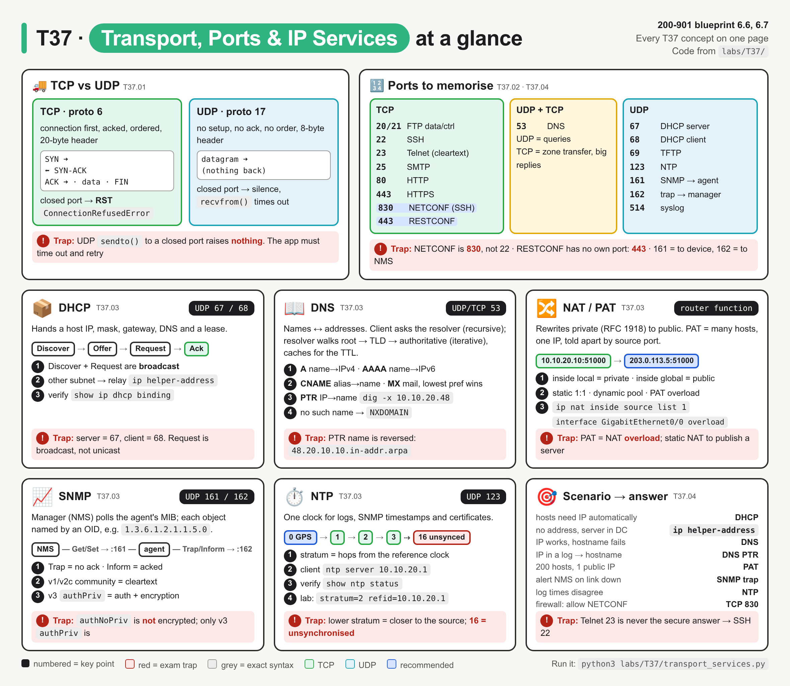
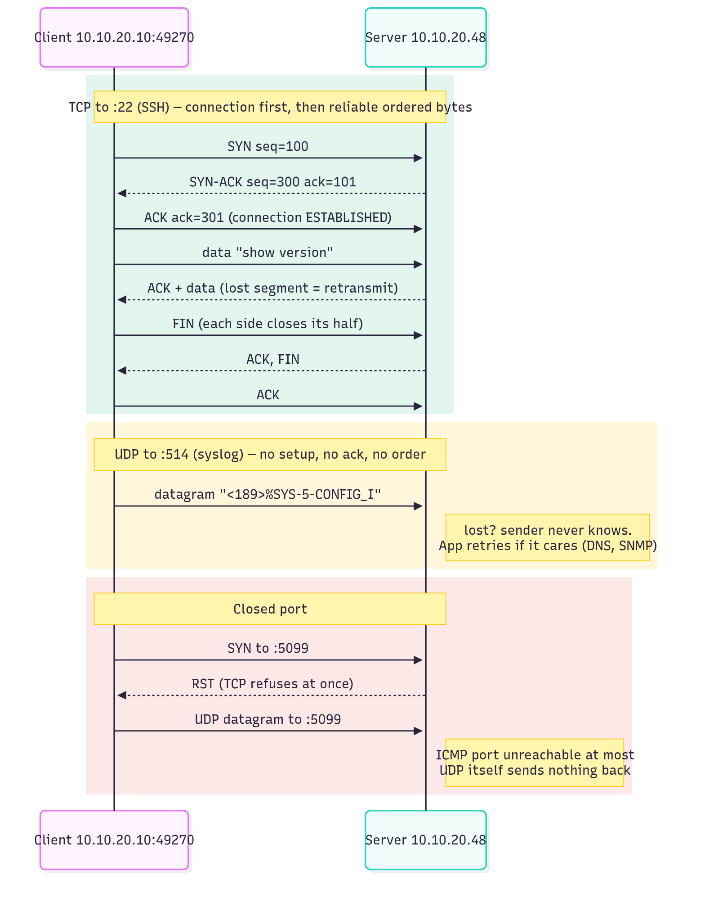
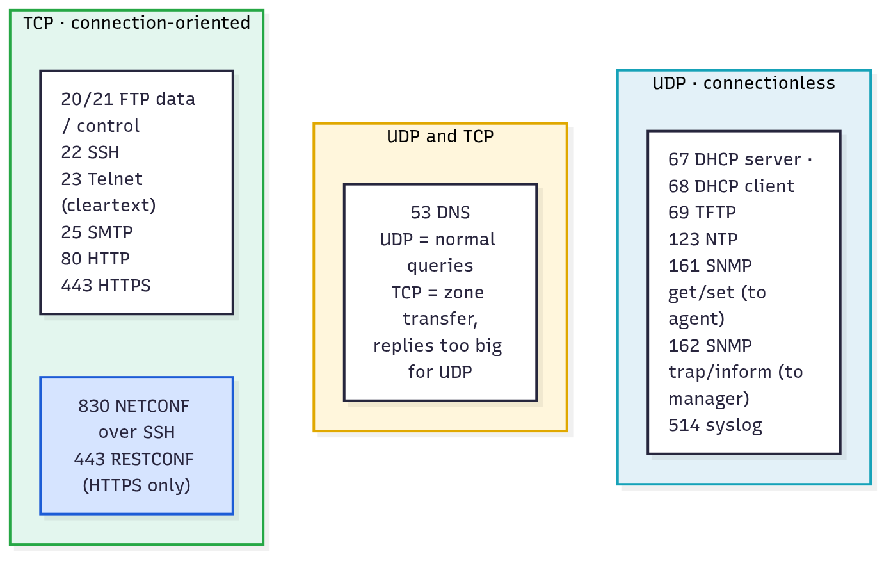
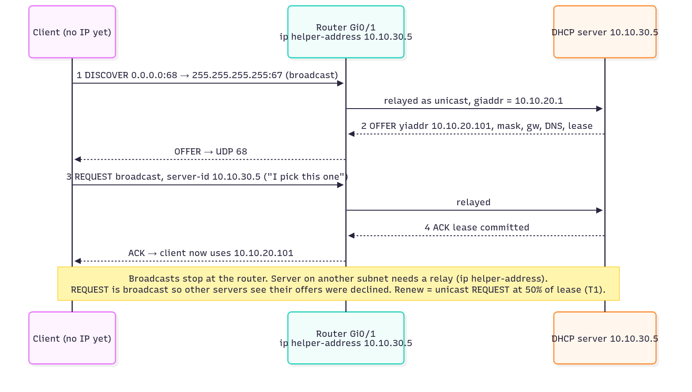
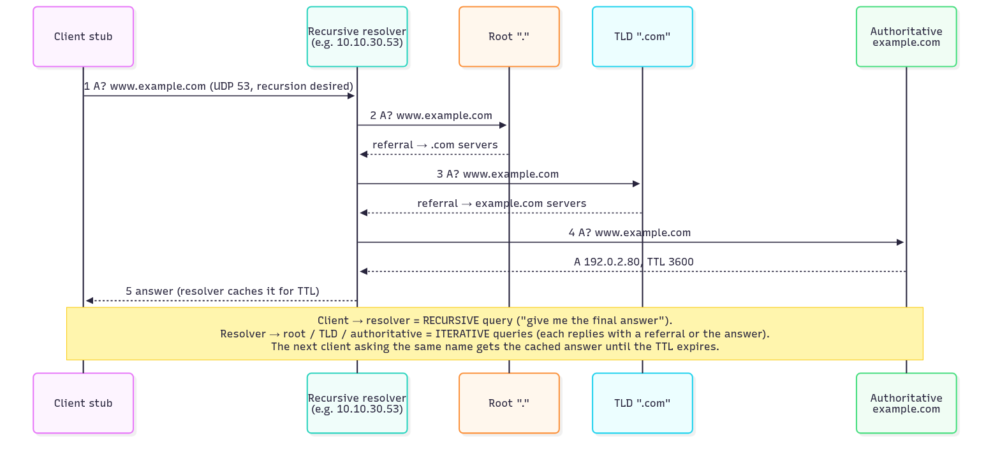
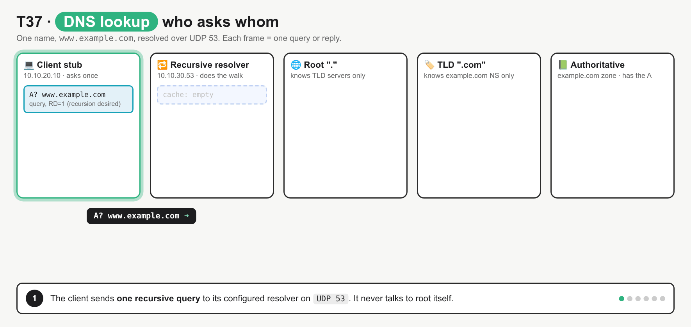
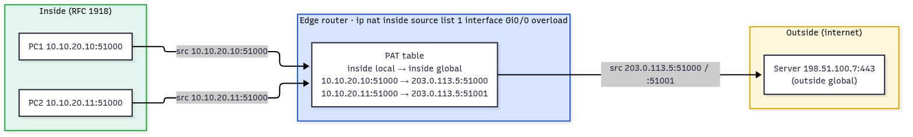
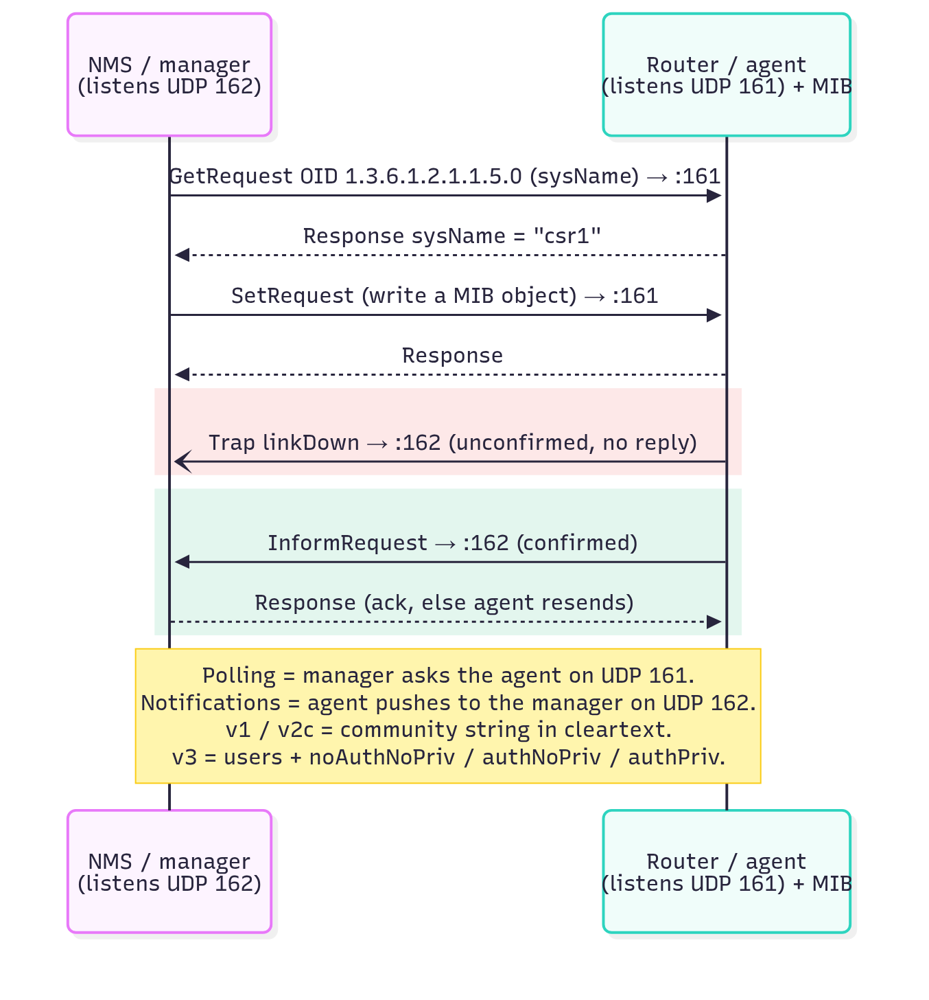
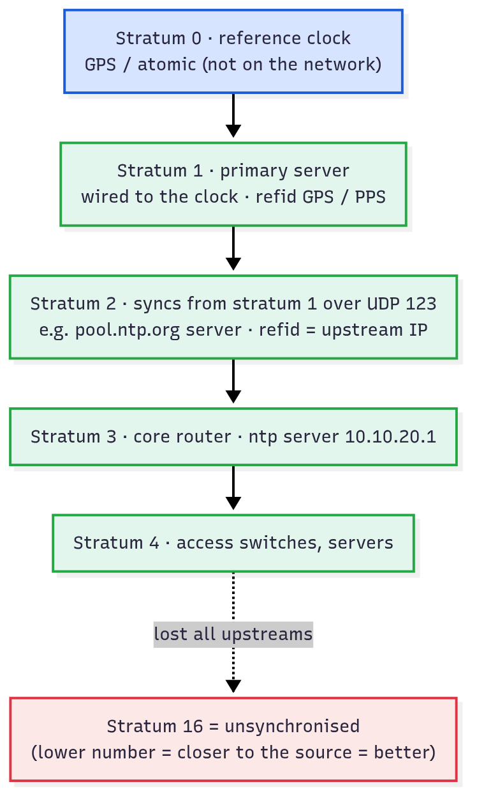
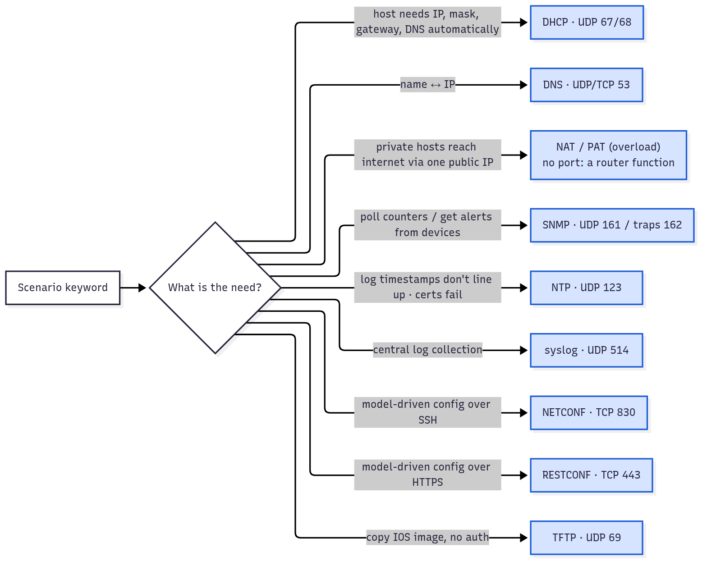

# T37 · Transport, ports, IP services

> Owner: **Bob** · Blueprint: **6.6, 6.7** · CBT coverage: **Full** · Learn by 2026-10-15 · Teach-back 2026-10-16



*Every T37 concept on one page. Top strip = TCP vs UDP and the port board; each card = one IP service with the same parts (job, port, key terms, verify command); red boxes are exam traps.*

## TL;DR (teach-back card)

- **TCP = handshake first (SYN, SYN-ACK, ACK), then acked, ordered bytes. UDP = fire a datagram, no ack, no order.** Closed TCP port → RST at once; closed UDP port → silence (app times out).
- **Ports:** TCP 20/21 FTP · 22 SSH · 23 Telnet · 25 SMTP · 80 HTTP · 443 HTTPS **and RESTCONF** · 830 NETCONF. UDP 67/68 DHCP · 69 TFTP · 123 NTP · 161 SNMP · 162 traps · 514 syslog. DNS 53 is **both** (UDP queries, TCP zone transfers).
- **Services by job:** DHCP hands out IP config (DORA, `ip helper-address` across subnets) · DNS maps names (A, AAAA, CNAME, PTR, MX) · NAT/PAT shares one public IP (inside local → inside global) · SNMP polls (161) and pushes traps (162), only v3 has auth + encryption · NTP syncs clocks, lower stratum = closer to the source, 16 = unsynced.
- **Trap:** SNMP **161 is the agent** (device), **162 is the manager** (NMS). And RESTCONF has no port of its own: it's HTTPS 443.

## Concepts

Every section below points at one program. Read it once first.

- `labs/T37/mock_services.py` starts four tiny local servers (stdlib only): a TCP echo (stand-in for SSH), a UDP echo (stand-in for syslog), a DNS server for the zone `lab.example`, and an NTP server at stratum 2. They use high ports (5022, 5514, 5053, 5123), so no root is needed.
- `labs/T37/transport_services.py` (below) is the **reference program**. It prints the exam port table, then shows TCP and UDP behaving differently, builds raw DNS queries for each record type, and decodes an NTP reply.
- To run: `python3 labs/T37/transport_services.py` (add `--live` to also ask `pool.ntp.org` on real UDP 123).
- DHCP, NAT and SNMP need a router or an NMS, so those use diagrams plus the IOS XE config in [Examples §4](#4-ios-xe-config-reference).

**`labs/T37/transport_services.py`**

```python
"""T37 reference program: TCP vs UDP, exam ports, DNS records and NTP, with raw sockets.

Run:  python3 labs/T37/transport_services.py          (local mocks only)
      python3 labs/T37/transport_services.py --live   (also asks pool.ntp.org on UDP 123)

Python stdlib only. mock_services.py starts the local servers in threads.
"""
import socket
import struct
import sys
import time

import mock_services as mock

# name: (port, transport). The exam table for blueprint 6.7, plus the IP services in 6.6.
EXAM_PORTS = {
    "ftp-data": (20, "tcp"), "ftp": (21, "tcp"), "ssh": (22, "tcp"), "telnet": (23, "tcp"),
    "smtp": (25, "tcp"), "domain": (53, "udp+tcp"), "bootps": (67, "udp"), "bootpc": (68, "udp"),
    "tftp": (69, "udp"), "http": (80, "tcp"), "ntp": (123, "udp"), "snmp": (161, "udp"),
    "snmp-trap": (162, "udp"), "https": (443, "tcp"), "syslog": (514, "udp"), "netconf-ssh": (830, "tcp"),
}
RTYPE_NAMES = {mock.A: "A", mock.AAAA: "AAAA", mock.CNAME: "CNAME", mock.MX: "MX", mock.PTR: "PTR"}


def port_table():
    """Print the exam ports and what this OS's /etc/services says (getservbyname)."""
    print(f"{'service':<12}{'port':>5}  {'transport':<9} /etc/services")
    for name, (port, proto) in EXAM_PORTS.items():
        try:
            os_port = socket.getservbyname(name, proto.split("+")[0])
        except OSError:
            os_port = "-"                              # not listed on this OS
        print(f"{name:<12}{port:>5}  {proto:<9} {os_port}")


def tcp_demo():
    """TCP: connect() = 3-way handshake; a closed port answers with RST."""
    with socket.create_connection((mock.HOST, mock.TCP_ECHO), timeout=2) as s:   # SYN, SYN-ACK, ACK
        local, remote = s.getsockname(), s.getpeername()
        print(f"connected {local[0]}:{local[1]} -> {remote[0]}:{remote[1]} (ephemeral src port)")
        s.sendall(b"show version")                      # bytes are acked and delivered in order
        print("reply:", s.recv(1024).decode())
    try:
        socket.create_connection((mock.HOST, 5099), timeout=2)                  # nothing listens here
    except ConnectionRefusedError as err:
        print("closed port 5099:", type(err).__name__, "(peer sent TCP RST)")


def udp_demo():
    """UDP: no connection, no ack. sendto() succeeds even when nobody is listening."""
    s = socket.socket(socket.AF_INET, socket.SOCK_DGRAM)
    s.settimeout(1)
    sent = s.sendto(b"<189>%SYS-5-CONFIG_I: Configured", (mock.HOST, mock.UDP_ECHO))
    data, addr = s.recvfrom(1024)
    print(f"sent {sent} bytes, reply from {addr[0]}:{addr[1]}: {data.decode()}")
    sent = s.sendto(b"lost?", (mock.HOST, 5099))       # closed port
    print(f"sent {sent} bytes to closed port 5099, sendto() raised nothing")
    try:
        s.recvfrom(1024)
    except socket.timeout:
        print("no reply after 1 s: UDP has no ack, so the app must time out and retry")
    s.close()


def dns_query(name, qtype):
    """Build a raw DNS query (RFC 1035), send it over UDP, return (rcode, answers)."""
    txid = 0x3737
    query = struct.pack("!HHHHHH", txid, 0x0100, 1, 0, 0, 0)    # RD=1, one question
    query += mock.encode_name(name) + struct.pack("!HH", qtype, 1)   # QTYPE, QCLASS=IN
    s = socket.socket(socket.AF_INET, socket.SOCK_DGRAM)
    s.settimeout(2)
    s.sendto(query, (mock.HOST, mock.DNS_PORT))
    reply, _ = s.recvfrom(512)                          # classic UDP DNS limit: 512 bytes
    s.close()
    _, flags, _, ancount, _, _ = struct.unpack("!HHHHHH", reply[:12])
    _, offset = mock.decode_name(reply, 12)
    offset += 4                                         # skip QTYPE + QCLASS of the echoed question
    answers = []
    for _ in range(ancount):
        rname, offset = mock.decode_name(reply, offset)
        rtype, _, ttl, rdlen = struct.unpack("!HHIH", reply[offset:offset + 10])
        offset += 10
        raw = reply[offset:offset + rdlen]
        if rtype == mock.A:
            value = socket.inet_ntop(socket.AF_INET, raw)
        elif rtype == mock.AAAA:
            value = socket.inet_ntop(socket.AF_INET6, raw)
        elif rtype == mock.MX:
            value = f"{struct.unpack('!H', raw[:2])[0]} {mock.decode_name(reply, offset + 2)[0]}"
        else:
            value = mock.decode_name(reply, offset)[0]
        answers.append((rname, RTYPE_NAMES[rtype], ttl, value))
        offset += rdlen
    return flags & 0x000F, answers


def dns_demo():
    lookups = [("csr1.lab.example", mock.A), ("csr1.lab.example", mock.AAAA),
               ("www.lab.example", mock.A), ("lab.example", mock.MX),
               ("48.20.10.10.in-addr.arpa", mock.PTR), ("nope.lab.example", mock.A)]
    for name, qtype in lookups:
        rcode, answers = dns_query(name, qtype)
        print(f"? {name} {RTYPE_NAMES[qtype]}  rcode={rcode}{' NXDOMAIN' if rcode == 3 else ''}")
        for rname, rtype, ttl, value in answers:
            print(f"    {rname:<26} {ttl:<4} IN {rtype:<5} {value}")


def ntp_query(host, port):
    """SNTP client request: 48 bytes, first byte 0x1b = LI 0, version 3, mode 3 (client)."""
    s = socket.socket(socket.AF_INET, socket.SOCK_DGRAM)
    s.settimeout(3)
    s.sendto(b"\x1b" + 47 * b"\0", (host, port))
    data, addr = s.recvfrom(48)
    s.close()
    stratum = data[1]
    refid = socket.inet_ntoa(data[12:16]) if 2 <= stratum <= 15 else data[12:16].decode(errors="replace").strip("\0")
    secs = struct.unpack("!I", data[40:44])[0] - mock.NTP_EPOCH_OFFSET   # transmit timestamp, 1900 -> 1970
    print(f"{addr[0]}:{addr[1]} mode={data[0] & 7} stratum={stratum} refid={refid} "
          f"offset_vs_local={secs - int(time.time()):+d}s")


def main():
    mock.start_all()
    time.sleep(0.2)
    print("== 1. Exam ports ==")
    port_table()
    print("\n== 2. TCP: connection-oriented ==")
    tcp_demo()
    print("\n== 3. UDP: connectionless ==")
    udp_demo()
    print("\n== 4. DNS over UDP (mock on 5053) ==")
    dns_demo()
    print("\n== 5. NTP over UDP (mock on 5123) ==")
    ntp_query(mock.HOST, mock.NTP_PORT)
    if "--live" in sys.argv:
        try:
            ntp_query("pool.ntp.org", 123)
        except OSError as err:
            print("live NTP failed:", err)


if __name__ == "__main__":
    main()
```

**Output** (`python3 labs/T37/transport_services.py`):

```
== 1. Exam ports ==
service      port  transport /etc/services
ftp-data       20  tcp       20
ftp            21  tcp       21
ssh            22  tcp       22
telnet         23  tcp       23
smtp           25  tcp       25
domain         53  udp+tcp   53
bootps         67  udp       67
bootpc         68  udp       68
tftp           69  udp       69
http           80  tcp       80
ntp           123  udp       123
snmp          161  udp       161
snmp-trap     162  udp       162
https         443  tcp       443
syslog        514  udp       514
netconf-ssh   830  tcp       -

== 2. TCP: connection-oriented ==
connected 127.0.0.1:34022 -> 127.0.0.1:5022 (ephemeral src port)
reply: echo:show version
closed port 5099: ConnectionRefusedError (peer sent TCP RST)

== 3. UDP: connectionless ==
sent 32 bytes, reply from 127.0.0.1:5514: ack:<189>%SYS-5-CONFIG_I: Configured
sent 5 bytes to closed port 5099, sendto() raised nothing
no reply after 1 s: UDP has no ack, so the app must time out and retry

== 4. DNS over UDP (mock on 5053) ==
? csr1.lab.example A  rcode=0
    csr1.lab.example           300  IN A     10.10.20.48
? csr1.lab.example AAAA  rcode=0
    csr1.lab.example           300  IN AAAA  2001:db8:10::48
? www.lab.example A  rcode=0
    www.lab.example            300  IN CNAME csr1.lab.example
    csr1.lab.example           300  IN A     10.10.20.48
? lab.example MX  rcode=0
    lab.example                300  IN MX    10 mail.lab.example
? 48.20.10.10.in-addr.arpa PTR  rcode=0
    48.20.10.10.in-addr.arpa   300  IN PTR   csr1.lab.example
? nope.lab.example A  rcode=3 NXDOMAIN

== 5. NTP over UDP (mock on 5123) ==
127.0.0.1:5123 mode=4 stratum=2 refid=10.10.20.1 offset_vs_local=+0s
```

The source port (`34022` here) changes every run, because the OS picks a fresh ephemeral port.

### T37.01 · TCP vs UDP

**Must cover:**

- [x] TCP: connection-oriented, reliable, ordered (3-way handshake)
- [x] UDP: connectionless, low overhead (DNS queries, SNMP, NTP, syslog)

**Notes:**

| | TCP | UDP |
|---|---|---|
| IP protocol number | 6 | 17 |
| Setup | 3-way handshake: SYN → SYN-ACK → ACK | none: just send |
| Reliability | acks + retransmit lost segments | none; the app retries if it cares |
| Order | sequence numbers → in-order byte stream | each datagram stands alone, may arrive out of order |
| Flow control | sliding window | none |
| Header | 20 bytes minimum | 8 bytes (src port, dst port, length, checksum) |
| Closed port | answers RST → `ConnectionRefusedError` | nothing from UDP (at most an ICMP port unreachable) |
| Exam examples | SSH, Telnet, HTTP(S), NETCONF, RESTCONF, SMTP, FTP | DNS queries, DHCP, TFTP, NTP, SNMP, syslog |

- **Why UDP for these services:** one small question and one small answer (DNS, NTP, SNMP get), or a fire-and-forget message (syslog, trap). A handshake would cost more than the data.
- **Why TCP for management/APIs:** a config push or an API call must arrive complete and in order. SSH, NETCONF and HTTPS all ride on TCP.
- **Socket = IP + protocol + port.** A connection is the 5-tuple (src IP, src port, dst IP, dst port, protocol). The client's source port is **ephemeral** (IANA range 49152–65535; Linux uses 32768–60999 by default, hence `34022` above).
- **Close:** FIN from each side (each closes its own half), or RST to abort.
- **In the program:**
  - `tcp_demo()`: `socket.create_connection()` returns only after the kernel finishes the SYN / SYN-ACK / ACK. Connecting to port 5099, where nothing listens, raises `ConnectionRefusedError` because the peer sent RST.
  - `udp_demo()`: `sendto()` returns the byte count (`sent 5 bytes`) even to the closed port, because there is no connection to fail. The only symptom is that `recvfrom()` times out.



*Green = TCP: three packets before any data, then every segment is acked. Yellow = UDP: one datagram, no reply. Red = closed port: TCP refuses with RST, UDP stays silent.*

### T37.02 · Ports to memorise

**Must cover:**

- [x] SSH 22, Telnet 23, HTTP 80, HTTPS 443, NETCONF 830, RESTCONF 443
- [x] DNS 53, DHCP 67/68, TFTP 69, NTP 123, SNMP 161 / traps 162, syslog 514, SMTP 25, FTP 20/21

**Notes:**

| Port | Transport | Protocol | Remember it as |
|---|---|---|---|
| 20 / 21 | TCP | FTP data / control | 21 = commands, 20 = the file |
| 22 | TCP | SSH (also SCP, SFTP) | encrypted CLI |
| 23 | TCP | Telnet | **cleartext** CLI, never the "secure" answer |
| 25 | TCP | SMTP | sending mail |
| 53 | **UDP + TCP** | DNS | UDP queries; TCP for zone transfers and replies too big for UDP |
| 67 / 68 | UDP | DHCP server / client | server listens on 67, client on 68 |
| 69 | UDP | TFTP | no auth, used to copy IOS images and configs |
| 80 | TCP | HTTP | cleartext web / API |
| 123 | UDP | NTP | time |
| 161 | UDP | SNMP get/set | sent **to the agent** (device) |
| 162 | UDP | SNMP trap/inform | sent **to the manager** (NMS) |
| 443 | TCP | HTTPS **and RESTCONF** | RESTCONF must run over TLS; default port 443 |
| 514 | UDP | syslog | device → collector (syslog over TLS = TCP 6514) |
| 830 | TCP | NETCONF over SSH | SSH subsystem `netconf` on 830, not 22 |

- **Model-driven pair:** NETCONF = SSH on **830** (RFC 6242). RESTCONF = HTTPS on **443** (RFC 8040; plain HTTP isn't allowed). See [T15](T15-netconf.md) and [T16](T16-restconf.md).
- **In the program:** `port_table()` checks each name against the OS services file with `socket.getservbyname()`. On this Ubuntu host `netconf-ssh` prints `-`: it isn't in `/etc/services`, so you have to know 830 yourself. (In the slim Docker image `/etc/services` may be missing entirely, so the whole column can print `-`.)
- **Drill:** cover the "Port" column and recite it. Then cover "Protocol". The study aid T37.3 is exactly this.



*Read by column: left = TCP only, middle = DNS on both, right = UDP only. Blue = the two model-driven APIs the exam pairs together.*

### T37.03 · IP services

**Must cover:**

- [x] DHCP: DORA (Discover, Offer, Request, Ack)
- [x] DNS: A, AAAA, CNAME, PTR, MX records
- [x] NAT/PAT: private ↔ public translation
- [x] SNMP: manager/agent, MIB, OID, traps; v3 adds auth/encryption
- [x] NTP: time sync, stratum levels

**Notes:**

**DHCP: automatic IP config (UDP 67 server / 68 client)**

- A host with no address gets IP, mask, default gateway, DNS servers and a lease time.
- **DORA:**
  1. **Discover**: client broadcasts, `0.0.0.0:68 → 255.255.255.255:67`.
  2. **Offer**: server proposes an address (`yiaddr`) plus options.
  3. **Request**: client **broadcasts** its choice, naming the server (server identifier). Other servers see that their offer was declined.
  4. **Ack**: the chosen server commits the lease. (A **NAK** means "no, start over".)
- **Broadcasts don't cross routers.** Server on another subnet → configure a **relay** on the client-facing interface: `ip helper-address <server>`. The relay turns the broadcast into unicast and fills in `giaddr`, so the server knows which pool to use.
- **Renewal:** at 50 % of the lease (T1) the client unicasts a Request to the same server.



*Numbers 1–4 = DORA. Client-side messages are broadcast; the relay forwards them as unicast to a server on another subnet.*

**DNS: names ↔ addresses (UDP 53, TCP 53)**

| Record | Maps | Example from the mock zone |
|---|---|---|
| **A** | name → IPv4 | `csr1.lab.example A 10.10.20.48` |
| **AAAA** | name → IPv6 | `csr1.lab.example AAAA 2001:db8:10::48` |
| **CNAME** | alias → canonical name | `www.lab.example CNAME csr1.lab.example` |
| **PTR** | IP → name (reverse lookup) | `48.20.10.10.in-addr.arpa PTR csr1.lab.example` |
| **MX** | domain → mail server + preference (lower wins) | `lab.example MX 10 mail.lab.example` |

- **Resolution:** the client stub sends one **recursive** query to its resolver ("give me the final answer"). The resolver does **iterative** queries: root → TLD → authoritative, each replying with a referral or the answer. The resolver caches the answer for its **TTL**.
- **PTR names are reversed:** `10.10.20.48` → `48.20.10.10.in-addr.arpa`. `dig -x 10.10.20.48` builds that for you.
- **Response codes:** `NOERROR` (rcode 0), `NXDOMAIN` (rcode 3, the name doesn't exist). A name that exists but has no record of that type gives NOERROR with zero answers.
- **TCP 53:** zone transfers (AXFR) between servers, and any reply too big for UDP (the classic limit is 512 bytes; the TC bit tells the client to retry over TCP).
- **In the program:** `dns_query()` packs a 12-byte header plus the question (`QTYPE`, `QCLASS=IN`) and sends it with `sendto()`, so no connection is made. `dns_demo()` asks for every record type. Note the `www` lookup: an A query for an alias returns the **CNAME and then the target's A** in one reply.



*Step 1 is recursive (client → resolver). Steps 2–4 are iterative (resolver → each level). Root and TLD only refer; only the authoritative server has the A record.*



*Steps: client asks the resolver → root refers to .com → .com refers to example.com → authoritative answers → resolver caches and replies → second client is answered from cache. It fixes the misconception that the client walks the hierarchy itself, or that the root server knows the IP.*

**NAT / PAT: private ↔ public (a router function, no port of its own)**

- RFC 1918 private ranges: `10.0.0.0/8`, `172.16.0.0/12`, `192.168.0.0/16`. They aren't routed on the internet, so the edge router rewrites them.
- **Cisco terms** (the exam uses these):

| Term | Meaning | In diagram 05 |
|---|---|---|
| Inside local | the inside host's real (private) address | `10.10.20.10` |
| Inside global | the inside host as the outside sees it (public) | `203.0.113.5` |
| Outside global | the outside host's real address | `198.51.100.7` |
| Outside local | the outside host as the inside sees it (usually = outside global) | `198.51.100.7` |

- **Types:**
  - **Static NAT**: 1 private ↔ 1 public, fixed. Use it to publish an inside server.
  - **Dynamic NAT**: private → next free address from a public pool. Runs out when the pool does.
  - **PAT / NAT overload**: many private → **one** public IP, told apart by **source port**. This is what a home router does. Keyword: `overload`.
- Effect on automation: a device behind NAT can't be reached from outside unless static NAT or port forwarding exists. That's why controllers often use device-initiated (outbound) connections.



*Both PCs use source port 51000. PAT keeps one and moves the other to 51001, so replies to 203.0.113.5 can be mapped back.*

**SNMP: monitoring (UDP 161 to the agent, 162 to the manager)**

- **Manager** (NMS) polls; **agent** (software on the device) answers and sends notifications.
- **MIB** = the agent's database schema (a tree of objects). **OID** = the dotted number naming one object, e.g. `1.3.6.1.2.1.1.5.0` = sysName.
- **Operations:** `Get`, `GetNext`, `GetBulk` (v2c+, walk tables fast), `Set` (write) go **to the agent on 161**. **Trap** (no ack) and **Inform** (acked, resent if lost) go **to the manager on 162**.

| Version | Security | Exam keyword |
|---|---|---|
| v1 | community string in **cleartext** | oldest; no GetBulk |
| v2c | community string in **cleartext** | adds GetBulk, Inform |
| v3 | **users**, security levels `noAuthNoPriv` / `authNoPriv` / `authPriv` | only version with **authentication + encryption** |

- `authNoPriv` = authenticated, not encrypted. `authPriv` = both. This is the "secure SNMP" answer.
- Where SNMP sits next to the model-driven options: [T12](T12-automation-foundations-controller-vs-device.md) and [T39](T39-management-control-data-planes.md).



*Top = manager polls the agent on 161. Red = Trap, unacknowledged. Green = Inform, acknowledged. Both notifications go to 162 on the manager.*

**NTP: one clock for the network (UDP 123)**

- **Why it matters:** syslog and SNMP timestamps line up across devices; certificates (TLS, so HTTPS and RESTCONF), Kerberos and log correlation all fail or mislead with a wrong clock.
- **Stratum** = distance from a reference clock. 0 = the clock itself (GPS/atomic, not on the network), 1 = a server wired to it, 2 = syncs from a stratum 1, and so on. **16 = unsynchronised.** Lower number = closer to the source; that's "more authoritative", not "faster".
- **refid:** for stratum 1 it's a clock code (e.g. `GPS`, `PPS`); for stratum 2+ it's the upstream server's IPv4 address.
- **In the program:** `ntp_query()` sends a 48-byte packet whose first byte is `0x1b` (version 3, mode 3 = client) and reads byte 1 as the stratum. The mock replies `mode=4` (server), `stratum=2`, `refid=10.10.20.1`. With `--live`, a public pool server answered at stratum 2 with its upstream's IP as refid (`42.20.202.230`); an earlier run hit a stratum 1 server with refid `PPS`.



*Each hop down adds one to the stratum. Red = 16, the value a device shows when it has lost every upstream.*

### T37.04 · Exam angle

**Must cover:**

- [x] Match port to protocol; pick the service for a scenario

**Notes:**

- **Port → protocol:** the table in [T37.02](#t3702--ports-to-memorise). The traps are the near-misses: 161 vs 162, 67 vs 68, 22 vs 830, 20 vs 21, 443 = HTTPS **and** RESTCONF.
- **Scenario → service:**

| Scenario wording | Answer |
|---|---|
| "New hosts must get an IP, gateway and DNS automatically" | DHCP |
| "Hosts on VLAN 20 don't get addresses; the DHCP server is in the data centre" | missing `ip helper-address` (relay) |
| "The script can reach `10.10.20.48` but not `csr1.lab.example`" | DNS (A record / resolver) |
| "Find the hostname for an IP seen in a log" | DNS PTR (reverse lookup) |
| "200 inside hosts share one public IP" | PAT / NAT overload |
| "Publish an inside web server on a fixed public IP" | static NAT |
| "Alert the NMS immediately when an interface goes down" | SNMP trap (or inform, if it must be acked) |
| "Collect interface counters every 5 min, securely" | SNMPv3 `authPriv` (or model-driven telemetry, see [T39](T39-management-control-data-planes.md)) |
| "Log timestamps from two routers disagree by minutes" | NTP |
| "Firewall must allow NETCONF" | TCP 830 |
| "Copy an IOS image with no authentication" | TFTP UDP 69 |



*Read left to right: find the scenario keyword on the arrow, take the blue box as the answer.*

## Exam traps

- **SNMP direction:** 161 = requests **to the agent** (device). 162 = traps/informs **to the manager** (NMS). Reversing them is the classic wrong answer.
- **Trap vs Inform:** a trap is never acknowledged; an inform is acked and resent. "Must confirm delivery" → inform.
- **SNMP security:** v1 and v2c send the community string in cleartext. Only v3 authenticates and encrypts, and only at `authPriv`. `authNoPriv` ≠ encrypted.
- **NETCONF ≠ 22.** It runs SSH on **830**. RESTCONF has no port of its own: HTTPS **443**.
- **DNS is both UDP and TCP 53.** "DNS is UDP only" is wrong: zone transfers and large replies use TCP.
- **DHCP:** server = 67, client = 68. The client's Request is **broadcast**, not unicast (other servers must see it). Across subnets you need `ip helper-address`.
- **PTR ≠ A.** A = name → IP. PTR = IP → name, under `in-addr.arpa` with the octets reversed. CNAME points to a **name**, never to an IP.
- **MX preference:** the **lower** number wins.
- **PAT = NAT overload.** Many inside hosts → one public IP, distinguished by **source port**. "Inside local" = the private address; "inside global" = the public one.
- **NTP stratum:** lower = closer to the reference clock. Stratum 16 = unsynchronised, not "very far".
- **UDP to a closed port doesn't error on send.** The sender only notices because no reply comes (timeout), unlike TCP's immediate RST.
- **Telnet 23** is never the secure answer; SSH 22 is.

## Examples

### 1. Run the reference program

Needs only Python 3. Nothing to install, no sandbox.

```bash
python3 labs/T37/transport_services.py            # local mocks only
python3 labs/T37/transport_services.py --live     # also query pool.ntp.org on UDP 123
```

Live NTP line from this run (the server you get, and its stratum, changes each time):

```
23.150.41.122:123 mode=4 stratum=2 refid=42.20.202.230 offset_vs_local=+0s
```

Run the mock servers on their own (for dig, or your own scripts):

```bash
python3 labs/T37/mock_services.py                 # Ctrl-C to stop
```

In the lab container:

```bash
docker build --tag ccna-auto-lab:latest --file labs/Dockerfile labs/
docker run --rm --volume "$(pwd)":/work --workdir /work ccna-auto-lab:latest python3 labs/T37/transport_services.py
docker run --rm --volume "$(pwd)":/work --workdir /work ccna-auto-lab:latest bash labs/T37/dig_drill.sh
```

### 2. dig drill (`labs/T37/dig_drill.sh`)

`dig` is the standard DNS query tool (package `dnsutils`; already in the lab image). The script starts the mock DNS on UDP 5053 and asks for each record type.

```bash
#!/usr/bin/env bash
# T37 dig drill: query the mock DNS server (UDP 5053) for each record type, then a real resolver.
# Usage:  bash labs/T37/dig_drill.sh        (needs dig: apt-get install dnsutils; already in the lab image)
set -u
HERE="$(cd "$(dirname "$0")" && pwd)"
python3 "$HERE/mock_services.py" > /dev/null 2>&1 &
MOCK_PID=$!
trap 'kill $MOCK_PID 2>/dev/null' EXIT
sleep 0.5

DIG="dig @127.0.0.1 -p 5053 +norecurse +noall +answer +comments"
echo "== 1. A (name -> IPv4)";        $DIG csr1.lab.example A    | grep -E "status|IN"
echo "== 2. AAAA (name -> IPv6)";     $DIG csr1.lab.example AAAA | grep -E "status|IN"
echo "== 3. CNAME (alias -> name)";   $DIG www.lab.example A     | grep -E "status|IN"
echo "== 4. MX (domain -> mail server, lowest preference wins)"; $DIG lab.example MX | grep -E "status|IN"
echo "== 5. PTR (IP -> name): dig -x builds 48.20.10.10.in-addr.arpa"; $DIG -x 10.10.20.48 | grep -E "status|IN"
echo "== 6. Missing name";            $DIG nope.lab.example A    | grep -E "status"
echo "== 7. Real resolver (needs internet): +short prints only the answer"
dig +short +time=2 +tries=1 developer.cisco.com A || echo "no internet DNS from here"
```

**Output** (`bash labs/T37/dig_drill.sh`; the `id` values are random per query):

```
== 1. A (name -> IPv4)
;; ->>HEADER<<- opcode: QUERY, status: NOERROR, id: 15870
csr1.lab.example.	300	IN	A	10.10.20.48
== 2. AAAA (name -> IPv6)
;; ->>HEADER<<- opcode: QUERY, status: NOERROR, id: 24441
csr1.lab.example.	300	IN	AAAA	2001:db8:10::48
== 3. CNAME (alias -> name)
;; ->>HEADER<<- opcode: QUERY, status: NOERROR, id: 5005
www.lab.example.	300	IN	CNAME	csr1.lab.example.
csr1.lab.example.	300	IN	A	10.10.20.48
== 4. MX (domain -> mail server, lowest preference wins)
;; ->>HEADER<<- opcode: QUERY, status: NOERROR, id: 23046
lab.example.		300	IN	MX	10 mail.lab.example.
== 5. PTR (IP -> name): dig -x builds 48.20.10.10.in-addr.arpa
;; ->>HEADER<<- opcode: QUERY, status: NOERROR, id: 65245
48.20.10.10.in-addr.arpa. 300	IN	PTR	csr1.lab.example.
== 6. Missing name
;; ->>HEADER<<- opcode: QUERY, status: NXDOMAIN, id: 32823
== 7. Real resolver (needs internet): +short prints only the answer
developer.devnetcloud.com.
18.64.183.80
18.64.183.73
18.64.183.35
18.64.183.108
```

- `status: NXDOMAIN` = the name doesn't exist (rcode 3).
- Line 7 hit the real resolver: `developer.cisco.com` is itself a **CNAME** (to `developer.devnetcloud.com`), followed by the A records.

### 3. Break it on purpose

Run from `labs/T37/` so the imports resolve.

**a. Ask for a record type the name doesn't have** (TXT = type 16): NOERROR with no answers, which is not the same as NXDOMAIN.

```bash
cd labs/T37 && python3 -c "
import mock_services as m, transport_services as t, time
m.start_all(); time.sleep(0.2)
print(t.dns_query('csr1.lab.example', 16))
print(t.dns_query('nope.lab.example', 1))
"
```

```
(0, [])
(3, [])
```

**b. Send a malformed NTP request** (47 bytes instead of 48): the server drops it and UDP reports nothing. The client only sees a timeout.

```bash
cd labs/T37 && python3 -c "
import mock_services as m, socket, time
m.start_all(); time.sleep(0.2)
s=socket.socket(socket.AF_INET, socket.SOCK_DGRAM); s.settimeout(2)
s.sendto(b'\x1b'+46*b'\0', (m.HOST, m.NTP_PORT))
try: s.recvfrom(48)
except socket.timeout: print('47-byte NTP request: no reply, no error, just a timeout')
"
```

```
47-byte NTP request: no reply, no error, just a timeout
```

**c. Try NETCONF's port where no NETCONF server runs**: TCP refuses at once with RST. On a real router, this is what you see before `netconf-yang` is enabled.

```bash
python3 -c "
import socket
try: socket.create_connection(('127.0.0.1', 830), timeout=2)
except ConnectionRefusedError as e: print('TCP 830:', e)
"
```

```
TCP 830: [Errno 111] Connection refused
```

### 4. IOS XE config reference

How each service looks on a router. These show the exact keywords the exam uses (`overload`, `ip helper-address`, `v3 priv`). ⚠ verify: not run on a device this session.

```
! DHCP server pool on the router
ip dhcp excluded-address 10.10.20.1 10.10.20.99
ip dhcp pool USERS
 network 10.10.20.0 255.255.255.0
 default-router 10.10.20.1
 dns-server 10.10.30.53
 lease 1
!
! DHCP relay instead (server on another subnet): on the client-facing interface
interface GigabitEthernet0/1
 ip helper-address 10.10.30.5
!
! PAT / NAT overload
access-list 1 permit 10.10.20.0 0.0.0.255
interface GigabitEthernet0/1
 ip nat inside
interface GigabitEthernet0/0
 ip nat outside
ip nat inside source list 1 interface GigabitEthernet0/0 overload
!
! NTP client
ntp server 10.10.20.1
!
! SNMPv3 with authentication and encryption (authPriv)
snmp-server group NMS-GRP v3 priv
snmp-server user nmsuser NMS-GRP v3 auth sha AuthPass123 priv aes 128 PrivPass123
snmp-server host 10.10.30.20 version 3 priv nmsuser
snmp-server enable traps snmp linkdown linkup
!
! syslog to a collector (UDP 514)
logging host 10.10.30.20
```

Verify commands: `show ip dhcp binding` · `show ip nat translations` · `show ntp status` · `show ntp associations` · `show snmp user` · `show logging`.

## Practice questions

**Q1.** A network team must allow NETCONF and RESTCONF management of IOS XE routers through a firewall. Which two rules are needed? (Choose two.)
A. TCP 22  B. TCP 830  C. UDP 161  D. TCP 443  E. TCP 8080

<details><summary>Answer</summary>

**B and D.** NETCONF runs over SSH on TCP 830 (RFC 6242); RESTCONF runs over HTTPS on TCP 443 (RFC 8040). TCP 22 is interactive SSH, not the NETCONF default. (T37.02)
</details>

**Q2.** An engineer runs `transport_services.py`. `udp_demo()` sends 5 bytes to port 5099, where nothing listens. What does the program observe?
A. `sendto()` raises `ConnectionRefusedError`  B. `sendto()` returns 5, then `recvfrom()` times out  C. The kernel retransmits until a listener appears  D. `sendto()` blocks until the 3-way handshake completes

<details><summary>Answer</summary>

**B.** UDP has no connection and no ack, so the send succeeds and the only symptom is no reply. RST/refused is TCP behaviour; there is no handshake in UDP. (T37.01)
</details>

**Q3.** Drag the DHCP messages into order, and mark which ones the client broadcasts: Ack · Request · Discover · Offer.

<details><summary>Answer</summary>

**Discover → Offer → Request → Ack (DORA).** The client broadcasts **Discover** and **Request**. Request is broadcast so every server that made an offer learns whether it was chosen. (T37.03)
</details>

**Q4.** An NMS must be notified when a link goes down, **and** the router must know the NMS received the message. Which SNMP message, sent to which port?
A. Trap to UDP 161  B. Trap to UDP 162  C. Inform to UDP 162  D. GetResponse to UDP 161

<details><summary>Answer</summary>

**C.** Notifications go to the manager on UDP 162. A trap is never acknowledged; an inform is, and it's resent if the ack doesn't come. (T37.03)
</details>

**Q5.** Which DNS record does `dig -x 10.10.20.48` query, and under which name?
A. A record for `10.10.20.48`  B. PTR record for `48.20.10.10.in-addr.arpa`  C. CNAME record for `csr1.lab.example`  D. PTR record for `10.10.20.48.in-addr.arpa`

<details><summary>Answer</summary>

**B.** Reverse lookups use PTR records, with the octets reversed under `in-addr.arpa`. D keeps the octets in the wrong order. (T37.03)
</details>

**Q6.** 150 users on `10.10.20.0/24` must reach the internet through the router's single public address on Gi0/0. Complete the command:

```
ip nat inside source list 1 interface GigabitEthernet0/0 __________
```

<details><summary>Answer</summary>

**`overload`.** That turns on PAT: many inside local addresses share one inside global address, distinguished by source port. Without it, only one host at a time could use the interface address. (T37.03)
</details>

**Q7.** A router's `show ntp status` reports stratum 16. What does that mean?
A. It is 16 hops from a GPS clock and is synchronised  B. It is not synchronised to any time source  C. It is a primary reference server  D. It uses NTP version 16

<details><summary>Answer</summary>

**B.** Stratum 16 means unsynchronised (RFC 5905). A primary server is stratum 1; synchronised stratums run from 1 to 15. (T37.03)
</details>

**Q8.** Which SNMP configuration gives both authentication and encryption?
A. v2c with a long community string  B. v3 `noAuthNoPriv`  C. v3 `authNoPriv`  D. v3 `authPriv`

<details><summary>Answer</summary>

**D.** `auth` = authentication, `Priv` = privacy (encryption). v1/v2c send the community string in cleartext, however long it is. (T37.03)
</details>

## Study aids

| Aid | Type | Title | Est. min | Resource |
|---|---|---|---|---|
| T37.1 | Video | Describe Transport Layer Functions and Protocols | 21 | CBT module |
| T37.2 | Video | Describe Application Layer Functions and Protocols | 38 | CBT module |
| T37.3 | Drill | Flashcards: port numbers | 20 | Own cheat sheet |

- Skip / low priority: n/a

## Sources

- Overview image: HTML source `assets/T37/00-overview.html`, rendered to PNG (see `assets/README.md`). Diagrams: Mermaid sources in `assets/T37/*.mmd`. Animation: `assets/T37/09-dns-lookup-anim.html` → `09-dns-lookup.gif`.
- RFC 9293, TCP (3-way handshake, RST to a closed port, FIN close): https://www.rfc-editor.org/rfc/rfc9293
- RFC 768, UDP (8-byte header, protocol 17, no delivery guarantee): https://www.rfc-editor.org/rfc/rfc768
- RFC 2131, DHCP (ports 67/68, DORA, broadcast Request, relay `giaddr`): https://www.rfc-editor.org/rfc/rfc2131
- RFC 1035, DNS (UDP/TCP 53, 512-byte UDP limit, TC bit, zone transfers over TCP, A/CNAME/PTR/MX type codes): https://www.rfc-editor.org/rfc/rfc1035
- RFC 3411, SNMP architecture (manager/agent, security levels, Trap unconfirmed vs Inform confirmed): https://www.rfc-editor.org/rfc/rfc3411
- RFC 5905, NTPv4 (UDP 123, stratum 0/1/2–15/16 meanings): https://www.rfc-editor.org/rfc/rfc5905
- RFC 6242, NETCONF over SSH (TCP 830, `netconf` subsystem): https://www.rfc-editor.org/rfc/rfc6242
- RFC 8040, RESTCONF (TLS mandatory, HTTPS default port 443): https://www.rfc-editor.org/rfc/rfc8040
- Cisco NAT FAQ (inside local / inside global, PAT = NAT overload, port allocation): https://www.cisco.com/c/en/us/support/docs/ip/network-address-translation-nat/26704-nat-faq-00.html
- Python `socket` / `socketserver` / `struct`: https://docs.python.org/3/library/socket.html · https://docs.python.org/3/library/socketserver.html · https://docs.python.org/3/library/struct.html
- Cisco 200-901 v1.1 exam topics (6.6, 6.7): https://learningcontent.cisco.com/documents/marketing/exam-topics/200-901-CCNAAUTO_v.1.1.pdf

## To verify

- ⚠ Examples §4 (IOS XE config) wasn't run on a device this session. The commands are standard IOS XE syntax from prior knowledge; check them on a CML or DevNet IOS XE sandbox, especially the `snmp-server user … auth sha … priv aes 128 …` line.
- ⚠ Docker commands in Examples §1 weren't run, because the lab image isn't built here. In `python:3.12-slim`, `/etc/services` may be missing, so the `/etc/services` column of `port_table()` would print `-` for every row.
- ⚠ Outside-local / outside-global definitions are the standard Cisco meanings. The Cisco NAT FAQ fetched above defines only inside local/global explicitly.
- ⚠ The ephemeral range 32768–60999 is the Linux default (`net.ipv4.ip_local_port_range`); IANA's recommended range is 49152–65535. Neither is likely to be tested as a number.
- The reference program, dig drill and the three break-it drills were run locally (Python 3.10.12, dig from Ubuntu dnsutils), and the output shown is real. Live NTP (`--live`) and the real-resolver dig line reached the internet from this host. Results from live servers vary run to run.
- DHCP, NAT and SNMP aren't exercised by the program (they need a router or NMS). They're covered by diagrams and the config reference only.
