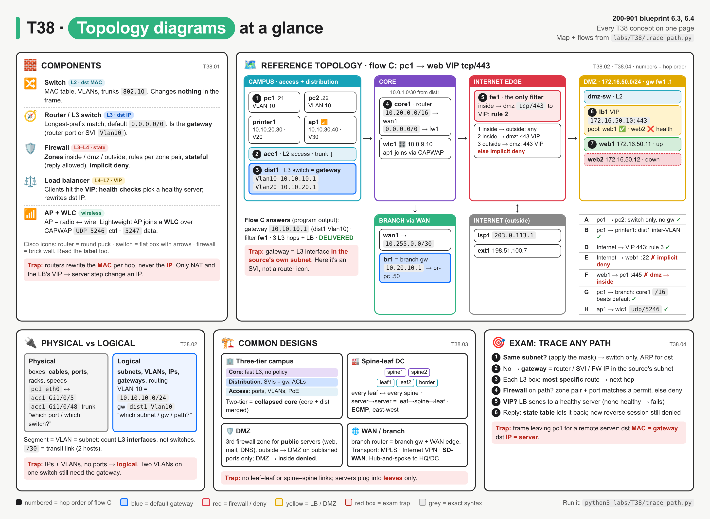
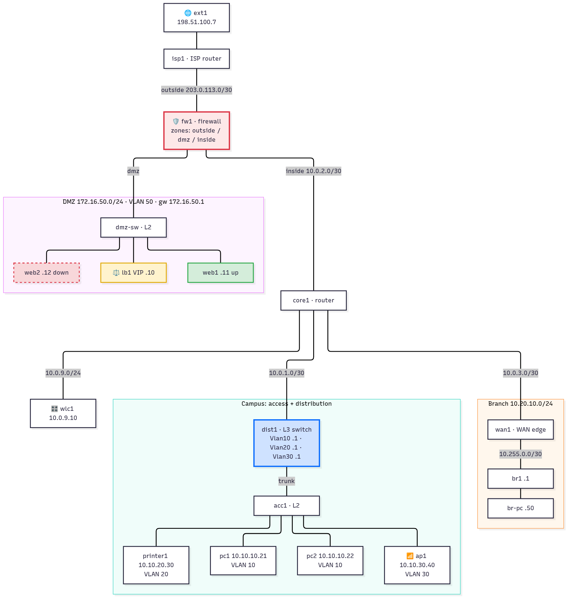
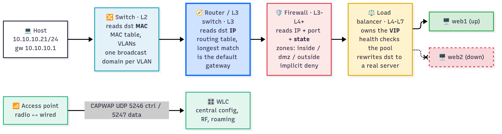
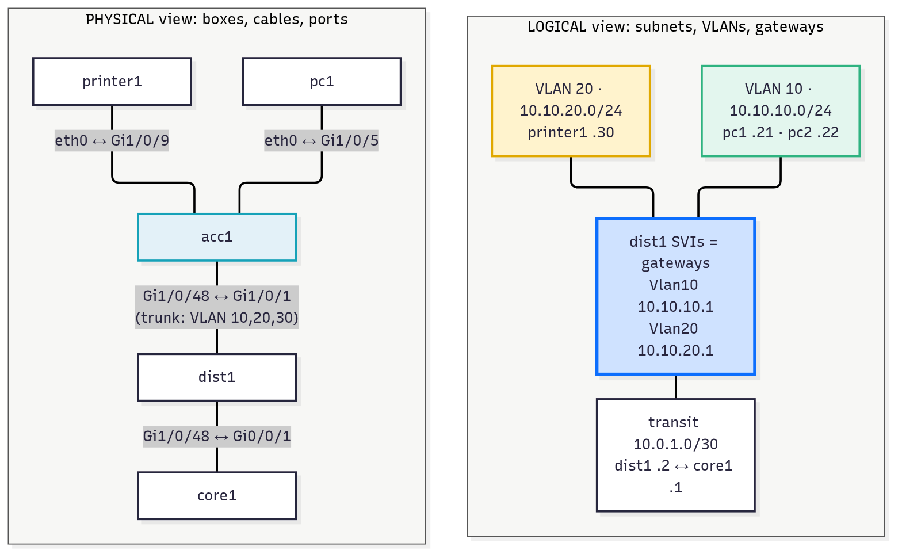
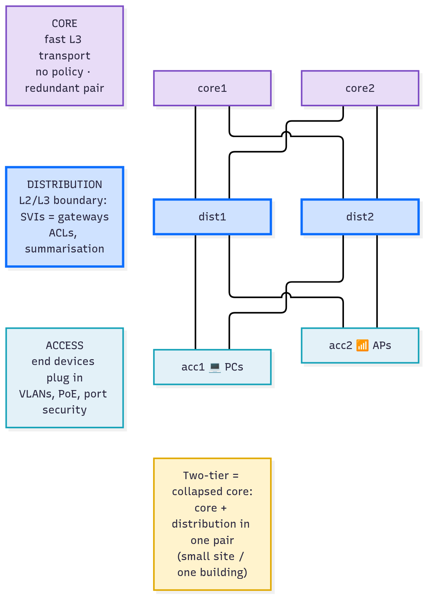
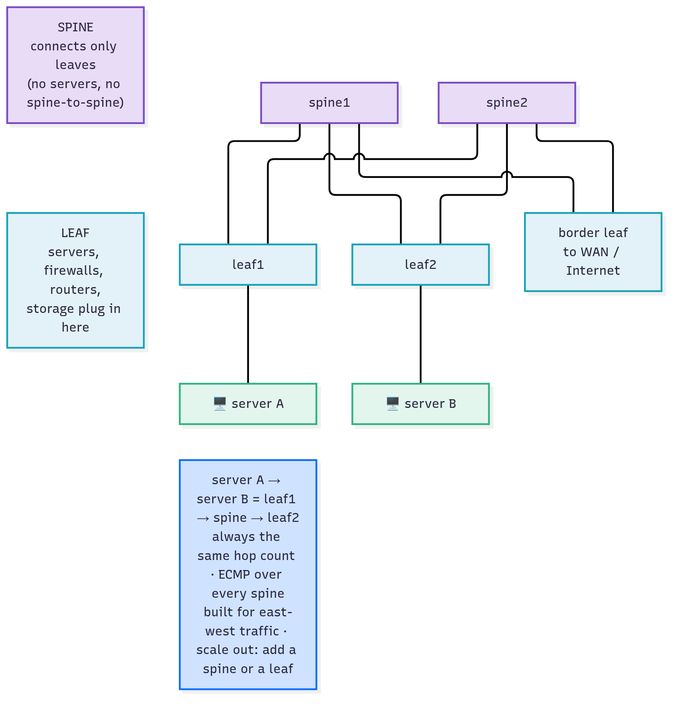
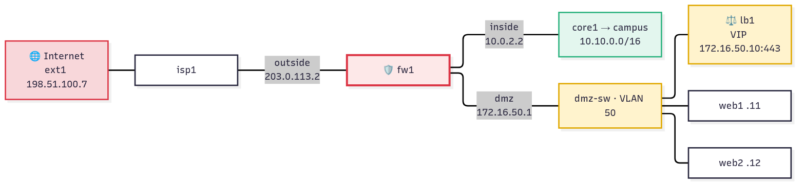
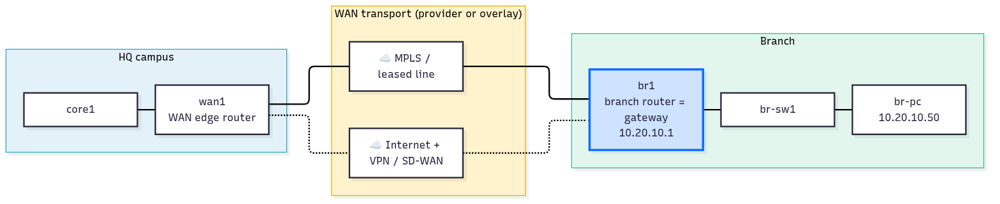
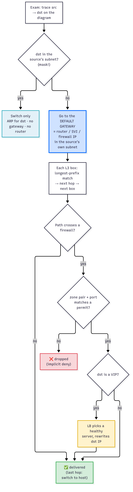
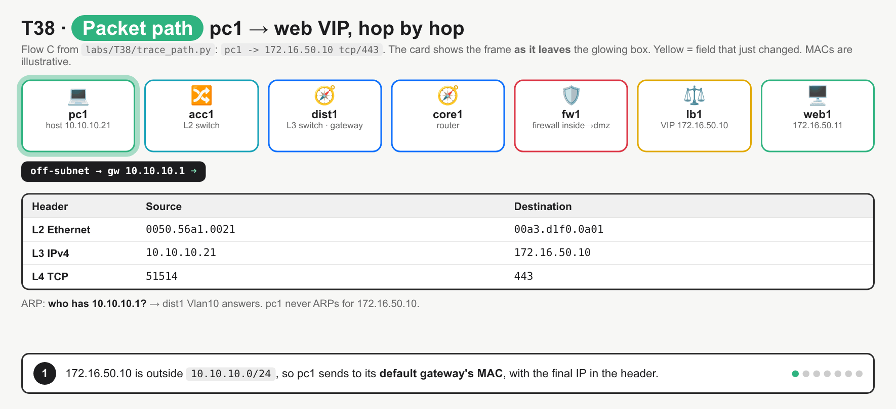

# T38 · Topology diagrams + components

> Owner: **Bob** · Blueprint: **6.3, 6.4** · CBT coverage: **Partial** · Learn by 2026-10-18 · Teach-back 2026-10-20



*Every T38 concept on one page. The centre map is the reference topology from `labs/T38/` (zones = campus, core, edge, DMZ, branch). Side panels hold the component cheat sheet, physical vs logical, the four designs and the 3 exam questions. Numbers are the trace order of flow C. Red boxes are exam traps.*

## TL;DR (teach-back card)

- **Each box reads one header.** Switch = dst **MAC** (L2, VLANs). Router / L3 switch = dst **IP** (routing table, longest match; it's the gateway). Firewall = IP + port + **state**, between **zones**, implicit deny. Load balancer = owns a **VIP**, health checks a pool, rewrites dst to a real server. AP = radio ↔ wire; WLC = central brain for lightweight APs (CAPWAP).
- **Answer any "trace it" question in 3 steps:** (1) same subnet? → switch only; (2) else → the **default gateway** is the L3 interface **in the source's own subnet** (often an SVI on the distribution switch, or a firewall interface); (3) follow routes; a firewall on the path decides permit/deny, a VIP means the LB picks the server.
- **Designs:** three-tier campus = access (ports/VLANs) → distribution (SVIs, policy) → core (fast L3); two-tier = **collapsed core**. Spine-leaf = every leaf to every spine, never leaf-leaf or spine-spine, same hop count, east-west. DMZ = third firewall zone for public servers. WAN/branch = branch router is the branch gateway; WAN = MPLS / Internet VPN / SD-WAN.
- **Trap:** routers rewrite the **MAC** header every hop but leave the **IP** addresses alone. The only things on the path that change an IP are NAT (firewall/router) and the load balancer's VIP → real-server rewrite.

## Concepts

Every section explains one part of the same small network. Read it once first.

- `labs/T38/topology.json` describes an HQ campus (access `acc1`, distribution `dist1`, `core1`), a WLC, an Internet edge firewall `fw1` with a DMZ (load balancer `lb1` in front of `web1`/`web2`), and a branch over the WAN.
- `labs/T38/trace_path.py` is the **reference program** (Python stdlib only). It prints the **physical** view (cables) and the **logical** view (subnets, VLANs, gateways), then traces 8 flows hop by hop. For each flow, it answers the three exam questions: where is the gateway, which device filters, and what path the traffic takes.
- Run: `python3 labs/T38/trace_path.py`.



*Blue = the campus default gateway (dist1 SVIs). Red = the only device that filters. Yellow = the load balancer. Dashed red = web2, which fails its health check.*

<details><summary><b><code>labs/T38/topology.json</code></b> (the data the program reads)</summary>

```json
{
  "site": "HQ campus + DMZ + one branch (T38 reference topology)",
  "devices": {
    "pc1":      {"role": "host", "ip": "10.10.10.21/24", "gateway": "10.10.10.1", "switch": "acc1", "vlan": 10},
    "pc2":      {"role": "host", "ip": "10.10.10.22/24", "gateway": "10.10.10.1", "switch": "acc1", "vlan": 10},
    "printer1": {"role": "host", "ip": "10.10.20.30/24", "gateway": "10.10.20.1", "switch": "acc1", "vlan": 20},
    "ap1":      {"role": "access_point", "ip": "10.10.30.40/24", "gateway": "10.10.30.1", "switch": "acc1", "vlan": 30, "controller": "10.0.9.10"},

    "acc1":  {"role": "switch", "layer": 2, "vlans": [10, 20, 30]},
    "dist1": {"role": "l3_switch",
              "interfaces": {"Vlan10": "10.10.10.1/24", "Vlan20": "10.10.20.1/24", "Vlan30": "10.10.30.1/24",
                             "Gi1/0/48": "10.0.1.2/30"},
              "routes": [["0.0.0.0/0", "10.0.1.1"]]},
    "core1": {"role": "router",
              "interfaces": {"Gi0/0/1": "10.0.1.1/30", "Gi0/0/2": "10.0.2.1/30", "Gi0/0/3": "10.0.3.1/30",
                             "Gi0/0/4": "10.0.9.1/24"},
              "routes": [["10.10.0.0/16", "10.0.1.2"], ["10.20.0.0/16", "10.0.3.2"], ["0.0.0.0/0", "10.0.2.2"]]},
    "wlc1":  {"role": "wlc", "ip": "10.0.9.10/24", "gateway": "10.0.9.1", "switch": null},

    "fw1":   {"role": "firewall",
              "interfaces": {"inside": "10.0.2.2/30", "dmz": "172.16.50.1/24", "outside": "203.0.113.2/30"},
              "routes": [["10.0.0.0/8", "10.0.2.1"], ["0.0.0.0/0", "203.0.113.1"]],
              "policy": [
                {"id": 1, "from": "inside",  "to": "outside", "proto": "any", "port": "any", "dst": "0.0.0.0/0",       "action": "permit"},
                {"id": 2, "from": "inside",  "to": "dmz",     "proto": "tcp", "port": 443,   "dst": "172.16.50.10/32", "action": "permit"},
                {"id": 3, "from": "outside", "to": "dmz",     "proto": "tcp", "port": 443,   "dst": "172.16.50.10/32", "action": "permit"}
              ]},
    "dmz-sw": {"role": "switch", "layer": 2, "vlans": [50]},
    "lb1":   {"role": "load_balancer", "ip": "172.16.50.5/24", "gateway": "172.16.50.1", "switch": "dmz-sw",
              "vip": "172.16.50.10", "vip_port": 443,
              "pool": [{"name": "web1", "ip": "172.16.50.11", "health": "up"},
                       {"name": "web2", "ip": "172.16.50.12", "health": "down"}]},
    "web1":  {"role": "host", "ip": "172.16.50.11/24", "gateway": "172.16.50.1", "switch": "dmz-sw", "vlan": 50},
    "web2":  {"role": "host", "ip": "172.16.50.12/24", "gateway": "172.16.50.1", "switch": "dmz-sw", "vlan": 50},

    "isp1":  {"role": "router",
              "interfaces": {"to-hq": "203.0.113.1/30", "internet": "198.51.100.1/24"},
              "routes": [["172.16.50.0/24", "203.0.113.2"]]},
    "ext1":  {"role": "host", "ip": "198.51.100.7/24", "gateway": "198.51.100.1", "switch": null},

    "wan1":  {"role": "router",
              "interfaces": {"Gi0/0/0": "10.0.3.2/30", "Gi0/0/1": "10.255.0.1/30"},
              "routes": [["10.20.0.0/16", "10.255.0.2"], ["0.0.0.0/0", "10.0.3.1"]]},
    "br1":   {"role": "router",
              "interfaces": {"Gi0/0/0": "10.255.0.2/30", "Gi0/0/1.10": "10.20.10.1/24"},
              "routes": [["0.0.0.0/0", "10.255.0.1"]]},
    "br-sw1": {"role": "switch", "layer": 2, "vlans": [10]},
    "br-pc":  {"role": "host", "ip": "10.20.10.50/24", "gateway": "10.20.10.1", "switch": "br-sw1", "vlan": 10}
  },
  "cables": [
    ["pc1", "eth0", "acc1", "Gi1/0/5"],
    ["pc2", "eth0", "acc1", "Gi1/0/6"],
    ["printer1", "eth0", "acc1", "Gi1/0/9"],
    ["ap1", "Gi0", "acc1", "Gi1/0/12"],
    ["acc1", "Gi1/0/48", "dist1", "Gi1/0/1"],
    ["dist1", "Gi1/0/48", "core1", "Gi0/0/1"],
    ["core1", "Gi0/0/2", "fw1", "inside"],
    ["core1", "Gi0/0/3", "wan1", "Gi0/0/0"],
    ["core1", "Gi0/0/4", "wlc1", "Te1"],
    ["fw1", "dmz", "dmz-sw", "Gi1/0/1"],
    ["dmz-sw", "Gi1/0/2", "lb1", "eth0"],
    ["dmz-sw", "Gi1/0/3", "web1", "eth0"],
    ["dmz-sw", "Gi1/0/4", "web2", "eth0"],
    ["fw1", "outside", "isp1", "to-hq"],
    ["wan1", "Gi0/0/1", "br1", "Gi0/0/0"],
    ["br1", "Gi0/0/1", "br-sw1", "Gi1/0/24"],
    ["br-sw1", "Gi1/0/3", "br-pc", "eth0"]
  ]
}
```
</details>

**`labs/T38/trace_path.py`**

```python
"""T38 reference program: read a topology the way the exam asks you to.

    python3 labs/T38/trace_path.py

It loads labs/T38/topology.json (campus + DMZ + branch), prints the
physical view (cables) and the logical view (subnets, VLANs, gateways),
then traces eight flows hop by hop and answers the three exam questions:
where is the gateway, which device filters, what path does traffic take.
Python stdlib only.
"""
import ipaddress
import json
import pathlib

TOPO = json.loads((pathlib.Path(__file__).parent / "topology.json").read_text())
DEV = TOPO["devices"]
L3_ROLES = ("router", "l3_switch", "firewall")
ROLE_LABEL = {"host": "host", "access_point": "AP", "wlc": "WLC", "switch": "L2 switch",
              "l3_switch": "L3 switch", "router": "router", "firewall": "firewall",
              "load_balancer": "load bal."}


def iface_list(name):
    """Every (interface, ip_interface) a device owns, hosts included."""
    d = DEV[name]
    if "interfaces" in d:
        return [(i, ipaddress.ip_interface(a)) for i, a in d["interfaces"].items()]
    if "ip" in d:
        return [("eth0", ipaddress.ip_interface(d["ip"]))]
    return []


def owner_of(ip):
    """Which device answers ARP for this IP (interface IP or LB VIP)."""
    ip = ipaddress.ip_address(ip)
    for name, d in DEV.items():
        if d.get("vip") and ipaddress.ip_address(d["vip"]) == ip:
            return name, "VIP"
        for iface, addr in iface_list(name):
            if addr.ip == ip:
                return name, iface
    return None, None


def connected_iface(name, ip):
    """The interface on `name` whose subnet contains `ip` (None if not connected)."""
    ip = ipaddress.ip_address(ip)
    for iface, addr in iface_list(name):
        if ip in addr.network:
            return iface, addr
    return None, None


def longest_match(name, dst):
    """Routing table lookup: most specific prefix wins."""
    dst = ipaddress.ip_address(dst)
    best = None
    for prefix, nh in DEV[name].get("routes", []):
        net = ipaddress.ip_network(prefix)
        if dst in net and (best is None or net.prefixlen > best[0].prefixlen):
            best = (net, nh)
    return best


def firewall_check(fw, in_zone, out_zone, dst, proto, port):
    """First matching rule wins; nothing matches = implicit deny."""
    for rule in DEV[fw]["policy"]:
        if (rule["from"], rule["to"]) != (in_zone, out_zone):
            continue
        if ipaddress.ip_address(dst) not in ipaddress.ip_network(rule["dst"]):
            continue
        if rule["proto"] not in ("any", proto) or rule["port"] not in ("any", port):
            continue
        return rule["action"].upper(), f"rule {rule['id']}"
    return "DENY", "implicit deny"


def pick_backend(lb):
    """Load balancer: first pool member that passes its health check."""
    for member in DEV[lb]["pool"]:
        if member["health"] == "up":
            return member
    return None


def print_physical():
    print("PHYSICAL view: who is cabled to whom (ports)")
    for a, a_port, b, b_port in TOPO["cables"]:
        print(f"  {a:>8} {a_port:<9} <-> {b:<8} {b_port}")


def print_logical():
    print("LOGICAL view: L3 segments, members and gateway")
    segments = {}
    for name in DEV:
        for iface, addr in iface_list(name):
            segments.setdefault(addr.network, []).append((name, iface, addr.ip))
    for net in sorted(segments, key=lambda n: (n.network_address, n.prefixlen)):
        members = segments[net]
        vlans = {DEV[m]["vlan"] for m, _, _ in members if "vlan" in DEV[m]}
        gws = [f"{m} {i}" for m, i, ip in members if DEV[m]["role"] in L3_ROLES]
        tag = f"VLAN {vlans.pop()}" if vlans else ("transit" if net.prefixlen == 30 else "LAN")
        names = ", ".join(m for m, _, _ in members)
        print(f"  {str(net):<16} {tag:<8} gw/L3: {', '.join(gws):<34} members: {names}")


def trace(src, dst_ip, proto, port, label):
    print(f"\n=== {label}: {src} -> {dst_ip} {proto}/{port} ===")
    hops, filters, step = [], [], 0

    def hop(dev, text):
        nonlocal step
        step += 1
        print(f"  {step:>2}. {dev:<8} {ROLE_LABEL[DEV[dev]['role']]:<10} {text}")
        hops.append(dev)

    def via_switch(target, why):
        sw = DEV[target].get("switch")
        if sw:
            hop(sw, f"switches the frame to {target} ({why}, no IP lookup)")

    s = DEV[src]
    src_if = ipaddress.ip_interface(s["ip"])
    gateway = None
    if ipaddress.ip_address(dst_ip) in src_if.network:
        hop(src, f"{dst_ip} is in my subnet {src_if.network}: ARP for it directly")
        sw = s.get("switch")
        hop(sw, f"forwards in VLAN {s.get('vlan')} by MAC table (no router involved)")
        current, _ = owner_of(dst_ip)
    else:
        gateway = s["gateway"]
        hop(src, f"{dst_ip} is off-subnet {src_if.network}: send to gateway {gateway}")
        current, in_iface = owner_of(gateway)
        if current is None:
            print(f"      {'':<8} {'':<10} ARP for {gateway} gets no reply: DROP (wrong default gateway)")
            return report(src, gateway, filters, hops, "DROPPED (bad gateway)")
        if s.get("switch"):
            hop(s["switch"], f"forwards in VLAN {s.get('vlan')} to the gateway's MAC (no IP lookup)")
        while True:
            d = DEV[current]
            if d["role"] == "load_balancer":
                break
            out_iface, _ = connected_iface(current, dst_ip)
            if out_iface:
                next_ip, why = dst_ip, f"{dst_ip} is directly connected on {out_iface}"
            else:
                match = longest_match(current, dst_ip)
                if not match:
                    hop(current, f"no route to {dst_ip}: DROP")
                    return report(src, gateway, filters, hops, "DROPPED (no route)")
                next_ip = match[1]
                out_iface, _ = connected_iface(current, next_ip)
                why = f"route {match[0]} via {next_ip} ({out_iface})"
            if d["role"] == "firewall":
                verdict, rule = firewall_check(current, in_iface, out_iface, dst_ip, proto, port)
                filters.append(current)
                state = "; return traffic allowed by the state table" if verdict == "PERMIT" else ""
                hop(current, f"{in_iface} -> {out_iface} {proto}/{port}: {verdict} ({rule}){state}")
                if verdict == "DENY":
                    return report(src, gateway, filters, hops, "BLOCKED")
                print(f"      {'':<8} {'':<10} then {why}")
            else:
                hop(current, why)
            nxt, nxt_iface = owner_of(next_ip)
            if next_ip == dst_ip or nxt_iface == "VIP":
                current = nxt
                break
            current, in_iface = nxt, nxt_iface

    if DEV[current]["role"] == "load_balancer":
        via_switch(current, "VIP lives on the LB")
        member = pick_backend(current)
        if member is None:
            hop(current, f"VIP {dst_ip}:{port}: no healthy pool member: DROP (client sees 503 / reset)")
            return report(src, gateway, filters, hops, "DROPPED (pool down)")
        down = [m["name"] for m in DEV[current]["pool"] if m["health"] != "up"]
        note = f" ({', '.join(down)} failed health check)" if down else ""
        hop(current, f"VIP {dst_ip}:{port} -> {member['name']} {member['ip']}{note}")
        current = member["name"]
        via_switch(current, "LB to real server")
    elif hops[-1] != DEV[current].get("switch"):
        via_switch(current, "last hop")
    hop(current, "delivered")
    return report(src, gateway, filters, hops, "DELIVERED")


def report(src, gateway, filters, hops, result):
    if gateway is None:
        gw = "none (same subnet)"
    else:
        gw = f"{gateway} ({' '.join(owner_of(gateway))})" if owner_of(gateway)[0] else f"{gateway} (nobody)"
    print(f"  -> gateway for {src}: {gw} | filtered by: {', '.join(filters) or 'nothing'}"
          f" | L3 hops: {sum(DEV[h]['role'] in L3_ROLES for h in hops)} | {result}")
    return result


if __name__ == "__main__":
    print(f"Topology: {TOPO['site']}\n")
    print_physical()
    print()
    print_logical()
    trace("pc1", "10.10.10.22", "tcp", 445, "A. same VLAN")
    trace("pc1", "10.10.20.30", "tcp", 9100, "B. inter-VLAN")
    trace("pc1", "172.16.50.10", "tcp", 443, "C. campus to DMZ web VIP")
    trace("ext1", "172.16.50.10", "tcp", 443, "D. internet to DMZ web VIP")
    trace("ext1", "172.16.50.11", "tcp", 22, "E. internet to a DMZ server directly")
    trace("web1", "10.10.10.21", "tcp", 445, "F. DMZ server to inside PC")
    trace("pc1", "10.20.10.50", "tcp", 22, "G. HQ to branch over the WAN")
    trace("ap1", "10.0.9.10", "udp", 5246, "H. AP joins its WLC (CAPWAP control)")
```

**Real output** (`python3 labs/T38/trace_path.py`, Python 3.10):

```text
Topology: HQ campus + DMZ + one branch (T38 reference topology)

PHYSICAL view: who is cabled to whom (ports)
       pc1 eth0      <-> acc1     Gi1/0/5
       pc2 eth0      <-> acc1     Gi1/0/6
  printer1 eth0      <-> acc1     Gi1/0/9
       ap1 Gi0       <-> acc1     Gi1/0/12
      acc1 Gi1/0/48  <-> dist1    Gi1/0/1
     dist1 Gi1/0/48  <-> core1    Gi0/0/1
     core1 Gi0/0/2   <-> fw1      inside
     core1 Gi0/0/3   <-> wan1     Gi0/0/0
     core1 Gi0/0/4   <-> wlc1     Te1
       fw1 dmz       <-> dmz-sw   Gi1/0/1
    dmz-sw Gi1/0/2   <-> lb1      eth0
    dmz-sw Gi1/0/3   <-> web1     eth0
    dmz-sw Gi1/0/4   <-> web2     eth0
       fw1 outside   <-> isp1     to-hq
      wan1 Gi0/0/1   <-> br1      Gi0/0/0
       br1 Gi0/0/1   <-> br-sw1   Gi1/0/24
    br-sw1 Gi1/0/3   <-> br-pc    eth0

LOGICAL view: L3 segments, members and gateway
  10.0.1.0/30      transit  gw/L3: dist1 Gi1/0/48, core1 Gi0/0/1      members: dist1, core1
  10.0.2.0/30      transit  gw/L3: core1 Gi0/0/2, fw1 inside          members: core1, fw1
  10.0.3.0/30      transit  gw/L3: core1 Gi0/0/3, wan1 Gi0/0/0        members: core1, wan1
  10.0.9.0/24      LAN      gw/L3: core1 Gi0/0/4                      members: core1, wlc1
  10.10.10.0/24    VLAN 10  gw/L3: dist1 Vlan10                       members: pc1, pc2, dist1
  10.10.20.0/24    VLAN 20  gw/L3: dist1 Vlan20                       members: printer1, dist1
  10.10.30.0/24    VLAN 30  gw/L3: dist1 Vlan30                       members: ap1, dist1
  10.20.10.0/24    VLAN 10  gw/L3: br1 Gi0/0/1.10                     members: br1, br-pc
  10.255.0.0/30    transit  gw/L3: wan1 Gi0/0/1, br1 Gi0/0/0          members: wan1, br1
  172.16.50.0/24   VLAN 50  gw/L3: fw1 dmz                            members: fw1, lb1, web1, web2
  198.51.100.0/24  LAN      gw/L3: isp1 internet                      members: isp1, ext1
  203.0.113.0/30   transit  gw/L3: fw1 outside, isp1 to-hq            members: fw1, isp1

=== A. same VLAN: pc1 -> 10.10.10.22 tcp/445 ===
   1. pc1      host       10.10.10.22 is in my subnet 10.10.10.0/24: ARP for it directly
   2. acc1     L2 switch  forwards in VLAN 10 by MAC table (no router involved)
   3. pc2      host       delivered
  -> gateway for pc1: none (same subnet) | filtered by: nothing | L3 hops: 0 | DELIVERED

=== B. inter-VLAN: pc1 -> 10.10.20.30 tcp/9100 ===
   1. pc1      host       10.10.20.30 is off-subnet 10.10.10.0/24: send to gateway 10.10.10.1
   2. acc1     L2 switch  forwards in VLAN 10 to the gateway's MAC (no IP lookup)
   3. dist1    L3 switch  10.10.20.30 is directly connected on Vlan20
   4. acc1     L2 switch  switches the frame to printer1 (last hop, no IP lookup)
   5. printer1 host       delivered
  -> gateway for pc1: 10.10.10.1 (dist1 Vlan10) | filtered by: nothing | L3 hops: 1 | DELIVERED

=== C. campus to DMZ web VIP: pc1 -> 172.16.50.10 tcp/443 ===
   1. pc1      host       172.16.50.10 is off-subnet 10.10.10.0/24: send to gateway 10.10.10.1
   2. acc1     L2 switch  forwards in VLAN 10 to the gateway's MAC (no IP lookup)
   3. dist1    L3 switch  route 0.0.0.0/0 via 10.0.1.1 (Gi1/0/48)
   4. core1    router     route 0.0.0.0/0 via 10.0.2.2 (Gi0/0/2)
   5. fw1      firewall   inside -> dmz tcp/443: PERMIT (rule 2); return traffic allowed by the state table
                          then 172.16.50.10 is directly connected on dmz
   6. dmz-sw   L2 switch  switches the frame to lb1 (VIP lives on the LB, no IP lookup)
   7. lb1      load bal.  VIP 172.16.50.10:443 -> web1 172.16.50.11 (web2 failed health check)
   8. dmz-sw   L2 switch  switches the frame to web1 (LB to real server, no IP lookup)
   9. web1     host       delivered
  -> gateway for pc1: 10.10.10.1 (dist1 Vlan10) | filtered by: fw1 | L3 hops: 3 | DELIVERED

=== D. internet to DMZ web VIP: ext1 -> 172.16.50.10 tcp/443 ===
   1. ext1     host       172.16.50.10 is off-subnet 198.51.100.0/24: send to gateway 198.51.100.1
   2. isp1     router     route 172.16.50.0/24 via 203.0.113.2 (to-hq)
   3. fw1      firewall   outside -> dmz tcp/443: PERMIT (rule 3); return traffic allowed by the state table
                          then 172.16.50.10 is directly connected on dmz
   4. dmz-sw   L2 switch  switches the frame to lb1 (VIP lives on the LB, no IP lookup)
   5. lb1      load bal.  VIP 172.16.50.10:443 -> web1 172.16.50.11 (web2 failed health check)
   6. dmz-sw   L2 switch  switches the frame to web1 (LB to real server, no IP lookup)
   7. web1     host       delivered
  -> gateway for ext1: 198.51.100.1 (isp1 internet) | filtered by: fw1 | L3 hops: 2 | DELIVERED

=== E. internet to a DMZ server directly: ext1 -> 172.16.50.11 tcp/22 ===
   1. ext1     host       172.16.50.11 is off-subnet 198.51.100.0/24: send to gateway 198.51.100.1
   2. isp1     router     route 172.16.50.0/24 via 203.0.113.2 (to-hq)
   3. fw1      firewall   outside -> dmz tcp/22: DENY (implicit deny)
  -> gateway for ext1: 198.51.100.1 (isp1 internet) | filtered by: fw1 | L3 hops: 2 | BLOCKED

=== F. DMZ server to inside PC: web1 -> 10.10.10.21 tcp/445 ===
   1. web1     host       10.10.10.21 is off-subnet 172.16.50.0/24: send to gateway 172.16.50.1
   2. dmz-sw   L2 switch  forwards in VLAN 50 to the gateway's MAC (no IP lookup)
   3. fw1      firewall   dmz -> inside tcp/445: DENY (implicit deny)
  -> gateway for web1: 172.16.50.1 (fw1 dmz) | filtered by: fw1 | L3 hops: 1 | BLOCKED

=== G. HQ to branch over the WAN: pc1 -> 10.20.10.50 tcp/22 ===
   1. pc1      host       10.20.10.50 is off-subnet 10.10.10.0/24: send to gateway 10.10.10.1
   2. acc1     L2 switch  forwards in VLAN 10 to the gateway's MAC (no IP lookup)
   3. dist1    L3 switch  route 0.0.0.0/0 via 10.0.1.1 (Gi1/0/48)
   4. core1    router     route 10.20.0.0/16 via 10.0.3.2 (Gi0/0/3)
   5. wan1     router     route 10.20.0.0/16 via 10.255.0.2 (Gi0/0/1)
   6. br1      router     10.20.10.50 is directly connected on Gi0/0/1.10
   7. br-sw1   L2 switch  switches the frame to br-pc (last hop, no IP lookup)
   8. br-pc    host       delivered
  -> gateway for pc1: 10.10.10.1 (dist1 Vlan10) | filtered by: nothing | L3 hops: 4 | DELIVERED

=== H. AP joins its WLC (CAPWAP control): ap1 -> 10.0.9.10 udp/5246 ===
   1. ap1      AP         10.0.9.10 is off-subnet 10.10.30.0/24: send to gateway 10.10.30.1
   2. acc1     L2 switch  forwards in VLAN 30 to the gateway's MAC (no IP lookup)
   3. dist1    L3 switch  route 0.0.0.0/0 via 10.0.1.1 (Gi1/0/48)
   4. core1    router     10.0.9.10 is directly connected on Gi0/0/4
   5. wlc1     WLC        delivered
  -> gateway for ap1: 10.10.30.1 (dist1 Vlan30) | filtered by: nothing | L3 hops: 2 | DELIVERED
```

### T38.01 · Components

**Must cover:**

- [x] Switch (L2), router (L3), firewall (stateful filtering, zones)
- [x] Load balancer: spreads traffic across servers behind a VIP, with health checks (see T41)
- [x] Wireless AP and WLC

**Notes:**



*Read left to right: each box looks one layer deeper into the packet. Blue = the box that is the default gateway.*

| Component | Layer | Decides on | Key table / feature | On the path in the program |
|---|---|---|---|---|
| **Switch** | L2 | dst **MAC** | MAC address table; VLANs = separate broadcast domains; trunk (802.1Q) carries many VLANs | `acc1`, `dmz-sw`: "no IP lookup" |
| **Router** | L3 | dst **IP** | routing table, **longest prefix match**, default route `0.0.0.0/0`; separates broadcast domains | `core1`, `wan1`, `br1` |
| **L3 (multilayer) switch** | L2 + L3 | both | **SVIs** (`interface Vlan10`) act as the gateway for each VLAN; does inter-VLAN routing | `dist1` (flow B) |
| **Firewall** | L3–L4 (+ L7 for NGFW) | src/dst IP, protocol, **port**, **state** | interfaces in **zones** (inside / dmz / outside); rules per zone pair; first match; **implicit deny**; state table lets replies back | `fw1`: `firewall_check()` |
| **Load balancer** | L4–L7 | dst = **VIP** | pool of real servers, **health checks**, algorithm (round robin, least connections); rewrites dst IP | `lb1`: `pick_backend()` |
| **Wireless AP** | L1–L2 | radio ↔ Ethernet | bridges Wi-Fi clients onto the wire; SSID ↔ VLAN | `ap1` |
| **WLC** | mgmt / control | AP config, RF, roaming, security | lightweight APs join it over **CAPWAP** (UDP **5246** control, **5247** data) | `wlc1` (flow H) |

- **Switch (L2):** forwards frames by destination MAC; floods unknown/broadcast within the VLAN only. In the output every switch hop says "no IP lookup", and nothing in the frame changes (see the GIF under T38.04). Details: [T35](T35-layer-2-mac-vlans.md).
- **Router (L3):** `longest_match()` is the routing table lookup. `core1` has `10.20.0.0/16` and `0.0.0.0/0`; for `10.20.10.50` the /16 wins (flow G), for `172.16.50.10` only the default matches (flow C). Details: [T36](T36-layer-3-ip-masks-routes-gateways.md).
  - A router interface or SVI is the **default gateway** for hosts on that subnet.
- **Firewall (stateful, zones):**
  - Each interface belongs to **one** zone. Policy is written per **zone pair** (from → to), e.g. `inside → dmz tcp/443`.
  - **Stateful** = it records each permitted session, so the reply is allowed back without a reverse rule ("return traffic allowed by the state table"). A plain router ACL is **stateless** and needs both directions.
  - Nothing matches → **implicit deny** (flows E and F).
- **Load balancer:** clients connect to a **VIP** (virtual IP owned by the LB, `172.16.50.10`), never to the real servers. The LB **health-checks** each pool member and only sends to healthy ones (`web2` is `down`, so all traffic goes to `web1`). It rewrites the destination to the chosen real server. Deeper LB/reverse proxy content: [T41](T41-firewall-dns-lb-reverse-proxy.md).
  - Blueprint 6.3 names load balancers, but the CBT title doesn't, so this paragraph plus T41 is the top-up (see `data/top-ups.csv`).
- **AP and WLC:**
  - **Autonomous AP** = configured one by one. **Lightweight AP** = no local config, joins a **WLC**, which pushes config, firmware, RF settings and roaming.
  - AP → WLC tunnel = **CAPWAP**, UDP **5246** (control, DTLS-encrypted) and **5247** (data). Any firewall/ACL between AP and WLC must permit them. In flow H, `ap1` reaches `wlc1` across two L3 hops, which is fine because CAPWAP is routed IP.
  - Catalyst 9800 is the current Cisco WLC platform; Meraki APs are cloud-managed instead (see [T18](T18-meraki.md)).
- **Icons:** Cisco publishes a standard topology icon set (router = round "puck" with arrows, switch = flat box with arrows, multilayer switch = switch box with a router mark, firewall = brick wall). The exam labels devices too, so read the label if the icon is unclear. ⚠ verify

### T38.02 · Reading diagrams

**Must cover:**

- [x] Physical (cables/ports) vs logical (subnets/VLANs/routing) topology
- [x] Identify segments, gateways, VLANs, IP ranges and traffic path

**Notes:**



*Same network, two diagrams. The physical one shows which port is cabled where. The logical one hides cables and shows subnets and the gateway (blue).*

| | Physical topology | Logical topology |
|---|---|---|
| Shows | devices, cables, **ports** (`Gi1/0/5`), racks, link speeds, trunks | **subnets**, **VLANs**, IP addresses, **gateways**, routing / traffic flow |
| Answers | "which port / cable / which switch is pc1 on?" | "which subnet, which gateway, which path?" |
| In the program | `print_physical()` reads `cables` | `print_logical()` groups interfaces by `ip_interface(...).network` |
| Changes when | you re-cable | you re-address or re-VLAN (no cable touched) |

- **Segment** = one L2 broadcast domain = one VLAN = one IP subnet. Count segments by counting **router/L3 interfaces**, not switches: `acc1` has three VLANs, so three segments behind one box.
- **Gateway** = the L3 interface **inside that segment**. In the logical view, the `gw/L3:` column is exactly that: `10.10.10.0/24 → dist1 Vlan10`, `172.16.50.0/24 → fw1 dmz`.
- **VLANs** on a diagram: shown as labels on access ports, or as a list on a trunk (`trunk: VLAN 10,20,30`). Two hosts in different VLANs on the **same switch** still need the gateway (flow B).
- **IP ranges:** read the prefix and work out the network and usable range. `/30` (`10.0.1.0/30`) = point-to-point **transit** link, 2 usable hosts. The program tags those `transit`.
- **Traffic path:** start at the source host, use its mask and gateway, then follow route next hops. That's the `trace()` loop, and T38.04 turns it into an exam checklist.
- The program's two views come from **one** data file. That's the same idea as a source of truth (NetBox) feeding automation: cables = physical, prefixes/IPs/VLANs = logical.

### T38.03 · Common designs

**Must cover:**

- [x] Three-tier campus (core/distribution/access); spine-leaf data centre; DMZ; WAN/branch

**Notes:**

**Three-tier campus (hierarchical)**



*Each access switch dual-homes to both distribution switches; each distribution switch connects to both cores. Blue = where the default gateways live.*

| Layer | Job | In the program |
|---|---|---|
| **Access** | end devices plug in: access ports, VLANs, PoE (phones, APs), port security | `acc1` |
| **Distribution** | aggregates access switches; **L2/L3 boundary**: SVIs = default gateways, inter-VLAN routing, ACL/QoS policy, route summarisation | `dist1` |
| **Core** | high-speed L3 backbone between distribution blocks, DC, WAN, Internet edge; no heavy policy; redundant | `core1` |

- **Two-tier = collapsed core:** core and distribution merged into one pair of switches. Cisco recommends it for small sites (e.g. a single building).
- Why hierarchy: fault isolation, predictable paths, add a new access block without touching the core.

**Spine-leaf data centre (Clos)**



*Full mesh between the two layers only. Server A to server B always crosses leaf → spine → leaf.*

- **Every leaf connects to every spine.** Leaves never connect to each other; spines never connect to each other.
- Servers, firewalls, load balancers and routers connect to **leaves** only. A **border leaf** connects the fabric to the WAN/Internet.
- Any server to any other server (on different leaves) = **leaf → spine → leaf**: same hop count, same latency, **ECMP** load-sharing across all spines.
- Built for **east-west** traffic (server ↔ server), unlike three-tier, which suits north-south (users ↔ servers).
- **Scale out:** more server ports → add a leaf; more bandwidth → add a spine. A spine failure only removes 1/N of the capacity.
- Cisco ACI runs on a spine-leaf fabric (see [T19](T19-aci.md)).

**DMZ (perimeter)**



*fw1 has three zones. Public servers sit in the DMZ behind the load balancer, so the Internet never reaches the inside.*

`fw1` policy in `topology.json`:

| Rule | From → to | Match | Action |
|---|---|---|---|
| 1 | inside → outside | any | permit |
| 2 | inside → dmz | tcp/443 to `172.16.50.10/32` (VIP) | permit |
| 3 | outside → dmz | tcp/443 to `172.16.50.10/32` (VIP) | permit |
| — | anything else (outside → inside, dmz → inside, outside → dmz other ports) | | **implicit deny** |

- **DMZ** = a separate zone for servers the **Internet must reach** (web, mail, DNS, reverse proxy). If one is compromised, the attacker still has to get through the firewall to reach the inside.
- Typical rules: outside → DMZ only on the published ports; DMZ → inside denied (flow F); inside → DMZ and inside → outside permitted.
- Flow E: the Internet tries SSH straight to `web1`. Rule 3 only permits 443 **to the VIP**, so it's denied.
- Inside hosts reach the Internet through NAT/PAT on the outside interface (not modelled in the lab; see [T37](T37-transport-ports-ip-services.md)).

**WAN / branch**



*The branch router (blue) is the branch's gateway and its WAN edge. Solid = private WAN, dotted = Internet-based overlay.*

- **Branch:** small site, usually a router (gateway + WAN edge) and an access switch, sometimes a small firewall. `br1` `Gi0/0/1.10` is a subinterface (router-on-a-stick) acting as the gateway for VLAN 10.
- **WAN transport:** MPLS / leased line (provider-managed, private), Internet + IPsec VPN, or **SD-WAN** (overlay over any transport, centrally managed by SD-WAN Manager (vManage); see [T22](T22-catalyst-sd-wan.md)).
- **Hub-and-spoke:** branches connect to HQ/DC. In flow G, `pc1 → br-pc` crosses `dist1 → core1 → wan1 → br1`, using the specific route `10.20.0.0/16` rather than the default.

### T38.04 · Exam angle

**Must cover:**

- [x] Interpret a diagram: where is the gateway, which device filters, what path traffic takes

**Notes:**



*The same steps as `trace()`. Blue = find the gateway first; red = implicit deny; yellow = the LB rewrites the destination.*



*pc1 → acc1 → dist1 → core1 → fw1 → lb1 → web1 (flow C). Watch the header card: switches change nothing; each router rewrites only the **MAC** addresses; only the load balancer changes an **IP**. Fixes the misconception that IP addresses change per hop, or that a switch is a routing hop.*

**Checklist for any "refer to the exhibit" topology question:**

1. **Same subnet?** Apply the source's mask to the destination. Yes → switch only, no gateway (flow A).
2. **Gateway** = the router/SVI/firewall interface **in the source's subnet**. Check the host's configured gateway is in its own subnet and actually exists (break-it 3).
3. **Path** = follow each L3 box's most specific route. Count L3 hops (routers, L3 switches, firewalls), not switches.
4. **Filter** = any firewall on the path (or an ACL on a router interface). Name the zone pair and check the port. Not listed → denied.
5. **VIP?** If the destination is a load balancer VIP, the LB picks a **healthy** server. If none is healthy, the request fails at the LB, even though the firewall permitted it (break-it 1).
6. **Return traffic:** a stateful firewall lets the reply back automatically; it does **not** let the server open a new session the other way (flow F).

Answers for the 8 flows (from the program output):

| Flow | Gateway | Filtered by | Path / result |
|---|---|---|---|
| A pc1 → pc2 | none | nothing | acc1 only · delivered |
| B pc1 → printer1 | dist1 Vlan10 | nothing | inter-VLAN on dist1 · delivered |
| C pc1 → VIP :443 | dist1 Vlan10 | fw1 (rule 2) | dist1 → core1 → fw1 → lb1 → web1 |
| D Internet → VIP :443 | isp1 | fw1 (rule 3) | isp1 → fw1 → lb1 → web1 |
| E Internet → web1 :22 | isp1 | fw1 | **blocked** (implicit deny) |
| F web1 → pc1 :445 | fw1 dmz | fw1 | **blocked** (DMZ can't start sessions inside) |
| G pc1 → branch :22 | dist1 Vlan10 | nothing | dist1 → core1 → wan1 → br1 |
| H ap1 → WLC udp/5246 | dist1 Vlan30 | nothing | dist1 → core1 → wlc1 |

## Exam traps

- **Switch vs router hop:** a switch is not an L3 hop and doesn't change the frame. A router rewrites **src/dst MAC** on every hop; **src/dst IP stay the same** (TTL − 1). IPs change only through **NAT** or a **load balancer** VIP rewrite.
- **Frame leaving a host for a remote server:** dst **MAC = the gateway's**, dst **IP = the server's**. The host ARPs for the gateway, never for the remote IP.
- **The gateway must be in the host's own subnet.** A gateway of `10.10.10.254` that nobody owns, or one in another subnet → off-subnet traffic fails, while same-subnet traffic still works.
- **The gateway isn't always a router icon:** in a three-tier campus it's usually an **SVI on the distribution (L3) switch**; in a DMZ it's the **firewall's** DMZ interface.
- **Firewall vs router ACL:** firewall = **stateful** (replies allowed automatically), zone-based, implicit deny. A standard ACL on a router = **stateless**. "Which device inspects traffic between the Internet and the DMZ?" → firewall.
- **DMZ direction:** outside → DMZ on published ports = allowed; DMZ → inside = denied by default; outside → inside = denied.
- **Load balancer:** clients target the **VIP**, not server IPs. Failed health check → server removed from the pool. LB ≠ firewall: it spreads load, it doesn't enforce security policy.
- **Spine-leaf:** leaf ↔ spine only; **no** leaf-leaf or spine-spine links; servers on leaves only; server-to-server = leaf-spine-leaf. Three-tier = north-south, spine-leaf = east-west.
- **Collapsed core** = **two-tier** (core + distribution merged), not "no core needed at all".
- **Physical vs logical:** ports/cables/racks = physical; subnets/VLANs/IPs/routing = logical. A diagram with IP subnets and no port numbers is **logical**.
- **AP vs WLC:** lightweight APs need a WLC; CAPWAP = UDP **5246** (control) / **5247** (data). Blocking them stops APs joining.

## Examples

### 1. Run the reference program

Python 3 only, nothing to install, no sandbox or network needed.

```bash
python3 labs/T38/trace_path.py
python3 labs/T38/trace_path.py | sed -n '/=== C\./,/^$/p'      # just flow C
```

In the Docker lab container (from the repo root):

```bash
docker build --tag ccna-auto-lab:latest --file labs/Dockerfile labs/
docker run --rm --volume "$(pwd)":/work --workdir /work ccna-auto-lab:latest python3 labs/T38/trace_path.py
```

### 2. Break it on purpose

Each edit runs on a throwaway copy, so `labs/T38/` stays unchanged. Make the copy first:

```bash
rm -rf /tmp/t38 && cp -r labs/T38 /tmp/t38
```

**Break 1: the whole pool fails its health checks** (`web1` down too). The firewall still permits the flow, but the LB has nowhere to send it.

```bash
python3 - <<'EOF'
import json, pathlib
p = pathlib.Path("/tmp/t38/topology.json"); t = json.loads(p.read_text())
t["devices"]["lb1"]["pool"][0]["health"] = "down"
p.write_text(json.dumps(t, indent=2))
EOF
python3 /tmp/t38/trace_path.py | sed -n '/=== C\./,/^$/p'
```

```text
=== C. campus to DMZ web VIP: pc1 -> 172.16.50.10 tcp/443 ===
   1. pc1      host       172.16.50.10 is off-subnet 10.10.10.0/24: send to gateway 10.10.10.1
   2. acc1     L2 switch  forwards in VLAN 10 to the gateway's MAC (no IP lookup)
   3. dist1    L3 switch  route 0.0.0.0/0 via 10.0.1.1 (Gi1/0/48)
   4. core1    router     route 0.0.0.0/0 via 10.0.2.2 (Gi0/0/2)
   5. fw1      firewall   inside -> dmz tcp/443: PERMIT (rule 2); return traffic allowed by the state table
                          then 172.16.50.10 is directly connected on dmz
   6. dmz-sw   L2 switch  switches the frame to lb1 (VIP lives on the LB, no IP lookup)
   7. lb1      load bal.  VIP 172.16.50.10:443: no healthy pool member: DROP (client sees 503 / reset)
  -> gateway for pc1: 10.10.10.1 (dist1 Vlan10) | filtered by: fw1 | L3 hops: 3 | DROPPED (pool down)
```

**Break 2: delete firewall rule 2** (inside → DMZ 443). Same path, but now the implicit deny drops it at `fw1`. Flow D (rule 3) still works.

```bash
rm -rf /tmp/t38 && cp -r labs/T38 /tmp/t38
python3 - <<'EOF'
import json, pathlib
p = pathlib.Path("/tmp/t38/topology.json"); t = json.loads(p.read_text())
t["devices"]["fw1"]["policy"] = [r for r in t["devices"]["fw1"]["policy"] if r["id"] != 2]
p.write_text(json.dumps(t, indent=2))
EOF
python3 /tmp/t38/trace_path.py | sed -n '/=== C\./,/^$/p'
```

```text
=== C. campus to DMZ web VIP: pc1 -> 172.16.50.10 tcp/443 ===
   1. pc1      host       172.16.50.10 is off-subnet 10.10.10.0/24: send to gateway 10.10.10.1
   2. acc1     L2 switch  forwards in VLAN 10 to the gateway's MAC (no IP lookup)
   3. dist1    L3 switch  route 0.0.0.0/0 via 10.0.1.1 (Gi1/0/48)
   4. core1    router     route 0.0.0.0/0 via 10.0.2.2 (Gi0/0/2)
   5. fw1      firewall   inside -> dmz tcp/443: DENY (implicit deny)
  -> gateway for pc1: 10.10.10.1 (dist1 Vlan10) | filtered by: fw1 | L3 hops: 3 | BLOCKED
```

**Break 3: wrong default gateway on pc1** (`10.10.10.254`, which nobody owns). Flow A (same subnet) still works; anything off-subnet dies at ARP.

```bash
rm -rf /tmp/t38 && cp -r labs/T38 /tmp/t38
python3 - <<'EOF'
import json, pathlib
p = pathlib.Path("/tmp/t38/topology.json"); t = json.loads(p.read_text())
t["devices"]["pc1"]["gateway"] = "10.10.10.254"
p.write_text(json.dumps(t, indent=2))
EOF
python3 /tmp/t38/trace_path.py | sed -n '/=== B\./,/^$/p'
```

```text
=== B. inter-VLAN: pc1 -> 10.10.20.30 tcp/9100 ===
   1. pc1      host       10.10.20.30 is off-subnet 10.10.10.0/24: send to gateway 10.10.10.254
                          ARP for 10.10.10.254 gets no reply: DROP (wrong default gateway)
  -> gateway for pc1: 10.10.10.254 (nobody) | filtered by: nothing | L3 hops: 0 | DROPPED (bad gateway)
```

**Break 4: delete core1's branch route** (`10.20.0.0/16`). Longest match now falls back to `0.0.0.0/0`, which points at the firewall. `fw1` routes `10.0.0.0/8` back inside, so it sees inside → inside and denies it. Without the firewall it would have been a routing loop.

```bash
rm -rf /tmp/t38 && cp -r labs/T38 /tmp/t38
python3 - <<'EOF'
import json, pathlib
p = pathlib.Path("/tmp/t38/topology.json"); t = json.loads(p.read_text())
t["devices"]["core1"]["routes"] = [r for r in t["devices"]["core1"]["routes"] if r[0] != "10.20.0.0/16"]
p.write_text(json.dumps(t, indent=2))
EOF
python3 /tmp/t38/trace_path.py | sed -n '/=== G\./,/^$/p'
```

```text
=== G. HQ to branch over the WAN: pc1 -> 10.20.10.50 tcp/22 ===
   1. pc1      host       10.20.10.50 is off-subnet 10.10.10.0/24: send to gateway 10.10.10.1
   2. acc1     L2 switch  forwards in VLAN 10 to the gateway's MAC (no IP lookup)
   3. dist1    L3 switch  route 0.0.0.0/0 via 10.0.1.1 (Gi1/0/48)
   4. core1    router     route 0.0.0.0/0 via 10.0.2.2 (Gi0/0/2)
   5. fw1      firewall   inside -> inside tcp/22: DENY (implicit deny)
  -> gateway for pc1: 10.10.10.1 (dist1 Vlan10) | filtered by: fw1 | L3 hops: 3 | BLOCKED
```

### 3. Drill: answer before you run

For each, write down gateway / filter / result, then run the matching line to check. Add these lines to the bottom of a copy of `trace_path.py` (inside the `if __name__` block):

```bash
rm -rf /tmp/t38 && cp -r labs/T38 /tmp/t38
cat >> /tmp/t38/trace_path.py <<'EOF'
    trace("printer1", "198.51.100.7", "tcp", 443, "D1. printer to the Internet")
    trace("br-pc", "172.16.50.10", "tcp", 443, "D2. branch PC to the web VIP")
    trace("web2", "198.51.100.7", "tcp", 443, "D3. DMZ server to the Internet")
EOF
python3 /tmp/t38/trace_path.py | sed -n '/=== D1\./,$p'
```

<details><summary>Answers (real output)</summary>

```text
=== D1. printer to the Internet: printer1 -> 198.51.100.7 tcp/443 ===
   1. printer1 host       198.51.100.7 is off-subnet 10.10.20.0/24: send to gateway 10.10.20.1
   2. acc1     L2 switch  forwards in VLAN 20 to the gateway's MAC (no IP lookup)
   3. dist1    L3 switch  route 0.0.0.0/0 via 10.0.1.1 (Gi1/0/48)
   4. core1    router     route 0.0.0.0/0 via 10.0.2.2 (Gi0/0/2)
   5. fw1      firewall   inside -> outside tcp/443: PERMIT (rule 1); return traffic allowed by the state table
                          then route 0.0.0.0/0 via 203.0.113.1 (outside)
   6. isp1     router     198.51.100.7 is directly connected on internet
   7. ext1     host       delivered
  -> gateway for printer1: 10.10.20.1 (dist1 Vlan20) | filtered by: fw1 | L3 hops: 4 | DELIVERED

=== D2. branch PC to the web VIP: br-pc -> 172.16.50.10 tcp/443 ===
   1. br-pc    host       172.16.50.10 is off-subnet 10.20.10.0/24: send to gateway 10.20.10.1
   2. br-sw1   L2 switch  forwards in VLAN 10 to the gateway's MAC (no IP lookup)
   3. br1      router     route 0.0.0.0/0 via 10.255.0.1 (Gi0/0/0)
   4. wan1     router     route 0.0.0.0/0 via 10.0.3.1 (Gi0/0/0)
   5. core1    router     route 0.0.0.0/0 via 10.0.2.2 (Gi0/0/2)
   6. fw1      firewall   inside -> dmz tcp/443: PERMIT (rule 2); return traffic allowed by the state table
                          then 172.16.50.10 is directly connected on dmz
   7. dmz-sw   L2 switch  switches the frame to lb1 (VIP lives on the LB, no IP lookup)
   8. lb1      load bal.  VIP 172.16.50.10:443 -> web1 172.16.50.11 (web2 failed health check)
   9. dmz-sw   L2 switch  switches the frame to web1 (LB to real server, no IP lookup)
  10. web1     host       delivered
  -> gateway for br-pc: 10.20.10.1 (br1 Gi0/0/1.10) | filtered by: fw1 | L3 hops: 4 | DELIVERED

=== D3. DMZ server to the Internet: web2 -> 198.51.100.7 tcp/443 ===
   1. web2     host       198.51.100.7 is off-subnet 172.16.50.0/24: send to gateway 172.16.50.1
   2. dmz-sw   L2 switch  forwards in VLAN 50 to the gateway's MAC (no IP lookup)
   3. fw1      firewall   dmz -> outside tcp/443: DENY (implicit deny)
  -> gateway for web2: 172.16.50.1 (fw1 dmz) | filtered by: fw1 | L3 hops: 1 | BLOCKED
```

- D1: gateway dist1 Vlan20; fw1 rule 1 permits inside → outside; delivered to ext1.
- D2: gateway br1; the branch's default route leads to core1 and then fw1 (inside → dmz 443 to VIP = rule 2); delivered to web1.
- D3: gateway fw1 dmz; there is no dmz → outside rule, so it's blocked. Real DMZ policies often add one for updates.
</details>

## Practice questions

**Q1.** Refer to the exhibit:

```text
PC-A 192.168.10.25/24, gateway 192.168.10.1 ── SW1 ── R1 Gi0/0 192.168.10.1/24
                                                       R1 Gi0/1 10.1.1.1/30 ── R2 Gi0/1 10.1.1.2/30
                                                                               R2 Gi0/0 172.16.1.1/24 ── SRV 172.16.1.10
```

PC-A sends a packet to SRV. Which destination MAC and destination IP are in the frame **as it leaves PC-A**?
A. SRV's MAC, 172.16.1.10  B. R1 Gi0/0's MAC, 172.16.1.10  C. R1 Gi0/0's MAC, 192.168.10.1  D. SW1's MAC, 172.16.1.10

<details><summary>Answer</summary>

**B.** The destination is off-subnet, so the frame goes to the gateway's MAC, but the IP header always carries the final destination. Switches are transparent, so SW1's MAC isn't used. (T38.04)
</details>

**Q2.** In the reference topology, which device is the default gateway for `printer1`, and which device filters traffic from `printer1` to the Internet?
A. acc1; core1  B. dist1; fw1  C. core1; fw1  D. dist1; isp1

<details><summary>Answer</summary>

**B.** The gateway is the L3 interface in printer1's own subnet (`dist1 Vlan20`, 10.10.20.1). The only filtering device on the path is fw1 (inside → outside, rule 1). core1 is a later routing hop, not the gateway. (T38.02, T38.04)
</details>

**Q3.** A data centre has 4 spine and 12 leaf switches. A VM on leaf 2 talks to a VM on leaf 11. How many switches does each packet cross, and how many equal-cost paths are there?
A. 2 switches, 1 path  B. 3 switches, 4 paths  C. 3 switches, 12 paths  D. 5 switches, 4 paths

<details><summary>Answer</summary>

**B.** Leaf → spine → leaf = 3 switches. Every leaf connects to every spine, so there is one path per spine (4), load-shared with ECMP. (T38.03)
</details>

**Q4.** Which two statements describe a three-tier campus design? (Choose two.)
A. End devices connect to the distribution layer.
B. The distribution layer is usually the L2/L3 boundary, holding the SVIs that act as default gateways.
C. Every access switch connects to every core switch.
D. The core layer provides fast L3 transport with minimal policy.
E. A collapsed core design removes the access layer.

<details><summary>Answer</summary>

**B, D.** End devices connect at access (A wrong). Access uplinks go to distribution, not the core (C wrong). Collapsed core merges **core and distribution**, and access stays (E wrong). (T38.03)
</details>

**Q5.** A web application sits behind a load balancer with VIP 203.0.113.80 and three servers. One server's health check fails. What happens to new client connections?
A. Clients connecting to the failed server's IP get rerouted by the firewall.
B. Clients keep using the VIP; the load balancer sends them only to the two healthy servers.
C. The VIP goes down until the server recovers.
D. The load balancer blocks the client's port with an ACL.

<details><summary>Answer</summary>

**B.** Clients only know the VIP. Health checks take the failed member out of the pool, so the remaining healthy servers get the traffic. The VIP goes down only if **every** member fails (see break-it 1). (T38.01)
</details>

**Q6.** Put the devices in the order an HTTPS request from `pc1` to the web VIP crosses them (flow C): `fw1`, `acc1`, `lb1`, `core1`, `dist1`, `web1`.

<details><summary>Answer</summary>

**acc1 → dist1 → core1 → fw1 → lb1 → web1.** Access switch, then the distribution SVI (gateway), core, the firewall (inside → dmz rule 2), the load balancer (VIP → healthy server), then the real server. (T38.04)
</details>

**Q7.** A diagram shows only `10.10.10.0/24 – VLAN 10`, `10.10.20.0/24 – VLAN 20`, and an L3 switch with `Vlan10 10.10.10.1` and `Vlan20 10.10.20.1`. There are no port numbers or cables. Which statement is correct?
A. It's a physical diagram; you can tell which port each PC uses.
B. It's a logical diagram; hosts in VLAN 10 and VLAN 20 talk via the L3 switch's SVIs.
C. It's a logical diagram; VLAN 10 and VLAN 20 hosts talk directly because they share a switch.
D. It's a physical diagram; the SVIs are the uplink cables.

<details><summary>Answer</summary>

**B.** Subnets, VLANs and gateway IPs without cabling = logical. Different VLANs = different subnets, so traffic must be routed by the SVI (flow B), even on the same switch. (T38.02)
</details>

**Q8.** New lightweight APs on an access switch in VLAN 30 can't join the WLC in the data centre. A firewall sits between the two subnets. What must the firewall permit?
A. TCP 22 and TCP 443 from the AP subnet to the WLC
B. UDP 5246 and UDP 5247 between the APs and the WLC
C. UDP 161 and UDP 162 only
D. Nothing; APs and WLCs must be in the same VLAN

<details><summary>Answer</summary>

**B.** CAPWAP uses UDP 5246 (control) and 5247 (data), and it's routed, so the AP and WLC can be in different subnets (flow H). SNMP (C) is for monitoring; SSH/HTTPS (A) are management. (T38.01)
</details>

## Study aids

| Aid | Type | Title | Est. min | Resource |
|---|---|---|---|---|
| T38.1 | Video | Interpret and Describe a Basic Network Topology | 40 | CBT module |

- Skip / low priority: n/a
- Top-up (from `data/top-ups.csv`): load balancers as a network component (blueprint 6.3). No dedicated CBT row; covered by the T38.01 load balancer notes above plus [T41](T41-firewall-dns-lb-reverse-proxy.md).

## Sources

- Overview image: HTML source `assets/T38/00-overview.html`, rendered to PNG (see `assets/README.md`). Diagrams: Mermaid sources in `assets/T38/*.mmd`. Animation: `assets/T38/09-packet-path-anim.html` → `09-packet-path.gif`.
- Cisco Borderless Campus 1.0 Design Guide, design models (three-tier, two-tier collapsed core): https://www.cisco.com/c/en/us/td/docs/solutions/Enterprise/Campus/Borderless_Campus_Network_1-0/Borderless_Campus_1-0_Design_Guide/BN_Campus_Models.html
- Cisco Collapsed Data Center and Campus Core Deployment Guide (core layer role, L3-only core): https://www.cisco.com/c/dam/global/en_ca/solutions/strategy/docs/sbaGov_nexus7000Dguide_new.pdf
- Cisco Massively Scalable Data Center Network Fabric White Paper (spine-leaf, full mesh, ECMP, east-west): https://www.cisco.com/c/en/us/products/collateral/switches/nexus-9000-series-switches/white-paper-c11-743245.html
- Cisco Nexus 9000/3000 maintenance best practices (spine failure = 1/N capacity loss vs three-tier aggregation): https://www.cisco.com/c/en/us/products/collateral/switches/nexus-9000-series-switches/white-paper-c11-743731.html
- Cisco Zone-Based Policy Firewall Design (zones, one zone per interface, DMZ with public servers): https://www.cisco.com/c/en/us/support/docs/security/ios-firewall/98628-zone-design-guide.html
- Secure Firewall Management Center (FMC) 7.4 interface overview (security zones, inside/DMZ/outside naming): https://www.cisco.com/c/en/us/td/docs/security/secure-firewall/management-center/device-config/740/management-center-device-config-74/interfaces-settings-ifcs-overview.html
- Cisco Unified Wireless Network Solution Guide (CAPWAP UDP 5246/5247, AP discovery and join): https://www.cisco.com/c/en/us/products/collateral/wireless/unified-wireless-network-sg.html
- Understand the AP Join Process with the Catalyst 9800 WLC: https://www.cisco.com/c/en/us/support/docs/wireless/catalyst-9120axe-access-point/221056-understand-the-ap-join-process-with-the.html
- Cisco Network Topology Icons: https://www.cisco.com/c/en/us/about/brand-center/network-topology-icons.html
- Cisco, What is network topology? (physical vs logical): https://www.cisco.com/site/us/en/learn/topics/networking/what-is-network-topology.html
- Python `ipaddress` module: https://docs.python.org/3/library/ipaddress.html
- Cisco 200-901 v1.1 exam topics (6.3, 6.4): https://learningcontent.cisco.com/documents/marketing/exam-topics/200-901-CCNAAUTO_v.1.1.pdf

## To verify

- ⚠ Icon descriptions in T38.01 (router puck, switch box, multilayer switch, firewall brick wall) are from general familiarity with the Cisco icon set. Check against the icon PDF on the Cisco Network Topology Icons page.
- ⚠ The program is a teaching model, not a simulator: no NAT/PAT on fw1, no ARP/MAC learning, no STP/FHRP (HSRP), no ECMP, and the LB always picks the first healthy member (real LBs use round robin, least connections and so on, and one-arm LBs usually SNAT the source too).
- ⚠ MAC addresses in the GIF are illustrative, not taken from the program.
- ⚠ Blueprint 6.3 / 6.4 wording is paraphrased in `data/blueprint-map.csv`; check the exact text in the Cisco PDF.
- Everything shown as output (reference program, 4 break-it edits, drill) was run locally with Python 3.10.12, and the output is real. The Docker command wasn't run (the lab image wasn't built in this session). No DevNet sandbox is needed for this topic.
