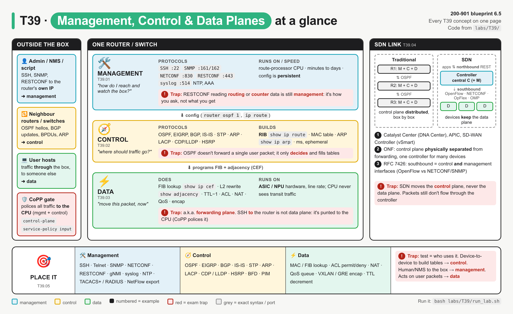
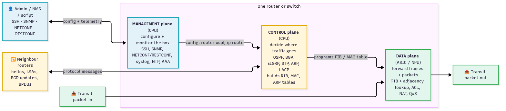
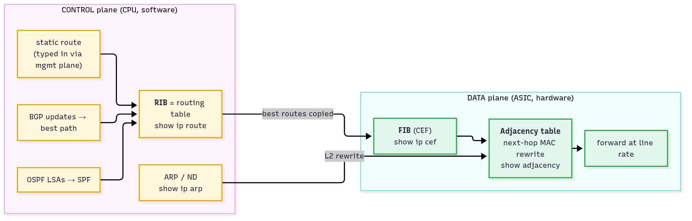
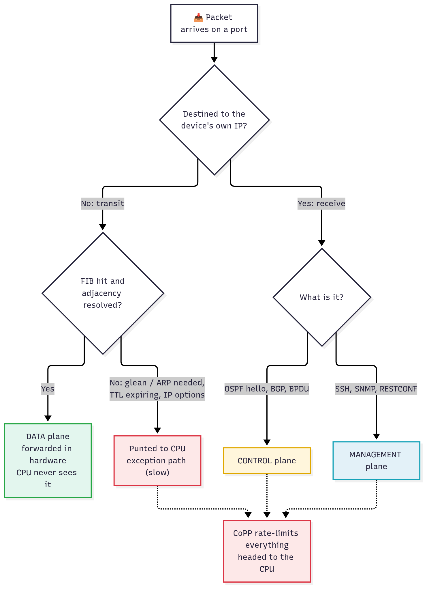
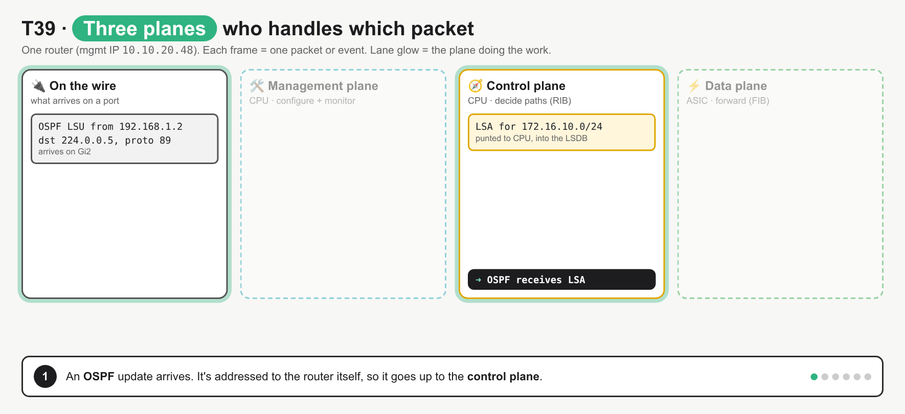
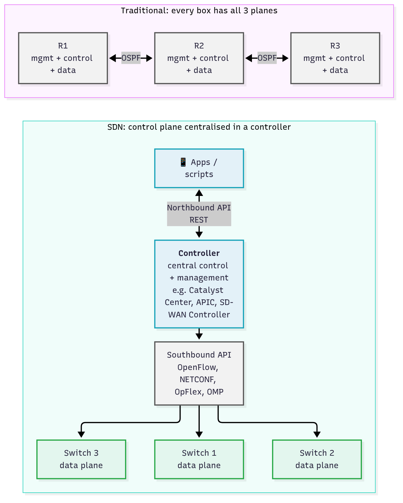
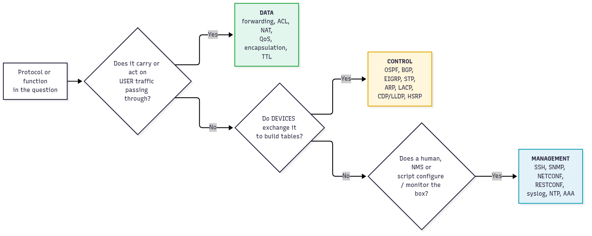

# T39 · Management, control, data planes

> Owner: **Bob** · Blueprint: **6.5** · CBT coverage: **Full** · Learn by 2026-10-07 · Teach-back 2026-10-08



*Read it left to right: who sends the traffic (left) → which plane inside the box handles it (middle, top to bottom = config flows down into forwarding) → what SDN moves to a controller (right). The bottom strip is the exam "place it" list. Red boxes are exam traps; the IDs under each panel title map to the T39.NN sections.*

## TL;DR (teach-back card)

- **Management = how you reach and watch the box** (SSH, SNMP, NETCONF/RESTCONF, syslog, NTP, AAA). **Control = how the boxes decide paths** (OSPF, BGP, EIGRP, STP, ARP, LACP) and fill the RIB, MAC and ARP tables. **Data = moving the user's packet** using the FIB + adjacency table in the ASIC (plus ACL, NAT, QoS, encap).
- **Config and decisions flow down:** management configures the control plane → the control plane builds the RIB → CEF copies it into the FIB → the data plane forwards at line rate. Transit traffic never touches the CPU. Traffic **to** the router's own IP (SSH, OSPF hellos) is punted to the CPU, and CoPP polices it.
- **SDN centralises the control plane** in a controller (Catalyst Center (DNA Center), APIC, SD-WAN Controller (vSmart)). Apps talk to it over the **northbound** REST API, and it programs devices **southbound** (OpenFlow, NETCONF, OpFlex, OMP). Devices **keep the data plane**.
- **Trap:** classify by **who uses it and why**, not by what data it carries. RESTCONF pulling the routing table is still **management**. ARP is **control** (it builds a table), even though it's "just L2".

## Concepts

The note hangs on one picture and one program.

- **Picture:** one router with three stacked planes (below). Config flows down; packets flow left to right through the bottom plane only.
- **Program:** `labs/T39/planes_probe.py` opens a single RESTCONF session to an IOS XE router. Every call it makes goes over the **management** plane. It reads back management config, **control**-plane results (RIB + ARP) and **data**-plane counters, then runs the "place it" drill. That's the exam point in one script: *the transport you use and the data you read can be in different planes.*
- `labs/T39/mock_device.py` is a stdlib stand-in for the IOS XE RESTCONF server on `http://127.0.0.1:18039/restconf/data` (port overridable with `T39_PORT`). It returns JSON in the shape of the YANG models named in each path. `bash labs/T39/run_lab.sh` starts the mock, runs the probe, then stops the mock.



*Blue = management, yellow = control, green = data. Notice only the green path carries user packets; the two CPU planes only configure and program it.*

**`labs/T39/planes_probe.py`**

```python
"""T39 reference program: one RESTCONF session that reads all three planes.

Start the mock first:  python3 labs/T39/mock_device.py
Then:                  python3 labs/T39/planes_probe.py
Real device:           export RESTCONF_BASE=https://<host>/restconf/data (plus RESTCONF_USER / RESTCONF_PASS)

Every call below travels over the MANAGEMENT plane (RESTCONF over HTTP/S).
What it reads back is management config, CONTROL-plane results or DATA-plane counters.
"""
import os
import time

import requests

BASE = os.environ.get("RESTCONF_BASE", "http://127.0.0.1:18039/restconf/data")
AUTH = (os.environ.get("RESTCONF_USER", "admin"), os.environ.get("RESTCONF_PASS", "C1sco12345"))
HEADERS = {"Accept": "application/yang-data+json"}

# Which plane does each protocol or function belong to? (T39.05)
PLANES = {
    "management": ["SSH", "Telnet", "SNMP", "NETCONF", "RESTCONF", "gNMI", "syslog",
                   "NTP", "TACACS+", "RADIUS", "NetFlow export", "HTTPS GUI"],
    "control": ["OSPF", "EIGRP", "BGP", "IS-IS", "STP", "ARP", "LACP", "CDP", "LLDP",
                "HSRP", "BFD", "PIM", "OpenFlow (controller -> switch)"],
    "data": ["forward frame by MAC table", "forward packet by FIB (CEF)", "ACL permit/deny",
             "NAT translation", "QoS marking/queuing", "VXLAN/GRE encapsulation", "TTL decrement"],
}


def which_plane(item):
    """Return the plane name for a protocol or function, or 'unknown'."""
    for plane, items in PLANES.items():
        if item in items:
            return plane
    return "unknown"


def get(path):
    """One RESTCONF GET over the management plane; returns the decoded JSON body."""
    response = requests.get(f"{BASE}/{path}", auth=AUTH, headers=HEADERS, verify=False, timeout=10)
    response.raise_for_status()
    return response.json()


def management_plane():
    print("== MANAGEMENT plane: how we reach and watch the box ==")
    ssh = get("Cisco-IOS-XE-native:native/ip/ssh")["Cisco-IOS-XE-native:ssh"]
    log = get("Cisco-IOS-XE-native:native/logging")["Cisco-IOS-XE-native:logging"]
    print(f"  ip ssh version {ssh['version']}")
    for host in log["host"]["ipv4-host-list"]:
        print(f"  logging host {host['ipv4-host']}")


def control_plane():
    print("\n== CONTROL plane: what the protocols decided (RIB + ARP) ==")
    state = get("ietf-routing:routing-state")["ietf-routing:routing-state"]
    rib = state["routing-instance"][0]["ribs"]["rib"][0]
    for route in rib["routes"]["route"]:
        proto = route["source-protocol"].split(":")[1]
        hop = route["next-hop"].get("next-hop-address") or route["next-hop"].get("outgoing-interface")
        print(f"  {route['destination-prefix']:<16} via {hop:<16} learned by {proto}")
    arp = get("Cisco-IOS-XE-arp-oper:arp-data")["Cisco-IOS-XE-arp-oper:arp-data"]
    for entry in arp["arp-vrf"][0]["arp-oper"]:
        print(f"  ARP {entry['address']:<14} -> {entry['hardware']} on {entry['interface']}")


def data_plane(interval=1.0):
    print("\n== DATA plane: what the hardware forwarded (counters) ==")
    path = "ietf-interfaces:interfaces-state/interface=GigabitEthernet2/statistics"
    first = get(path)["ietf-interfaces:statistics"]
    time.sleep(interval)
    second = get(path)["ietf-interfaces:statistics"]
    for key in ("in-unicast-pkts", "out-unicast-pkts", "in-discards"):
        delta = int(second[key]) - int(first[key])
        print(f"  {key:<17} {int(second[key]):>9}  (+{delta} in {interval:.0f}s)")


def classify_drill():
    print("\n== Exam drill: place each item in its plane ==")
    for item in ["BGP", "SNMP", "ARP", "ACL permit/deny", "NETCONF", "STP", "NAT translation", "syslog"]:
        print(f"  {item:<16} -> {which_plane(item)}")


def main():
    requests.packages.urllib3.disable_warnings()      # lab devices use self-signed certs
    management_plane()
    control_plane()
    data_plane()
    classify_drill()


if __name__ == "__main__":
    main()
```

**Output** (`bash labs/T39/run_lab.sh`):

```
== MANAGEMENT plane: how we reach and watch the box ==
  ip ssh version 2
  logging host 10.10.20.100

== CONTROL plane: what the protocols decided (RIB + ARP) ==
  0.0.0.0/0        via 10.10.20.254     learned by static
  10.10.20.0/24    via GigabitEthernet1 learned by direct
  172.16.10.0/24   via 192.168.1.2      learned by ospfv2
  203.0.113.0/24   via 192.168.1.6      learned by bgp
  ARP 10.10.20.254   -> 00:50:56:bf:49:0f on GigabitEthernet1
  ARP 192.168.1.2    -> 52:54:00:1a:2b:3c on GigabitEthernet2

== DATA plane: what the hardware forwarded (counters) ==
  in-unicast-pkts     1404115  (+1000 in 1s)
  out-unicast-pkts    1190530  (+900 in 1s)
  in-discards               0  (+0 in 1s)

== Exam drill: place each item in its plane ==
  BGP              -> control
  SNMP             -> management
  ARP              -> control
  ACL permit/deny  -> data
  NETCONF          -> management
  STP              -> control
  NAT translation  -> data
  syslog           -> management
```

### T39.01 · Management plane

**Must cover:**

- [x] Configure and monitor the device: SSH, SNMP, NETCONF/RESTCONF, APIs, syslog

**Notes:**

- **Job:** access, configure, monitor and maintain the device. Cisco's hardening guide: the management plane "manages traffic sent to the Cisco IOS device" and is "used to access, configure, and manage a device".
- **Runs on:** the route-processor CPU. It's software, and it's slow on purpose: changes happen over minutes to days (RFC 7426 §3.5.1). The config it writes is **persistent** (survives reload once saved).
- **Protocols to know, with ports:**

| Protocol | Port | Direction | Use |
|---|---|---|---|
| SSH | TCP 22 | admin → device | CLI (`ip ssh version 2` in the probe output) |
| Telnet | TCP 23 | admin → device | CLI in clear text (exam: "insecure" choice) |
| SNMP | UDP 161 (poll), UDP 162 (trap) | NMS ↔ device | MIB reads/writes, traps |
| NETCONF | TCP 830 (over SSH) | script → device | YANG config/state, XML ([T15](T15-netconf.md)) |
| RESTCONF | TCP 443 (HTTPS) | script → device | YANG over REST, JSON/XML ([T16](T16-restconf.md)) |
| gNMI | TCP 9339 on IOS XE ⚠ verify | collector ↔ device | streaming telemetry |
| syslog | UDP 514 | device → server | event logs (`logging host 10.10.20.100` in the probe output) |
| NTP | UDP 123 | device ↔ server | clock (logs and certs depend on it) |
| TACACS+ / RADIUS | TCP 49 / UDP 1812-1813 | device → AAA server | who may log in, what they may run |
| Controller APIs | HTTPS 443 | script → controller | e.g. Catalyst Center REST (management of many boxes at once) |

- **In the program:** `management_plane()` reads `Cisco-IOS-XE-native:native/ip/ssh` and `Cisco-IOS-XE-native:native/logging`: config *about* management protocols. The `get()` helper itself (RESTCONF over HTTPS) **is** management-plane traffic for every call.
- **Management configures the control plane:** typing `router ospf 1` or `ip route 0.0.0.0 0.0.0.0 10.10.20.254` over SSH (or pushing the same through NETCONF) is a management-plane action. The OSPF process and the route it creates then live in the control plane.
- **NetFlow / telemetry export:** the device *collects* flow records about data-plane traffic, but **exporting** them to a collector is management (Cisco lists NetFlow under the management plane).
- **Out-of-band (OOB) management:** a dedicated mgmt port/VRF (e.g. `GigabitEthernet0/0` in `Mgmt-intf` VRF on many IOS XE boxes) keeps management reachable even when the data network is down. ⚠ verify the interface name per platform.

### T39.02 · Control plane

**Must cover:**

- [x] Builds forwarding information: routing protocols (OSPF, BGP), STP, ARP

**Notes:**

- **Job:** decide where traffic should go. Devices exchange protocol messages with **each other** and build the tables the data plane uses. RFC 7426: the control plane is "making decisions on how packets should be forwarded" and its main job is to "fine-tune the forwarding tables".
- **Runs on:** the route-processor CPU. Distributed (every router runs its own OSPF), fast (milliseconds), and its state is **ephemeral** (rebuilt after a reload, not saved in the config).
- **What builds what:**

| Protocol | Layer | Builds |
|---|---|---|
| OSPF, EIGRP, IS-IS, BGP, RIP | L3 | RIB (`show ip route`) |
| Static route | L3 | RIB. Typed in via the management plane, but the route itself lives in the control plane |
| ARP (IPv4), ND (IPv6) | L2/L3 | ARP / neighbour table (`show ip arp`) → adjacency rewrite |
| STP / RSTP | L2 | port forwarding/blocking state (loop-free topology) |
| MAC learning | L2 | MAC address table (the switch learns source MACs; the data plane then uses it) |
| LACP, PAgP | L2 | which links join an EtherChannel |
| CDP, LLDP | L2 | neighbour table (discovery; often listed under control) |
| HSRP, VRRP, GLBP | L3 | who owns the virtual gateway IP |
| BFD | L3 | fast failure detection for routing protocols |
| PIM, IGMP | L3 | multicast tree |



*Left box = software decisions; right box = hardware tables. Notice the RIB never forwards anything: CEF copies the best routes into the FIB, and ARP supplies the L2 rewrite.*

- **RIB vs FIB (Cisco CEF):**
  - **RIB** = routing table, "a central repository of routes" with L3 reachability. Built by the control plane.
  - **FIB** = "a mirror image of the forwarding information in an IP routing table", "structured in a way that is optimized for forwarding". One-to-one with the RIB's best routes. Lives in the data plane.
  - **Adjacency table** = next hop's "outbound interface and MAC header rewrite", filled from ARP (or routing protocols).
- **In the program:** `control_plane()` reads `ietf-routing:routing-state` (the RIB, with `source-protocol` = who decided: `static`, `direct`, `ospfv2`, `bgp`) and `Cisco-IOS-XE-arp-oper:arp-data` (the ARP table). These are the control plane's **results**, read through the management plane.

### T39.03 · Data plane

**Must cover:**

- [x] Forwards packets/frames using the tables (hardware/ASIC)

**Notes:**

- **Job:** move each frame/packet from the ingress port to the egress port, using the tables the control plane built. Also called the **forwarding plane** (RFC 7426 §3.1). Cisco: it "forwards data through a network device" and "does not include traffic sent to the local Cisco IOS device".
- **Runs on:** hardware: ASICs on switches, NPUs/QFPs on routers. It runs at line rate, per packet, with no CPU involved.
- **Per-packet work:**
  - L2: MAC table lookup → forward / flood / filter.
  - L3: longest-prefix match in the FIB (`show ip cef`) → adjacency rewrite (`show adjacency`): new source/destination MAC, TTL − 1, header checksum.
  - Features applied in the path: ACL permit/deny, NAT translation, QoS marking/policing/queuing, VXLAN/GRE/IPsec encapsulation, uRPF.
- **In the program:** `data_plane()` reads `ietf-interfaces:interfaces-state/.../statistics` twice, one second apart. The counters grew in between (`+1000 in 1s`): the ASIC kept forwarding while the CPU did nothing.



*Follow one packet down. Green = the fast hardware path; red = everything that has to reach the CPU, which CoPP rate-limits.*



*Steps: OSPF update punted to the control plane → SPF installs the route in the RIB → CEF programs the FIB → a transit packet is forwarded in hardware with the CPU idle → SSH to the router's own IP is punted to the management plane → RESTCONF reads data-plane counters. It fixes two misconceptions: "every packet passes through the control plane" and "SSH to a router is data-plane traffic".*

- **Three kinds of traffic arriving on a port:**

| Kind | Example | Handled by |
|---|---|---|
| **Transit** | user's HTTPS to a server behind the router | data plane, hardware |
| **Receive** (to the device's own IP) | OSPF hello, BGP, SSH, SNMP | punted to the CPU → control or management plane |
| **Exception** (transit that hardware can't finish) | TTL about to expire (ICMP Time Exceeded), IP options, next hop needs ARP (glean) | punted to the CPU, slow path |

- **CoPP (Control Plane Policing):** a QoS policy applied to the CPU-bound path, so a flood of punted packets can't starve OSPF or SSH. It protects **both** the control and management planes. IOS XE syntax:
  - `control-plane` (enter control-plane config mode)
  - `service-policy input <policy-map-name>`
  - check it with `show policy-map control-plane`
  - Catalyst 9000 ships a default `system-cpp-policy`.

### T39.04 · SDN link

**Must cover:**

- [x] SDN centralises the control plane in a controller; devices keep the data plane

**Notes:**

- **Definition (ONF, quoted by Cisco):** "the physical separation of the network control plane from the forwarding plane, and where a control plane controls several devices." Cisco's own wording: SDN "centralizes management by abstracting the control plane from the data forwarding function".



*Top: every router decides for itself. Bottom: one controller decides; switches only forward. User packets still go switch to switch, never through the controller.*

- **Interfaces** (blueprint wording appears in T12 too):

| Interface | Between | Examples |
|---|---|---|
| **Northbound** | apps/scripts ↔ controller | REST APIs (Catalyst Center Intent API, APIC REST, SD-WAN Manager (vManage) REST) |
| **Southbound** | controller ↔ devices | OpenFlow (programs flow tables), NETCONF/RESTCONF, SNMP, CLI/SSH, OpFlex (ACI), OMP (SD-WAN) |
| **East-west** | controller ↔ controller | clustering, BGP between domains |

- RFC 7426 splits southbound into a **control-plane southbound interface** (time-critical, e.g. OpenFlow) and a **management-plane southbound interface** (not time-critical, e.g. NETCONF, SNMP, syslog). That's why a controller is usually "central control **and** management".
- **Cisco examples and which plane they centralise** ⚠ verify depth against T19/T20/T22:
  - **SD-WAN:** SD-WAN Controller (vSmart) = central control plane (OMP), SD-WAN Manager (vManage) = management plane, SD-WAN Validator (vBond) = orchestration/onboarding, WAN Edge routers = data plane.
  - **ACI:** APIC = policy/management controller; the fabric switches still run their own local control protocols (IS-IS, COOP, MP-BGP). APIC is **not** in the data path.
  - **Catalyst Center (DNA Center):** management/automation controller; devices keep both control and data planes and are configured via NETCONF/SSH/SNMP.
- **Benefits the exam names:** one place to configure many devices (consistency), network-wide view, programmability via northbound API. Data plane stays distributed, so forwarding performance doesn't depend on the controller.
- Controller-level vs device-level APIs are covered in [T12](T12-automation-foundations-controller-vs-device.md).

### T39.05 · Exam angle

**Must cover:**

- [x] Place a protocol or function in the correct plane

**Notes:**

- **Three-question test**, in this order:



*Ask the data question first: if it touches user packets in flight, it's data plane, whatever else it does.*

- **Placement table** (also the `PLANES` dict in `planes_probe.py`):

| Management | Control | Data |
|---|---|---|
| SSH, Telnet, console | OSPF, EIGRP, IS-IS, RIP | MAC table lookup / L2 switching |
| SNMP, syslog | BGP | FIB lookup (CEF) / L3 routing a packet |
| NETCONF, RESTCONF, gNMI, NX-API | STP / RSTP | ACL permit/deny |
| NTP | ARP / ND | NAT translation |
| TACACS+, RADIUS (device AAA) | LACP / PAgP | QoS marking, policing, queuing |
| NetFlow / IPFIX **export** | CDP, LLDP | VXLAN, GRE, IPsec encap/decap |
| HTTPS GUI, controller REST APIs | HSRP / VRRP, BFD, PIM | TTL decrement, checksum rewrite |

- **Scenario → answer:**
  - "An attacker floods the router with SSH SYNs; OSPF neighbours drop." → CPU-bound traffic starved the control plane → **CoPP**.
  - "Which plane is affected if the ARP table is empty?" → **control** plane failed to build adjacency → data plane can't rewrite → packets punted/dropped.
  - "A RESTCONF GET returns `ietf-routing:routing-state`." → transport = **management**, the data = **control**-plane results.
  - "Which plane does the SDN controller take over?" → **control** (often with management). **Not** data.
  - "Forwarding plane" in a question = **data plane**.

## Exam traps

- **Transport vs content:** RESTCONF/NETCONF/SNMP reading routes or counters is still **management** plane traffic. The plane is about the job the protocol does, not the data it carries.
- **ARP and STP are control plane**, even though they're "Layer 2". They build tables (ARP/adjacency, port states); they don't forward user frames.
- **Static routes:** typed in through the management plane (CLI/NETCONF), but the route lives in the **RIB** (control plane) and forwards via the **FIB** (data plane).
- **SSH/SNMP to the router's own IP** = management plane (punted to the CPU). SSH traffic **passing through** the router to a server behind it = data plane.
- **OSPF/BGP don't forward packets.** They only fill the RIB. If the question says "forwards", the answer is the data plane.
- **SDN moves the control plane, not the data plane.** User packets never flow through Catalyst Center, APIC or the SD-WAN Controller.
- **Northbound vs southbound:** north = apps → controller (REST). South = controller → devices (OpenFlow, NETCONF, OpFlex, OMP). Don't swap them.
- **CoPP protects the CPU** (control + management), and it's configured under `control-plane`, not on an interface.
- **RIB vs FIB:** RIB = `show ip route` (control). FIB = `show ip cef` (data). They hold the same best routes in different structures.
- **NetFlow:** flow *collection* watches data-plane traffic; *exporting* the records to a collector is management.

## Examples

### 1. Run the reference program

Local (needs Python 3 and `requests`):

```bash
cd ~/claude/learnings/ccna-automation/repo
python3 -m venv /tmp/venv-t39 && /tmp/venv-t39/bin/pip install requests
PYTHON=/tmp/venv-t39/bin/python bash labs/T39/run_lab.sh
```

Docker lab container (the image already has `requests`):

```bash
docker build --tag ccna-auto-lab:latest --file labs/Dockerfile labs/
docker run --rm --volume "$(pwd)":/work --workdir /work ccna-auto-lab:latest bash labs/T39/run_lab.sh
```

Other port, if 18039 is busy:

```bash
T39_PORT=18139 PYTHON=/tmp/venv-t39/bin/python bash labs/T39/run_lab.sh
```

### 2. Break it on purpose

Both were run; the last line shown is the real output.

- **Wrong password = management-plane access fails, nothing else changes.** Start the mock with the default credentials, then call it with a bad one:

  ```bash
  python3 labs/T39/mock_device.py &
  sleep 1
  RESTCONF_PASS=wrong python3 labs/T39/planes_probe.py 2>&1 | tail -1
  kill %1
  ```

  ```
  requests.exceptions.HTTPError: 401 Client Error: Unauthorized for url: http://127.0.0.1:18039/restconf/data/Cisco-IOS-XE-native:native/ip/ssh
  ```

  Lesson: losing the management plane means you can't see or change the box. The real router would still be forwarding (data plane) and keeping OSPF up (control plane).

- **Wrong interface = 404 from the RESTCONF server.** In `data_plane()`, change `interface=GigabitEthernet2` to `interface=GigabitEthernet9`, then run `bash labs/T39/run_lab.sh`:

  ```
  requests.exceptions.HTTPError: 404 Client Error: Not Found for url: http://127.0.0.1:18039/restconf/data/ietf-interfaces:interfaces-state/interface=GigabitEthernet9/statistics
  ```

  Undo with `git checkout -- labs/T39/planes_probe.py`.

### 3. Same reads from the CLI (one `show` per plane)

On any IOS XE router (e.g. the Catalyst 8000v always-on sandbox, over SSH):

```
show running-config | include ip ssh|logging host|snmp-server   ! management config
show ip route                                                    ! control: RIB
show ip arp                                                      ! control: ARP
show ip cef 172.16.10.0/24 detail                                ! data: FIB entry
show adjacency GigabitEthernet2 detail                           ! data: L2 rewrite
show interfaces GigabitEthernet2 | include packets input|packets output   ! data: counters
show policy-map control-plane                                    ! CoPP on the CPU path
```

### 4. CoPP config drill (IOS XE syntax)

```
ip access-list extended COPP-SSH
 permit tcp 10.10.20.0 0.0.0.255 any eq 22
class-map match-all COPP-SSH-CLASS
 match access-group name COPP-SSH
policy-map COPP-POLICY
 class COPP-SSH-CLASS
  police 64000 conform-action transmit exceed-action drop
control-plane
 service-policy input COPP-POLICY
```

- The policy is attached under `control-plane`, so it only sees packets going **to the CPU**. Transit SSH through the router is untouched.
- Not run here (no lab router with CoPP); the syntax follows the IOS XE 17 QoS configuration guide.

### 5. Drill: place it

Cover the answer column and say the plane out loud, then run `classify_drill()` (the last block of the program output) to check.

| Item | Plane |
|---|---|
| EIGRP hello | control |
| `logging host 10.10.20.100` | management |
| MAC table lookup on a switch | data |
| LLDP | control |
| `police` action on a QoS policy for user traffic | data |
| gNMI dial-in subscription | management |
| HSRP | control |
| GRE encapsulation | data |

## Practice questions

**Q1.** Which two protocols operate in the control plane of a router? (Choose two.)
A. SNMP  B. OSPF  C. NAT  D. ARP  E. syslog

<details><summary>Answer</summary>

**B, D.** OSPF builds the RIB and ARP builds the adjacency table. Both are device-to-device protocols that build forwarding information. SNMP and syslog are management; NAT acts on user packets, so it's data plane. (T39.02, T39.05)
</details>

**Q2.** A Python script sends `GET https://10.10.20.48/restconf/data/ietf-routing:routing-state` and prints the routing table. Which plane carries the script's request?
A. Data plane, because it's an HTTPS packet  B. Control plane, because it returns routes  C. Management plane  D. Application plane

<details><summary>Answer</summary>

**C.** RESTCONF to the device's own IP is management-plane access. The content returned is control-plane state, but how you ask decides the plane. (T39.01)
</details>

**Q3.** Which statement describes the data plane?
A. It exchanges routing updates with neighbours  B. It forwards packets using tables such as the FIB, usually in hardware  C. It processes SSH sessions to the device  D. It runs on the SDN controller

<details><summary>Answer</summary>

**B.** Data (forwarding) plane = per-packet forwarding in the ASIC using FIB + adjacency. A = control, C = management, D = SDN moves the control plane, not the data plane. (T39.03)
</details>

**Q4.** In an SDN architecture, what does the controller take over from the network devices?
A. The data plane  B. The control plane  C. Packet forwarding between hosts  D. Physical layer encoding

<details><summary>Answer</summary>

**B.** SDN centralises the control plane in a controller; the devices keep the data plane and still forward packets themselves. (T39.04)
</details>

**Q5.** Put these in order, from the routing decision to a packet leaving the router: `FIB programmed by CEF` · `OSPF LSA received` · `packet forwarded out Gi2 with a new MAC header` · `SPF installs route in RIB`

<details><summary>Answer</summary>

`OSPF LSA received` → `SPF installs route in RIB` → `FIB programmed by CEF` → `packet forwarded out Gi2 with a new MAC header`. Control plane decides (first two), CEF copies the RIB into the FIB, then the data plane forwards. (T39.02, T39.03, see the GIF)
</details>

**Q6.** A router's OSPF adjacencies keep dropping while it's being flooded with SSH connection attempts aimed at its loopback. Which feature protects against this?
A. An ACL on the outbound WAN interface  B. Control Plane Policing  C. Increasing the OSPF hello interval  D. Enabling CEF

<details><summary>Answer</summary>

**B.** CoPP rate-limits traffic punted to the CPU, so management traffic (SSH) can't starve control-plane traffic (OSPF hellos). It's attached under `control-plane` with `service-policy input`. (T39.03)
</details>

**Q7.** Refer to the `PLANES` dictionary in `labs/T39/planes_probe.py`. What does `which_plane("LACP")` return, and what does `which_plane("SD-WAN OMP")` return?

<details><summary>Answer</summary>

`"control"` and `"unknown"`. LACP is in the `control` list. `"SD-WAN OMP"` isn't in any list, so the loop finishes and the function returns `"unknown"`. (OMP itself is a control-plane protocol between the SD-WAN Controller and the edges.) (T39.05)
</details>

**Q8.** An SDN application uses a REST API to ask the controller for the list of devices. The controller then uses OpenFlow to install flow entries on the switches. Which pair is correct?
A. REST = southbound, OpenFlow = northbound  B. REST = northbound, OpenFlow = southbound  C. Both are northbound  D. Both are east-west

<details><summary>Answer</summary>

**B.** Northbound = apps ↔ controller (REST). Southbound = controller ↔ devices (OpenFlow, NETCONF, OpFlex, OMP). (T39.04)
</details>

## Study aids

| Aid | Type | Title | Est. min | Resource |
|---|---|---|---|---|
| T39.1 | Video | Explain the Management, Control, and Data Planes | 25 | CBT module |

- Skip / low priority: n/a

## Sources

- Overview image: HTML source `assets/T39/00-overview.html`, rendered to PNG (see `assets/README.md`). Diagrams: Mermaid sources in `assets/T39/*.mmd`. Animation: `assets/T39/06-packet-journey-anim.html` → `06-packet-journey.gif`.
- Cisco Guide to Harden Cisco IOS Devices (definitions of management, control and data planes; protocols per plane; CPPr/CoPP): https://www.cisco.com/c/en/us/support/docs/ip/access-lists/13608-21.html
- RFC 7426, SDN Layers and Architecture Terminology (forwarding/control/management/operational planes, timescale and persistence, CPSI vs MPSI, northbound): https://www.rfc-editor.org/rfc/rfc7426
- Cisco IOS XE CEF overview (FIB as a mirror of the routing table, adjacency table, punt adjacency): https://www.cisco.com/c/en/us/td/docs/ios-xml/ios/ipswitch_cef/configuration/xe-16/isw-cef-xe-16-book/isw-cef-overview.html
- Cisco IOS XE 17 QoS configuration guide, Control Plane Policing (`control-plane`, `service-policy input`, `show policy-map control-plane`): https://www.cisco.com/c/en/us/td/docs/routers/ios/config/17-x/qos/b-quality-of-service/m_qos-plcshp-ctrl-pln-plc-0.html
- Catalyst 9300 IOS XE 17.12 security guide, CoPP (`system-cpp-policy`): https://www.cisco.com/c/en/us/td/docs/switches/lan/catalyst9300/software/release/17-12/configuration_guide/sec/b_1712_sec_9300_cg/configuring_control_plane_policing.html
- Cisco SDN definition: https://www.cisco.com/c/en/us/solutions/software-defined-networking/overview.html
- Cisco VMDC SDN design guide (ONF definition of SDN): https://www.cisco.com/c/en/us/td/docs/solutions/Enterprise/Data_Center/VMDC/SDN/SDN.html
- RFC 8040 RESTCONF (media type `application/yang-data+json`): https://www.rfc-editor.org/rfc/rfc8040
- Cisco 200-901 v1.1 exam topics (6.5): https://learningcontent.cisco.com/documents/marketing/exam-topics/200-901-CCNAAUTO_v.1.1.pdf

## To verify

- ⚠ **Not run against a live sandbox.** `devnetsandboxiosxe.cisco.com:443` answered, but the documented default credentials returned `401` this session, so the lab uses `labs/T39/mock_device.py`. To run for real: `export RESTCONF_BASE=https://devnetsandboxiosxe.cisco.com/restconf/data RESTCONF_USER=… RESTCONF_PASS=…` (current creds from developer.cisco.com/sandbox), then `python3 labs/T39/planes_probe.py`.
- ⚠ The JSON shapes for `Cisco-IOS-XE-native:native/ip/ssh` (`"version": 2`), `Cisco-IOS-XE-native:native/logging` (`host/ipv4-host-list`) and `Cisco-IOS-XE-arp-oper:arp-data` (`arp-vrf/arp-oper`) are written from memory of the models. Check them against a real device or the YANG files in github.com/YangModels/yang (vendor/cisco/xe).
- ⚠ `source-protocol` identities in the mock RIB: `ietf-routing:static` / `ietf-routing:direct` / `ietf-ospf:ospfv2` are standard identities; the BGP value IOS XE actually returns may differ from `ietf-routing:bgp`. Also, `routing-state` is the deprecated pre-NMDA container (RFC 8349); newer code reads `ietf-routing:routing` from the operational datastore.
- ⚠ gNMI default port on IOS XE (9339 vs 50052 for insecure) and the OOB management interface name/VRF (`GigabitEthernet0/0`, `Mgmt-intf`) vary by platform and release.
- ⚠ SD-WAN / ACI / Catalyst Center plane mapping in T39.04 is the commonly taught split; cross-check with T19, T20 and T22 once those are verified.
- Example 4 (CoPP config) and Example 3 (`show` commands) weren't run; no lab router was available.
- The Docker command in Example 1 wasn't run; the reference program and both break-it edits were run locally with Python 3.10 + requests 2.34.2, and the output shown is real.
