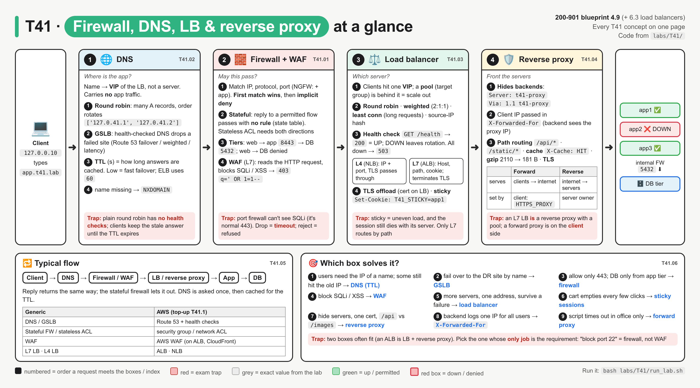
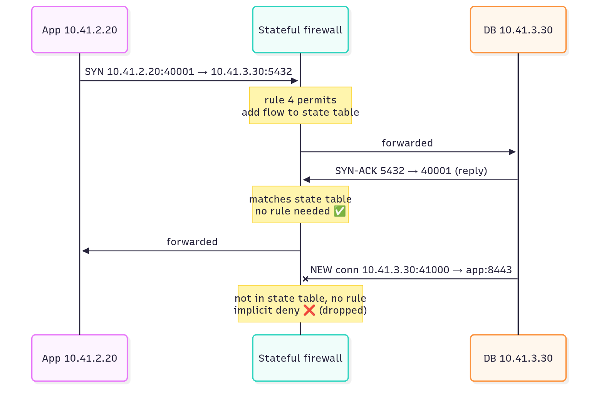
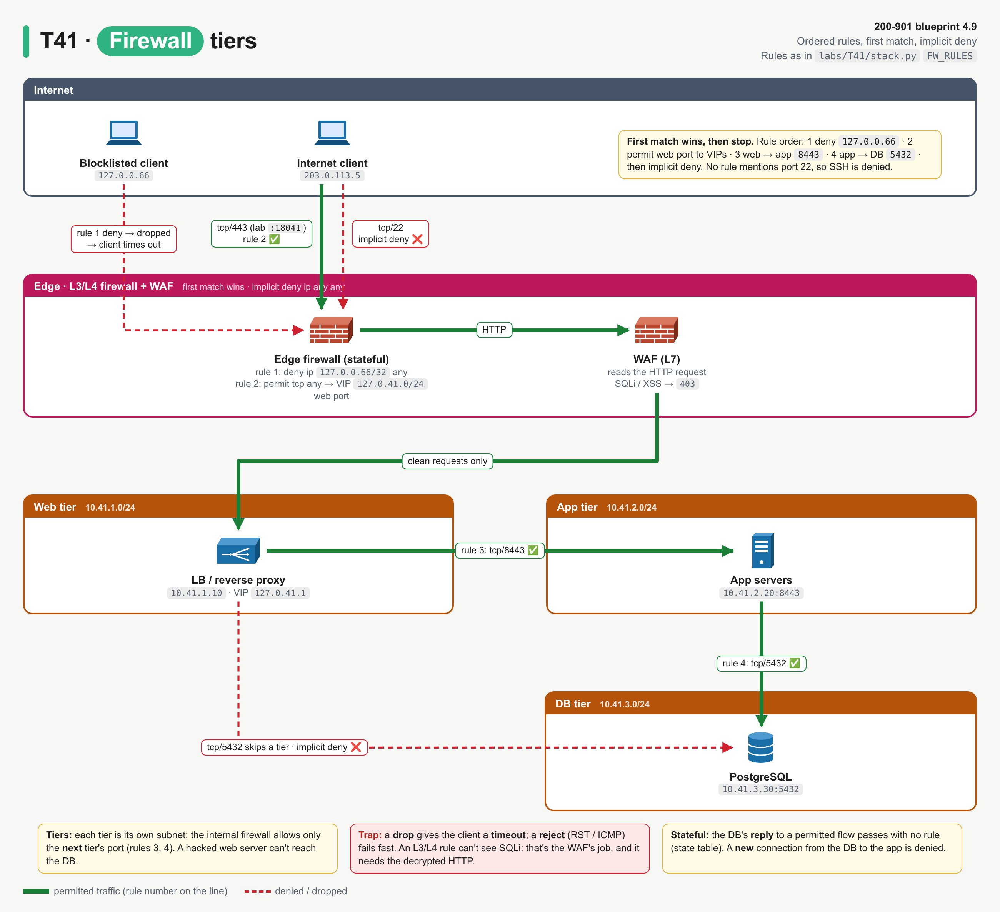
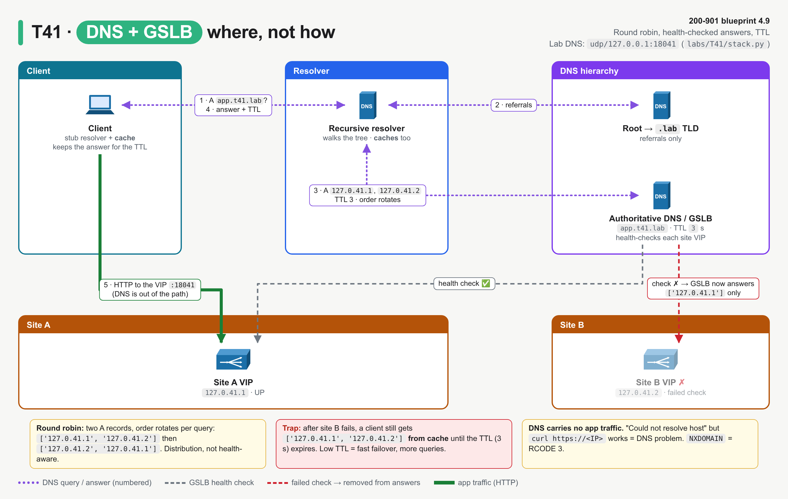
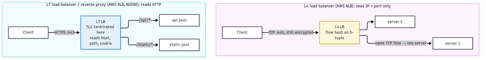
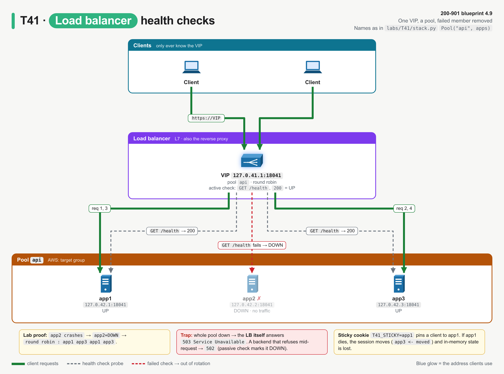
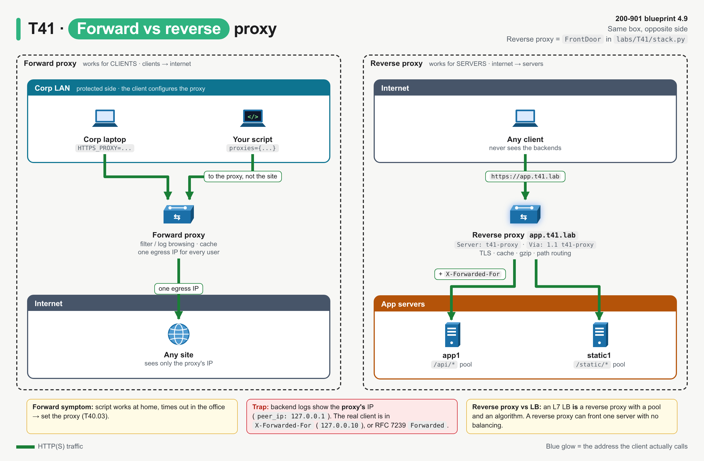
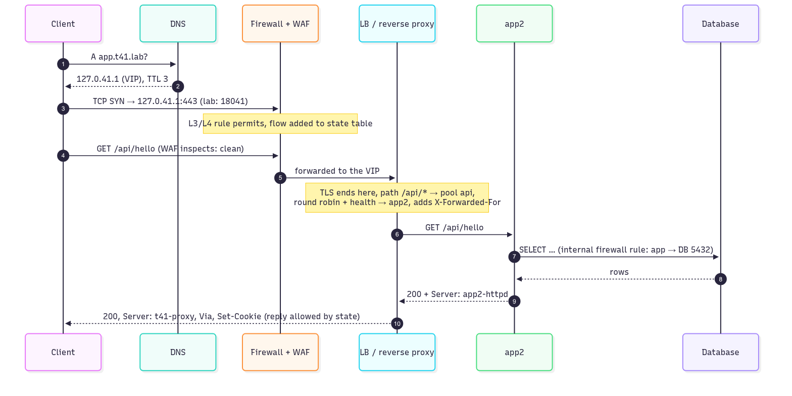
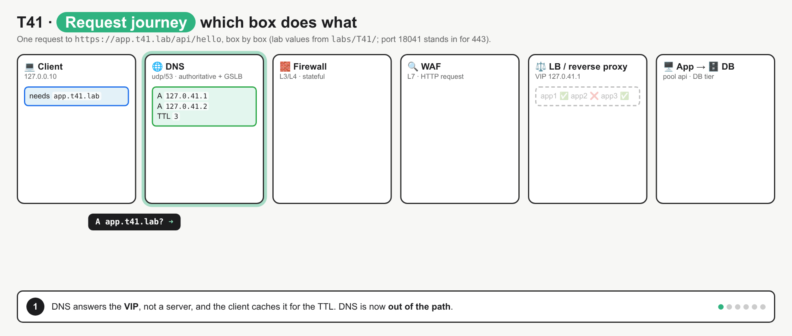
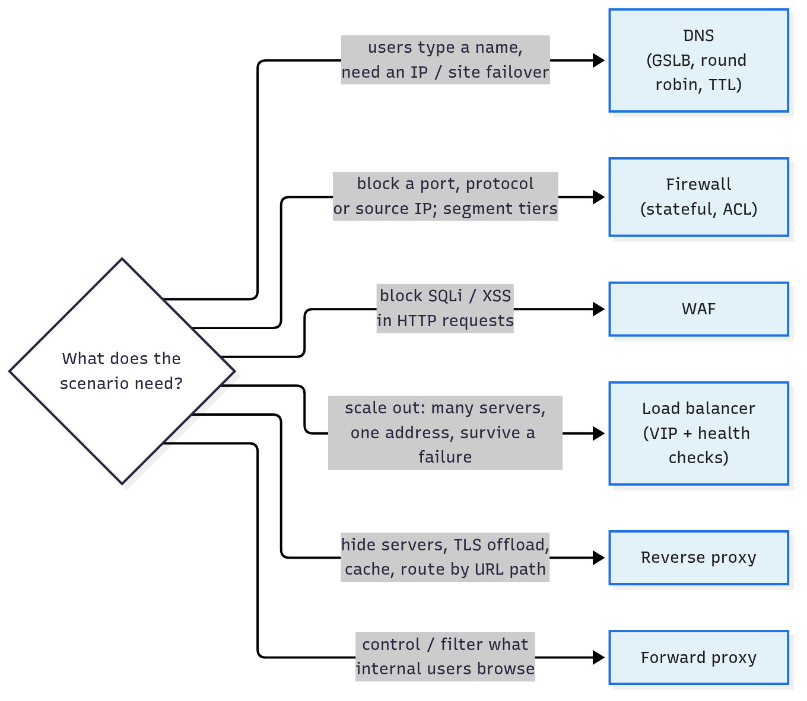

# T41 · Firewall, DNS, LB, reverse proxy

> Owner: **Bob** · Blueprint: **4.9** · CBT coverage: **None** · Learn by 2026-10-19 · Teach-back 2026-10-20



*Read left to right like a request. Each zone is one box from blueprint 4.9 (concept IDs in grey), numbered circles are the order a request meets them, and red boxes are exam traps. The bottom strip is the "which box solves it?" picker.*

## TL;DR (teach-back card)

- **Each box answers one question.** DNS: *where* is the app (name → VIP, TTL, GSLB failover). Firewall: *may* this packet pass (IP / port / protocol, stateful, first match, implicit deny). WAF: is this *HTTP request* an attack (SQLi, XSS). LB: *which* server (VIP → pool, round robin / least conn / weighted, health checks). Reverse proxy: *front* the servers (hide them, TLS termination, cache, compress, route by path).
- **L4 vs L7 decides what a box can see.** A firewall ACL or L4 LB (AWS NLB) sees IP + port only. A WAF, L7 LB (AWS ALB) or reverse proxy terminates TLS and reads Host, path, headers, cookies, so only they can route `/api/*` vs `/static/*`, set sticky cookies or block `' OR 1=1--`.
- **Forward vs reverse proxy = whose side it is on.** Forward proxy: chosen by *clients* to reach the internet (`HTTPS_PROXY`). Reverse proxy: sits in front of *servers*; clients think it *is* the server. An L7 load balancer is a reverse proxy with a pool behind it.
- **Trap:** a stateful firewall needs **no rule for the reply** (state table), and a dropped packet gives a **timeout**, not "connection refused". DNS round robin has **no health checks**, so failover waits for TTL expiry; an LB health check removes a dead server in seconds.

## Concepts

Every section explains one box of the same request path. Read the program once first.

- `labs/T41/stack.py` builds the whole path as small real network services on Linux loopback (Python stdlib only):

| Box | Address (lab) | What it does in the lab |
|---|---|---|
| DNS server | `udp/127.0.0.1:18041` | authoritative for `app.t41.lab`: two site VIPs, order rotates, TTL 3 s, GSLB drops a failed site |
| Front door (firewall + WAF + LB + reverse proxy) | `tcp/127.0.41.1:18041` (site A), `127.0.41.2` (site B) | like an F5 / NGINX / AWS ALB with AWS WAF attached |
| App servers, pool `api` | `127.0.42.1-3:18041` (`app1`-`app3`) | answer `/api/*` with who served the request |
| Static server, pool `static` | `127.0.42.11:18041` | answers `/static/app.css` with `Cache-Control: max-age=60` |

- Port `18041` stands in for `443`, so the lab doesn't clash with anything (override with `T41_PORT`).
- `labs/T41/walkthrough.py` (below) is the **reference program**. It starts the stack in-process, then sends one request at a time through it, one section per box.
- Run it: `bash labs/T41/run_lab.sh` (about 7 s, because it waits out one DNS TTL).

**`labs/T41/walkthrough.py`**

```python
"""T41 reference program: one app request's journey, box by box.

    client -> DNS -> firewall -> WAF -> load balancer / reverse proxy -> app servers

Run:  python3 labs/T41/walkthrough.py
It starts labs/T41/stack.py in the same process (Python stdlib only, Linux loopback addresses).
"""
import http.client
import json
import socket
import struct
import threading
import time

import stack

CLIENT_IP = "127.0.0.10"      # our laptop
BLOCKED_IP = "127.0.0.66"     # on the firewall blocklist (rule 1)


def dns_query(name, qtype=1):
    """Send one DNS query (type A by default) over UDP. Return (rcode, [IPs], TTL)."""
    qname = b"".join(bytes([len(label)]) + label.encode() for label in name.split(".")) + b"\0"
    query = struct.pack("!HHHHHH", 0x4141, 0x0100, 1, 0, 0, 0) + qname + struct.pack("!HH", qtype, 1)
    sock = socket.socket(socket.AF_INET, socket.SOCK_DGRAM)
    sock.settimeout(1)
    sock.sendto(query, (stack.DNS_ADDR, stack.PORT))
    reply = sock.recv(512)
    sock.close()
    rcode = {0: "NOERROR", 3: "NXDOMAIN"}[reply[3] & 0x0F]
    count = struct.unpack("!H", reply[6:8])[0]
    pos, ips, ttl = 12 + len(qname) + 4, [], None
    for _ in range(count):
        _, _, _, ttl, rdlen = struct.unpack("!HHHLH", reply[pos:pos + 12])
        ips.append(socket.inet_ntoa(reply[pos + 12:pos + 12 + rdlen]))
        pos += 12 + rdlen
    return rcode, ips, ttl


class CachingResolver:
    """Client-side cache (like the OS or browser): reuse an answer until its TTL runs out."""

    def __init__(self):
        self.cache = {}

    def resolve(self, name):
        hit = self.cache.get(name)
        if hit and hit[0] > time.time():
            return hit[1], f"from cache, {hit[0] - time.time():.0f} s of TTL left"
        _, ips, ttl = dns_query(name)
        self.cache[name] = (time.time() + ttl, ips)
        return ips, f"from DNS server, TTL {ttl}"


def get(vip, path, headers=None, source=CLIENT_IP, timeout=1):
    """HTTP GET to a VIP from a chosen source IP. Return (response, body)."""
    conn = http.client.HTTPConnection(vip, stack.PORT, timeout=timeout, source_address=(source, 0))
    conn.request("GET", path, headers={"Host": "app.t41.lab", **(headers or {})})
    resp = conn.getresponse()
    body = resp.read()
    conn.close()
    return resp, body


def served_by(vip, path="/api/hello", headers=None):
    resp, body = get(vip, path, headers, timeout=3)
    return json.loads(body)["served_by"] if resp.status == 200 else f"{resp.status} {resp.reason}"


def main():
    s = stack.build_stack()
    api, apps, fw = s["pools"]["api"], s["apps"], s["door"].firewall

    print("== 1. DNS: name -> VIP (round robin, GSLB failover, TTL) ==")
    for _ in range(2):
        print("query app.t41.lab A   ->", *dns_query("app.t41.lab"))
    print("query nope.t41.lab A  ->", *dns_query("nope.t41.lab"))
    resolver = CachingResolver()
    print("client resolves       ->", *resolver.resolve("app.t41.lab"))
    s["dns"].site_up["127.0.41.2"] = False
    print("GSLB: site B 127.0.41.2 fails its health check, DNS stops handing it out")
    print("DNS server now says   ->", *dns_query("app.t41.lab"))
    print("client resolves       ->", *resolver.resolve("app.t41.lab"), " <- stale: still lists site B")
    time.sleep(stack.DNS_TTL)
    print(f"after {stack.DNS_TTL} s TTL expiry  ->", *resolver.resolve("app.t41.lab"))
    s["dns"].site_up["127.0.41.2"] = True
    vip = resolver.resolve("app.t41.lab")[0][0]
    print("VIP to use:", vip)

    print("\n== 2. Firewall: L3/L4 rules, first match wins, implicit deny, stateful ==")
    packets = [
        ("internet -> VIP web port",      "203.0.113.5", 50000, "127.0.41.1", stack.PORT),
        ("internet -> VIP SSH",           "203.0.113.5", 50001, "127.0.41.1", 22),
        ("web tier -> app tier",          "10.41.1.10",  40000, "10.41.2.20", 8443),
        ("app tier -> DB tier",           "10.41.2.20",  40001, "10.41.3.30", 5432),
        ("DB reply -> app (same flow)",   "10.41.3.30",  5432,  "10.41.2.20", 40001),
        ("DB opens new conn -> app",      "10.41.3.30",  41000, "10.41.2.20", 8443),
        ("web tier -> DB (skips a tier)", "10.41.1.10",  40002, "10.41.3.30", 5432),
    ]
    for label, src, sport, dst, dport in packets:
        verdict, why = fw.check("tcp", src, sport, dst, dport)
        print(f"{label:31} tcp {src}:{sport} -> {dst}:{dport:<5}  {verdict.upper():6} ({why})")
    for source in (BLOCKED_IP, CLIENT_IP):
        try:
            resp, _ = get(vip, "/api/hello", source=source)
            print(f"real GET from {source:21} -> {resp.status} {resp.reason}")
        except OSError as err:
            print(f"real GET from {source:21} -> {type(err).__name__}: no reply, the packet was dropped")

    print("\n== 3. WAF: L7 inspection of the HTTP request ==")
    for path in ["/api/search?q=router",
                 "/api/search?q=%27%20OR%201%3D1--",
                 "/api/search?q=%3Cscript%3Ealert(1)%3C/script%3E"]:
        resp, body = get(vip, path)
        print(f"GET {path:48} -> {resp.status} {body.decode() if resp.status != 200 else resp.reason}")

    print("\n== 4. Load balancer: one VIP, many servers ==")
    api.rr_index = 0
    print("round robin       :", " ".join(served_by(vip) for _ in range(6)))
    api.algorithm, apps[0].weight = "weighted", 2
    picks = [served_by(vip) for _ in range(8)]
    print("weighted 2:1:1    :", " ".join(picks), " counts", {a.name: picks.count(a.name) for a in apps})
    api.algorithm, apps[0].weight = "least_conn", 1
    slow = []
    threads = [threading.Thread(target=lambda: slow.append(served_by(vip, "/api/slow"))) for _ in range(2)]
    for t in threads:
        t.start()
        time.sleep(0.2)
    print("least connections : 2 slow requests in flight, then fast ones go to",
          served_by(vip), served_by(vip))
    for t in threads:
        t.join()
    print("                    the slow ones were served by", " ".join(slow))

    print("\n== 5. Health checks: failed servers leave the pool ==")
    api.algorithm, api.rr_index = "round_robin", 0
    print("health check      :", api.health_check())
    apps[1].stop()
    print("app2 crashes")
    print("health check      :", api.health_check())
    print("round robin       :", " ".join(served_by(vip) for _ in range(4)))
    apps[0].stop()
    apps[2].stop()
    print("app1 and app3 crash too")
    print("health check      :", api.health_check())
    print("GET /api/hello    :", served_by(vip))
    for app in apps:
        app.start()
    print("all three restarted")
    print("health check      :", api.health_check())

    print("\n== 6. Session persistence (sticky cookie) ==")
    api.rr_index = 0
    resp, body = get(vip, "/api/hello")
    cookie = resp.getheader("Set-Cookie")
    print(f"first request     : {json.loads(body)['served_by']}, LB sets Set-Cookie: {cookie}")
    print("with the cookie   :", " ".join(served_by(vip, headers={"Cookie": cookie}) for _ in range(3)))
    apps[0].stop()
    print("app1 crashes; health check:", api.health_check())
    print("with the cookie   :", served_by(vip, headers={"Cookie": cookie}), " <- moved: app1's session is gone")
    apps[0].start()
    api.health_check()

    print("\n== 7. Reverse proxy: hide backends, path routing, cache, compression ==")
    conn = http.client.HTTPConnection("127.0.42.1", stack.PORT, timeout=1, source_address=(CLIENT_IP, 0))
    conn.request("GET", "/api/hello")
    direct = conn.getresponse()
    print(f"direct to app1    : Server: {direct.getheader('Server')}  body {direct.read().decode()}")
    resp, body = get(vip, "/api/hello")
    print(f"through the proxy : Server: {resp.getheader('Server')}  Via: {resp.getheader('Via')}")
    print(f"                    body {body.decode()}")
    for path in ["/static/app.css", "/static/app.css", "/admin"]:
        resp, body = get(vip, path)
        print(f"GET {path:16}  -> {resp.status} {resp.reason:10} X-Cache: {resp.getheader('X-Cache')}"
              f"  {len(body)} bytes")
    resp, body = get(vip, "/static/app.css", headers={"Accept-Encoding": "gzip"})
    print(f"GET /static/app.css + Accept-Encoding: gzip -> Content-Encoding: {resp.getheader('Content-Encoding')}"
          f"  {len(body)} bytes")


if __name__ == "__main__":
    main()
```

**Output** (`bash labs/T41/run_lab.sh`):

```
== 1. DNS: name -> VIP (round robin, GSLB failover, TTL) ==
query app.t41.lab A   -> NOERROR ['127.0.41.1', '127.0.41.2'] 3
query app.t41.lab A   -> NOERROR ['127.0.41.2', '127.0.41.1'] 3
query nope.t41.lab A  -> NXDOMAIN [] None
client resolves       -> ['127.0.41.1', '127.0.41.2'] from DNS server, TTL 3
GSLB: site B 127.0.41.2 fails its health check, DNS stops handing it out
DNS server now says   -> NOERROR ['127.0.41.1'] 3
client resolves       -> ['127.0.41.1', '127.0.41.2'] from cache, 3 s of TTL left  <- stale: still lists site B
after 3 s TTL expiry  -> ['127.0.41.1'] from DNS server, TTL 3
VIP to use: 127.0.41.1

== 2. Firewall: L3/L4 rules, first match wins, implicit deny, stateful ==
internet -> VIP web port        tcp 203.0.113.5:50000 -> 127.0.41.1:18041  PERMIT (rule 2)
internet -> VIP SSH             tcp 203.0.113.5:50001 -> 127.0.41.1:22     DENY   (implicit deny)
web tier -> app tier            tcp 10.41.1.10:40000 -> 10.41.2.20:8443   PERMIT (rule 3)
app tier -> DB tier             tcp 10.41.2.20:40001 -> 10.41.3.30:5432   PERMIT (rule 4)
DB reply -> app (same flow)     tcp 10.41.3.30:5432 -> 10.41.2.20:40001  PERMIT (established (state table))
DB opens new conn -> app        tcp 10.41.3.30:41000 -> 10.41.2.20:8443   DENY   (implicit deny)
web tier -> DB (skips a tier)   tcp 10.41.1.10:40002 -> 10.41.3.30:5432   DENY   (implicit deny)
real GET from 127.0.0.66            -> TimeoutError: no reply, the packet was dropped
real GET from 127.0.0.10            -> 200 OK

== 3. WAF: L7 inspection of the HTTP request ==
GET /api/search?q=router                             -> 200 OK
GET /api/search?q=%27%20OR%201%3D1--                 -> 403 {"error": "blocked by WAF: SQL injection"}
GET /api/search?q=%3Cscript%3Ealert(1)%3C/script%3E  -> 403 {"error": "blocked by WAF: cross-site scripting"}

== 4. Load balancer: one VIP, many servers ==
round robin       : app1 app2 app3 app1 app2 app3
weighted 2:1:1    : app1 app2 app3 app1 app1 app2 app3 app1  counts {'app1': 4, 'app2': 2, 'app3': 2}
least connections : 2 slow requests in flight, then fast ones go to app3 app3
                    the slow ones were served by app1 app2

== 5. Health checks: failed servers leave the pool ==
health check      : app1=UP app2=UP app3=UP
app2 crashes
health check      : app1=UP app2=DOWN app3=UP
round robin       : app1 app3 app1 app3
app1 and app3 crash too
health check      : app1=DOWN app2=DOWN app3=DOWN
GET /api/hello    : 503 Service Unavailable
all three restarted
health check      : app1=UP app2=UP app3=UP

== 6. Session persistence (sticky cookie) ==
first request     : app1, LB sets Set-Cookie: T41_STICKY=app1
with the cookie   : app1 app1 app1
app1 crashes; health check: app1=DOWN app2=UP app3=UP
with the cookie   : app3  <- moved: app1's session is gone

== 7. Reverse proxy: hide backends, path routing, cache, compression ==
direct to app1    : Server: app1-httpd/1.0  body {"served_by": "app1", "peer_ip": "127.0.0.10", "x_forwarded_for": null}
through the proxy : Server: t41-proxy  Via: 1.1 t41-proxy
                    body {"served_by": "app3", "peer_ip": "127.0.0.1", "x_forwarded_for": "127.0.0.10"}
GET /static/app.css   -> 200 OK         X-Cache: MISS  2110 bytes
GET /static/app.css   -> 200 OK         X-Cache: HIT  2110 bytes
GET /admin            -> 404 Not Found  X-Cache: None  21 bytes
GET /static/app.css + Accept-Encoding: gzip -> Content-Encoding: gzip  181 bytes
```

<details><summary><b>labs/T41/stack.py</b> (the boxes: firewall, WAF, backends, pools, front door, DNS server)</summary>

```python
"""T41 lab stack: DNS -> firewall -> WAF -> load balancer / reverse proxy -> app servers, all on loopback.

Every box from blueprint 4.9 is a small, real network service (Python stdlib only, Linux loopback):

  DNS server     UDP 127.0.0.1:18041     app.t41.lab -> two site VIPs, round robin, TTL, GSLB failover
  Front door     TCP 127.0.41.1:18041    site A VIP  (firewall + WAF + LB + reverse proxy in one box,
                 TCP 127.0.41.2:18041    site B VIP   like an F5 / NGINX / AWS ALB with AWS WAF attached)
  App servers    TCP 127.0.42.1-3:18041  app1, app2, app3     (pool "api",    path /api/*)
  Static server  TCP 127.0.42.11:18041   static1              (pool "static", path /static/*)

Run it on its own for the dig/curl drill:  python3 labs/T41/stack.py
walkthrough.py imports it and drives every concept step by step.
"""
import gzip
import http.client
import http.server
import ipaddress
import json
import os
import re
import socket
import ssl
import struct
import threading
import time
from urllib.parse import unquote_plus, urlsplit

PORT = int(os.environ.get("T41_PORT", "18041"))      # TCP = the VIPs and backends, UDP = the DNS server
DNS_ADDR = "127.0.0.1"
SITE_VIPS = ["127.0.41.1", "127.0.41.2"]              # site A, site B
DNS_TTL = 3                                           # seconds; real apps use 60-300 (AWS ELB: 60)


# ---------------------------------------------------------------- firewall (L3/L4)
FW_RULES = [  # (action, protocol, source, destination, destination port); first match wins
    ("deny",   "ip",  "127.0.0.66/32", "0.0.0.0/0",     "any"),  # 1 blocklisted client
    ("permit", "tcp", "0.0.0.0/0",     "127.0.41.0/24", PORT),   # 2 anyone -> VIPs, web port only
    ("permit", "tcp", "10.41.1.0/24",  "10.41.2.0/24",  8443),   # 3 web tier -> app tier
    ("permit", "tcp", "10.41.2.0/24",  "10.41.3.0/24",  5432),   # 4 app tier -> DB tier (PostgreSQL)
]                                                                # (implicit deny ip any any)


class Firewall:
    """Ordered ACL, first match wins, implicit deny. Stateful: replies to a permitted flow pass."""

    def __init__(self, rules):
        self.rules = rules
        self.state = set()            # established flows: (proto, src, sport, dst, dport)

    def check(self, proto, src, sport, dst, dport):
        if (proto, dst, dport, src, sport) in self.state:          # reverse of a known flow
            return "permit", "established (state table)"
        for n, (action, r_proto, r_src, r_dst, r_port) in enumerate(self.rules, start=1):
            if r_proto not in ("ip", proto):
                continue
            if ipaddress.ip_address(src) not in ipaddress.ip_network(r_src):
                continue
            if ipaddress.ip_address(dst) not in ipaddress.ip_network(r_dst):
                continue
            if r_port not in ("any", dport):
                continue
            if action == "permit":
                self.state.add((proto, src, sport, dst, dport))
            return action, f"rule {n}"
        return "deny", "implicit deny"


# ---------------------------------------------------------------- WAF (L7, HTTP only)
WAF_RULES = [
    ("SQL injection",        re.compile(r"'\s*(or|and)\s|union\s+select|;\s*drop\s|--", re.I)),
    ("cross-site scripting", re.compile(r"<\s*script|javascript:|onerror\s*=", re.I)),
]


def waf_check(raw_path):
    """Return the attack name if the decoded path + query matches a WAF rule, else None."""
    decoded = unquote_plus(raw_path)
    for name, pattern in WAF_RULES:
        if pattern.search(decoded):
            return name
    return None


# ---------------------------------------------------------------- backend servers
class _Quiet(http.server.ThreadingHTTPServer):
    daemon_threads = True
    allow_reuse_address = True

    def handle_error(self, request, client_address):
        pass                                          # dropped / reset connections are expected here


def _backend_handler(name):
    class Handler(http.server.BaseHTTPRequestHandler):
        server_version = f"{name}-httpd/1.0"          # the header a reverse proxy should hide

        def version_string(self):
            return self.server_version

        def log_message(self, *args):
            pass

        def _send(self, code, body, ctype="application/json", extra=None):
            data = body.encode()
            self.send_response(code)
            self.send_header("Content-Type", ctype)
            self.send_header("Content-Length", str(len(data)))
            for key, value in (extra or {}).items():
                self.send_header(key, value)
            self.end_headers()
            self.wfile.write(data)

        def do_GET(self):
            url = urlsplit(self.path)
            if url.path == "/health":
                return self._send(200, '{"status": "ok"}')
            if url.path == "/static/app.css":
                css = "".join(f".row-{i} {{ margin: 0; padding: 4px; color: #1d1d1f; }}\n" for i in range(40))
                return self._send(200, css, "text/css", {"Cache-Control": "max-age=60"})
            if url.path.startswith("/api/"):
                if url.path == "/api/slow":
                    time.sleep(1.5)
                return self._send(200, json.dumps({
                    "served_by": name,
                    "peer_ip": self.client_address[0],                  # who opened the TCP connection
                    "x_forwarded_for": self.headers.get("X-Forwarded-For"),  # the real client
                }))
            return self._send(404, '{"error": "not found"}')

    return Handler


class Backend:
    def __init__(self, name, host, weight=1):
        self.name, self.host, self.port, self.weight = name, host, PORT, weight
        self.up = True          # health-check verdict
        self.active = 0         # open requests right now (least connections)
        self.current = 0        # smooth weighted round robin counter
        self.server = None

    def start(self):
        self.server = _Quiet((self.host, self.port), _backend_handler(self.name))
        threading.Thread(target=self.server.serve_forever, daemon=True).start()

    def stop(self):
        self.server.shutdown()
        self.server.server_close()


# ---------------------------------------------------------------- load balancer
class Pool:
    """A server pool (AWS: target group) with a balancing algorithm and health checks."""

    def __init__(self, name, backends, algorithm="round_robin"):
        self.name, self.backends, self.algorithm = name, backends, algorithm
        self.rr_index = 0
        self.lock = threading.Lock()

    def pick(self, sticky=None):
        with self.lock:
            healthy = [b for b in self.backends if b.up]
            if not healthy:
                return None
            for b in healthy:
                if b.name == sticky:                  # session persistence (cookie)
                    return b
            if self.algorithm == "least_conn":
                return min(healthy, key=lambda b: b.active)
            if self.algorithm == "weighted":          # smooth weighted round robin (as NGINX does it)
                total = sum(b.weight for b in healthy)
                for b in healthy:
                    b.current += b.weight
                best = max(healthy, key=lambda b: b.current)
                best.current -= total
                return best
            choice = healthy[self.rr_index % len(healthy)]   # plain round robin
            self.rr_index += 1
            return choice

    def health_check(self):
        """Active health check: GET /health on every member; 200 = UP, anything else = DOWN."""
        for b in self.backends:
            try:
                conn = http.client.HTTPConnection(b.host, b.port, timeout=0.5)
                conn.request("GET", "/health")
                b.up = conn.getresponse().status == 200
                conn.close()
            except OSError:
                b.up = False
        return " ".join(f"{b.name}={'UP' if b.up else 'DOWN'}" for b in self.backends)


# ---------------------------------------------------------------- front door (firewall + WAF + LB + reverse proxy)
class FrontDoor:
    ROUTES = [("/api/", "api"), ("/static/", "static")]       # path-based routing
    HIDE = {"server", "date", "connection", "content-length", "transfer-encoding"}

    def __init__(self, firewall, pools):
        self.firewall, self.pools = firewall, pools
        self.cache = {}                                       # path -> (expires, headers, body)
        self.servers = []

    def start(self):
        door = self

        class Handler(http.server.BaseHTTPRequestHandler):
            server_version = "t41-proxy"                      # replaces every backend's Server header
            protocol_version = "HTTP/1.1"

            def version_string(self):
                return self.server_version

            def log_message(self, *args):
                pass

            def handle(self):
                vip, src = self.server.server_address[0], self.client_address
                verdict, why = door.firewall.check("tcp", src[0], src[1], vip, PORT)
                if verdict == "deny":
                    time.sleep(2)                             # drop: send nothing, client times out
                    return
                super().handle()

            def reply(self, code, body, headers):
                self.send_response(code)
                for key, value in headers:
                    self.send_header(key, value)
                self.send_header("Via", "1.1 t41-proxy")
                self.send_header("Content-Length", str(len(body)))
                self.end_headers()
                self.wfile.write(body)

            def do_GET(self):
                attack = waf_check(self.path)
                if attack:
                    return self.reply(403, f'{{"error": "blocked by WAF: {attack}"}}'.encode(),
                                      [("Content-Type", "application/json")])
                pool = next((door.pools[p] for prefix, p in door.ROUTES if self.path.startswith(prefix)), None)
                if pool is None:
                    return self.reply(404, b'{"error": "no route"}', [("Content-Type", "application/json")])

                cached = door.cache.get(self.path)
                if cached and cached[0] > time.time():
                    headers, body = cached[1] + [("X-Cache", "HIT")], cached[2]
                else:
                    cookie = self.headers.get("Cookie", "")
                    sticky = cookie.split("T41_STICKY=")[1].split(";")[0] if "T41_STICKY=" in cookie else None
                    backend = pool.pick(sticky)
                    if backend is None:
                        return self.reply(503, b'{"error": "no healthy backend"}',
                                          [("Content-Type", "application/json")])
                    backend.active += 1
                    try:
                        conn = http.client.HTTPConnection(backend.host, backend.port, timeout=5)
                        conn.request("GET", self.path, headers={
                            "Host": self.headers.get("Host", ""),
                            "X-Forwarded-For": self.client_address[0],
                            "X-Forwarded-Proto": "https" if isinstance(self.connection, ssl.SSLSocket) else "http"})
                        resp = conn.getresponse()
                        body = resp.read()
                        conn.close()
                    except OSError:
                        backend.up = False                    # passive health check
                        return self.reply(502, b'{"error": "bad gateway"}',
                                          [("Content-Type", "application/json")])
                    finally:
                        backend.active -= 1
                    headers = [(k, v) for k, v in resp.getheaders() if k.lower() not in door.HIDE]
                    if pool.name == "api":
                        headers.append(("Set-Cookie", f"T41_STICKY={backend.name}"))
                    max_age = re.search(r"max-age=(\d+)", resp.getheader("Cache-Control", ""))
                    if max_age:
                        door.cache[self.path] = (time.time() + int(max_age.group(1)), headers, body)
                        headers = headers + [("X-Cache", "MISS")]
                if "gzip" in self.headers.get("Accept-Encoding", "") and len(body) > 200:
                    body = gzip.compress(body, mtime=0)
                    headers = headers + [("Content-Encoding", "gzip")]
                self.reply(200, body, headers)

        self.Handler = Handler                                # reused by tls_offload.py
        for vip in SITE_VIPS:
            server = _Quiet((vip, PORT), Handler)
            threading.Thread(target=server.serve_forever, daemon=True).start()
            self.servers.append(server)


# ---------------------------------------------------------------- DNS server (authoritative, UDP)
class DnsServer:
    """Authoritative for t41.lab. Answers A queries for app.t41.lab with every healthy site VIP,
    rotating the order on each query (DNS round robin). Removing a site = GSLB failover."""

    def __init__(self):
        self.records = {"app.t41.lab": list(SITE_VIPS)}
        self.site_up = {vip: True for vip in SITE_VIPS}
        self.rotation = 0
        self.sock = socket.socket(socket.AF_INET, socket.SOCK_DGRAM)
        self.sock.bind((DNS_ADDR, PORT))

    def start(self):
        threading.Thread(target=self._serve, daemon=True).start()

    def _serve(self):
        while True:
            data, addr = self.sock.recvfrom(512)
            try:
                self.sock.sendto(self.answer(data), addr)
            except (IndexError, struct.error):
                pass

    def answer(self, query):
        qid, flags = struct.unpack("!HH", query[:4])
        labels, i = [], 12
        while query[i]:
            labels.append(query[i + 1:i + 1 + query[i]].decode().lower())
            i += 1 + query[i]
        qtype = struct.unpack("!H", query[i + 1:i + 3])[0]
        question = query[12:i + 5]
        name = ".".join(labels)
        answers = []
        if name in self.records:
            rcode = 0                                                  # NOERROR
            if qtype == 1:                                             # A
                ips = [ip for ip in self.records[name] if self.site_up[ip]]
                if ips:
                    k = self.rotation % len(ips)
                    ips = ips[k:] + ips[:k]
                    self.rotation += 1
                answers = ips
        else:
            rcode = 3                                                  # NXDOMAIN
        header = struct.pack("!HHHHHH", qid, 0x8400 | (flags & 0x0100) | rcode, 1, len(answers), 0, 0)
        body = b"".join(struct.pack("!HHHLH", 0xC00C, 1, 1, DNS_TTL, 4) + socket.inet_aton(ip)
                        for ip in answers)
        return header + question + body


# ---------------------------------------------------------------- build everything
def build_stack():
    apps = [Backend("app1", "127.0.42.1"), Backend("app2", "127.0.42.2"), Backend("app3", "127.0.42.3")]
    static = [Backend("static1", "127.0.42.11")]
    for b in apps + static:
        b.start()
    pools = {"api": Pool("api", apps), "static": Pool("static", static)}
    door = FrontDoor(Firewall(FW_RULES), pools)
    door.start()
    dns = DnsServer()
    dns.start()
    return {"apps": apps, "pools": pools, "door": door, "dns": dns}


if __name__ == "__main__":
    stack = build_stack()
    print(f"DNS on udp/{DNS_ADDR}:{PORT}; VIPs {', '.join(SITE_VIPS)} on tcp/{PORT}; Ctrl-C to stop", flush=True)
    try:
        while True:                                       # active health checks every 2 s
            for pool in stack["pools"].values():
                pool.health_check()
            time.sleep(2)
    except KeyboardInterrupt:
        pass
```

</details>

### T41.01 · Firewall

**Must cover:**

- [x] Permit/deny by IP, port, protocol, application; stateful
- [x] Segments tiers (web / app / DB); WAF protects HTTP apps (XSS, SQLi)

**Notes:**

- **Firewall** = decides whether traffic may pass, from an ordered rule list. In the lab: `FW_RULES` + `Firewall.check()`.
  - Match fields: **source / destination IP, protocol (TCP/UDP/ICMP), destination port**. An NGFW (Cisco Secure Firewall Threat Defense, managed by Secure Firewall Management Center (FMC)) also matches the **application** (e.g. "allow Webex, block BitTorrent") and adds IPS and URL filtering.
  - **First match wins**, then stop. Nothing matches → **implicit deny** (`ip any any` at the end).
  - Proof in the output: `internet -> VIP SSH ... DENY (implicit deny)`: no rule mentions port 22, so it's denied.

| Type | Looks at | Remembers flows? | Lab / real example |
|---|---|---|---|
| Packet filter (stateless ACL) | each packet's L3/L4 header | no: needs a rule for the return traffic too | router ACL, AWS network ACL |
| **Stateful** firewall | L3/L4 + connection state | **yes**: replies to a permitted flow pass automatically | `Firewall.state`, Cisco ASA / Secure Firewall, AWS security group |
| NGFW | + application, user, IPS, URL reputation | yes | Cisco Secure Firewall (FTD) |
| **WAF** (web application firewall) | the **HTTP request** (L7): path, query, headers, body | n/a (per request) | `waf_check()`, AWS WAF on an ALB |

- **Stateful**, in the output:
  - `app tier -> DB tier ... PERMIT (rule 4)` adds the flow to the state table.
  - `DB reply -> app (same flow) ... PERMIT (established (state table))`: there's **no rule** for DB → app, but the reply matches the table.
  - `DB opens new conn -> app ... DENY`: same two hosts, but a **new** connection from the DB side isn't a reply, so implicit deny.



*The reply needs no rule because it matches the state table. The DB opening its own connection back is denied.*

- **Tier segmentation (web / app / DB):** each tier is its own subnet, with a firewall between tiers that allows only the next hop's port.
  - Rules 3 and 4: web → app `8443`, app → DB `5432`. `web tier -> DB (skips a tier) ... DENY`.
  - Why: a hacked web server can't reach the database directly. Only the app tier can.



*Green = permitted, with the rule number on the line. Red dashed = denied (rule 1 or implicit deny). The WAF sits at the edge next to the L3/L4 firewall.*

- **Drop vs reject**, as the client sees it (T40.02):
  - **Drop** = silently discard, so the client waits → **timeout**. Proof: `real GET from 127.0.0.66 -> TimeoutError: no reply, the packet was dropped` (rule 1).
  - **Reject** = the firewall answers with a TCP RST / ICMP unreachable → an immediate "connection refused / unreachable" error.
- **WAF** = an L7 firewall for HTTP apps. It reads the decoded request and blocks attack patterns, typically with **`403 Forbidden`** (AWS WAF's default block response).
  - Proof: `GET /api/search?q=%27%20OR%201%3D1-- -> 403 ... SQL injection` and the `<script>` one → `cross-site scripting`.
  - An L3/L4 firewall **can't** see this: both requests are a normal TCP connection to port 443 that rule 2 permits. OWASP threats in depth: T30.
  - The WAF must see the plain HTTP, so it sits where TLS is decrypted (on or behind the LB / reverse proxy, or as a cloud service in front).

### T41.02 · DNS

**Must cover:**

- [x] Resolves app names to IPs; enables failover and simple load distribution (round robin, GSLB); TTL affects how fast changes propagate

**Notes:**

- **DNS resolves the app's name to an IP**, normally the **VIP of a load balancer**, not a server. Record types (A, AAAA, CNAME, MX, PTR) and port 53 live in T37; here it's the app-deployment angle.
  - DNS carries **no app traffic**. Once the client has the IP, DNS is out of the path.
  - Failure symptom: `curl https://app...` → "Could not resolve host", but `curl https://<IP>` works → DNS problem (T40).
- **DNS round robin** = several A records for one name; the server **rotates the order**, and clients usually take the first.
  - Proof: `query app.t41.lab A -> ['127.0.41.1', '127.0.41.2']`, then `['127.0.41.2', '127.0.41.1']`.
  - Simple load **distribution**, not load balancing: plain DNS doesn't know if a server is up or busy.
- **GSLB** (global server load balancing) = DNS that **health-checks** each site and only hands out healthy, nearby or weighted answers.
  - Proof: `GSLB: site B 127.0.41.2 fails its health check` → `DNS server now says -> NOERROR ['127.0.41.1']`.
  - AWS Route 53 does this with routing policies: **failover** (active-passive), **weighted**, **latency**, **geolocation**, **multivalue** (up to 8 healthy records).
- **TTL** = how long resolvers and clients may **cache** an answer (RFC 1035), in seconds.
  - Proof: right after site B failed, `client resolves -> ['127.0.41.1', '127.0.41.2'] from cache ... <- stale`. Only `after 3 s TTL expiry` does the client see the change.
  - Low TTL (e.g. 60 s, which AWS uses for ELB names) = fast failover and changes, more DNS queries. High TTL (hours) = fewer queries, slow propagation.
  - Before a planned IP change, lower the TTL a day ahead, then change the record.
- `NXDOMAIN` = the name doesn't exist (`query nope.t41.lab A -> NXDOMAIN`). RCODE 3 in the DNS header.



*DNS only answers "where". The HTTP request (5) goes straight to the VIP and never touches DNS again until the TTL runs out.*

### T41.03 · Load balancer

**Must cover:**

- [x] Clients hit a virtual IP (VIP); LB spreads requests across backend servers
- [x] Algorithms: round robin, least connections, weighted
- [x] Health checks remove failed servers; L4 (TCP/UDP) vs L7 (HTTP-aware)
- [x] SSL/TLS offload; session persistence (sticky sessions)

**Notes:**

- **VIP** (virtual IP) = the one address clients use (`127.0.41.1:18041`). Behind it is a **pool** (AWS: target group) of real servers (`Pool("api", apps)`). Add servers to the pool = **scale out** with no client change.
- **Algorithms** (`Pool.pick()`):

| Algorithm | Picks | Use when | Lab proof |
|---|---|---|---|
| **Round robin** (default in NGINX and AWS ALB) | next server in turn | servers equal, requests similar | `app1 app2 app3 app1 app2 app3` |
| **Weighted** (round robin) | in proportion to weight | servers of different sizes | weight 2:1:1 → `counts {'app1': 4, 'app2': 2, 'app3': 2}` |
| **Least connections** | server with the fewest open requests | requests of very different lengths | 2 slow requests hold app1 and app2 → fast ones go to `app3 app3` |
| Source-IP hash (`ip_hash` in NGINX) | hash of client IP | crude persistence without cookies | not in the lab |

- **Health checks** = the LB probes each member and **removes** failures from rotation.
  - **Active**: send a probe on a timer (`Pool.health_check()`: `GET /health`, `200` = UP). Proof: `app2 crashes` → `app2=DOWN` → `round robin : app1 app3 app1 app3`.
  - **Passive**: notice real requests failing (NGINX `max_fails` / `fail_timeout`; the lab's front door marks a backend DOWN on a connection error and returns `502`).
  - Whole pool down → the LB itself answers an error: `GET /api/hello : 503 Service Unavailable`.
- **L4 vs L7:**

| | L4 LB | L7 LB |
|---|---|---|
| Sees | IP, protocol, port (TCP/UDP) | the HTTP request: Host, path, headers, cookies |
| TLS | passes it through (still encrypted) | **terminates** it (needs the certificate) |
| Can do | spread TCP/UDP flows (AWS NLB: flow hash on the 5-tuple) | path/host routing, sticky cookies, header insertion, WAF |
| AWS | **NLB** | **ALB** |



*L4 forwards a whole TCP flow to one server without reading it. L7 decrypts, reads the path, then picks a pool.*

- **SSL/TLS offload (termination)** = the LB / reverse proxy holds the certificate and decrypts; backends get plain HTTP.
  - Saves backend CPU, and there's one place to renew certificates. The LB can now read L7 (and a WAF can inspect).
  - Proof (`python3 labs/T41/tls_offload.py`): `client <-> proxy : TLSv1.3 ...` then `proxy <-> backend: plain HTTP to app1`.
  - Variants: **TLS passthrough** (L4, the backend terminates) and **re-encryption / TLS bridging** (decrypt, inspect, encrypt again to the backend).
- **Session persistence (sticky sessions)** = keep one client on one server, for apps that keep session state in server memory.
  - **Cookie-based** (L7): the LB sets `Set-Cookie: T41_STICKY=app1`, and the client sends it back. Proof: `with the cookie : app1 app1 app1`.
  - **Source-IP** (L4): hash the client IP.
  - Cost: uneven load, and when the server dies the session is lost. Proof: `app1 crashes` → `with the cookie : app3 <- moved`. Better design: stateless apps with a shared session store.



*The health check takes app2 out, so round robin continues over app1 and app3. Clients still use the same VIP.*

### T41.04 · Reverse proxy

**Must cover:**

- [x] Sits in front of servers and forwards client requests to them
- [x] TLS termination, caching, compression, path-based routing, hides backend servers
- [x] Forward proxy (clients → internet) vs reverse proxy (internet → servers)

**Notes:**

- **Reverse proxy** = an intermediary that **acts as the origin server** to the client and passes requests on to one or more real servers (RFC 9110 calls it a "gateway"). The client never knows the backends exist. In the lab: `FrontDoor`.
- What it adds, each proved in section 7 of the output:

| Feature | How | Lab proof |
|---|---|---|
| **Hides backends** | client sees only the proxy's IP and headers; backend `Server` header removed | direct: `Server: app1-httpd/1.0`; via proxy: `Server: t41-proxy`, `Via: 1.1 t41-proxy` |
| Passes the client IP on | `X-Forwarded-For` (de facto) or `Forwarded` (RFC 7239) | backend sees `peer_ip: 127.0.0.1` (the proxy) but `x_forwarded_for: 127.0.0.10` |
| **Path-based routing** | prefix → pool (`FrontDoor.ROUTES`) | `/api/*` → app pool, `/static/*` → static pool, `/admin` → `404` |
| **Caching** | stores responses that allow it (`Cache-Control: max-age=60`) | `X-Cache: MISS`, then `HIT` (the backend isn't asked) |
| **Compression** | gzip when the client sends `Accept-Encoding: gzip` | `2110 bytes` → `181 bytes` |
| **TLS termination** | holds the certificate | `tls_offload.py` (T41.03) |

- **Reverse proxy vs load balancer:** heavy overlap. An L7 LB *is* a reverse proxy with a pool and an algorithm. A reverse proxy can front a single server (for TLS, caching or hiding it) with no balancing at all. NGINX, HAProxy, F5 BIG-IP and AWS ALB all do both.
- **Forward vs reverse:**

| | Forward proxy | Reverse proxy |
|---|---|---|
| Works for | **clients** (inside users) | **servers** (the app) |
| Direction | clients → internet | internet → servers |
| Who configures it | the client (`HTTPS_PROXY=...`, browser setting, `requests` `proxies={...}`) | the server owner; clients don't know |
| Typical job | filter/log browsing, one egress IP, cache | hide servers, TLS, cache, LB, WAF |
| Exam symptom | script works at home, times out in the office → set the proxy (T40.03) | backend logs show the proxy's IP → read `X-Forwarded-For` |



*Same box, opposite side: a forward proxy speaks for clients, a reverse proxy speaks for servers.*

### T41.05 · Typical flow

**Must cover:**

- [x] Client → DNS → firewall/WAF → load balancer / reverse proxy → app servers → database

**Notes:**

- The walkthrough's 7 sections are this path in order. The reply comes back the same way, and the stateful firewall lets it out without a rule.



*One request, numbered. DNS is used once (then cached for the TTL). The internal firewall between app and DB is the second tier boundary.*



*Step by step: DNS answers the VIP → the firewall permits tcp/443 and records the flow → the WAF inspects the HTTP (and blocks the SQLi variant) → the LB/reverse proxy terminates TLS and picks a healthy app server → the app reaches the DB through the internal firewall → the reply comes back through the state table with the backend hidden. It fixes the "which box does what" mix-up: DNS never carries the request, the firewall never reads the URL, and only the L7 box picks the server by path.*

- Where each part lives, in AWS terms (top-up T41.1):

| Cisco / generic wording | AWS | Notes |
|---|---|---|
| DNS, GSLB | Route 53 (failover / weighted / latency routing + health checks) | ELB DNS names have TTL 60 s |
| Edge firewall, stateful | security group (stateful), network ACL (stateless) | |
| WAF | AWS WAF (on ALB, CloudFront, API Gateway) | blocks with `403` by default |
| L7 LB / reverse proxy | Application Load Balancer (ALB) | default algorithm round robin; adds `X-Forwarded-For` |
| L4 LB | Network Load Balancer (NLB) | flow hash on protocol, IPs, ports |
| Internal LB between tiers | internal ALB/NLB | web tier → internal LB → app tier |

### T41.06 · Exam angle

**Must cover:**

- [x] Pick which component solves a scenario (scale out, hide servers, block ports, name resolution)

**Notes:**

- Pick the box from the **verb** in the scenario:



*Read the requirement, follow the arrow. Two boxes often fit; pick the one whose only job it is.*

| Scenario says… | Answer |
|---|---|
| "users reach the app by name"; "app moved to a new IP, some users still hit the old one" | **DNS** (the old one = cached until **TTL** expires) |
| "fail over to the DR site automatically" | **GSLB / DNS failover** (Route 53 failover) |
| "only allow HTTPS from the internet; block SSH/Telnet"; "DB reachable only from the app tier" | **Firewall** (rules + implicit deny, segmentation) |
| "block SQL injection / XSS in requests" | **WAF** |
| "add servers to handle more users behind one address"; "keep working if one server dies" | **Load balancer** (VIP + pool + health checks) |
| "user's shopping cart disappears every few clicks" | LB without **session persistence** → enable sticky sessions (or a shared session store) |
| "hide the internal server names/IPs"; "one place for certificates"; "send `/api` and `/images` to different servers" | **Reverse proxy** (or L7 LB) |
| "backend logs show every request from the same IP" | they see the proxy/LB; read **`X-Forwarded-For`** |
| "script times out in the office but works at home" | outbound **forward proxy** required (T40) |

## Exam traps

- **Stateful vs stateless:** a stateful firewall (security group) allows the **reply** without a rule. A stateless ACL (network ACL, router ACL) needs a rule for each direction.
- **First match wins.** A broad permit above a specific deny makes the deny useless (break-it 2 below). The last line is always an **implicit deny**.
- **Drop → timeout, reject → refused.** "Connection timed out" through a firewall = dropped (or a routing issue). "Connection refused" = the host or a reject rule answered (often: nothing listening on that port).
- **Firewall vs WAF:** a port/IP firewall can't block SQLi or XSS, because both look like a normal permitted connection to 443. That's the WAF's job (L7), and it needs to see decrypted HTTP.
- **DNS round robin ≠ load balancing.** No health checks, no load awareness, and cached answers ignore changes until the **TTL** expires. **GSLB** adds health checks to DNS.
- **TTL is in seconds** and controls **caching**, not routing. "Change hasn't taken effect for some users" → TTL / cache.
- **L4 vs L7 LB:** only L7 can route by **URL path / Host header** or use a **cookie** for stickiness. L4 (NLB) sees IP + port only and can pass TLS through untouched.
- **TLS offload needs the certificate on the LB/proxy.** Backends then get plain HTTP (or re-encrypted traffic with TLS bridging).
- **Sticky sessions trade balance for state.** Load becomes uneven, and the session still dies with its server.
- **Forward vs reverse proxy:** forward = on the **client** side, configured by clients (`HTTPS_PROXY`). Reverse = on the **server** side, invisible to clients.
- **Backend sees the proxy's IP.** The real client IP is in `X-Forwarded-For` (or `Forwarded`).
- **`502` vs `503` vs `504` at an LB/proxy** (T07): `502` = bad/no valid reply from a backend; `503` = no healthy backend / overloaded; `504` = backend didn't answer in time.

## Examples

### 1. Run the reference program

Python 3 only, nothing to install. It needs Linux (it binds `127.0.41.x` / `127.0.42.x` loopback addresses), so on macOS use the container.

```bash
bash labs/T41/run_lab.sh                  # walkthrough.py: all 7 sections
bash labs/T41/run_lab.sh drill            # dig + curl drill (section 2 below)
python3 labs/T41/tls_offload.py           # TLS termination demo (needs the openssl CLI)
```

In the lab container:

```bash
docker build --tag ccna-auto-lab:latest --file labs/Dockerfile labs/
docker run --rm --volume "$(pwd)":/work --workdir /work ccna-auto-lab:latest bash labs/T41/run_lab.sh
docker run --rm --volume "$(pwd)":/work --workdir /work ccna-auto-lab:latest bash labs/T41/run_lab.sh drill
```

**`python3 labs/T41/tls_offload.py`** output:

```
client <-> proxy  : TLSv1.3 TLS_AES_256_GCM_SHA384, cert CN=app.t41.lab
proxy  <-> backend: plain HTTP to app1 (backend has no cert, no TLS CPU cost)
response          : 200 OK, Server: t41-proxy
```

### 2. dig + curl drill (`labs/T41/dig_curl_drill.sh`)

The same journey with the real tools. `curl --resolve` pins the name to a VIP, like a DNS answer would.

```bash
#!/usr/bin/env bash
# T41 drill: the same journey with dig and curl against labs/T41/stack.py.
# Usage:  bash labs/T41/dig_curl_drill.sh      (needs dig + curl; both are in the lab image)
set -u
HERE="$(cd "$(dirname "$0")" && pwd)"
PORT="${T41_PORT:-18041}"
T41_PORT="$PORT" "${PYTHON:-python3}" -B "$HERE/stack.py" > /dev/null 2>&1 &
STACK_PID=$!
trap 'kill $STACK_PID 2>/dev/null' EXIT
for _ in $(seq 1 40); do
  curl --silent --output /dev/null "http://127.0.41.1:$PORT/ready" && break   # any reply (404) = up
  sleep 0.25
done

DIG="dig @127.0.0.1 -p $PORT +norecurse +noall +answer +comments"
echo "== 1. DNS: two A records, order rotates on each query (round robin)"
$DIG app.t41.lab A | grep -E "status|IN"
$DIG app.t41.lab A | grep -E "IN"
echo "== 2. DNS: unknown name"
$DIG nope.t41.lab A | grep -E "status"

URL="http://app.t41.lab:$PORT"
RESOLVE="--resolve app.t41.lab:$PORT:127.0.41.1"    # pin the name to site A's VIP (skip /etc/hosts)
echo "== 3. Firewall: blocklisted source 127.0.0.66 is dropped (no reply -> timeout)"
curl --silent --show-error --max-time 1 $RESOLVE --interface 127.0.0.66 "$URL/api/hello"
echo " (curl exit code $?)"
echo "== 4. WAF: SQL injection in the query string -> 403"
curl --silent --get $RESOLVE --data-urlencode "q=' OR 1=1--" --write-out " HTTP %{http_code}\n" "$URL/api/search"
echo "== 5. LB + reverse proxy: hidden Server header, Via, X-Forwarded-For, sticky cookie"
curl --silent --include $RESOLVE --interface 127.0.0.10 "$URL/api/hello" | grep -vE "^(Date|Content-Length|Content-Type)"
echo
echo "== 6. Sticky: keep the cookie in a jar and send it back -> same server every time"
JAR="$(mktemp)"
for _ in 1 2 3; do
  curl --silent $RESOLVE --cookie-jar "$JAR" --cookie "$JAR" "$URL/api/hello"; echo
done
rm -f "$JAR"
echo "== 7. Cache + compression on /static/*"
curl --silent --output /dev/null --dump-header - $RESOLVE "$URL/static/app.css" | grep -E "X-Cache"
curl --silent --output /dev/null --dump-header - $RESOLVE "$URL/static/app.css" | grep -E "X-Cache"
curl --silent --output /dev/null $RESOLVE --write-out "plain: %{size_download} bytes\n" "$URL/static/app.css"
curl --silent --output /dev/null $RESOLVE --header "Accept-Encoding: gzip" --write-out "gzip:  %{size_download} bytes\n" "$URL/static/app.css"
```

Output (DNS `id` and the curl timeout milliseconds vary per run):

```
== 1. DNS: two A records, order rotates on each query (round robin)
;; ->>HEADER<<- opcode: QUERY, status: NOERROR, id: 60418
app.t41.lab.		3	IN	A	127.0.41.1
app.t41.lab.		3	IN	A	127.0.41.2
app.t41.lab.		3	IN	A	127.0.41.2
app.t41.lab.		3	IN	A	127.0.41.1
== 2. DNS: unknown name
;; ->>HEADER<<- opcode: QUERY, status: NXDOMAIN, id: 42136
== 3. Firewall: blocklisted source 127.0.0.66 is dropped (no reply -> timeout)
curl: (28) Operation timed out after 1001 milliseconds with 0 bytes received
 (curl exit code 28)
== 4. WAF: SQL injection in the query string -> 403
{"error": "blocked by WAF: SQL injection"} HTTP 403
== 5. LB + reverse proxy: hidden Server header, Via, X-Forwarded-For, sticky cookie
HTTP/1.1 200 OK
Server: t41-proxy
Set-Cookie: T41_STICKY=app1
Via: 1.1 t41-proxy

{"served_by": "app1", "peer_ip": "127.0.0.1", "x_forwarded_for": "127.0.0.10"}

== 6. Sticky: keep the cookie in a jar and send it back -> same server every time
{"served_by": "app2", "peer_ip": "127.0.0.1", "x_forwarded_for": "127.0.0.1"}
{"served_by": "app2", "peer_ip": "127.0.0.1", "x_forwarded_for": "127.0.0.1"}
{"served_by": "app2", "peer_ip": "127.0.0.1", "x_forwarded_for": "127.0.0.1"}
== 7. Cache + compression on /static/*
X-Cache: MISS
X-Cache: HIT
plain: 2110 bytes
gzip:  181 bytes
```

- `dig` shows the TTL (`3`) in the second column, and the order of the two A records flips between queries.
- `curl` exit code `28` = operation timed out: the firewall dropped the blocklisted source.
- The `curl --header "Accept-Encoding: gzip"` size is the compressed size on the wire.

### 3. Break it on purpose

Edit `labs/T41/stack.py`, run `bash labs/T41/run_lab.sh`, then `git checkout -- labs/T41/stack.py` to undo. All four were run; the lines shown are the real changed output.

| Edit in `stack.py` | First changed output | Lesson |
|---|---|---|
| Delete rule 2 (`("permit", "tcp", "0.0.0.0/0", "127.0.41.0/24", PORT)`) | `internet -> VIP web port ... DENY (implicit deny)` and `real GET from 127.0.0.10 -> TimeoutError: no reply, the packet was dropped`; section 3 then dies with `TimeoutError: timed out` | no permit = implicit deny; the rules below renumber (`PERMIT (rule 2)` for web → app) |
| Swap rules 1 and 2 (permit above the blocklist deny) | `real GET from 127.0.0.66 -> 200 OK` | **first match wins**: the broad permit shadows the deny |
| In `Pool.health_check()`, replace `b.up = False` (in `except OSError:`) with `pass` | after app2 crashes: `health check : app1=UP app2=UP app3=UP`, then `round robin : app1 502 Bad Gateway app1 app3` | without active health checks, a client eats the failure (`502`) before passive detection removes the server |
| Set `ROUTES = [("/api/", "api")]` | `GET /static/app.css -> 404 Not Found X-Cache: None 21 bytes` | path-based routing: no matching prefix → the proxy has nowhere to send it |

### 4. The same front door in real NGINX (`labs/T41/nginx.conf`)

```nginx
# T41: the same front door as stack.py, written for real NGINX.
# Backends first:  python3 labs/T41/stack.py
# Then:            docker run --rm --network host --volume "$(pwd)/labs/T41/nginx.conf:/etc/nginx/nginx.conf:ro" nginx:stable
events {}

http {
    upstream api {                                   # the pool (AWS: target group)
        least_conn;                                  # omit = round robin; also ip_hash, hash
        server 127.0.42.1:18041 weight=2 max_fails=3 fail_timeout=10s;   # passive health check
        server 127.0.42.2:18041;
        server 127.0.42.3:18041;
    }
    upstream static_pool {
        server 127.0.42.11:18041;
    }
    proxy_cache_path /tmp/t41-cache keys_zone=t41:1m;

    server {
        listen 127.0.0.1:18041;                      # the VIP; for TLS offload: listen 443 ssl; + ssl_certificate
        server_tokens off;                           # don't advertise the NGINX version
        gzip on;
        gzip_types text/css application/json;

        location /api/ {                             # path-based routing
            proxy_pass http://api;
            proxy_set_header Host $host;
            proxy_set_header X-Forwarded-For $proxy_add_x_forwarded_for;
        }
        location /static/ {
            proxy_pass http://static_pool;
            proxy_cache t41;
            add_header X-Cache $upstream_cache_status;   # MISS, then HIT
        }
    }
}
```

```bash
python3 labs/T41/stack.py &                       # backends + DNS (the stack's own VIPs use 127.0.41.x)
docker run --rm --network host \
  --volume "$(pwd)/labs/T41/nginx.conf:/etc/nginx/nginx.conf:ro" nginx:stable
curl --silent --include http://127.0.0.1:18041/api/hello
curl --silent --output /dev/null --dump-header - http://127.0.0.1:18041/static/app.css
```

- Directive ↔ concept: `upstream` = pool, `least_conn` / `weight=` = algorithm, `max_fails` / `fail_timeout` = passive health check, `location` + `proxy_pass` = path-based routing, `X-Forwarded-For $proxy_add_x_forwarded_for` = pass the client IP, `proxy_cache` = caching, `gzip` = compression.
- NGINX doesn't pass the backend's `Server` header by default, and `server_tokens off` hides its own version, so the backend stays hidden.
- ⚠ verify: not run in this session (no Docker on the build machine). See To verify.

## Practice questions

**Q1.** An e-commerce app runs on three identical web servers. The business wants customers to keep using one URL, and the site must stay up if one server fails. Which component meets both needs?
A. Forward proxy  B. Load balancer with health checks  C. Stateless ACL  D. DNS with a high TTL

<details><summary>Answer</summary>

**B.** One VIP for the URL, a pool for scale-out, and health checks that remove a failed server. DNS round robin has no health checks, and a high TTL makes failover slower. (T41.03)
</details>

**Q2.** Refer to the rules on a stateful firewall between the app and DB subnets:

```
1 permit tcp 10.41.2.0/24 10.41.3.0/24 eq 5432
2 deny   ip  any any
```

An app server opens a connection to the database on 5432. What happens to the database's reply packets?
A. Dropped by rule 2  B. Permitted because they match the connection in the state table  C. Permitted only if a rule for source port 5432 is added  D. Sent back through the load balancer

<details><summary>Answer</summary>

**B.** A stateful firewall tracks the permitted flow and allows its return traffic automatically. C is what a **stateless** ACL would need. (T41.01)
</details>

**Q3.** A developer's `curl https://app.example.com` fails with `Could not resolve host`, but `curl --insecure https://10.1.1.50` (the VIP) returns `200`. Which component is the problem?
A. Firewall  B. Load balancer  C. DNS  D. Reverse proxy cache

<details><summary>Answer</summary>

**C.** The VIP, firewall path and LB all work when the IP is used directly. Only the name → IP step fails. (T41.02, T41.06)
</details>

**Q4.** Security reports `GET /search?q=' OR 1=1--` requests reaching the app. The edge firewall already permits only TCP 443. What should be added?
A. A deny rule for TCP 443  B. A web application firewall  C. A forward proxy  D. A lower DNS TTL

<details><summary>Answer</summary>

**B.** The attack is inside a normal HTTPS request on a permitted port, so only an L7 WAF (which sees the decrypted request) can match the SQL injection pattern. Denying 443 blocks every user. (T41.01)
</details>

**Q5.** Match each requirement to the component: (1) clients outside never learn the backend server IPs, and `/api` and `/images` go to different server groups; (2) office users must reach the internet through one filtered egress point; (3) a DR site takes over the app's name when the primary site fails its health check.
Components: forward proxy · reverse proxy · GSLB

<details><summary>Answer</summary>

(1) **Reverse proxy** (hides the backends, path-based routing). (2) **Forward proxy** (client side). (3) **GSLB** (health-checked DNS failover). (T41.02, T41.04)
</details>

**Q6.** Users report that their shopping cart empties every few clicks. The app stores carts in each web server's memory behind a round-robin load balancer. What is the quickest fix on the load balancer?
A. Switch to least connections  B. Enable session persistence (sticky sessions)  C. Increase the health-check interval  D. Enable TLS offload

<details><summary>Answer</summary>

**B.** Round robin and least connections both spread one user's requests across servers, so in-memory state is lost. A sticky cookie keeps the user on one server. Long term, a shared session store removes the need. (T41.03)
</details>

**Q7.** An app moves from `198.51.100.10` to `198.51.100.20`. The A record was updated an hour ago, yet some users still reach the old IP. The record's TTL is `86400`. What explains it?
A. The firewall is still permitting the old IP  B. Resolvers and clients cached the old answer for up to 24 hours  C. The load balancer uses weighted round robin  D. GSLB is down

<details><summary>Answer</summary>

**B.** TTL 86400 s = 24 h of caching allowed. Lower the TTL well before a planned change. (T41.02)
</details>

**Q8.** Put the components in the order a client's HTTPS request to `app.example.com` meets them in a typical deployment: load balancer / reverse proxy · database · DNS · app server · firewall/WAF

<details><summary>Answer</summary>

**DNS → firewall/WAF → load balancer / reverse proxy → app server → database.** DNS gives the VIP, the firewall/WAF filters, the LB/proxy picks a server, and only the app tier talks to the DB. (T41.05)
</details>

## Study aids

| Aid | Type | Title | Est. min | Resource |
|---|---|---|---|---|
| T41.1 | Top-up | Map AWS ALB/NLB/Route 53/WAF to Cisco wording | 30 | Own notes |

- Skip / low priority: n/a
- T41.1 is done in this note: the AWS mapping table in T41.05, plus the L4/L7 table in T41.03.

## Sources

- Overview image: HTML source `assets/T41/00-overview.html`, rendered to PNG (see `assets/README.md`). Diagrams: Mermaid sources in `assets/T41/*.mmd`. Architecture diagrams: HTML sources `assets/T41/01-firewall-tiers.html`, `03-dns-gslb.html`, `04-lb-health.html`, `06-forward-vs-reverse.html` (shared kit `assets/_arch/`). Animation: `assets/T41/09-request-journey-anim.html` → `.gif`.
- Cisco 200-901 v1.1 exam topics (4.9 "Explain how firewall, DNS, load balancers, and reverse proxy in application deployment"): https://learningcontent.cisco.com/documents/marketing/exam-topics/200-901-CCNAAUTO_v.1.1.pdf
- Cisco, What is a firewall? (packet filtering, stateful inspection, proxy, NGFW, WAF): https://www.cisco.com/site/us/en/learn/topics/security/what-is-a-firewall.html
- RFC 1035, DNS (TTL definition, header RCODE 3 = name error): https://www.rfc-editor.org/rfc/rfc1035
- RFC 9110, HTTP Semantics §3.7 intermediaries (proxy vs gateway/reverse proxy, `Via`): https://www.rfc-editor.org/rfc/rfc9110
- RFC 7239, Forwarded HTTP extension: https://www.rfc-editor.org/rfc/rfc7239
- NGINX, HTTP load balancing (round robin default, `least_conn`, `ip_hash`, `weight`, `max_fails` / `fail_timeout`): https://nginx.org/en/docs/http/load_balancing.html
- NGINX, `ngx_http_proxy_module` (`proxy_pass`, `proxy_set_header`, `proxy_cache`, `$proxy_add_x_forwarded_for`, hidden `Server` header): https://nginx.org/en/docs/http/ngx_http_proxy_module.html
- AWS, How Elastic Load Balancing works (ALB round robin default, NLB flow hash, ELB DNS TTL 60 s, `X-Forwarded-For`, internal vs internet-facing): https://docs.aws.amazon.com/elasticloadbalancing/latest/userguide/how-elastic-load-balancing-works.html
- AWS, Route 53 routing policies: https://docs.aws.amazon.com/Route53/latest/DeveloperGuide/routing-policy.html
- AWS, What is AWS WAF (protected resources, SQLi/XSS rules, `403` block response): https://docs.aws.amazon.com/waf/latest/developerguide/what-is-aws-waf.html
- Python `http.server`, `http.client`, `ssl`, `socket`: https://docs.python.org/3/library/http.server.html · https://docs.python.org/3/library/ssl.html

## To verify

- ⚠ The Docker commands (lab container and NGINX in Example 4) were **not run**: Docker isn't installed on the machine the note was built on. `nginx.conf` is written from the NGINX docs above but hasn't been loaded by NGINX (`nginx -t`).
- `walkthrough.py`, `dig_curl_drill.sh`, `tls_offload.py` and the four break-it edits were run locally (Linux, Python 3.10, dig, curl, OpenSSL), and the output shown is real and repeatable.
- The lab's firewall is a **simulation in Python**: a dropped connection is accepted by the kernel, then held silently until the client times out. A real firewall drops the SYN itself; the client symptom (timeout) is the same.
- ⚠ The lab's WAF uses two toy regexes. Real WAFs (AWS managed rules, Cisco Secure Firewall with Snort rules) use far larger rule sets; the `403` block code is AWS WAF's default, and other WAFs may differ.
- ⚠ Cisco product names: Cisco Secure Firewall Threat Defense (FTD) and Secure Firewall Management Center (FMC) are the current names. The blueprint words load balancers and reverse proxies generically (4.9, 6.3), so the note uses NGINX and AWS as examples; confirm against the official cert guide that no vendor-specific LB product is expected.
- Blueprint 4.9 wording above is copied from the PDF as published (including its grammar).
