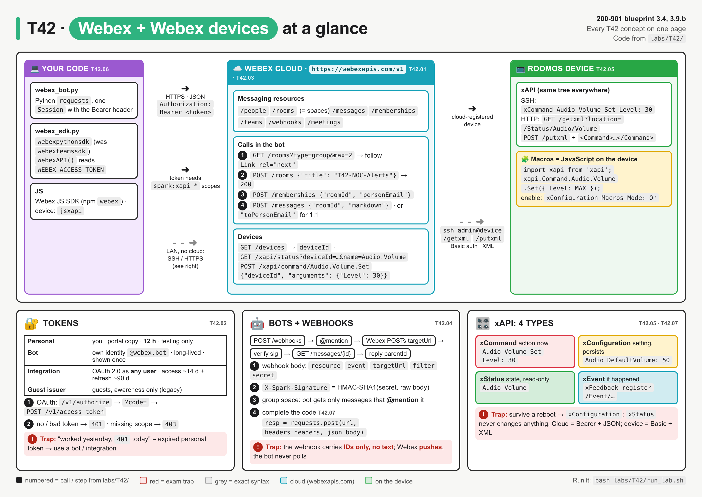
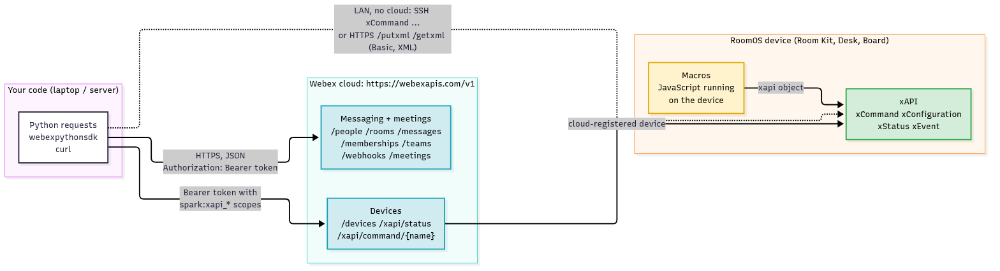
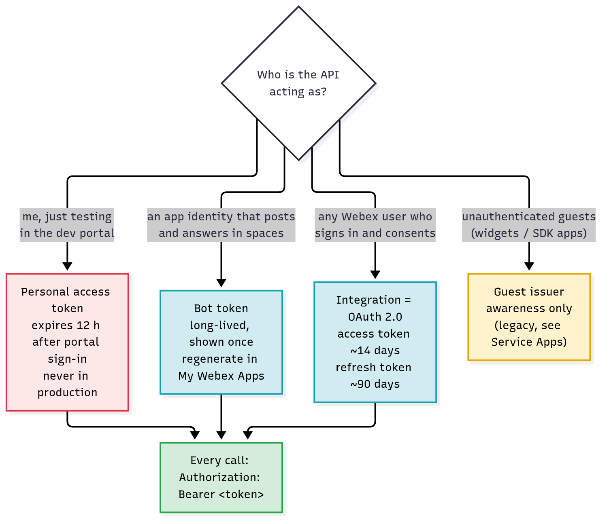
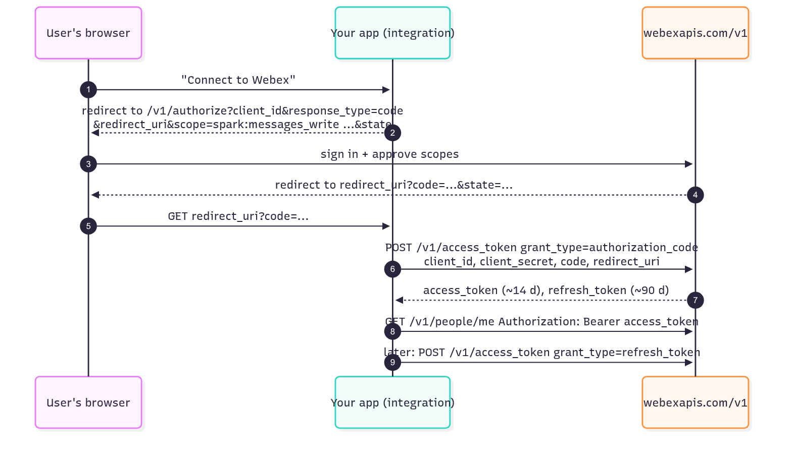
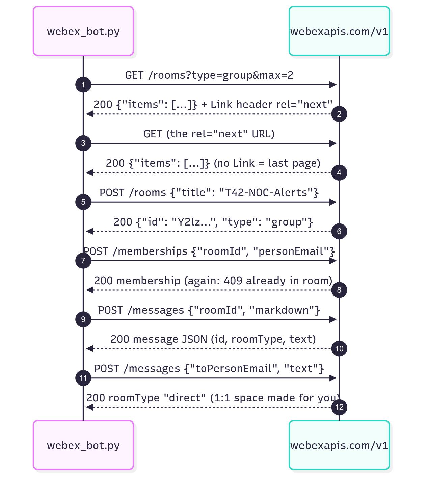
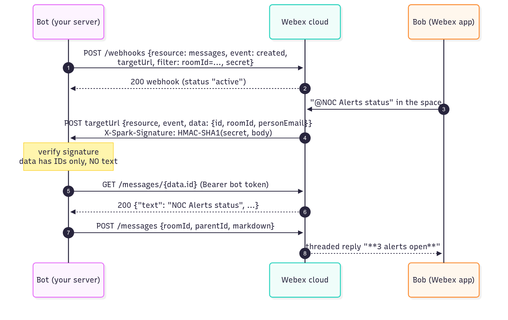
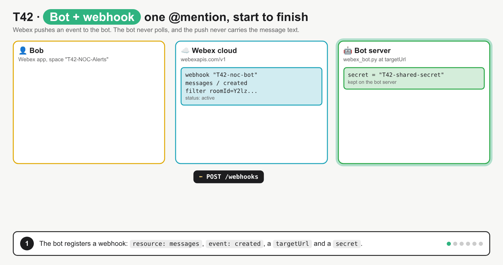
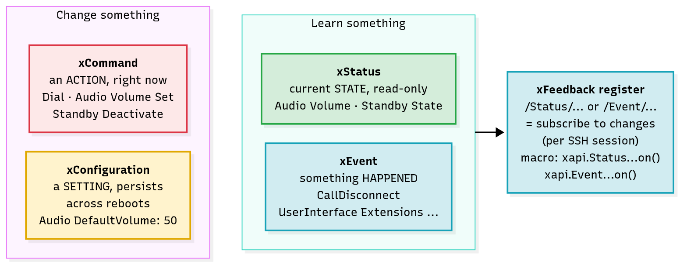
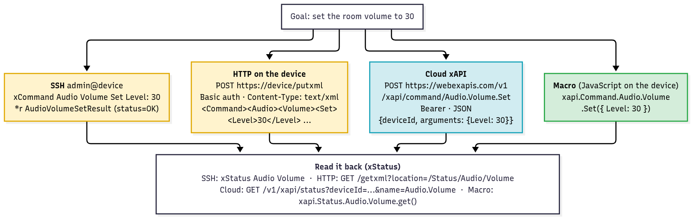

# T42 · Webex + Webex devices

> Owner: **Bob** · Blueprint: **3.4, 3.9.b** · CBT coverage: **Partial** · Learn by 2026-10-18 · Teach-back 2026-10-20



*Every T42 concept on one page. Zones left to right are your code, the Webex cloud and the RoomOS device. Numbers are calls from `labs/T42/`, grey chips are exact syntax, and red boxes are exam traps.*

## TL;DR (teach-back card)

- **One base URL, one header.** Every call goes to `https://webexapis.com/v1/<resource>` with `Authorization: Bearer <token>`. Rooms = spaces. To post: `POST /messages` with `roomId` (a space) **or** `toPersonEmail` (1:1, no room needed), plus `text` / `markdown` / `files`. To add people: `POST /memberships`.
- **Pick the token by who acts.** Personal token = you, testing (expires **12 h**). Bot token = an app identity (`@webex.bot`, long-lived). Integration = OAuth 2.0 on behalf of any user (access ~14 days + refresh ~90 days). A bot learns about messages through a **webhook** (Webex pushes to `targetUrl`), and the push carries **IDs only**, so the bot does `GET /messages/{id}` for the text.
- **xAPI = four types on RoomOS devices.** `xCommand` = do an action now, `xConfiguration` = a setting that persists, `xStatus` = read current state, `xEvent` = something happened (subscribe with `xFeedback`). Reach it by SSH, by HTTP `/putxml` + `/getxml` on the device (Basic auth, XML), by the cloud `webexapis.com/v1/xapi/...` (Bearer, JSON), or from a JavaScript **macro** running on the device.
- **Trap:** a personal access token in a script that "worked yesterday" now gets `401`: it expired after 12 h. Use a bot token or an integration. And `xStatus` reads, it never changes anything; volume changes are `xCommand Audio Volume Set Level: 30`.

## Concepts

Every section below explains one part of the same lab. Read the programs once first.

- `labs/T42/mock_webex.py` is a fake Webex cloud **and** a fake Room Kit, written with the Python standard library only. It listens on `http://127.0.0.1:18042`: the cloud API is under `/v1` and the device xAPI is on `/getxml` and `/putxml`.
  - Response shapes follow the Webex API reference and the RoomOS xAPI docs. Tokens, IDs and people are fake.
  - It enforces the things the exam asks about: `Bearer` or `401`, scopes or `403`, a rate limit with `Retry-After`, `Link` header paging, and webhook bodies without message text.
- `labs/T42/webex_bot.py` (below) is the **reference program**: a NOC alert bot that finds or creates a space, adds the on-call engineer, posts alerts, registers a webhook, answers an @mention and cleans up.
- `labs/T42/xapi_device.py` (in T42.05) drives the room device by the cloud xAPI and by HTTP on the device.
- `labs/T42/webex_sdk.py` (in T42.06) repeats the core of the bot with `webexpythonsdk`.
- To run: `bash labs/T42/run_lab.sh` starts the mock, runs the client, then stops the mock. Port `18042` can be changed with `MOCK_PORT`.

**API doc for the calls used** (as on developer.webex.com; every row was exercised against the mock):

| Method | Path | Body / params | Success | Errors seen in the lab |
|---|---|---|---|---|
| `GET` | `/people/me` | none | `200` person (`type`: `person` or `bot`) | `401` |
| `GET` | `/rooms` | `?type=group&max=2` | `200` `{"items": [...]}` + `Link: <...>; rel="next"` | `401` |
| `POST` | `/rooms` | `{"title": "..."}` (optional `teamId`) | `200` room (`type`: `group`) | `400` |
| `DELETE` | `/rooms/{roomId}` | none | `204` | `404` |
| `POST` | `/memberships` | `{"roomId", "personEmail"}` (or `personId`, optional `isModerator`) | `200` membership | `409` already in, `404` |
| `POST` | `/messages` | `roomId` **or** `toPersonEmail`/`toPersonId`, plus `text` / `markdown` / `files`, optional `parentId` | `200` message | `400`, `404`, `429` + `Retry-After` |
| `GET` | `/messages/{messageId}` | none | `200` message with `text` | `404` |
| `POST` | `/webhooks` | `{"name", "targetUrl", "resource", "event", "filter", "secret"}` | `200` webhook (`status`: `active`) | `400` |
| `DELETE` | `/webhooks/{webhookId}` | none | `204` | `404` |
| `GET` | `/devices` | none | `200` `{"items": [device]}` | `401` |
| `GET` | `/xapi/status` | `?deviceId=...&name=Audio.Volume` | `200` `{"deviceId", "result": {...}}` | `403` (no `spark:xapi_statuses`) |
| `POST` | `/xapi/command/{name}` | `{"deviceId", "arguments": {...}}` | `200` `{"deviceId", "arguments", "result"}` | `403` (no `spark:xapi_commands`) |

**`labs/T42/webex_bot.py`**

```python
"""T42 reference program: a NOC alert bot on the Webex REST API (Python requests).

Start the mock first:   python3 labs/T42/mock_webex.py
Then:                   python3 labs/T42/webex_bot.py
Or both at once:        bash labs/T42/run_lab.sh

Against real Webex: export WEBEX_BASE=https://webexapis.com/v1 and WEBEX_TOKEN=<bot token>.
Step 7 (the simulated @mention) only exists on the mock.
"""
import hashlib
import hmac
import json
import os
import re
import time

import requests

BASE = os.environ.get("WEBEX_BASE", "http://127.0.0.1:18042/v1")       # real: https://webexapis.com/v1
TOKEN = os.environ.get("WEBEX_TOKEN", "T42-mock-bot-token")            # bot token from the developer portal
ROOM_TITLE = "T42-NOC-Alerts"
ONCALL = os.environ.get("ONCALL_EMAIL", "bob@example.com")
HOOK_SECRET = os.environ.get("WEBHOOK_SECRET", "T42-shared-secret")

session = requests.Session()
session.headers.update({"Authorization": f"Bearer {TOKEN}",             # every call, every time
                        "Content-Type": "application/json"})


def short_ids(line):
    """Webex IDs are long base64 strings (ciscospark://us/ROOM/<uuid>); print the first 16 chars."""
    return re.sub(r"Y2lzY29zcGFyazovL[\w-]+", lambda m: m.group()[:16] + "...", line)


def call(method, path, show=("id",), **kwargs):
    """One Webex call. Retries once per 429 using Retry-After. Prints a one-line summary."""
    url = path if path.startswith("http") else BASE + path
    while True:
        resp = session.request(method, url, timeout=10, **kwargs)
        if resp.status_code != 429:
            break
        wait = int(resp.headers.get("Retry-After", "1"))
        print(f"<<< 429 Too Many Requests  Retry-After: {wait}  (sleeping, then retry)")
        time.sleep(wait)
    short = url.replace(BASE, "")
    body = resp.json() if resp.content else {}
    picked = {k: body[k] for k in show if k in body} if resp.ok else body.get("message")
    print(short_ids(f"<<< {resp.status_code} {method} {short}  {picked if picked else ''}".rstrip()))
    return resp


def find_or_create_room(title):
    """GET /rooms is paged: follow the Link rel="next" header until there are no more pages."""
    url, params = "/rooms", {"type": "group", "max": 2}
    while url:
        resp = call("GET", url, show=(), params=params)
        for room in resp.json()["items"]:
            print(f"    room: {room['title']}")
            if room["title"] == title:
                return room
        url = resp.links.get("next", {}).get("url")                    # requests parses Link for you
        params = None                                                  # next URL already has the query
    return call("POST", "/rooms", show=("id", "title", "type"), json={"title": title}).json()


def verify_signature(raw_body, signature):
    """Webex signs each webhook POST: X-Spark-Signature = HMAC-SHA1(secret, raw body) as hex."""
    expected = hmac.new(HOOK_SECRET.encode(), raw_body.encode(), hashlib.sha1).hexdigest()
    return hmac.compare_digest(expected, signature)


def handle_webhook(raw_body, headers):
    """What the bot's web server does when Webex POSTs to targetUrl."""
    if not verify_signature(raw_body, headers["X-Spark-Signature"]):
        print("    signature mismatch -> ignore")
        return
    event = json.loads(raw_body)
    print(f"    webhook: resource={event['resource']} event={event['event']} data keys={sorted(event['data'])}")
    msg = call("GET", f"/messages/{event['data']['id']}", show=("personEmail", "text")).json()  # text is NOT in the webhook
    if msg["text"].lower().endswith("status"):
        call("POST", "/messages", show=("id", "parentId"),
             json={"roomId": msg["roomId"], "parentId": msg["id"],      # reply in a thread
                   "markdown": "**3 alerts open**, 0 critical"})


def main():
    print("== 1. Who am I? (token -> identity) ==")
    call("GET", "/people/me", show=("displayName", "emails", "type"))

    print("\n== 2. Find or create the space (GET /rooms paged, POST /rooms) ==")
    room = find_or_create_room(ROOM_TITLE)
    room_id = room["id"]

    print("\n== 3. Add the on-call engineer (POST /memberships) ==")
    call("POST", "/memberships", show=("personEmail", "isModerator"),
         json={"roomId": room_id, "personEmail": ONCALL})
    call("POST", "/memberships", json={"roomId": room_id, "personEmail": ONCALL})   # 409: already in

    print("\n== 4. Post to the space: text, markdown, a file URL (POST /messages) ==")
    call("POST", "/messages", show=("id", "roomType"),
         json={"roomId": room_id, "text": "TY4S-NSWPGNACC01 Eth1/49 down"})
    call("POST", "/messages", show=("id", "roomType"),
         json={"roomId": room_id, "markdown": "**P2** BGP to 10.15.131.2 *Idle*"})
    call("POST", "/messages", show=("id", "files"),
         json={"roomId": room_id, "text": "Runbook attached",
               "files": ["https://example.com/runbooks/TY4S-uplink.pdf"]})
    call("POST", "/messages", show=("id",), json={"roomId": room_id, "text": "4th post in 1 s"})  # 429 -> retry

    print("\n== 5. 1:1 message by email: no room ID needed ==")
    call("POST", "/messages", show=("roomType", "toPersonEmail"),
         json={"toPersonEmail": ONCALL, "text": "You are on call tonight"})

    print("\n== 6. Register a webhook so Webex pushes events to the bot ==")
    hook = call("POST", "/webhooks", show=("name", "resource", "event", "filter"),
                json={"name": "T42-noc-bot", "targetUrl": "https://bot.example.com/webex",
                      "resource": "messages", "event": "created",
                      "filter": f"roomId={room_id}", "secret": HOOK_SECRET}).json()

    print("\n== 7. Bob @mentions the bot; Webex POSTs to targetUrl (simulated by the mock) ==")
    delivery = call("POST", "/_mock/mention", show=(),
                    json={"roomId": room_id, "text": "NOC Alerts status"}).json()
    handle_webhook(delivery["body"], delivery["headers"])

    print("\n== 8. Errors you must recognise ==")
    session.headers["Authorization"] = "Bearer expired-or-wrong"
    call("GET", "/people/me")                                          # 401
    session.headers["Authorization"] = f"Bearer {TOKEN}"
    call("GET", "/rooms/not-a-real-room-id")                           # 404
    call("POST", "/messages", json={"roomId": room_id})                # 400: no text/markdown/files

    print("\n== 9. Clean up what we created ==")
    call("DELETE", f"/webhooks/{hook['id']}")
    call("DELETE", f"/rooms/{room_id}")


if __name__ == "__main__":
    main()
```

**Output** (`bash labs/T42/run_lab.sh`, IDs shortened by `short_ids()`):

```
== 1. Who am I? (token -> identity) ==
<<< 200 GET /people/me  {'displayName': 'NOC Alerts', 'emails': ['noc-alerts@webex.bot'], 'type': 'bot'}

== 2. Find or create the space (GET /rooms paged, POST /rooms) ==
<<< 200 GET /rooms
    room: SG-NOC Shift
    room: TY4S Cutover
<<< 200 GET /rooms?type=group&max=2&cursor=2
    room: Change Board
<<< 200 POST /rooms  {'id': 'Y2lzY29zcGFyazov...', 'title': 'T42-NOC-Alerts', 'type': 'group'}

== 3. Add the on-call engineer (POST /memberships) ==
<<< 200 POST /memberships  {'personEmail': 'bob@example.com', 'isModerator': False}
<<< 409 POST /memberships  Person is already in the room.

== 4. Post to the space: text, markdown, a file URL (POST /messages) ==
<<< 200 POST /messages  {'id': 'Y2lzY29zcGFyazov...', 'roomType': 'group'}
<<< 200 POST /messages  {'id': 'Y2lzY29zcGFyazov...', 'roomType': 'group'}
<<< 200 POST /messages  {'id': 'Y2lzY29zcGFyazov...', 'files': ['https://example.com/runbooks/TY4S-uplink.pdf']}
<<< 429 Too Many Requests  Retry-After: 1  (sleeping, then retry)
<<< 200 POST /messages  {'id': 'Y2lzY29zcGFyazov...'}

== 5. 1:1 message by email: no room ID needed ==
<<< 200 POST /messages  {'roomType': 'direct', 'toPersonEmail': 'bob@example.com'}

== 6. Register a webhook so Webex pushes events to the bot ==
<<< 200 POST /webhooks  {'name': 'T42-noc-bot', 'resource': 'messages', 'event': 'created', 'filter': 'roomId=Y2lzY29zcGFyazov...'}

== 7. Bob @mentions the bot; Webex POSTs to targetUrl (simulated by the mock) ==
<<< 200 POST /_mock/mention
    webhook: resource=messages event=created data keys=['created', 'id', 'mentionedPeople', 'personEmail', 'personId', 'roomId', 'roomType']
<<< 200 GET /messages/Y2lzY29zcGFyazov...  {'personEmail': 'bob@example.com', 'text': 'NOC Alerts status'}
<<< 200 POST /messages  {'id': 'Y2lzY29zcGFyazov...', 'parentId': 'Y2lzY29zcGFyazov...'}

== 8. Errors you must recognise ==
<<< 401 GET /people/me  The request requires a valid access token set in the Authorization request header.
<<< 404 GET /rooms/not-a-real-room-id  Could not find a room with provided ID.
<<< 400 POST /messages  Message must contain text, markdown or files.

== 9. Clean up what we created ==
<<< 204 DELETE /webhooks/Y2lzY29zcGFyazov...
<<< 204 DELETE /rooms/Y2lzY29zcGFyazov...
```

### T42.01 · Webex REST API

**Must cover:**

- [x] Base https://webexapis.com/v1
- [x] Resources: people, rooms (spaces), messages, memberships, teams, webhooks, meetings

**Notes:**

- **Webex** = Cisco's cloud collaboration suite: messaging (spaces), meetings, calling and video devices. One REST API covers all of it.
- **Base URL:** `https://webexapis.com/v1`. Every resource is a plural noun under it. In the program: `BASE = "https://webexapis.com/v1"` (real) or the mock, plus a path such as `"/rooms"`.
  - The old base `https://api.ciscospark.com/v1` is from the "Cisco Spark" days. You'll still see `ciscospark://` inside every ID: a Webex ID is base64 of `ciscospark://us/ROOM/<uuid>`, which is why they all start `Y2lzY29zcGFyazovL`.



*Your code reaches messaging and devices through one cloud base URL with a Bearer token. The dotted path is local to the device on the LAN, with no cloud involved.*

| Resource | Is | Lab call |
|---|---|---|
| `/people` | users and bots; `/people/me` = the owner of this token | step 1 shows `type: bot`, `noc-alerts@webex.bot` |
| `/rooms` | **spaces** (the API still says "rooms"). `type` is `group` or `direct` (1:1) | step 2: `GET` paged, `POST` create, step 9 `DELETE` |
| `/memberships` | who is in which room (person + room + `isModerator`) | step 3 |
| `/messages` | posts in a room: `text`, `markdown`, `files`, threaded with `parentId` | steps 4, 5, 7 |
| `/teams` | a group of rooms; create a room with `teamId` to put it in a team | not in the lab |
| `/webhooks` | "POST to my URL when X happens" | steps 6, 9 |
| `/meetings` | schedule / list Webex meetings (`title`, `start`, `end`) | not in the lab |
| `/devices`, `/xapi/...` | RoomOS devices and their xAPI (T42.05) | `xapi_device.py` |

- **Paging:** lists return `{"items": [...]}`. Use `max` for the page size, then follow the `Link` header with `rel="next"` until there is none. `find_or_create_room()` does this with `resp.links.get("next")`; the output shows page 1 (2 rooms), then page 2 (1 room).
- **Create returns `200`, not `201`.** Look at step 2: `<<< 200 POST /rooms`. Delete returns `204`. Status codes in general are in [T07](../bee/T07-rest-fundamentals-http-codes.md#t0709--key-codes).

### T42.02 · Authentication

**Must cover:**

- [x] Authorization: Bearer <token>
- [x] Personal access token (developer portal, short-lived ~12 h), bot token (long-lived), integration (OAuth 2.0 grant), guest issuer (awareness)

**Notes:**

- **Every request carries `Authorization: Bearer <access token>`.** The program sets it once on a `requests.Session`, so it goes on every call (REST is stateless).
  - Wrong or missing → `401` (step 8: `<<< 401 GET /people/me`).
  - Forgetting the word `Bearer ` is also a `401` (curl drill step 3).
- The token **is** the identity. `GET /people/me` tells you who it belongs to; the bot token returns `"type": "bot"`.



*Choose by who the API is acting as. All three real token types go in the same `Authorization: Bearer` header.*

| Token | Get it from | Acts as | Lifetime | Use for |
|---|---|---|---|---|
| **Personal access token** | developer.webex.com (copy after sign-in) | **you** | **12 h** after you sign in to the portal | testing, never production |
| **Bot token** | create a bot in My Webex Apps; shown **once** | the bot (`name@webex.bot`) | long-lived (a Cisco Live lab quotes 100 years ⚠ verify); regenerate if lost | notifications, ChatOps alerts |
| **Integration** (OAuth 2.0) | register an integration → client ID + secret → authorization-code grant | **any user** who signs in and approves the scopes | access token ~**14 days**, refresh token ~**90 days** (renewed each time it's used) | apps acting on behalf of users |
| **Guest issuer** | (legacy) issuer ID + secret, makes JWTs for guests | a temporary guest user | short | awareness only; Cisco now points to Service Apps for guests ⚠ verify |

- **Scopes** limit what a token may do, e.g. `spark:messages_write`, `spark:rooms_read`, `spark:xapi_statuses`, `spark:xapi_commands`. Missing scope → `403` (`xapi_device.py` part A: the bot token gets `403 Missing required scope`).
- **Integration flow** (authorization-code grant):



*The user signs in to Webex, not to your app. Your app only ever sees a one-time `code`, and swaps it server-side, with its client secret, at `/v1/access_token`.*

- **Service App** (newer) = a machine account an org admin authorises, with 14-day access + 90-day refresh tokens. It's useful for unattended automation that shouldn't depend on one user. Awareness only.

### T42.03 · Common calls

**Must cover:**

- [x] GET /rooms; POST /rooms {"title": ...}
- [x] POST /messages with roomId or toPersonEmail, plus text/markdown/files
- [x] POST /memberships to add people

**Notes:**



*The order in `webex_bot.py`: list, create, add, post. The 1:1 message needs no room at all.*

- **List rooms:** `GET /rooms` returns only rooms **this token** is a member of. Filters: `type=group|direct`, `teamId`, `max`, `sortBy`.
- **Create a room:** `POST /rooms` with `{"title": "T42-NOC-Alerts"}`. The creator is automatically a member. The reply has the new `id` you need for everything else.
- **Add people:** `POST /memberships` with `{"roomId": ..., "personEmail": "bob@example.com"}`. Use `personId` instead of the email if you have it. `"isModerator": true` makes them a moderator.
  - Adding the same person twice → `409` (step 3: `Person is already in the room.`).
- **Post a message:** `POST /messages`. The body needs:
  1. **Where:** `roomId` (a space), **or** `toPersonEmail` / `toPersonId` (1:1).
     - With `toPersonEmail`, Webex finds or makes the 1:1 space for you (step 5: `roomType: direct`). You never `POST /rooms` for a direct space.
  2. **What:** at least one of `text` (plain), `markdown` (`**bold**`, `*italic*`, lists, links), `files` (a list holding **one** public URL; local files are a multipart upload).
     - None of them → `400` (step 8).
  3. Optional `parentId` to reply in a thread (step 7).
- **Rate limits:** too many calls → `429 Too Many Requests` + `Retry-After: <seconds>`. `call()` sleeps for `Retry-After` and retries (step 4, 4th post). The mock limit (3 posts per second per room) is invented; Webex doesn't publish one fixed number.

### T42.04 · Bots

**Must cover:**

- [x] Separate identity that is added to spaces; reacts to events via webhooks (see Beedy T43)

**Notes:**

- **A bot is its own Webex identity**, not a user's: email `something@webex.bot`, its own token, shown in spaces like a person.
  - It joins a space when someone **adds** it (or the bot creates the space itself, as in step 2).
  - It keeps working if the person who created it leaves the company.
- **In group spaces a bot only sees messages that @mention it.** To list them, a bot must use `GET /messages?roomId=...&mentionedPeople=me`. In 1:1 spaces it sees everything.
- **A bot reacts through webhooks, not polling.** It registers a webhook once, and Webex POSTs to the bot's `targetUrl` whenever the event happens. How webhooks work in general is Beedy's [T43](../bee/T43-webhooks.md).



*Step 4 is the key: the webhook body carries only IDs. The bot must call `GET /messages/{id}` with its own token to read the text.*



*Register webhook → Bob @mentions the bot → Webex POSTs to `targetUrl` (IDs only) → bot checks `X-Spark-Signature` → bot GETs the message text → bot replies in a thread. It fixes two misconceptions: the bot doesn't poll, and the push doesn't contain the message text.*

- **Webhook fields** (step 6): `name`, `targetUrl` (must be reachable from the internet), `resource` (`messages`, `memberships`, `rooms`, `meetings`, `attachmentActions`, ...), `event` (`created`, `updated`, `deleted`, ...), `filter` (e.g. `roomId=...`) and `secret`.
- **`secret` → `X-Spark-Signature`:** Webex signs each POST with HMAC-SHA1 of the raw body using your secret. `verify_signature()` recomputes it and drops anything that doesn't match. (Break-it 2 shows `signature mismatch -> ignore`.)
- **`handle_webhook()`** is the whole bot pattern: verify → read `data.id` → `GET /messages/{id}` → decide → `POST /messages` with `parentId`.
- Interactive buttons and forms are **Adaptive Cards** (`attachments` on a message; clicks arrive as `attachmentActions`). Awareness only.

### T42.05 · Webex devices xAPI

**Must cover:**

- [x] API on RoomOS devices: xCommand (actions), xConfiguration (settings), xStatus (state), xEvent (events)
- [x] Access: SSH, HTTP(S) /putxml and /getxml, cloud xAPI via webexapis.com/v1/xapi/...
- [x] Macros: JavaScript running on the device

**Notes:**

- **RoomOS** is the OS on Cisco collaboration devices (Room Kit, Room Bar, Desk Pro, Board). The **xAPI** is its API. The same command tree is reachable over every access method below.
- **Four xAPI types.** The exam shows a line and asks which type it is.



*Left: things that change the device. Right: things you read or get told about, both of which you can subscribe to.*

| Type | Is | Example | SSH reply prefix |
|---|---|---|---|
| `xCommand` | an **action**, now (dial, set volume, wake up) | `xCommand Audio Volume Set Level: 30` | `*r` (result) |
| `xConfiguration` | a **setting**, persistent across reboots | `xConfiguration Audio DefaultVolume: 50` | `*c` |
| `xStatus` | current **state**, read-only | `xStatus Audio Volume` | `*s` |
| `xEvent` | something **happened** (call ended, button pressed) | `xFeedback register /Event/CallDisconnect` | `*e` ⚠ verify |

- `xFeedback register <path>` subscribes **this SSH session** to changes under `/Status/...`, `/Configuration/...` or `/Event/...`. Cisco's docs say never register for all of `/Status`.
- **Access methods.** The same "set volume to 30" four ways:



*SSH and HTTP talk to the device directly on the LAN. The cloud xAPI goes through webexapis.com and needs the device to be cloud-registered. A macro runs on the device itself.*

| Method | Address | Auth | Format | Read | Change |
|---|---|---|---|---|---|
| **SSH** (also serial/Telnet) | `ssh admin@<device>` | local device user | text | `xStatus ...` | `xCommand ...`, `xConfiguration ...` |
| **HTTP(S) on the device** | `https://<device>/getxml`, `/putxml` | **Basic** (local user) | **XML**, `Content-Type: text/xml` | `GET /getxml?location=/Status/Audio/Volume` | `POST /putxml` with `<Command>...` or `<Configuration>...` |
| **Cloud xAPI** | `https://webexapis.com/v1/xapi/...` | **Bearer** token with `spark:xapi_statuses` / `spark:xapi_commands` | **JSON** | `GET /xapi/status?deviceId=...&name=Audio.Volume` | `POST /xapi/command/Audio.Volume.Set` `{"deviceId", "arguments": {"Level": 30}}` |
| **Macro** | runs on the device | none (local `xapi` object) | JavaScript | `xapi.Status.Audio.Volume.get()` | `xapi.Command.Audio.Volume.Set({ Level: 30 })` |

- Cloud path naming: the SSH words joined with dots. `xCommand Audio Volume Set` → `/xapi/command/Audio.Volume.Set`; `xStatus Audio Volume` → `name=Audio.Volume`. Cloud configurations go through a separate Device Configurations API, not `/xapi` ⚠ verify.
- `deviceId` comes from `GET /devices`. A bot token without the xAPI scopes → `403` (part A).

**`labs/T42/xapi_device.py`**

```python
"""T42 xAPI program: control a RoomOS device two ways (cloud xAPI and on-device HTTP xAPI).

Start the mock first:   python3 labs/T42/mock_webex.py
Then:                   python3 labs/T42/xapi_device.py
Or:                     bash labs/T42/run_lab.sh labs/T42/xapi_device.py

Real targets: WEBEX_BASE=https://webexapis.com/v1 with a token that has the
spark:xapi_statuses + spark:xapi_commands scopes, and DEVICE_URL=https://<device-ip>
with a local device user (Basic auth, self-signed cert -> verify=False).
"""
import os
import re
from urllib.parse import unquote

import requests

BASE = os.environ.get("WEBEX_BASE", "http://127.0.0.1:18042/v1")
BOT_TOKEN = os.environ.get("WEBEX_TOKEN", "T42-mock-bot-token")
XAPI_TOKEN = os.environ.get("WEBEX_XAPI_TOKEN", "T42-mock-integration-token")   # integration / admin token
DEVICE_URL = os.environ.get("DEVICE_URL", "http://127.0.0.1:18042")              # real: https://<device-ip>
DEVICE_AUTH = (os.environ.get("DEVICE_USER", "integrator"), os.environ.get("DEVICE_PASS", "integrator"))


def short_ids(text):
    """Shorten long Webex IDs (base64 of ciscospark://us/DEVICE/<uuid>) for printing."""
    return re.sub(r"Y2lzY29zcGFyazovL[\w-]+", lambda m: m.group()[:16] + "...", text)


def show(resp):
    path = unquote(resp.url.replace(BASE, "").replace(DEVICE_URL, ""))
    print(short_ids(f"<<< {resp.status_code} {resp.request.method} {path}"))
    if resp.content:
        print("    " + short_ids(resp.text.strip()).replace("\n", "\n    "))
    return resp


def cloud():
    print("== A. Cloud xAPI: webexapis.com/v1/xapi/... (JSON, Bearer token) ==")
    bearer = {"Authorization": f"Bearer {XAPI_TOKEN}"}
    device = requests.get(f"{BASE}/devices", headers=bearer, timeout=10).json()["items"][0]
    print(f"    device: {device['displayName']} ({device['product']}, {device['software']})")
    dev_id = device["id"]

    # xStatus Audio Volume  ->  GET /xapi/status?deviceId=...&name=Audio.Volume
    show(requests.get(f"{BASE}/xapi/status", params={"deviceId": dev_id, "name": "Audio.Volume"},
                      headers={"Authorization": f"Bearer {BOT_TOKEN}"}, timeout=10))    # 403: no xapi scope
    show(requests.get(f"{BASE}/xapi/status", params={"deviceId": dev_id, "name": "Audio.Volume"},
                      headers=bearer, timeout=10))

    # xCommand Audio Volume Set Level: 30  ->  POST /xapi/command/Audio.Volume.Set
    show(requests.post(f"{BASE}/xapi/command/Audio.Volume.Set",
                       json={"deviceId": dev_id, "arguments": {"Level": 30}}, headers=bearer, timeout=10))
    show(requests.get(f"{BASE}/xapi/status", params={"deviceId": dev_id, "name": "Audio.Volume"},
                      headers=bearer, timeout=10))


def on_device():
    print("\n== B. On-device xAPI over HTTP: /getxml and /putxml (XML, Basic auth) ==")
    # xStatus Audio Volume  ->  GET /getxml?location=/Status/Audio/Volume
    show(requests.get(f"{DEVICE_URL}/getxml", params={"location": "/Status/Audio/Volume"}, timeout=10))  # 401
    show(requests.get(f"{DEVICE_URL}/getxml", params={"location": "/Status/Audio/Volume"},
                      auth=DEVICE_AUTH, timeout=10))

    xml = {"Content-Type": "text/xml"}
    # xCommand Audio Volume Set Level: 70  ->  POST /putxml <Command>...</Command>
    show(requests.post(f"{DEVICE_URL}/putxml", auth=DEVICE_AUTH, headers=xml, timeout=10,
                       data="<Command><Audio><Volume><Set><Level>70</Level></Set></Volume></Audio></Command>"))
    # xConfiguration Audio DefaultVolume: 40  ->  POST /putxml <Configuration>...</Configuration>
    show(requests.post(f"{DEVICE_URL}/putxml", auth=DEVICE_AUTH, headers=xml, timeout=10,
                       data="<Configuration><Audio><DefaultVolume>40</DefaultVolume></Audio></Configuration>"))
    show(requests.get(f"{DEVICE_URL}/getxml", params={"location": "/Configuration/Audio/DefaultVolume"},
                      auth=DEVICE_AUTH, timeout=10))


if __name__ == "__main__":
    cloud()
    on_device()
```

**Output** (`bash labs/T42/run_lab.sh labs/T42/xapi_device.py`):

```
== A. Cloud xAPI: webexapis.com/v1/xapi/... (JSON, Bearer token) ==
    device: SG-HQ Board Room (Cisco Room Kit Pro, RoomOS 11.20.1.5)
<<< 403 GET /xapi/status?deviceId=Y2lzY29zcGFyazov...&name=Audio.Volume
    {"message": "Missing required scope: spark:xapi_statuses", "errors": [{"description": "Missing required scope: spark:xapi_statuses"}], "trackingId": "ROUTER_7EC24D35"}
<<< 200 GET /xapi/status?deviceId=Y2lzY29zcGFyazov...&name=Audio.Volume
    {"deviceId": "Y2lzY29zcGFyazov...", "result": {"Audio": {"Volume": 50}}}
<<< 200 POST /xapi/command/Audio.Volume.Set
    {"deviceId": "Y2lzY29zcGFyazov...", "arguments": {"Level": 30}, "result": {}}
<<< 200 GET /xapi/status?deviceId=Y2lzY29zcGFyazov...&name=Audio.Volume
    {"deviceId": "Y2lzY29zcGFyazov...", "result": {"Audio": {"Volume": 30}}}

== B. On-device xAPI over HTTP: /getxml and /putxml (XML, Basic auth) ==
<<< 401 GET /getxml?location=/Status/Audio/Volume
    <html><body>401 Unauthorized</body></html>
<<< 200 GET /getxml?location=/Status/Audio/Volume
    <?xml version="1.0"?>
    <Status product="Cisco Codec" version="ce11.20.1.5" apiVersion="4">
      <Audio>
        <Volume>30</Volume>
      </Audio>
    </Status>
<<< 200 POST /putxml
    <?xml version="1.0"?>
    <Command><AudioVolumeSetResult status="OK"/></Command>
<<< 200 POST /putxml
    <?xml version="1.0"?>
    <Configuration/>
<<< 200 GET /getxml?location=/Configuration/Audio/DefaultVolume
    <?xml version="1.0"?>
    <Configuration product="Cisco Codec" version="ce11.20.1.5" apiVersion="4">
      <Audio>
        <DefaultVolume>40</DefaultVolume>
      </Audio>
    </Configuration>
```

- Part B shows the XML mapping: the xAPI path becomes nested tags. `xCommand Audio Volume Set Level: 70` = `<Command><Audio><Volume><Set><Level>70</Level></Set></Volume></Audio></Command>`.
- The same over SSH (format from the Cisco DevNet xAPI lab and RoomOS docs; **not run**, no device here):

```
ssh integrator@10.10.20.70
xStatus Audio Volume
*s Audio Volume: 50
** end
xCommand Audio Volume Set Level: 30
*r AudioVolumeSetResult (status=OK):
** end
xConfiguration Audio DefaultVolume: 40
** end
xFeedback register /Event/CallDisconnect
** end
```

- **Macros** = JavaScript (ES6) that runs **on the device** in a sandbox. You write them in the device web UI's Macro Editor (or push them with `xCommand Macros Macro Save`). Enable with `xConfiguration Macros Mode: On`. They automate the room: react to buttons, cap volume, post to a webhook with `xCommand HttpClient Post`.
  - `labs/T42/volume_guard.js` uses all four types (not run, needs a device):

```javascript
// T42 macro: runs ON the RoomOS device (Macro Editor), not on your laptop.
// Uses all four xAPI types. Not runnable here: needs a real device with macros enabled
// (xConfiguration Macros Mode: On).
import xapi from 'xapi';

const MAX = 70;

async function start() {
  await xapi.Config.Audio.DefaultVolume.set(50);                   // xConfiguration: a setting

  const level = await xapi.Status.Audio.Volume.get();               // xStatus: current state
  console.log(`Volume at boot: ${level}`);

  xapi.Status.Audio.Volume.on((value) => {                          // xStatus change feedback
    if (Number(value) > MAX) {
      xapi.Command.Audio.Volume.Set({ Level: MAX });                // xCommand: an action
    }
  });

  xapi.Event.CallDisconnect.on((event) => {                         // xEvent: something happened
    console.log(`Call ended: ${event.CauseType}`);
    xapi.Command.UserInterface.Message.Alert.Display({ Title: 'NOC', Text: 'Call ended', Duration: 5 });
  });
}

start();
```

- Older macros use the string style, `const xapi = require('xapi')` with `xapi.command('Dial', {...})`, `xapi.config.set('...')`, `xapi.status.get('...')` and `xapi.event.on('...')`. It's the same API.
- From a laptop, Node's **jsxapi** library gives the same `xapi` object over SSH or WebSocket.

### T42.06 · SDKs (awareness)

**Must cover:**

- [x] Webex JS SDK; Python webexpythonsdk (formerly webexteamssdk)

**Notes:**

- **Python: `webexpythonsdk`** (pip). It was called `webexteamssdk` before Webex Teams became Webex. Same author, same object model.
  - `WebexAPI(access_token=...)`, or no argument: it reads the `WEBEX_ACCESS_TOKEN` env var.
  - Resources become attributes: `api.rooms.create(...)`, `api.messages.create(...)`, `api.memberships.create(...)`, `api.people.me()`.
  - `.list()` is a **generator that follows `Link` paging for you**. It waits on `429` by default (`wait_on_rate_limit=True`). Errors raise `ApiError` with `.status_code`.

**`labs/T42/webex_sdk.py`**

```python
"""T42 SDK version: the core of webex_bot.py with webexpythonsdk (formerly webexteamssdk).

pip install webexpythonsdk      (already in the lab image: labs/requirements.txt)
Run against the mock:   bash labs/T42/run_lab.sh labs/T42/webex_sdk.py
Against real Webex: unset WEBEX_BASE; the SDK defaults to https://webexapis.com/v1/
and reads the token from the WEBEX_ACCESS_TOKEN env var if access_token is not passed.
"""
import os

from webexpythonsdk import WebexAPI
from webexpythonsdk.exceptions import ApiError

api = WebexAPI(access_token=os.environ.get("WEBEX_TOKEN", "T42-mock-bot-token"),
               base_url=os.environ.get("WEBEX_BASE", "http://127.0.0.1:18042/v1") + "/")

me = api.people.me()
print(f"me: {me.displayName} {me.emails} type={me.type}")

for room in api.rooms.list(type="group", max=2):        # generator: follows Link rel="next" for you
    print(f"room: {room.title}")

room = api.rooms.create(title="T42-SDK-Test")
print(f"created: {room.title} type={room.type}")
api.memberships.create(roomId=room.id, personEmail="bob@example.com")
msg = api.messages.create(roomId=room.id, markdown="**SDK** says hi")
print(f"posted: {msg.text!r} to {msg.roomType} room")

try:
    api.memberships.create(roomId=room.id, personEmail="bob@example.com")
except ApiError as err:
    print(f"ApiError: {err.status_code} {err.message}")

api.rooms.delete(room.id)
print("deleted room")
```

**Output** (`PYTHON=<venv>/bin/python bash labs/T42/run_lab.sh labs/T42/webex_sdk.py`, webexpythonsdk 2.0.6):

```
me: NOC Alerts ['noc-alerts@webex.bot'] type=bot
room: SG-NOC Shift
room: TY4S Cutover
room: Change Board
created: T42-SDK-Test type=group
posted: 'SDK says hi' to group room
ApiError: 409 Person is already in the room.
deleted room
```

- Compare with `webex_bot.py`: no `Link` loop (`rooms.list()` returned all 3 rooms across 2 pages), no header building, and the `409` comes back as an exception, not a status code.
- **JavaScript: the Webex JS SDK** (npm package `webex`) for browser and Node apps: messaging, meetings and calling in a web page. Awareness only. Device control from JavaScript is `jsxapi` or macros, not this SDK.
- Other Webex SDKs exist (mobile, Widgets). Not on the blueprint.

### T42.07 · Exam angle

**Must cover:**

- [x] Complete code that posts a message; pick token type; recognise xAPI command types

**Notes:**

- **Complete the code** (blueprint 3.9.b). Know these blanks cold:

```python
import requests

url = "https://webexapis.com/v1/messages"                 # blank 1: base + /messages
headers = {"Authorization": "Bearer " + token,             # blank 2: "Bearer " + token
           "Content-Type": "application/json"}
body = {"roomId": room_id, "markdown": "**Link down**"}    # blank 3: roomId or toPersonEmail
resp = requests.post(url, headers=headers, json=body)      # blank 4: POST
print(resp.status_code, resp.json()["id"])                 # 200 + the new message id
```

- **Pick the token:** a scheduled script posting alerts as "NOC Bot" → **bot**. An app where each engineer logs in and it posts as them → **integration** (OAuth). Trying calls in the browser docs → **personal**.
- **Recognise xAPI types:** action → `xCommand`, persistent setting → `xConfiguration`, read the current value → `xStatus`, notification that something happened → `xEvent`/`xFeedback`.
- **Recognise the access method from the URL:** `webexapis.com/v1/xapi/...` = cloud (Bearer, JSON). `https://<ip>/putxml` = local (Basic, XML).

## Exam traps

- **Base URL:** `https://webexapis.com/v1`. Not `api.webex.com`, not `/api/v1`. `api.ciscospark.com` is the legacy name.
- **Header:** `Authorization: Bearer <token>`. Not `X-Auth-Token` (Catalyst Center), not `X-Cisco-Meraki-API-Key`, not Basic.
- **"Rooms" = spaces.** The API resource is `/rooms` even though the app says "spaces".
- **1:1 message:** `POST /messages` with `toPersonEmail`. You never create a direct room with `POST /rooms` (that always makes a `group` room).
- **Message body needs a target + content:** `roomId` **or** `toPersonEmail`/`toPersonId`, **and** `text` / `markdown` / `files`. `files` takes **one** URL.
- **Add a person** = `POST /memberships` (`roomId` + `personEmail`). Not `PUT /rooms`, not a field on the room.
- **Create returns `200`** on Webex, not `201`.
- **Personal access token = 12 h.** "Script worked yesterday, today `401`" → expired personal token. Production → bot or integration.
- **Bot vs integration:** bot acts **as itself** (`@webex.bot`); integration acts **as the user** who authorised it (OAuth). Bot = long-lived token; integration = ~14-day access + ~90-day refresh token.
- **Bots in group spaces** only receive messages that **@mention** them.
- **Webhook body has no message text.** Get it with `GET /messages/{data.id}`. Webex **pushes** to your `targetUrl`; nothing polls. `secret` → verify `X-Spark-Signature` (HMAC-SHA1).
- **xAPI four types:** `xCommand` = action, `xConfiguration` = persistent setting, `xStatus` = read-only state, `xEvent` = event. "Make the setting survive a reboot" → `xConfiguration`.
- **Device HTTP xAPI:** `/getxml?location=/Status/...` to read, `POST /putxml` with an XML body to change. **Basic auth, XML.** Cloud xAPI: **Bearer, JSON**, `/v1/xapi/status` and `/v1/xapi/command/<Dotted.Name>`.
- **Macros run on the device** (JavaScript). They're not a cloud service and not Python.
- **`webexpythonsdk`** is the current name of `webexteamssdk`. Its env var is `WEBEX_ACCESS_TOKEN`.

## Examples

### 1. Run the labs

Needs Python 3 + `requests` (and `webexpythonsdk` for `webex_sdk.py`), plus curl. No Webex account or token needed.

```bash
bash labs/T42/run_lab.sh                                # mock + webex_bot.py
bash labs/T42/run_lab.sh labs/T42/xapi_device.py        # mock + xAPI (cloud + device)
bash labs/T42/run_lab.sh labs/T42/webex_sdk.py          # mock + webexpythonsdk
bash labs/T42/run_lab.sh labs/T42/curl_drill.sh         # mock + curl only
```

Without `requests` installed locally, use a throwaway venv:

```bash
python3 -m venv /tmp/venv-t42
/tmp/venv-t42/bin/pip install requests webexpythonsdk
PYTHON=/tmp/venv-t42/bin/python bash labs/T42/run_lab.sh labs/T42/webex_sdk.py
```

In the lab container (the mock and the client share the container's localhost):

```bash
docker build --tag ccna-auto-lab:latest --file labs/Dockerfile labs/
docker run --rm --volume "$(pwd)":/work --workdir /work ccna-auto-lab:latest bash labs/T42/run_lab.sh
```

Against real Webex (a bot token in an env var; creates and then deletes a `T42-NOC-Alerts` space). Step 7 needs the mock, so stop after step 6 or expect an error there:

```bash
export WEBEX_BASE=https://webexapis.com/v1
export WEBEX_TOKEN='<your bot token>'
export ONCALL_EMAIL='<your own Webex email>'
python3 labs/T42/webex_bot.py
```

### 2. curl drill (`labs/T42/curl_drill.sh`)

```bash
#!/usr/bin/env bash
# T42 curl drill: post a Webex message and query a device, with curl only.
# Run:  bash labs/T42/run_lab.sh labs/T42/curl_drill.sh
# Real Webex: export WEBEX_BASE=https://webexapis.com/v1 WEBEX_TOKEN=<token>
set -u
BASE="${WEBEX_BASE:-http://127.0.0.1:18042/v1}"
TOKEN="${WEBEX_TOKEN:-T42-mock-bot-token}"
DEVICE="${DEVICE_URL:-http://127.0.0.1:18042}"

echo "== 1. Create a space"
ROOM_ID=$(curl --silent --request POST "$BASE/rooms" \
  --header "Authorization: Bearer $TOKEN" \
  --header "Content-Type: application/json" \
  --data '{"title": "T42-curl-drill"}' \
  | python3 -c "import json, sys; print(json.load(sys.stdin)['id'])")
echo "ROOM_ID=${ROOM_ID:0:24}..."

echo; echo "== 2. Post a markdown message"
curl --silent --request POST "$BASE/messages" \
  --header "Authorization: Bearer $TOKEN" \
  --header "Content-Type: application/json" \
  --data "{\"roomId\": \"$ROOM_ID\", \"markdown\": \"**curl** works\"}" \
  | python3 -c "import json, sys; m = json.load(sys.stdin); print(m['roomType'], repr(m['text']), m['markdown'])"

echo; echo "== 3. Forget 'Bearer ' -> 401"
curl --silent --include "$BASE/people/me" --header "Authorization: $TOKEN" | head -n 1

echo; echo "== 4. Device xAPI over HTTP (Basic auth, XML)"
curl --silent --user integrator:integrator "$DEVICE/getxml?location=/Status/Audio/Volume"
echo
curl --silent --user integrator:integrator --request POST "$DEVICE/putxml" \
  --header "Content-Type: text/xml" \
  --data '<Command><Audio><Volume><Set><Level>20</Level></Set></Volume></Audio></Command>'
echo

echo; echo "== 5. Clean up"
curl --silent --output /dev/null --write-out "DELETE room -> %{http_code}\n" --request DELETE \
  --header "Authorization: Bearer $TOKEN" "$BASE/rooms/$ROOM_ID"
```

Output (`bash labs/T42/run_lab.sh labs/T42/curl_drill.sh`):

```
== 1. Create a space
ROOM_ID=Y2lzY29zcGFyazovL3VzL1JP...

== 2. Post a markdown message
group 'curl works' **curl** works

== 3. Forget 'Bearer ' -> 401
HTTP/1.1 401 Unauthorized

== 4. Device xAPI over HTTP (Basic auth, XML)
<?xml version="1.0"?>
<Status product="Cisco Codec" version="ce11.20.1.5" apiVersion="4">
  <Audio>
    <Volume>50</Volume>
  </Audio>
</Status>
<?xml version="1.0"?>
<Command><AudioVolumeSetResult status="OK"/></Command>

== 5. Clean up
DELETE room -> 204
```

- Step 2 shows `markdown` is kept as sent and `text` is the plain version Webex derives from it.
- Step 3: `Authorization: <token>` without `Bearer ` is a `401`, same as no header.

### 3. Break it on purpose

Each edit was made in a throwaway copy and run with `run_lab.sh`. The result column is the real output.

| Edit | Result | Lesson |
|---|---|---|
| `webex_bot.py`: change `f"Bearer {TOKEN}"` to `TOKEN` in `session.headers.update` | `<<< 401 GET /people/me ...`, `<<< 401 GET /rooms ...`, then `KeyError: 'items'` | the scheme word `Bearer` is required; also check the status before reading the body |
| `webex_bot.py`: in `verify_signature()`, replace `HOOK_SECRET.encode()` with `b"wrong-secret"` | step 7 prints `signature mismatch -> ignore` and never fetches the message | the secret on both sides must match; unsigned or forged POSTs are dropped |
| `webex_bot.py`: rename `"text"` to `"txt"` in the first step-4 message | `<<< 400 POST /messages  Message must contain text, markdown or files.` | a message needs `text`, `markdown` or `files` |
| `xapi_device.py`: send the `Audio.Volume.Set` command with `BOT_TOKEN` | `<<< 403 POST /xapi/command/Audio.Volume.Set` + `Missing required scope: spark:xapi_commands` | xAPI needs a token with the xAPI scopes: `403`, not `401` |

### 4. Drill: map the line to the xAPI type

Cover the right column.

| Line | Type |
|---|---|
| `xCommand Dial Number: "bob@example.com"` | command (action) |
| `xConfiguration SystemUnit Name: "SG-HQ Board Room"` | configuration (persistent setting) |
| `xStatus Call` | status (read) |
| `xFeedback register /Event/UserInterface/Extensions/Widget/Action` | subscribe to an event |
| `GET /getxml?location=/Status/Standby` | status, over HTTP |
| `POST /v1/xapi/command/Standby.Deactivate` | command, over the cloud |
| `xapi.Config.Audio.DefaultVolume.set(50)` | configuration, from a macro |

## Practice questions

**Q1.** Complete the script so that it posts a markdown message to an existing space:

```python
import requests
url = "https://webexapis.com/v1/________"
headers = {"Authorization": "________ " + token, "Content-Type": "application/json"}
resp = requests.post(url, headers=headers, json={"________": room_id, "markdown": "**BGP down**"})
```

<details><summary>Answer</summary>

`messages`, `Bearer`, `roomId`. Messages are created with `POST /v1/messages`; the token goes after `Bearer `; a space is addressed by `roomId` (a 1:1 would use `toPersonEmail`). (T42.03, T42.07)
</details>

**Q2.** A nightly job must post interface-error summaries into a NOC space under the name "NOC Bot" for years without anyone renewing a token. Which credential fits?
A. Personal access token  B. Bot access token  C. Integration access token  D. Guest issuer token

<details><summary>Answer</summary>

**B.** A bot is its own identity with a long-lived token. A personal token expires after 12 h; an integration acts as a user and needs refreshing; guest tokens are for temporary guest users. (T42.02)
</details>

**Q3.** An engineer wants a Room Kit to start every boot at volume 40. Which xAPI line does it?
A. `xCommand Audio Volume Set Level: 40`  B. `xStatus Audio Volume`  C. `xConfiguration Audio DefaultVolume: 40`  D. `xFeedback register /Status/Audio/Volume`

<details><summary>Answer</summary>

**C.** Configurations persist across reboots. A is a one-off action that's lost on restart; B only reads; D only subscribes to changes. (T42.05)
</details>

**Q4.** A bot's webhook receives this POST. What must the bot do next to read what the user typed?

```json
{"resource": "messages", "event": "created",
 "data": {"id": "Y2lzY29zcGFyazovL3VzL01FU1NBR0UvOTk...", "roomId": "Y2lz...", "personEmail": "bob@example.com"}}
```

A. Read `data.text`  B. `GET /v1/messages/{data.id}` with the bot token  C. `GET /v1/webhooks/{id}`  D. Poll `GET /v1/rooms` every second

<details><summary>Answer</summary>

**B.** The webhook carries IDs only, never the message text. The bot fetches the message by ID with its own token. (T42.04)
</details>

**Q5.** A script using a token copied from developer.webex.com worked at 09:00. At 22:00 the same call returns `401 Unauthorized`. What's the most likely cause?
A. The bot was removed from the space  B. The personal access token expired  C. The `Content-Type` header is missing  D. The rate limit was hit

<details><summary>Answer</summary>

**B.** Personal access tokens expire 12 h after sign-in. Removal from a space gives `404`/`403`, a missing scope gives `403`, and a rate limit gives `429`. (T42.02)
</details>

**Q6.** Put the integration (OAuth 2.0 authorization-code) steps in order: (a) app POSTs the code to `/v1/access_token` (b) user signs in and approves scopes (c) app calls the API with `Bearer <access_token>` (d) Webex redirects to `redirect_uri?code=...` (e) app redirects the user to `/v1/authorize`

<details><summary>Answer</summary>

**e → b → d → a → c.** The code only reaches the app through the redirect, and it's exchanged server-side with the client secret before any API call. (T42.02)
</details>

**Q7.** Which request reads a device's current volume **directly from the device**, without the Webex cloud?
A. `GET https://webexapis.com/v1/xapi/status?deviceId=...&name=Audio.Volume`  B. `GET https://10.10.20.70/getxml?location=/Status/Audio/Volume` with Basic auth  C. `POST https://10.10.20.70/putxml` with `<Status>`  D. `GET https://webexapis.com/v1/devices/10.10.20.70`

<details><summary>Answer</summary>

**B.** On-device HTTP xAPI reads with `/getxml?location=...` (Basic auth, XML). A goes through the cloud; `/putxml` is for commands and configurations. (T42.05)
</details>

**Q8.** Which two statements about Webex bots are true? (Choose two.)
A. A bot sees every message in every group space it belongs to  B. A bot has its own identity ending in `@webex.bot`  C. A bot is notified of new messages by a webhook POST to its `targetUrl`  D. A bot must log in through OAuth each day  E. A bot can only post with `toPersonEmail`

<details><summary>Answer</summary>

**B, C.** In group spaces a bot only receives messages that mention it (A false). Bots use a long-lived token, not daily OAuth (D false). They post to rooms with `roomId` too (E false). (T42.04)
</details>

## Study aids

| Aid | Type | Title | Est. min | Resource |
|---|---|---|---|---|
| T42.1 | Video | Automate Cisco Webex (skip older 'Webex Teams' module) | 58 | CBT module |
| T42.2 | Top-up | Webex devices xAPI overview | 20 | Webex developer docs |

- Skip / low priority: Webex Teams (older module)
- Top-up T42.2 (blueprint 3.4, devices/xAPI not in the CBT title list): T42.05 in this note plus the RoomOS xAPI guide (roomos.cisco.com/doc/TechDocs/xAPI) and the DevNet `labs-xapi` intro lab, steps 5–6.

## Sources

- Overview image: HTML source `assets/T42/00-overview.html`, rendered to PNG (see `assets/README.md`). Diagrams: Mermaid sources in `assets/T42/*.mmd`. Animation: `assets/T42/08-bot-webhook-anim.html` → `08-bot-webhook.gif`.
- Webex, Getting started / access the API (Bearer header; personal token expires 12 h after portal sign-in; token types): https://developer.webex.com/docs/getting-started
- Webex, Bots (group spaces: only mentioned messages, `mentionedPeople=me`, token shown once, regenerate, webhooks): https://developer.webex.com/docs/bots
- Webex, Integrations (OAuth 2.0 client, Service Apps for unattended automation): https://developer.webex.com/docs/integrations
- Webex, Authentication / Login with Webex (`/v1/authorize`, `POST /v1/access_token`, `grant_type=authorization_code`, refresh): https://developer.webex.com/docs/authentication · https://developer.webex.com/docs/login-with-webex
- Webex, Experimenting with OAuth integrations (access token just under 14 days, refresh ~90 days): https://developer.webex.com/docs/understanding-oauth-flow-of-webex-integration
- Webex, API basics (pagination, `files` takes one URL, `429` + `Retry-After`): https://developer.webex.com/docs/basics
- Webex, FAQ (bots keep working when the creator leaves; integration tokens 14 days): https://developer.webex.com/docs/frequently-asked-questions
- Webex, xAPI reference (`spark:xapi_commands`, `spark:xapi_statuses`, `deviceId` from Devices API): https://developer.webex.com/docs/api/v1/xapi
- Cisco community, Cloud xAPI (status `?name=&deviceId=`, `command/<name>` with `{"deviceId", "arguments"}` → `result`): https://community.cisco.com/t5/collaboration-blogs/cloud-xapi-webex-edge-for-devices-ce9-10-x/ba-p/3998461
- RoomOS, The xAPI (xCommand / xConfiguration / xStatus / xEvent / xFeedback definitions, SSH, multiline): https://roomos.cisco.com/doc/TechDocs/xAPI
- Cisco DevNet `labs-xapi` (SSH `*s` / `*c` / `*r` output; HTTP `/getxml?location=`, `/putxml`, `text/xml`, Basic auth; macros `require('xapi')`): https://github.com/CiscoDevNet/labs-xapi/tree/master/labs
- Cisco Live LTRCOL-2574 (token types table: bot 100 years, guest via Service App): https://collabapilab.ciscolive.com/lab/pod9/rest_apis/wbx_sa_api
- webexpythonsdk 2.0.6 source (`DEFAULT_BASE_URL`, `WEBEX_ACCESS_TOKEN`, `wait_on_rate_limit`, `Retry-After`): https://pypi.org/project/webexpythonsdk/
- Cisco 200-901 v1.1 exam topics (3.4, 3.9): https://learningcontent.cisco.com/documents/marketing/exam-topics/200-901-CCNAAUTO_v.1.1.pdf

## To verify

- ⚠ **Not run against live Webex.** No Webex token was available in env vars, so every run used `labs/T42/mock_webex.py`. `webexapis.com` was reachable (unauthenticated `GET /v1/people/me` → `401`). Run Example 1 "Against real Webex" with a bot token to confirm.
- ⚠ **Mock-only behaviour:** `/v1/_mock/mention`, the "3 posts per second per room" limit, the exact `403` message text for missing scopes, and the XML replies to `/putxml` (`<AudioVolumeSetResult status="OK"/>`, `<Configuration/>`) are stand-ins. The shapes follow the docs, but real wording may differ.
- ⚠ Bot token lifetime: Cisco's docs say only "shown once, regenerate if lost". The "100 years" figure comes from a Cisco Live lab guide.
- ⚠ Guest issuer status: listed in the tracker as "awareness". Current docs steer guests to Service Apps (guest tokens ~18 days per the Cisco Live lab). Confirm whether guest issuer is formally deprecated.
- ⚠ `*e` as the SSH prefix for events, and the exact `xFeedback` output: not seen in the sources used.
- ⚠ Cloud xConfiguration goes through the Device Configurations API, not `/xapi/...`: from the developer.webex.com API list, not tested.
- ⚠ Webex create calls (`POST /rooms`, `/messages`, `/memberships`, `/webhooks`) returning `200` rather than `201`: matches the Webex API reference examples from memory. Confirm on one live call.
- ⚠ Max message length (about 7439 bytes) isn't in this note's sources. Check it if a question asks.
- ⚠ Docker command in Example 1: not run here. The image already includes `requests` and `webexpythonsdk`.
- SSH transcript and `volume_guard.js` weren't run (no RoomOS device). Their syntax follows the RoomOS xAPI guide and the DevNet labs.
- Blueprint 3.9.b wording is paraphrased in `data/blueprint-map.csv`. Confirm it in the Cisco PDF.
