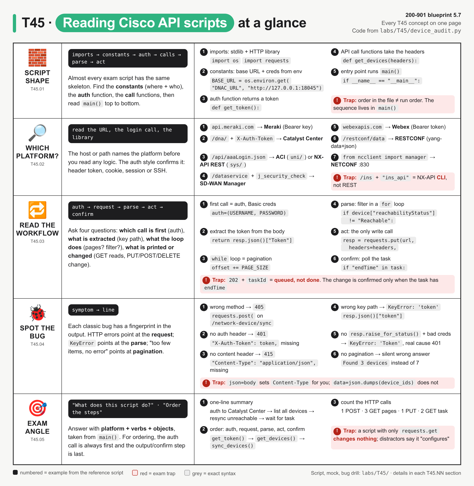
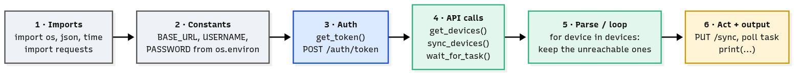
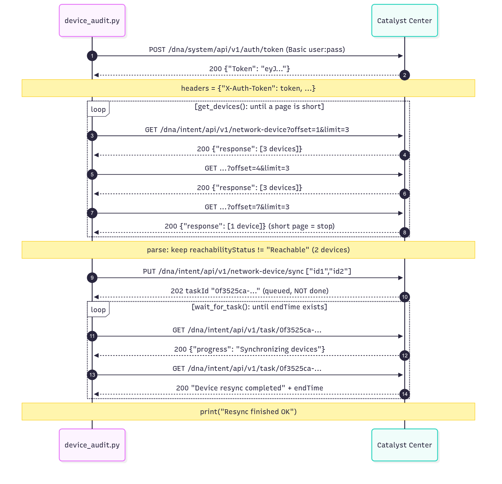
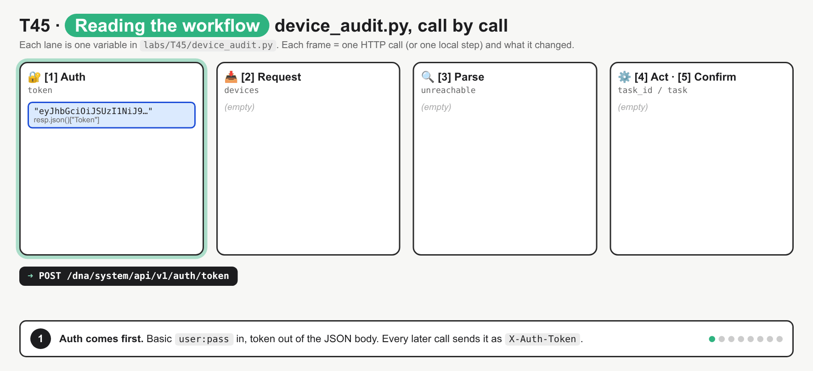
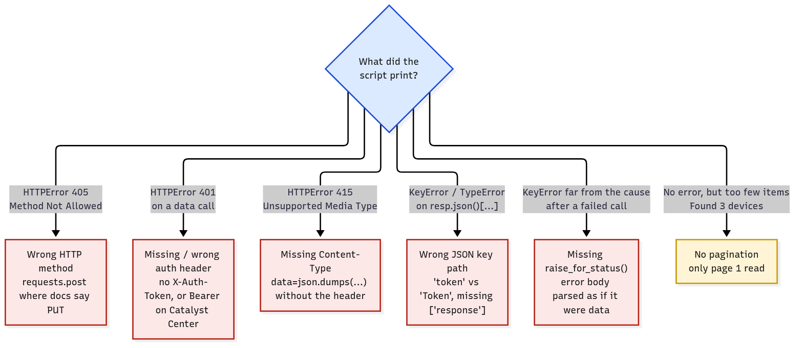

# T45 · Reading Python scripts using Cisco APIs

> Owner: **Bob** · Blueprint: **5.7** · CBT coverage: **Full** · Learn by 2026-10-18 · Teach-back 2026-10-20



*Every T45 concept on one page. Rows are concept groups (IDs under the icon), numbered items are lines from `labs/T45/device_audit.py` (or the platform fingerprint table), and red boxes are exam traps.*

## TL;DR (teach-back card)

- **Same skeleton every time:** imports → constants (base URL, creds from env) → `get_token()` → call functions → `main()` that loops, filters and acts. Read `main()` for the order. The definition order in the file doesn't tell you the run order.
- **Name the platform from the URL before reading any logic:** `api.meraki.com` = Meraki, `/dna/` + `X-Auth-Token` = Catalyst Center, `/api/aaaLogin.json` = ACI or NX-API REST, `/dataservice` = SD-WAN Manager, `webexapis.com` = Webex, `/restconf/data` = RESTCONF, `ncclient` = NETCONF.
- **Workflow = auth → request → parse → act → confirm.** A `while` loop around a GET is pagination. A `for` loop with an `if` is a filter. Only PUT/POST/PATCH/DELETE change anything. `202` + `taskId` means queued, not done.
- **Trap:** match the symptom to the bug. `405` = wrong method, `401` = missing auth header, `415` = missing `Content-Type`, `KeyError` = wrong key path *or* a missing `raise_for_status()`, "too few items, no error" = no pagination.

## Concepts

Every section below reads the same script. Read it once first.

- `labs/T45/device_audit.py` (below) is the **reference script**. It logs in to Catalyst Center (DNA Center), lists every device page by page, finds the unreachable ones, asks Catalyst Center to resync them, and waits for the task to finish.
- `labs/T45/mock_catalyst_center.py` is a local stand-in for Catalyst Center. It uses the Python standard library only, listens on `http://127.0.0.1:18045`, and returns JSON shaped like the official API docs. Its page size is capped at 3 (the real cap is 500), so pagination shows up with 7 devices.
- To run both: `bash labs/T45/run_lab.sh`. The script needs `requests`.
- Platform details live in the platform notes: [T20 Catalyst Center](T20-catalyst-center-dna-center.md), [T18 Meraki](T18-meraki.md), [T19 ACI](T19-aci.md), [T22 SD-WAN](T22-catalyst-sd-wan.md), [T16 RESTCONF](T16-restconf.md), [T15 NETCONF](T15-netconf.md), [T17 IOS XE / NX-OS APIs](T17-iosxe-nxos-device-apis.md), [T42 Webex](T42-webex-webex-devices.md). The `requests` library itself is Beedy's [T11](../bee/T11-python-requests-scripting.md), and auth types are [T10](../bee/T10-api-authentication.md).

**`labs/T45/device_audit.py`**

```python
"""T45 reference script: find unreachable devices in Catalyst Center and resync them.

Shape of almost every Cisco API script on the exam:
  imports -> constants -> auth -> API call functions -> parse/loop -> act -> output
Run against the local mock:  bash labs/T45/run_lab.sh
"""
import json
import os
import time

import requests

# ---- constants: where, who, how ----------------------------------------------
BASE_URL = os.environ.get("DNAC_URL", "http://127.0.0.1:18045")
USERNAME = os.environ.get("DNAC_USER", "devnetuser")
PASSWORD = os.environ.get("DNAC_PASS", "Cisco123!")
VERIFY_TLS = os.environ.get("DNAC_VERIFY", "false").lower() == "true"
PAGE_SIZE = int(os.environ.get("DNAC_PAGE_SIZE", "3"))   # real API max is 500


def get_token():
    """[1] AUTH: POST user:pass as Basic auth, read the token from the JSON body."""
    url = f"{BASE_URL}/dna/system/api/v1/auth/token"
    resp = requests.post(url, auth=(USERNAME, PASSWORD), verify=VERIFY_TLS, timeout=10)
    resp.raise_for_status()                       # 401 stops here, with a clear error
    return resp.json()["Token"]                   # key is "Token", capital T


def get_devices(headers):
    """[2] REQUEST: GET every device, one page at a time (offset is 1-based)."""
    url = f"{BASE_URL}/dna/intent/api/v1/network-device"
    devices, offset = [], 1
    while True:
        params = {"offset": offset, "limit": PAGE_SIZE}
        resp = requests.get(url, headers=headers, params=params, verify=VERIFY_TLS, timeout=10)
        resp.raise_for_status()
        page = resp.json()["response"]            # the list sits under "response"
        devices.extend(page)
        if len(page) < PAGE_SIZE:                 # short page = last page
            return devices
        offset += PAGE_SIZE


def sync_devices(headers, device_ids):
    """[4] ACT: ask Catalyst Center to resync these devices; returns a task id."""
    url = f"{BASE_URL}/dna/intent/api/v1/network-device/sync"
    resp = requests.put(url, headers=headers, params={"forceSync": "false"},
                        data=json.dumps(device_ids), verify=VERIFY_TLS, timeout=10)
    resp.raise_for_status()                       # 202 Accepted = queued, not finished
    return resp.json()["response"]["taskId"]


def wait_for_task(headers, task_id):
    """[5] CONFIRM: poll the task until it has an endTime."""
    url = f"{BASE_URL}/dna/intent/api/v1/task/{task_id}"
    for _ in range(10):
        task = requests.get(url, headers=headers, verify=VERIFY_TLS, timeout=10).json()["response"]
        print(f"    task {task_id[:8]}: {task['progress']}")
        if "endTime" in task:
            return not task["isError"]
        time.sleep(1)
    return False


def main():
    token = get_token()
    headers = {
        "X-Auth-Token": token,                    # Catalyst Center header, not "Authorization"
        "Content-Type": "application/json",
        "Accept": "application/json",
    }
    devices = get_devices(headers)
    print(f"Found {len(devices)} devices")

    # [3] PARSE: loop over the list, pick fields, filter
    unreachable = []
    for device in devices:
        print(f"  {device['hostname']:<14} {device['managementIpAddress']:<13} "
              f"{device['platformId']:<15} {device['reachabilityStatus']}")
        if device["reachabilityStatus"] != "Reachable":
            unreachable.append(device)

    if not unreachable:
        print("All devices reachable, nothing to do")
        return
    print(f"Resyncing {len(unreachable)}: {', '.join(d['hostname'] for d in unreachable)}")
    task_id = sync_devices(headers, [d["id"] for d in unreachable])
    ok = wait_for_task(headers, task_id)
    print("Resync finished OK" if ok else "Resync failed or timed out")


if __name__ == "__main__":
    main()
```

**Output** (`T45_TRACE=1 bash labs/T45/run_lab.sh`). The last block is the mock's own log of every call it received, in order:

```
Found 7 devices
  cat9k-core-1   10.10.20.81   C9300-24U       Reachable
  cat9k-acc-1    10.10.20.82   C9300-48P       Reachable
  cat9k-acc-2    10.10.20.83   C9300-48P       Reachable
  isr4k-edge-1   10.10.20.84   ISR4451-X/K9    Unreachable
  cat9k-acc-3    10.10.20.85   C9200L-24P-4G   Reachable
  c9800-wlc-1    10.10.20.86   C9800-CL-K9     Reachable
  cat9k-acc-4    10.10.20.87   C9300-48P       Unreachable
Resyncing 2: isr4k-edge-1, cat9k-acc-4
    task 0f3525ca: Synchronizing devices
    task 0f3525ca: Device resync completed
Resync finished OK

== Calls the mock received, in order ==
POST /dna/system/api/v1/auth/token -> 200
GET  /dna/intent/api/v1/network-device?offset=1&limit=3 -> 200
GET  /dna/intent/api/v1/network-device?offset=4&limit=3 -> 200
GET  /dna/intent/api/v1/network-device?offset=7&limit=3 -> 200
PUT  /dna/intent/api/v1/network-device/sync?forceSync=false -> 202
GET  /dna/intent/api/v1/task/0f3525ca-53d7-5861-8b9d-30488c8a7a85 -> 200
GET  /dna/intent/api/v1/task/0f3525ca-53d7-5861-8b9d-30488c8a7a85 -> 200
```

### T45.01 · Typical script structure

**Must cover:**

- [x] Imports → constants (base URL, credentials from env) → auth function → API call functions → parse/loop → output

**Notes:**



*The six layers, left to right, with the names they have in `device_audit.py`. Grey = setup, blue = auth, green = read calls and parsing, yellow = the part that changes something.*

- **Why it matters:** exam scripts are 15–40 lines with no comments. If you know the skeleton, you can drop each line into a slot instead of reading it word by word.
- **1 · Imports.** These tell you which tools the script uses, and often the platform.
  - `import requests` = a REST API over HTTP(S).
  - `from ncclient import manager` = NETCONF over SSH.
  - `import json` = it builds a body by hand (`json.dumps`). `import os` = it reads env vars. `import time` = it waits or polls.
  - An SDK import names the platform outright: `import meraki`, `from dnacentersdk import api`, `from webexpythonsdk import WebexAPI`.
- **2 · Constants.** UPPER_CASE names at the top. They answer *where* and *who*.
  - `BASE_URL = os.environ.get("DNAC_URL", "http://127.0.0.1:18045")` holds the scheme, host and port. The paths get appended later.
  - Credentials come from `os.environ`, never as literals. `os.environ.get("X", default)` returns the default if the var is unset. `os.environ["X"]` raises `KeyError` instead.
  - `VERIFY_TLS` ends up in `verify=`. `verify=False` skips the certificate check (lab boxes with self-signed certs) and makes `requests` print an `InsecureRequestWarning`.
- **3 · Auth function.** `get_token()` is **one call** that turns credentials into something reusable (a token or a cookie), and **returns** it.
  - Spot it by the `/auth`, `/login`, `aaaLogin` or `j_security_check` path, and by `auth=(USERNAME, PASSWORD)` (HTTP Basic).
- **4 · API call functions.** `get_devices(headers)`, `sync_devices(headers, device_ids)` and `wait_for_task(headers, task_id)`. One function per endpoint. Each one builds a URL, sends one method, checks the status and returns the useful part of the JSON.
- **5 · Parse / loop.** In `main()`, `for device in devices:` walks the list, picks fields (`device['hostname']`) and filters (`if device["reachabilityStatus"] != "Reachable":`).
- **6 · Act + output.** The write call (`sync_devices` → `requests.put`) and the `print()` lines. A script without the act layer is a **report** and changes nothing.
- `if __name__ == "__main__": main()` means the code runs when the file is executed, not when it's imported ([T02](../bee/T02-functions-classes-modules.md) covers this).

### T45.02 · Recognise the platform

**Must cover:**

- [x] api.meraki.com → Meraki; /dna/ → Catalyst Center; /api/aaaLogin → ACI/NX-API; /dataservice → SD-WAN; webexapis.com → Webex; /restconf/data → RESTCONF; ncclient → NETCONF

**Notes:**

- **Method:** read the URL first (host, then path), then the login call, then the header that carries the credential. Two of the three nearly always agree.
- In `device_audit.py`: the path `/dna/system/api/v1/auth/token` and the header `X-Auth-Token` → Catalyst Center.

| Fingerprint in the script | Platform | Auth you'll see | Data shape to expect |
|---|---|---|---|
| `https://api.meraki.com/api/v1/...` | **Meraki Dashboard** (cloud) | `Authorization: Bearer <API key>` (v0 used `X-Cisco-Meraki-API-Key`) | plain JSON list/dict, e.g. `orgs[0]["id"]` |
| `/dna/system/api/v1/auth/token`, `/dna/intent/api/v1/...` | **Catalyst Center (DNA Center)** | POST Basic → `{"Token": ...}` → header `X-Auth-Token` | `{"response": [...], "version": ...}` |
| `/api/aaaLogin.json` + `uni/`, `fvTenant`, `/api/class/` | **ACI (APIC)** | POST `{"aaaUser": {"attributes": {"name", "pwd"}}}` → cookie `APIC-cookie` | `{"imdata": [{"fvTenant": {"attributes": {...}}}]}` |
| `/api/aaaLogin.json` + `sys/`, `/api/mo/sys/...` | **NX-API REST** (Nexus DME) | same `aaaLogin` payload → session cookie | `imdata` → class name → `attributes` |
| `/ins` + `"ins_api"` (or JSON-RPC `"method": "cli"`) | **NX-API CLI** (Nexus) | HTTP Basic on each call (cookie `nxapi_auth` after) | `ins_api` → `outputs` → `output` → `body` |
| `/j_security_check`, `/dataservice/...` | **Catalyst SD-WAN Manager (vManage)** | form POST `j_username`/`j_password` → `JSESSIONID` cookie, then `GET /dataservice/client/token` → `X-XSRF-TOKEN` | `{"data": [...]}` |
| `https://webexapis.com/v1/...` | **Webex** | `Authorization: Bearer <token>` | `{"items": [...]}` for lists |
| `/restconf/data/<module>:<container>` | **RESTCONF** on IOS XE / NX-OS | HTTP Basic, `Accept: application/yang-data+json` | `{"ietf-interfaces:interfaces": {"interface": [...]}}` |
| `from ncclient import manager`, `port=830` | **NETCONF** | SSH username/password (or key) | XML: `reply.data_xml` |

- **Close calls:**
  - `/api/aaaLogin.json` alone doesn't decide it. Look at the object path: `uni/...` (tenants, `fv*` classes) = ACI; `sys/...` (`l1PhysIf`, `sys/intf`) = Nexus NX-API REST.
  - `/ins` is NX-API **CLI** (it wraps show commands). `/api/mo/...` is NX-API **REST**.
  - `/restconf/` is a device API (one router). `/dna/` and `/dataservice` are **controller** APIs (many devices). See [T12](T12-automation-foundations-controller-vs-device.md).
  - Bearer header alone doesn't pick a platform: Meraki and Webex both use it. Fall back to the host name.
- Drill: `python3 labs/T45/whose_api.py labs/T45/snippets/*.py labs/T45/device_audit.py` runs this table as code (Examples §3).

### T45.03 · Read the workflow

**Must cover:**

- [x] Which call happens first (auth), what data is extracted, what the loop does, what gets printed or changed

**Notes:**



*The 7 calls in the order the mock logged them. Notice the two loops: one reads pages, the other polls a task. Only call 9 (PUT) changes anything.*



*Animated: auth → page 1 → page 2 → page 3 (short page, stop) → filter → PUT sync (202) → poll task → task done. It fixes two misconceptions: that one GET returns the whole inventory, and that a `202` means the change is finished.*

Answer four questions, in this order:

1. **Which call happens first?** The auth call, nearly always. In `main()`, `token = get_token()` comes before anything else.
   - `get_token()` POSTs Basic credentials and reads `resp.json()["Token"]`.
   - The token then goes into the `headers` dict, which **every** later call sends (REST is stateless, [T07](../bee/T07-rest-fundamentals-http-codes.md)).
2. **What data is extracted?** Follow the key path after `.json()`:
   - `resp.json()["Token"]` → a string.
   - `resp.json()["response"]` → the list of device dicts. Catalyst Center wraps everything in `"response"`.
   - `device["hostname"]`, `device["managementIpAddress"]`, `device["platformId"]`, `device["reachabilityStatus"]` → the fields that get printed or tested.
   - `resp.json()["response"]["taskId"]` → a nested dict inside `"response"`.
3. **What does the loop do?**
   - `while True:` + `offset += PAGE_SIZE` + `if len(page) < PAGE_SIZE: return` = **pagination**. It keeps asking for the next page until one comes back short. Catalyst Center's `offset` is **1-based**: pages start at 1, 4, 7 here, or 1, 501, 1001 with `limit=500`.
   - `for device in devices:` + `if ... != "Reachable":` + `.append` = **filter**. This one is local, with no API calls.
   - `for _ in range(10):` + `time.sleep(1)` + `if "endTime" in task:` = **polling** with a cap of 10 tries.
4. **What gets printed or changed?**
   - Printed: the device table, the hostnames being resynced, the task progress, and a final OK/failed line.
   - Changed: only `requests.put(.../network-device/sync)`. Every other call is a GET or the login POST, which change nothing on the network.
   - The PUT returns `202` and a `taskId`. The work runs **asynchronously**, so `wait_for_task()` polls `GET /dna/intent/api/v1/task/{taskId}` until `endTime` appears.
- Reading `requests` calls quickly ([T11](../bee/T11-python-requests-scripting.md) has the full API):
  - `params=` → query string (`?offset=1&limit=3`).
  - `data=` → raw body (a string, so it needs a `Content-Type` header). `json=` → serialises the body and sets `Content-Type: application/json` itself.
  - `auth=(u, p)` → HTTP Basic header.
  - `headers=` → custom headers (the token).
  - `timeout=10` → give up after 10 s instead of hanging.

### T45.04 · Spot bugs

**Must cover:**

- [x] Wrong HTTP method, missing auth/content headers, wrong JSON key path, missing raise_for_status, no pagination

**Notes:**



*Start from what the script printed. Red = the script crashes with a clue. Yellow = the worst kind, with no error and a wrong answer.*

All six bugs were planted one at a time in a **copy** of `device_audit.py` by `labs/T45/break_it.sh`, and run against the mock. The output is real (Examples §2).

| # | Bug (edit made) | Symptom | Why |
|---|---|---|---|
| 1 | **Wrong HTTP method:** `requests.put(` → `requests.post(` in `sync_devices()` | `HTTPError: 405 Client Error: Method Not Allowed` | the URI exists, but the docs say PUT. Check the method against the API doc table |
| 2 | **Missing auth header:** delete `"X-Auth-Token": token,` | `HTTPError: 401 Client Error: Unauthorized` on the **first GET** | login worked, but the token never went out. Catalyst Center wants `X-Auth-Token`, not `Authorization: Bearer` |
| 3 | **Missing content header:** delete `"Content-Type": "application/json",` | `HTTPError: 415 Client Error: Unsupported Media Type` on the PUT | `data=json.dumps(...)` sends a string with no type. GETs still work, because they have no body |
| 4 | **Wrong JSON key path:** `["Token"]` → `["token"]` | `KeyError: 'token'` | JSON keys are case-sensitive. Print `resp.json()` once and copy the exact path |
| 5 | **Missing `raise_for_status()`** in `get_token()`, run with a wrong password | `KeyError: 'Token'` (with it: `HTTPError: 401 ... auth/token`) | the 401 error body has no `Token` key, so the script fails one line later with a misleading message |
| 6 | **No pagination:** `if len(page) < PAGE_SIZE:` → `if True:` | `Found 3 devices` · `All devices reachable, nothing to do` | no error at all. Both unreachable devices were on pages 2 and 3 |

- **What `raise_for_status()` does:** it raises `requests.exceptions.HTTPError` for any 4xx/5xx, and does nothing for 2xx/3xx. Without it, `requests` returns the error response as if it had worked. The script only notices when it reads the body.
- **Other bugs the exam likes:**
  - **Wrong URL join:** `BASE_URL + "dna/..."` with no slash, or a doubled `//`.
  - **Wrong base for the platform:** `/api/v1` on a Catalyst Center script, or `/dna/` on a Meraki one.
  - **Token sent the wrong way:** `Authorization: Bearer` to Catalyst Center, or `X-Auth-Token` to Meraki.
  - **`params=` vs `json=` mixed up:** filters sent as a body on a GET.
  - **`.json()` on a `204`:** no body, so it raises `JSONDecodeError`.
  - **Indexing a list like a dict:** `resp.json()["response"]["hostname"]` → `TypeError: list indices must be integers or slices, not str`.
  - **Loop variable unused:** `for device in devices: print(devices["hostname"])`.

### T45.05 · Exam angle

**Must cover:**

- [x] "What does this script do?" and put-the-steps-in-order questions

**Notes:**

- **"What does this script do?"** Build the answer as **platform + verbs + objects**, all taken from `main()`.
  1. Platform from T45.02: `/dna/` → Catalyst Center.
  2. Verbs from the methods: GET = lists/retrieves, POST = creates/logs in, PUT = updates/triggers, DELETE = removes.
  3. Objects from the paths: `network-device`, `network-device/sync`, `task`.
  4. The filter from the `if`: `reachabilityStatus != "Reachable"`.
  - → "Authenticates to Catalyst Center, retrieves all network devices, resyncs the unreachable ones and waits for the resync task to finish."
- **How the wrong answers are built:**
  - **wrong platform** (e.g. says Meraki for a `/dna/` script)
  - **wrong verb** (says "configures" for a GET-only script, or "deletes" for a PUT)
  - **wrong scope** (says "all devices" when there's an `if` filter)
  - **wrong output** (says "writes a file" when it only `print`s)
- **"Put the steps in order"** (drag-and-drop):
  1. import libraries / set constants
  2. authenticate and get the token
  3. build headers with the token
  4. GET the data (loop over pages)
  5. parse/filter the JSON
  6. act (PUT/POST/DELETE)
  7. confirm / print
  - Auth is never after a data call. Parsing is never before the GET that fetched the data.
- **"Which line…?" questions:** be ready to point at the line that:
  - sends the credentials (`auth=(USERNAME, PASSWORD)`)
  - extracts the token (`["Token"]`)
  - makes the script read more than one page (`offset += PAGE_SIZE`)
  - makes a change (`requests.put`)
- **Fill-in-the-blank:** usually the method (`requests.put`), the header name (`X-Auth-Token`), the key (`"response"`), or `raise_for_status`.

## Exam traps

- **File order ≠ run order.** Functions are defined top-down, but `main()` decides the order they run in. `sync_devices` is defined before `main` and still runs after `get_devices`.
- **GET-only script = report.** It changes nothing on the network, however many loops it has. Look for `put`/`post`/`patch`/`delete` (other than the login POST).
- **Login POST is not a "create".** `POST /auth/token` or `/api/aaaLogin.json` creates a session, not a network object.
- **`202 Accepted` + `taskId`/`executionId`** = queued. The change is confirmed only by polling the task. The script that stops after the PUT hasn't confirmed anything.
- **Catalyst Center header** is `X-Auth-Token`. Meraki and Webex use `Authorization: Bearer`. ACI and SD-WAN Manager use **cookies** (`APIC-cookie`, `JSESSIONID`), and SD-WAN adds `X-XSRF-TOKEN` for POSTs.
- **Catalyst Center token key** is `"Token"` (capital T). The list is under `"response"`. ACI data is under `"imdata"`, SD-WAN under `"data"`, Webex lists under `"items"`.
- **`/api/aaaLogin.json` = ACI or NX-API REST.** Decide by the object path: `uni/` = ACI, `sys/` = Nexus.
- **`json=` vs `data=`:** `json=payload` serialises and sets `Content-Type: application/json`. `data=json.dumps(payload)` needs the header added by hand, or you get `415`.
- **No `raise_for_status()`** → the failure shows up later as a `KeyError`/`TypeError` on the error body. The real cause is the HTTP status of the call before it.
- **No pagination** = silent wrong answer. A list call that returns exactly `limit` items (500 on Catalyst Center) is a hint that there are more pages.
- **`offset` is 1-based** on Catalyst Center (`offset=1` is the first device). Many other APIs use 0-based offsets or cursor links, so check the doc.

## Examples

### 1. Run the reference script

The mock is stdlib-only. The script needs `requests` (it's already in the Docker lab image).

```bash
python3 -m venv /tmp/t45-venv
/tmp/t45-venv/bin/pip install requests
PYTHON=/tmp/t45-venv/bin/python bash labs/T45/run_lab.sh            # mock + device_audit.py
T45_TRACE=1 PYTHON=/tmp/t45-venv/bin/python bash labs/T45/run_lab.sh # + every call the mock saw
```

By hand, in two terminals:

```bash
python3 labs/T45/mock_catalyst_center.py                # terminal 1: leave running
/tmp/t45-venv/bin/python labs/T45/device_audit.py      # terminal 2
```

In the lab container (the mock and the script share the container's localhost):

```bash
docker build --tag ccna-auto-lab:latest --file labs/Dockerfile labs/
docker run --rm --volume "$(pwd)":/work --workdir /work ccna-auto-lab:latest bash labs/T45/run_lab.sh
```

### 2. Spot-the-bug drill (`labs/T45/break_it.sh`)

This plants each bug from T45.04 in a temporary copy, runs it against the mock and prints only the lines that matter. `device_audit.py` itself is never edited.

```bash
#!/usr/bin/env bash
# T45 spot-the-bug drill: plant one classic bug at a time in a COPY of device_audit.py,
# run it against the mock, and show the symptom. The original file is never changed.
# Run via the lab wrapper (it starts the mock):  bash labs/T45/run_lab.sh labs/T45/break_it.sh
set -u
HERE="$(cd "$(dirname "$0")" && pwd)"
PY="${PYTHON:-python3}"
WORK="$(mktemp -d)"
trap 'rm -rf "$WORK"' EXIT

# plant <n> <title> <old text> <new text> [extra env]
plant() {
  local n="$1" title="$2" old="$3" new="$4" extra="${5:-}"
  "$PY" - "$HERE/device_audit.py" "$WORK/bug$n.py" "$old" "$new" <<'EOF'
import sys
src, dst, old, new = sys.argv[1:5]
text = open(src).read()
assert old in text, f"pattern not found: {old!r}"
open(dst, "w").write(text.replace(old, new, 1))
EOF
  echo "== Bug $n: $title"
  env $extra "$PY" "$WORK/bug$n.py" 2>&1 \
    | grep -E '^(Found|Resyncing|All devices|Resync finished|[A-Za-z.]*Error)' \
    | sed 's/^/   /'
  echo
}

plant 1 "wrong HTTP method (POST instead of PUT on /sync)" \
  'resp = requests.put(url' 'resp = requests.post(url'

plant 2 "missing auth header (X-Auth-Token line deleted)" \
  '"X-Auth-Token": token,' ''

plant 3 "missing content header (Content-Type line deleted)" \
  '"Content-Type": "application/json",' ''

plant 4 "wrong JSON key path (token instead of Token)" \
  'resp.json()["Token"]' 'resp.json()["token"]'

echo "== Bug 5a: wrong password WITH raise_for_status (the correct script)"
DNAC_PASS=wrong "$PY" "$HERE/device_audit.py" 2>&1 | grep -E '^requests\.exceptions' | sed 's/^/   /'
echo
plant 5b "wrong password, raise_for_status() deleted from get_token()" \
  'resp.raise_for_status()                       # 401 stops here, with a clear error' \
  '# raise_for_status() deleted' DNAC_PASS=wrong

plant 6 "no pagination (loop returns after the first page)" \
  'if len(page) < PAGE_SIZE:' 'if True:'
```

Output (`PYTHON=/tmp/t45-venv/bin/python bash labs/T45/run_lab.sh labs/T45/break_it.sh`):

```
== Bug 1: wrong HTTP method (POST instead of PUT on /sync)
   Found 7 devices
   Resyncing 2: isr4k-edge-1, cat9k-acc-4
   requests.exceptions.HTTPError: 405 Client Error: Method Not Allowed for url: http://127.0.0.1:18045/dna/intent/api/v1/network-device/sync?forceSync=false

== Bug 2: missing auth header (X-Auth-Token line deleted)
   requests.exceptions.HTTPError: 401 Client Error: Unauthorized for url: http://127.0.0.1:18045/dna/intent/api/v1/network-device?offset=1&limit=3

== Bug 3: missing content header (Content-Type line deleted)
   Found 7 devices
   Resyncing 2: isr4k-edge-1, cat9k-acc-4
   requests.exceptions.HTTPError: 415 Client Error: Unsupported Media Type for url: http://127.0.0.1:18045/dna/intent/api/v1/network-device/sync?forceSync=false

== Bug 4: wrong JSON key path (token instead of Token)
   KeyError: 'token'

== Bug 5a: wrong password WITH raise_for_status (the correct script)
   requests.exceptions.HTTPError: 401 Client Error: Unauthorized for url: http://127.0.0.1:18045/dna/system/api/v1/auth/token

== Bug 5b: wrong password, raise_for_status() deleted from get_token()
   KeyError: 'Token'

== Bug 6: no pagination (loop returns after the first page)
   Found 3 devices
   All devices reachable, nothing to do
```

- Bugs 1 and 3 get through auth and the GETs, then fail on the PUT. The output shows how far the script got before the error, which narrows down where to look.
- Bug 5a vs 5b is the reason `raise_for_status()` exists: the same wrong password gives a clear `401 ... auth/token` with it, and a misleading `KeyError: 'Token'` without it.
- Bug 6 is the only one with **no error**. Count the devices before trusting the answer.

### 3. Name-that-platform drill (`labs/T45/snippets/`, `labs/T45/whose_api.py`)

Eight short excerpts, written the way exam exhibits look. They are for reading only: they target real hosts through env vars and aren't run here. Name the platform of each before opening the answer.

**`labs/T45/snippets/a.py`**

```python
import os
import requests

API_KEY = os.environ["API_KEY"]
url = "https://api.meraki.com/api/v1/organizations"
headers = {"Authorization": f"Bearer {API_KEY}", "Accept": "application/json"}
orgs = requests.get(url, headers=headers, timeout=10).json()
for org in orgs:
    print(org["id"], org["name"])
```

**`labs/T45/snippets/b.py`**

```python
import os
import requests

HOST = os.environ["HOST"]
login = {"aaaUser": {"attributes": {"name": os.environ["USER"], "pwd": os.environ["PASS"]}}}
session = requests.Session()
session.post(f"https://{HOST}/api/aaaLogin.json", json=login, verify=False).raise_for_status()
tenants = session.get(f"https://{HOST}/api/class/fvTenant.json", verify=False).json()
for item in tenants["imdata"]:
    print(item["fvTenant"]["attributes"]["dn"])      # e.g. uni/tn-common
```

**`labs/T45/snippets/c.py`**

```python
import os
import requests

HOST = os.environ["HOST"]
session = requests.Session()
session.post(f"https://{HOST}/j_security_check",
             data={"j_username": os.environ["USER"], "j_password": os.environ["PASS"]}, verify=False)
xsrf = session.get(f"https://{HOST}/dataservice/client/token", verify=False).text
session.headers["X-XSRF-TOKEN"] = xsrf
for dev in session.get(f"https://{HOST}/dataservice/device", verify=False).json()["data"]:
    print(dev["host-name"], dev["reachability"])
```

**`labs/T45/snippets/d.py`**

```python
import os
import requests

TOKEN = os.environ["TOKEN"]
url = "https://webexapis.com/v1/messages"
headers = {"Authorization": f"Bearer {TOKEN}", "Content-Type": "application/json"}
body = {"roomId": os.environ["ROOM_ID"], "markdown": "**2 devices unreachable**"}
resp = requests.post(url, headers=headers, json=body, timeout=10)
resp.raise_for_status()
print(resp.json()["id"])
```

**`labs/T45/snippets/e.py`**

```python
import os
import requests

HOST = os.environ["HOST"]
url = f"https://{HOST}/restconf/data/ietf-interfaces:interfaces"
headers = {"Accept": "application/yang-data+json"}
resp = requests.get(url, headers=headers, auth=(os.environ["USER"], os.environ["PASS"]), verify=False)
resp.raise_for_status()
for intf in resp.json()["ietf-interfaces:interfaces"]["interface"]:
    print(intf["name"], intf["enabled"])
```

**`labs/T45/snippets/f.py`**

```python
import os
from ncclient import manager

with manager.connect(host=os.environ["HOST"], port=830, username=os.environ["USER"],
                     password=os.environ["PASS"], hostkey_verify=False) as m:
    for capability in m.server_capabilities:
        print(capability)
    reply = m.get_config(source="running")
    print(reply.data_xml[:200])
```

**`labs/T45/snippets/g.py`**

```python
import os
import requests

HOST = os.environ["HOST"]
payload = {"ins_api": {"version": "1.0", "type": "cli_show", "chunk": "0", "sid": "1",
                       "input": "show version", "output_format": "json"}}
resp = requests.post(f"https://{HOST}/ins", json=payload,
                     auth=(os.environ["USER"], os.environ["PASS"]), verify=False)
body = resp.json()["ins_api"]["outputs"]["output"]["body"]
print(body["nxos_ver_str"])
```

**`labs/T45/snippets/h.py`**

```python
import os
import requests

HOST = os.environ["HOST"]
login = {"aaaUser": {"attributes": {"name": os.environ["USER"], "pwd": os.environ["PASS"]}}}
session = requests.Session()
session.post(f"https://{HOST}/api/aaaLogin.json", json=login, verify=False).raise_for_status()
intf = session.get(f"https://{HOST}/api/mo/sys/intf/phys-[eth1/1].json", verify=False).json()
print(intf["imdata"][0]["l1PhysIf"]["attributes"]["adminSt"])
```


<details><summary>Answers (real output of whose_api.py)</summary>

```bash
python3 labs/T45/whose_api.py labs/T45/snippets/*.py labs/T45/device_audit.py
```

```
a.py             Meraki Dashboard API                   <- cloud host api.meraki.com
b.py             ACI (APIC)                             <- login path /api/aaaLogin
c.py             Catalyst SD-WAN Manager (vManage)      <- URL path /dataservice
d.py             Webex API                              <- cloud host webexapis.com
e.py             RESTCONF on IOS XE / NX-OS             <- URL path /restconf/
f.py             NETCONF (ncclient, SSH port 830)       <- library ncclient
g.py             NX-API CLI on Nexus (POST /ins)        <- JSON body "ins_api"
h.py             NX-API REST on Nexus (DN starts sys/)  <- login path /api/aaaLogin
device_audit.py  Catalyst Center (DNA Center)           <- URL path /dna/
```

- `b.py` vs `h.py`: same `aaaLogin` payload. `fvTenant` / `uni/tn-common` = ACI; `sys/intf/phys-[eth1/1]` = Nexus NX-API REST.
- `g.py`: `/ins` + `ins_api` is NX-API **CLI** (a show command wrapped in JSON).
- `e.py` vs `f.py`: both read the device's YANG data, but RESTCONF over HTTPS vs NETCONF over SSH :830.
</details>

`labs/T45/whose_api.py`:

```python
"""T45 drill: name the Cisco platform a script talks to, from the URL/library fingerprints.

Usage:  python3 labs/T45/whose_api.py labs/T45/snippets/*.py labs/T45/device_audit.py
Reads each file as text (nothing is executed) and prints the first fingerprint it finds.
Order matters: the more specific markers are checked first.
"""
import sys

FINGERPRINTS = [
    # (marker in the script text, platform, what the marker is)
    ("ncclient", "NETCONF (ncclient, SSH port 830)", "library"),
    ("/restconf/", "RESTCONF on IOS XE / NX-OS", "URL path"),
    ("api.meraki.com", "Meraki Dashboard API", "cloud host"),
    ("webexapis.com", "Webex API", "cloud host"),
    ("/dataservice", "Catalyst SD-WAN Manager (vManage)", "URL path"),
    ("j_security_check", "Catalyst SD-WAN Manager (vManage)", "login path"),
    ("/dna/", "Catalyst Center (DNA Center)", "URL path"),
    ("/api/aaaLogin", None, "login path"),          # ACI or NX-API REST: decide below
    ('"ins_api"', "NX-API CLI on Nexus (POST /ins)", "JSON body"),
]


def identify(text):
    for marker, platform, kind in FINGERPRINTS:
        if marker in text:
            if platform is None:                      # same login, different object tree
                platform = ("ACI (APIC)" if "uni/" in text or "fvTenant" in text
                            else "NX-API REST on Nexus (DN starts sys/)")
            return platform, f"{kind} {marker}"
    return "unknown", "no fingerprint"


def main():
    for path in sys.argv[1:]:
        with open(path) as handle:
            platform, evidence = identify(handle.read())
        print(f"{path.rsplit('/', 1)[-1]:<16} {platform:<38} <- {evidence}")


if __name__ == "__main__":
    main()
```

### 4. Read-it-cold drill (30 seconds each)

For any script in the platform notes (for example `labs/T20/catc_inventory.py` or `labs/T18/meraki_requests.py`), write one line per question before running it:

1. Platform? (URL/host/library)
2. First call? (auth path + how the credential travels)
3. What is extracted? (the full key path after `.json()`)
4. What does each loop do? (pages / filter / poll)
5. What is printed or changed? (any PUT/POST/PATCH/DELETE besides login?)

Then run it and check your answers against the output.

## Practice questions

**Q1.** Refer to the exhibit.

```python
import requests, os
BASE = "https://" + os.environ["HOST"]
r = requests.post(BASE + "/dna/system/api/v1/auth/token",
                  auth=(os.environ["USER"], os.environ["PASS"]), verify=False)
token = r.json()["Token"]
r = requests.get(BASE + "/dna/intent/api/v1/network-device",
                 headers={"X-Auth-Token": token}, verify=False)
for d in r.json()["response"]:
    if d["softwareVersion"] != "17.9.4a":
        print(d["hostname"], d["softwareVersion"])
```

What does the script do?
A. Upgrades every Catalyst Center device to 17.9.4a
B. Lists Meraki devices that aren't on 17.9.4a
C. Prints the hostname and version of Catalyst Center devices that aren't on 17.9.4a
D. Prints every device on the first page of Catalyst Center

<details><summary>Answer</summary>

**C.** `/dna/` + `X-Auth-Token` = Catalyst Center. There's only a GET, so nothing is changed (rules out A), and the `if` filters by version (rules out D). Strictly, it only sees the first page because there's no pagination, but C is the best description of its intent. (T45.02, T45.05)
</details>

**Q2.** Put the steps of `device_audit.py` in the order they run: parse the devices for unreachable ones · PUT the device ids to `/network-device/sync` · POST credentials to `/auth/token` · GET `/network-device` page by page · poll `/task/{taskId}` until `endTime` · build the `X-Auth-Token` header

<details><summary>Answer</summary>

POST `/auth/token` → build the `X-Auth-Token` header → GET `/network-device` page by page → parse for unreachable → PUT `/network-device/sync` → poll `/task/{taskId}`. Auth first, act last, confirm after the act. (T45.03)
</details>

**Q3.** A script logs in to Catalyst Center successfully, but its first `GET /dna/intent/api/v1/network-device` returns `401`. The headers dict is `{"Authorization": f"Bearer {token}", "Accept": "application/json"}`. What fixes it?
A. Change the GET to a POST  B. Use the header `X-Auth-Token: <token>`  C. Add `Content-Type: application/json`  D. Add `raise_for_status()`

<details><summary>Answer</summary>

**B.** Catalyst Center reads the token from `X-Auth-Token`. Bearer is the Meraki/Webex style. `raise_for_status()` would only make the 401 clearer, not fix it. (T45.04)
</details>

**Q4.** Complete the line so that the script reads every device, not only the first page:

```python
devices, offset = [], 1
while True:
    page = requests.get(url, headers=headers,
                        params={"offset": offset, "limit": 500}).json()["response"]
    devices.extend(page)
    if len(page) < 500:
        break
    ____________
```

<details><summary>Answer</summary>

**`offset += 500`**. Catalyst Center's `offset` is 1-based, so the pages start at 1, 501, 1001 and so on. Without the increment, the loop asks for page 1 forever. (T45.03, T45.04)
</details>

**Q5.** Which fingerprint identifies a script that talks to Catalyst SD-WAN Manager?
A. `https://api.meraki.com/api/v1/organizations`  B. `POST /api/aaaLogin.json`  C. `POST /j_security_check` then `GET /dataservice/device`  D. `GET /restconf/data/ietf-interfaces:interfaces`

<details><summary>Answer</summary>

**C.** A form login to `j_security_check` gives a `JSESSIONID` cookie, and the data lives under `/dataservice`. B is ACI or NX-API REST, and D is RESTCONF on a device. (T45.02)
</details>

**Q6.** A script reads `token = requests.post(url, auth=(user, pw)).json()["Token"]` and crashes with `KeyError: 'Token'`. The credentials were mistyped. Which change makes the real cause visible?
A. Use `["token"]`  B. Call `raise_for_status()` on the response before `.json()`  C. Add `verify=False`  D. Wrap the line in `for` loop

<details><summary>Answer</summary>

**B.** The server answered `401` with an error body that has no `Token` key. `raise_for_status()` raises `HTTPError: 401 Client Error: Unauthorized` at the right line instead. A would just give a different `KeyError`. (T45.04)
</details>

**Q7.** Refer to the exhibit.

```python
resp = requests.post(f"{BASE}/dna/intent/api/v1/network-device/sync",
                     headers=headers, data=json.dumps(ids))
```

The API doc lists `PUT /dna/intent/api/v1/network-device/sync`. Which response does the script get?
A. `201 Created`  B. `202 Accepted`  C. `405 Method Not Allowed`  D. `415 Unsupported Media Type`

<details><summary>Answer</summary>

**C.** The path exists but not with POST, so the server returns `405` (with an `Allow: PUT` header in the mock). It's the same symptom as bug 1 in `break_it.sh`. (T45.04)
</details>

**Q8.** The script in Q1 is ported from Catalyst Center to ACI. Which two parts must change? (Choose two.)
A. the auth URL and request body  B. the key path `r.json()["response"]`  C. `import requests, os`  D. reading credentials with `os.environ`

<details><summary>Answer</summary>

**A, B.** ACI logs in with `POST /api/aaaLogin.json` and an `aaaUser` JSON body, and gets a cookie back instead of an `X-Auth-Token`. Its data comes back under `"imdata"`, not `"response"`. The library and the way credentials are read don't depend on the platform. (T45.02)
</details>

## Study aids

| Aid | Type | Title | Est. min | Resource |
|---|---|---|---|---|
| T45.1 | Drill | Identify the workflow of Cisco API scripts | 40 | CBT supplemental files + DevNet Code Exchange |

- Skip / low priority: n/a
- The drills in Examples §2–§4 are the hands-on version of T45.1.

## Sources

- Overview image: HTML source `assets/T45/00-overview.html`, rendered to PNG (see `assets/README.md`). Diagrams: Mermaid sources in `assets/T45/*.mmd`. Animation: `assets/T45/04-workflow-anim.html` → `04-workflow.gif`.
- Catalyst Center Authentication API (`POST /dna/system/api/v1/auth/token`, Basic auth, `Token` key, `X-Auth-Token` header, 1 h lifetime): https://developer.cisco.com/docs/dna-center/authentication-api/
- Catalyst Center Get Device list (`GET /dna/intent/api/v1/network-device`, 1-based `offset`, `limit` max 500, `response` field names): https://developer.cisco.com/docs/dna-center/get-device-list/
- Catalyst Center Sync Devices (`PUT /dna/intent/api/v1/network-device/sync`, body = list of ids, `forceSync`, `taskId` response): https://developer.cisco.com/docs/dna-center/sync-devices/
- Catalyst Center Get Task by Id (`GET /dna/intent/api/v1/task/{taskId}`, `progress`, `isError`, `endTime`): https://developer.cisco.com/docs/dna-center/get-task-by-id/
- Meraki Dashboard API authorization (`https://api.meraki.com/api/v1`, `Authorization: Bearer`, v0 `X-Cisco-Meraki-API-Key`): https://developer.cisco.com/meraki/api-v1/authorization/
- Catalyst SD-WAN Manager authentication (`/j_security_check`, `JSESSIONID`, `/dataservice/client/token`, `X-XSRF-TOKEN`): https://developer.cisco.com/docs/sdwan/authentication/
- APIC REST API configuration guide (`aaaLogin`, `aaaUser` name/pwd payload, token in cookie and body): https://www.cisco.com/c/en/us/td/docs/dcn/aci/apic/all/apic-rest-api-configuration-guide/cisco-apic-rest-api-configuration-guide-42x-and-later/m_using_the_rest_api.html
- ACI programmability getting started (aaaLogin JSON body): https://developer.cisco.com/docs/aci/getting-started
- Programmability and Automation with Cisco Open NX-OS (NX-API CLI `nxapi_auth` cookie, NX-API REST aaaLogin): https://www.cisco.com/c/dam/en/us/td/docs/switches/datacenter/nexus9000/sw/open_nxos/programmability/guide/Programmability_Open_NX-OS.pdf
- RFC 8040 RESTCONF (`/restconf/data`, `application/yang-data+json`): https://www.rfc-editor.org/rfc/rfc8040
- RFC 6241 NETCONF and ncclient docs (`manager.connect`, port 830): https://www.rfc-editor.org/rfc/rfc6241 · https://ncclient.readthedocs.io/en/latest/manager.html
- Webex personal access token (`Authorization: Bearer` header on every request, host `webexapis.com`): https://developer.webex.com/messaging/docs/getting-your-personal-access-token
- Requests docs (`raise_for_status`, `json=` sets Content-Type, `params=`, `auth=`, `timeout=`): https://requests.readthedocs.io/en/latest/user/quickstart/
- Cisco 200-901 v1.1 exam topics (5.7): https://learningcontent.cisco.com/documents/marketing/exam-topics/200-901-CCNAAUTO_v.1.1.pdf

## To verify

- ⚠ **Not run against a live sandbox.** `sandboxdnac.cisco.com` answered, but `POST /dna/system/api/v1/auth/token` with the long-published `devnetuser` / `Cisco123!` returned `401` (10 Oct 2026). The current sandbox credentials have probably changed; check them at developer.cisco.com/sandbox. On the same day, [T20](T20-catalyst-center-dna-center.md) ran live against `sandboxdnac2.cisco.com`, so try that host first. All output in this note comes from the local mock, whose paths and JSON shapes follow the docs listed in Sources.
- ⚠ **Sync Devices status code:** the 3.1.6 doc shows the `taskId` schema under `200` and lists `202` as another success code. The mock returns `202`, the usual async answer. Check what a real Catalyst Center returns. `raise_for_status()` accepts either.
- ⚠ **`GET /dna/intent/api/v1/task/{taskId}`** carries a "Sunset" banner in the 3.1.6 docs, so a newer tasks endpoint may replace it. Confirm the current path before relying on it outside the exam.
- ⚠ **Snippet excerpts** (`labs/T45/snippets/`) weren't run against real devices. Field names in `c.py` (`host-name`, `reachability` under `data`) and `g.py` (`nxos_ver_str`) are from prior knowledge of SD-WAN Manager and NX-API output. Check them in the T22 and T17 notes or a sandbox.
- ⚠ Webex list responses wrapped in `"items"`: from prior knowledge, not confirmed in a doc this session.
- ⚠ **Docker command** in Examples §1 wasn't run here (the lab image isn't built in this session). `requests` is already in the image's package list.
- The reference script, `break_it.sh` (all 7 runs) and `whose_api.py` were run locally (Python 3.10, requests 2.34.2), and the output pasted above is real. The `taskId` is a fixed UUID derived from the device ids, so it's identical on every run.
